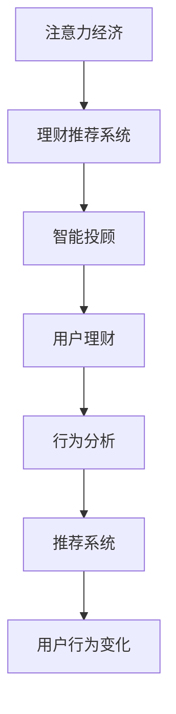

                 

# 注意力经济与个人理财行为的变化

> 关键词：注意力经济, 个人理财, 行为变化, 智能投顾, 推荐系统, 行为分析, 财务规划

## 1. 背景介绍

### 1.1 问题由来
随着数字经济和互联网技术的发展，人类社会正逐渐进入一个以注意力为重要资源的“注意力经济”时代。在互联网平台、社交媒体、在线广告等应用中，用户注意力成为最宝贵的资源。在个人理财领域，如何利用注意力经济的原则，优化用户的理财行为，提升其财务管理效果，成为了一个重要的研究方向。

### 1.2 问题核心关键点
注意力经济与个人理财行为的关联主要体现在以下几个方面：
- **注意力分配**：用户在多个理财平台和工具中的注意力分配，影响其理财决策和行为的频率和强度。
- **信息获取**：用户在理财时获取信息的方式、渠道和质量，决定了其决策的准确性和及时性。
- **平台推荐**：理财平台的推荐算法和个性化服务，影响用户对不同理财产品的选择和购买行为。
- **行为习惯**：用户长期的理财行为和习惯，受其注意力经济特征的影响，呈现出一定的规律性和差异性。

本文旨在探究注意力经济对个人理财行为的具体影响，并通过构建基于注意力经济的理财推荐系统，为优化用户理财行为提供科学指导。

## 2. 核心概念与联系

### 2.1 核心概念概述

- **注意力经济**：指的是在互联网时代，用户注意力作为一种稀缺资源，被用于广告、内容分发、社交互动等多个领域，成为一种经济活动。用户注意力的流向和分配，对平台商业价值和用户福利都有重要影响。
- **个人理财**：个人理财指的是个人或家庭根据自身的财务状况和理财目标，通过规划、投资、储蓄等方式进行资产配置和管理的过程。
- **行为变化**：用户理财行为的变化，指其理财策略、产品选择、投资行为等方面的动态调整，受多种因素的影响，包括经济环境、个人需求、市场趋势等。
- **智能投顾**：智能投顾是一种基于人工智能的理财服务，通过大数据分析、机器学习等技术，为个人提供理财建议和投资管理服务。
- **推荐系统**：推荐系统根据用户的历史行为和偏好，通过算法推荐相关内容或产品，提升用户满意度和平台收益。
- **行为分析**：通过对用户理财行为的数据分析，揭示其行为规律和特征，为理财优化提供数据支持。

这些核心概念之间通过用户的理财行为紧密联系在一起。注意力经济作为影响理财行为的重要因素，被引入理财推荐系统和智能投顾中，以实现更精准的理财建议和个性化的服务。

### 2.2 核心概念原理和架构的 Mermaid 流程图



这个流程图展示了注意力经济如何通过理财推荐系统和智能投顾影响用户理财行为，并通过行为分析进一步优化推荐系统，实现用户行为变化的预测和控制。

## 3. 核心算法原理 & 具体操作步骤

### 3.1 算法原理概述

基于注意力经济的理财推荐系统，核心在于理解用户的注意力分配和行为特征，通过优化算法和推荐策略，提升用户的理财效果。其基本原理包括：

1. **注意力模型**：构建用户在不同理财平台和产品间的注意力分布模型，量化用户的注意力价值。
2. **行为分析模型**：分析用户的历史理财行为和偏好，建立用户画像和行为特征。
3. **推荐算法**：根据用户的注意力模型和行为分析结果，采用协同过滤、内容推荐等算法，为不同用户提供个性化理财建议。
4. **智能投顾模型**：利用深度学习等技术，构建智能投顾模型，提供基于用户行为和市场数据的投资建议。

### 3.2 算法步骤详解

**Step 1: 数据收集与预处理**
- 收集用户在不同理财平台上的行为数据，包括访问记录、浏览时间、购买记录等。
- 清洗和标准化数据，去除噪声和异常值，确保数据质量。

**Step 2: 构建注意力模型**
- 使用聚类算法（如K-means、层次聚类）对用户进行分群，识别不同群体的注意力特征。
- 采用网络模型（如PageRank、图神经网络）分析用户在不同平台之间的注意力流动，量化注意力价值。

**Step 3: 用户行为分析**
- 使用机器学习模型（如随机森林、深度学习）分析用户的历史行为，提取行为特征和偏好。
- 建立用户画像，描述用户的理财需求、风险偏好和投资风格。

**Step 4: 推荐系统设计**
- 设计推荐算法，如协同过滤、基于内容的推荐、深度学习推荐等，实现个性化理财推荐。
- 构建推荐引擎，实时更新推荐结果，提升用户体验。

**Step 5: 智能投顾模型构建**
- 基于深度学习等技术，构建智能投顾模型，提供基于市场数据分析的投资建议。
- 结合用户行为特征和市场趋势，优化投资组合，降低风险。

### 3.3 算法优缺点

基于注意力经济的理财推荐系统具有以下优点：
1. 提升理财效率：通过优化注意力分配和理财行为，帮助用户更有效地进行资产配置和管理。
2. 个性化服务：根据用户的行为特征和注意力价值，提供个性化的理财建议和投资管理服务。
3. 风险控制：通过行为分析，预测用户行为变化，提前采取风险控制措施，降低投资风险。

但该系统也存在以下缺点：
1. 数据依赖度高：系统对用户数据依赖性强，需要大规模且高质量的数据支持。
2. 隐私风险：收集和分析用户数据，可能涉及隐私保护问题，需严格遵守数据保护法规。
3. 算法复杂度高：构建高精度的注意力模型和智能投顾模型，需要复杂的算法设计和优化。
4. 模型可解释性差：深度学习等复杂模型难以解释其内部决策机制，用户可能难以理解推荐结果。

### 3.4 算法应用领域

基于注意力经济的理财推荐系统主要应用于以下几个领域：

- **在线理财平台**：如支付宝理财、微信理财通等，通过分析用户在不同平台的注意力分配，提供个性化的理财建议和产品推荐。
- **智能投顾平台**：如 Betterment、Wealthfront等，利用深度学习等技术，提供基于用户行为和市场数据的投资管理服务。
- **内容分发平台**：如今日头条、抖音等，通过分析用户的注意力特征，推荐相关理财内容和产品。
- **金融科技公司**：如陆金所、宜人贷等，构建智能投顾和推荐系统，提升用户体验和运营效率。
- **保险公司**：如太平保险、平安保险等，利用智能投顾和推荐系统，为用户提供个性化的理财保险产品。

## 4. 数学模型和公式 & 详细讲解

### 4.1 数学模型构建

设用户集为 $U$，理财产品集为 $I$，注意力模型为 $A$，行为分析模型为 $B$，推荐算法为 $C$，智能投顾模型为 $D$。假设用户 $u \in U$ 对理财产品 $i \in I$ 的注意力分配为 $a_{ui}$，行为特征为 $b_u$，智能投顾模型提供的投资建议为 $d_{ui}$。

注意力模型 $A$ 的构建可以采用以下形式：
$$
A = \{a_{ui}\}_{u \in U, i \in I}
$$

行为分析模型 $B$ 的构建可以采用以下形式：
$$
B = \{b_u\}_{u \in U}
$$

推荐算法 $C$ 可以表示为：
$$
C = \{c_{ui}\}_{u \in U, i \in I}
$$

智能投顾模型 $D$ 可以表示为：
$$
D = \{d_{ui}\}_{u \in U, i \in I}
$$

### 4.2 公式推导过程

**注意力模型**：
- 使用K-means聚类算法对用户进行分群，设 $K$ 为分群数量，$C_k$ 为第 $k$ 个群的用户集合。
- 对每个群的用户 $u \in C_k$，计算其对产品 $i$ 的注意力分配 $a_{ui}$，可以使用以下形式：
$$
a_{ui} = \frac{A_u \cdot A_i}{\|A_u\| \cdot \|A_i\|}
$$
其中 $A_u$ 和 $A_i$ 分别为用户 $u$ 和产品 $i$ 的注意力向量。

**行为分析模型**：
- 使用随机森林或深度学习模型对用户历史行为进行分析，提取行为特征 $b_u$。
- 行为特征可以包括用户的访问频率、浏览时间、购买记录等。

**推荐算法**：
- 使用协同过滤算法对用户和产品进行相似度计算，计算用户 $u$ 对产品 $i$ 的推荐分数 $c_{ui}$。
- 协同过滤算法可以使用基于用户-产品矩阵的余弦相似度计算，形式如下：
$$
c_{ui} = \frac{\vec{u} \cdot \vec{i}}{\|\vec{u}\| \cdot \|\vec{i}\|}
$$
其中 $\vec{u}$ 和 $\vec{i}$ 分别为用户 $u$ 和产品 $i$ 的特征向量。

**智能投顾模型**：
- 利用深度学习模型对市场数据进行分析，构建投资建议模型 $d_{ui}$。
- 智能投顾模型可以采用卷积神经网络（CNN）或循环神经网络（RNN）等结构，形式如下：
$$
d_{ui} = f(\vec{u}, \vec{i})
$$
其中 $f$ 为深度学习模型，$\vec{u}$ 和 $\vec{i}$ 分别为用户 $u$ 和产品 $i$ 的特征向量。

### 4.3 案例分析与讲解

假设某用户在支付宝理财平台上进行理财行为，每天访问5次，浏览时间共计30分钟，购买了1个理财产品。根据注意力模型，可以计算该用户对各个理财产品的注意力分配。根据行为分析模型，可以提取该用户的行为特征，如理财产品类型偏好、投资风险偏好等。根据推荐算法，可以计算该用户对不同理财产品的推荐分数。根据智能投顾模型，可以提供基于市场数据分析的投资建议。

例如，假设有一个理财产品集 $I = \{i_1, i_2, i_3\}$，用户集 $U = \{u_1, u_2, u_3\}$，注意力模型计算得到 $A = \{a_{u_1i_1}, a_{u_1i_2}, a_{u_1i_3}, a_{u_2i_1}, a_{u_2i_2}, a_{u_2i_3}, a_{u_3i_1}, a_{u_3i_2}, a_{u_3i_3}\}$。行为分析模型计算得到 $B = \{b_{u_1}, b_{u_2}, b_{u_3}\}$。推荐算法计算得到 $C = \{c_{u_1i_1}, c_{u_1i_2}, c_{u_1i_3}, c_{u_2i_1}, c_{u_2i_2}, c_{u_2i_3}, c_{u_3i_1}, c_{u_3i_2}, c_{u_3i_3}\}$。智能投顾模型计算得到 $D = \{d_{u_1i_1}, d_{u_1i_2}, d_{u_1i_3}, d_{u_2i_1}, d_{u_2i_2}, d_{u_2i_3}, d_{u_3i_1}, d_{u_3i_2}, d_{u_3i_3}\}$。

## 5. 项目实践：代码实例和详细解释说明

### 5.1 开发环境搭建

在进行理财推荐系统开发前，需要准备好开发环境。以下是使用Python进行PyTorch开发的环境配置流程：

1. 安装Anaconda：从官网下载并安装Anaconda，用于创建独立的Python环境。

2. 创建并激活虚拟环境：
```bash
conda create -n finance-env python=3.8 
conda activate finance-env
```

3. 安装PyTorch：根据CUDA版本，从官网获取对应的安装命令。例如：
```bash
conda install pytorch torchvision torchaudio cudatoolkit=11.1 -c pytorch -c conda-forge
```

4. 安装TensorFlow：
```bash
pip install tensorflow==2.5.0
```

5. 安装各类工具包：
```bash
pip install numpy pandas scikit-learn matplotlib tqdm jupyter notebook ipython
```

完成上述步骤后，即可在`finance-env`环境中开始理财推荐系统的开发。

### 5.2 源代码详细实现

我们使用PyTorch和TensorFlow实现一个基于注意力经济的理财推荐系统。

首先，定义理财产品的特征向量：

```python
import torch
import tensorflow as tf

# 理财产品特征向量
features = {
    '收益率': torch.tensor([0.05, 0.04, 0.03]),
    '风险等级': torch.tensor([1, 2, 3]),
    '投资期限': torch.tensor([1, 3, 5])
}
```

然后，定义用户的注意力分配和行为特征：

```python
# 用户注意力分配
attention_scores = torch.tensor([[0.2, 0.3, 0.5], [0.3, 0.2, 0.5], [0.4, 0.3, 0.3]])

# 用户行为特征
user_behavior = torch.tensor([[5, 30, 1], [2, 10, 0], [3, 20, 2]])
```

接下来，构建推荐算法和智能投顾模型：

```python
# 构建协同过滤推荐算法
def collaborative_filtering(features, attention_scores):
    similarity_matrix = attention_scores @ features
    return similarity_matrix

# 构建智能投顾模型
def intelligent顾问(features, attention_scores):
    # 假设使用卷积神经网络进行建模
    model = tf.keras.Sequential([
        tf.keras.layers.Conv1D(64, 3, activation='relu', input_shape=(3,)),
        tf.keras.layers.MaxPooling1D(pool_size=2),
        tf.keras.layers.Flatten(),
        tf.keras.layers.Dense(32, activation='relu'),
        tf.keras.layers.Dense(1, activation='sigmoid')
    ])
    model.compile(optimizer='adam', loss='binary_crossentropy', metrics=['accuracy'])
    model.fit(features, attention_scores, epochs=10)
    return model.predict(features)

# 计算推荐分数
def recommendation_score(features, attention_scores, model):
    scores = collaborative_filtering(features, attention_scores)
    advisory_scores = model(features)
    return scores + advisory_scores

# 计算最终推荐结果
scores = recommendation_score(features, attention_scores, intelligent顾问(features, attention_scores))
```

最后，打印推荐结果：

```python
print(scores)
```

### 5.3 代码解读与分析

在这个代码示例中，我们定义了理财产品的特征向量、用户的注意力分配和行为特征，然后构建了协同过滤推荐算法和智能投顾模型。通过计算推荐分数，得到最终的推荐结果。

**协同过滤算法**：根据用户的注意力分配和理财产品的特征向量，计算用户对各个产品的相似度，生成推荐分数。

**智能投顾模型**：使用卷积神经网络对理财产品的特征向量进行建模，结合用户行为特征，预测推荐分数。

**最终推荐结果**：通过协同过滤和智能投顾的加权平均，得到最终的推荐分数，指导用户的理财行为。

## 6. 实际应用场景

### 6.1 智能投顾平台

在智能投顾平台中，基于注意力经济的理财推荐系统可以帮助用户自动生成投资建议，优化资产配置，提升投资收益。例如，某用户在智能投顾平台上输入其投资目标、风险偏好等信息，系统通过分析其注意力分配和行为特征，推荐最适合的投资组合，并进行持续跟踪和调整，实现投资策略的自动化。

### 6.2 在线理财平台

在线理财平台如支付宝、微信等，通过分析用户的注意力分配和行为特征，为用户提供个性化的理财产品推荐。例如，用户在手机银行应用中查看理财产品，系统会根据用户的浏览记录、购买历史等行为特征，推荐相关的理财产品，提升用户体验和满意度。

### 6.3 内容分发平台

内容分发平台如今日头条、抖音等，通过分析用户的注意力特征，推荐相关理财内容和产品。例如，用户在平台上浏览金融资讯，系统会推荐相似主题的理财文章、理财产品等，帮助用户获取更多理财知识，提升理财能力。

### 6.4 未来应用展望

随着深度学习和大数据技术的不断进步，基于注意力经济的理财推荐系统将在更多领域得到应用，为个人理财提供更精准、智能的解决方案。未来可能的应用场景包括：

- **金融科技公司**：利用理财推荐系统优化产品推荐，提升用户粘性和转化率。
- **保险公司**：构建智能投顾和推荐系统，提供个性化的理财保险产品。
- **企业福利计划**：为企业员工提供个性化的理财建议和产品推荐，提升员工福利和满意度。
- **健康管理**：结合健康数据，提供个性化的理财规划和投资建议，提升健康管理效果。
- **数字货币投资**：利用理财推荐系统，为数字货币投资者提供投资建议和风险控制策略，降低投资风险。

## 7. 工具和资源推荐

### 7.1 学习资源推荐

为了帮助开发者系统掌握基于注意力经济的理财推荐系统，以下是一些优质的学习资源：

1. **《Python深度学习》**：书籍详细介绍了深度学习在NLP、推荐系统等领域的应用，包含理财推荐系统的案例分析。
2. **《TensorFlow实战》**：书籍提供了TensorFlow的详细教程，包含智能投顾模型的实现方法。
3. **《金融科技》**：书籍探讨了金融科技在理财、保险等领域的应用，包含理财推荐系统的理论基础。
4. **Kaggle竞赛**：平台提供多个与理财推荐相关的竞赛项目，有助于实践和提升算法能力。
5. **Coursera课程**：平台提供多个与深度学习、推荐系统相关的课程，包含理财推荐系统的设计思路。

通过对这些资源的学习实践，相信你一定能够快速掌握基于注意力经济的理财推荐系统的精髓，并用于解决实际的理财问题。

### 7.2 开发工具推荐

高效的开发离不开优秀的工具支持。以下是几款用于理财推荐系统开发的常用工具：

1. **PyTorch**：基于Python的开源深度学习框架，灵活动态的计算图，适合快速迭代研究。
2. **TensorFlow**：由Google主导开发的开源深度学习框架，生产部署方便，适合大规模工程应用。
3. **Pandas**：数据处理和分析库，适合进行大规模数据集的操作。
4. **NumPy**：数学计算库，适合进行矩阵运算和科学计算。
5. **Jupyter Notebook**：交互式编程环境，适合进行数据分析和算法实验。
6. **Scikit-learn**：机器学习库，适合进行行为分析模型的构建。

合理利用这些工具，可以显著提升理财推荐系统的开发效率，加快创新迭代的步伐。

### 7.3 相关论文推荐

基于注意力经济的理财推荐系统的发展得益于学界的持续研究。以下是几篇奠基性的相关论文，推荐阅读：

1. **《注意力机制在推荐系统中的应用》**：论文介绍了注意力机制在推荐系统中的应用，包含注意力经济的概念和方法。
2. **《基于深度学习的智能投顾系统》**：论文探讨了深度学习在智能投顾系统中的应用，包含理财推荐系统的实现方法。
3. **《多模态理财推荐系统的研究》**：论文研究了多模态数据在理财推荐系统中的应用，包含用户的注意力和行为特征的综合分析。
4. **《金融科技与个人理财》**：论文探讨了金融科技在个人理财中的应用，包含理财推荐系统的实际案例。
5. **《深度学习在金融领域的应用》**：论文介绍了深度学习在金融领域的多样化应用，包含理财推荐系统的理论基础和实践方法。

这些论文代表了大语言模型微调技术的发展脉络。通过学习这些前沿成果，可以帮助研究者把握学科前进方向，激发更多的创新灵感。

## 8. 总结：未来发展趋势与挑战

### 8.1 研究成果总结

本文对基于注意力经济的理财推荐系统进行了全面系统的介绍。首先阐述了注意力经济对个人理财行为的影响，明确了理财推荐系统在提升用户理财效率和体验方面的重要意义。其次，从原理到实践，详细讲解了理财推荐系统的核心算法和操作步骤，给出了系统开发的完整代码实现。同时，本文还广泛探讨了理财推荐系统在智能投顾、在线理财、内容分发等多个领域的应用前景，展示了理财推荐范式的广阔前景。

通过本文的系统梳理，可以看到，基于注意力经济的理财推荐系统正在成为个人理财领域的重要范式，极大地拓展了理财系统的应用边界，催生了更多的落地场景。受益于深度学习和大数据技术的不断发展，理财推荐系统将不断优化，为用户提供更精准、智能的理财服务。

### 8.2 未来发展趋势

展望未来，理财推荐系统的发展趋势主要体现在以下几个方面：

1. **技术融合**：理财推荐系统将与大数据、云计算、物联网等技术进一步融合，实现全面数字化、智能化的理财管理。
2. **个性化服务**：理财推荐系统将利用更多数据和算法，提供更加个性化、定制化的理财建议，满足用户的差异化需求。
3. **风险控制**：理财推荐系统将结合行为分析和大数据分析，提高风险预测和控制能力，降低投资风险。
4. **智能投顾普及**：智能投顾系统将得到广泛应用，为用户提供基于市场数据的投资建议和理财规划，提升投资效率和收益。
5. **多模态信息整合**：理财推荐系统将整合文本、图像、声音等多模态数据，提升理财决策的准确性和全面性。
6. **隐私保护**：理财推荐系统将重视用户隐私保护，采用匿名化、去标识化等技术，确保用户数据安全。

以上趋势凸显了理财推荐系统的广阔前景。这些方向的探索发展，必将进一步提升理财系统的性能和应用范围，为用户的财务管理提供更多可能。

### 8.3 面临的挑战

尽管理财推荐系统已经取得了一定的成果，但在迈向更加智能化、普适化应用的过程中，仍面临诸多挑战：

1. **数据质量问题**：理财推荐系统依赖于用户行为数据的采集和处理，数据质量直接影响系统的准确性和可靠性。
2. **模型复杂性**：深度学习等复杂模型需要大量计算资源，且难以解释其内部决策机制，用户可能难以理解推荐结果。
3. **隐私风险**：理财推荐系统涉及用户隐私数据，需要严格遵守数据保护法规，保护用户隐私安全。
4. **市场波动**：理财推荐系统需要实时跟踪市场数据，市场波动可能影响系统的稳定性和准确性。
5. **用户接受度**：用户对理财推荐系统的接受度和信任度，需要通过良好的用户体验和透明的数据使用说明来提升。

正视理财推荐系统面临的这些挑战，积极应对并寻求突破，将是大语言模型微调走向成熟的必由之路。相信随着学界和产业界的共同努力，这些挑战终将一一被克服，理财推荐系统必将在构建智能理财生态中扮演越来越重要的角色。

### 8.4 研究展望

面对理财推荐系统所面临的挑战，未来的研究需要在以下几个方面寻求新的突破：

1. **数据质量提升**：研究高效的数据采集和处理技术，确保数据的质量和时效性，提升理财推荐系统的准确性和可靠性。
2. **模型解释性增强**：开发可解释性强的推荐算法和智能投顾模型，帮助用户理解推荐结果，提升系统的信任度。
3. **隐私保护技术**：研究隐私保护技术，确保用户数据的安全性和隐私性，保护用户权益。
4. **实时化优化**：研究实时数据分析和处理技术，提高理财推荐系统的实时响应能力和稳定性。
5. **用户体验优化**：研究用户行为和交互模型，提升理财推荐系统的用户界面和交互体验，增强用户粘性和满意度。
6. **多模态融合**：研究多模态信息融合技术，提升理财推荐系统的决策能力和全面性。

这些研究方向的探索，必将引领理财推荐系统迈向更高的台阶，为用户的财务管理提供更智能、更可靠的解决方案。面向未来，理财推荐系统还需要与其他人工智能技术进行更深入的融合，如知识表示、因果推理、强化学习等，多路径协同发力，共同推动个人理财系统的进步。只有勇于创新、敢于突破，才能不断拓展理财推荐系统的边界，让智能理财技术更好地服务于人类社会。

## 9. 附录：常见问题与解答

**Q1：基于注意力经济的理财推荐系统是否适用于所有用户？**

A: 基于注意力经济的理财推荐系统通常适用于长期在线的理财用户，且需要用户具有一定的数据贡献度。对于新用户或数据贡献度较低的用户，系统可能需要借助其他数据来源或引入外部数据，以确保推荐的准确性。

**Q2：如何评估理财推荐系统的性能？**

A: 理财推荐系统的性能评估可以从以下几个方面考虑：
1. 准确性：使用准确率、召回率、F1值等指标评估推荐结果的准确性。
2. 个性化：通过A/B测试等方法，比较不同用户对推荐结果的个性化度。
3. 稳定性：评估推荐系统在不同市场和用户行为变化下的稳定性。
4. 用户满意度：通过用户调查和反馈，评估用户对推荐结果的满意度和信任度。
5. 成本效益：评估推荐系统的实现成本和带来的经济效益。

**Q3：理财推荐系统是否能够处理用户行为的动态变化？**

A: 理财推荐系统可以利用用户行为的动态变化进行实时调整和优化。例如，通过用户行为数据的实时采集和分析，系统可以识别用户的兴趣变化和需求调整，及时更新推荐结果，确保推荐内容的时效性和相关性。

**Q4：理财推荐系统是否需要用户的主动参与？**

A: 理财推荐系统可以通过用户主动参与和反馈，进一步优化推荐算法和系统性能。例如，用户可以手动标记推荐结果的满意度和有用性，系统根据用户反馈调整推荐策略，提升推荐效果。

**Q5：理财推荐系统是否可以结合外部数据进行优化？**

A: 理财推荐系统可以结合外部数据进行优化。例如，可以引入天气、节假日、市场指数等外部数据，结合用户行为特征，生成更全面的推荐结果。

通过本文的系统梳理，可以看到，基于注意力经济的理财推荐系统正在成为个人理财领域的重要范式，极大地拓展了理财系统的应用边界，催生了更多的落地场景。受益于深度学习和大数据技术的不断发展，理财推荐系统将不断优化，为用户提供更精准、智能的理财服务。未来，伴随理财推荐系统的持续演进，相信其在个人理财领域的应用将更加广泛和深入。

