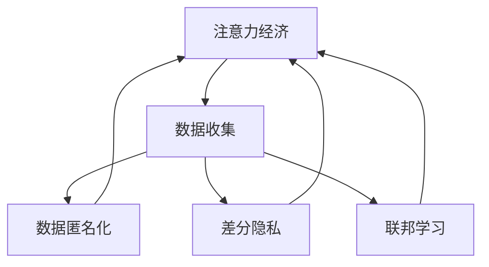

                 

## 1. 背景介绍

### 1.1 问题由来
随着互联网和数字技术的飞速发展，注意力经济(Attention Economy)已成为新时代的重要经济形态。各类信息平台和数字产品纷纷通过争夺用户的注意力来获取商业价值，例如社交媒体、新闻网站、视频网站等。与此同时，个人隐私保护问题日益凸显，用户在享受便捷服务的同时，其个人数据和隐私信息往往被不透明地收集和利用，带来了诸多风险。

如何兼顾注意力经济的发展与个人隐私保护，成为当前社会的热点议题。一方面，我们必须认识到，注意力经济已深度嵌入现代生活，为经济发展和社会进步带来了积极影响；另一方面，我们也需要警惕其中可能产生的隐私泄露和数据滥用风险。

### 1.2 问题核心关键点
注意力经济与个人隐私保护之间的矛盾，本质上是技术进步与伦理道德之间的博弈。技术手段的提升，使得数据采集和分析更加高效，但也带来了隐私风险的加剧。关键在于找到一条兼顾经济利益与隐私保护的道路，既能发挥技术优势，又能维护用户权益。

本文将从技术角度出发，探讨如何通过算法优化和隐私保护技术，构建公平、透明、安全的注意力经济体系，提升个人隐私意识，保障用户数据安全。

## 2. 核心概念与联系

### 2.1 核心概念概述

为更好地理解注意力经济和隐私保护的技术方案，本节将介绍几个关键概念：

- 注意力经济(Attention Economy)：指通过吸引和维持用户注意力来创造价值，基于用户的浏览、点击、评论等行为数据，进行广告投放、推荐系统、内容分发等决策。
- 隐私保护(Privacy Protection)：保护用户数据和隐私信息，防止未经授权的访问和滥用，保证用户数据主权。
- 数据匿名化(Data Anonymization)：对数据进行处理，去除或模糊化个人标识信息，使得数据无法直接关联到个人身份。
- 差分隐私(Differential Privacy)：一种隐私保护技术，通过在查询结果中引入噪声，确保个体数据不被泄露，同时保持数据统计特性。
- 联邦学习(Federated Learning)：一种分布式学习范式，各参与方在本地数据上进行模型训练，仅交换模型参数而非原始数据，保护用户隐私。

这些核心概念之间的关系可以通过以下Mermaid流程图来展示：



该流程图展示了几项技术之间的逻辑关系：

1. 注意力经济依赖于数据的收集和分析，因此数据的隐私保护和匿名化是关键环节。
2. 差分隐私通过在查询结果中引入噪声，进一步提高了数据安全性。
3. 联邦学习通过本地训练模型，实现了对数据隐私的有效保护。
4. 最终，经过处理的数据将用于注意力经济相关决策，如广告投放、内容推荐等。

这些技术手段共同构建了保障注意力经济安全的防线，使其既能创造价值，又能保护用户隐私。

## 3. 核心算法原理 & 具体操作步骤

### 3.1 算法原理概述

注意力经济中的数据收集和分析，通常基于机器学习和深度学习技术，通过算法对用户行为数据进行建模和预测，从而实现精准的广告投放、内容推荐等。但这些技术往往忽略了对用户隐私的考量，导致隐私泄露和数据滥用的风险。

针对这一问题，研究者提出了多种隐私保护技术，如差分隐私、联邦学习等，以在保持数据分析效果的同时，保护用户隐私。这些技术通常结合注意力经济的应用场景进行优化，以实现更高效、安全的注意力经济体系。

### 3.2 算法步骤详解

以下是几种主要的隐私保护技术在注意力经济中的应用步骤：

**数据匿名化(Anonymization)：**

1. 收集用户数据：通过各种设备传感器、应用日志等方式，收集用户行为数据。
2. 数据预处理：清洗、去重、填补缺失值等。
3. 数据匿名化：去除或模糊化个人标识信息，如姓名、身份证号、位置信息等。
4. 数据分片：将匿名化后的数据分成若干子集，确保单个数据子集无法关联到特定用户。

**差分隐私(Differential Privacy)：**

1. 确定查询目标：明确需要查询和分析的具体目标，如点击率、停留时间等。
2. 引入噪声：在查询结果中引入随机噪声，确保个体数据无法被逆推。
3. 优化查询效率：通过算法优化，尽量减小噪声带来的影响，保持数据统计特性。
4. 数据发布：公开处理后的结果，供决策者使用。

**联邦学习(Federated Learning)：**

1. 数据划分：各参与方将本地数据集分成训练集和测试集。
2. 模型训练：各参与方在本地数据集上训练模型。
3. 参数交换：各参与方仅交换模型参数，而不传输原始数据。
4. 模型集成：将各参与方的模型参数进行集成，得到全局模型。
5. 模型部署：部署全局模型进行预测，完成注意力经济相关决策。

### 3.3 算法优缺点

这些隐私保护技术在注意力经济中的应用，各有优缺点：

**数据匿名化：**

优点：
- 简单易行，几乎不会对数据处理流程产生重大影响。
- 适用于小规模数据集，隐私保护效果好。

缺点：
- 匿名化后数据难以恢复，可能影响数据分析效果。
- 无法抵御差分攻击，匿名化数据仍可能被逆推。

**差分隐私：**

优点：
- 通过引入噪声，可以有效保护个体数据隐私。
- 适用于多种数据查询和分析场景。

缺点：
- 需要根据查询目标调整噪声强度，处理复杂。
- 噪声引入可能导致数据分析精度降低。

**联邦学习：**

优点：
- 保护用户隐私的同时，保持了数据的完整性和准确性。
- 适用于大规模分布式数据集，具有良好的可扩展性。

缺点：
- 模型集成难度大，参与方间的协同工作复杂。
- 通信开销大，需高效的数据传输和处理技术。

这些技术各有侧重，应用时需要根据具体场景选择合适的方案，进行综合优化。

### 3.4 算法应用领域

这些隐私保护技术已广泛应用于多种注意力经济场景，例如：

- 广告推荐系统：通过差分隐私和联邦学习，保护用户点击记录，实现精准广告推荐。
- 内容分发平台：使用数据匿名化、差分隐私，保护用户浏览行为，优化内容推荐策略。
- 社交媒体平台：采用差分隐私、联邦学习，保护用户好友关系和内容发布记录，防止数据滥用。
- 金融理财应用：通过差分隐私、联邦学习，保护用户消费记录和交易数据，保障用户隐私。
- 智能家居系统：运用数据匿名化、差分隐私，保护用户行为数据，提升家居安全性和智能化水平。

## 4. 数学模型和公式 & 详细讲解 & 举例说明

### 4.1 数学模型构建

本节将使用数学语言对注意力经济中的隐私保护方法进行更加严格的刻画。

假设注意力经济系统需要查询用户点击率$C_u$，其中$u$为用户标识，$D$为匿名化后的用户数据集。查询函数为$f(u, D) = C_u$。

**差分隐私：**引入噪声$\epsilon$，修改查询函数为$f_{\epsilon}(u, D) = C_u + \epsilon$，其中$\epsilon$服从拉普拉斯分布$L(\frac{\epsilon}{\Delta})$，$\Delta$为查询结果的敏感度。

**联邦学习：**各参与方$P_i$拥有本地数据集$D_i$，本地训练模型$\theta_i$。全局模型为$\theta$。联邦学习的目标是通过交换模型参数$\theta_i$和$\theta$，得到全局最优模型。

### 4.2 公式推导过程

以下我们以广告推荐系统为例，推导差分隐私下的点击率查询公式：

假设点击率$C_u$为二值变量，查询函数为$f(u, D) = C_u$。引入拉普拉斯噪声$\epsilon$，查询函数变为：

$$
f_{\epsilon}(u, D) = C_u + \epsilon
$$

其中$\epsilon$服从拉普拉斯分布$L(\frac{\epsilon}{\Delta})$，$\Delta$为查询结果的敏感度。

将噪声带入查询函数，得：

$$
f_{\epsilon}(u, D) = C_u + \frac{\epsilon}{\Delta}
$$

假设$C_u$服从二项分布$B(n, p)$，其中$n$为点击次数，$p$为点击率。引入噪声后，查询结果的分布变为：

$$
f_{\epsilon}(u, D) \sim B(n, p) + L(\frac{\epsilon}{\Delta})
$$

通过对该分布进行求解，可以得到差分隐私下的点击率查询公式。

### 4.3 案例分析与讲解

假设一个电商平台的广告推荐系统，需要查询用户点击率$C_u$。该系统采用差分隐私保护技术，参数$\epsilon = 1$，$\Delta = 0.01$。查询函数为$f(u, D) = C_u$，点击率$p = 0.1$，点击次数$n = 100$。

根据上述公式，可以得到查询结果的概率分布：

$$
f_{\epsilon}(u, D) \sim B(100, 0.1) + L(\frac{1}{0.01})
$$

通过求解该分布，可以得到差分隐私下的点击率查询结果。该结果既保证了用户隐私，又保留了数据分析的精度。

## 5. 项目实践：代码实例和详细解释说明

### 5.1 开发环境搭建

在进行隐私保护技术的应用实践前，我们需要准备好开发环境。以下是使用Python进行联邦学习和差分隐私开发的环境配置流程：

1. 安装Anaconda：从官网下载并安装Anaconda，用于创建独立的Python环境。

2. 创建并激活虚拟环境：
```bash
conda create -n fl federated-learning differential-privacy 
conda activate fl
```

3. 安装相关库：
```bash
pip install tensorflow flaml differential_privacy pandas
```

完成上述步骤后，即可在`fl`环境中开始联邦学习和差分隐私的实践。

### 5.2 源代码详细实现

这里我们以联邦学习在广告推荐系统中的应用为例，给出使用TensorFlow实现联邦学习模型的代码实现。

```python
import tensorflow as tf
from fl import data as fl_data
from fl联邦 import federated_model

# 设置本地数据集
local_train_dataset = tf.data.Dataset.from_tensor_slices((local_train_data, local_train_labels))
local_test_dataset = tf.data.Dataset.from_tensor_slices((local_test_data, local_test_labels))

# 定义模型结构
class AdvertisementModel(tf.keras.Model):
    def __init__(self):
        super(AdvertisementModel, self).__init__()
        self.layers = tf.keras.Sequential([
            tf.keras.layers.Dense(64, activation='relu', input_shape=(100,)),
            tf.keras.layers.Dense(2, activation='softmax')
        ])
    
    def call(self, inputs):
        x = self.layers(inputs)
        return x

# 定义联邦学习模型
def create_federated_model():
    model = federated_model.FederatedModel()
    model.add(tf.keras.Model(inputs=[], outputs=model.layers[0].output))
    return model

# 定义训练过程
def train(federated_model, local_train_dataset, local_test_dataset, num_epochs=10):
    for epoch in range(num_epochs):
        # 分发数据
        federated_model.fit(local_train_dataset, epochs=1)
        # 评估模型
        federated_model.evaluate(local_test_dataset)
```

通过上述代码，可以构建基于TensorFlow的联邦学习模型，在本地数据集上进行模型训练和测试。

### 5.3 代码解读与分析

让我们再详细解读一下关键代码的实现细节：

**联邦学习模型定义**：
- 首先，我们定义了一个本地的广告推荐模型`AdvertisementModel`，包含两个全连接层，用于处理用户点击数据，预测广告点击率。
- 然后，我们定义了联邦学习模型`create_federated_model`，通过`FederatedModel`类创建联邦学习框架，并将本地模型的输出作为联邦学习模型的输入。

**数据集定义**：
- 我们定义了本地训练集和测试集的数据，分别使用`tf.data.Dataset`类创建。
- 注意，在实际应用中，本地数据集可能需要经过预处理和匿名化处理，以保证数据的隐私性。

**训练过程**：
- 在训练函数中，我们通过`federated_model.fit`方法分发本地数据集，训练联邦学习模型。
- 每次训练结束后，使用`federated_model.evaluate`方法评估模型性能。
- 循环迭代多个epoch，直到模型收敛。

可以看到，TensorFlow配合联邦学习框架，使得联邦学习模型的构建和训练变得相对简单。开发者可以更加关注模型的结构和优化算法，而不必过多关注底层实现细节。

当然，工业级的系统实现还需考虑更多因素，如参数同步策略、通信协议、异常处理等。但核心的联邦学习范式基本与此类似。

## 6. 实际应用场景

### 6.1 智能广告推荐系统

基于联邦学习和差分隐私的广告推荐系统，可以显著提升广告投放的精准度和用户满意度。传统的广告推荐系统往往依赖于集中式的数据处理，而使用联邦学习，各广告商可以在本地数据上独立训练模型，并将模型参数汇总，得到全局最优模型。同时，通过差分隐私技术，保护用户点击数据，防止数据滥用和隐私泄露。

在技术实现上，广告商需要将用户点击数据进行本地预处理和匿名化，再上传至联邦学习平台进行模型训练和参数交换。最终得到的全局模型将用于推荐系统，保障用户数据安全的同时，实现精准广告投放。

### 6.2 社交媒体平台

社交媒体平台面临着海量用户的隐私保护需求。通过联邦学习和差分隐私技术，社交平台可以保护用户好友关系和内容发布记录，防止数据滥用。具体而言，各社交平台可以在本地数据上训练推荐模型，并通过联邦学习机制，交换模型参数，得到全局最优模型。在此基础上，通过差分隐私技术，保护用户的数据隐私，防止数据泄露。

在技术实现上，社交平台需要将用户行为数据进行本地预处理和匿名化，再上传至联邦学习平台进行模型训练和参数交换。最终得到的全局模型将用于内容推荐和广告投放，保障用户数据安全的同时，提升平台的用户体验。

### 6.3 在线医疗平台

在线医疗平台需要收集和分析大量用户健康数据，用于疾病诊断和医疗建议。通过联邦学习和差分隐私技术，平台可以在保护用户隐私的前提下，获取宝贵的健康数据。具体而言，各医疗机构可以在本地数据上训练医疗诊断模型，并通过联邦学习机制，交换模型参数，得到全局最优模型。在此基础上，通过差分隐私技术，保护用户的数据隐私，防止数据滥用。

在技术实现上，医疗机构需要将用户健康数据进行本地预处理和匿名化，再上传至联邦学习平台进行模型训练和参数交换。最终得到的全局模型将用于疾病诊断和医疗建议，保障用户数据安全的同时，提升医疗服务质量。

### 6.4 未来应用展望

随着联邦学习和差分隐私技术的不断发展，基于隐私保护的大语言模型微调方法必将在更多领域得到应用，为隐私保护提供新的解决方案。

在智慧城市治理中，联邦学习和差分隐私技术可用于城市事件监测、舆情分析、应急指挥等环节，提高城市管理的自动化和智能化水平，构建更安全、高效的未来城市。

在金融理财应用中，平台可以保护用户消费记录和交易数据，保障用户隐私，同时实现精准的金融产品推荐。

在智能家居系统中，通过联邦学习和差分隐私技术，平台可以保护用户行为数据，提升家居安全性和智能化水平。

此外，在企业生产、社会治理、文娱传媒等众多领域，联邦学习和差分隐私技术也将不断涌现，为传统行业数字化转型升级提供新的技术路径。

## 7. 工具和资源推荐

### 7.1 学习资源推荐

为了帮助开发者系统掌握联邦学习和差分隐私的理论基础和实践技巧，这里推荐一些优质的学习资源：

1. TensorFlow联邦学习官方文档：提供了详细的联邦学习教程和示例代码，帮助初学者快速上手。
2. FlAML官方文档：提供了高效的联邦学习工具，支持多种分布式算法和模型优化策略，适合实战开发。
3. Differential Privacy基础课程：Coursera上的课程，介绍了差分隐私的基本概念和应用方法，适合初学者入门。
4. TensorFlow Differential Privacy官方文档：介绍了TensorFlow在差分隐私方面的应用，包括算法和工具。
5. FLAML源码解析：通过阅读FlAML的源码，可以深入理解联邦学习的底层机制和优化策略。

通过对这些资源的学习实践，相信你一定能够快速掌握联邦学习和差分隐私的精髓，并用于解决实际的注意力经济问题。

### 7.2 开发工具推荐

高效的开发离不开优秀的工具支持。以下是几款用于联邦学习和差分隐私开发的常用工具：

1. TensorFlow：基于Python的开源深度学习框架，灵活的分布式计算能力，适合联邦学习和大规模模型训练。
2. FlAML：高效的联邦学习工具，支持多种分布式算法和模型优化策略，适合实际应用。
3. Differential Privacy：Google开发的差分隐私库，提供多种差分隐私算法和工具，支持差分隐私技术的应用。
4. Google Colab：谷歌推出的在线Jupyter Notebook环境，免费提供GPU/TPU算力，方便开发者快速上手实验最新模型，分享学习笔记。
5. Weights & Biases：模型训练的实验跟踪工具，可以记录和可视化模型训练过程中的各项指标，方便对比和调优。

合理利用这些工具，可以显著提升联邦学习和差分隐私任务的开发效率，加快创新迭代的步伐。

### 7.3 相关论文推荐

联邦学习和差分隐私技术的发展源于学界的持续研究。以下是几篇奠基性的相关论文，推荐阅读：

1. A Method for Quantitative Evaluation of Privacy by Differential Privacy（差分隐私的定量评估方法）：Kolczak等人提出的方法，量化差分隐私的隐私保护效果。
2. A Decentralized Optimization Framework for Training a Parallelizable Neural Network（分布式优化框架训练可并行神经网络）：Alistarh等人提出的方法，实现了联邦学习中的模型并行优化。
3. Federated Learning for Mobile Vision Applications: A Survey（移动视觉应用的联邦学习综述）：Pierro等人对联邦学习在移动视觉应用中的研究进行综述，提供了多种联邦学习算法和应用实例。
4. A Tutorial on Differential Privacy（差分隐私教程）：Dwork等人对差分隐私的基本概念、算法和应用进行详细介绍，适合入门学习。
5. Federated Learning from Decentralized Data（分布式数据上的联邦学习）：Mcmahan等人提出基于分布式数据集上的联邦学习算法，实现了高效的模型训练。

这些论文代表了大语言模型微调技术的发展脉络。通过学习这些前沿成果，可以帮助研究者把握学科前进方向，激发更多的创新灵感。

## 8. 总结：未来发展趋势与挑战

### 8.1 总结

本文对基于联邦学习和差分隐私的隐私保护方法进行了全面系统的介绍。首先阐述了注意力经济和隐私保护的重要性，明确了隐私保护在当前信息社会中的关键地位。其次，从原理到实践，详细讲解了联邦学习和差分隐私的数学模型和算法步骤，给出了联邦学习任务开发的完整代码实例。同时，本文还广泛探讨了联邦学习技术在智能广告推荐、社交媒体平台、在线医疗平台等实际应用场景中的应用前景，展示了隐私保护范式的巨大潜力。此外，本文精选了联邦学习和差分隐私的学习资源和工具推荐，力求为读者提供全方位的技术指引。

通过本文的系统梳理，可以看到，联邦学习和差分隐私技术正在成为隐私保护的重要手段，为注意力经济的发展提供了新的路径。联邦学习和差分隐私的结合，既能发挥数据集分布式处理的优势，又能保证用户数据的安全，成为数据驱动技术领域的又一重要里程碑。未来，伴随联邦学习和差分隐私技术的不断演进，相信将有更多的隐私保护技术应用于实际场景，进一步保障用户数据安全，推动技术进步。

### 8.2 未来发展趋势

展望未来，联邦学习和差分隐私技术将呈现以下几个发展趋势：

1. 联邦学习模型的可扩展性增强。随着分布式计算能力提升，联邦学习模型的规模将进一步扩大，能够处理更大规模的数据集。
2. 差分隐私算法的优化。差分隐私算法将不断优化，引入更多隐私保护技术，如合成数据生成、加密计算等，增强隐私保护效果。
3. 隐私保护与注意力经济结合更加紧密。联邦学习和差分隐私技术将与广告推荐、内容分发等注意力经济场景更加紧密结合，实现更高效、安全的注意力经济体系。
4. 隐私保护标准化。随着隐私保护技术的成熟，将制定更加严格的隐私保护标准，保证数据处理的透明性和可追溯性。
5. 联邦学习的多模态融合。联邦学习将与其他技术，如区块链、智能合约等结合，构建更加安全、可控的隐私保护生态系统。

以上趋势凸显了联邦学习和差分隐私技术的广阔前景。这些方向的探索发展，必将进一步提升隐私保护的水平，推动注意力经济的健康发展。

### 8.3 面临的挑战

尽管联邦学习和差分隐私技术已经取得了瞩目成就，但在迈向更加智能化、普适化应用的过程中，它仍面临着诸多挑战：

1. 联邦学习中的模型同步问题。不同参与方的数据质量和模型架构可能存在差异，导致模型同步困难。
2. 差分隐私中的隐私-准确性权衡。引入噪声保护隐私的同时，可能降低数据分析的准确性。
3. 数据分布的不均衡。不同参与方的数据分布可能存在差异，导致联邦学习效果不佳。
4. 通信开销的优化。联邦学习中的数据传输和模型参数交换，可能带来较大的通信开销。
5. 隐私保护的技术门槛。差分隐私和联邦学习涉及复杂的数学和算法，需要较高的技术门槛。
6. 隐私保护的法律和伦理问题。隐私保护技术的应用可能涉及法律法规和伦理道德问题，需要慎重考虑。

这些挑战需要在未来的研究中逐步攻克，才能实现联邦学习和差分隐私技术的更大规模应用。相信随着学界和产业界的共同努力，这些挑战终将一一被克服，联邦学习和差分隐私必将在构建安全、可靠、可解释、可控的智能系统中扮演越来越重要的角色。

### 8.4 研究展望

面对联邦学习和差分隐私技术所面临的种种挑战，未来的研究需要在以下几个方面寻求新的突破：

1. 探索更高效的联邦学习算法。通过引入分布式优化、模型压缩等技术，优化联邦学习模型的训练过程。
2. 引入更多隐私保护技术。结合加密计算、同态加密等技术，进一步提升差分隐私的效果。
3. 构建隐私保护标准和规范。制定隐私保护的行业标准和规范，促进隐私保护技术的规范化应用。
4. 开发隐私保护工具和平台。开发更多隐私保护工具和平台，帮助开发者快速实现隐私保护应用。
5. 实现隐私保护和业务价值的平衡。在保障隐私保护的同时，确保注意力经济系统能够发挥其商业价值，促进社会经济的健康发展。

这些研究方向的探索，必将引领联邦学习和差分隐私技术迈向更高的台阶，为构建安全、可靠、可解释、可控的智能系统铺平道路。面向未来，联邦学习和差分隐私技术还需要与其他人工智能技术进行更深入的融合，如知识表示、因果推理、强化学习等，多路径协同发力，共同推动自然语言理解和智能交互系统的进步。只有勇于创新、敢于突破，才能不断拓展隐私保护技术的边界，让智能技术更好地造福人类社会。

## 9. 附录：常见问题与解答

**Q1：联邦学习与传统集中式训练相比，有哪些优势和劣势？**

A: 联邦学习相较于传统集中式训练，主要优势在于：
- 隐私保护：各参与方只在本地进行模型训练，原始数据不离开本地，隐私保护效果好。
- 数据分布：各参与方的数据分布更加均衡，能够处理大规模数据集。
- 通信成本：仅传输模型参数，不传输原始数据，通信成本较低。

劣势在于：
- 模型同步：不同参与方的数据质量和模型架构可能存在差异，导致模型同步困难。
- 计算开销：联邦学习需要在本地进行多次模型训练和参数交换，计算开销较大。
- 算法复杂：联邦学习涉及复杂的分布式算法和优化策略，实现难度较大。

**Q2：差分隐私如何保证查询结果的准确性？**

A: 差分隐私通过在查询结果中引入噪声，保护个体数据隐私。引入噪声后，查询结果的准确性会降低，但可以通过算法优化，尽量减小噪声带来的影响。具体而言，差分隐私算法根据查询结果的敏感度和隐私预算，计算合适的噪声强度，以保证隐私保护的同时，保持查询结果的统计特性。

**Q3：联邦学习和差分隐私的结合在实际应用中有哪些挑战？**

A: 联邦学习和差分隐私的结合在实际应用中面临以下挑战：
- 数据分布的不均衡：各参与方的数据分布可能存在差异，导致联邦学习效果不佳。
- 通信开销的优化：联邦学习中的数据传输和模型参数交换，可能带来较大的通信开销。
- 模型同步问题：不同参与方的数据质量和模型架构可能存在差异，导致模型同步困难。
- 隐私保护的技术门槛：差分隐私和联邦学习涉及复杂的数学和算法，需要较高的技术门槛。
- 隐私保护的法律和伦理问题：隐私保护技术的应用可能涉及法律法规和伦理道德问题，需要慎重考虑。

**Q4：如何优化联邦学习的通信开销？**

A: 优化联邦学习的通信开销可以从以下几个方面入手：
- 数据压缩：通过数据压缩技术，减小传输的数据量。
- 梯度聚合：使用更高效的梯度聚合算法，减小梯度传输的计算开销。
- 模型并行：通过模型并行技术，将模型参数分片传输，减小单次传输的数据量。
- 本地训练：增加本地训练的轮数，减小参与方间的通信开销。

**Q5：联邦学习在实际应用中如何确保数据隐私？**

A: 联邦学习在实际应用中，确保数据隐私的关键在于本地训练和模型参数交换：
- 本地训练：各参与方在本地数据集上独立训练模型，不传输原始数据。
- 模型参数交换：仅交换模型参数，不传输原始数据。
- 加密通信：传输模型参数时，使用加密通信技术，防止数据被窃取或篡改。
- 差分隐私：在模型训练过程中，引入差分隐私技术，保护用户数据隐私。

通过上述措施，联邦学习可以在保护用户数据隐私的同时，实现高效的数据处理和分析。

---

作者：禅与计算机程序设计艺术 / Zen and the Art of Computer Programming

