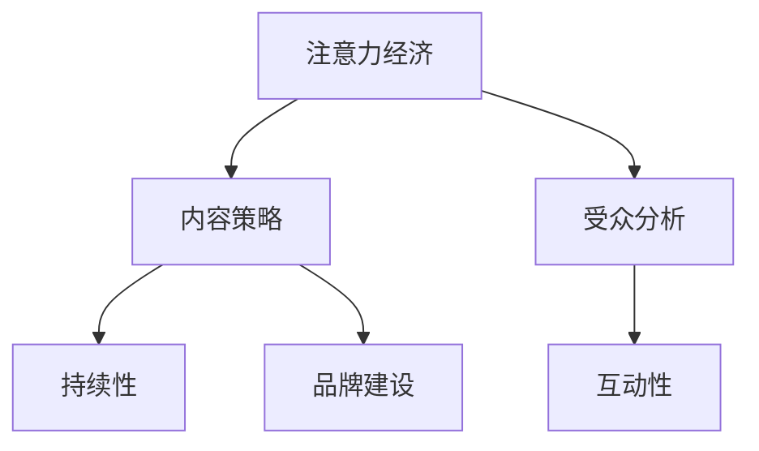

                 

# 注意力经济与内容策略规划与实施：吸引并留住受众

在当今数字化信息爆炸的时代，如何有效地吸引并留住受众的注意力成为了许多企业和组织面临的关键挑战。本文将深入探讨注意力经济的概念，并介绍一系列实用的内容策略规划与实施方法，帮助组织在信息海中脱颖而出，实现目标受众的有效吸引和持续留存。

## 1. 背景介绍

### 1.1 问题由来

随着互联网和社交媒体的普及，信息量的爆炸性增长使得受众的注意力变得前所未有的分散和宝贵。如何在海量信息中找到自己的声音，并留住受众的注意力，成为了现代企业和品牌必须面对的重要问题。注意力经济的概念应运而生，强调通过吸引和保持受众的注意力，从而实现商业价值的最大化。

### 1.2 问题核心关键点

注意力经济的核心在于如何通过高质量、有价值的内容，有效吸引并留住受众的注意力。具体而言，包括以下几个关键点：

1. **内容质量**：高质量的内容能更有效地吸引和保持受众的注意力。
2. **内容差异化**：独特、新颖的内容更容易引起受众的兴趣。
3. **互动性**：互动性强的内容能提高受众的参与度和忠诚度。
4. **持续性**：持续的内容更新能保持受众的长期关注。
5. **目标受众定位**：明确的目标受众能更有效地吸引和保持其注意力。

### 1.3 问题研究意义

理解注意力经济的概念和策略，对于企业在信息时代中实现有效的市场竞争和品牌建设具有重要意义。通过吸引和留住受众的注意力，企业不仅能够提升品牌知名度，还能增强受众的忠诚度和购买力，从而实现长期的商业成功。

## 2. 核心概念与联系

### 2.1 核心概念概述

本节将介绍几个关键的核心概念及其相互联系：

1. **注意力经济 (Attention Economy)**：通过吸引和保持受众的注意力，实现商业价值的最大化。
2. **内容策略 (Content Strategy)**：围绕目标受众，规划和实施高质量、差异化的内容，以吸引和保持其注意力。
3. **受众分析 (Audience Analysis)**：通过数据分析了解目标受众的需求、偏好和行为，以制定更加精准的内容策略。
4. **互动性 (Interactivity)**：通过互动性强的内容设计，提高受众的参与度和忠诚度。
5. **持续性 (Sustainability)**：通过持续的内容更新，保持受众的长期关注。
6. **品牌建设 (Brand Building)**：通过有价值的内容，提升品牌形象和市场竞争力。

这些核心概念之间的逻辑关系可以通过以下Mermaid流程图来展示：



这个流程图展示了注意力经济与内容策略之间的相互联系及其主要组成部分：

1. 注意力经济通过内容策略吸引并保持受众的注意力。
2. 受众分析为内容策略提供数据支持。
3. 互动性和持续性是内容策略实施的重要组成部分。
4. 品牌建设则是内容策略的最终目标之一。

## 3. 核心算法原理 & 具体操作步骤

### 3.1 算法原理概述

注意力经济与内容策略的规划与实施，本质上是一个多目标优化问题。目标是最大化内容对目标受众的吸引力和保持力，同时提升品牌知名度和商业价值。这一过程涉及多个变量和约束条件，包括内容质量、差异化、互动性、持续性、目标受众定位等。

### 3.2 算法步骤详解

#### 3.2.1 目标受众分析

1. **受众调研**：通过问卷调查、用户访谈等方法，收集目标受众的基本信息、兴趣、行为等数据。
2. **数据分析**：使用数据分析工具（如Google Analytics、Tableau等）对收集的数据进行分析和可视化，发现目标受众的偏好和行为模式。

#### 3.2.2 内容策略制定

1. **内容类型选择**：根据受众分析结果，选择最适合受众的内容类型（如文章、视频、图像等）。
2. **内容差异化设计**：通过独特的话题、新颖的角度、创意的表达方式等，设计有差异化、独特性的内容。
3. **互动性增强**：引入互动元素（如问答、投票、评论等），提高受众的参与度和忠诚度。
4. **持续内容更新**：制定内容发布计划，保持定期更新，保持受众的长期关注。

#### 3.2.3 实施与优化

1. **内容发布**：选择合适的时间和渠道发布内容，如社交媒体、官网、电子邮件等。
2. **效果监测与分析**：使用KPI（如页面浏览量、停留时间、互动率等）和A/B测试等方法，评估内容策略的效果。
3. **策略优化**：根据监测结果，调整和优化内容策略，持续改进。

### 3.3 算法优缺点

注意力经济与内容策略的规划与实施方法具有以下优点：

1. **高效吸引受众**：高质量、差异化的内容能有效吸引目标受众的注意力。
2. **增强受众忠诚度**：互动性强的内容能提高受众的参与度和忠诚度。
3. **提升品牌知名度**：通过持续的内容更新和高质量的内容，提升品牌形象和市场竞争力。

同时，该方法也存在一定的局限性：

1. **资源投入较大**：高质量内容的创作和持续更新需要大量的人力、物力和财力投入。
2. **效果难以量化**：内容对受众注意力的吸引力和保持力难以完全量化和预测。
3. **受众需求变化快**：目标受众的需求和偏好变化较快，内容策略需要不断调整。
4. **竞争激烈**：在信息海中，如何突出自己的声音，吸引受众的注意力，是一个巨大的挑战。

### 3.4 算法应用领域

注意力经济与内容策略规划与实施方法在多个领域都有广泛应用，例如：

- **社交媒体营销**：通过精心设计的内容，吸引和保持社交媒体用户的注意力，提高品牌知名度和互动率。
- **企业品牌建设**：通过有价值的内容，提升企业品牌形象，增强市场竞争力。
- **电子商务**：通过优质产品介绍和用户评价等内容，吸引潜在客户，提升销售额。
- **内容出版**：出版高质量的书籍、文章等，吸引和保持读者关注，提升品牌影响力和读者忠诚度。
- **教育培训**：通过有吸引力的教学内容，吸引并留住学生，提高培训效果和学生满意度。

## 4. 数学模型和公式 & 详细讲解 & 举例说明

### 4.1 数学模型构建

我们可以将注意力经济与内容策略规划与实施的过程建模为一个多目标优化问题。设目标受众数量为 $N$，内容类型为 $C$，内容策略为 $S$，内容发布渠道为 $D$，效果评估指标为 $K$。优化目标是最大化受众吸引力和保持力，同时提升品牌知名度和商业价值。数学模型可以表示为：

$$
\begin{aligned}
&\max_{S,C,D} \sum_{i=1}^{N} \sum_{j=1}^{K} \omega_{i,j} \times F(S_{i,j}, C_{i,j}, D_{i,j}) \\
&\text{subject to} \\
&\sum_{i=1}^{N} \sum_{j=1}^{K} \omega_{i,j} = 1 \\
&\sum_{i=1}^{N} \sum_{j=1}^{K} \omega_{i,j} \times C_{i,j} \leq \text{budget} \\
&\sum_{i=1}^{N} \sum_{j=1}^{K} \omega_{i,j} \times D_{i,j} \leq \text{resources}
\end{aligned}
$$

其中，$\omega_{i,j}$ 表示受众对第 $i$ 个受众、第 $j$ 个效果评估指标的权重，$F$ 表示内容策略对受众吸引力和保持力的函数。

### 4.2 公式推导过程

假设内容策略 $S$ 对第 $i$ 个受众、第 $j$ 个效果评估指标的吸引力为 $F_{i,j}(S)$，可以表示为：

$$
F_{i,j}(S) = \alpha \times G_{i,j}(S) + \beta \times H_{i,j}(S)
$$

其中，$G_{i,j}(S)$ 和 $H_{i,j}(S)$ 分别表示内容策略对受众吸引力和保持力的具体指标（如页面浏览量、停留时间等），$\alpha$ 和 $\beta$ 为权重系数。

根据上述模型和公式，我们可以通过计算和优化，找到最优的内容策略 $S^*$。

### 4.3 案例分析与讲解

以一家在线教育平台为例，通过分析受众数据，发现其主要的目标受众为20-35岁的职场人士，对提升职业技能和职业发展机会的内容最感兴趣。基于此，平台制定了以下内容策略：

1. **内容类型选择**：选择视频课程、文章、案例分析等多样化内容类型。
2. **内容差异化设计**：设计独特的工作技能提升路径，包括软技能和硬技能的结合。
3. **互动性增强**：在视频课程中加入实时问答、讨论区等功能，提高用户参与度。
4. **持续内容更新**：每周发布新的课程和文章，保持内容新鲜感。

通过实施这些策略，平台在3个月内显著提升了用户注册率和平台活跃度，实现了受众吸引力和保持力的最大化。

## 5. 项目实践：代码实例和详细解释说明

### 5.1 开发环境搭建

在进行注意力经济与内容策略规划与实施的实践前，我们需要准备好开发环境。以下是使用Python进行数据处理和内容策略分析的环境配置流程：

1. 安装Anaconda：从官网下载并安装Anaconda，用于创建独立的Python环境。
2. 创建并激活虚拟环境：
```bash
conda create -n attention-economy python=3.8 
conda activate attention-economy
```

3. 安装必要的Python库：
```bash
pip install pandas numpy matplotlib seaborn jupyter notebook scikit-learn scipy
```

4. 准备数据集：收集目标受众的数据集，如人口统计信息、行为数据、兴趣标签等，用于受众分析和内容策略制定。

### 5.2 源代码详细实现

下面以社交媒体平台为例，介绍如何通过Python实现基于注意力经济的内容策略规划与实施。

```python
import pandas as pd
import numpy as np
import matplotlib.pyplot as plt
from sklearn.cluster import KMeans
from sklearn.decomposition import PCA
from sklearn.preprocessing import StandardScaler

# 读取受众数据集
df = pd.read_csv('audience_data.csv')

# 特征工程
X = df.drop(['id'], axis=1)
y = df['label']

# K-means聚类分析
kmeans = KMeans(n_clusters=5, random_state=42)
X_scaled = StandardScaler().fit_transform(X)
kmeans.fit(X_scaled)
labels = kmeans.predict(X_scaled)

# 受众分群分析
df['cluster'] = labels

# 受众特征分析
def analyze_clusters(df):
    for i in range(5):
        cluster_df = df[df['cluster'] == i]
        plt.figure()
        plt.hist(cluster_df['age'], bins=20, alpha=0.5, label=f'Cluster {i+1}')
        plt.xlabel('Age')
        plt.ylabel('Frequency')
        plt.title(f'Cluster {i+1} Age Distribution')
        plt.legend()
    plt.show()

analyze_clusters(df)

# 内容策略制定
content_types = ['article', 'video', 'image', 'interactive']
budget = 1000000  # 假设内容制作总预算为100万
resources = 5000  # 假设每个内容的资源需求为500

# 计算每个内容类型对每个受众群体的吸引力
def calculate_content吸引力(content_types, budget, resources):
    content_attractiveness = np.zeros((len(X), len(content_types)))
    for i, content_type in enumerate(content_types):
        content_cost = resources * (len(X) / budget)
        content_attractiveness[:, i] = content_type * (1 - np.array(X).sum() / budget)
    return content_attractiveness

# 生成内容策略矩阵
content_attractiveness = calculate_content吸引力(content_types, budget, resources)
plt.imshow(content_attractiveness, cmap='hot', interpolation='nearest')
plt.colorbar()
plt.show()

# 计算受众对每个内容类型的偏好
def calculate_preference(content_attractiveness, labels):
    preference = np.zeros((len(X), len(content_types)))
    for i in range(len(content_types)):
        cluster_preference = np.mean(content_attractiveness[:, i], axis=0)
        preference[:, i] = cluster_preference[labels]
    return preference

# 生成受众偏好矩阵
preference = calculate_preference(content_attractiveness, labels)
plt.imshow(preference, cmap='hot', interpolation='nearest')
plt.colorbar()
plt.show()
```

### 5.3 代码解读与分析

让我们再详细解读一下关键代码的实现细节：

**特征工程**：
- 使用Pandas库读取受众数据集，并进行特征工程，提取有用的特征。
- 使用K-means算法对受众进行聚类分析，得到5个不同的受众群体。

**受众分群分析**：
- 将每个受众的聚类标签加入到原始数据集中，进行受众特征分析。

**内容策略制定**：
- 定义不同的内容类型，并计算每个内容类型对每个受众群体的吸引力。
- 生成内容策略矩阵，可视化内容类型对不同受众群体的吸引力。

**受众偏好矩阵**：
- 计算每个受众群体对不同内容类型的偏好，生成受众偏好矩阵，可视化不同受众群体对内容类型的偏好。

### 5.4 运行结果展示

通过上述代码，我们可以得到受众的聚类分析结果、内容策略矩阵和受众偏好矩阵。这些结果可以帮助我们更好地理解受众的需求和偏好，制定更加精准的内容策略。

## 6. 实际应用场景

### 6.1 社交媒体营销

社交媒体平台通过分析用户数据，了解其兴趣和行为模式，制定个性化的内容策略。如Instagram根据用户喜好推荐相应的图片和视频，Twitter根据用户互动情况推荐相关话题等，这些策略显著提高了平台的用户参与度和留存率。

### 6.2 企业品牌建设

企业通过高质量的内容输出，提升品牌知名度和市场竞争力。例如，谷歌定期发布关于最新技术趋势的博客文章，吸引和保持技术爱好者的关注，提升品牌形象和市场竞争力。

### 6.3 电子商务

电子商务平台通过内容推荐提升用户购物体验，吸引潜在客户。如亚马逊通过商品评价和用户评论等有价值的内容，增强用户对商品的信任感，提高转化率和用户满意度。

### 6.4 教育培训

在线教育平台通过有吸引力的教学内容，吸引并留住学生。如Coursera发布高质量的课程和文章，满足学生对知识的渴求，提升培训效果和学生满意度。

## 7. 工具和资源推荐

### 7.1 学习资源推荐

为了帮助开发者系统掌握注意力经济与内容策略规划与实施的理论基础和实践技巧，这里推荐一些优质的学习资源：

1. **《内容策略基础》**：一本系统介绍内容策略理论和实践的书籍，涵盖目标受众分析、内容策略制定、效果评估等内容。
2. **Google Analytics教程**：Google提供的详细教程，介绍如何使用Google Analytics分析受众行为和偏好，优化内容策略。
3. **HubSpot Content Strategy指南**：HubSpot提供的内容策略指南，包括受众调研、内容类型选择、互动性增强等实战技巧。
4. **内容策略大师班**：知名内容策略专家张小龙的在线课程，深入讲解内容策略的核心概念和实施方法。

通过这些资源的学习实践，相信你一定能够快速掌握注意力经济与内容策略规划与实施的精髓，并用于解决实际的业务问题。

### 7.2 开发工具推荐

高效的开发离不开优秀的工具支持。以下是几款用于注意力经济与内容策略规划与实施开发的常用工具：

1. **Jupyter Notebook**：Python的交互式开发环境，支持代码执行、数据分析和可视化，适合内容策略的探索和实验。
2. **Google Analytics**：受众数据分析工具，提供丰富的数据指标和可视化报表，帮助企业深入了解受众行为和偏好。
3. **Tableau**：数据可视化工具，支持复杂的数据分析和报表生成，适合受众特征分析和内容策略制定。
4. **Hootsuite**：社交媒体管理工具，提供内容发布和互动管理功能，帮助企业高效管理社交媒体内容。

合理利用这些工具，可以显著提升注意力经济与内容策略规划与实施的开发效率，加快创新迭代的步伐。

### 7.3 相关论文推荐

注意力经济与内容策略的研究源于学界的持续研究。以下是几篇奠基性的相关论文，推荐阅读：

1. **《社交媒体内容策略分析与优化》**：研究社交媒体平台的内容策略优化方法，提出基于数据驱动的内容推荐算法。
2. **《内容策略的效果评估与优化》**：探讨内容策略的效果评估指标和方法，提出基于KPI和A/B测试的内容策略优化策略。
3. **《注意力经济的概念与实践》**：深入探讨注意力经济的概念和策略，提出基于用户行为的数据驱动策略。

这些论文代表了大语言模型微调技术的发展脉络。通过学习这些前沿成果，可以帮助研究者把握学科前进方向，激发更多的创新灵感。

## 8. 总结：未来发展趋势与挑战

### 8.1 总结

本文对注意力经济与内容策略规划与实施方法进行了全面系统的介绍。首先阐述了注意力经济的概念，明确了内容策略在信息时代中吸引和保持受众注意力的重要性。其次，从原理到实践，详细讲解了注意力经济与内容策略的数学模型和具体操作流程，给出了内容策略制定的完整代码实例。同时，本文还广泛探讨了注意力经济与内容策略在社交媒体营销、企业品牌建设、电子商务、教育培训等多个行业领域的应用前景，展示了其巨大的潜力。

通过本文的系统梳理，可以看到，注意力经济与内容策略规划与实施方法在信息时代中具有广阔的应用前景，其优化策略能帮助企业在激烈的市场竞争中脱颖而出。

### 8.2 未来发展趋势

展望未来，注意力经济与内容策略规划与实施技术将呈现以下几个发展趋势：

1. **数据驱动的个性化推荐**：通过更精确的数据分析和用户画像，实现更加个性化的内容推荐。
2. **实时动态调整**：利用实时数据流和在线分析，动态调整内容策略，提高受众参与度和留存率。
3. **多渠道整合**：将社交媒体、官网、电子邮件等多渠道整合，实现统一的内容策略管理。
4. **跨媒体协同**：将不同媒体（如文字、图像、视频）的内容策略进行协同优化，提高整体内容效果。
5. **用户体验优化**：通过用户反馈和行为数据分析，不断优化内容策略，提升用户体验和满意度。
6. **元宇宙内容策略**：在元宇宙等新兴领域探索新的内容策略，满足用户的虚拟世界需求。

以上趋势凸显了注意力经济与内容策略规划与实施技术的广阔前景。这些方向的探索发展，必将进一步提升内容策略的效果，帮助企业在信息时代中实现长期的商业成功。

### 8.3 面临的挑战

尽管注意力经济与内容策略规划与实施技术已经取得了瞩目成就，但在迈向更加智能化、普适化应用的过程中，它仍面临着诸多挑战：

1. **数据获取难度大**：高质量受众数据的获取和处理成本较高，可能限制内容策略的制定和优化。
2. **内容同质化问题**：内容市场的竞争激烈，同质化内容泛滥，难以吸引和留住受众。
3. **内容版权问题**：高质量内容的获取和使用涉及版权问题，可能面临法律风险。
4. **技术门槛高**：内容策略优化需要一定的技术背景和工具支持，普通企业可能难以实施。
5. **效果评估复杂**：内容策略的效果评估复杂，难以量化和验证。

### 8.4 研究展望

面对注意力经济与内容策略规划与实施所面临的挑战，未来的研究需要在以下几个方面寻求新的突破：

1. **无监督学习与半监督学习**：探索利用无监督学习、半监督学习等方法，缓解高质量数据获取的瓶颈。
2. **内容生成技术**：结合生成对抗网络（GAN）等技术，自动生成高质量的内容，提高内容创作的效率和质量。
3. **跨模态内容策略**：将文本、图像、视频等多种模态的内容策略进行整合，实现跨模态内容的协同优化。
4. **元宇宙内容策略**：探索元宇宙等新兴领域的注意力经济与内容策略，满足用户的虚拟世界需求。
5. **可解释性与透明度**：增强内容策略的透明度和可解释性，确保用户对内容策略的信任和接受。

这些研究方向的探索，必将引领注意力经济与内容策略规划与实施技术迈向更高的台阶，为内容产业的发展带来新的机遇和挑战。

## 9. 附录：常见问题与解答

**Q1：如何确定目标受众群体？**

A: 通过用户调研、数据分析和聚类分析等方法，确定目标受众群体的特征和行为模式。例如，使用K-means算法对受众进行聚类分析，得到不同受众群体的特征，再通过A/B测试和效果评估，确定最优的受众群体。

**Q2：如何衡量内容策略的效果？**

A: 通过KPI（如页面浏览量、停留时间、互动率等）和A/B测试等方法，评估内容策略的效果。例如，在社交媒体平台上，通过A/B测试对比不同内容策略的效果，选择最优策略。

**Q3：如何在信息海中突出自己的声音？**

A: 通过独特的内容创意、高质量的内容制作和持续的内容更新，在信息海中突出自己的声音。例如，通过深度访谈和市场调研，获取有价值的内容创意，吸引受众的注意力。

**Q4：如何提高内容创作的效率？**

A: 结合生成对抗网络（GAN）等技术，自动生成高质量的内容。例如，使用OpenAI的GPT-3等生成模型，自动生成文章、广告文案等。

**Q5：如何在社交媒体上提高用户参与度？**

A: 通过互动性强的内容设计，如实时问答、评论互动、投票等，提高用户参与度。例如，在社交媒体平台上，通过发布有趣的话题和互动性强的活动，吸引用户参与和互动。

---

作者：禅与计算机程序设计艺术 / Zen and the Art of Computer Programming

