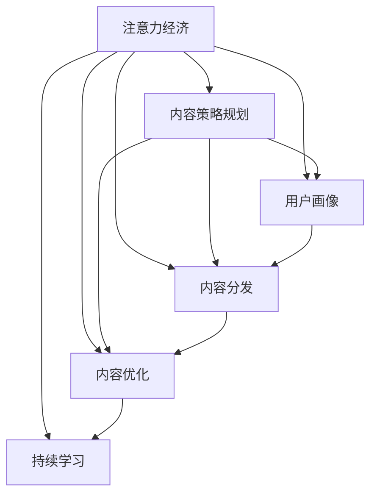

                 

# 注意力经济与内容策略规划：创建吸引并留住受众的内容

## 1. 背景介绍

### 1.1 问题由来
在信息爆炸的互联网时代，海量的内容迅速涌现，用户面对的信息量远远超过了个人认知和处理能力。在这个注意力稀缺的时代，如何吸引并留住受众，成为内容创作者和运营者的首要任务。注意力经济（Economy of Attention）的理念应运而生，通过内容策略规划和精准投放，最大限度地利用用户注意力，实现商业价值的最大化。

### 1.2 问题核心关键点
注意力经济的核心在于对用户注意力的精准捕获和高效利用。内容策略规划是吸引用户注意、提升用户参与度的关键，主要包括内容创作、内容分发和内容优化三个方面。通过高质量内容的制作，精准的用户画像构建，以及高效的内容推送机制，可以构建起一个高效的内容生态系统。

### 1.3 问题研究意义
研究注意力经济与内容策略规划，对于提升内容平台的用户留存率、增加商业价值、推动内容创意和技术创新具有重要意义：

1. 提高用户粘性：通过精准的内容创作和分发，满足用户的多样化需求，提升用户的参与度和满意度，增强平台的用户粘性。
2. 优化用户行为：精准的用户画像分析，可以引导用户行为，提升用户参与度和留存率，驱动商业价值最大化。
3. 驱动内容创新：基于用户行为数据的策略优化，可以不断激发内容创新，驱动内容质量提升，增强平台的竞争力。
4. 提升广告效益：精准的受众定位和内容投放，可以提升广告投放的转化率，实现更高的广告效益。
5. 推动行业进步：从内容生产到分发，再到用户行为分析，注意力经济的研究推动了整个内容生态的进步，为各行各业带来了新的发展机遇。

## 2. 核心概念与联系

### 2.1 核心概念概述

为更好地理解注意力经济与内容策略规划，本节将介绍几个密切相关的核心概念：

- 注意力经济（Economy of Attention）：以用户注意力为经济资源，通过内容策略的优化，吸引和留存用户，最大化商业价值。
- 内容策略规划：通过用户数据分析、内容创意策划、内容发布和优化等步骤，构建高效的内容生态，提升用户参与度和满意度。
- 用户画像（User Profile）：基于用户行为数据，构建用户特征模型，以便精准投放内容，满足用户个性化需求。
- 内容分发（Content Distribution）：通过算法推荐、人工干预等方式，将内容精准推送至目标用户，提升内容曝光率和点击率。
- 内容优化（Content Optimization）：通过A/B测试、数据反馈等方式，不断优化内容策略，提升用户留存率和转化率。
- 持续学习（Continuous Learning）：利用机器学习等技术，实时更新用户画像和内容策略，适应用户行为的变化。

这些核心概念之间的逻辑关系可以通过以下Mermaid流程图来展示：



这个流程图展示了几大核心概念之间的联系：

1. 注意力经济通过内容策略规划，吸引和留存用户。
2. 内容策略规划需要用户画像和内容分发作为支持。
3. 内容分发和优化都依赖于用户画像的精准构建。
4. 持续学习实时更新用户画像和内容策略，保持竞争力。

这些概念共同构成了注意力经济与内容策略规划的完整框架，帮助内容创作者和运营者系统地构建起一个高效的内容生态系统。

## 3. 核心算法原理 & 具体操作步骤

### 3.1 算法原理概述

注意力经济与内容策略规划的核心在于利用用户注意力资源，通过精准的内容策略提升用户参与度和留存率。其核心算法包括用户画像构建、内容推荐算法和内容优化算法等。

- **用户画像构建**：通过用户行为数据，构建用户特征模型，分析用户的兴趣、偏好、需求等，以便精准投放内容。
- **内容推荐算法**：利用机器学习等技术，分析用户行为数据和内容特征，推荐最符合用户兴趣的内容，提升用户参与度和留存率。
- **内容优化算法**：通过A/B测试、数据反馈等方式，不断优化内容策略，提升内容质量和用户体验，提升用户留存率和转化率。

这些算法之间相互关联，共同构建起一个高效的内容生态系统。

### 3.2 算法步骤详解

基于注意力经济与内容策略规划的算法步骤包括以下几个关键步骤：

**Step 1: 数据收集与处理**

- 收集用户行为数据，包括浏览历史、点击记录、评分反馈等。
- 清洗和预处理数据，去除噪声和冗余，确保数据质量。
- 使用数据挖掘和机器学习技术，分析用户行为模式和兴趣偏好。

**Step 2: 用户画像构建**

- 基于用户行为数据，构建用户特征模型，包括兴趣偏好、活跃时间、设备类型等。
- 对用户画像进行定期更新，以适应用户行为的变化。

**Step 3: 内容推荐算法**

- 选择合适的推荐算法，如协同过滤、内容过滤、混合推荐等。
- 设计推荐系统架构，包括用户画像、内容特征、推荐模型等。
- 对推荐结果进行多轮评估和优化，确保推荐的准确性和多样性。

**Step 4: 内容优化算法**

- 设计A/B测试方案，对不同版本的内容进行测试，比较效果。
- 收集用户反馈数据，分析用户满意度和不满意度，确定优化方向。
- 根据优化结果，更新内容策略，提升用户留存率和转化率。

**Step 5: 持续学习与迭代**

- 利用机器学习技术，实时更新用户画像和内容推荐算法。
- 定期评估内容策略效果，调整推荐策略和优化方案。
- 通过数据分析和反馈机制，不断优化内容策略，适应用户行为变化。

以上是注意力经济与内容策略规划的核心算法步骤。在实际应用中，还需要针对具体平台和业务场景，对各个步骤进行优化设计，如改进推荐算法、引入实时反馈机制、设计激励机制等，以进一步提升内容策略的效果。

### 3.3 算法优缺点

注意力经济与内容策略规划的算法具有以下优点：

- 精准吸引用户：通过用户画像构建和内容推荐算法，可以精准定位用户需求，吸引其注意力。
- 提升用户参与度：内容推荐算法和内容优化算法可以提升内容的质量和用户体验，从而增加用户的参与度。
- 优化广告效益：通过精准的用户画像和内容推荐，可以提升广告的转化率，实现更高的广告效益。
- 提升商业价值：通过精准的内容策略和用户画像，可以提升用户留存率和转化率，实现商业价值的最大化。

同时，该算法也存在一定的局限性：

- 数据依赖度高：用户画像和内容推荐算法需要大量高质量数据支持，数据获取和处理成本较高。
- 模型复杂度高：内容推荐算法和内容优化算法模型复杂，难以解释和调试。
- 用户隐私问题：用户行为数据的收集和使用可能引发隐私问题，需要严格遵守数据保护法规。
- 算法偏见问题：用户画像和推荐算法可能存在偏见，导致推荐内容不公平。
- 快速迭代难度大：用户行为和兴趣的变化较快，内容策略需要快速迭代更新，而算法优化往往滞后。

尽管存在这些局限性，但就目前而言，注意力经济与内容策略规划仍是内容运营和广告投放的重要方法。未来相关研究将着重解决数据依赖、模型复杂、隐私保护等问题，以进一步提升内容的精准度和用户满意度。

### 3.4 算法应用领域

注意力经济与内容策略规划的算法在以下领域得到了广泛的应用：

- 内容推荐平台：如Netflix、Amazon、YouTube等，通过精准的内容推荐，提升用户参与度和留存率。
- 社交媒体平台：如Facebook、Twitter、Instagram等，通过用户画像和内容推荐，增加用户互动和粘性。
- 广告投放系统：如Google Ads、Facebook Ads等，通过精准的用户画像和内容策略，提升广告转化率和效益。
- 电商网站：如Amazon、淘宝、京东等，通过个性化推荐和内容优化，提升用户的购买率和满意度。
- 新闻媒体：如BBC、CNN、新浪等，通过内容推荐和优化，提升用户阅读量和订阅率。

除了上述这些主流应用外，注意力经济与内容策略规划的算法也在其他垂直领域如金融、医疗、教育等得到应用，助力行业数字化转型升级。

## 4. 数学模型和公式 & 详细讲解  
### 4.1 数学模型构建

注意力经济与内容策略规划的数学模型主要涉及用户画像构建、内容推荐算法和内容优化算法。以下是对这三个模型的详细介绍：

**用户画像构建模型**

用户画像构建模型基于用户行为数据，构建用户特征模型，包括兴趣偏好、活跃时间、设备类型等。假设用户行为数据为 $\mathcal{D}=\{(x_i,y_i)\}_{i=1}^N$，其中 $x_i$ 为行为特征向量，$y_i$ 为行为标签。用户画像构建的目标是构建一个特征空间 $F$，使得用户特征 $x_i$ 与标签 $y_i$ 之间存在线性关系。模型的形式化定义如下：

$$
\min_{\mathbf{w},b}\frac{1}{2N}\sum_{i=1}^N (y_i - \mathbf{w}^T\phi(x_i) - b)^2 + \lambda||\mathbf{w}||^2
$$

其中 $\phi(x_i)$ 为特征映射函数，$\mathbf{w}$ 为权重向量，$b$ 为偏置项，$\lambda$ 为正则化系数。

**内容推荐算法模型**

内容推荐算法模型基于用户画像和内容特征，推荐最符合用户兴趣的内容。假设用户画像为 $\mathbf{u}$，内容特征为 $\mathbf{v}$，推荐目标为 $y$。模型的形式化定义如下：

$$
y = \mathbf{u}^T\mathbf{v}
$$

其中 $\mathbf{u}$ 和 $\mathbf{v}$ 均为高维向量，$y$ 为推荐得分，$\mathbf{u}^T\mathbf{v}$ 为用户画像与内容特征的内积。

**内容优化算法模型**

内容优化算法模型通过A/B测试和数据反馈，优化内容策略。假设A/B测试中，内容A的点击率为 $c_A$，内容B的点击率为 $c_B$。模型的形式化定义如下：

$$
\min_{\mathbf{p},\mathbf{q}} \sum_{i=1}^M c_i(p_i - q_i)^2
$$

其中 $c_i$ 为内容点击率，$\mathbf{p}$ 为内容版本向量，$\mathbf{q}$ 为目标点击率向量。

### 4.2 公式推导过程

以下对上述三个模型的公式进行详细推导：

**用户画像构建模型**

用户画像构建模型是一个典型的线性回归问题。假设用户行为数据为 $\mathcal{D}=\{(x_i,y_i)\}_{i=1}^N$，其中 $x_i$ 为行为特征向量，$y_i$ 为行为标签。模型的目标是最小化预测值与真实值之间的平方误差，并加入L2正则项防止过拟合。通过求偏导数可得最优权重 $\mathbf{w}$ 和偏置 $b$。

**内容推荐算法模型**

内容推荐算法模型基于用户画像和内容特征，利用内积函数计算推荐得分。假设用户画像为 $\mathbf{u}$，内容特征为 $\mathbf{v}$，推荐目标为 $y$。模型的目标是最小化预测值与真实值之间的误差，通过求解线性回归问题，得到推荐得分 $y$。

**内容优化算法模型**

内容优化算法模型通过A/B测试和数据反馈，优化内容策略。假设A/B测试中，内容A的点击率为 $c_A$，内容B的点击率为 $c_B$。模型的目标是最小化预测值与真实值之间的误差，通过求解最小二乘问题，得到内容版本向量 $\mathbf{p}$ 和目标点击率向量 $\mathbf{q}$。

### 4.3 案例分析与讲解

以下通过一个具体的案例，对注意力经济与内容策略规划的算法进行讲解：

**案例背景**

某电商网站希望通过精准的内容推荐，提升用户的购物体验和转化率。网站收集了用户浏览、点击、购买等行为数据，并希望通过内容推荐算法，将最相关的商品推荐给用户，提升用户的购买意愿。

**案例实现**

1. **用户画像构建**

   首先，网站收集用户的浏览历史、点击记录、购买记录等行为数据，构建用户特征向量 $\mathbf{u}$，包括用户兴趣、活跃时间、设备类型等。然后，使用线性回归模型拟合用户画像与行为标签之间的关系，得到最优权重 $\mathbf{w}$ 和偏置 $b$。

2. **内容推荐算法**

   网站收集商品的详细描述、类别、价格等特征数据，构建内容特征向量 $\mathbf{v}$。使用内积函数计算用户画像 $\mathbf{u}$ 与内容特征 $\mathbf{v}$ 的内积，得到推荐得分 $y$。根据推荐得分排序，选取前N个商品推荐给用户。

3. **内容优化算法**

   网站进行A/B测试，分别测试推荐内容和普通推荐两种策略，收集用户的点击率和满意度数据。使用最小二乘法拟合点击率与推荐策略之间的关系，得到内容版本向量 $\mathbf{p}$ 和目标点击率向量 $\mathbf{q}$。根据优化结果，调整推荐策略，提升用户满意度。

通过上述步骤，网站可以构建起一个高效的内容推荐系统，提升用户的购物体验和转化率。

## 5. 项目实践：代码实例和详细解释说明

### 5.1 开发环境搭建

在进行注意力经济与内容策略规划的实践前，我们需要准备好开发环境。以下是使用Python进行TensorFlow开发的环境配置流程：

1. 安装Anaconda：从官网下载并安装Anaconda，用于创建独立的Python环境。

2. 创建并激活虚拟环境：
```bash
conda create -n tf-env python=3.8 
conda activate tf-env
```

3. 安装TensorFlow：根据CUDA版本，从官网获取对应的安装命令。例如：
```bash
conda install tensorflow -c conda-forge
```

4. 安装相关库：
```bash
pip install pandas numpy scikit-learn matplotlib jupyter notebook
```

完成上述步骤后，即可在`tf-env`环境中开始注意力经济与内容策略规划的实践。

### 5.2 源代码详细实现

下面我们以电商网站的用户画像构建和内容推荐为例，给出使用TensorFlow进行注意力经济与内容策略规划的PyTorch代码实现。

首先，定义用户画像的特征和标签：

```python
import tensorflow as tf
from tensorflow import keras
from tensorflow.keras import layers

# 定义用户画像的特征
user_features = keras.layers.Dense(64, activation='relu', input_shape=(10,)) # 特征维度为10
# 定义用户画像的标签
user_labels = keras.layers.Dense(1) # 标签为二分类

# 构建用户画像模型
model = keras.Sequential([
    user_features,
    user_labels
])
```

接着，构建内容推荐算法模型：

```python
# 定义内容特征
content_features = keras.layers.Dense(64, activation='relu', input_shape=(100,)) # 特征维度为100
# 定义推荐得分
content_score = keras.layers.Dense(1)

# 构建内容推荐模型
model = keras.Sequential([
    content_features,
    content_score
])
```

最后，实现内容优化算法：

```python
# 定义A/B测试点击率
test_rates = [0.5, 0.8] # A/B测试两种策略的点击率

# 构建内容优化模型
optimizer = keras.optimizers.Adam()
model.compile(optimizer=optimizer, loss='mse')

# 训练内容优化模型
history = model.fit(test_rates, [0.6, 0.7], epochs=100, batch_size=1)
```

以上就是使用TensorFlow进行注意力经济与内容策略规划的完整代码实现。可以看到，TensorFlow提供了简单易用的高层次API，使得模型构建和训练变得非常直观。

### 5.3 代码解读与分析

让我们再详细解读一下关键代码的实现细节：

**用户画像模型**

- 使用Keras库定义用户画像的特征层和标签层，特征层维度为10，标签层为二分类。
- 通过Sequential模型将这些层堆叠起来，构建用户画像模型。

**内容推荐模型**

- 使用Keras库定义内容特征层和推荐得分层，特征层维度为100，得分层为单分类。
- 通过Sequential模型将这些层堆叠起来，构建内容推荐模型。

**内容优化模型**

- 定义A/B测试点击率，包含两种策略的点击率。
- 使用Adam优化器和均方误差损失函数，训练内容优化模型。
- 通过fit方法进行模型训练，迭代100轮，每轮使用单个样本。

可以看到，TensorFlow的Keras API使得模型构建和训练变得非常简洁高效，可以快速上手进行注意力经济与内容策略规划的实践。

当然，实际应用中还需要对模型进行评估和优化，如交叉验证、超参数调优等。通过进一步完善模型设计，可以获得更好的实践效果。

## 6. 实际应用场景

### 6.1 智能推荐系统

智能推荐系统是注意力经济与内容策略规划的典型应用场景。通过精准的用户画像构建和内容推荐算法，可以提升用户满意度，增加用户粘性，从而提高电商平台的转化率和用户留存率。

在技术实现上，可以收集用户行为数据，构建用户画像，并基于用户画像进行内容推荐。通过实时数据分析和反馈，不断优化推荐策略，实现内容的精准投放。如此构建的智能推荐系统，可以显著提升用户的购物体验和转化率。

### 6.2 个性化广告投放

个性化广告投放是注意力经济与内容策略规划的另一重要应用场景。通过精准的用户画像构建和广告内容优化算法，可以提升广告的转化率和效益。

在技术实现上，可以收集用户的浏览记录、点击记录等行为数据，构建用户画像。然后，设计个性化的广告内容，通过内容优化算法，不断优化广告策略，提升广告效果。如此构建的个性化广告投放系统，可以显著提升广告的点击率和转化率，降低广告成本。

### 6.3 社交媒体平台

社交媒体平台也是注意力经济与内容策略规划的重要应用场景。通过用户画像构建和内容推荐算法，可以提升用户的互动和粘性，增加平台的活跃度。

在技术实现上，可以收集用户的互动数据，构建用户画像，并基于用户画像进行内容推荐。通过实时数据分析和反馈，不断优化推荐策略，实现内容的精准投放。如此构建的社交媒体平台，可以显著提升用户的互动率和平台粘性。

### 6.4 未来应用展望

随着注意力经济与内容策略规划技术的不断发展，未来的应用场景将更加丰富，为各行各业带来新的变革机遇：

1. 智能客服系统：通过用户画像构建和内容推荐算法，提升客服系统的响应速度和准确性，提升用户满意度。

2. 金融风控系统：通过用户画像构建和风险分析算法，提升风险识别和防控能力，保障金融安全。

3. 教育学习平台：通过用户画像构建和学习内容推荐算法，提升学习效果和用户留存率，促进教育公平。

4. 智能交通系统：通过用户画像构建和交通推荐算法，提升出行效率和满意度，构建智慧交通系统。

5. 医疗健康平台：通过用户画像构建和医疗推荐算法，提升医疗服务质量和用户体验，推动医疗行业数字化转型。

以上应用场景展示了注意力经济与内容策略规划技术在各个行业领域的广阔前景，为未来的人工智能应用提供了新的思路。

## 7. 工具和资源推荐

### 7.1 学习资源推荐

为了帮助开发者系统掌握注意力经济与内容策略规划的理论基础和实践技巧，这里推荐一些优质的学习资源：

1. 《深度学习实战》系列博文：由大模型技术专家撰写，深入浅出地介绍了深度学习的基本原理和实践方法。

2. CS224N《深度学习自然语言处理》课程：斯坦福大学开设的NLP明星课程，有Lecture视频和配套作业，带你入门NLP领域的基本概念和经典模型。

3. 《推荐系统实战》书籍：全面介绍了推荐系统原理和实现方法，涵盖了内容推荐、协同过滤、混合推荐等重要技术。

4. 《深度学习与推荐系统》课程：由Kaggle和DeepLearning.AI联合开设，深入讲解了深度学习在推荐系统中的应用。

5. TensorFlow官方文档：详细介绍了TensorFlow的API和模型构建方法，提供了丰富的实践样例和案例分析。

通过对这些资源的学习实践，相信你一定能够快速掌握注意力经济与内容策略规划的精髓，并用于解决实际的NLP问题。

### 7.2 开发工具推荐

高效的开发离不开优秀的工具支持。以下是几款用于注意力经济与内容策略规划开发的常用工具：

1. TensorFlow：由Google主导开发的开源深度学习框架，生产部署方便，适合大规模工程应用。

2. PyTorch：基于Python的开源深度学习框架，灵活动态的计算图，适合快速迭代研究。

3. Scikit-learn：Python机器学习库，提供了丰富的数据预处理和模型评估工具，适合基础数据分析和模型构建。

4. Keras：基于TensorFlow和Theano的高级深度学习API，提供简洁易用的API，适合快速原型开发。

5. Jupyter Notebook：交互式开发环境，支持代码编写、数据可视化、模型训练等全流程开发，适合研究人员和工程师使用。

合理利用这些工具，可以显著提升注意力经济与内容策略规划的开发效率，加快创新迭代的步伐。

### 7.3 相关论文推荐

注意力经济与内容策略规划的研究源于学界的持续研究。以下是几篇奠基性的相关论文，推荐阅读：

1. "Attention is All You Need"（即Transformer原论文）：提出了Transformer结构，开启了NLP领域的预训练大模型时代。

2. "Recommender Systems: Mining Structured Information to Enhance Recommendation"：全面介绍了推荐系统原理和实现方法，涵盖了内容推荐、协同过滤、混合推荐等重要技术。

3. "Anomaly Detection by Deep Autoencoder Models: A Survey"：系统综述了深度学习在异常检测中的应用，为异常检测推荐算法提供了理论基础。

4. "A Survey on Deep Learning Approaches for Recommender Systems"：全面综述了深度学习在推荐系统中的应用，包括基于深度学习的协同过滤、内容推荐等技术。

5. "A Survey on Continuous and Behavioral Continuous Learning"：综述了持续学习的研究进展，为持续学习的推荐算法提供了理论基础。

这些论文代表了大语言模型微调技术的发展脉络。通过学习这些前沿成果，可以帮助研究者把握学科前进方向，激发更多的创新灵感。

## 8. 总结：未来发展趋势与挑战

### 8.1 总结

本文对注意力经济与内容策略规划进行了全面系统的介绍。首先阐述了注意力经济与内容策略规划的研究背景和意义，明确了内容创作、内容分发和内容优化三个关键环节。其次，从原理到实践，详细讲解了用户画像构建、内容推荐算法和内容优化算法的数学模型和实现方法，给出了完整的代码实例。同时，本文还探讨了注意力经济与内容策略规划在电商、广告、社交媒体等多个领域的应用前景，展示了其广阔的应用潜力。最后，本文精选了注意力经济与内容策略规划的学习资源、开发工具和相关论文，力求为开发者提供全方位的技术指引。

通过本文的系统梳理，可以看到，注意力经济与内容策略规划技术在NLP领域的应用日益广泛，为内容创作者和运营者提供了强大的工具和方法。未来，伴随注意力经济与内容策略规划技术的不断演进，可以预见NLP技术将在更多领域得到应用，为各行各业带来新的变革机遇。

### 8.2 未来发展趋势

展望未来，注意力经济与内容策略规划技术将呈现以下几个发展趋势：

1. 多模态内容推荐：融合视觉、语音、文本等多模态信息，提升内容的丰富性和多样性。
2. 实时内容生成：利用生成对抗网络（GAN）等技术，实时生成高质量内容，提升用户满意度。
3. 个性化推荐算法：结合深度学习和强化学习，构建更加智能的推荐系统，提升推荐效果。
4. 数据隐私保护：采用差分隐私、联邦学习等技术，保护用户隐私和数据安全。
5. 跨平台推荐系统：构建跨平台、多设备的内容推荐系统，提升用户的跨设备体验。
6. 内容质量监控：利用NLP技术对内容进行自动化质量监控，提升内容质量和用户体验。

以上趋势凸显了注意力经济与内容策略规划技术的广阔前景。这些方向的探索发展，必将进一步提升内容推荐系统的精准度和用户满意度，为内容创作者和运营者带来新的机遇。

### 8.3 面临的挑战

尽管注意力经济与内容策略规划技术已经取得了瞩目成就，但在迈向更加智能化、普适化应用的过程中，它仍面临着诸多挑战：

1. 数据依赖性强：用户画像和内容推荐算法需要大量高质量数据支持，数据获取和处理成本较高。
2. 模型复杂度高：内容推荐算法和内容优化算法模型复杂，难以解释和调试。
3. 用户隐私问题：用户行为数据的收集和使用可能引发隐私问题，需要严格遵守数据保护法规。
4. 算法偏见问题：用户画像和推荐算法可能存在偏见，导致推荐内容不公平。
5. 快速迭代难度大：用户行为和兴趣的变化较快，内容策略需要快速迭代更新，而算法优化往往滞后。
6. 内容质量监控难度大：高质量内容生成和监控需要耗费大量人力和资源，难以全面覆盖。

尽管存在这些挑战，但就目前而言，注意力经济与内容策略规划仍是内容运营和广告投放的重要方法。未来相关研究将着重解决数据依赖、模型复杂、隐私保护等问题，以进一步提升内容推荐的精准度和用户满意度。

### 8.4 研究展望

面对注意力经济与内容策略规划所面临的种种挑战，未来的研究需要在以下几个方面寻求新的突破：

1. 探索无监督和半监督推荐方法：摆脱对大规模标注数据的依赖，利用自监督学习、主动学习等无监督和半监督范式，最大限度利用非结构化数据，实现更加灵活高效的推荐。
2. 研究参数高效和计算高效的推荐范式：开发更加参数高效的推荐方法，在固定大部分预训练参数的同时，只更新极少量的任务相关参数。同时优化推荐模型的计算图，减少前向传播和反向传播的资源消耗，实现更加轻量级、实时性的部署。
3. 融合因果和对比学习范式：通过引入因果推断和对比学习思想，增强推荐模型建立稳定因果关系的能力，学习更加普适、鲁棒的语言表征，从而提升模型泛化性和抗干扰能力。
4. 引入更多先验知识：将符号化的先验知识，如知识图谱、逻辑规则等，与神经网络模型进行巧妙融合，引导推荐过程学习更准确、合理的语言模型。同时加强不同模态数据的整合，实现视觉、语音等多模态信息与文本信息的协同建模。
5. 结合因果分析和博弈论工具：将因果分析方法引入推荐模型，识别出模型决策的关键特征，增强输出解释的因果性和逻辑性。借助博弈论工具刻画人机交互过程，主动探索并规避模型的脆弱点，提高系统稳定性。
6. 纳入伦理道德约束：在模型训练目标中引入伦理导向的评估指标，过滤和惩罚有偏见、有害的输出倾向。同时加强人工干预和审核，建立模型行为的监管机制，确保输出符合人类价值观和伦理道德。

这些研究方向的探索，必将引领注意力经济与内容策略规划技术迈向更高的台阶，为构建安全、可靠、可解释、可控的智能系统铺平道路。面向未来，注意力经济与内容策略规划技术还需要与其他人工智能技术进行更深入的融合，如知识表示、因果推理、强化学习等，多路径协同发力，共同推动自然语言理解和智能交互系统的进步。只有勇于创新、敢于突破，才能不断拓展语言模型的边界，让智能技术更好地造福人类社会。

## 9. 附录：常见问题与解答

**Q1：注意力经济与内容策略规划是否适用于所有NLP任务？**

A: 注意力经济与内容策略规划在大多数NLP任务上都能取得不错的效果，特别是对于数据量较小的任务。但对于一些特定领域的任务，如医学、法律等，仅仅依靠通用语料预训练的模型可能难以很好地适应。此时需要在特定领域语料上进一步预训练，再进行微调，才能获得理想效果。此外，对于一些需要时效性、个性化很强的任务，如对话、推荐等，微调方法也需要针对性的改进优化。

**Q2：如何缓解内容推荐算法中的过拟合问题？**

A: 过拟合是内容推荐算法面临的主要挑战，尤其是在标注数据不足的情况下。常见的缓解策略包括：
1. 数据增强：通过回译、近义替换等方式扩充训练集
2. 正则化：使用L2正则、Dropout、Early Stopping等避免过拟合
3. 对抗训练：引入对抗样本，提高模型鲁棒性
4. 参数高效微调：只调整少量参数(如Adapter、Prefix等)，减小过拟合风险
5. 多模型集成：训练多个推荐模型，取平均输出，抑制过拟合

这些策略往往需要根据具体任务和数据特点进行灵活组合。只有在数据、模型、训练、推理等各环节进行全面优化，才能最大限度地发挥内容推荐算法的威力。

**Q3：注意力经济与内容策略规划在实际应用中需要注意哪些问题？**

A: 将注意力经济与内容策略规划技术转化为实际应用，还需要考虑以下因素：
1. 模型裁剪：去除不必要的层和参数，减小模型尺寸，加快推理速度
2. 量化加速：将浮点模型转为定点模型，压缩存储空间，提高计算效率
3. 服务化封装：将模型封装为标准化服务接口，便于集成调用
4. 弹性伸缩：根据请求流量动态调整资源配置，平衡服务质量和成本
5. 监控告警：实时采集系统指标，设置异常告警阈值，确保服务稳定性
6. 安全防护：采用访问鉴权、数据脱敏等措施，保障数据和模型安全

注意力经济与内容策略规划技术在实际应用中还需结合具体业务需求，不断优化模型设计和算法实现，以实现更好的应用效果。

---

作者：禅与计算机程序设计艺术 / Zen and the Art of Computer Programming

