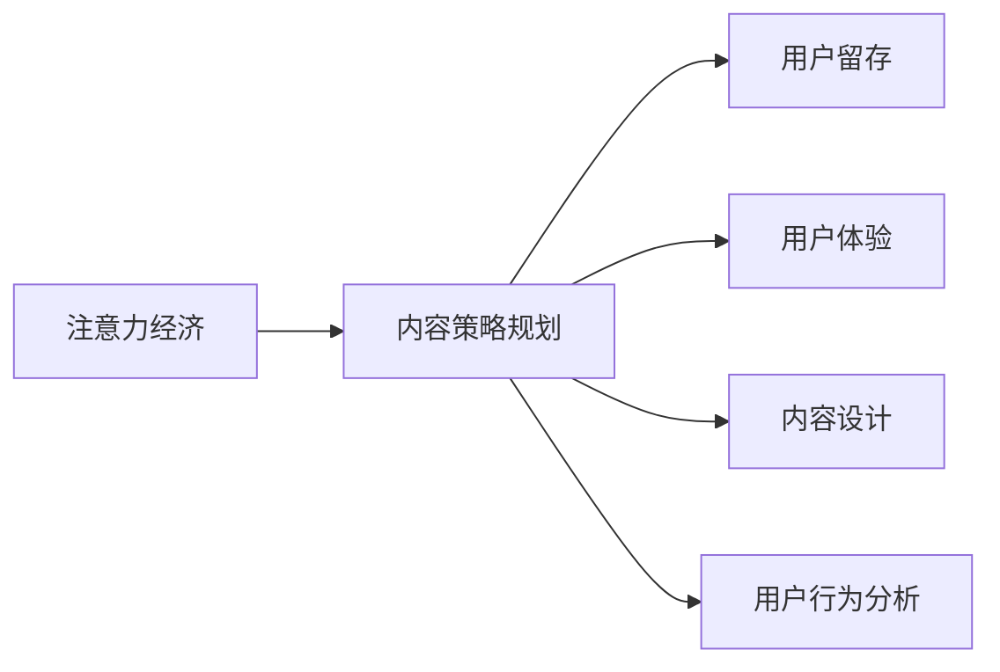

                 

# 注意力经济与内容策略规划：创建吸引并留住受众的内容

> 关键词：注意力经济,内容策略规划,受众留存,用户体验,内容设计,用户行为分析

## 1. 背景介绍

### 1.1 问题由来
在数字化时代，信息的获取与传播已经变得越来越容易。人们每天接受的信息量呈爆炸式增长，如何在海量的信息中脱颖而出，成为众多内容创作者和平台面临的重大挑战。在这种情况下，注意力经济应运而生，逐渐成为互联网行业的新焦点。

### 1.2 问题核心关键点
注意力经济，简而言之，就是通过有效吸引并保持用户的注意力，从而实现商业价值的最大化。在内容行业，这意味着创建高质量、有价值的内容，能够吸引用户并留住他们，最终促成品牌忠诚度和转化率的提升。

### 1.3 问题研究意义
研究注意力经济与内容策略规划，对于内容创作者、平台运营商、广告商和品牌商而言，都具有重大的战略意义。

1. **内容创作者**：理解和掌握注意力经济的规律，有助于提升内容的吸引力和留存率，进而提升个人品牌价值和收入。
2. **平台运营商**：通过内容策略的优化，能够提高平台的用户粘性和活跃度，增强平台的竞争力。
3. **广告商**：更加精准的内容推荐和定向投放，能够有效提升广告的点击率和转化率，降低广告成本。
4. **品牌商**：有效的注意力吸引与留存，有助于建立品牌认知度，增强品牌的市场渗透力和影响力。

## 2. 核心概念与联系

### 2.1 核心概念概述

为更好地理解注意力经济与内容策略规划，本节将介绍几个关键概念：

- **注意力经济**：指在信息爆炸的背景下，通过吸引用户注意力来创造商业价值的过程。
- **内容策略规划**：指基于对目标受众的理解，设计并实施有效的内容生产与分发策略，以实现内容的效果最大化。
- **用户留存**：指通过优质的内容和用户体验，吸引用户并保持其长时间使用和回访。
- **用户体验**：指用户在使用产品或服务过程中的整体感受，包括内容质量、互动性、易用性等方面。
- **内容设计**：指针对特定受众和目标，对内容的类型、形式、结构等进行精心设计和规划。
- **用户行为分析**：指通过数据分析工具，了解用户的行为模式、偏好和需求，以指导内容策略的制定和优化。

这些概念之间存在紧密的联系，共同构成了内容策略规划的框架。

### 2.2 核心概念原理和架构的 Mermaid 流程图



这个流程图展示了注意力经济与内容策略规划的核心概念及其联系。

- **注意力经济**（A）通过吸引用户注意力，为内容策略规划（B）提供了基础。
- **内容策略规划**（B）是实现用户留存（C）、提升用户体验（D）、优化内容设计（E）和深入理解用户行为（F）的关键。
- **用户留存**（C）和**用户体验**（D）是评估内容策略效果的重要指标。
- **内容设计**（E）和**用户行为分析**（F）为内容策略的持续优化提供了依据。

## 3. 核心算法原理 & 具体操作步骤

### 3.1 算法原理概述

注意力经济与内容策略规划的核心算法原理主要基于用户行为数据和内容反馈数据，通过机器学习与数据分析技术，找出用户最感兴趣的内容特征，制定并实施针对性的内容策略。

简化的流程可以概括为以下几个步骤：

1. **数据收集与预处理**：收集用户的点击、浏览、互动、评价等数据，并对其进行清洗和标注。
2. **特征提取**：使用文本处理、图像处理、行为分析等技术，提取用户对内容的兴趣特征。
3. **模型训练**：利用机器学习模型（如线性回归、决策树、深度学习等），预测用户的注意力吸引力和留存概率。
4. **内容生成与推送**：根据模型预测结果，生成个性化内容，并通过推荐算法推送给用户。
5. **效果评估与优化**：持续监测用户行为数据和反馈，评估内容策略的效果，并及时调整和优化。

### 3.2 算法步骤详解

#### 3.2.1 数据收集与预处理

数据收集是内容策略规划的基础。常用的数据源包括：

- **点击数据**：记录用户对每个内容页面的点击情况，可以分析用户的兴趣偏好。
- **浏览数据**：记录用户在页面上的停留时间和页面滚动情况，评估内容的吸引力。
- **互动数据**：包括评论、点赞、分享等互动行为，反映用户对内容的情感态度。
- **评价数据**：用户对内容的评价评分，直接体现内容的价值高低。

预处理阶段包括数据清洗、缺失值处理、异常值检测等。例如，去除无关的点击数据，处理重复数据，对缺失数据进行填充等。

#### 3.2.2 特征提取

特征提取的目的是从原始数据中提取出有意义的特征，供模型训练使用。常见的特征包括：

- **文本特征**：包括文章标题、关键词、摘要等，通过自然语言处理技术提取文本特征向量。
- **图像特征**：对于图片内容，提取颜色、纹理、形状等特征。
- **行为特征**：用户的停留时间、点击深度、页面跳转等行为特征。
- **时间特征**：时间戳、发布时间等时间信息，分析内容的流行周期。

#### 3.2.3 模型训练

模型训练是内容策略规划的核心环节。常用的模型包括：

- **线性回归模型**：用于预测用户的点击概率或停留时间。
- **决策树模型**：用于分析用户的兴趣特征，找到与留存率相关的特征。
- **深度学习模型**：如神经网络、卷积神经网络（CNN）、循环神经网络（RNN）等，可以处理高维数据，预测用户的留存概率。

模型训练的过程中，需要选择合适的评估指标（如准确率、召回率、F1-score等），并进行交叉验证，以确保模型的泛化能力。

#### 3.2.4 内容生成与推送

内容生成与推送环节的目标是根据模型预测结果，为用户推荐感兴趣的内容。具体步骤包括：

- **个性化推荐**：基于用户的兴趣特征，生成个性化内容推荐列表。
- **动态调整**：根据用户的行为反馈，实时调整内容推荐策略。
- **A/B测试**：对比不同内容策略的效果，优化推荐算法。

#### 3.2.5 效果评估与优化

效果评估是内容策略规划的闭环环节，通过持续监测用户行为数据和反馈，对策略进行优化。具体步骤包括：

- **定期评估**：设定评估周期，定期检查用户留存率和互动率等指标。
- **实时监控**：利用实时数据流，及时发现并解决用户流失问题。
- **用户反馈**：通过问卷调查、在线访谈等方式，获取用户的直接反馈，调整内容策略。

### 3.3 算法优缺点

#### 3.3.1 优点

1. **个性化推荐**：通过机器学习模型，能够实现精准的内容推荐，提升用户的满意度和留存率。
2. **数据驱动优化**：基于用户行为数据的分析，可以持续优化内容策略，提高效果。
3. **高效运作**：自动化处理大量数据，提升内容生产与推送的效率。

#### 3.3.2 缺点

1. **数据隐私**：用户数据的收集和处理涉及隐私问题，需遵守相关法律法规。
2. **模型复杂度**：复杂模型需要更多的计算资源和数据，可能存在过拟合风险。
3. **用户行为多样性**：不同用户的行为模式可能存在较大差异，模型难以完全覆盖。
4. **内容质量参差不齐**：内容质量难以保证，低质量内容可能降低用户体验。

### 3.4 算法应用领域

注意力经济与内容策略规划的应用领域非常广泛，涵盖以下几大类：

- **社交媒体**：通过精准推荐内容，提升用户的互动和留存率，增加平台的用户粘性。
- **电商网站**：通过个性化商品推荐，增加用户购买率和复购率，提升销售转化率。
- **视频平台**：通过推荐算法，为用户推荐感兴趣的影片，提高观看率和用户留存。
- **新闻门户**：通过智能推荐，提升用户的阅读体验和满意度，增加流量和用户停留时间。
- **内容订阅平台**：通过内容分发策略，提高用户的订阅率和内容付费率。

## 4. 数学模型和公式 & 详细讲解 & 举例说明

### 4.1 数学模型构建

注意力经济与内容策略规划的数学模型主要基于用户的点击、停留和互动行为数据，通过机器学习模型预测用户留存率。常用的模型包括线性回归、决策树和深度神经网络等。

假设用户行为数据为 $\mathcal{D}=\{(x_i,y_i)\}_{i=1}^N$，其中 $x_i$ 为特征向量，$y_i$ 为标签（0表示用户不留存，1表示用户留存）。目标是通过训练模型 $\hat{y}=f(x;\theta)$，找到最优参数 $\theta$，使得模型预测结果 $\hat{y}$ 与实际标签 $y$ 尽可能接近。

### 4.2 公式推导过程

以线性回归模型为例，目标函数为：

$$
\mathcal{L}(\theta)=\frac{1}{N}\sum_{i=1}^N(y_i-\hat{y_i})^2
$$

其中，$\hat{y_i}$ 为模型预测结果，$y_i$ 为实际标签。

通过最小化损失函数 $\mathcal{L}(\theta)$，得到最优参数 $\theta$：

$$
\theta=\arg\min_{\theta}\mathcal{L}(\theta)
$$

使用梯度下降算法，每次迭代更新模型参数 $\theta$：

$$
\theta_j=\theta_j-\eta\nabla_{\theta_j}\mathcal{L}(\theta)
$$

其中，$\eta$ 为学习率，$\nabla_{\theta_j}\mathcal{L}(\theta)$ 为损失函数对参数 $\theta_j$ 的梯度。

### 4.3 案例分析与讲解

假设有一个电商平台，收集了用户的点击和购买行为数据。平台希望通过机器学习模型预测用户是否会回购，从而进行个性化推荐。

首先，收集用户的点击记录、浏览时长、购买金额等行为数据。然后，使用特征提取技术，将数据转化为特征向量。例如，点击次数作为特征，用户停留时间作为特征等。

接下来，使用线性回归模型训练数据集，得到预测模型。将用户行为数据代入模型，得到预测结果。如果预测结果为正，表示用户有较高概率回购，平台就会向其推荐相关商品。

最后，平台对推荐效果进行评估，比如监控回购率、订单量等指标，根据效果调整推荐算法。

## 5. 项目实践：代码实例和详细解释说明

### 5.1 开发环境搭建

在进行内容策略规划的实践之前，需要先搭建好开发环境。以下是在Python中进行开发的流程：

1. 安装Python：从官网下载并安装Python，确保版本为3.6及以上。
2. 安装相关库：使用pip安装Pandas、NumPy、Scikit-Learn等常用的数据处理和机器学习库。
3. 设置环境变量：确保所有库的路径设置正确，能够在代码中顺利导入。

### 5.2 源代码详细实现

以下是一个简单的内容策略规划的代码实现示例，使用了Pandas和Scikit-Learn库。

```python
import pandas as pd
from sklearn.model_selection import train_test_split
from sklearn.linear_model import LinearRegression
from sklearn.metrics import mean_squared_error

# 读取数据
data = pd.read_csv('user_behavior.csv')

# 数据预处理
data = data.dropna()
X = data[['click_count', 'stay_time']]
y = data['repurchase']

# 划分数据集
X_train, X_test, y_train, y_test = train_test_split(X, y, test_size=0.2)

# 建立模型
model = LinearRegression()
model.fit(X_train, y_train)

# 预测并评估
y_pred = model.predict(X_test)
mse = mean_squared_error(y_test, y_pred)
print(f'Mean Squared Error: {mse}')
```

### 5.3 代码解读与分析

上述代码实现了简单的线性回归模型，用于预测用户的回购行为。具体步骤如下：

1. 使用Pandas库读取用户行为数据，并处理缺失值。
2. 选择特征 $x$ 为用户的点击次数和停留时间，目标 $y$ 为用户是否回购。
3. 使用Scikit-Learn库的train_test_split函数将数据集划分为训练集和测试集。
4. 创建线性回归模型，并使用训练数据拟合模型。
5. 使用测试数据进行预测，计算预测结果与真实标签的均方误差（MSE）。

代码中的关键点包括：

- 数据预处理：通过dropna函数去除缺失值，确保数据完整性。
- 特征选择：选择了用户行为中对回购有显著影响的特征。
- 模型训练：使用LinearRegression模型进行线性回归，最小化预测值与真实标签之间的误差。
- 模型评估：通过计算均方误差，评估模型预测效果。

### 5.4 运行结果展示

运行上述代码，输出预测结果与真实标签的均方误差。

假设均方误差为 $0.1$，表示模型的预测误差很小，模型性能较好。

## 6. 实际应用场景

### 6.1 社交媒体

社交媒体平台如微信、微博等，通过分析用户的互动行为（如点赞、评论、分享），可以精准推荐感兴趣的内容，提升用户粘性和留存率。例如，微信公众号通过分析用户的阅读习惯，推荐相关文章，增加用户的互动和订阅率。

### 6.2 电商网站

电商网站如亚马逊、淘宝等，通过分析用户的浏览行为（如浏览时长、浏览路径），可以推荐相关商品，增加用户的购买率和复购率。例如，亚马逊通过分析用户的浏览记录，推荐相关商品，提高用户的购买转化率。

### 6.3 视频平台

视频平台如Netflix、YouTube等，通过分析用户的观看行为（如观看时长、喜欢视频类型），可以推荐相关视频，增加用户的观看时间和留存率。例如，Netflix通过分析用户的观看记录，推荐相关电影和电视剧，提升用户的观看满意度。

### 6.4 新闻门户

新闻门户如人民日报、澎湃新闻等，通过分析用户的阅读行为（如阅读时长、浏览文章类型），可以推荐相关新闻，提升用户的阅读体验和留存率。例如，澎湃新闻通过分析用户的阅读记录，推荐相关新闻，增加用户的访问量和互动率。

## 7. 工具和资源推荐

### 7.1 学习资源推荐

为了帮助开发者系统掌握注意力经济与内容策略规划的理论基础和实践技巧，这里推荐一些优质的学习资源：

1. 《数据科学导论》：全面介绍了数据科学的基本概念和方法，包括数据收集、数据清洗、特征工程等。
2. 《机器学习实战》：提供了多种机器学习算法的实战代码，涵盖回归、分类、聚类等常用模型。
3. Kaggle：提供大量的数据集和比赛项目，实战训练机器学习技能。
4. Coursera：提供多门机器学习和数据科学的课程，涵盖理论和实践。
5. Udacity：提供机器学习工程师纳米学位课程，实战训练和项目实践。

### 7.2 开发工具推荐

高效的开发离不开优秀的工具支持。以下是几款用于内容策略规划开发的常用工具：

1. Jupyter Notebook：交互式代码编辑器，方便进行数据处理和模型训练。
2. PyCharm：Python IDE，提供了丰富的代码补全和调试功能。
3. Visual Studio Code：轻量级编辑器，支持多种编程语言和插件扩展。
4. TensorBoard：可视化工具，实时监测模型训练状态。
5. Weights & Biases：实验跟踪工具，记录和可视化模型训练过程中的各项指标。

合理利用这些工具，可以显著提升内容策略规划的开发效率，加快创新迭代的步伐。

### 7.3 相关论文推荐

注意力经济与内容策略规划的发展源于学界的持续研究。以下是几篇奠基性的相关论文，推荐阅读：

1. "Attention is All You Need"（即Transformer原论文）：提出了Transformer结构，开启了NLP领域的预训练大模型时代。
2. "A Neural Probabilistic Language Model"：提出了基于深度学习的长短时记忆网络（LSTM），在文本分类任务上取得了显著效果。
3. "Click-Through Rate Prediction and Recommendation System"：介绍了点击率预测模型在推荐系统中的应用。
4. "Learning to Predict Click-Through Times on Advertisement"：通过点击率预测模型，实现了广告精准投放。
5. "Deep Learning Recommendation Systems: A Survey and Selected Case Studies"：全面介绍了深度学习在推荐系统中的应用。

这些论文代表了大语言模型微调技术的发展脉络。通过学习这些前沿成果，可以帮助研究者把握学科前进方向，激发更多的创新灵感。

## 8. 总结：未来发展趋势与挑战

### 8.1 总结

本文对注意力经济与内容策略规划进行了全面系统的介绍。首先阐述了注意力经济与内容策略规划的研究背景和意义，明确了内容策略规划在提升用户留存和体验方面的战略价值。其次，从原理到实践，详细讲解了内容策略规划的数学模型和操作步骤，给出了代码实例和详细解释说明。同时，本文还广泛探讨了内容策略规划在社交媒体、电商网站、视频平台等多个行业领域的应用前景，展示了内容策略规划的巨大潜力。

### 8.2 未来发展趋势

展望未来，内容策略规划将呈现以下几个发展趋势：

1. **数据驱动优化**：随着大数据技术的发展，可以更加全面、深入地分析用户行为数据，优化内容策略。
2. **深度学习应用**：深度学习模型的不断进步，将为内容策略规划提供更准确、更高效的工具。
3. **个性化推荐**：基于用户兴趣的个性化推荐将更加精准，提升用户体验和留存率。
4. **跨平台协同**：不同平台间的数据共享和协同，将进一步提升内容推荐的效果。
5. **用户参与设计**：通过用户反馈和参与设计，实现更符合用户需求的内容策略。
6. **实时互动**：通过实时数据分析，实现对用户行为和反馈的快速响应和调整。

### 8.3 面临的挑战

尽管内容策略规划已经取得了显著成果，但在实现其应用价值的过程中，仍面临诸多挑战：

1. **数据隐私**：用户数据的收集和处理涉及隐私问题，需遵守相关法律法规。
2. **数据质量**：数据的完整性、准确性和时效性对内容策略的效果影响很大，需进行严格的数据质量控制。
3. **模型复杂度**：复杂的模型需要更多的计算资源和数据，可能存在过拟合风险。
4. **内容多样性**：不同用户的内容偏好差异较大，模型难以完全覆盖。
5. **技术门槛**：内容策略规划涉及多学科知识，需要复合型人才的参与。

### 8.4 研究展望

面对内容策略规划面临的挑战，未来的研究需要在以下几个方面寻求新的突破：

1. **数据隐私保护**：在数据收集和使用过程中，加强隐私保护，确保用户数据的安全性。
2. **数据质量控制**：通过数据清洗和标注，提高数据的质量和可用性。
3. **模型简化与优化**：开发更加简单、高效的内容推荐模型，降低计算复杂度。
4. **用户行为分析**：深入研究用户行为模式，提高内容的个性化推荐效果。
5. **跨领域应用**：将内容策略规划技术应用到更多行业领域，拓展其应用范围。

总之，内容策略规划作为实现注意力经济的重要手段，未来的发展前景广阔。通过不断的技术创新和优化，必将在提升用户体验和商业价值方面发挥更大的作用。

## 9. 附录：常见问题与解答

**Q1: 内容策略规划是否可以提升用户留存率？**

A: 内容策略规划通过精准的内容推荐，能够显著提升用户留存率。例如，电商网站通过个性化商品推荐，可以增加用户的购买率和复购率，从而提升用户留存。

**Q2: 如何设计有效的特征工程？**

A: 有效的特征工程是内容策略规划的关键。特征工程需要根据业务需求和数据特点进行选择和设计。例如，可以使用用户的浏览深度、停留时间、点击次数等特征，作为模型输入。

**Q3: 推荐算法的准确性受哪些因素影响？**

A: 推荐算法的准确性受多个因素影响，包括用户行为数据的质量、特征工程的效果、模型的选择和调参等。需要根据具体情况进行综合优化。

**Q4: 内容策略规划可以应用于哪些场景？**

A: 内容策略规划可以应用于社交媒体、电商网站、视频平台、新闻门户等多个场景。通过精准的内容推荐，提升用户的互动和留存率。

**Q5: 如何评估内容策略规划的效果？**

A: 内容策略规划的效果可以通过用户留存率、点击率、互动率等指标进行评估。需要根据具体业务需求选择合适的评估指标。

---

作者：禅与计算机程序设计艺术 / Zen and the Art of Computer Programming

