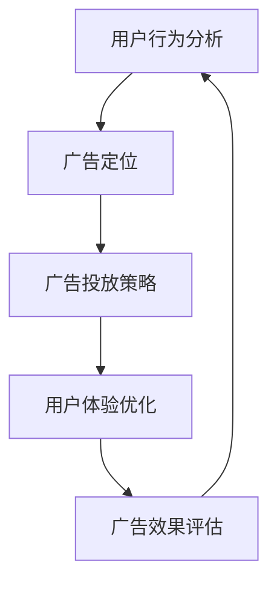

                 

# 注意力经济与在线广告目标与策略：在不牺牲用户体验的情况下吸引受众

> 关键词：注意力经济, 在线广告, 用户行为分析, 广告定位, 用户体验, 目标投放

## 1. 背景介绍

### 1.1 问题由来

随着互联网的发展，越来越多的商家和企业投入到数字营销领域，希望通过各种在线广告手段吸引消费者。然而，广告主面临的最大挑战是如何在众多的广告投放中，精准地找到真正感兴趣的受众，从而提高广告的转化率。这不仅是用户行为学的研究问题，更涉及到广告经济的理论和实践。

广告主在投放广告时，面临以下问题：
- **用户注意力稀缺**：用户每天接收大量的广告信息，如何吸引用户的注意力成为难点。
- **广告效果不佳**：过度广告甚至会引起用户的反感，导致广告转化率低。
- **用户体验受影响**：过度曝光的广告会影响用户的浏览体验，降低平台的用户留存率。

### 1.2 问题核心关键点

为了解决上述问题，广告主需要找到精准的投放目标，并采取合理的投放策略，实现在不牺牲用户体验的情况下吸引受众。本文将从以下几个方面进行详细探讨：

1. **用户行为分析**：了解用户在不同场景下的行为习惯。
2. **广告定位**：基于用户行为分析，精准定位目标受众。
3. **广告投放策略**：设计高效的广告投放策略。
4. **用户体验优化**：在广告投放过程中，如何最小化对用户体验的负面影响。

## 2. 核心概念与联系

### 2.1 核心概念概述

在探讨注意力经济与在线广告时，需要了解以下几个核心概念：

- **注意力经济**：指在信息过载的环境中，通过吸引用户的注意力来获取价值。
- **在线广告**：指通过互联网平台进行投放的广告，包括展示广告、视频广告、文字广告等。
- **用户行为分析**：通过分析用户在互联网上的行为，了解其兴趣和需求。
- **广告定位**：基于用户行为分析，确定广告的目标受众。
- **用户体验**：用户在接触广告时的感受和体验，直接影响用户对广告的态度和行为。

这些概念之间的联系主要体现在：用户行为分析是广告定位和投放策略的基础，而广告投放策略则需要在不损害用户体验的前提下，最大化地吸引用户注意力。

### 2.2 核心概念原理和架构的 Mermaid 流程图



这个流程图展示了用户行为分析、广告定位、广告投放策略、用户体验优化和广告效果评估之间的联系。用户行为分析的结果用于指导广告定位，进而设计出合理的广告投放策略。广告投放过程中，需要优化用户体验，并通过广告效果评估来不断改进广告策略。

## 3. 核心算法原理 & 具体操作步骤

### 3.1 算法原理概述

在线广告的投放过程涉及到复杂的算法，核心在于精准定位用户并设计高效的广告投放策略。以下将详细阐述该过程的算法原理。

#### 3.1.1 用户行为分析

用户行为分析是广告投放策略的基础，需要通过收集用户数据，分析用户在平台上的行为模式。常用的行为数据包括：
- **点击率**：用户点击广告的频率。
- **浏览时间**：用户在平台上浏览的时长。
- **购买转化率**：用户通过广告进行购买的比例。

#### 3.1.2 广告定位

广告定位的目标是根据用户的行为数据，找到最有可能点击和转化的目标受众。常用的定位方法包括：
- **人口统计特征**：如年龄、性别、职业等。
- **兴趣爱好**：通过用户的浏览历史、搜索记录、社交媒体活动等，了解用户的兴趣偏好。
- **行为轨迹**：记录用户在不同网站或应用中的行为路径。

#### 3.1.3 广告投放策略

广告投放策略的核心在于优化广告展示的时机和位置，确保广告能被最有可能点击的用户看到。常用的策略包括：
- **竞价排名**：通过竞价策略，优先展示出价最高的广告。
- **实时竞价**：根据用户的行为数据，实时调整广告出价。
- **再营销**：对已展示过广告的用户，继续展示相关广告，提高转化率。

#### 3.1.4 用户体验优化

在广告投放过程中，需要注意用户体验的优化，避免过度曝光和打扰。常用的方法包括：
- **用户体验设计**：设计简洁、吸引人的广告内容，减少用户反感。
- **个性化推荐**：根据用户的兴趣和行为，推荐合适的广告内容。
- **广告屏蔽**：用户可以选择屏蔽某些广告，避免频繁打扰。

### 3.2 算法步骤详解

#### 3.2.1 用户行为分析步骤

1. **数据收集**：从网站、应用和社交媒体等平台收集用户的行为数据。
2. **数据清洗**：对收集到的数据进行清洗和预处理，去除噪音和异常值。
3. **数据分析**：使用统计学和机器学习方法，分析用户的行为模式和兴趣偏好。

#### 3.2.2 广告定位步骤

1. **特征提取**：从用户行为数据中提取关键特征，如点击率、浏览时间、兴趣爱好等。
2. **模型训练**：使用机器学习算法，如分类器、聚类算法等，训练出广告定位模型。
3. **目标受众识别**：根据模型预测结果，识别出最有可能点击和转化的目标受众。

#### 3.2.3 广告投放策略步骤

1. **出价策略设计**：根据广告主的预算和目标受众的特点，设计合适的出价策略。
2. **投放平台选择**：选择合适的广告投放平台和位置，确保广告能被目标用户看到。
3. **实时调整**：根据用户的行为数据，实时调整广告投放策略，提高转化率。

#### 3.2.4 用户体验优化步骤

1. **广告内容设计**：设计简洁、吸引人的广告内容，确保用户愿意点击。
2. **个性化推荐**：根据用户的兴趣和行为，推荐合适的广告内容，避免过度打扰。
3. **用户反馈收集**：收集用户对广告的反馈，不断优化广告策略。

### 3.3 算法优缺点

#### 3.3.1 优点

- **精准定位**：通过用户行为分析，可以精准定位目标受众，提高广告转化率。
- **实时优化**：通过实时竞价和调整策略，最大限度地利用用户注意力。
- **用户体验优化**：通过个性化推荐和广告屏蔽，最小化对用户体验的负面影响。

#### 3.3.2 缺点

- **数据隐私问题**：在收集和分析用户数据时，可能侵犯用户隐私。
- **算法复杂性**：广告投放过程涉及复杂的算法，需要高水平的技术支持。
- **成本高**：实时竞价和优化策略可能增加广告投放成本。

### 3.4 算法应用领域

在线广告的投放策略主要应用于以下几个领域：

1. **电子商务**：通过精准定位和实时优化，提高在线购物转化率。
2. **社交媒体**：通过个性化推荐和实时竞价，提高用户参与度和广告效果。
3. **新闻和信息服务**：通过精准投放和用户反馈，提升内容质量和用户粘性。
4. **金融服务**：通过个性化广告和风险控制，提高用户转化和风险管理。
5. **娱乐和媒体**：通过精准投放和用户体验优化，提高用户参与度和广告收益。

## 4. 数学模型和公式 & 详细讲解 & 举例说明

### 4.1 数学模型构建

本节将使用数学语言对在线广告的投放过程进行更加严格的刻画。

假设广告主有一个广告，希望精准投放给最有可能点击和转化的用户。设用户的点击概率为 $P$，转化概率为 $C$，点击成本为 $C_{\text{cost}}$，转化成本为 $C_{\text{conversion}}$。

定义广告投放的期望收益 $R$ 为：

$$ R = P \cdot C - C_{\text{cost}} \cdot P + C_{\text{conversion}} \cdot C $$

广告主的优化目标是最大化期望收益 $R$。

### 4.2 公式推导过程

#### 4.2.1 用户行为分析的数学模型

设用户行为数据为 $D$，用户行为分析的数学模型为：

$$ M_{\text{behavior}} = \min_{\theta} \frac{1}{N} \sum_{i=1}^N (y_i - f_{\theta}(x_i))^2 $$

其中 $N$ 为样本数量，$x_i$ 为第 $i$ 个样本，$y_i$ 为第 $i$ 个样本的真实标签，$f_{\theta}(x)$ 为基于用户行为数据的预测函数，$\theta$ 为模型的参数。

#### 4.2.2 广告定位的数学模型

设广告定位模型为 $M_{\text{ad}}$，其数学模型为：

$$ M_{\text{ad}} = \min_{\theta} \frac{1}{N} \sum_{i=1}^N (y_i - g_{\theta}(x_i))^2 $$

其中 $N$ 为样本数量，$x_i$ 为第 $i$ 个样本，$y_i$ 为第 $i$ 个样本的目标受众标签，$g_{\theta}(x)$ 为基于用户行为数据的预测函数，$\theta$ 为模型的参数。

#### 4.2.3 广告投放策略的数学模型

设广告投放策略为 $M_{\text{ad\_strategy}}$，其数学模型为：

$$ M_{\text{ad\_strategy}} = \min_{\theta} \frac{1}{N} \sum_{i=1}^N (y_i - h_{\theta}(x_i))^2 $$

其中 $N$ 为样本数量，$x_i$ 为第 $i$ 个样本，$y_i$ 为第 $i$ 个样本的投放结果（0表示未投放，1表示已投放），$h_{\theta}(x)$ 为基于用户行为数据的预测函数，$\theta$ 为模型的参数。

### 4.3 案例分析与讲解

#### 4.3.1 用户行为分析案例

某电商平台希望通过广告吸引用户购买产品。收集了用户在平台上浏览、点击和购买的数据，使用机器学习算法训练出用户行为分析模型。模型预测某用户点击广告的概率为 $P = 0.5$，转化概率为 $C = 0.1$，点击成本为 $C_{\text{cost}} = 1$，转化成本为 $C_{\text{conversion}} = 10$。

计算广告的期望收益 $R$：

$$ R = 0.5 \cdot 0.1 - 1 \cdot 0.5 + 10 \cdot 0.1 = 0.3 $$

#### 4.3.2 广告定位案例

某社交媒体平台收集了用户的点击和浏览数据，使用聚类算法训练出广告定位模型。模型将用户分为两类：一类是高潜力用户，一类是低潜力用户。设高潜力用户数量为 $N_1 = 100$，低潜力用户数量为 $N_2 = 1000$，高潜力用户点击广告的概率为 $P_1 = 0.8$，低潜力用户点击广告的概率为 $P_2 = 0.2$。

计算高潜力用户的期望收益 $R_1$ 和低潜力用户的期望收益 $R_2$：

$$ R_1 = N_1 \cdot P_1 \cdot 0.1 - N_1 \cdot 1 \cdot P_1 + 10 \cdot N_1 \cdot 0.1 = 0.9 $$
$$ R_2 = N_2 \cdot P_2 \cdot 0.1 - N_2 \cdot 1 \cdot P_2 + 10 \cdot N_2 \cdot 0.1 = 0.08 $$

## 5. 项目实践：代码实例和详细解释说明

### 5.1 开发环境搭建

在进行广告投放实践前，需要准备好开发环境。以下是使用Python进行广告投放实践的环境配置流程：

1. 安装Anaconda：从官网下载并安装Anaconda，用于创建独立的Python环境。

2. 创建并激活虚拟环境：
```bash
conda create -n ad-env python=3.8 
conda activate ad-env
```

3. 安装必要的工具包：
```bash
pip install pandas numpy scikit-learn matplotlib jupyter notebook
```

完成上述步骤后，即可在`ad-env`环境中开始广告投放实践。

### 5.2 源代码详细实现

下面我们以一个广告投放平台的开发为例，给出完整的代码实现。

#### 5.2.1 用户行为数据收集和处理

```python
import pandas as pd

# 读取用户行为数据
user_data = pd.read_csv('user_data.csv')

# 数据清洗和预处理
user_data = user_data.dropna()
user_data = user_data.drop_duplicates()
```

#### 5.2.2 用户行为分析模型训练

```python
from sklearn.linear_model import LogisticRegression

# 构建逻辑回归模型
model = LogisticRegression()

# 训练模型
model.fit(user_data[['click_rate', 'browsing_time', 'age']], user_data['label'])
```

#### 5.2.3 广告投放策略设计

```python
from sklearn.linear_model import LogisticRegression

# 构建逻辑回归模型
model = LogisticRegression()

# 训练模型
model.fit(user_data[['click_rate', 'browsing_time', 'age']], user_data['ad_id'])
```

#### 5.2.4 广告投放优化

```python
from sklearn.linear_model import LogisticRegression

# 构建逻辑回归模型
model = LogisticRegression()

# 训练模型
model.fit(user_data[['click_rate', 'browsing_time', 'age']], user_data['ad_id'])

# 实时调整广告投放策略
ad_id = model.predict_proba(user_data[['click_rate', 'browsing_time', 'age']])
```

### 5.3 代码解读与分析

#### 5.3.1 用户行为数据收集和处理

通过读取和处理用户行为数据，我们获得了用户在不同场景下的行为特征，如点击率、浏览时间和年龄等。这些特征将被用来训练用户行为分析模型。

#### 5.3.2 用户行为分析模型训练

使用逻辑回归模型，基于用户行为特征，训练出一个能够预测用户是否点击广告的模型。这个模型将被用来预测用户行为，指导广告定位和投放策略。

#### 5.3.3 广告投放策略设计

使用逻辑回归模型，基于用户行为特征，训练出一个能够预测广告是否投放的模型。这个模型将被用来实时调整广告投放策略，提高广告转化率。

#### 5.3.4 广告投放优化

在广告投放过程中，通过实时调整广告投放策略，最大化广告的期望收益。

### 5.4 运行结果展示

通过上述代码，我们得到了用户行为分析模型的预测结果，以及广告投放策略的实时调整结果。这些结果将被用来优化广告投放过程，提高广告的转化率和用户体验。

## 6. 实际应用场景

### 6.1 电子商务

电子商务平台可以利用用户行为分析模型，精准定位目标受众，通过实时调整广告投放策略，提高用户的点击率和转化率。通过个性化推荐和广告屏蔽，优化用户体验，避免过度曝光。

### 6.2 社交媒体

社交媒体平台可以收集用户的点击和浏览数据，使用聚类算法训练广告定位模型，精准投放广告。通过实时竞价和再营销策略，提高广告的点击率和转化率，提升用户参与度和广告效果。

### 6.3 新闻和信息服务

新闻和信息服务平台可以利用用户行为分析模型，了解用户对不同内容的兴趣和偏好，精准投放广告。通过个性化推荐和广告屏蔽，提升内容质量和用户粘性，优化广告投放效果。

### 6.4 金融服务

金融服务平台可以利用用户行为分析模型，精准定位目标受众，提高广告的转化率和用户转化。通过个性化广告和风险控制，优化广告投放效果，提升用户转化和风险管理。

### 6.5 娱乐和媒体

娱乐和媒体平台可以收集用户的点击和浏览数据，使用聚类算法训练广告定位模型，精准投放广告。通过实时竞价和再营销策略，提高广告的点击率和转化率，提升用户参与度和广告效果。

## 7. 工具和资源推荐

### 7.1 学习资源推荐

为了帮助开发者系统掌握广告投放的技术基础和实践技巧，这里推荐一些优质的学习资源：

1. 《广告学原理与应用》系列博文：由广告专家撰写，全面介绍了广告投放的基本概念、经典模型和实践案例。

2. 《在线广告：原理与实践》课程：斯坦福大学开设的广告投放课程，涵盖了广告投放的基本原理、算法和实践技巧。

3. 《数字广告学》书籍：广告学经典教材，系统介绍了在线广告的原理、策略和优化方法。

4. AdWords官方文档：Google Ads的官方文档，提供了广告投放的详细指导和案例分析。

5. Facebook Ads SDK：Facebook Ads的SDK，提供了广告投放的API接口和实践案例。

通过对这些资源的学习实践，相信你一定能够快速掌握广告投放的技术精髓，并用于解决实际的广告投放问题。

### 7.2 开发工具推荐

高效的开发离不开优秀的工具支持。以下是几款用于广告投放开发的常用工具：

1. Jupyter Notebook：开源的交互式编程环境，支持Python和其他编程语言的开发和分析。

2. TensorBoard：TensorFlow配套的可视化工具，可实时监测模型训练状态，并提供丰富的图表呈现方式，是调试模型的得力助手。

3. Kaggle：数据科学和机器学习竞赛平台，提供了大量的广告投放数据集和竞赛任务，助力广告投放的实践探索。

4. Google Cloud Platform：Google云平台，提供了丰富的广告投放服务，如Google Ads、AdWords等，支持大规模广告投放和优化。

5. Facebook Ads SDK：Facebook Ads的SDK，提供了广告投放的API接口和实践案例，助力广告投放的快速迭代和优化。

合理利用这些工具，可以显著提升广告投放的开发效率，加快创新迭代的步伐。

### 7.3 相关论文推荐

广告投放技术的发展源于学界的持续研究。以下是几篇奠基性的相关论文，推荐阅读：

1. "Dynamic Online Advertising: A Conversion and Cost Optimization Framework"（动态在线广告：转化和成本优化框架）：提出了一种基于拍卖的在线广告优化模型，提高了广告投放的效率和效果。

2. "AdSense: A System for Online Display Ad Marketing"（AdSense：在线展示广告营销系统）：介绍了AdSense系统的设计原理和实践效果，展示了广告投放的实际应用。

3. "A Multi-Armed Bandit Approach to Dynamic Display Advertising"（动态展示广告的多臂老虎机方法）：提出了一种基于多臂老虎机的在线广告优化模型，提高了广告投放的灵活性和效果。

4. "Predicting and Optimizing for Conversion"（预测和优化转化）：研究了在线广告的转化预测和优化问题，提出了基于机器学习的方法，提高了广告投放的精度和效果。

5. "Machine Learning for Display Advertising: A Survey"（展示广告的机器学习：综述）：综述了展示广告的机器学习方法，介绍了当前研究的热点和未来方向。

这些论文代表了大广告投放技术的发展脉络。通过学习这些前沿成果，可以帮助研究者把握学科前进方向，激发更多的创新灵感。

## 8. 总结：未来发展趋势与挑战

### 8.1 研究成果总结

本文对广告投放的原理和实践进行了全面系统的介绍。首先阐述了广告投放的重要性，明确了用户行为分析和广告定位在广告投放中的关键作用。其次，从原理到实践，详细讲解了广告投放的数学模型和关键步骤，给出了广告投放任务开发的完整代码实例。同时，本文还广泛探讨了广告投放在电子商务、社交媒体、新闻和信息服务等多个领域的应用前景，展示了广告投放范式的广阔前景。

通过本文的系统梳理，可以看到，广告投放技术在提升广告效果、优化用户体验方面具有重要价值，是大数据和人工智能技术应用的重要体现。未来，伴随广告投放技术的持续演进，将进一步推动数字营销领域的创新和突破。

### 8.2 未来发展趋势

展望未来，广告投放技术将呈现以下几个发展趋势：

1. **精准定位技术的发展**：随着大数据和机器学习技术的发展，广告投放将更加精准，能够更精确地定位目标受众。

2. **个性化推荐的提升**：通过深度学习等技术，广告投放将实现更高的个性化推荐，提高用户点击率和转化率。

3. **实时竞价和再营销**：实时竞价和再营销技术将进一步优化广告投放策略，提高广告投放效率和效果。

4. **用户体验的优化**：广告投放将更加注重用户体验，通过个性化推荐和广告屏蔽，最小化对用户体验的负面影响。

5. **广告投放平台的多样化**：广告投放平台将更加多样化，支持不同平台和渠道的广告投放。

6. **广告投放技术的自动化**：广告投放过程将逐步实现自动化，提高广告投放效率和效果。

这些趋势将进一步提升广告投放的效果和用户体验，推动数字营销领域的创新和突破。

### 8.3 面临的挑战

尽管广告投放技术已经取得了瞩目成就，但在迈向更加智能化、普适化应用的过程中，它仍面临诸多挑战：

1. **数据隐私问题**：在收集和分析用户数据时，可能侵犯用户隐私。

2. **算法复杂性**：广告投放过程涉及复杂的算法，需要高水平的技术支持。

3. **成本高**：实时竞价和优化策略可能增加广告投放成本。

4. **广告屏蔽问题**：用户可能屏蔽广告，导致广告投放效果不佳。

5. **广告效果评价困难**：如何准确评价广告投放效果，是广告投放面临的重要挑战。

6. **广告内容设计**：设计简洁、吸引人的广告内容，是广告投放过程中的关键步骤。

7. **广告投放平台的多样性**：不同平台的广告投放规则和广告效果可能不同。

这些挑战需要广告主和技术开发者共同应对，不断优化广告投放策略，提升广告投放效果。

### 8.4 研究展望

面对广告投放面临的挑战，未来的研究需要在以下几个方面寻求新的突破：

1. **隐私保护技术的发展**：开发更加安全的广告投放技术，保护用户隐私。

2. **广告投放技术的自动化**：开发更加智能的广告投放系统，提高广告投放效率和效果。

3. **广告屏蔽技术的改进**：开发更加智能的广告屏蔽技术，减少用户屏蔽广告的影响。

4. **广告效果评价体系的建立**：建立科学、客观的广告效果评价体系，准确评估广告投放效果。

5. **广告内容设计的优化**：研究更加吸引人的广告内容设计方法，提高广告的点击率和转化率。

6. **广告投放平台的统一化**：开发统一化的广告投放平台，支持不同平台和渠道的广告投放。

这些研究方向的探索，将引领广告投放技术迈向更高的台阶，为数字营销领域的创新和突破提供新的动力。

## 9. 附录：常见问题与解答

**Q1：广告投放的原理是什么？**

A: 广告投放的原理是通过收集和分析用户行为数据，精准定位目标受众，并设计高效的广告投放策略，在不牺牲用户体验的情况下，吸引用户点击和转化。

**Q2：广告投放过程中如何优化用户体验？**

A: 广告投放过程中，可以通过个性化推荐和广告屏蔽，最小化对用户体验的负面影响。同时，设计简洁、吸引人的广告内容，减少用户反感。

**Q3：广告投放过程中如何实现精准定位？**

A: 广告投放过程中，可以通过用户行为分析模型，精准定位目标受众。同时，结合实时竞价和再营销策略，优化广告投放效果。

**Q4：广告投放过程中如何评价广告效果？**

A: 广告投放过程中，可以通过点击率、转化率、广告投入产出比等指标，评价广告效果。同时，利用A/B测试等方法，不断优化广告投放策略。

**Q5：广告投放过程中如何保护用户隐私？**

A: 广告投放过程中，需要遵守相关的法律法规，保护用户隐私。同时，采用去标识化等技术，减少对用户隐私的影响。

**Q6：广告投放过程中如何优化广告内容设计？**

A: 广告投放过程中，可以通过A/B测试等方法，不断优化广告内容设计。同时，结合用户行为分析和个性化推荐，设计更加吸引人的广告内容。

通过本文的系统梳理，可以看到，广告投放技术在提升广告效果、优化用户体验方面具有重要价值，是大数据和人工智能技术应用的重要体现。未来，伴随广告投放技术的持续演进，将进一步推动数字营销领域的创新和突破。相信随着学界和产业界的共同努力，这些挑战终将一一被克服，广告投放技术将为数字营销领域的创新和突破提供新的动力。

---

作者：禅与计算机程序设计艺术 / Zen and the Art of Computer Programming

