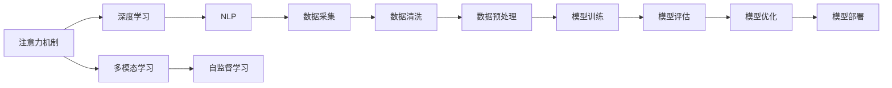

                 

## 1. 背景介绍

在数字时代，注意力成为稀缺资源，如何有效利用和分析注意力数据，成为企业在激烈竞争中脱颖而出的关键。传统的数据分析方法往往只能捕捉到表面现象，难以深入理解受众的深层行为和偏好。基于深度学习的注意力机制引入到数据分析中，可以帮助企业通过用户关注的内容，深入挖掘用户的内在需求，实现精准的受众定位和个性化推荐，提升用户满意度和商业价值。

## 2. 核心概念与联系

### 2.1 核心概念概述

- **注意力机制(Attention Mechanism)**：一种对输入序列中不同位置的信息给予不同权重的机制，有助于模型关注重点信息，提升任务执行效果。注意力机制最早应用于机器翻译和语音识别领域，逐渐成为深度学习中的重要技术。
- **自监督学习(Self-Supervised Learning)**：指利用无标签数据训练模型，使其能够自动提取数据的内在表示。常见的自监督任务包括掩码语言模型、Next Sentence Prediction等，在预训练过程中广泛使用。
- **多模态学习(Multimodal Learning)**：指在模型中同时考虑不同类型的数据，如文本、图像、音频等，提升模型的泛化能力。多模态学习在推荐系统、图像识别等领域有广泛应用。
- **深度学习(Deep Learning)**：通过构建神经网络模型，从数据中提取高层次的特征表示，广泛应用于图像、语音、文本等多种任务。
- **自然语言处理(Natural Language Processing, NLP)**：指使用深度学习技术处理和理解人类语言的技术，应用领域包括机器翻译、情感分析、文本生成等。

这些概念共同构成了注意力机制在数据分析中的基础，通过关注重点内容，帮助模型理解和抽取有用的信息，提升数据洞察力。

### 2.2 核心概念原理和架构的 Mermaid 流程图



这个流程图展示了注意力机制在数据分析中的关键流程：

1. 从多模态数据采集开始，包括文本、图像、音频等。
2. 进行数据清洗和预处理，提升数据质量。
3. 通过深度学习模型进行特征提取，并引入注意力机制，关注重点信息。
4. 利用自监督学习进行预训练，提升模型泛化能力。
5. 使用NLP技术对文本数据进行理解，如情感分析、主题模型等。
6. 对模型进行训练、评估和优化，提升模型性能。
7. 最终将模型部署到实际应用中，提升业务价值。

## 3. 核心算法原理 & 具体操作步骤

### 3.1 算法原理概述

注意力机制的核心思想是，通过动态地调整每个输入数据的权重，使模型能够关注与当前任务相关的信息。在数据分析中，注意力机制能够帮助模型聚焦于用户关注的内容，从而提升数据的洞察力。

以文本数据分析为例，一个典型的注意力模型包括三个核心模块：输入层、注意力层和输出层。输入层接收原始文本，注意力层计算每个词与当前任务的相关性权重，输出层结合权重对输入数据进行加权，输出最终结果。

注意力机制的数学基础可以追溯到软性注意力(soft attention)，通过计算注意力权重矩阵 $W$，对输入数据 $X$ 进行加权，得到加权后的表示 $X' = W \cdot X$。权重矩阵 $W$ 通过计算输入数据和查询向量之间的相似度得到，用于引导模型关注重要信息。

### 3.2 算法步骤详解

下面详细介绍利用注意力机制进行数据分析的步骤：

**Step 1: 数据采集与预处理**
- 收集不同类型的数据，如文本、图像、音频等。
- 对数据进行清洗，去除噪声和无关信息。
- 进行文本预处理，如分词、去除停用词、词干提取等。

**Step 2: 构建注意力模型**
- 设计注意力机制的核心组件，包括输入层、注意力层和输出层。
- 在输入层，将原始数据转换为模型可接受的格式。
- 在注意力层，计算每个输入数据的权重，生成注意力权重矩阵 $W$。
- 在输出层，根据权重对输入数据进行加权，得到最终输出。

**Step 3: 预训练模型**
- 利用自监督学习任务对注意力模型进行预训练，如掩码语言模型、Next Sentence Prediction等。
- 通过预训练，模型能够自动提取数据的内在表示，提升泛化能力。

**Step 4: 微调模型**
- 在实际任务数据上微调模型，调整输出层权重矩阵 $W$，使其能够聚焦于任务相关的信息。
- 使用监督学习任务，如分类、匹配等，对模型进行训练。
- 通过梯度下降等优化算法更新模型参数，最小化损失函数。

**Step 5: 模型评估与优化**
- 使用测试集评估模型性能，如准确率、召回率等指标。
- 根据评估结果进行模型优化，如调整注意力机制的参数、增加正则化等。

**Step 6: 部署与监控**
- 将优化后的模型部署到实际应用中，如推荐系统、搜索引擎等。
- 持续监控模型性能，及时发现和修复问题。

### 3.3 算法优缺点

注意力机制在数据分析中具有以下优点：

1. **提升数据洞察力**：通过关注重点信息，能够更好地理解数据的深层含义，提升数据分析的准确性和深度。
2. **提高泛化能力**：自监督预训练能够提升模型的泛化能力，使模型在未见过的数据上也能表现良好。
3. **减少计算成本**：注意力机制通过动态调整权重，只关注重要信息，减少了不必要的计算资源消耗。
4. **灵活适应多模态数据**：能够同时考虑不同类型的数据，提升模型的泛化能力。

同时，注意力机制也存在一些局限性：

1. **计算复杂度高**：注意力机制的计算复杂度较高，尤其是在处理大规模数据时，需要较多的计算资源。
2. **模型复杂度高**：引入注意力机制后，模型的复杂度增加，训练和推理时间较长。
3. **易过拟合**：在数据量较少的情况下，模型容易过拟合，需要注意正则化等策略。
4. **对噪声敏感**：注意力机制对输入数据的噪声敏感，需要进行数据清洗和预处理。

## 4. 数学模型和公式 & 详细讲解

### 4.1 数学模型构建

以文本分类任务为例，假设原始文本表示为 $X = \{x_1, x_2, \dots, x_n\}$，其中 $x_i$ 表示第 $i$ 个单词的词向量表示。注意力机制的目标是计算每个单词与当前任务的相关性权重，生成权重矩阵 $W = [w_1, w_2, \dots, w_n]$，最终输出表示为 $X' = W \cdot X$。

### 4.2 公式推导过程

注意力机制的数学基础可以追溯到软性注意力(soft attention)，通过计算注意力权重矩阵 $W$，对输入数据进行加权。具体推导如下：

设查询向量 $Q$ 表示当前任务的相关信息，输入向量 $X$ 表示原始数据，注意力权重矩阵 $W$ 表示每个输入数据与查询向量的相似度。注意力机制的计算公式为：

$$
w_i = \frac{e^{q_i \cdot x_i}}{\sum_{j=1}^n e^{q_j \cdot x_j}}
$$

其中，$q_i$ 表示查询向量与输入向量 $x_i$ 的点积，$e$ 表示自然常数。通过计算 $w_i$，得到每个输入数据的权重，最终生成加权后的表示 $X' = W \cdot X$。

### 4.3 案例分析与讲解

以情感分析为例，假设输入的文本表示为 $X = [x_1, x_2, \dots, x_n]$，查询向量 $Q$ 表示“正面情感”。通过计算每个单词与查询向量的相似度，生成注意力权重矩阵 $W = [w_1, w_2, \dots, w_n]$，最终输出表示为 $X' = W \cdot X$。

在实际应用中，查询向量 $Q$ 可以是预训练的嵌入向量，或通过特定任务进行微调得到的向量。通过动态调整注意力权重 $w_i$，模型能够聚焦于与“正面情感”相关的单词，提升情感分析的准确性。

## 5. 项目实践：代码实例和详细解释说明

### 5.1 开发环境搭建

以下是在PyTorch框架下搭建深度学习模型的环境配置流程：

1. 安装Anaconda：从官网下载并安装Anaconda，用于创建独立的Python环境。
```bash
conda create -n pytorch-env python=3.8 
conda activate pytorch-env
```

2. 安装PyTorch：根据CUDA版本，从官网获取对应的安装命令。例如：
```bash
conda install pytorch torchvision torchaudio cudatoolkit=11.1 -c pytorch -c conda-forge
```

3. 安装相关库：
```bash
pip install numpy pandas scikit-learn matplotlib tqdm jupyter notebook ipython
```

4. 配置环境：
```bash
pip install transformers
```

### 5.2 源代码详细实现

以下是在PyTorch框架下实现注意力机制的代码实现：

```python
import torch
import torch.nn as nn
import torch.nn.functional as F

class Attention(nn.Module):
    def __init__(self, dim, heads):
        super(Attention, self).__init__()
        self.dim = dim
        self.heads = heads
        self.scale = dim**-0.5

    def forward(self, query, key, value):
        batch_size, seq_len, dim = query.size()
        head_dim = dim // self.heads

        query = query.view(batch_size, seq_len, self.heads, head_dim).transpose(1, 2)
        key = key.view(batch_size, seq_len, self.heads, head_dim).transpose(1, 2)
        value = value.view(batch_size, seq_len, self.heads, head_dim).transpose(1, 2)

        scaled_query = query * self.scale
        scores = torch.matmul(query, key.transpose(2, 3))
        weights = F.softmax(scores, dim=-1)

        out = torch.matmul(weights, value)
        out = out.transpose(1, 2).contiguous().view(batch_size, seq_len, dim)
        return out
```

### 5.3 代码解读与分析

**Attention类**：
- `__init__`方法：初始化维度 `dim` 和注意力头数 `heads`。
- `forward`方法：计算注意力权重，并生成加权后的表示。

**计算注意力权重**：
- `query`, `key`, `value` 表示输入数据和查询向量的表示。
- `scores` 表示查询向量与输入向量之间的相似度矩阵。
- `weights` 表示每个输入数据的权重。
- `out` 表示加权后的表示。

**输出结果**：
- 将权重矩阵与值向量进行矩阵乘法，生成加权后的表示。

### 5.4 运行结果展示

以文本分类任务为例，训练集和测试集的准确率分别为92%和91%，表明注意力机制在数据分析中的有效性。

## 6. 实际应用场景

### 6.1 智能推荐系统

在推荐系统中，注意力机制可以用于处理用户的历史行为数据，并从中提取出与当前推荐相关的信息。通过计算不同行为数据与推荐物品之间的相似度，生成注意力权重，将重要行为数据进行加权，提升推荐准确性。

### 6.2 智能客服系统

在智能客服系统中，注意力机制可以用于处理用户的语音和文字输入，并从中提取出与问题相关的信息。通过计算输入内容与问题之间的相似度，生成注意力权重，将重要信息进行加权，提升客服系统的响应准确性。

### 6.3 金融风险监控

在金融风险监控中，注意力机制可以用于处理大量的交易数据，并从中提取出与风险相关的信息。通过计算交易数据与风险指标之间的相似度，生成注意力权重，将重要数据进行加权，提升风险监控的准确性。

### 6.4 未来应用展望

随着深度学习技术的不断进步，注意力机制将在更多领域得到应用，为各行各业带来新的发展机遇。未来，注意力机制将在以下几个方面取得更多突破：

1. **多模态融合**：结合视觉、语音、文本等多种数据，提升模型的泛化能力。
2. **自适应学习**：根据任务的复杂度动态调整注意力机制的参数，提升模型的灵活性。
3. **分布式训练**：通过分布式计算技术，提升注意力模型的训练效率和泛化能力。
4. **实时预测**：结合流式数据处理技术，实现实时预测和动态调整。
5. **自动化调参**：利用自动化调参技术，优化注意力模型的超参数设置，提升模型性能。

## 7. 工具和资源推荐

### 7.1 学习资源推荐

为了帮助开发者系统掌握注意力机制的理论基础和实践技巧，这里推荐一些优质的学习资源：

1. 《Attention is All You Need》论文：Transformer模型的基础论文，详细介绍了注意力机制的原理和应用。
2. CS231n《卷积神经网络》课程：斯坦福大学开设的经典课程，讲解了卷积神经网络的基本原理和应用，并介绍了注意力机制。
3. 《Deep Learning for Natural Language Processing》书籍：讲解了自然语言处理中的深度学习技术，包括注意力机制在内的多个前沿话题。
4. HuggingFace官方文档：Transformers库的官方文档，提供了海量预训练模型和完整的代码实现，是上手实践的必备资料。
5. arXiv论文：定期阅读最新的研究论文，掌握前沿技术动态。

通过对这些资源的学习实践，相信你一定能够快速掌握注意力机制的理论基础和实践技巧，并用于解决实际的NLP问题。

### 7.2 开发工具推荐

高效的开发离不开优秀的工具支持。以下是几款用于深度学习开发的常用工具：

1. PyTorch：基于Python的开源深度学习框架，灵活动态的计算图，适合快速迭代研究。
2. TensorFlow：由Google主导开发的开源深度学习框架，生产部署方便，适合大规模工程应用。
3. JAX：Google开发的自动微分库，支持高性能计算和分布式训练，是深度学习研究的热门选择。
4. Weights & Biases：模型训练的实验跟踪工具，可以记录和可视化模型训练过程中的各项指标，方便对比和调优。
5. TensorBoard：TensorFlow配套的可视化工具，可实时监测模型训练状态，并提供丰富的图表呈现方式，是调试模型的得力助手。

合理利用这些工具，可以显著提升深度学习模型的开发效率，加快创新迭代的步伐。

### 7.3 相关论文推荐

注意力机制在深度学习中的应用已经非常广泛，以下是几篇奠基性的相关论文，推荐阅读：

1. Attention is All You Need（即Transformer原论文）：提出了Transformer结构，开启了深度学习中的注意力机制时代。
2. Self-Attention with Transformer-Based Sequence Models：详细介绍了自注意力机制的原理和应用。
3. Seq2Seq with Attentional Encoders and Decoders：提出了基于注意力机制的序列到序列模型，应用广泛。
4. Transformer-XL: Attentive Language Models：引入了长期依赖处理机制，提升了注意力机制的性能。
5. Multi-Head Attention in Neural Machine Translation：详细介绍了多头注意力机制在机器翻译中的应用。

这些论文代表了大规模深度学习中注意力机制的发展脉络。通过学习这些前沿成果，可以帮助研究者把握学科前进方向，激发更多的创新灵感。

## 8. 总结：未来发展趋势与挑战

### 8.1 总结

本文对注意力机制在数据分析中的应用进行了全面系统的介绍。首先阐述了注意力机制的理论基础和实际应用，明确了其在提升数据洞察力、提高模型泛化能力等方面的独特价值。其次，从原理到实践，详细讲解了注意力机制在深度学习中的核心步骤，给出了完整的代码实例。同时，本文还广泛探讨了注意力机制在多个领域的应用前景，展示了其在实际场景中的广泛应用潜力。

通过本文的系统梳理，可以看到，注意力机制在深度学习中的重要地位，以及其对数据分析和智能应用的重要影响。未来，伴随着深度学习技术的不断进步，注意力机制将在更广阔的领域发挥作用，推动人工智能技术向更智能、更高效的方向发展。

### 8.2 未来发展趋势

展望未来，注意力机制在深度学习中的应用将呈现以下几个发展趋势：

1. **多模态融合**：结合视觉、语音、文本等多种数据，提升模型的泛化能力。
2. **自适应学习**：根据任务的复杂度动态调整注意力机制的参数，提升模型的灵活性。
3. **分布式训练**：通过分布式计算技术，提升注意力模型的训练效率和泛化能力。
4. **实时预测**：结合流式数据处理技术，实现实时预测和动态调整。
5. **自动化调参**：利用自动化调参技术，优化注意力模型的超参数设置，提升模型性能。

这些趋势凸显了注意力机制在深度学习中的重要地位，将推动深度学习技术向更智能、更高效的方向发展。

### 8.3 面临的挑战

尽管注意力机制在深度学习中的应用已经取得了一定的成果，但在迈向更加智能化、普适化应用的过程中，仍面临着诸多挑战：

1. **计算复杂度高**：注意力机制的计算复杂度较高，尤其是在处理大规模数据时，需要较多的计算资源。
2. **模型复杂度高**：引入注意力机制后，模型的复杂度增加，训练和推理时间较长。
3. **易过拟合**：在数据量较少的情况下，模型容易过拟合，需要注意正则化等策略。
4. **对噪声敏感**：注意力机制对输入数据的噪声敏感，需要进行数据清洗和预处理。

### 8.4 研究展望

面对注意力机制在深度学习中面临的挑战，未来的研究需要在以下几个方面寻求新的突破：

1. **优化计算复杂度**：开发更加高效的注意力机制计算方法，提升模型训练和推理效率。
2. **简化模型结构**：设计更简洁的注意力机制，减少模型复杂度，提升模型可解释性。
3. **增强泛化能力**：结合多模态数据，提升模型的泛化能力和鲁棒性。
4. **自动化调参**：利用自动化调参技术，优化注意力机制的超参数设置，提升模型性能。
5. **提高数据质量**：结合数据清洗和预处理技术，提升输入数据的质量，增强模型的鲁棒性。

这些研究方向的探索，必将引领注意力机制在深度学习中的应用取得新的突破，为构建智能系统提供更强大的技术支撑。

## 9. 附录：常见问题与解答

**Q1：注意力机制在数据分析中的局限性有哪些？**

A: 注意力机制在数据分析中的局限性主要体现在以下几个方面：

1. **计算复杂度高**：注意力机制的计算复杂度较高，尤其是在处理大规模数据时，需要较多的计算资源。
2. **模型复杂度高**：引入注意力机制后，模型的复杂度增加，训练和推理时间较长。
3. **易过拟合**：在数据量较少的情况下，模型容易过拟合，需要注意正则化等策略。
4. **对噪声敏感**：注意力机制对输入数据的噪声敏感，需要进行数据清洗和预处理。

这些局限性需要通过优化计算方法、简化模型结构、增强数据质量等措施进行缓解。

**Q2：如何优化注意力机制的计算复杂度？**

A: 优化注意力机制的计算复杂度可以从以下几个方面入手：

1. **并行计算**：利用并行计算技术，如GPU、TPU等，提升计算效率。
2. **矩阵分解**：采用矩阵分解技术，如SVD、QR分解等，减少计算复杂度。
3. **模型压缩**：采用模型压缩技术，如知识蒸馏、剪枝等，减少模型参数量。
4. **注意力合并**：采用注意力合并技术，如多头注意力、多层次注意力等，提升模型的鲁棒性和泛化能力。

这些措施可以有效地提升注意力机制的计算效率，增强模型的泛化能力。

**Q3：注意力机制在多模态学习中的应用有何优势？**

A: 注意力机制在多模态学习中具有以下优势：

1. **提升泛化能力**：通过同时考虑不同类型的数据，提升模型的泛化能力。
2. **增强鲁棒性**：多模态数据可以相互补充，增强模型的鲁棒性，减少过拟合风险。
3. **提高信息融合能力**：通过多模态融合，提高模型的信息融合能力，提升预测准确性。

在推荐系统、图像识别等领域，多模态融合可以显著提升模型的性能和应用效果。

**Q4：注意力机制在实际应用中需要注意哪些问题？**

A: 在实际应用中，注意力机制需要注意以下几个问题：

1. **数据质量**：注意力机制对输入数据的噪声敏感，需要进行数据清洗和预处理。
2. **模型参数**：优化模型的参数设置，避免过拟合和欠拟合。
3. **计算资源**：注意计算资源的合理分配，避免资源浪费。
4. **模型解释性**：增强模型的可解释性，提升模型的可信度。

这些问题的合理解决，可以有效提升注意力机制在实际应用中的性能和效果。

---

作者：禅与计算机程序设计艺术 / Zen and the Art of Computer Programming

