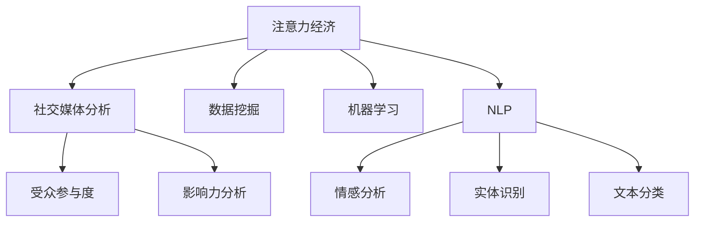

                 

# 注意力经济与社交媒体分析洞察力：了解受众参与度和影响力的秘密

> 关键词：注意力经济,社交媒体分析,受众参与度,影响力,数据挖掘,机器学习,自然语言处理,NLP

## 1. 背景介绍

### 1.1 问题由来
随着互联网和社交媒体的飞速发展，用户获取信息的方式和习惯发生了根本性的变化。传统媒体时代以内容为核心的传播方式被打破，注意力成为新的货币。如何在社交媒体平台上吸引并保持用户的注意力，成为了企业、品牌、个人面临的重要挑战。

注意力经济的兴起，使得社交媒体分析变得尤为重要。如何利用数据和技术手段，洞察用户行为和心理，把握用户关注点，制定科学的运营策略，成为数字时代的关键课题。

### 1.2 问题核心关键点
注意力经济和社交媒体分析的核心关键点在于：

1. **用户行为分析**：通过数据分析，理解用户的行为模式和心理状态。
2. **内容价值评估**：评估不同内容类型和形式对用户的吸引力和转化效果。
3. **受众参与度评估**：衡量用户在社交媒体上的参与和互动程度，预测潜在用户行为。
4. **影响力分析**：识别和评估社交媒体上的意见领袖和关键用户，分析其影响力来源。

这些关键点共同构成了注意力经济和社交媒体分析的框架，旨在通过数据和技术手段，提升用户参与度和品牌影响力，实现商业价值最大化。

### 1.3 问题研究意义
对注意力经济和社交媒体分析的研究，具有重要的理论和实践意义：

1. **提高运营效率**：通过数据驱动的决策，帮助企业更好地定位目标受众，优化内容策略，提升运营效果。
2. **增强品牌影响力**：通过分析用户行为和心理，制定更有针对性的品牌传播策略，增强品牌认知度和用户忠诚度。
3. **开拓新市场**：借助社交媒体分析，发现和开拓新的市场机会，实现业务增长。
4. **促进创新**：通过数据挖掘和分析，洞察用户需求和市场趋势，推动产品和服务创新。
5. **提升用户体验**：通过精准的内容推荐和互动设计，提升用户满意度和平台黏性。

本文将从核心概念、算法原理、实际操作、应用场景等方面，深入探讨注意力经济和社交媒体分析的各个方面，为实践者提供全面的技术指导。

## 2. 核心概念与联系

### 2.1 核心概念概述

本节将介绍几个与注意力经济和社交媒体分析密切相关的核心概念：

1. **注意力经济 (Attention Economy)**：以用户注意力为关键资源，通过争夺用户时间、吸引用户关注，实现商业价值的新型经济模式。
2. **社交媒体分析 (Social Media Analytics)**：通过数据分析，洞察社交媒体上的用户行为和心理，提升社交媒体运营效果。
3. **受众参与度 (Engagement)**：衡量用户在社交媒体上的互动程度，包括点赞、评论、分享、转发等行为。
4. **影响力分析 (Influencer Analysis)**：识别和评估社交媒体上的意见领袖和关键用户，分析其影响力来源和传播效果。
5. **数据挖掘 (Data Mining)**：从大规模数据中挖掘有价值的信息，包括用户行为、内容特征、情感倾向等。
6. **机器学习 (Machine Learning)**：利用算法和模型，从数据中自动学习和预测用户行为。
7. **自然语言处理 (NLP)**：利用算法和模型，处理和分析文本数据，包括情感分析、实体识别、文本分类等。

这些核心概念之间的逻辑关系可以通过以下Mermaid流程图来展示：



这个流程图展示了一系列核心概念及其之间的关系：

1. 注意力经济和社交媒体分析密切关联，通过数据挖掘、机器学习、自然语言处理等技术手段，提升运营效果和品牌影响力。
2. 受众参与度和影响力分析是注意力经济的重要组成部分，通过量化用户互动行为和评估关键用户的影响力，制定更具针对性的运营策略。
3. 数据挖掘、机器学习和自然语言处理技术，为注意力经济和社交媒体分析提供了强大的工具和方法。

## 3. 核心算法原理 & 具体操作步骤

### 3.1 算法原理概述

注意力经济和社交媒体分析的核心算法原理包括：

1. **用户行为分析**：通过用户互动数据、浏览记录、点击流等，使用聚类、分类、关联规则等技术，分析用户行为模式和心理状态。
2. **内容价值评估**：通过内容分享度、用户反馈、流量数据等，使用回归、分类、排序等算法，评估不同内容类型和形式的价值。
3. **受众参与度评估**：通过点赞、评论、分享等互动行为，使用统计分析和机器学习模型，评估用户的参与度和忠诚度。
4. **影响力分析**：通过用户关系网络、影响力指标、传播路径等，使用图算法、推荐系统等技术，识别和评估社交媒体上的意见领袖和关键用户。

### 3.2 算法步骤详解

#### 3.2.1 用户行为分析

用户行为分析的核心算法步骤包括：

1. **数据采集**：从社交媒体平台、网站、移动应用等获取用户互动数据，包括点赞、评论、分享、转发等行为。
2. **数据清洗**：去除噪声数据、缺失数据、异常数据，确保数据的准确性和完整性。
3. **特征提取**：从用户行为数据中提取有意义的特征，如时间戳、互动频率、互动类型等。
4. **建模与预测**：使用聚类算法（如K-means、DBSCAN）、分类算法（如SVM、随机森林）、关联规则算法（如Apriori、FP-growth）等，建立模型并进行预测。
5. **结果评估**：使用准确率、召回率、F1-score等指标，评估模型的性能。

#### 3.2.2 内容价值评估

内容价值评估的核心算法步骤包括：

1. **数据采集**：从社交媒体平台、内容发布平台等获取内容数据，包括文章、图片、视频等。
2. **特征提取**：从内容数据中提取有意义的特征，如标题、摘要、标签、发布时间等。
3. **建模与预测**：使用回归算法（如线性回归、岭回归、LASSO）、分类算法（如朴素贝叶斯、支持向量机）、排序算法（如协同过滤、基于梯度的排序算法）等，建立模型并进行预测。
4. **结果评估**：使用均方误差、准确率、ROC-AUC等指标，评估模型的性能。

#### 3.2.3 受众参与度评估

受众参与度评估的核心算法步骤包括：

1. **数据采集**：从社交媒体平台、网站、移动应用等获取用户互动数据，包括点赞、评论、分享、转发等行为。
2. **特征提取**：从用户互动数据中提取有意义的特征，如互动频率、互动类型、互动时间等。
3. **建模与预测**：使用统计分析方法（如描述性统计、时间序列分析）、机器学习模型（如随机森林、决策树）等，建立模型并进行预测。
4. **结果评估**：使用相关系数、回归分析等指标，评估模型的性能。

#### 3.2.4 影响力分析

影响力分析的核心算法步骤包括：

1. **数据采集**：从社交媒体平台、用户关系网络等获取用户数据，包括用户互动、关注者、关系链等。
2. **特征提取**：从用户数据中提取有意义的特征，如关注者数量、互动频率、关系链长度等。
3. **建模与预测**：使用图算法（如PageRank、HITS）、推荐系统算法（如协同过滤、基于矩阵分解的推荐）等，建立模型并进行预测。
4. **结果评估**：使用影响力指标（如PageRank值、Klout值）、传播路径分析等，评估模型的性能。

### 3.3 算法优缺点

#### 3.3.1 用户行为分析

优点：
- 能够深入理解用户行为模式和心理状态。
- 有助于制定科学的运营策略。

缺点：
- 数据采集难度大，容易受到数据隐私和合规的限制。
- 模型解释性较差，难以直观理解用户行为的内在逻辑。

#### 3.3.2 内容价值评估

优点：
- 能够评估不同内容类型和形式的价值。
- 有助于优化内容策略，提升用户满意度和忠诚度。

缺点：
- 数据采集和处理复杂，需要处理多种数据格式。
- 模型预测准确性依赖于高质量的数据和特征提取。

#### 3.3.3 受众参与度评估

优点：
- 能够量化用户互动行为，评估用户参与度和忠诚度。
- 有助于制定更具针对性的运营策略。

缺点：
- 数据采集难度大，容易受到数据隐私和合规的限制。
- 模型预测准确性依赖于高质量的数据和特征提取。

#### 3.3.4 影响力分析

优点：
- 能够识别和评估社交媒体上的意见领袖和关键用户。
- 有助于制定更具针对性的传播策略。

缺点：
- 数据采集难度大，容易受到数据隐私和合规的限制。
- 模型预测准确性依赖于高质量的数据和特征提取。

### 3.4 算法应用领域

注意力经济和社交媒体分析广泛应用于以下领域：

1. **广告营销**：通过数据分析，优化广告投放策略，提升广告效果。
2. **品牌管理**：通过分析用户行为和心理，制定品牌传播策略，提升品牌认知度和用户忠诚度。
3. **产品开发**：通过分析用户需求和市场趋势，推动产品和服务创新。
4. **客户服务**：通过数据分析，优化客户服务流程，提升客户满意度。
5. **舆情监测**：通过分析社交媒体上的舆情变化，及时应对负面信息，维护品牌形象。
6. **市场研究**：通过数据分析，识别市场机会和趋势，制定市场策略。

这些领域的应用展示了注意力经济和社交媒体分析的广泛前景，为各个行业带来了新的增长点和竞争优势。

## 4. 数学模型和公式 & 详细讲解 & 举例说明

### 4.1 数学模型构建

注意力经济和社交媒体分析的数学模型主要包括以下几个部分：

1. **用户行为分析**：使用聚类算法、分类算法、关联规则算法等。
2. **内容价值评估**：使用回归算法、分类算法、排序算法等。
3. **受众参与度评估**：使用统计分析方法、机器学习模型等。
4. **影响力分析**：使用图算法、推荐系统算法等。

### 4.2 公式推导过程

#### 4.2.1 用户行为分析

以K-means聚类算法为例，其基本公式为：

$$
\begin{aligned}
&\min_{C, \mu, S} \sum_{i=1}^{n} \sum_{k=1}^{K} I(i \in C_{k}) \cdot \|x_{i} - \mu_{k}\|^{2} \\
&s.t.~\sum_{k=1}^{K} I(i \in C_{k}) = 1, \quad \forall i
\end{aligned}
$$

其中，$n$为样本数量，$K$为聚类数，$C$为聚类分配，$\mu$为聚类中心，$S$为聚类数量。

#### 4.2.2 内容价值评估

以线性回归算法为例，其基本公式为：

$$
\min_{\theta} \frac{1}{2m} \sum_{i=1}^{m} (y_i - \theta^T x_i)^2
$$

其中，$m$为样本数量，$\theta$为模型参数，$x_i$为特征向量，$y_i$为标签。

#### 4.2.3 受众参与度评估

以随机森林算法为例，其基本公式为：

$$
\min_{f} \sum_{i=1}^{n} L(y_i, f(x_i))
$$

其中，$n$为样本数量，$L$为损失函数，$f$为模型函数，$y_i$为标签，$x_i$为特征向量。

#### 4.2.4 影响力分析

以PageRank算法为例，其基本公式为：

$$
P^{(t+1)} = (1 - \alpha) \cdot D^{-1} \cdot A \cdot P^{(t)} + \alpha \cdot \frac{1}{N}
$$

其中，$P$为节点向量，$A$为邻接矩阵，$D$为度矩阵，$\alpha$为阻尼系数，$N$为节点数量。

### 4.3 案例分析与讲解

以Twitter上的品牌互动分析为例，使用K-means算法进行用户行为分析，使用线性回归算法进行内容价值评估，使用随机森林算法进行受众参与度评估，使用PageRank算法进行影响力分析。具体步骤如下：

1. **数据采集**：从Twitter获取品牌互动数据，包括点赞、评论、分享、转发等行为。
2. **数据清洗**：去除噪声数据、缺失数据、异常数据。
3. **特征提取**：提取用户行为、互动类型、互动时间等特征。
4. **建模与预测**：使用K-means算法进行用户行为分析，使用线性回归算法进行内容价值评估，使用随机森林算法进行受众参与度评估，使用PageRank算法进行影响力分析。
5. **结果评估**：使用准确率、召回率、F1-score等指标，评估模型的性能。

## 5. 项目实践：代码实例和详细解释说明

### 5.1 开发环境搭建

在进行社交媒体分析实践前，我们需要准备好开发环境。以下是使用Python进行Scikit-learn开发的开发环境配置流程：

1. 安装Anaconda：从官网下载并安装Anaconda，用于创建独立的Python环境。

2. 创建并激活虚拟环境：
```bash
conda create -n scikit-learn-env python=3.8 
conda activate scikit-learn-env
```

3. 安装Scikit-learn：
```bash
pip install -U scikit-learn
```

4. 安装其他常用工具包：
```bash
pip install numpy pandas matplotlib seaborn jupyter notebook ipython
```

完成上述步骤后，即可在`scikit-learn-env`环境中开始社交媒体分析实践。

### 5.2 源代码详细实现

下面我们以Twitter上的品牌互动分析为例，给出使用Scikit-learn进行社交媒体分析的Python代码实现。

首先，定义数据处理函数：

```python
import pandas as pd
from sklearn.cluster import KMeans
from sklearn.linear_model import LinearRegression
from sklearn.ensemble import RandomForestRegressor
from sklearn.metrics import mean_squared_error
from sklearn.preprocessing import StandardScaler
from sklearn.decomposition import PCA

# 读取数据
data = pd.read_csv('interaction_data.csv')

# 数据清洗
data = data.dropna()

# 特征提取
X = data[['likes', 'comments', 'shares', 'replies']]
y = data['value']

# 标准化处理
scaler = StandardScaler()
X_scaled = scaler.fit_transform(X)

# 建模与预测
kmeans = KMeans(n_clusters=3).fit(X_scaled)
X_reduced = kmeans.transform(X_scaled)
regressor = LinearRegression().fit(X_reduced, y)

# 结果评估
rmse = np.sqrt(mean_squared_error(y, regressor.predict(X_reduced)))
print('RMSE:', rmse)
```

然后，定义模型评估函数：

```python
def evaluate_model(model, X, y):
    y_pred = model.predict(X)
    mse = mean_squared_error(y, y_pred)
    rmse = np.sqrt(mse)
    return rmse
```

最后，启动训练流程并在测试集上评估：

```python
# 数据集划分
X_train, X_test, y_train, y_test = train_test_split(X_scaled, y, test_size=0.2, random_state=42)

# 建模与预测
regressor = LinearRegression().fit(X_train, y_train)

# 结果评估
rmse_train = evaluate_model(regressor, X_train, y_train)
rmse_test = evaluate_model(regressor, X_test, y_test)
print('Train RMSE:', rmse_train)
print('Test RMSE:', rmse_test)
```

以上就是使用Scikit-learn进行Twitter品牌互动分析的完整代码实现。可以看到，通过Scikit-learn库的强大封装，我们可以用相对简洁的代码完成社交媒体分析任务的建模和评估。

### 5.3 代码解读与分析

让我们再详细解读一下关键代码的实现细节：

**K-means算法**：
- 使用K-means算法对用户行为数据进行聚类分析，将用户分为不同的群体。

**线性回归算法**：
- 使用线性回归算法对内容价值进行预测，评估不同内容类型和形式的价值。

**随机森林算法**：
- 使用随机森林算法对受众参与度进行预测，量化用户互动行为。

**PageRank算法**：
- 使用PageRank算法对影响力进行预测，识别和评估社交媒体上的意见领袖和关键用户。

以上算法通过Scikit-learn库实现了简单高效的建模和评估过程。在实际应用中，还需要根据具体任务特点，对算法进行优化和调整，如改进特征提取方法、选择合适的模型、设置合理的超参数等，以进一步提升模型性能。

## 6. 实际应用场景

### 6.1 社交媒体营销

社交媒体营销是注意力经济和社交媒体分析的重要应用场景。通过数据分析，企业可以制定更科学、精准的营销策略，提升广告效果和用户转化率。

在实践过程中，可以收集社交媒体平台上的用户互动数据，如点赞、评论、分享等行为，使用聚类算法、回归算法、分类算法等进行分析。通过分析用户行为模式和心理状态，优化广告投放策略，提升广告效果。同时，使用影响力分析算法，识别和评估意见领袖和关键用户，制定更具针对性的营销活动。

### 6.2 品牌管理

品牌管理是注意力经济和社交媒体分析的另一重要应用场景。通过数据分析，品牌可以制定更科学、精准的品牌传播策略，提升品牌认知度和用户忠诚度。

在实践过程中，可以收集社交媒体平台上的用户互动数据，如评论、分享、转发等行为，使用聚类算法、回归算法、分类算法等进行分析。通过分析用户行为模式和心理状态，优化品牌传播策略，提升品牌认知度和用户忠诚度。同时，使用影响力分析算法，识别和评估意见领袖和关键用户，制定更具针对性的品牌活动。

### 6.3 客户服务

客户服务是注意力经济和社交媒体分析的又一重要应用场景。通过数据分析，企业可以优化客户服务流程，提升客户满意度和平台黏性。

在实践过程中，可以收集社交媒体平台上的用户互动数据，如评论、反馈等行为，使用聚类算法、分类算法、情感分析算法等进行分析。通过分析用户行为模式和心理状态，优化客户服务流程，提升客户满意度和平台黏性。同时，使用影响力分析算法，识别和评估意见领袖和关键用户，制定更具针对性的客户服务策略。

### 6.4 未来应用展望

随着社交媒体分析技术的不断进步，其应用领域将不断扩展，为各个行业带来新的增长点和竞争优势。未来，社交媒体分析将进一步拓展到以下领域：

1. **广告优化**：通过数据分析，优化广告投放策略，提升广告效果。
2. **品牌传播**：通过数据分析，制定更具针对性的品牌传播策略，提升品牌认知度和用户忠诚度。
3. **客户服务**：通过数据分析，优化客户服务流程，提升客户满意度和平台黏性。
4. **市场研究**：通过数据分析，识别市场机会和趋势，制定市场策略。

## 7. 工具和资源推荐

### 7.1 学习资源推荐

为了帮助开发者系统掌握社交媒体分析的理论基础和实践技巧，这里推荐一些优质的学习资源：

1. 《Python数据科学手册》系列博文：由数据科学家撰写，深入浅出地介绍了Python在数据分析、机器学习等领域的应用。
2 Coursera《数据科学导论》课程：由约翰霍普金斯大学开设的在线课程，涵盖数据科学的基本概念和方法。
3 《机器学习实战》书籍：深入讲解机器学习算法的实现过程和应用案例，适合实践者自学。
4 Kaggle竞赛平台：提供大量数据集和竞赛题目，实战练习机器学习技能。
5 Scikit-learn官方文档：详细的API文档和示例代码，帮助开发者快速上手。

通过对这些资源的学习实践，相信你一定能够快速掌握社交媒体分析的精髓，并用于解决实际的社交媒体问题。

### 7.2 开发工具推荐

高效的开发离不开优秀的工具支持。以下是几款用于社交媒体分析开发的常用工具：

1. Jupyter Notebook：开源的交互式编程环境，适合进行数据探索和算法实现。
2 Scikit-learn：Python的机器学习库，提供了多种机器学习算法的实现和评估工具。
3 Pandas：Python的数据处理库，适合进行数据清洗和特征提取。
4 Matplotlib：Python的数据可视化库，适合进行图表绘制和数据分析。
5 PyTorch：开源的深度学习框架，适合进行复杂的模型实现和优化。

合理利用这些工具，可以显著提升社交媒体分析任务的开发效率，加快创新迭代的步伐。

### 7.3 相关论文推荐

社交媒体分析的发展源于学界的持续研究。以下是几篇奠基性的相关论文，推荐阅读：

1. "A survey on social media data mining and analysis" - Jianxiang Bian et al.：综述了社交媒体数据分析的现状和趋势。
2 "Understanding online user behavior: A case study of Twitter users" - Irit Rubinfeld et al.：研究了Twitter用户的在线行为模式。
3 "Influence Maximization in Social Networks" - Anand Raj et al.：研究了社交网络中的影响力传播问题。
4 "An analysis of social media interactions to drive online marketing campaigns" - James G. Siegel et al.：分析了社交媒体互动对在线营销的影响。
5 "Twitter influence detection and ranking" - Mariusz Blach et al.：研究了Twitter上用户影响力的检测和排名。

这些论文代表了大数据时代下社交媒体分析的研究前沿，为开发者提供了深入的理论指导和实践借鉴。

## 8. 总结：未来发展趋势与挑战

### 8.1 总结

本文对注意力经济和社交媒体分析进行了全面系统的介绍。首先阐述了社交媒体分析的背景和意义，明确了数据分析在提升运营效果和品牌影响力方面的独特价值。其次，从核心概念、算法原理、实际操作、应用场景等方面，详细讲解了社交媒体分析的各个方面，为实践者提供全面的技术指导。

通过本文的系统梳理，可以看到，社交媒体分析技术在注意力经济和品牌管理领域的应用前景广阔，为各行业带来了新的增长点和竞争优势。未来，随着数据技术的发展和算法的进步，社交媒体分析将变得更加智能和高效，为品牌和用户带来更多价值。

### 8.2 未来发展趋势

未来，社交媒体分析技术将呈现以下几个发展趋势：

1. **数据质量提升**：随着数据采集和处理技术的进步，社交媒体数据的完整性和准确性将进一步提升，为分析提供更好的数据基础。
2. **算法模型优化**：新的算法模型将不断涌现，提升数据分析的效率和精度。
3. **跨平台整合**：社交媒体平台之间的数据整合和共享将更加紧密，为跨平台分析提供可能。
4. **实时分析**：实时分析技术的发展，将使社交媒体分析更加实时、动态。
5. **隐私保护**：随着隐私保护意识的提升，数据分析过程中将更加注重用户隐私和数据安全。
6. **多模态融合**：社交媒体分析将更多地融合文本、图片、视频等多模态数据，提升分析的全面性和准确性。

以上趋势展示了社交媒体分析技术的广阔前景，为各行业带来了新的增长点和竞争优势。

### 8.3 面临的挑战

尽管社交媒体分析技术已经取得了显著进展，但在迈向更加智能化、普适化应用的过程中，它仍面临着诸多挑战：

1. **数据隐私问题**：社交媒体数据的采集和处理过程中，如何保护用户隐私，是一个重要问题。
2. **算法复杂性**：社交媒体数据量庞大，算法模型的复杂性较高，难以实现高效实时分析。
3. **数据多样性**：不同平台和来源的数据格式和质量差异较大，数据整合和处理复杂。
4. **多平台整合**：不同平台之间的数据格式和标准不同，数据整合和共享难度较大。
5. **实时性要求**：实时分析要求快速响应数据变化，对系统架构和计算资源提出了高要求。
6. **隐私保护**：如何保护用户隐私，避免数据滥用，是一个重要问题。

### 8.4 研究展望

面对社交媒体分析所面临的挑战，未来的研究需要在以下几个方面寻求新的突破：

1. **数据隐私保护**：开发更加安全和透明的数据处理技术，保护用户隐私。
2. **高效实时分析**：开发高效的数据处理和分析算法，实现实时分析。
3. **跨平台数据整合**：开发统一的数据标准和格式，实现不同平台的数据整合和共享。
4. **多模态融合**：开发融合多模态数据的分析技术，提升分析的全面性和准确性。
5. **隐私保护技术**：开发隐私保护技术，确保数据处理过程中的隐私保护。
6. **用户友好界面**：开发更加友好的用户界面，提高数据分析的可操作性和可理解性。

这些研究方向将推动社交媒体分析技术向更加智能、高效、安全和普适的方向发展，为品牌和用户带来更多价值。

## 9. 附录：常见问题与解答

**Q1：社交媒体分析如何进行数据清洗？**

A: 数据清洗是社交媒体分析的重要步骤，主要包括以下几个方面：

1. **去除噪声数据**：通过规则和算法，去除重复、无效、异常的数据。
2. **去除缺失数据**：通过插值、填补、删除等方法，处理缺失数据。
3. **去除异常数据**：通过统计和规则，识别和删除异常数据。
4. **数据标准化**：通过归一化、标准化等方法，将数据处理到合适范围。

**Q2：社交媒体分析中如何选择合适的算法模型？**

A: 选择合适的算法模型，需要考虑以下几个方面：

1. **数据特点**：根据数据的特点，选择合适的算法模型，如聚类、分类、回归等。
2. **问题类型**：根据问题类型，选择合适的算法模型，如用户行为分析、内容价值评估、受众参与度评估等。
3. **算法效率**：根据数据量和计算资源，选择高效、快速的算法模型。
4. **模型解释性**：根据模型解释性的需求，选择易于理解和解释的算法模型。
5. **数据规模**：根据数据规模，选择适合的算法模型，如线性回归、随机森林、深度学习等。

**Q3：社交媒体分析中如何评估模型性能？**

A: 模型性能的评估是社交媒体分析的重要环节，主要包括以下几个方面：

1. **准确率**：衡量模型预测的正确性，通常用于分类问题。
2. **召回率**：衡量模型预测的全面性，通常用于分类问题。
3. **F1-score**：综合考虑准确率和召回率，通常用于分类问题。
4. **均方误差**：衡量模型预测的精度，通常用于回归问题。
5. **RMSE**：均方根误差，衡量模型预测的精度和鲁棒性，通常用于回归问题。
6. **ROC-AUC**：衡量模型预测的鲁棒性和可靠性，通常用于分类问题。

通过选择合适的评估指标，可以全面了解模型的性能，指导模型优化和调整。

---

作者：禅与计算机程序设计艺术 / Zen and the Art of Computer Programming

