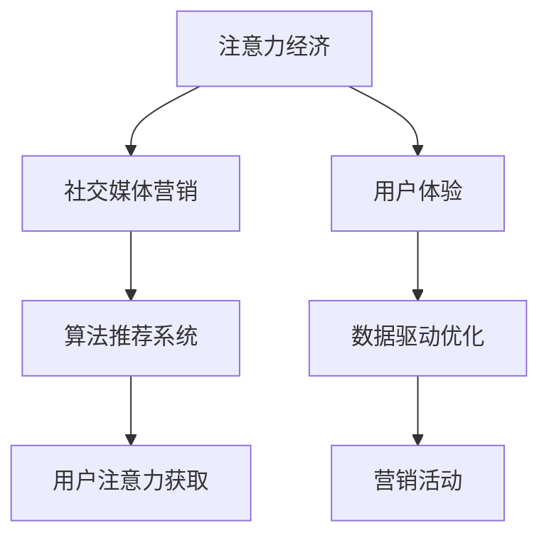

                 

## 1. 背景介绍

### 1.1 问题由来
随着互联网技术的飞速发展，社交媒体已成为当代人们获取信息、交流思想的重要平台。各大社交媒体平台如Facebook、Twitter、Instagram、微信、微博等，吸引了全球数十亿用户。社交媒体不仅改变了人们获取信息的方式，还对商业广告和内容营销产生了深远影响。如何有效地利用社交媒体平台，在提升品牌曝光度的同时，保证用户良好的体验，成为各大品牌和内容创作者关注的核心问题。

### 1.2 问题核心关键点
社交媒体营销面临的关键问题包括：

- **用户注意力获取**：如何在众多内容中脱颖而出，吸引用户注意力？
- **用户体验维护**：如何在营销活动中不牺牲用户体验，确保用户满意度？
- **数据分析和优化**：如何通过数据驱动策略调整，最大化营销效果？

### 1.3 问题研究意义
通过研究注意力经济与社交媒体营销策略，可以帮助企业和内容创作者在社交媒体平台上有效吸引受众，提升品牌价值和用户粘性。对于用户而言，意味着获得更优质的内容和信息体验。因此，这一研究具有重要的理论价值和实践意义。

## 2. 核心概念与联系

### 2.1 核心概念概述

为更好地理解注意力经济与社交媒体营销策略，本节将介绍几个密切相关的核心概念：

- **注意力经济**：指在信息爆炸的时代，注意力作为一种稀缺资源，成为影响市场竞争力的关键因素。企业和内容创作者需要不断创新内容和形式，吸引并保持用户的注意力。
- **社交媒体营销**：指通过社交媒体平台进行品牌推广、内容传播、用户互动等营销活动，实现商业目标的过程。
- **用户体验**：指用户在使用产品或服务过程中产生的满足感和愉悦感，包括界面设计、交互流程、内容质量等多个方面。
- **算法推荐系统**：指利用算法技术为用户推荐个性化内容，提升用户体验的同时，帮助企业更精准地触达目标用户。
- **用户注意力获取**：指在众多内容中，如何吸引用户点击、浏览、互动，提升内容的曝光率和传播效果。
- **数据驱动优化**：指通过数据分析，优化内容策略、营销手段，提高营销活动的效果和效率。

这些核心概念之间的逻辑关系可以通过以下Mermaid流程图来展示：



这个流程图展示了几大核心概念的相互关系：

1. 注意力经济为社交媒体营销提供价值基础，帮助企业理解用户注意力和市场价值。
2. 社交媒体营销是实现注意力经济价值的主要手段，通过内容传播和用户互动获取注意力。
3. 用户体验是社交媒体营销成功的关键，良好的体验能够吸引和保持用户注意力。
4. 算法推荐系统能够提升用户体验，同时帮助内容创作者更精准地获取用户注意力。
5. 用户注意力获取是社交媒体营销的核心目标，是营销效果优化的主要指标。
6. 数据驱动优化是提升营销效果的关键策略，通过数据分析不断优化内容和策略。

这些概念共同构成了社交媒体营销的基础框架，通过优化它们，可以实现更高效、更精准、更用户友好的营销效果。

## 3. 核心算法原理 & 具体操作步骤

### 3.1 算法原理概述

社交媒体营销的核心算法原理包括：

1. **推荐系统算法**：如协同过滤、矩阵分解、内容基推荐等，通过分析用户行为和内容特征，为用户推荐个性化内容。
2. **广告投放算法**：如线性回归、逻辑回归、随机森林等，通过预测广告点击率、转化率等指标，优化广告投放策略。
3. **用户行为分析算法**：如时间序列分析、聚类分析、关联规则挖掘等，分析用户行为模式，指导内容创作和营销策略调整。

这些算法通过数据驱动，能够帮助企业在社交媒体平台上更精准地触达目标用户，提升营销效果。

### 3.2 算法步骤详解

基于算法原理，社交媒体营销的详细步骤包括：

1. **数据收集**：收集社交媒体平台上的用户行为数据，如点击、浏览、评论、分享等行为。
2. **数据清洗与预处理**：去除噪声数据，进行数据归一化、特征提取等处理，构建有效的数据集。
3. **模型训练**：选择合适的算法模型，使用训练集进行模型训练，得到优化后的参数。
4. **模型评估与优化**：在验证集上评估模型性能，根据指标调整模型参数，进行多次迭代优化。
5. **部署与监控**：将优化后的模型部署到实际应用中，实时监控模型效果，进行持续优化。

### 3.3 算法优缺点

社交媒体营销的算法具有以下优点：

1. **个性化精准**：通过推荐系统和用户行为分析，能够精准触达目标用户，提升用户粘性和忠诚度。
2. **效率高**：利用算法自动推荐内容，减少了人工操作的成本，提升了营销活动的效率。
3. **效果可量化**：通过数据分析，能够客观评估营销活动的效果，指导策略调整。

同时，这些算法也存在一些缺点：

1. **依赖数据**：算法的效果依赖于数据的质量和数量，数据不足或噪音较大可能导致模型效果不佳。
2. **算法复杂度**：一些高级算法如深度学习模型、协同过滤算法等，需要较高的计算资源和专业知识。
3. **隐私风险**：用户行为数据涉及隐私信息，不当使用可能带来法律和伦理问题。
4. **过度个性化**：过度个性化可能导致信息泡沫，影响用户的多样化信息获取和认知发展。

### 3.4 算法应用领域

社交媒体营销的算法广泛应用于以下几个领域：

1. **内容推荐**：如Netflix、Amazon等平台的个性化内容推荐，帮助用户发现感兴趣的内容。
2. **广告投放**：如Facebook、Google AdWords等平台的广告投放优化，通过算法预测点击率和转化率，实现精准投放。
3. **用户画像构建**：通过分析用户行为数据，构建详细的用户画像，指导内容和营销策略。
4. **舆情监测**：如企业通过社交媒体监测工具，实时了解市场舆情和用户反馈，调整营销策略。
5. **广告效果评估**：通过算法评估广告投放效果，优化投放策略，提升广告ROI。

这些应用领域展示了算法在社交媒体营销中的广泛应用，帮助企业实现更高效的营销目标。

## 4. 数学模型和公式 & 详细讲解 & 举例说明

### 4.1 数学模型构建

社交媒体营销中的数学模型通常基于以下假设：

- **用户行为数据可用**：收集到的用户行为数据真实可靠，能够反映用户真实偏好。
- **模型具有可解释性**：模型参数和结果具有可解释性，便于理解和调整。
- **数据分布稳定**：用户行为数据分布稳定，不会因为时间变化产生重大变化。

常用的数学模型包括：

- **协同过滤算法**：通过分析用户行为数据，构建用户-物品关联矩阵，推荐用户可能感兴趣的内容。
- **矩阵分解算法**：将用户-物品关联矩阵分解为用户和物品两个低维向量，进行内容推荐。
- **内容基推荐算法**：将内容特征提取为向量，构建内容特征矩阵，通过相似度计算推荐相关内容。

### 4.2 公式推导过程

以协同过滤算法为例，其基本公式为：

$$
\hat{R}_{ui} = \hat{P}_{ui} + \hat{Q}_{ui}
$$

其中，$R_{ui}$ 表示用户 $u$ 对物品 $i$ 的实际评分，$P_{ui}$ 和 $Q_{ui}$ 分别表示用户和物品的潜在评分，$\hat{R}_{ui}$ 表示算法预测的评分。

对于协同过滤算法，常用的模型包括：

- **基于用户的协同过滤**：$P_{ui} = \alpha_u \cdot \sum_{j \in N(u)}\frac{R_{uj}}{||R_u|| \cdot ||R_j||}$
- **基于物品的协同过滤**：$Q_{ui} = \alpha_i \cdot \sum_{v \in N(i)}\frac{R_{vi}}{||R_i|| \cdot ||R_v||}$

其中，$N(u)$ 表示用户 $u$ 的邻域，$\alpha_u$ 和 $\alpha_i$ 为调节参数。

### 4.3 案例分析与讲解

以Netflix推荐系统为例，Netflix通过协同过滤算法为用户推荐个性化内容。Netflix首先收集用户观看记录，构建用户-物品关联矩阵。然后，通过矩阵分解算法将用户和物品的评分预测为潜在评分。最后，将用户和物品的潜在评分加权求和，得到推荐结果。

Netflix的推荐系统不仅提高了用户观看内容的满意度，还显著提升了用户粘性和留存率。通过持续优化推荐算法，Netflix能够在市场上保持领先地位。

## 5. 项目实践：代码实例和详细解释说明

### 5.1 开发环境搭建

进行社交媒体营销算法的开发，需要搭建一个包含数据处理、模型训练、效果评估等功能的开发环境。以下是Python开发环境搭建的具体步骤：

1. 安装Anaconda：从官网下载并安装Anaconda，用于创建独立的Python环境。

2. 创建并激活虚拟环境：
```bash
conda create -n pytorch-env python=3.8 
conda activate pytorch-env
```

3. 安装必要的库：
```bash
pip install torch pandas scikit-learn tensorflow tf-nightly scipy jupyter notebook ipython
```

4. 安装GitHub：从官网下载并安装GitHub桌面版或命令行工具。

完成上述步骤后，即可在`pytorch-env`环境中开始开发。

### 5.2 源代码详细实现

以下是使用TensorFlow实现协同过滤算法的代码示例：

```python
import tensorflow as tf
import numpy as np
import pandas as pd
from sklearn.model_selection import train_test_split

# 读取数据
df = pd.read_csv('ratings.csv')

# 数据清洗与预处理
user_ids = df['user_id'].unique()
item_ids = df['item_id'].unique()

# 构建用户-物品关联矩阵
R = np.zeros((len(user_ids), len(item_ids)))
for i in range(len(df)):
    user_id = df.iloc[i]['user_id']
    item_id = df.iloc[i]['item_id']
    R[user_ids.index(user_id), item_ids.index(item_id)] = df.iloc[i]['rating']

# 划分训练集和测试集
train_R, test_R = train_test_split(R, test_size=0.2, random_state=42)

# 模型训练
model = tf.keras.Sequential([
    tf.keras.layers.Dense(64, activation='relu'),
    tf.keras.layers.Dense(1)
])

model.compile(optimizer=tf.keras.optimizers.Adam(0.01), loss='mse')
model.fit(np.array(train_R), train_R.mean(axis=1), epochs=50, batch_size=32, validation_data=(np.array(test_R), test_R.mean(axis=1)))

# 模型评估
test_predictions = model.predict(np.array(test_R))
rmse = np.sqrt(np.mean((np.array(test_R) - test_predictions)**2))
print('RMSE:', rmse)
```

### 5.3 代码解读与分析

**数据预处理**：
- 使用Pandas库读取用户行为数据。
- 去除重复项和异常值，得到唯一的用户和物品ID。
- 构建用户-物品关联矩阵，将用户行为数据转换为矩阵形式。

**模型训练**：
- 使用TensorFlow搭建一个简单的神经网络模型，包含两个全连接层。
- 使用Adam优化器和均方误差损失函数进行训练。
- 划分训练集和测试集，进行模型训练。

**模型评估**：
- 使用测试集进行模型评估，计算RMSE指标。

通过这段代码，我们可以看到使用TensorFlow实现协同过滤算法的简单流程。开发者可以根据具体需求，优化模型结构、调整超参数，进一步提高推荐效果。

### 5.4 运行结果展示

运行上述代码后，可以得到模型的RMSE指标，评估模型的推荐效果。如果RMSE值越小，说明模型的预测准确度越高。

## 6. 实际应用场景

### 6.1 智能广告投放

社交媒体平台上的广告投放算法能够帮助企业精准触达目标用户，提高广告点击率和转化率。例如，Facebook的在线广告系统通过实时分析用户行为数据，预测广告效果，优化广告投放策略，实现更高效的广告投放。

### 6.2 个性化内容推荐

内容推荐系统能够根据用户的兴趣和行为，推荐个性化内容，提升用户体验。例如，Amazon的推荐系统通过协同过滤算法，为用户推荐感兴趣的商品，提高了用户购买率和满意度。

### 6.3 用户画像构建

通过分析用户行为数据，可以构建详细的用户画像，帮助企业了解用户特征和偏好，制定更有针对性的营销策略。例如，Netflix通过分析用户观看历史和评分数据，构建用户画像，指导内容创作和推荐。

### 6.4 舆情监测

社交媒体上的舆情监测系统能够实时分析用户反馈，帮助企业了解市场动态和用户情绪。例如，企业可以通过社交媒体监测工具，实时监测品牌声誉和用户反馈，及时调整营销策略。

### 6.5 广告效果评估

广告效果评估算法能够量化广告投放的效果，帮助企业优化广告预算和策略。例如，Google的AdWords系统通过预测广告点击率和转化率，优化广告投放，提升广告ROI。

这些应用场景展示了社交媒体营销算法在实际应用中的广泛应用，帮助企业实现更高效的营销目标。

## 7. 工具和资源推荐

### 7.1 学习资源推荐

为了帮助开发者系统掌握社交媒体营销算法，这里推荐一些优质的学习资源：

1. 《推荐系统算法》系列书籍：详细介绍了协同过滤、矩阵分解、内容基推荐等算法原理和实现方法。
2. 《社交媒体营销》在线课程：由知名高校和业界专家开设的课程，涵盖社交媒体营销的基本概念和实践技巧。
3. 《TensorFlow实战》书籍：TensorFlow官方团队编写的实战指南，提供大量实际案例和代码示例。
4. 《深度学习》在线课程：由斯坦福大学Andrew Ng教授开设的深度学习课程，涵盖深度学习的基本概念和应用实例。
5. GitHub社交媒体营销项目：GitHub上开源的社交媒体营销项目，提供丰富的代码示例和最佳实践。

通过对这些资源的学习实践，相信你一定能够快速掌握社交媒体营销算法，并用于解决实际的营销问题。

### 7.2 开发工具推荐

高效的开发离不开优秀的工具支持。以下是几款用于社交媒体营销算法的开发工具：

1. TensorFlow：基于Python的开源深度学习框架，灵活动态的计算图，适合快速迭代研究。大部分推荐系统算法都有TensorFlow版本的实现。

2. PyTorch：基于Python的开源深度学习框架，灵活易用，支持动态计算图。同样有丰富的推荐系统资源。

3. Jupyter Notebook：交互式的开发环境，支持代码编写、运行和可视化，适合数据探索和算法实现。

4. Weights & Biases：模型训练的实验跟踪工具，可以记录和可视化模型训练过程中的各项指标，方便对比和调优。与主流深度学习框架无缝集成。

5. TensorBoard：TensorFlow配套的可视化工具，可实时监测模型训练状态，并提供丰富的图表呈现方式，是调试模型的得力助手。

合理利用这些工具，可以显著提升社交媒体营销算法的开发效率，加快创新迭代的步伐。

### 7.3 相关论文推荐

社交媒体营销算法的研究源于学界的持续研究。以下是几篇奠基性的相关论文，推荐阅读：

1. 《 collaborative filtering for implicit feedback datasets》：提出了协同过滤算法的基本思想和实现方法。

2. 《 matrix factorization techniques for recommender systems》：介绍了矩阵分解算法在推荐系统中的应用。

3. 《 a probabilistic latent semantic analysis approach to collaborative filtering》：提出概率潜在语义分析算法，用于协同过滤和推荐系统。

4. 《 implicit feedback models and recommendation systems》：详细介绍了基于隐式反馈的推荐系统算法。

5. 《 deep learning-based recommendation systems》：综述了深度学习在推荐系统中的应用。

这些论文代表了大语言模型微调技术的发展脉络。通过学习这些前沿成果，可以帮助研究者把握学科前进方向，激发更多的创新灵感。

## 8. 总结：未来发展趋势与挑战

### 8.1 总结

本文对社交媒体营销算法的原理和操作步骤进行了全面系统的介绍。首先阐述了社交媒体营销的背景和核心问题，明确了算法的应用价值和研究意义。其次，从原理到实践，详细讲解了推荐系统、广告投放、用户行为分析等算法的核心步骤，给出了算法实现的代码示例。同时，本文还广泛探讨了算法在广告投放、内容推荐、用户画像构建等多个行业领域的应用前景，展示了算法的广泛应用。此外，本文精选了算法学习的各类资源，力求为读者提供全方位的技术指引。

通过本文的系统梳理，可以看到，社交媒体营销算法为企业在社交媒体平台上高效触达目标用户提供了重要手段，提升了营销活动的精准性和效率。未来，伴随算法的不断优化和创新，社交媒体营销技术必将在更多领域带来变革性影响。

### 8.2 未来发展趋势

展望未来，社交媒体营销算法将呈现以下几个发展趋势：

1. **算法模型的多样化**：除了传统的协同过滤、矩阵分解等算法，未来将涌现更多新型推荐系统算法，如深度学习、图神经网络等，提升推荐效果。

2. **数据驱动的优化**：未来的推荐系统将更加依赖数据驱动，通过实时数据流优化推荐策略，提升用户体验。

3. **用户隐私保护**：随着隐私保护意识的增强，推荐系统将更加注重用户隐私保护，采用匿名化、差分隐私等技术手段，保障用户数据安全。

4. **跨平台协同推荐**：未来的推荐系统将打破平台壁垒，实现跨平台协同推荐，提升推荐效果和用户体验。

5. **个性化与多样性平衡**：推荐系统将更加注重个性化与多样性的平衡，避免信息泡沫，提高用户的多样化信息获取和认知发展。

这些趋势凸显了社交媒体营销算法的广阔前景。这些方向的探索发展，必将进一步提升社交媒体营销的效果和效率，为品牌和内容创作者带来更多机会和挑战。

### 8.3 面临的挑战

尽管社交媒体营销算法已经取得了瞩目成就，但在迈向更加智能化、普适化应用的过程中，它仍面临着诸多挑战：

1. **数据质量与多样性**：推荐系统依赖于数据的质量和多样性，数据不足或分布不均可能导致模型效果不佳。如何获取高质量、多样化的用户行为数据，是重要的研究方向。

2. **算法复杂度**：一些高级算法如深度学习、协同过滤等，需要较高的计算资源和专业知识。如何降低算法复杂度，提高算法效率，是技术进步的关键。

3. **隐私与安全**：用户行为数据涉及隐私信息，不当使用可能带来法律和伦理问题。如何保护用户隐私，确保数据安全，是算法应用的前提。

4. **信息泡沫与多样性**：过度个性化可能导致信息泡沫，影响用户的多样化信息获取和认知发展。如何平衡个性化与多样性，提高用户的多样化信息获取，是推荐系统面临的重要挑战。

5. **算法透明性与可解释性**：推荐系统通常被视为"黑盒"系统，难以解释其内部工作机制和决策逻辑。如何增强算法的透明性与可解释性，是提升用户信任和接受度的重要手段。

这些挑战需要研究者从技术、伦理、政策等多个层面进行深入探索和解决，才能使社交媒体营销算法在更广泛的应用中发挥作用。

### 8.4 研究展望

面对社交媒体营销算法所面临的挑战，未来的研究需要在以下几个方面寻求新的突破：

1. **无监督与半监督学习**：摆脱对大规模标注数据的依赖，利用无监督和半监督学习，提升推荐系统的泛化能力和效率。

2. **跨模态推荐**：将视觉、语音、文本等多种模态数据进行融合，提升推荐系统的多样性和准确性。

3. **混合推荐系统**：将协同过滤、内容基推荐、混合推荐等多种算法进行融合，提升推荐系统的整体性能。

4. **深度强化学习**：结合强化学习思想，优化推荐系统策略，提升推荐效果和用户体验。

5. **公平性、透明性与可解释性**：研究推荐系统的公平性、透明性与可解释性，保障用户权益，提升用户信任。

这些研究方向将推动社交媒体营销算法的发展，帮助企业在社交媒体平台上实现更高效、更精准、更用户友好的营销目标。

## 9. 附录：常见问题与解答

**Q1：社交媒体营销算法是否适用于所有行业？**

A: 社交媒体营销算法在大多数行业中都有广泛应用。例如，电商平台通过推荐系统为用户推荐商品，提升销售转化率；视频平台通过推荐系统为用户推荐内容，提升用户留存率；新闻媒体通过推荐系统为用户推荐新闻，提升阅读量。

**Q2：如何优化推荐系统的性能？**

A: 推荐系统的性能优化可以从多个方面入手：

1. **数据质量**：收集高质量、多样化的用户行为数据，去除噪声和异常值。
2. **算法选择**：选择适合的推荐算法，如协同过滤、矩阵分解、深度学习等，根据任务特点进行选择。
3. **超参数调优**：调整模型参数和超参数，进行模型优化，如学习率、正则化系数等。
4. **实时数据流**：实时获取用户行为数据，动态调整推荐策略。
5. **A/B测试**：进行A/B测试，评估不同推荐策略的效果，选择最优策略。

**Q3：推荐系统如何平衡个性化与多样性？**

A: 推荐系统可以通过以下方法平衡个性化与多样性：

1. **多样性优先推荐**：在个性化推荐的基础上，添加多样性约束，确保推荐结果的多样性。
2. **多样化用户画像**：构建详细的用户画像，了解用户的兴趣和偏好，避免单一内容推荐。
3. **多样性感知模型**：使用多样性感知模型，如多样性感知协同过滤等，提升推荐结果的多样性。

**Q4：推荐系统如何保护用户隐私？**

A: 推荐系统可以通过以下方法保护用户隐私：

1. **匿名化处理**：对用户行为数据进行匿名化处理，去除可识别信息。
2. **差分隐私**：采用差分隐私技术，对用户数据进行处理，保护用户隐私。
3. **用户控制权**：给予用户控制权，让用户自主选择是否共享数据，保护用户隐私。

这些方法可以增强用户对推荐系统的信任，保障用户数据安全。

**Q5：推荐系统如何提升广告效果？**

A: 推荐系统可以通过以下方法提升广告效果：

1. **精准定向**：通过分析用户行为数据，精准定向投放广告，提高广告点击率和转化率。
2. **个性化内容**：结合用户兴趣和行为，设计个性化的广告内容，提高广告吸引力。
3. **实时优化**：实时监控广告效果，动态调整广告投放策略，提升广告ROI。

通过这些方法，推荐系统可以帮助企业实现更高效的广告投放。

---

作者：禅与计算机程序设计艺术 / Zen and the Art of Computer Programming

