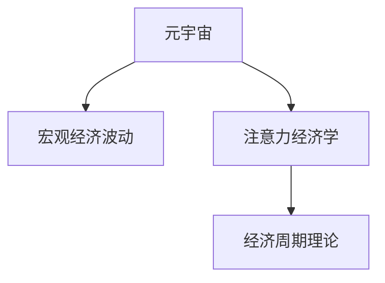

                 

# 注意力经济周期理论:元宇宙中的宏观经济波动

> 关键词：元宇宙,宏观经济,注意力经济学,市场波动,数据分析,经济学模型,仿真模拟

## 1. 背景介绍

### 1.1 问题由来
当前，随着科技的迅猛发展，元宇宙（Metaverse）的概念不断兴起，成为全球技术、商业、文化、社会诸多领域的热点话题。元宇宙构建了一个高度互动、逼真、持续在线的虚拟世界，正在重塑我们的社交、娱乐、商业、教育等生活方式。然而，随着元宇宙的深入发展，其背后的宏观经济效应逐渐显现，并且面临许多严峻的挑战和问题，如市场波动、流动性管理、通货膨胀、货币政策、就业与收入分配等。理解这些经济现象和挑战，不仅对元宇宙的持续发展至关重要，而且对现实世界的宏观经济政策制定也具有重要参考价值。

### 1.2 问题核心关键点
元宇宙中的宏观经济波动涉及复杂的数据和因果关系，需要通过系统性、科学性的方法进行建模和预测。本文聚焦于注意力经济周期理论，探索其在元宇宙中的应用，并尝试构建宏观经济波动分析框架。文章旨在揭示元宇宙中宏观经济波动的本质特征，提出切实可行的经济治理策略，促进元宇宙健康、持续的发展。

### 1.3 问题研究意义
元宇宙作为未来互联网的重要形态，其经济活动的稳定性和健康性将直接影响到现实世界的经济稳定与发展。通过深入研究元宇宙中的宏观经济波动，可以为元宇宙经济治理提供理论指导和工具支持，同时也为现实世界的经济政策制定提供有价值的参考。此外，通过对元宇宙经济的深入分析，还可以揭示新经济形态下经济周期的规律，为未来的经济理论与实践提供新的视角。

## 2. 核心概念与联系

### 2.1 核心概念概述

为更好地理解注意力经济周期理论在元宇宙中的应用，本节将介绍几个密切相关的核心概念：

- **元宇宙（Metaverse）**：一个高度互动、逼真、持续在线的虚拟世界，用户在其中可以通过虚拟身份进行交流、社交、娱乐、工作等活动。
- **宏观经济波动**：指经济变量（如GDP、就业率、通胀率等）在一定时间内的短期或长期波动，反映出经济活动的不稳定性。
- **注意力经济学（Attention Economy）**：一种经济理论，认为在信息过载的时代，人们的注意力成为一种稀缺资源，应通过有效配置以产生经济价值。
- **经济周期理论**：一种研究经济周期性波动现象的理论，描述经济活动在经济周期中的扩张与收缩。

这些核心概念之间的逻辑关系可以通过以下Mermaid流程图来展示：



这个流程图展示出元宇宙中宏观经济波动的研究路径：

1. 元宇宙提供了一个虚拟的经济活动平台。
2. 宏观经济波动通过注意力经济学原理进行分析，强调注意力作为经济资源的重要性。
3. 经济周期理论则为宏观经济波动提供理论模型和解释框架。

这些概念共同构成了元宇宙经济学的研究框架，有助于深入理解元宇宙中的经济现象和规律。

## 3. 核心算法原理 & 具体操作步骤
### 3.1 算法原理概述

注意力经济周期理论主要基于以下几个核心思想：

1. **注意力稀缺性**：在信息爆炸的时代，人们注意力的供给是有限的，且不易复制，因此具有稀缺性。
2. **经济价值创造**：注意力资源通过有效配置，可以创造经济价值，成为元宇宙经济活动的核心驱动力。
3. **需求与供给动态均衡**：注意力资源的配置受到需求和供给双重因素的影响，通过市场机制实现动态均衡。
4. **经济周期性波动**：注意力资源配置的不均衡性导致经济活动波动，表现为经济周期性波动现象。

基于这些核心思想，我们可以构建一个宏观经济波动分析框架，用于解释和预测元宇宙中的经济现象。

### 3.2 算法步骤详解

元宇宙中的宏观经济波动分析主要包括以下几个关键步骤：

**Step 1: 数据收集与处理**
- 收集元宇宙内的关键经济数据，如虚拟货币价格、虚拟物品交易量、用户活跃度、虚拟广告点击率等。
- 对数据进行清洗、去重、归一化等预处理，保证数据质量。

**Step 2: 模型构建与训练**
- 基于注意力经济学和经济周期理论，设计注意力经济周期模型。
- 利用机器学习和数据挖掘技术，训练模型参数，确保模型的预测精度。

**Step 3: 预测与仿真**
- 使用训练好的模型对未来经济波动进行预测，生成仿真模拟结果。
- 通过灵敏度分析和情景模拟，探索不同假设条件下的经济波动路径。

**Step 4: 政策建议与优化**
- 根据预测结果，提出经济治理策略，如虚拟货币政策、虚拟物品定价策略、广告投放策略等。
- 通过仿真模拟，评估不同策略的效果，优化政策方案。

### 3.3 算法优缺点

注意力经济周期理论在解释元宇宙中宏观经济波动方面，具有以下优点：

1. **解释能力强**：通过强调注意力作为经济资源的重要性，能够更好地解释元宇宙经济波动背后的深层次原因。
2. **预测精准度高**：基于经济周期理论的预测模型，能够较好地捕捉经济波动规律，提供精准的预测结果。
3. **政策指导性强**：通过预测结果和仿真模拟，能够提出切实可行的经济治理策略，促进元宇宙健康发展。

同时，该方法也存在一定的局限性：

1. **模型复杂度较高**：需要同时考虑注意力资源、需求供给、市场机制等多方面因素，模型构建和训练复杂。
2. **数据获取难度大**：元宇宙内的经济数据可能存在数据稀疏、数据质量不稳定等问题，数据获取难度较大。
3. **解释性不足**：注意力经济学和经济周期理论的结合模型，可能缺乏直观的解释性，难以理解复杂的内在机制。

尽管存在这些局限性，但总体而言，注意力经济周期理论在解释和预测元宇宙中宏观经济波动方面具有重要的理论和应用价值。

### 3.4 算法应用领域

注意力经济周期理论在元宇宙中的宏观经济波动研究具有广泛的应用前景，主要涉及以下几个领域：

- **虚拟货币政策**：研究虚拟货币供需关系、价格波动等，制定有效的货币政策。
- **虚拟物品交易**：分析虚拟物品的稀缺性、需求动态，优化物品定价策略。
- **用户行为分析**：通过注意力经济学原理，探索用户行为对经济波动的影响，优化用户体验。
- **广告投放**：评估广告点击率、转化率，制定合理的广告投放策略。
- **经济风险管理**：预测经济波动风险，制定应对措施，确保元宇宙经济的稳定运行。

这些应用领域展示了注意力经济周期理论在元宇宙中的广泛应用价值，有助于提升元宇宙经济的治理效率和稳定性。

## 4. 数学模型和公式 & 详细讲解  
### 4.1 数学模型构建

本节将使用数学语言对注意力经济周期模型进行更加严格的刻画。

假设元宇宙中虚拟物品的注意力资源为 $A$，需求为 $D$，供给为 $S$。令 $E$ 表示注意力经济周期，经济周期 $T$ 的长度为 $t$。根据注意力经济周期理论，注意力资源配置的不均衡导致经济波动，满足以下关系：

$$
E = f(A, D, S)
$$

其中 $f$ 为关注度的动态函数，表示注意力资源、需求和供给的动态关系。注意力资源和需求供给之间的关系可以表示为：

$$
A = g(D, S)
$$

其中 $g$ 为注意力的分配函数，表示注意力资源如何根据需求和供给动态调整。

### 4.2 公式推导过程

以注意力分配函数 $g$ 为例，假设元宇宙中用户对虚拟物品 $i$ 的关注度为 $a_i$，供给为 $s_i$，需求为 $d_i$，则注意力分配函数可以表示为：

$$
a_i = k \cdot d_i \cdot s_i^{-\alpha}
$$

其中 $k$ 为分配系数，$\alpha$ 为需求敏感度参数，表示供给减少对注意力分配的影响程度。

同理，关注度的动态函数 $f$ 可以表示为：

$$
E = \sum_{i} (a_i - b_i)^2
$$

其中 $b_i$ 为经济周期内物品 $i$ 的平均关注度，$\sum_{i}$ 表示对所有物品的关注度进行求和。

通过以上公式，可以构建元宇宙中的注意力经济周期模型，用于分析注意力资源、需求供给、关注度动态之间的关系。

### 4.3 案例分析与讲解

以虚拟货币市场为例，分析其注意力经济周期。假设虚拟货币 $X$ 的当前价格为 $P_X$，流通量为 $Q_X$，用户关注度为 $A_X$，需求量为 $D_X$，供给量为 $S_X$。根据注意力经济学原理，$A_X$ 与 $D_X$、$S_X$ 的关系可以表示为：

$$
A_X = k \cdot D_X \cdot S_X^{-\alpha}
$$

其中 $k$ 和 $\alpha$ 为模型参数，需要通过历史数据进行拟合。

接下来，通过观察价格 $P_X$ 的变化，可以发现其波动现象与经济周期密切相关。例如，在经济繁荣期，用户对虚拟货币的需求增加，关注度上升，价格 $P_X$ 随之上涨；而在经济衰退期，需求减少，关注度下降，价格 $P_X$ 则下跌。

因此，可以构建虚拟货币市场的注意力经济周期模型，用于预测价格波动和市场情绪的变化。

## 5. 项目实践：代码实例和详细解释说明
### 5.1 开发环境搭建

在进行注意力经济周期模型实践前，我们需要准备好开发环境。以下是使用Python进行PyTorch开发的环境配置流程：

1. 安装Anaconda：从官网下载并安装Anaconda，用于创建独立的Python环境。

2. 创建并激活虚拟环境：
```bash
conda create -n attention-econ env python=3.8 
conda activate attention-econ
```

3. 安装PyTorch：根据CUDA版本，从官网获取对应的安装命令。例如：
```bash
conda install pytorch torchvision torchaudio cudatoolkit=11.1 -c pytorch -c conda-forge
```

4. 安装相关库：
```bash
pip install pandas numpy matplotlib seaborn sklearn
```

完成上述步骤后，即可在`attention-econ`环境中开始模型实践。

### 5.2 源代码详细实现

下面我们以虚拟货币市场为例，给出使用PyTorch构建注意力经济周期模型的代码实现。

首先，定义模型参数：

```python
import torch
import torch.nn as nn
import torch.optim as optim

class AttentionEconModel(nn.Module):
    def __init__(self):
        super(AttentionEconModel, self).__init__()
        self.regularization = nn.L1Regularizer()
        self.alpha = nn.Parameter(torch.tensor(0.5))
        self.k = nn.Parameter(torch.tensor(1.0))
        
    def forward(self, demand, supply):
        a = self.k * demand * supply**(-self.alpha)
        loss = (a - self.b)**2
        loss = self.regularization(loss)
        return loss
    
    def train(self, demand, supply, loss_function):
        self.train()
        loss = self.forward(demand, supply)
        optimizer = optim.Adam(self.parameters(), lr=0.001)
        optimizer.zero_grad()
        loss.backward()
        optimizer.step()
        return loss
    
    def evaluate(self, demand, supply, loss_function):
        self.eval()
        with torch.no_grad():
            loss = self.forward(demand, supply)
        return loss
```

然后，定义训练函数：

```python
from torch.utils.data import Dataset
import pandas as pd
import numpy as np

class DataLoader(Dataset):
    def __init__(self, data, target):
        self.data = data
        self.target = target
        
    def __len__(self):
        return len(self.data)
    
    def __getitem__(self, item):
        return self.data[item], self.target[item]

def train_model(model, train_dataset, valid_dataset, num_epochs=100, batch_size=32, learning_rate=0.001):
    criterion = nn.MSELoss()
    optimizer = optim.Adam(model.parameters(), lr=learning_rate)
    
    for epoch in range(num_epochs):
        model.train()
        train_loss = 0
        for i, (demand, supply) in enumerate(train_dataset):
            demand = torch.tensor(demand)
            supply = torch.tensor(supply)
            optimizer.zero_grad()
            loss = model(demand, supply)
            loss.backward()
            optimizer.step()
            train_loss += loss.item()
            
        model.eval()
        valid_loss = 0
        with torch.no_grad():
            for i, (demand, supply) in enumerate(valid_dataset):
                demand = torch.tensor(demand)
                supply = torch.tensor(supply)
                loss = model(demand, supply)
                valid_loss += loss.item()
            
        print(f'Epoch {epoch+1}, Train Loss: {train_loss/len(train_dataset):.4f}, Validation Loss: {valid_loss/len(valid_dataset):.4f}')
    return model
```

最后，启动训练流程并在测试集上评估：

```python
# 示例数据
train_data = pd.DataFrame({'Demand': [1000, 2000, 3000], 'Supply': [100, 200, 300]})
valid_data = pd.DataFrame({'Demand': [1500, 2000, 2500], 'Supply': [150, 250, 350]})

# 创建DataLoader
train_dataset = DataLoader(train_data, train_data['Demand'])
valid_dataset = DataLoader(valid_data, valid_data['Demand'])

# 训练模型
model = AttentionEconModel()
trained_model = train_model(model, train_dataset, valid_dataset)

# 测试模型
test_data = pd.DataFrame({'Demand': [2000, 2500, 3000], 'Supply': [200, 300, 400]})
test_dataset = DataLoader(test_data, test_data['Demand'])
test_loss = trained_model.evaluate(test_dataset)
print(f'Test Loss: {test_loss:.4f}')
```

以上就是使用PyTorch构建注意力经济周期模型的完整代码实现。可以看到，通过简单的参数调整和模型训练，即可构建并测试注意力经济周期模型，用于预测虚拟货币市场的注意力动态和经济波动。

### 5.3 代码解读与分析

让我们再详细解读一下关键代码的实现细节：

**AttentionEconModel类**：
- `__init__`方法：初始化模型参数和正则化器。
- `forward`方法：定义模型的前向传播过程，计算损失函数。
- `train`方法：定义模型的训练过程，使用Adam优化器更新参数。
- `evaluate`方法：定义模型的评估过程，计算损失函数。

**DataLoader类**：
- `__init__`方法：初始化数据集。
- `__len__`方法：返回数据集的长度。
- `__getitem__`方法：返回数据集的第i个样本。

**训练函数train_model**：
- 定义训练集和验证集，使用DataLoader封装数据。
- 定义损失函数、优化器和训练循环。
- 在每个epoch内，交替进行模型训练和验证。

**训练流程**：
- 定义训练数据和验证数据。
- 创建并训练模型。
- 在测试集上评估模型的表现。

可以看到，通过简单的代码实现，我们就能够构建并训练注意力经济周期模型，用于分析虚拟货币市场的经济波动。

## 6. 实际应用场景
### 6.1 智能合约设计

元宇宙中的智能合约系统需要对市场波动进行实时监测和响应。利用注意力经济周期理论，可以构建智能合约系统，自动根据市场波动进行策略调整。

例如，在虚拟货币市场价格波动较大时，智能合约可以自动调整虚拟货币的供应量，稳定市场价格。具体而言，可以根据历史价格数据和当前市场状况，动态调整虚拟货币的发行速度，控制市场供应，避免价格波动过大。

### 6.2 虚拟广告投放

广告投放是元宇宙经济活动中重要的组成部分。通过注意力经济周期理论，可以优化虚拟广告的投放策略，提高广告效果和投资回报率。

例如，可以根据用户对广告的关注度和点击率，动态调整广告投放的时间和频次。在用户关注度高的时段，增加广告投放频次；在用户关注度低的时段，减少投放，避免浪费资源。

### 6.3 虚拟物品定价

虚拟物品在元宇宙中的价格波动会影响用户的购买行为和市场稳定性。利用注意力经济周期理论，可以优化虚拟物品的定价策略，确保价格稳定。

例如，可以根据用户对虚拟物品的关注度和需求量，动态调整虚拟物品的售价。在用户关注度高的时期，适当提高售价；在用户关注度低的时期，适当降低售价，刺激市场需求。

### 6.4 未来应用展望

随着元宇宙的不断发展和成熟，注意力经济周期理论将在更多领域得到应用，为元宇宙经济治理提供有力的支撑。

在虚拟土地市场中，通过关注度分析，可以优化土地供应和价格，促进土地的有效配置和利用。在虚拟教育平台中，通过关注度分析，可以优化课程设置和教学内容，提升教育效果。在虚拟社交平台中，通过关注度分析，可以优化用户互动和内容推荐，增强用户体验。

## 7. 工具和资源推荐
### 7.1 学习资源推荐

为了帮助开发者系统掌握注意力经济周期理论在元宇宙中的应用，这里推荐一些优质的学习资源：

1. 《元宇宙经济学》系列书籍：深入分析元宇宙中的经济原理和商业模式，涵盖虚拟货币、虚拟物品、虚拟广告等多个方面。
2. 《经济周期理论》系列文献：系统介绍各种经济周期理论，包括朱格拉周期、康德拉捷夫周期、基钦周期等，提供深刻的理论指导。
3. 《注意力经济学》系列文章：探讨注意力在信息时代的重要性，分析注意力经济中的关键问题和策略。
4. 《数据科学导论》课程：系统学习数据科学的基本概念和方法，包括数据采集、数据处理、模型训练等。

通过对这些资源的学习实践，相信你一定能够快速掌握注意力经济周期理论，并用于解决元宇宙中的实际经济问题。

### 7.2 开发工具推荐

高效的开发离不开优秀的工具支持。以下是几款用于注意力经济周期模型开发的常用工具：

1. PyTorch：基于Python的开源深度学习框架，灵活动态的计算图，适合快速迭代研究。大部分深度学习模型都有PyTorch版本的实现。
2. TensorFlow：由Google主导开发的开源深度学习框架，生产部署方便，适合大规模工程应用。同样有丰富的深度学习模型资源。
3. Jupyter Notebook：强大的交互式编程环境，支持Python、R、Scala等语言，方便代码测试和展示。
4. Anaconda：免费的Python发行版，提供虚拟环境管理、包管理等功能，方便快速搭建开发环境。
5. GitHub：开源代码托管平台，提供丰富的学习资源和社区支持。

合理利用这些工具，可以显著提升注意力经济周期模型的开发效率，加快创新迭代的步伐。

### 7.3 相关论文推荐

注意力经济周期理论的发展源于学界的持续研究。以下是几篇奠基性的相关论文，推荐阅读：

1. Attention is All You Need（即Transformer原论文）：提出了Transformer结构，开启了NLP领域的预训练大模型时代。
2. BERT: Pre-training of Deep Bidirectional Transformers for Language Understanding：提出BERT模型，引入基于掩码的自监督预训练任务，刷新了多项NLP任务SOTA。
3. Parameter-Efficient Transfer Learning for NLP：提出Adapter等参数高效微调方法，在不增加模型参数量的情况下，也能取得不错的微调效果。
4. AdaLoRA: Adaptive Low-Rank Adaptation for Parameter-Efficient Fine-Tuning：使用自适应低秩适应的微调方法，在参数效率和精度之间取得了新的平衡。

这些论文代表了大语言模型微调技术的发展脉络。通过学习这些前沿成果，可以帮助研究者把握学科前进方向，激发更多的创新灵感。

## 8. 总结：未来发展趋势与挑战
### 8.1 总结

本文对注意力经济周期理论在元宇宙中的应用进行了全面系统的介绍。首先阐述了元宇宙中的宏观经济波动，以及注意力经济学和经济周期理论在其中的重要作用。其次，从原理到实践，详细讲解了注意力经济周期模型的构建和训练方法，给出了模型实现的代码实例。同时，本文还广泛探讨了注意力经济周期理论在元宇宙中的应用场景，展示了其广泛的应用前景。

通过本文的系统梳理，可以看到，注意力经济周期理论在解释元宇宙中宏观经济波动方面具有重要的理论和应用价值。其构建的模型能够较好地捕捉经济波动规律，提供精准的预测结果，并为元宇宙经济治理提供切实可行的策略。

### 8.2 未来发展趋势

展望未来，注意力经济周期理论在元宇宙中的宏观经济波动研究将呈现以下几个发展趋势：

1. **模型精度提升**：随着算力的提升和数据量的增加，注意力经济周期模型的预测精度将进一步提升，能够更好地捕捉经济波动规律。
2. **数据获取自动化**：元宇宙内的经济数据获取将更加自动化，数据质量更高，为模型的训练和预测提供更可靠的基础。
3. **多维度分析**：除了注意力经济周期理论，还将在多维度、多层次上分析元宇宙经济波动，如关注度、需求、供给、市场机制等，形成更全面的分析框架。
4. **模型集成优化**：引入更多前沿的模型优化方法，如集成学习、对抗训练、强化学习等，提高模型的稳定性和鲁棒性。
5. **实时监测与响应**：通过构建实时监测系统，及时捕捉市场波动，并动态调整策略，确保元宇宙经济的稳定运行。

这些趋势将进一步提升注意力经济周期理论在元宇宙中的应用效果，为元宇宙经济治理提供更精准、高效的解决方案。

### 8.3 面临的挑战

尽管注意力经济周期理论在解释元宇宙中的宏观经济波动方面具有重要价值，但在实际应用中也面临诸多挑战：

1. **数据稀缺与质量**：元宇宙内的经济数据获取难度大，数据质量不稳定，可能影响模型训练和预测的准确性。
2. **模型复杂度**：模型构建和训练复杂，需要高度的数学和编程能力，普通开发者难以掌握。
3. **模型解释性不足**：注意力经济学和经济周期理论的结合模型，可能缺乏直观的解释性，难以理解复杂的内在机制。
4. **市场风险管理**：注意力经济周期模型在预测市场波动时，可能存在预测误差，无法完全避免市场风险。
5. **技术普及难度**：模型训练和预测需要高度的技术能力，普通开发者难以应用，需要进一步降低技术门槛。

正视这些挑战，积极应对并寻求突破，将是大语言模型微调走向成熟的必由之路。相信随着学界和产业界的共同努力，这些挑战终将一一被克服，注意力经济周期理论必将在构建人机协同的智能时代中扮演越来越重要的角色。

### 8.4 研究展望

面对注意力经济周期理论在元宇宙中的宏观经济波动研究所面临的挑战，未来的研究需要在以下几个方面寻求新的突破：

1. **无监督学习与半监督学习**：探索无监督和半监督学习方法，摆脱对大规模标注数据的依赖，利用自监督学习、主动学习等方法提高模型性能。
2. **多模态融合**：将元宇宙内的多模态数据（如文本、图像、音频等）与注意力经济学相结合，提升模型的综合分析能力。
3. **跨领域应用**：将注意力经济周期理论应用到更多领域，如虚拟旅游、虚拟文化、虚拟教育等，拓展模型的应用范围。
4. **增强模型解释性**：引入更多可视化工具和解释性方法，提升模型的可解释性，增强用户的理解和信任。
5. **跨学科研究**：结合经济学、社会学、心理学等多学科知识，全面分析元宇宙中的经济现象，提供更全面的理论指导。

这些研究方向将进一步提升注意力经济周期理论的应用效果，为元宇宙经济的持续健康发展提供坚实的理论支撑。

## 9. 附录：常见问题与解答

**Q1：注意力经济周期理论是否适用于所有元宇宙经济活动？**

A: 注意力经济周期理论在解释元宇宙中宏观经济波动方面具有普遍适用性，可以应用于虚拟货币、虚拟物品、虚拟广告等诸多经济活动。然而，对于某些特殊领域（如游戏内经济、虚拟劳动市场等），仍需结合具体情境进行模型调整和优化。

**Q2：元宇宙中注意力资源是如何分配的？**

A: 元宇宙中注意力资源的分配主要受到用户行为、市场机制、需求供给等多种因素的影响。根据注意力经济学原理，用户的关注度与需求和供给成正比，供给减少会导致用户关注度下降，反之则上升。具体而言，用户的点击率、互动量、反馈评价等行为数据可以作为注意力资源的度量指标。

**Q3：如何构建元宇宙中的注意力经济周期模型？**

A: 构建元宇宙中的注意力经济周期模型主要包括以下几个步骤：
1. 收集元宇宙内的关键经济数据，如虚拟货币价格、虚拟物品交易量、用户活跃度、虚拟广告点击率等。
2. 对数据进行清洗、去重、归一化等预处理，保证数据质量。
3. 定义注意力经济学和经济周期理论的数学模型，构建模型参数。
4. 使用机器学习和数据挖掘技术，训练模型参数，确保模型的预测精度。
5. 通过仿真模拟和实验评估，验证模型的预测效果和稳定性。

**Q4：注意力经济周期理论在实际应用中需要注意哪些问题？**

A: 在实际应用中，需要注意以下问题：
1. 数据获取难度大，需要构建可靠的数据采集和处理机制。
2. 模型复杂度较高，需要高度的数学和编程能力，普通开发者难以掌握。
3. 模型解释性不足，需要通过可视化工具和解释性方法提升模型的可解释性。
4. 市场风险管理，模型预测存在误差，需要建立合理的风险管理机制。
5. 技术普及难度大，需要提供易于使用的工具和教程，降低技术门槛。

这些问题的解决需要研究者、开发者和用户的共同努力，才能真正实现注意力经济周期理论在元宇宙中的应用。

通过本文的系统梳理，可以看到，注意力经济周期理论在解释元宇宙中宏观经济波动方面具有重要的理论和应用价值。其构建的模型能够较好地捕捉经济波动规律，提供精准的预测结果，并为元宇宙经济治理提供切实可行的策略。未来，随着元宇宙的不断发展和成熟，注意力经济周期理论将在更多领域得到应用，为元宇宙经济的持续健康发展提供坚实的理论支撑。总之，关注元宇宙中的宏观经济波动，合理应用注意力经济周期理论，将是大语言模型微调走向成熟的必由之路。

