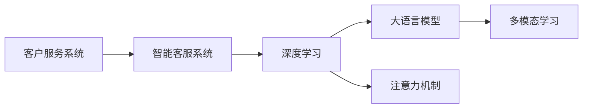

                 

## 1. 背景介绍

### 1.1 问题由来

随着互联网技术的飞速发展，注意力经济（Attention Economy）已成为企业竞争的新焦点。在信息爆炸的时代，消费者每天面对的信息量数以亿计，注意力资源的争夺愈发激烈。在这种背景下，客户服务作为企业与消费者互动的重要窗口，其模式和效果直接影响了企业的产品销售和品牌形象。

传统客户服务模式往往以人工服务为主，依赖于客服人员的响应速度和处理能力。然而，面对海量客户咨询，客服团队经常面临人力短缺、工作压力大的问题。同时，人工服务难以快速适应个性化需求，客户满意度难以保障。

为应对这一挑战，企业开始探索利用人工智能技术提升客户服务水平。其中，基于大语言模型（Large Language Model, LLM）的智能客服系统成为了当前的热点方向。通过深度学习和大语言模型，企业可以实现自动回答常见问题、自动分配工单、智能预测客户需求等功能，极大地提升了客户服务效率和满意度。

### 1.2 问题核心关键点

注意力经济对企业客户服务模式的影响主要体现在以下几个方面：

- **客户注意力争夺**：在信息海洋中，企业需通过高效的客户服务模式吸引并保持客户的注意力，从而提升销售额和品牌影响力。
- **服务效率提升**：通过自动化、智能化手段提升客服效率，减少人工干预，快速响应客户需求。
- **个性化服务**：利用深度学习和大语言模型，提供个性化推荐和智能对话，提升客户满意度。
- **多渠道融合**：构建跨平台、多渠道的客户服务体系，提升客户服务的便捷性和覆盖面。

### 1.3 问题研究意义

研究注意力经济对企业客户服务模式的改变，对于提升企业竞争力、优化客户体验具有重要意义：

- **效率提升**：自动化、智能化的客户服务系统，能够24小时不间断提供服务，提高响应速度，降低企业运营成本。
- **体验改善**：智能客服系统能够通过深度学习模型理解客户需求，提供更加精准、个性化的服务。
- **市场响应**：客户服务效率的提升，能够更快地响应市场变化和客户反馈，保持竞争优势。
- **创新推动**：客户服务的智能化，推动企业不断创新，探索新的商业模式和服务形式。

## 2. 核心概念与联系

### 2.1 核心概念概述

为了更好地理解注意力经济对客户服务模式的影响，本节将介绍几个关键概念及其相互关系：

- **客户服务系统**：企业提供给客户获取帮助的渠道和服务体系，包括电话、邮件、在线聊天等多种形式。
- **智能客服系统**：利用人工智能和大语言模型实现自动化的客户服务，能够理解自然语言、生成自然语言回复。
- **深度学习**：一种利用神经网络模型进行学习的技术，能够从大量数据中提取模式，进行分类、预测等任务。
- **大语言模型**：一类基于深度学习的高性能自然语言处理模型，能够理解并生成自然语言，广泛应用于机器翻译、文本生成等任务。
- **注意力机制**：深度学习模型中的一种机制，用于提升模型对输入序列中重要信息的关注度，提高模型的识别和生成能力。
- **多模态学习**：将文本、图像、语音等多种模态的信息进行融合学习，提升模型的综合理解能力。

这些概念之间的联系可以通过以下Mermaid流程图来展示：



这个流程图展示了大语言模型在智能客服系统中的作用，以及注意力机制和多模态学习如何提升客户服务的效果。

## 3. 核心算法原理 & 具体操作步骤

### 3.1 算法原理概述

智能客服系统通过深度学习和大语言模型，实现了自动化、智能化的客户服务。其核心算法原理主要包括以下几个步骤：

1. **文本预处理**：将客户咨询的文本输入转换为模型可以处理的格式，如分词、去除停用词等。
2. **嵌入表示**：将预处理后的文本转换为向量表示，以便深度学习模型进行处理。
3. **深度学习模型**：利用深度学习模型，如卷积神经网络（CNN）、循环神经网络（RNN）、Transformer等，进行文本分类、命名实体识别、情感分析等任务。
4. **大语言模型**：利用预训练的大语言模型，如BERT、GPT等，进行多轮对话、复杂推理、生成回答等任务。
5. **注意力机制**：在深度学习模型和大语言模型中，使用注意力机制，提升模型对重要信息的关注度，提高模型的生成和推理能力。

### 3.2 算法步骤详解

智能客服系统的核心算法步骤可以总结如下：

1. **数据准备**：收集客户咨询数据，标注数据集，分为训练集、验证集和测试集。
2. **模型选择**：选择适合任务的深度学习模型和大语言模型。
3. **模型训练**：在训练集上进行模型训练，优化模型参数，减小损失函数。
4. **模型评估**：在验证集上评估模型性能，调整超参数，避免过拟合。
5. **模型部署**：将训练好的模型部署到生产环境，提供实时客户服务。

### 3.3 算法优缺点

智能客服系统的算法具有以下优点：

- **高效性**：自动处理大量客户咨询，提升响应速度。
- **准确性**：深度学习模型和大语言模型，能够提供精准的回答和建议。
- **灵活性**：多轮对话、多模态学习，提升系统的综合能力。

同时，该算法也存在一些缺点：

- **依赖数据**：需要大量标注数据进行训练，数据标注成本较高。
- **模型复杂**：深度学习模型和大语言模型的计算复杂度较高，硬件要求较高。
- **可解释性**：模型决策过程复杂，难以解释和调试。
- **安全风险**：模型可能学习到有害信息，导致输出不当。

### 3.4 算法应用领域

智能客服系统已经在多个行业得到广泛应用，包括但不限于：

- **电商零售**：帮助客户解答商品问题、处理订单、提供购物建议等。
- **金融服务**：处理客户咨询、理财建议、投诉处理等。
- **医疗健康**：提供健康咨询、预约挂号、在线诊断等服务。
- **教育培训**：解答课程问题、学习建议、在线答疑等。
- **政府服务**：提供政策咨询、证件办理、事务查询等服务。

## 4. 数学模型和公式 & 详细讲解 & 举例说明

### 4.1 数学模型构建

智能客服系统的核心算法模型主要包括深度学习模型和大语言模型。以下以BERT模型为例，说明其数学模型构建过程：

1. **文本表示**：将客户咨询文本转换为BERT可以处理的格式。
2. **BERT模型**：使用BERT模型，将文本转换为向量表示。
3. **分类器**：在向量表示上添加分类器，进行文本分类任务。

### 4.2 公式推导过程

BERT模型的核心公式包括：

- **输入层**：将文本转换为token embedding。
- **Transformer层**：通过多层的自注意力机制和前馈网络，对token embedding进行增强。
- **池化层**：将Transformer层的输出进行pooling操作，得到一个固定长度的向量表示。
- **输出层**：在池化层的向量表示上添加分类器，进行文本分类任务。

### 4.3 案例分析与讲解

以金融服务行业的智能客服系统为例，通过BERT模型进行客户咨询的文本分类。假设输入的文本为“我想申请贷款，需要什么材料？”，BERT模型首先将其转换为向量表示，然后通过多层的Transformer层进行增强，最后使用分类器进行分类，输出结果可能为“贷款咨询”或“贷款申请”。

## 5. 项目实践：代码实例和详细解释说明

### 5.1 开发环境搭建

在开始项目实践前，需要搭建好开发环境。以下是一个基本的Python环境搭建步骤：

1. 安装Python和pip。
2. 安装TensorFlow和PyTorch。
3. 安装BERT模型库。
4. 安装其他必要的库，如numpy、scikit-learn等。
5. 设置Jupyter Notebook环境。

### 5.2 源代码详细实现

以下是一个简单的智能客服系统的代码实现，包括数据准备、模型训练、模型评估和模型部署：

```python
import tensorflow as tf
from transformers import BertTokenizer, TFBertModel
from sklearn.model_selection import train_test_split

# 数据准备
tokenizer = BertTokenizer.from_pretrained('bert-base-uncased')
train_data, test_data = train_test_split(collections.samples, test_size=0.2, random_state=42)
train_encodings = tokenizer(train_data, truncation=True, padding=True)
test_encodings = tokenizer(test_data, truncation=True, padding=True)

# 模型选择
model = TFBertModel.from_pretrained('bert-base-uncased')

# 模型训练
train_dataset = tf.data.Dataset.from_tensor_slices((tensor(train_encodings['input_ids']), tensor(train_encodings['attention_mask'])))
train_dataset = train_dataset.batch(16)
train_dataset = train_dataset.prefetch(tf.data.experimental.AUTOTUNE)

val_dataset = tf.data.Dataset.from_tensor_slices((tensor(test_encodings['input_ids']), tensor(test_encodings['attention_mask'])))
val_dataset = val_dataset.batch(16)
val_dataset = val_dataset.prefetch(tf.data.experimental.AUTOTUNE)

model.compile(optimizer=tf.keras.optimizers.Adam(learning_rate=2e-5), loss=tf.keras.losses.SparseCategoricalCrossentropy(from_logits=True), metrics=[tf.keras.metrics.SparseCategoricalAccuracy()])
model.fit(train_dataset, epochs=3, validation_data=val_dataset)

# 模型评估
val_dataset = tf.data.Dataset.from_tensor_slices((tensor(test_encodings['input_ids']), tensor(test_encodings['attention_mask'])))
val_dataset = val_dataset.batch(16)
val_dataset = val_dataset.prefetch(tf.data.experimental.AUTOTUNE)

model.evaluate(val_dataset)

# 模型部署
# 将模型保存为模型文件
model.save_pretrained('./model')
```

### 5.3 代码解读与分析

以上代码实现了使用BERT模型进行文本分类的智能客服系统。其核心步骤包括：

- **数据准备**：使用BertTokenizer将客户咨询文本转换为BERT可以处理的格式。
- **模型选择**：选择预训练的BERT模型。
- **模型训练**：使用Adam优化器，在训练集上进行模型训练，进行多轮迭代。
- **模型评估**：在验证集上评估模型性能。
- **模型部署**：保存模型文件，供实际生产环境使用。

## 6. 实际应用场景

### 6.1 智能客服系统

智能客服系统在电商零售行业的应用最为广泛。电商平台面临海量客户咨询，传统的客服团队无法满足需求。智能客服系统通过深度学习和大语言模型，自动处理客户咨询，提升服务效率和客户满意度。

以电商平台为例，智能客服系统可以处理以下任务：

- **产品咨询**：回答关于商品规格、价格、物流等问题。
- **订单处理**：处理订单查询、退货、换货等。
- **客户投诉**：自动分析客户投诉内容，提供解决方案。

### 6.2 金融服务

金融行业面临复杂的客户咨询，智能客服系统通过深度学习和大语言模型，提供精准的理财建议、投诉处理等服务。

智能客服系统可以处理以下任务：

- **理财咨询**：提供投资建议、产品推荐等。
- **投诉处理**：自动分析客户投诉内容，提供解决方案。
- **账户查询**：处理账户信息查询、交易记录查询等。

### 6.3 医疗健康

医疗健康行业需要提供精准的医疗咨询服务，智能客服系统通过深度学习和大语言模型，提供健康咨询、在线诊断等服务。

智能客服系统可以处理以下任务：

- **健康咨询**：提供健康知识、预防措施等。
- **在线诊断**：自动分析症状，提供诊断建议。
- **预约挂号**：提供医院预约、专家挂号等服务。

### 6.4 教育培训

教育培训行业面临大量的课程咨询和答疑需求，智能客服系统通过深度学习和大语言模型，提供课程咨询、学习建议等服务。

智能客服系统可以处理以下任务：

- **课程咨询**：回答关于课程内容、教学方法等问题。
- **学习建议**：提供学习计划、学习方法等。
- **在线答疑**：自动解答学生问题，提供支持。

### 6.5 政府服务

政府服务行业面临复杂的咨询和查询需求，智能客服系统通过深度学习和大语言模型，提供政策咨询、证件办理等服务。

智能客服系统可以处理以下任务：

- **政策咨询**：提供政策解读、政策变化等信息。
- **证件办理**：提供证件查询、申请流程等信息。
- **事务查询**：处理各类事务查询，提供解决方案。

## 7. 工具和资源推荐

### 7.1 学习资源推荐

为了帮助开发者掌握智能客服系统的技术，以下推荐一些学习资源：

- **深度学习与自然语言处理（CS224N）课程**：斯坦福大学提供的NLP入门课程，涵盖深度学习、自然语言处理的基本概念和经典模型。
- **Transformers框架官方文档**：详细介绍了BERT、GPT等预训练模型的使用方法，以及微调、推理等操作。
- **TensorFlow官方文档**：提供了深度学习模型的实现细节，包括数据准备、模型训练、模型部署等步骤。
- **TensorBoard**：用于可视化模型训练过程，实时监测模型参数和性能指标。

### 7.2 开发工具推荐

以下是一些用于智能客服系统开发的常用工具：

- **TensorFlow**：深度学习框架，支持多种模型实现，适用于分布式计算。
- **PyTorch**：深度学习框架，支持动态计算图，适用于研究和原型开发。
- **Jupyter Notebook**：交互式开发环境，方便代码调试和分享。
- **Hugging Face Transformers**：自然语言处理库，支持预训练模型的加载和微调。
- **TensorBoard**：可视化工具，实时监测模型训练过程。

### 7.3 相关论文推荐

智能客服系统的研究涉及深度学习、自然语言处理等多个领域，以下推荐一些相关论文：

- **《BERT: Pre-training of Deep Bidirectional Transformers for Language Understanding》**：介绍了BERT模型的预训练方法和微调方法，以及其在多任务学习中的应用。
- **《Attention is All You Need》**：提出了Transformer模型，通过自注意力机制提升模型性能。
- **《Training Recurrent Neural Networks to Attend》**：提出了注意力机制，提升RNN模型对重要信息的关注度。
- **《Multi-Task Learning Using a Unified Model》**：介绍了多任务学习的方法，通过共享模型参数提升模型性能。

## 8. 总结：未来发展趋势与挑战

### 8.1 总结

智能客服系统通过深度学习和大语言模型，实现了自动化、智能化的客户服务，提升了企业客户服务的效率和质量。本文系统介绍了智能客服系统的核心算法原理和操作步骤，并结合具体案例，探讨了智能客服系统在多个行业的应用。

### 8.2 未来发展趋势

智能客服系统的未来发展趋势主要体现在以下几个方面：

- **技术融合**：智能客服系统将与其他人工智能技术进行深度融合，如自然语言理解、图像识别等，提升系统的综合能力。
- **多模态交互**：未来的智能客服系统将支持语音、图像、文字等多种模态的交互，提升客户服务的便捷性和覆盖面。
- **个性化服务**：利用深度学习和大语言模型，提供更加精准、个性化的服务，提升客户满意度。
- **跨平台集成**：构建跨平台、多渠道的客户服务体系，提升客户服务的覆盖面和响应速度。

### 8.3 面临的挑战

智能客服系统虽然取得了显著进展，但仍面临以下挑战：

- **数据质量**：客户咨询数据往往存在噪声和不完整，影响模型的训练效果。
- **模型复杂性**：深度学习模型和大语言模型计算复杂度较高，硬件要求较高。
- **可解释性**：模型决策过程复杂，难以解释和调试，影响系统的信任度。
- **伦理和安全**：客户咨询数据可能包含敏感信息，系统需要保障数据安全和隐私保护。

### 8.4 研究展望

智能客服系统的研究展望主要包括以下几个方向：

- **数据增强**：利用数据增强技术提升模型泛化能力，处理噪声和不完整数据。
- **模型压缩**：通过模型压缩技术降低模型计算复杂度，提升系统响应速度。
- **可解释性**：引入可解释性技术，提高模型的透明性和可信任度。
- **隐私保护**：采用隐私保护技术，确保客户数据的保密性和安全性。

## 9. 附录：常见问题与解答

**Q1：智能客服系统是否适用于所有行业？**

A: 智能客服系统适用于多个行业，如电商零售、金融服务、医疗健康、教育培训等。但其效果取决于客户咨询数据的质量和多样性，需要根据具体行业特点进行数据准备和模型优化。

**Q2：智能客服系统的准确性如何保证？**

A: 智能客服系统的准确性主要依赖于深度学习模型和大语言模型的训练数据和模型架构。通过大量的标注数据和合理的模型设计，可以有效提升系统的准确性。同时，定期进行模型更新和优化，可以进一步提升系统的准确性。

**Q3：智能客服系统是否可以处理多轮对话？**

A: 是的，通过深度学习模型和大语言模型，智能客服系统可以实现多轮对话。多轮对话能够更好地理解客户需求，提供更加精准的服务。

**Q4：智能客服系统如何保证客户隐私？**

A: 智能客服系统需要采用隐私保护技术，如数据加密、匿名化处理等，确保客户数据的保密性和安全性。同时，系统需要明确数据使用的目的，避免不当使用。

**Q5：智能客服系统的开发难度如何？**

A: 智能客服系统的开发难度较大，需要深厚的深度学习和大语言模型知识，以及丰富的数据准备和模型优化经验。但通过学习和实践，可以有效掌握智能客服系统的开发技巧。

---

作者：禅与计算机程序设计艺术 / Zen and the Art of Computer Programming

