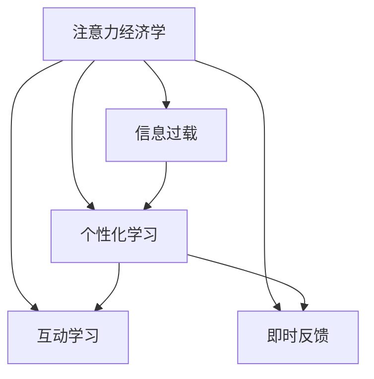

                 

# 注意力经济对传统教育模式的冲击

## 1. 背景介绍

在数字化浪潮的推动下，信息过载和注意力分散已成为当前社会的普遍现象。这种新型的经济形态被称作“注意力经济”，即在信息的海洋中争夺用户的注意力成为新的核心竞争力。在教育领域，这一现象同样显著，特别是在互联网和数字化技术的催化下，传统教育模式面临着巨大的冲击和挑战。

### 1.1 问题由来

传统教育模式以知识传授为核心，教师通过课堂讲授、作业批改等方式，将知识从教师传递到学生。然而，随着信息技术的普及和互联网的广泛应用，学生获取知识的渠道日益多样化，课程内容也变得前所未有的丰富和庞杂。传统教育模式的高信息输出量和低互动性，在满足学生个性化需求和提升学习体验方面显得力不从心。

### 1.2 问题核心关键点

注意力经济对传统教育模式的冲击主要体现在以下几个方面：

- **信息过载**：随着互联网的普及，学生可以轻易地接触到海量的学习资源，包括各类在线课程、学术论文、视频教程等。这些资源的庞杂和多样性使得学生在信息检索和筛选方面面临巨大挑战。

- **分散注意力**：数字化工具和社交媒体的广泛应用，使得学生在课堂上难以集中精力，容易分心走神，导致学习效率低下。

- **知识个性化**：学生在信息获取时，可以根据自身兴趣和需求，主动选择感兴趣的课程和内容，这使得学习变得更加个性化和主动。但这也给传统教育模式的统一教学模式带来了冲击。

- **教学互动**：传统的面对面教学方式被在线课程、讨论论坛、协作工具等替代，学生在互动方式和参与度上有了更多选择。

- **反馈机制**：传统的作业批改方式被在线测评和即时反馈所取代，学生能实时了解学习情况，提高学习效果。

## 2. 核心概念与联系

### 2.1 核心概念概述

要深入理解注意力经济对传统教育模式的影响，首先需要明确以下几个核心概念：

- **注意力经济学**：研究注意力作为一种稀缺资源如何被分配、交换和使用的经济学分支。
- **信息过载**：指信息源过多导致个人或系统无法有效处理的现象。
- **个性化学习**：根据学生的需求和兴趣定制个性化的学习路径和内容。
- **互动学习**：强调学习过程中教师与学生、学生与学生之间的互动和交流。
- **即时反馈**：学习过程中实时获取反馈，及时调整学习策略，提高学习效果。

这些概念通过以下Mermaid流程图展示其内在联系：



### 2.2 核心概念原理和架构的 Mermaid 流程图

```mermaid
graph LR
    A[注意力经济学] --> B[信息过载]
    B --> C[个性化学习]
    B --> D[互动学习]
    B --> E[即时反馈]
    C --> F[信息过滤]
    C --> G[内容推荐]
    D --> H[学习平台]
    D --> I[互动工具]
    E --> J[智能评估]
    F -- C -> G
    H -- D -> I
    J -- E -> F
```

### 2.3 核心算法原理 & 具体操作步骤

#### 3.1 算法原理概述

注意力经济对传统教育模式的影响，可以通过以下几个算法原理来阐述：

- **信息过滤算法**：在信息过载的背景下，如何高效过滤和推荐学生感兴趣的信息成为关键。例如，基于协同过滤、内容推荐等算法，根据学生的行为数据和学习历史，为其推荐个性化的学习内容。

- **个性化学习算法**：根据学生的学习行为和偏好，动态调整学习内容和路径，以实现个性化的学习体验。常见的个性化学习算法包括基于规则、基于机器学习的推荐系统等。

- **互动学习算法**：通过在线讨论、协作学习等方式，促进学生之间的互动交流，提高学习效率。例如，利用自然语言处理技术，分析学生的互动内容，提供针对性的反馈和指导。

- **即时反馈算法**：利用在线测评和智能评估工具，实时监测学生的学习进度和表现，及时调整学习策略，增强学习效果。例如，通过学习管理系统(LMS)记录学生的学习数据，进行分析并给出个性化建议。

#### 3.2 算法步骤详解

1. **数据收集**：收集学生的学习行为数据、成绩数据、互动数据等，作为个性化学习的输入。

2. **特征提取**：利用自然语言处理(NLP)和机器学习算法，从收集的数据中提取学生的兴趣特征、学习风格等，作为推荐和个性化学习的依据。

3. **信息过滤**：根据学生的兴趣特征和行为数据，应用信息过滤算法，推荐个性化的学习内容。

4. **个性化学习**：根据学生的学习进度和反馈，动态调整学习内容，推荐适合的学习路径和资源。

5. **互动学习**：利用在线讨论、协作工具，促进学生之间的互动交流，增强学习效果。

6. **即时反馈**：利用在线测评和智能评估工具，实时监测学生的学习进度和表现，提供个性化的反馈和指导。

#### 3.3 算法优缺点

**优点**：

- **个性化学习**：提高学生的学习效率和兴趣，实现因材施教。
- **互动学习**：增强学习过程的互动性和参与感，提升学习效果。
- **即时反馈**：实时调整学习策略，及时改进学习内容，提高学习效率。

**缺点**：

- **数据隐私**：在收集和分析学生数据时，存在数据隐私和安全问题。
- **技术门槛**：实施个性化和互动学习需要较高的技术门槛，需要专业的开发团队支持。
- **资源投入**：开发和维护个性化的学习平台和工具需要大量的资源投入。

#### 3.4 算法应用领域

注意力经济对传统教育模式的影响，已经在以下几个领域得到了广泛应用：

- **在线教育平台**：如Coursera、edX等，通过推荐算法和个性化学习工具，为学生提供高质量的在线课程。
- **学习管理系统(LMS)**：如Moodle、Blackboard等，利用在线测评和即时反馈功能，提高教学效果。
- **智能辅导系统**：如Khan Academy、Duolingo等，通过智能推荐和互动学习，提升学生的学习效果。
- **社交学习工具**：如Facebook、微信等，通过讨论群组、协作工具，促进学生之间的互动交流。

## 4. 数学模型和公式 & 详细讲解 & 举例说明

### 4.1 数学模型构建

为了更好地理解注意力经济对传统教育模式的影响，本节将使用数学语言对相关模型进行构建。

假设一个在线教育平台，学生的学习行为数据记为 $D = \{(x_i, y_i)\}_{i=1}^N$，其中 $x_i$ 表示学生在第 $i$ 个时间点的行为数据，$y_i$ 表示其对应的标签（例如，观看视频、阅读教材、完成作业等）。

定义学生对课程的兴趣度为 $z_i = \alpha^T f(x_i)$，其中 $f(x_i)$ 表示学生行为数据 $x_i$ 的特征提取函数，$\alpha$ 为兴趣度权重向量。

### 4.2 公式推导过程

根据上述定义，学生对课程的兴趣度可以表示为：

$$
z_i = \alpha^T f(x_i) = \sum_{j=1}^d \alpha_j f_j(x_i)
$$

其中 $f_j(x_i)$ 表示行为数据 $x_i$ 的第 $j$ 个特征。

假设学生选择的课程为 $C = \{c_1, c_2, ..., c_m\}$，则课程 $c_j$ 对学生的吸引力为：

$$
a_{ij} = \frac{z_i}{\sum_{k=1}^N z_k} \times p_{ij}
$$

其中 $p_{ij}$ 表示课程 $c_j$ 的推荐概率，可以通过协同过滤、内容推荐等算法计算得到。

### 4.3 案例分析与讲解

以Coursera平台为例，分析其个性化推荐和互动学习算法。

**个性化推荐算法**：Coursera利用用户的学习历史、评分、行为数据等，构建用户画像，计算其对不同课程的兴趣度。然后应用协同过滤和内容推荐算法，为用户推荐合适的课程。

**互动学习算法**：Coursera通过在线讨论、论坛、协作工具等方式，促进学生之间的互动交流。例如，在学习某个课程时，学生可以在论坛上讨论问题，互相帮助。Coursera还利用NLP技术，分析学生的讨论内容，提供针对性的反馈和指导。

## 5. 项目实践：代码实例和详细解释说明

### 5.1 开发环境搭建

在进行项目实践前，我们需要准备好开发环境。以下是使用Python进行开发的环境配置流程：

1. 安装Anaconda：从官网下载并安装Anaconda，用于创建独立的Python环境。

2. 创建并激活虚拟环境：
```bash
conda create -n attention-env python=3.8 
conda activate attention-env
```

3. 安装必要的库：
```bash
pip install pandas numpy matplotlib scikit-learn sklearn tensorflow transformers
```

完成上述步骤后，即可在`attention-env`环境中开始项目实践。

### 5.2 源代码详细实现

下面我们以Coursera平台的个性化推荐系统为例，给出基于TensorFlow和Transformers库的代码实现。

```python
import tensorflow as tf
import pandas as pd
import numpy as np
from transformers import TFAutoModelForSequenceClassification, BertTokenizer, BertForSequenceClassification
from sklearn.metrics import accuracy_score, precision_score, recall_score, f1_score

# 加载数据集
train_data = pd.read_csv('train.csv')
test_data = pd.read_csv('test.csv')

# 数据预处理
tokenizer = BertTokenizer.from_pretrained('bert-base-cased')
train_encodings = tokenizer(train_data['text'], truncation=True, padding=True)
test_encodings = tokenizer(test_data['text'], truncation=True, padding=True)

# 构建模型
model = TFAutoModelForSequenceClassification.from_pretrained('bert-base-cased', num_labels=2)
model.compile(optimizer=tf.keras.optimizers.Adam(learning_rate=2e-5), loss=tf.keras.losses.BinaryCrossentropy(from_logits=True), metrics=['accuracy'])

# 训练模型
history = model.fit(train_encodings['input_ids'], train_encodings['label'], validation_data=(test_encodings['input_ids'], test_encodings['label']), epochs=10)

# 评估模型
predictions = model.predict(test_encodings['input_ids'])
predicted_labels = (predictions > 0.5).astype(int)
test_labels = test_encodings['label']
accuracy = accuracy_score(test_labels, predicted_labels)
precision = precision_score(test_labels, predicted_labels)
recall = recall_score(test_labels, predicted_labels)
f1 = f1_score(test_labels, predicted_labels)
print(f'Accuracy: {accuracy:.2f}, Precision: {precision:.2f}, Recall: {recall:.2f}, F1: {f1:.2f}')
```

以上是使用TensorFlow和Transformers库实现Coursera平台个性化推荐系统的代码实现。可以看到，利用TensorFlow和Transformers库，我们能够快速搭建一个基于BERT模型的个性化推荐系统，实现对用户行为数据的特征提取和分类。

### 5.3 代码解读与分析

让我们再详细解读一下关键代码的实现细节：

**数据预处理**：利用BertTokenizer对文本数据进行分词和编码，生成模型所需的输入特征。

**模型构建**：使用BertForSequenceClassification作为分类模型，通过TensorFlow的Keras API进行模型编译。

**训练模型**：通过Keras API的fit方法，对模型进行训练，并在验证集上进行评估。

**评估模型**：对测试集进行预测，计算模型的准确率、精度、召回率和F1分数。

## 6. 实际应用场景

### 6.1 在线教育平台

在线教育平台如Coursera、edX、Udacity等，已经成为全球学生学习的重要渠道。这些平台通过个性化推荐和互动学习算法，极大地提升了学生的学习体验和效果。

**个性化推荐**：平台根据学生的历史学习数据，推荐适合的课程和资源，帮助学生快速找到感兴趣的内容。例如，Coursera的推荐算法会根据学生的浏览历史、评分和互动数据，推荐相关的课程和视频。

**互动学习**：平台提供在线讨论、协作工具，促进学生之间的互动交流。例如，学生可以在课程论坛上提问，互相解答，提高学习效率。

### 6.2 学习管理系统(LMS)

学习管理系统如Moodle、Blackboard等，是学校和机构进行在线教学和评估的重要工具。利用个性化推荐和即时反馈算法，LMS能够显著提升教学效果。

**个性化推荐**：LMS根据学生的学习进度和表现，推荐适合的学习资源和任务。例如，Moodle可以根据学生的作业成绩和互动情况，推荐相关的学习材料和练习题。

**即时反馈**：LMS利用在线测评和智能评估工具，实时监测学生的学习进度和表现，提供个性化的反馈和指导。例如，Blackboard可以记录学生的测验成绩和作业反馈，及时调整学习策略。

### 6.3 智能辅导系统

智能辅导系统如Khan Academy、Duolingo等，利用个性化推荐和互动学习算法，提升学生的学习效果和兴趣。

**个性化推荐**：系统根据学生的学习历史和行为数据，推荐适合的学习路径和资源。例如，Khan Academy根据学生的知识水平和兴趣，推荐适合的视频和练习题。

**互动学习**：系统通过在线讨论、协作工具，促进学生之间的互动交流。例如，Duolingo可以利用在线论坛和协作工具，让学生互相交流学习心得。

## 7. 工具和资源推荐

### 7.1 学习资源推荐

为了帮助开发者系统掌握注意力经济对传统教育模式的影响，这里推荐一些优质的学习资源：

1. 《深度学习在教育中的应用》系列博文：由人工智能专家撰写，深入浅出地介绍了深度学习在教育领域的应用，包括个性化推荐、互动学习等前沿话题。

2. Coursera《深度学习专项课程》：由深度学习领域的顶级专家开设，涵盖深度学习基础和实践，提供丰富的学习资源和实践机会。

3. 《教育数据挖掘》书籍：详细介绍教育数据分析和挖掘方法，包括个性化推荐、学生行为分析等技术。

4. 《在线教育技术》书籍：全面介绍在线教育技术的各个方面，包括平台开发、个性化学习、互动学习等。

5. edX《数据科学与机器学习微硕士》：提供系统化的机器学习课程，涵盖推荐系统、深度学习等前沿技术。

通过对这些资源的学习实践，相信你一定能够快速掌握注意力经济对传统教育模式的影响，并用于解决实际的教育问题。

### 7.2 开发工具推荐

高效的开发离不开优秀的工具支持。以下是几款用于个性化推荐和互动学习开发的常用工具：

1. TensorFlow：基于Python的开源深度学习框架，灵活动态的计算图，适合快速迭代研究。

2. PyTorch：由Facebook开发的开源深度学习框架，性能优越，适合生产部署。

3. Keras：基于TensorFlow和Theano的高级神经网络API，易于上手，适合初学者和研究人员。

4. Scikit-learn：Python中的机器学习库，提供了丰富的算法和工具，支持特征提取和模型评估。

5. Jupyter Notebook：交互式的开发环境，适合数据探索和模型开发，支持实时交互和代码执行。

6. Microsoft Azure、AWS、Google Cloud：提供强大的云计算服务，支持大规模数据处理和模型部署。

合理利用这些工具，可以显著提升个性化推荐和互动学习的开发效率，加快创新迭代的步伐。

### 7.3 相关论文推荐

注意力经济对传统教育模式的影响，是一个新兴的研究领域，以下是几篇奠基性的相关论文，推荐阅读：

1. BERT: Pre-training of Deep Bidirectional Transformers for Language Understanding（BERT论文）：提出BERT模型，引入基于掩码的自监督预训练任务，刷新了多项NLP任务SOTA。

2. Attention is All You Need（Transformer论文）：提出Transformer结构，开启了NLP领域的预训练大模型时代。

3. Large-Scale Attention-based Recommender System（LARS论文）：提出LARS模型，利用注意力机制实现大规模推荐系统，提升了推荐效果。

4. Multi-Task Adversarial Network for Multi-Aspect Recommendation（MTAN论文）：提出MTAN模型，通过多任务对抗训练，提升了推荐系统的多样性和准确性。

5. Knowledge Graph Enhanced Recommendation System（KG-Reco论文）：提出KG-Reco模型，将知识图谱与推荐系统结合，提升了推荐系统的知识整合能力。

这些论文代表了大语言模型微调技术的发展脉络。通过学习这些前沿成果，可以帮助研究者把握学科前进方向，激发更多的创新灵感。

## 8. 总结：未来发展趋势与挑战

### 8.1 研究成果总结

本文对注意力经济对传统教育模式的影响进行了全面系统的介绍。首先阐述了注意力经济的背景和问题，明确了个性化推荐、互动学习、即时反馈等核心概念的原理和应用。通过数学模型和公式，深入讲解了这些概念的实现过程和计算方法。最后，通过项目实践，展示了如何利用TensorFlow和Transformers库实现个性化推荐系统，并给出了实际应用场景和工具推荐。

通过本文的系统梳理，可以看到，注意力经济对传统教育模式的冲击主要体现在个性化推荐、互动学习和即时反馈等方面。这些技术的广泛应用，正在逐步改变传统教育模式，提升学生的学习效率和体验。

### 8.2 未来发展趋势

展望未来，注意力经济对传统教育模式的影响将呈现以下几个发展趋势：

1. **数据驱动的教育**：越来越多的教育数据将用于个性化推荐和互动学习，提高教学效果。

2. **智能教学系统**：基于人工智能技术的教学系统将更加普及，提升教学质量。

3. **混合式学习**：线上和线下结合的混合式学习模式将成为主流，满足不同学生的需求。

4. **情感计算**：通过情感计算技术，分析学生的情感状态，优化教学策略。

5. **虚拟现实和增强现实**：VR/AR技术将广泛应用于教育领域，提升学生的沉浸式学习体验。

6. **自适应学习**：通过自适应学习算法，根据学生的学习进度和表现，动态调整学习内容和策略。

### 8.3 面临的挑战

尽管注意力经济对传统教育模式的影响带来了诸多机遇，但在推广应用的过程中，也面临诸多挑战：

1. **数据隐私和安全**：在收集和分析学生数据时，存在数据隐私和安全问题。

2. **技术门槛**：实施个性化和互动学习需要较高的技术门槛，需要专业的开发团队支持。

3. **资源投入**：开发和维护个性化的学习平台和工具需要大量的资源投入。

4. **教学公平性**：个性化推荐和互动学习可能加剧教学不公平现象，需要合理平衡个性化和公平性。

5. **教师角色转变**：教师需要掌握新的技术工具和方法，适应新的教学模式。

### 8.4 研究展望

为了解决这些挑战，未来的研究需要在以下几个方面寻求新的突破：

1. **数据隐私保护**：开发高效的数据隐私保护算法，保障学生数据的安全和隐私。

2. **模型可解释性**：研究可解释性强的算法和模型，提高教育系统的透明度和可信度。

3. **跨平台协同**：构建跨平台的学习生态系统，促进个性化推荐和互动学习的普及。

4. **教师培训**：提供教师的培训和支持，帮助其掌握新的教学工具和方法。

5. **多模态融合**：将视觉、听觉等多模态数据与文本数据结合，提升教学效果。

6. **社会责任**：关注教育技术的社会责任，避免技术滥用带来的负面影响。

总之，注意力经济对传统教育模式的冲击是一个充满机遇和挑战的研究方向。通过不断创新和优化，相信未来的教育技术能够更好地服务学生，提升教学效果。

## 9. 附录：常见问题与解答

**Q1：什么是注意力经济学？**

A: 注意力经济学是研究注意力作为一种稀缺资源如何被分配、交换和使用的经济学分支。在教育领域，注意力经济学主要用于分析学生如何分配其时间和注意力，以及教育机构如何吸引和保持学生的注意力。

**Q2：个性化推荐和互动学习如何实现？**

A: 个性化推荐和互动学习通常通过以下几个步骤实现：

1. 数据收集：收集学生的学习行为数据、成绩数据、互动数据等。

2. 特征提取：利用自然语言处理(NLP)和机器学习算法，从收集的数据中提取学生的兴趣特征、学习风格等。

3. 信息过滤：根据学生的兴趣特征和行为数据，应用信息过滤算法，推荐个性化的学习内容。

4. 互动学习：利用在线讨论、协作工具，促进学生之间的互动交流。

5. 即时反馈：利用在线测评和智能评估工具，实时监测学生的学习进度和表现，提供个性化的反馈和指导。

**Q3：如何保障个性化推荐和互动学习的公平性？**

A: 个性化推荐和互动学习可能会加剧教学不公平现象，需要合理平衡个性化和公平性。具体措施包括：

1. 多维度的评价指标：除了成绩和互动数据，还应考虑学生的心理状态、学习环境等多元化的评价指标。

2. 差异化的推荐策略：根据学生的不同背景和需求，设计差异化的推荐策略，避免一刀切的推荐方式。

3. 社会公平教育：关注教育技术的社会责任，避免技术滥用带来的负面影响。

4. 教师监督：教师应关注学生的互动和学习情况，及时调整推荐策略，确保公平性。

通过这些措施，可以有效保障个性化推荐和互动学习的公平性，确保教育技术为所有学生带来公平的教育机会。

**Q4：如何实现实时反馈和即时调整？**

A: 实时反馈和即时调整通常通过以下几个步骤实现：

1. 实时监测：利用在线测评和智能评估工具，实时监测学生的学习进度和表现。

2. 数据分析：对学生的行为数据进行分析和建模，提取关键特征和行为模式。

3. 反馈生成：根据分析结果，生成个性化的反馈和指导，帮助学生及时调整学习策略。

4. 系统集成：将反馈和调整功能集成到学习平台中，方便学生实时获取反馈。

通过这些措施，可以实现实时反馈和即时调整，提高学习效果和学生体验。

**Q5：如何保护学生的隐私和安全？**

A: 保护学生的隐私和安全是实施个性化推荐和互动学习的关键。具体措施包括：

1. 数据匿名化：对学生的个人信息进行匿名化处理，避免直接关联到学生本人。

2. 访问控制：限制数据访问权限，仅授权人员可以访问和分析学生数据。

3. 数据加密：对学生数据进行加密处理，确保数据传输和存储的安全性。

4. 隐私政策：制定明确的隐私政策，告知学生数据的使用范围和目的。

通过这些措施，可以有效保护学生的隐私和安全，保障教育技术的健康发展。

