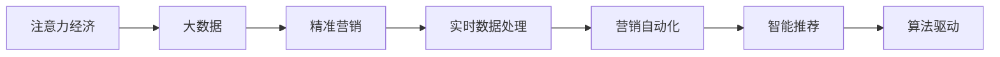

                 

# 注意力经济对传统营销理论的挑战与革新

> 关键词：注意力经济, 大数据, 精准营销, 用户行为分析, 实时数据处理, 营销自动化, 智能推荐, 算法驱动

## 1. 背景介绍

在数字化时代，信息洪流无处不在，每个人的时间、注意力成为一种稀缺资源。企业如何吸引和高效利用这些资源，成为数字营销的核心问题。传统的营销理论和方法已无法适应这一新环境，注意力经济（Attention Economy）这一概念应运而生。它强调在信息爆炸的背景下，如何将注意力聚焦于品牌和产品，从而实现更高的营销效果。

注意力经济是信息时代的新型经济模式，它通过技术和算法优化资源分配，使得广告主的投放更为精准，消费者也能接收到更为个性化的内容。这一模式挑战了传统营销理论的很多假设和做法，并推动了营销理论的革新。

## 2. 核心概念与联系

### 2.1 核心概念概述

为了更好地理解注意力经济的概念及其对传统营销理论的挑战与革新，我们先介绍几个核心概念：

- **注意力经济（Attention Economy）**：指在信息过载时代，利用技术和算法优化资源分配，将注意力聚焦于对用户有价值的品牌和产品，从而提升营销效果。

- **大数据（Big Data）**：指规模巨大、高速增长、种类繁多的数据集，是注意力经济的基础。

- **精准营销（Precision Marketing）**：指基于大数据和算法，通过精细化的用户行为分析，实现对目标用户的精准投放。

- **实时数据处理（Real-time Data Processing）**：指能够即时收集、处理、分析和响应数据的系统，是实现精准营销的关键。

- **营销自动化（Marketing Automation）**：指利用技术自动化执行营销任务，提升营销效率。

- **智能推荐（Intelligent Recommendation）**：指根据用户的历史行为和偏好，智能推荐可能感兴趣的内容和产品。

- **算法驱动（Algorithm-Driven）**：指通过算法优化和自动化的方式，提升营销效果。

这些概念之间有紧密的联系。注意力经济的核心是通过大数据和算法优化资源分配，实现精准营销，提升智能推荐的效果，从而最终达到算法驱动的营销自动化。

### 2.2 核心概念原理和架构的 Mermaid 流程图(Mermaid 流程节点中不要有括号、逗号等特殊字符)



这个流程图展示了注意力经济的核心概念及其相互关系：注意力经济利用大数据技术进行精准营销，通过实时数据处理实现营销自动化，最终由算法驱动的智能推荐技术提升效果。

## 3. 核心算法原理 & 具体操作步骤

### 3.1 算法原理概述

注意力经济的核心是利用算法优化资源分配，将注意力集中于对用户最有价值的内容和产品。这涉及到大数据处理、精准营销、实时数据处理、营销自动化和智能推荐等多个技术环节。以下是各环节的算法原理概述：

- **大数据处理**：通过分布式计算和大数据技术，高效处理和分析海量数据。常用的算法包括MapReduce、Spark、Flink等。

- **精准营销**：通过用户行为分析、数据挖掘等算法，识别目标用户，实现精准投放。常用的算法包括协同过滤、内容推荐、兴趣点推荐等。

- **实时数据处理**：通过流计算、实时数据流处理等算法，实现数据的实时收集和处理。常用的算法包括Storm、Apache Flink等。

- **营销自动化**：通过脚本、自动化工具等技术，实现营销任务的自动化执行。常用的算法包括机器学习、自然语言处理等。

- **智能推荐**：通过深度学习、协同过滤等算法，实现个性化推荐。常用的算法包括基于内容的推荐、基于协同过滤的推荐、混合推荐等。

### 3.2 算法步骤详解

以下是各核心算法的详细步骤：

#### 3.2.1 大数据处理

1. **数据收集**：从不同来源（如社交媒体、网站、移动应用等）收集用户行为数据。
2. **数据存储**：使用分布式数据库（如Hadoop、Hive、Cassandra等）存储数据。
3. **数据清洗**：去除噪音和异常值，处理缺失数据。
4. **数据分析**：使用统计学方法、机器学习算法等分析数据，提取有价值的信息。

#### 3.2.2 精准营销

1. **用户画像构建**：通过收集和分析用户的行为数据，构建详细的用户画像。
2. **目标用户识别**：基于用户画像，识别出符合投放条件的潜在用户。
3. **投放策略制定**：制定详细的投放策略，包括时间、地点、频率等。
4. **投放执行**：通过广告平台等工具执行投放策略。

#### 3.2.3 实时数据处理

1. **数据采集**：实时从不同渠道采集数据。
2. **数据存储**：使用流计算平台（如Apache Kafka、Apache Pulsar等）存储数据流。
3. **数据处理**：使用流计算算法（如Apache Storm、Apache Flink等）处理数据流。
4. **实时反馈**：通过实时反馈系统，调整投放策略。

#### 3.2.4 营销自动化

1. **任务定义**：定义具体的营销任务，如发送邮件、发布社交媒体广告等。
2. **任务执行**：使用自动化工具（如Marketing Cloud、HubSpot等）执行营销任务。
3. **任务监控**：实时监控任务执行情况，收集反馈数据。
4. **任务优化**：根据反馈数据，优化任务执行策略。

#### 3.2.5 智能推荐

1. **数据收集**：收集用户的历史行为数据和偏好数据。
2. **特征工程**：将数据转化为模型可处理的特征向量。
3. **模型训练**：使用深度学习、协同过滤等算法训练推荐模型。
4. **推荐执行**：根据用户当前的兴趣和行为，智能推荐相关内容或产品。

### 3.3 算法优缺点

#### 3.3.1 优点

1. **高精度**：通过算法优化，实现了更高的精准营销效果。
2. **高效性**：自动化执行营销任务，提升了执行效率。
3. **实时响应**：通过实时数据处理，实现了对用户行为的即时响应。
4. **个性化推荐**：智能推荐算法能够根据用户行为进行个性化推荐，提升了用户体验。

#### 3.3.2 缺点

1. **数据隐私**：收集和处理用户数据时，需要注意隐私保护问题。
2. **算法复杂性**：算法实现和维护复杂，需要专业人才。
3. **资源消耗**：大数据处理和算法优化需要大量计算资源。
4. **过度依赖**：过度依赖算法可能导致模型偏见，影响公平性。

### 3.4 算法应用领域

注意力经济在多个领域得到了广泛应用，以下是主要的应用场景：

- **电子商务**：通过大数据分析和精准营销，提升用户购买转化率。
- **媒体和娱乐**：通过智能推荐和个性化内容推送，提升用户黏性和参与度。
- **金融**：通过实时数据分析，提供个性化的理财建议和产品推荐。
- **旅游**：通过精准营销和个性化推荐，提升用户旅游体验和预订率。
- **健康医疗**：通过智能推荐和个性化医疗建议，提升用户体验和治疗效果。

## 4. 数学模型和公式 & 详细讲解 & 举例说明

### 4.1 数学模型构建

注意力经济涉及的数学模型众多，以下是几个典型的数学模型及其构建过程：

#### 4.1.1 协同过滤推荐模型

协同过滤推荐模型是一种基于用户行为相似性的推荐算法。其基本思想是通过用户行为数据构建用户-物品矩阵，通过矩阵分解找到用户和物品的潜在特征，从而实现推荐。数学模型如下：

$$
\min_{P,Q} \sum_{i,j}(r_{ij}-\hat{r}_{ij})^2
$$

其中，$r_{ij}$ 表示用户$i$对物品$j$的评分，$\hat{r}_{ij}=P_iQ_j$ 表示预测的评分，$P$ 和 $Q$ 分别是用户和物品的潜在特征矩阵。

#### 4.1.2 基于内容的推荐模型

基于内容的推荐模型是根据物品的特征向量，预测用户对物品的评分。数学模型如下：

$$
\min_{\theta} \sum_{i,j}(r_{ij}-\theta^T \cdot c_i \cdot c_j)^2
$$

其中，$r_{ij}$ 表示用户$i$对物品$j$的评分，$\theta$ 是模型参数，$c_i$ 和 $c_j$ 分别表示物品$i$和物品$j$的特征向量。

### 4.2 公式推导过程

#### 4.2.1 协同过滤推荐模型的推导

协同过滤推荐模型的推导过程如下：

1. 构建用户-物品矩阵$R$，其中$r_{ij}$表示用户$i$对物品$j$的评分。
2. 将$r_{ij}$表示为用户$i$对物品$j$的评分$r_{ij}=\sum_{k=1}^{K}p_{ik}q_{kj}$，其中$p_{ik}$和$q_{kj}$分别为用户$i$和物品$j$的潜在特征。
3. 最小化均方误差：$\min_{P,Q} \sum_{i,j}(r_{ij}-\hat{r}_{ij})^2$，其中$\hat{r}_{ij}=P_iQ_j$。

#### 4.2.2 基于内容的推荐模型的推导

基于内容的推荐模型的推导过程如下：

1. 构建物品特征矩阵$C$，其中$c_{ij}$表示物品$j$的第$i$个特征。
2. 将$r_{ij}$表示为物品特征向量与用户特征向量的内积：$r_{ij}=\theta^T \cdot c_i \cdot c_j$，其中$\theta$是模型参数。
3. 最小化均方误差：$\min_{\theta} \sum_{i,j}(r_{ij}-\theta^T \cdot c_i \cdot c_j)^2$。

### 4.3 案例分析与讲解

#### 4.3.1 协同过滤推荐案例

某电商平台想要推荐用户可能感兴趣的商品。该平台收集了用户的历史购买记录和商品描述，使用协同过滤算法进行推荐。具体步骤如下：

1. 构建用户-商品矩阵$R$，其中$r_{ij}$表示用户$i$对商品$j$的评分。
2. 将$r_{ij}$表示为用户$i$对商品$j$的评分$r_{ij}=\sum_{k=1}^{K}p_{ik}q_{kj}$，其中$p_{ik}$和$q_{kj}$分别为用户$i$和商品$j$的潜在特征。
3. 使用梯度下降法最小化均方误差，更新潜在特征矩阵$P$和$Q$。
4. 根据用户$i$的潜在特征$P_i$和商品$j$的潜在特征$Q_j$，预测用户$i$对商品$j$的评分$\hat{r}_{ij}=P_iQ_j$。
5. 根据预测评分对商品进行排序，向用户推荐评分最高的商品。

#### 4.3.2 基于内容的推荐案例

某视频平台想要推荐用户可能感兴趣的视频。该平台收集了用户观看历史和视频特征信息，使用基于内容的推荐算法进行推荐。具体步骤如下：

1. 构建视频特征矩阵$C$，其中$c_{ij}$表示视频$j$的第$i$个特征。
2. 将用户$u$的评分$r_{uj}$表示为用户$u$对视频$j$的评分$r_{uj}=\theta^T \cdot c_u \cdot c_j$，其中$\theta$是模型参数。
3. 使用梯度下降法最小化均方误差，更新模型参数$\theta$。
4. 根据用户$u$的特征向量$c_u$和视频$j$的特征向量$c_j$，预测用户$u$对视频$j$的评分$\hat{r}_{uj}=P_iQ_j$。
5. 根据预测评分对视频进行排序，向用户推荐评分最高的视频。

## 5. 项目实践：代码实例和详细解释说明

### 5.1 开发环境搭建

要进行注意力经济相关的项目开发，需要搭建相应的开发环境。以下是搭建开发环境的详细步骤：

1. 安装Python：Python是开发注意力经济项目的主要语言，可以从官网下载并安装。
2. 安装PyTorch和TensorFlow：这两个深度学习框架是进行注意力经济项目开发的基础工具。
3. 安装Dask和Apache Kafka：Dask用于分布式计算，Apache Kafka用于实时数据流处理。
4. 安装Spark和Apache Flink：这两个流计算平台用于大数据处理和实时数据处理。

### 5.2 源代码详细实现

以下是使用Python实现协同过滤推荐算法的代码示例：

```python
import numpy as np
from scipy.optimize import minimize

# 构建用户-商品矩阵
R = np.array([[5, 4, 3, 2], 
              [4, 5, 3, 1], 
              [3, 2, 5, 4]])

# 构建潜在特征矩阵
P = np.array([[1, 0, 2], 
              [0, 1, 2], 
              [3, 0, 1]])

Q = np.array([[0.5, 0.5, 0.5], 
              [0.5, 0.5, 0.5], 
              [0.5, 0.5, 0.5]])

# 定义损失函数
def loss(P, Q):
    H = P @ Q.T
    H[R == 0] = -1e10
    H[R > 0] = 0
    return ((H - R)**2).mean()

# 使用梯度下降法最小化损失函数
res = minimize(loss, P, method='L-BFGS-B', bounds=((0, 1), (0, 1), (0, 1)))
P_new = res.x
Q_new = Q

# 输出推荐结果
print(P_new, Q_new)
```

### 5.3 代码解读与分析

以上代码实现了协同过滤推荐算法的基本流程，具体解读如下：

1. 首先，构建用户-商品矩阵$R$和潜在特征矩阵$P$和$Q$。
2. 定义损失函数，使用梯度下降法最小化损失函数。
3. 使用L-BFGS-B算法求解最小化问题，更新潜在特征矩阵$P$和$Q$。
4. 输出推荐结果。

## 6. 实际应用场景

### 6.1 智能推荐系统

智能推荐系统是注意力经济的重要应用场景之一。通过分析用户的行为数据和偏好，智能推荐系统可以实时推荐用户可能感兴趣的商品、内容等，提升用户体验和满意度。

#### 6.1.1 电商平台推荐

电商平台使用协同过滤和基于内容的推荐算法，为用户推荐可能感兴趣的商品。推荐系统会根据用户的历史行为数据和商品特征，实时更新推荐结果，提升用户购买转化率。

#### 6.1.2 视频平台推荐

视频平台使用智能推荐算法，为用户推荐可能感兴趣的视频。推荐系统会根据用户的历史观看记录和视频特征，实时更新推荐结果，提升用户观看时长和满意度。

### 6.2 精准营销

精准营销是注意力经济的另一个重要应用场景。通过大数据和算法，精准营销可以识别目标用户，实现个性化投放。

#### 6.2.1 广告投放

广告平台使用大数据和算法，识别出符合广告投放条件的目标用户，实现精准投放。通过实时数据分析和用户行为分析，广告平台可以优化广告投放策略，提升广告效果。

#### 6.2.2 邮件营销

邮件营销平台使用大数据和算法，识别出符合邮件营销条件的目标用户，实现精准营销。通过实时数据分析和用户行为分析，邮件营销平台可以优化邮件内容和投放策略，提升邮件打开率和点击率。

### 6.3 实时数据分析

实时数据分析是注意力经济的基础技术之一。通过实时数据处理和流计算，企业可以及时掌握用户行为和市场变化，实现智能决策。

#### 6.3.1 电商实时数据分析

电商平台使用实时数据分析，及时掌握用户行为和市场变化。通过实时数据分析，电商平台可以优化库存管理和物流配送，提升用户体验和运营效率。

#### 6.3.2 金融实时数据分析

金融企业使用实时数据分析，及时掌握市场变化和用户行为。通过实时数据分析，金融企业可以优化风险控制和投资决策，提升企业竞争力。

## 7. 工具和资源推荐

### 7.1 学习资源推荐

#### 7.1.1 在线课程

1. Coursera：《Data Science and Machine Learning》课程，涵盖大数据、机器学习等基础概念和应用。
2. edX：《Introduction to Machine Learning with Python》课程，使用Python实现机器学习算法。
3. Udacity：《Artificial Intelligence Nanodegree》课程，涵盖深度学习、自然语言处理等高级内容。

#### 7.1.2 书籍推荐

1. 《数据科学与机器学习》：该书系统介绍了大数据、机器学习和深度学习的基本概念和应用。
2. 《深度学习入门》：该书使用Python实现深度学习算法，涵盖神经网络、卷积神经网络等基础知识。
3. 《推荐系统实战》：该书详细介绍了推荐系统算法和实现，涵盖协同过滤、基于内容的推荐等。

#### 7.1.3 在线社区

1. Kaggle：全球最大的数据科学竞赛平台，提供丰富的数据集和社区资源。
2. GitHub：全球最大的开源代码托管平台，提供大量的项目和代码示例。
3. Stack Overflow：全球最大的技术问答社区，提供丰富的技术交流和支持。

### 7.2 开发工具推荐

#### 7.2.1 Python

Python是开发注意力经济项目的主要语言，具有丰富的第三方库和工具。

1. Pandas：用于数据处理和分析。
2. NumPy：用于数值计算和科学计算。
3. Matplotlib：用于数据可视化。
4. Scikit-learn：用于机器学习和数据挖掘。

#### 7.2.2 深度学习框架

1. PyTorch：高性能的深度学习框架，支持动态计算图和GPU加速。
2. TensorFlow：谷歌开源的深度学习框架，支持分布式计算和GPU加速。
3. Keras：高层次的深度学习框架，易于上手和实现。

#### 7.2.3 数据处理工具

1. Apache Hadoop：分布式计算平台，支持大数据处理。
2. Apache Spark：快速的大数据处理框架，支持分布式计算和流计算。
3. Apache Kafka：分布式消息系统，支持实时数据流处理。

#### 7.2.4 流计算平台

1. Apache Storm：快速流计算平台，支持实时数据处理。
2. Apache Flink：分布式流计算平台，支持高吞吐量和大数据处理。

#### 7.2.5 可视化工具

1. Tableau：数据可视化工具，支持复杂的数据分析和可视化。
2. Power BI：微软推出的数据可视化工具，支持实时数据可视化和报表。

### 7.3 相关论文推荐

#### 7.3.1 大数据和流计算

1. "MapReduce: Simplified Data Processing on Large Clusters"（MapReduce：在大规模集群上进行简化数据处理）。
2. "Spark: Cluster Computing with Fault Tolerance"（Spark：具有容错性的集群计算）。
3. "Storm: A Distributed Real-Time Computation System"（Storm：分布式实时计算系统）。

#### 7.3.2 机器学习和深度学习

1. "Deep Learning"（深度学习）。
2. "Pattern Recognition and Machine Learning"（模式识别与机器学习）。
3. "Reinforcement Learning: An Introduction"（强化学习：简介）。

#### 7.3.3 推荐系统

1. "Collaborative Filtering for Implicit Feedback Datasets"（隐式反馈数据集的协同过滤）。
2. "Item-based Collaborative Filtering Recommendation Algorithms"（基于物品的协同过滤推荐算法）。
3. "A Survey of Recommendation System"（推荐系统综述）。

## 8. 总结：未来发展趋势与挑战

### 8.1 研究成果总结

注意力经济作为一种新型经济模式，通过大数据和算法优化资源分配，实现了精准营销和智能推荐。目前，注意力经济在电商、媒体、金融等多个领域得到了广泛应用，取得了显著效果。

### 8.2 未来发展趋势

#### 8.2.1 数据隐私保护

随着数据隐私保护的日益重视，未来的注意力经济需要更加注重用户数据的保护和隐私处理。区块链技术、差分隐私技术等新兴技术有望为数据隐私保护提供新的解决方案。

#### 8.2.2 实时数据处理

实时数据处理是注意力经济的核心技术之一。未来的注意力经济将进一步提升实时数据处理的效率和精度，支持更大规模的数据处理和实时决策。

#### 8.2.3 智能推荐算法

智能推荐算法是注意力经济的重要组成部分。未来的注意力经济将不断探索新的推荐算法，如深度学习、协同过滤、混合推荐等，提升推荐效果和用户体验。

#### 8.2.4 精准营销自动化

精准营销是注意力经济的重要应用场景。未来的精准营销将更加自动化和智能化，支持多渠道的整合和优化，提升营销效果和效率。

#### 8.2.5 跨领域融合

未来的注意力经济将与其他领域的技术进行深度融合，如区块链、人工智能、物联网等，推动各领域的协同创新和发展。

### 8.3 面临的挑战

#### 8.3.1 数据隐私保护

数据隐私保护是注意力经济面临的一大挑战。如何在保证数据隐私的前提下，实现精准营销和智能推荐，是一个亟待解决的问题。

#### 8.3.2 算法复杂性

注意力经济的实现需要复杂的算法和大规模的计算资源，这对算法实现和维护提出了高要求。如何降低算法的复杂性，提升算法的可维护性和可扩展性，是一个重要研究方向。

#### 8.3.3 数据质量

数据质量是注意力经济的基础。如何提高数据质量和数据完整性，避免数据噪音和偏差，是一个重要挑战。

#### 8.3.4 实时性能

实时数据处理是注意力经济的核心技术之一。如何提升实时数据处理的性能和精度，支持更大规模的数据处理和实时决策，是一个重要研究方向。

#### 8.3.5 模型偏见

模型偏见是注意力经济面临的一个重要问题。如何消除模型偏见，提高模型的公平性和公正性，是一个重要挑战。

### 8.4 研究展望

未来的注意力经济需要在数据隐私保护、实时数据处理、智能推荐算法、精准营销自动化等方面进行深入研究。同时，与其他领域的技术进行深度融合，推动各领域的协同创新和发展。通过不断探索和创新，未来的注意力经济将更加智能、高效和普适，为经济发展和社会进步带来新的动力。

## 9. 附录：常见问题与解答

### 9.1 常见问题

1. 什么是注意力经济？
2. 注意力经济与传统营销有什么区别？
3. 注意力经济的主要应用场景有哪些？
4. 如何进行实时数据分析和处理？
5. 如何构建协同过滤推荐模型？

### 9.2 解答

#### 9.2.1 什么是注意力经济？

注意力经济是一种基于大数据和算法优化资源分配的新型经济模式。它通过精准营销和智能推荐，实现对用户注意力的高效利用。

#### 9.2.2 注意力经济与传统营销有什么区别？

注意力经济与传统营销的主要区别在于对用户注意力的重视和利用。传统营销主要通过广告和宣传吸引用户，而注意力经济通过大数据和算法优化资源分配，实现对用户注意力的精准投放和智能推荐。

#### 9.2.3 注意力经济的主要应用场景有哪些？

注意力经济的主要应用场景包括电商推荐、视频推荐、精准广告投放、邮件营销等。

#### 9.2.4 如何进行实时数据分析和处理？

实时数据分析和处理可以通过分布式计算平台和大数据技术实现。常用的工具包括Apache Spark、Apache Flink、Apache Kafka等。

#### 9.2.5 如何构建协同过滤推荐模型？

协同过滤推荐模型可以通过构建用户-物品矩阵、潜在特征矩阵、损失函数和梯度下降法实现。具体步骤包括数据收集、数据存储、特征工程、模型训练和模型优化。

---

作者：禅与计算机程序设计艺术 / Zen and the Art of Computer Programming

