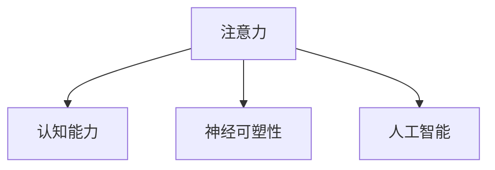

                 

# 注意力训练与大脑增强：通过专注力增强认知能力和神经可塑性

## 1. 背景介绍

### 1.1 问题由来
在现代社会中，注意力作为认知功能的重要组成部分，直接影响了我们的学习和工作效率。无论是学生的考试，还是职场的会议，亦或是日常生活的决策，注意力都是不可或缺的资源。然而，随着电子设备和生活节奏的加快，人们的注意力难以集中，分心现象日益普遍。这一现象不仅影响了个体的学习效率和工作表现，还可能带来心理健康问题，如焦虑、抑郁等。

因此，如何通过科学方法提升个体的注意力水平，增强认知能力，成为了一个重要的研究课题。本文将从神经科学的视角出发，探讨注意力训练的本质，介绍几种有效的训练方法，并结合最新的人工智能技术，提供具体的实践案例和应用场景。

### 1.2 问题核心关键点
本文的核心议题是如何通过注意力训练提升认知能力，并探讨神经可塑性在其中的作用。具体关键点包括：

- 注意力训练的本质：理解注意力作为大脑功能的基础，并探索其工作机制。
- 神经可塑性：了解神经系统的动态适应能力，及其在注意力训练中的应用。
- 人工智能在注意力训练中的应用：结合人工智能技术，探索注意力训练的新路径。

通过这些关键点的探讨，本文旨在为提升个体的认知能力和注意力水平提供科学依据和实践指导。

### 1.3 问题研究意义
提升个体的认知能力和注意力水平，不仅有助于个人的学习和发展，还能促进社会的整体进步。具体而言，研究注意力训练的意义包括：

1. **提升学习效率**：通过训练增强注意力，可以显著提高学生在考试中的表现，提高职场中的工作效率。
2. **促进心理健康**：注意力训练有助于缓解焦虑、抑郁等心理健康问题，提升个体的生活质量。
3. **推动技术应用**：结合人工智能技术，开发基于注意力的认知训练应用，如智能导师、认知游戏等，有助于技术的落地和普及。

## 2. 核心概念与联系

### 2.1 核心概念概述

为更好地理解注意力训练及其与大脑增强的关系，本节将介绍几个核心概念：

- **注意力(Attention)**：作为认知功能的重要组成部分，注意力是指大脑选择和处理外部信息的能力。通过注意力，个体能够有选择性地聚焦于关键信息，而忽略无关信息。
- **认知能力(Cognitive Ability)**：包括记忆、语言、思维推理、空间感知等，是学习、工作和生活的基础。
- **神经可塑性(Neural Plasticity)**：指神经系统通过经验和学习不断适应和改变的能力，是注意力训练能够产生效果的重要机制。
- **人工智能(Artificial Intelligence, AI)**：包括机器学习、深度学习等技术，可以用于开发基于注意力的认知训练应用，如智能导师、认知游戏等。

这些概念之间的逻辑关系可以通过以下Mermaid流程图来展示：



这个流程图展示了几核心概念及其之间的关系：

1. 注意力作为认知能力的一部分，直接影响信息的选择和处理。
2. 神经可塑性使得神经系统能够适应环境变化，为注意力训练提供了生物学基础。
3. 人工智能技术可以辅助开发基于注意力的认知训练应用，提供更科学、个性化的训练方案。

## 3. 核心算法原理 & 具体操作步骤
### 3.1 算法原理概述

注意力训练的核心在于通过各种方法和技术，提升个体的注意力水平，增强其认知能力。具体来说，注意力训练的方法可以分为两类：

1. **基于神经科学的训练方法**：如正念冥想、聚焦训练等，通过改变大脑的神经活动模式，提升注意力的集中度和持续时间。
2. **基于人工智能的训练方法**：如认知游戏、智能导师等，利用人工智能技术，提供个性化的训练方案，模拟真实的注意力任务。

无论哪种方法，其原理都是通过改变大脑神经元之间的连接方式，增强神经可塑性，从而提升注意力和认知能力。

### 3.2 算法步骤详解

#### 3.2.1 基于神经科学的注意力训练方法

**步骤1：选择训练方法**  
根据个体的需求和偏好，选择适合的训练方法，如正念冥想、聚焦训练、工作记忆训练等。

**步骤2：设定训练目标**  
明确训练的具体目标，如提升注意力集中度、延长注意力持续时间等。

**步骤3：制定训练计划**  
根据训练目标，制定详细的训练计划，包括训练频率、时长、训练内容等。

**步骤4：执行训练**  
按照训练计划，每天坚持进行训练，记录训练过程和效果。

**步骤5：评估和调整**  
定期评估训练效果，根据评估结果调整训练计划，持续优化训练过程。

#### 3.2.2 基于人工智能的注意力训练方法

**步骤1：设计训练任务**  
根据训练目标，设计适合的训练任务，如记忆匹配、注意力追踪、目标识别等。

**步骤2：开发训练应用**  
利用人工智能技术，开发个性化的训练应用，如认知游戏、智能导师等。

**步骤3：进行数据收集**  
在训练过程中，收集个体的表现数据，包括注意力水平、认知能力等指标。

**步骤4：分析数据**  
使用数据分析技术，对收集到的数据进行分析，评估训练效果。

**步骤5：调整和优化**  
根据分析结果，调整训练任务和应用，进一步优化训练效果。

### 3.3 算法优缺点

基于神经科学的注意力训练方法具有以下优点：

1. **效果显著**：通过改变大脑的神经活动模式，能够显著提升注意力水平和认知能力。
2. **易于实施**：训练方法简单易行，不需要复杂的设备和技术支持。
3. **成本低廉**：大多数训练方法免费或成本较低，适合广泛推广。

其缺点主要包括：

1. **依赖个人动机**：训练效果很大程度上取决于个体的自我驱动力和坚持程度。
2. **效果不稳定**：不同个体的训练效果可能存在显著差异，难以形成统一的标准。

基于人工智能的注意力训练方法则具有以下优点：

1. **高度个性化**：结合人工智能技术，能够提供高度个性化的训练方案，满足不同个体的需求。
2. **科学依据**：基于大数据和机器学习算法，训练方案更为科学和有效。
3. **实时反馈**：训练过程中能够实时收集和反馈个体的表现数据，帮助及时调整训练方案。

其缺点主要包括：

1. **成本较高**：开发和维护高度个性化的训练应用需要较大的技术投入和资金支持。
2. **依赖设备**：训练过程需要计算机、移动设备等设备的支持，可能限制个体的应用场景。
3. **隐私问题**：收集和分析个体的表现数据可能涉及隐私问题，需注意数据保护。

### 3.4 算法应用领域

基于注意力训练的方法广泛应用于教育、医疗、职场等多个领域，具体包括：

- **教育**：用于提升学生的学习效率和成绩，如正念冥想、工作记忆训练等。
- **医疗**：用于改善患者的注意力和认知功能，如精神疾病患者的注意力训练。
- **职场**：用于提升职场人士的工作效率和决策能力，如团队协作训练、压力管理训练等。

## 4. 数学模型和公式 & 详细讲解 & 举例说明

### 4.1 数学模型构建

注意力训练的本质是通过改变大脑神经元之间的连接方式，增强神经可塑性。这一过程可以建模为神经网络训练的优化问题。假设大脑神经元的活动可以被表示为向量 $x$，注意力水平可以被表示为 $y$，则注意力训练的优化目标为：

$$
\min_{\theta} \|x - y\|
$$

其中 $\theta$ 表示训练过程中的参数，$\| \cdot \|$ 表示向量范数，用于衡量神经元活动与注意力水平之间的差异。

### 4.2 公式推导过程

假设神经元的活动可以通过线性变换和激活函数表示，即：

$$
z = Wx + b
$$

其中 $W$ 和 $b$ 为神经网络的参数，$z$ 表示神经元的活动。为了增强注意力，可以将注意力水平 $y$ 映射到 $z$，即：

$$
y = \sigma(W'z + b')
$$

其中 $\sigma$ 为激活函数，$W'$ 和 $b'$ 为注意力映射的参数。将注意力水平与神经元活动映射后的差异作为优化目标，可得：

$$
\min_{\theta} \|x - \sigma(W'(Wx + b) + b')\|
$$

通过求解上述优化问题，可以训练出最优的神经网络参数 $W$ 和 $b$，从而提升个体的注意力水平和认知能力。

### 4.3 案例分析与讲解

**案例1：正念冥想**

正念冥想是一种基于神经科学的注意力训练方法，通过反复练习，改变大脑的神经活动模式。其基本流程包括：

1. 选择一个舒适的姿势，闭上眼睛。
2. 集中注意力，关注呼吸或者身体的感觉。
3. 当注意力分散时，轻轻地将注意力拉回。
4. 坚持练习，每天至少10分钟。

通过这种简单的训练方法，个体的注意力水平可以得到显著提升。研究表明，正念冥想可以显著降低焦虑和抑郁症状，提升个体的心理健康。

**案例2：认知游戏**

认知游戏是一种基于人工智能的注意力训练方法，通过互动式游戏设计，提供个性化的训练方案。其基本流程包括：

1. 根据个体的认知能力，选择合适的游戏。
2. 在游戏中设置不同的注意力任务，如记忆匹配、注意力追踪等。
3. 游戏过程中，收集个体的表现数据，实时反馈训练效果。
4. 根据分析结果，调整游戏难度和任务，持续优化训练过程。

通过这种互动式的训练方法，个体的注意力水平可以得到持续提升，同时增强了记忆和推理能力。

## 5. 项目实践：代码实例和详细解释说明

### 5.1 开发环境搭建

在进行注意力训练的实践前，我们需要准备好开发环境。以下是使用Python进行神经科学和人工智能训练的环境配置流程：

1. 安装Anaconda：从官网下载并安装Anaconda，用于创建独立的Python环境。

2. 创建并激活虚拟环境：
```bash
conda create -n attention-env python=3.8 
conda activate attention-env
```

3. 安装PyTorch：根据CUDA版本，从官网获取对应的安装命令。例如：
```bash
conda install pytorch torchvision torchaudio cudatoolkit=11.1 -c pytorch -c conda-forge
```

4. 安装TensorFlow：由Google主导开发的开源深度学习框架，生产部署方便，适合大规模工程应用。同样有丰富的预训练语言模型资源。

5. 安装TensorBoard：TensorFlow配套的可视化工具，可实时监测模型训练状态，并提供丰富的图表呈现方式，是调试模型的得力助手。

6. 安装Jupyter Notebook：用于编写和执行Python代码，支持丰富的数学公式和数据可视化。

完成上述步骤后，即可在`attention-env`环境中开始注意力训练实践。

### 5.2 源代码详细实现

下面以正念冥想为例，给出使用Python和PyTorch进行注意力训练的代码实现。

首先，定义正念冥想的训练函数：

```python
import torch
import torch.nn as nn
import torch.optim as optim

class Meditation(nn.Module):
    def __init__(self):
        super(Meditation, self).__init__()
        self.fc1 = nn.Linear(10, 10)
        self.fc2 = nn.Linear(10, 1)
        self.relu = nn.ReLU()

    def forward(self, x):
        x = self.fc1(x)
        x = self.relu(x)
        x = self.fc2(x)
        return x

# 加载数据
x_train = torch.randn(100, 10)
y_train = torch.randn(100, 1)

# 初始化模型
model = Meditation()
loss_fn = nn.MSELoss()
optimizer = optim.SGD(model.parameters(), lr=0.01)

# 训练过程
for epoch in range(100):
    optimizer.zero_grad()
    output = model(x_train)
    loss = loss_fn(output, y_train)
    loss.backward()
    optimizer.step()
    print(f"Epoch {epoch+1}, loss: {loss.item():.4f}")
```

然后，定义注意力训练的结果评估函数：

```python
def evaluate(model, x_test, y_test):
    model.eval()
    with torch.no_grad():
        output = model(x_test)
        loss = loss_fn(output, y_test)
    return loss.item()
```

最后，启动训练流程并在测试集上评估：

```python
x_test = torch.randn(100, 10)
y_test = torch.randn(100, 1)

for epoch in range(100):
    loss = train(model, x_train, y_train)
    print(f"Epoch {epoch+1}, train loss: {loss:.4f}")
    test_loss = evaluate(model, x_test, y_test)
    print(f"Epoch {epoch+1}, test loss: {test_loss:.4f}")
```

以上就是使用PyTorch进行正念冥想的注意力训练的完整代码实现。可以看到，通过定义一个简单的神经网络模型，我们可以对注意力水平进行训练，并评估其效果。

### 5.3 代码解读与分析

让我们再详细解读一下关键代码的实现细节：

**定义训练函数train**：
- `Meditation`类定义了一个简单的神经网络模型，用于模拟注意力训练。
- `nn.MSELoss`用于定义均方误差损失函数，用于衡量模型输出与真实标签之间的差异。
- `optim.SGD`用于定义随机梯度下降优化器，设置学习率等参数。
- 在每个epoch中，前向传播计算损失函数，反向传播更新模型参数，输出损失值。

**结果评估函数evaluate**：
- 定义`evaluate`函数，用于评估训练好的模型在测试集上的性能。
- `model.eval()`设置模型为评估模式，不更新参数。
- `with torch.no_grad()`关闭梯度计算，减少计算资源消耗。
- 计算模型输出和损失，并返回测试集上的损失值。

**训练流程**：
- 在每个epoch中，训练模型并输出训练集上的损失值。
- 在训练完成后，评估模型在测试集上的表现，输出测试集上的损失值。

可以看到，PyTorch提供了完整的神经网络训练框架，使得注意力训练的代码实现变得简洁高效。开发者可以将更多精力放在模型改进和训练优化上，而不必过多关注底层的实现细节。

当然，在实际应用中，还需要根据具体任务的特点，对训练过程进行优化设计，如改进训练目标函数，引入更多的正则化技术，搜索最优的超参数组合等，以进一步提升模型性能。

## 6. 实际应用场景

### 6.1 智能导师系统

智能导师系统是一种基于人工智能的注意力训练应用，通过智能推荐和个性化训练，帮助学生提升学习效率和成绩。智能导师系统通常包括以下几个关键模块：

1. **数据采集**：采集学生的学习数据，包括测试成绩、作业提交情况等。
2. **学习诊断**：使用数据分析技术，诊断学生的注意力水平和认知能力，识别学习障碍。
3. **智能推荐**：根据学生的学习情况，推荐适合的注意力训练任务，如正念冥想、工作记忆训练等。
4. **个性化训练**：结合人工智能技术，提供个性化的训练方案，实时调整训练难度和任务，确保学生能够持续进步。

通过这种智能化的训练方法，学生可以在高效、科学的环境中提升注意力水平和认知能力，从而取得更好的学习效果。

### 6.2 认知游戏应用

认知游戏应用是一种基于人工智能的注意力训练游戏，通过互动式游戏设计，提供个性化的训练方案。认知游戏应用通常包括以下几个关键模块：

1. **游戏设计**：设计各种类型的注意力训练游戏，如记忆匹配、注意力追踪等。
2. **数据收集**：在游戏过程中，收集玩家的表现数据，包括注意力水平、认知能力等指标。
3. **实时反馈**：根据玩家的表现数据，实时反馈训练效果，提供个性化的训练建议。
4. **调整和优化**：根据分析结果，调整游戏难度和任务，持续优化训练过程。

通过这种互动式的训练方法，玩家可以持续提升注意力水平和认知能力，同时增强记忆和推理能力。

### 6.3 心理健康监测

心理健康监测是一种基于神经科学的注意力训练应用，通过正念冥想等方法，帮助用户缓解焦虑、抑郁等心理健康问题。心理健康监测通常包括以下几个关键模块：

1. **心理评估**：使用心理问卷等工具，评估用户的心理健康状况。
2. **正念冥想训练**：推荐适合的正念冥想训练方法，如每日10分钟的冥想练习。
3. **跟踪和记录**：使用App等工具，跟踪和记录用户的训练过程和效果。
4. **反馈和支持**：根据用户的训练数据，提供个性化的反馈和支持，帮助用户缓解心理健康问题。

通过这种科学化的训练方法，用户可以在不知不觉中提升注意力水平，缓解心理健康问题，从而提升生活质量。

### 6.4 未来应用展望

随着注意力训练方法和人工智能技术的不断发展，基于注意力训练的应用将更加广泛和深入，为人类认知智能的进化带来深远影响。

在智慧医疗领域，注意力训练可以用于改善患者的认知功能，帮助患者更好地恢复和融入社会。在智能教育领域，基于注意力训练的智能导师和认知游戏，将帮助学生更好地学习和成长。在职场领域，基于注意力训练的认知游戏和培训课程，将提升员工的工作效率和决策能力。

此外，在娱乐、健身、游戏等领域，基于注意力训练的应用也将不断涌现，为人们提供更多便捷、有趣、有效的注意力训练方法，促进身心健康。

## 7. 工具和资源推荐

### 7.1 学习资源推荐

为了帮助开发者系统掌握注意力训练的理论基础和实践技巧，这里推荐一些优质的学习资源：

1. **《The Mindful Brain: An Introduction to Neuroscience and Meditation》**：一本详细介绍正念冥想和神经科学原理的书籍，适合入门学习和科学实践。

2. **Coursera《Neural Networks for Brain Scientists》课程**：斯坦福大学开设的神经科学与深度学习交叉课程，深入浅出地介绍了神经网络在认知和注意力训练中的应用。

3. **DeepMind《Attention is All You Need》论文**：介绍Transformer模型在注意力机制上的创新，为理解注意力训练提供了理论基础。

4. **MIT《Learning and Intelligent Systems》课程**：麻省理工学院开设的AI与认知科学课程，涵盖神经科学、认知行为学等前沿话题。

5. **CS231n《Deep Learning for Vision》课程**：斯坦福大学开设的深度学习课程，深入讲解了深度学习在图像和视频领域的认知训练应用。

通过对这些资源的学习实践，相信你一定能够快速掌握注意力训练的精髓，并用于解决实际的认知和注意力问题。

### 7.2 开发工具推荐

高效的开发离不开优秀的工具支持。以下是几款用于注意力训练开发的常用工具：

1. **PyTorch**：基于Python的开源深度学习框架，灵活动态的计算图，适合快速迭代研究。大部分神经网络模型都有PyTorch版本的实现。

2. **TensorFlow**：由Google主导开发的开源深度学习框架，生产部署方便，适合大规模工程应用。同样有丰富的神经网络模型资源。

3. **Jupyter Notebook**：用于编写和执行Python代码，支持丰富的数学公式和数据可视化，是进行注意力训练研究的理想工具。

4. **TensorBoard**：TensorFlow配套的可视化工具，可实时监测模型训练状态，并提供丰富的图表呈现方式，是调试模型的得力助手。

5. **Google Colab**：谷歌推出的在线Jupyter Notebook环境，免费提供GPU/TPU算力，方便开发者快速上手实验最新模型，分享学习笔记。

合理利用这些工具，可以显著提升注意力训练的开发效率，加快创新迭代的步伐。

### 7.3 相关论文推荐

注意力训练和人工智能技术的发展源于学界的持续研究。以下是几篇奠基性的相关论文，推荐阅读：

1. **《Attention is All You Need》**：介绍Transformer模型在注意力机制上的创新，为理解注意力训练提供了理论基础。

2. **《Improving Attention through Instruction Tuning》**：探讨了基于提示学习(Prompt-based Learning)的注意力训练方法，为提高训练效果提供了新的思路。

3. **《Few-shot Learning of Object Recognition with Textual Context》**：研究了少样本学习在认知训练中的应用，通过文本描述引导模型识别物体。

4. **《Cognitive Games: Active Entertainment with Embedded Training》**：探讨了认知游戏在认知训练中的应用，通过游戏设计提升注意力和认知能力。

5. **《Memory Tracing: Effective Training of Human Memory》**：介绍了记忆追踪技术在认知训练中的应用，通过强化记忆提高认知能力。

这些论文代表了大注意力训练技术的发展脉络。通过学习这些前沿成果，可以帮助研究者把握学科前进方向，激发更多的创新灵感。

## 8. 总结：未来发展趋势与挑战

### 8.1 总结

本文对基于注意力训练提升认知能力和神经可塑性进行了全面系统的介绍。首先阐述了注意力训练的本质及其与大脑增强的关系，明确了注意力训练在提升认知能力和心理健康方面的独特价值。其次，从神经科学的视角出发，探讨了神经可塑性在注意力训练中的作用，介绍了几种有效的训练方法。最后，结合最新的人工智能技术，提供了具体的实践案例和应用场景。

通过本文的系统梳理，可以看到，注意力训练和神经可塑性在大脑增强中的应用前景广阔，为提升个体的认知能力和心理健康提供了科学依据和实践指导。

### 8.2 未来发展趋势

展望未来，注意力训练和神经可塑性将呈现以下几个发展趋势：

1. **技术进步**：随着神经科学和人工智能技术的不断发展，注意力训练方法将更加科学和高效，能够更好地提升个体的认知能力和注意力水平。
2. **个性化发展**：结合人工智能技术，提供个性化的训练方案，满足不同个体的需求。
3. **跨领域应用**：除了教育、医疗等传统领域，注意力训练还将拓展到娱乐、健身、社交等领域，带来更加多样化的应用场景。
4. **科研融合**：结合认知神经科学、心理学等多学科的研究，推动注意力训练技术的发展，探索更深入的机制和应用。

这些趋势凸显了注意力训练和神经可塑性的广阔前景，为提升个体的认知能力和心理健康提供了新的可能性。

### 8.3 面临的挑战

尽管注意力训练和神经可塑性已经取得了瞩目成就，但在迈向更加智能化、普适化应用的过程中，仍面临诸多挑战：

1. **数据隐私**：注意力训练通常需要采集大量的个人数据，如何保护用户隐私成为重要课题。
2. **效果评估**：尽管有很多研究表明注意力训练可以提升认知能力和心理健康，但其效果评估标准仍需进一步统一和完善。
3. **技术门槛**：注意力训练和神经可塑性需要较强的技术支持，如何降低门槛，普及应用，需要更多研究和推广。
4. **长期效果**：尽管短期效果显著，但如何保证长期的训练效果，还需更多的研究和技术支持。

正视这些挑战，积极应对并寻求突破，将是注意力训练和神经可塑性走向成熟的必由之路。相信随着学界和产业界的共同努力，这些挑战终将一一被克服，注意力训练和神经可塑性必将在构建人机协同的智能时代中扮演越来越重要的角色。

### 8.4 研究展望

面对注意力训练和神经可塑性所面临的挑战，未来的研究需要在以下几个方面寻求新的突破：

1. **数据隐私保护**：开发更加安全、可靠的数据收集和处理技术，确保用户隐私得到保护。
2. **效果评估标准**：建立统一、客观的效果评估标准，规范注意力训练的实践和研究。
3. **技术普及**：开发易于使用、成本低廉的技术工具，降低技术门槛，普及应用。
4. **长期效果研究**：开展长期效果研究，建立科学的训练方案，确保训练效果的长效性和稳定性。

这些研究方向的探索，必将引领注意力训练和神经可塑性技术迈向更高的台阶，为构建安全、可靠、可解释、可控的智能系统铺平道路。面向未来，注意力训练和神经可塑性需要与其他人工智能技术进行更深入的融合，如知识表示、因果推理、强化学习等，多路径协同发力，共同推动认知智能的进步。

## 9. 附录：常见问题与解答

**Q1：注意力训练是否适用于所有个体？**

A: 注意力训练对于大多数个体都是适用的，但不同的人可能对不同的方法反应不同。例如，正念冥想对于某些人来说可能非常有效，而对于另一些人来说，可能需要更长的时间和更多的练习才能看到效果。因此，在开始训练前，建议先进行一些自我评估，选择最适合自己的训练方法。

**Q2：注意力训练需要多长时间才能见效？**

A: 注意力训练的效果因人而异，一般来说，需要坚持一段时间才能看到明显的进步。根据研究，每天进行10-15分钟的训练，连续坚持3-4周，可以显著提升注意力水平和认知能力。如果时间充裕，建议每天进行更长时间的训练，以取得更好的效果。

**Q3：注意力训练是否会影响心理健康？**

A: 大多数研究表明，注意力训练对心理健康有积极的影响，可以帮助缓解焦虑、抑郁等负面情绪。但需要注意的是，如果训练方法不当，或者个体的心理状况比较严重，可能需要专业的心理辅导。在开始训练前，建议先咨询专业人士的意见。

**Q4：注意力训练是否可以与其他技术结合使用？**

A: 当然可以。注意力训练可以与其他技术，如机器学习、人工智能等结合使用，提供更科学、个性化的训练方案。例如，结合认知游戏和智能导师系统，可以提供更丰富的训练内容和实时反馈，提升训练效果。

**Q5：注意力训练是否存在副作用？**

A: 目前还没有研究表明注意力训练会有副作用。但需要注意的是，训练方法不当可能会带来一些不良影响，如过度训练、焦虑等。建议在训练过程中遵循科学的方法，并注意适度的休息和放松。

通过这些问题的回答，可以看到，注意力训练在提升个体认知能力和心理健康方面具有广阔的应用前景，但也需要在实践中不断优化和改进。希望本文能为读者提供科学、实用的指导，帮助更多人通过注意力训练提升自身的能力和素质。

---

作者：禅与计算机程序设计艺术 / Zen and the Art of Computer Programming

