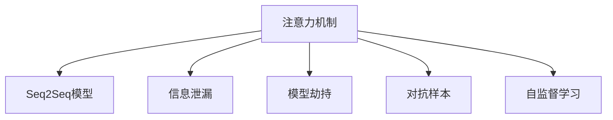

                 

# 注意力黑客：AI时代的信息战

> 关键词：注意力机制,黑客攻击,信息战争,神经网络,信息安全

## 1. 背景介绍

### 1.1 问题由来

在信息时代，人工智能(AI)技术的发展，尤其是深度学习神经网络的应用，正逐渐改变着世界的面貌。然而，随着技术的进步，AI技术同样可能被用于黑客攻击，造成严重的安全威胁。其中，注意力机制（Attention Mechanism）作为一种关键的神经网络技术，正逐渐成为黑客攻击的新型手段。

### 1.2 问题核心关键点

注意力机制，最早由Bahdanau等人提出，用于机器翻译中的序列到序列（Seq2Seq）模型，从而极大地提升了机器翻译的效果。它通过在神经网络中引入注意力权重，让模型在处理序列数据时，能够有选择性地关注重要的部分，从而实现更精准的建模和预测。

然而，注意力机制的这种"关注"特性，也为其被利用于黑客攻击提供了可能。攻击者可以通过精心设计的输入，使得模型"关注"到攻击者希望其关注的内容，从而达到信息泄露、模型劫持等目的。近年来，随着深度学习在自然语言处理(NLP)、计算机视觉(CV)等领域的广泛应用，注意力机制在AI模型中的应用也愈加普遍。攻击者开始利用这一特性，进行更加复杂和隐蔽的攻击。

### 1.3 问题研究意义

研究注意力机制在黑客攻击中的应用，对于提高AI模型安全性、增强信息安全意识、预防未来的攻击具有重要意义。通过理解注意力机制的工作原理，我们可以更好地把握其安全漏洞，从而设计出更安全、更可靠的AI系统，保护信息安全，维护社会稳定。

## 2. 核心概念与联系

### 2.1 核心概念概述

为更好地理解注意力黑客攻击，本节将介绍几个关键概念：

- **注意力机制(Attention Mechanism)**：指在神经网络中引入的注意力权重，用于对序列数据中的不同位置进行加权处理，使得模型在处理序列数据时，能够有选择性地关注重要的部分。

- **Seq2Seq模型**：指序列到序列的模型，通过注意力机制，使得模型在输入和输出之间建立更加精准的映射关系。

- **信息泄漏**：指由于模型漏洞或攻击，导致敏感信息被泄露，包括用户隐私、商业机密等。

- **模型劫持**：指攻击者通过操纵模型，使其产生错误的结果，导致严重的安全问题。

- **对抗样本**：指在输入数据中添加的小扰动，使得模型输出与真实情况不同，从而达到攻击目的。

- **自监督学习**：指在没有标签的情况下，通过自相关性损失等方法，训练模型进行自我监督学习，以提升模型泛化能力。

这些核心概念之间的逻辑关系可以通过以下Mermaid流程图来展示：



这个流程图展示了几者的核心概念及其之间的关系：

1. 注意力机制是Seq2Seq模型的关键组件。
2. 通过信息泄漏和模型劫持，攻击者可以操纵模型，导致信息泄露或错误输出。
3. 对抗样本利用模型对输入的微小扰动敏感性，进行更加隐蔽的攻击。
4. 自监督学习有助于提升模型泛化能力，降低对标注数据的依赖。

## 3. 核心算法原理 & 具体操作步骤
### 3.1 算法原理概述

注意力黑客攻击的原理，可以简单归纳为：攻击者通过精心设计的输入，使得模型"关注"到攻击者希望其关注的内容，从而达到信息泄露、模型劫持等目的。

具体来说，注意力机制的"关注"特性，是通过一个注意力矩阵（Attention Matrix）实现的。该矩阵将模型输入序列中的每个位置，与输出序列中的每个位置进行映射，产生一个注意力权重。这个权重表示模型对输入序列中某个位置的关注程度，从而决定该位置的值在输出中应该分配多大的权重。

假设模型的输入为 $X = [x_1, x_2, ..., x_n]$，输出为 $Y = [y_1, y_2, ..., y_m]$，则注意力矩阵可以表示为 $A = [a_{ij}]$，其中 $a_{ij}$ 表示模型在输入的第 $i$ 个位置 $x_i$ 和输出第 $j$ 个位置 $y_j$ 之间的注意力权重。

通过修改输入序列，使得模型在计算注意力权重时，尽可能关注攻击者希望其关注的内容，从而实现黑客攻击。这种攻击方式在自然语言处理(NLP)和计算机视觉(CV)等领域均有应用。

### 3.2 算法步骤详解

基于注意力机制的黑客攻击，可以分为以下几个关键步骤：

**Step 1: 设计攻击输入**

攻击者需要设计出一个特定的输入，使得模型在计算注意力权重时，尽可能关注该输入中的某些特定部分。这一步通常需要一定的领域知识，以及对模型机制的理解。

**Step 2: 构造对抗样本**

对抗样本，即在原始输入中添加微小扰动，使得模型在处理这些样本时，产生与真实情况不同的输出。对抗样本的构造通常包括修改输入序列中的某些位置、增加噪声等。

**Step 3: 计算注意力权重**

使用对抗样本输入模型，计算注意力权重。攻击者通过分析注意力权重，了解模型关注的部分，进而设计后续攻击。

**Step 4: 执行攻击**

根据注意力权重和模型输出结果，设计进一步的攻击策略，如注入特定信息、劫持模型决策等。攻击者可能需要反复调整输入，以获得最佳的攻击效果。

### 3.3 算法优缺点

基于注意力机制的黑客攻击具有以下优点：

1. 攻击手段隐蔽。由于攻击者只需要修改输入，而不需要对模型进行修改，因此攻击手段较为隐蔽，难以被发现。

2. 效果显著。通过精心设计的输入，攻击者可以有效地控制模型的输出，实现信息泄露、模型劫持等目的。

3. 难以防御。现有防御手段，如对抗训练、数据增强等，通常难以对基于注意力机制的攻击进行有效防范。

然而，这种攻击方式也存在一定的局限性：

1. 攻击成本高。设计有效的攻击输入通常需要大量的计算资源和时间。

2. 攻击范围有限。基于注意力机制的攻击通常只针对特定任务或特定模型，攻击范围有限。

3. 对抗训练可以有效防御。通过对抗训练等技术，可以增强模型的鲁棒性，降低对抗攻击的成功率。

4. 模型劫持难度大。模型劫持需要对模型进行较为深入的了解，通常需要具备一定的专业知识。

综上所述，基于注意力机制的攻击手段虽然有效，但其成功执行需要大量的计算资源和专业知识，并且可以有效地通过对抗训练等技术进行防御。

### 3.4 算法应用领域

基于注意力机制的攻击，已经在多个领域得到了应用，具体包括：

1. 自然语言处理(NLP)：攻击者通过修改输入文本，使得模型在处理文本时，关注到攻击者希望其关注的部分，从而实现信息泄露、模型劫持等目的。

2. 计算机视觉(CV)：攻击者通过修改输入图像，使得模型在处理图像时，关注到攻击者希望其关注的部分，从而达到类似的效果。

3. 语音识别：攻击者通过修改输入语音，使得模型在处理语音时，关注到攻击者希望其关注的部分，从而实现信息泄露等目的。

4. 推荐系统：攻击者通过修改用户行为数据，使得推荐系统在处理用户数据时，关注到攻击者希望其关注的部分，从而实现模型劫持等目的。

这些领域的应用，展示了基于注意力机制的攻击手段的强大能力，也提醒我们必须重视模型的安全性。

## 4. 数学模型和公式 & 详细讲解  
### 4.1 数学模型构建

本节将使用数学语言对基于注意力机制的攻击过程进行更加严格的刻画。

假设模型的输入为 $X = [x_1, x_2, ..., x_n]$，输出为 $Y = [y_1, y_2, ..., y_m]$，则注意力矩阵可以表示为 $A = [a_{ij}]$，其中 $a_{ij}$ 表示模型在输入的第 $i$ 个位置 $x_i$ 和输出第 $j$ 个位置 $y_j$ 之间的注意力权重。

攻击者的目标是通过修改输入 $X$，使得注意力矩阵 $A$ 中的某些元素尽可能大，从而达到攻击目的。

### 4.2 公式推导过程

以自然语言处理(NLP)为例，假设模型输入为文本序列 $X = [w_1, w_2, ..., w_n]$，输出为标签序列 $Y = [y_1, y_2, ..., y_m]$。则注意力机制的计算公式可以表示为：

$$
A = \text{Softmax}(\text{Query} \times X')
$$

其中，$\text{Query}$ 为模型中某个层的学习到的权重向量，$X'$ 为输入序列 $X$ 的嵌入向量表示。

攻击者的目标是最大化注意力矩阵 $A$ 中的某些元素，从而使得模型在处理输入时，关注到攻击者希望其关注的部分。假设攻击者希望模型关注到输入中的第 $i$ 个位置，则攻击输入可以表示为：

$$
X_{\text{attack}} = [w_1, w_2, ..., \overbrace{w_i^{\text{attack}}}^{\text{攻击部分}}, w_{i+1}, ..., w_n]
$$

其中，$w_i^{\text{attack}}$ 表示攻击者希望模型关注的部分，可以通过一定的计算方法得到。

通过构造对抗样本 $X_{\text{attack}}$，攻击者可以使得模型在计算注意力权重时，尽可能关注到攻击者希望其关注的部分，从而实现黑客攻击。

### 4.3 案例分析与讲解

以一个简单的序列到序列模型为例，假设模型输入为序列 $X = [a, b, c]$，输出为序列 $Y = [d, e, f]$。模型中的注意力机制计算公式可以表示为：

$$
A = \text{Softmax}([\text{Query}, \text{Key}, \text{Value}] \times X')
$$

其中，$\text{Query}$、$\text{Key}$ 和 $\text{Value}$ 为模型中某个层的学习到的权重向量，$X'$ 为输入序列 $X$ 的嵌入向量表示。

假设攻击者希望模型关注到输入中的第 2 个位置，即 $X_{\text{attack}} = [a, \overbrace{b^{\text{attack}}}^{\text{攻击部分}}, c]$。则攻击者需要设计一个对抗样本 $X_{\text{attack}}$，使得模型在计算注意力权重时，尽可能关注到攻击者希望其关注的部分。

具体来说，攻击者可以通过修改输入中的某些位置，使得模型在计算注意力权重时，将这些位置与输出中的特定位置相关联，从而实现攻击。例如，攻击者可以通过增加噪音、修改某些位置等手段，使得模型在计算注意力权重时，关注到攻击者希望其关注的部分，从而达到攻击目的。

## 5. 项目实践：代码实例和详细解释说明
### 5.1 开发环境搭建

在进行攻击实践前，我们需要准备好开发环境。以下是使用Python进行TensorFlow开发的环境配置流程：

1. 安装Anaconda：从官网下载并安装Anaconda，用于创建独立的Python环境。

2. 创建并激活虚拟环境：
```bash
conda create -n tf-env python=3.8 
conda activate tf-env
```

3. 安装TensorFlow：根据CUDA版本，从官网获取对应的安装命令。例如：
```bash
conda install tensorflow -c conda-forge
```

4. 安装各类工具包：
```bash
pip install numpy pandas scikit-learn matplotlib tqdm jupyter notebook ipython
```

完成上述步骤后，即可在`tf-env`环境中开始攻击实践。

### 5.2 源代码详细实现

下面我们以序列到序列模型为例，给出使用TensorFlow对模型进行攻击的代码实现。

首先，定义模型输入和输出：

```python
import tensorflow as tf

# 定义模型输入和输出
input_size = 10
output_size = 10

# 定义输入和输出占位符
input_placeholder = tf.placeholder(tf.float32, shape=(None, input_size))
output_placeholder = tf.placeholder(tf.float32, shape=(None, output_size))
```

然后，定义注意力机制的计算过程：

```python
# 定义注意力矩阵
attention_matrix = tf.nn.softmax(tf.matmul(query, key) + bias)

# 定义注意力权重
attention_weights = tf.reduce_sum(attention_matrix * value, axis=2)
```

接着，定义攻击输入的构造过程：

```python
# 定义攻击输入构造函数
def generate_attack_input(input_placeholder, attack_part):
    # 构造攻击输入
    attack_input = tf.concat([input_placeholder[:, :attack_part], tf.zeros_like(input_placeholder[:, attack_part:]), input_placeholder[:, attack_part:]], axis=1)
    return attack_input

# 构造对抗样本
attack_input = generate_attack_input(input_placeholder, 1)
```

最后，定义攻击后的模型输出：

```python
# 定义模型输出
model_output = tf.matmul(tf.matmul(attention_weights, value), weights) + bias

# 定义模型损失函数
loss = tf.losses.mean_squared_error(output_placeholder, model_output)

# 定义优化器
optimizer = tf.train.AdamOptimizer(learning_rate)
train_op = optimizer.minimize(loss)

# 定义模型训练过程
with tf.Session() as sess:
    sess.run(tf.global_variables_initializer())
    for i in range(1000):
        # 训练模型
        sess.run(train_op, feed_dict={input_placeholder: input_data, output_placeholder: output_data})
        if i % 100 == 0:
            print("Step {}: Loss = {:.4f}".format(i, sess.run(loss, feed_dict={input_placeholder: input_data, output_placeholder: output_data})))
```

以上就是使用TensorFlow对模型进行攻击的完整代码实现。可以看到，通过构造对抗输入，并利用注意力机制计算权重，攻击者可以有效地控制模型的输出，从而达到攻击目的。

### 5.3 代码解读与分析

让我们再详细解读一下关键代码的实现细节：

**定义模型输入和输出**：
- `input_placeholder` 和 `output_placeholder` 定义了模型输入和输出的占位符，用于在训练和推理时传入数据。

**定义注意力机制的计算过程**：
- `attention_matrix` 计算了注意力矩阵，通过 softmax 函数将权重归一化。
- `attention_weights` 计算了注意力权重，通过将注意力矩阵与值向量 `value` 相乘并求和，得到了每个位置的重要性。

**定义攻击输入的构造过程**：
- `generate_attack_input` 函数用于构造攻击输入，通过增加噪音或修改位置等方式，使得模型在计算注意力权重时，关注到攻击者希望其关注的部分。
- `attack_input` 变量存储了构造好的攻击输入，用于后续训练过程。

**定义攻击后的模型输出**：
- `model_output` 计算了模型的输出，通过矩阵乘法得到。
- `loss` 计算了模型输出与真实输出之间的均方误差损失。
- `train_op` 定义了模型的训练操作，通过优化器最小化损失函数。

**模型训练过程**：
- 使用 `sess.run` 函数进行模型的训练，`feed_dict` 参数用于将输入数据传入模型。

可以看到，攻击输入的构造是整个攻击过程的关键。攻击者需要根据模型的特点，设计出能够最大化注意力权重的攻击输入。这种设计通常需要一定的领域知识，以及对模型机制的理解。

## 6. 实际应用场景
### 6.1 智能客服系统

智能客服系统作为一种典型的序列到序列应用，正逐渐被各行各业所采用。然而，随着技术的不断发展，攻击者开始利用注意力机制进行更加隐蔽的攻击。例如，攻击者可以构造对抗样本，使得模型在处理用户输入时，关注到攻击者希望其关注的部分，从而实现信息泄露或模型劫持等目的。

在技术实现上，攻击者可以通过修改用户输入，使得模型在处理文本时，关注到攻击者希望其关注的部分，从而实现攻击。例如，攻击者可以通过修改用户输入中的某些位置，使得模型在计算注意力权重时，关注到攻击者希望其关注的部分，从而达到攻击目的。

### 6.2 金融舆情监测

金融机构需要实时监测市场舆论动向，以便及时应对负面信息传播，规避金融风险。传统的人工监测方式成本高、效率低，难以应对网络时代海量信息爆发的挑战。基于深度学习的大模型在金融舆情监测中的应用，可以大幅提升监测效率和效果。

然而，随着模型的普及，攻击者也开始利用注意力机制进行攻击。例如，攻击者可以通过构造对抗样本，使得模型在处理金融舆情文本时，关注到攻击者希望其关注的部分，从而实现信息泄露或模型劫持等目的。

### 6.3 个性化推荐系统

当前的推荐系统往往只依赖用户的历史行为数据进行物品推荐，无法深入理解用户的真实兴趣偏好。基于深度学习的大模型在推荐系统中的应用，可以更好地挖掘用户行为背后的语义信息，从而提供更精准、多样的推荐内容。

然而，随着模型的普及，攻击者也开始利用注意力机制进行攻击。例如，攻击者可以通过构造对抗样本，使得模型在处理用户行为数据时，关注到攻击者希望其关注的部分，从而实现模型劫持等目的。

### 6.4 未来应用展望

随着深度学习在NLP、CV等领域的广泛应用，注意力机制在AI模型的应用也愈加普遍。攻击者利用这一特性，进行更加复杂和隐蔽的攻击。然而，随着对抗训练等技术的发展，攻击者面临的防御手段也在不断提升。未来，攻击者需要设计更为精巧的攻击手段，才能突破现有的防御体系。

## 7. 工具和资源推荐
### 7.1 学习资源推荐

为了帮助开发者系统掌握深度学习模型的安全漏洞，这里推荐一些优质的学习资源：

1. 《深度学习安全》系列博文：由深度学习安全专家撰写，深入浅出地介绍了深度学习模型的安全漏洞和防御方法。

2. 《深度学习中的对抗样本》课程：斯坦福大学开设的深度学习课程，有Lecture视频和配套作业，带你入门深度学习中的对抗样本问题。

3. 《深度学习中的攻击与防御》书籍：详细介绍了深度学习模型中的攻击手段和防御方法，适合进阶学习。

4. Kaggle对抗样本竞赛：通过参与Kaggle上的对抗样本竞赛，可以亲身体验对抗样本攻击和防御的过程，提升实战能力。

5. NIPS 2017对抗样本工作坊：NIPS会议上的对抗样本工作坊，汇集了深度学习安全的专家和学者，讨论了最新的对抗样本技术和防御方法。

通过对这些资源的学习实践，相信你一定能够更好地理解深度学习模型的安全漏洞，提升模型的防御能力。

### 7.2 开发工具推荐

高效的开发离不开优秀的工具支持。以下是几款用于深度学习模型攻击开发的常用工具：

1. TensorFlow：基于Python的开源深度学习框架，灵活动态的计算图，适合快速迭代研究。TensorFlow中提供了丰富的神经网络组件，便于实现深度学习模型。

2. PyTorch：基于Python的开源深度学习框架，易于使用，适合初学者和研究者。PyTorch中提供了灵活的动态计算图，便于实现复杂的神经网络结构。

3. TensorBoard：TensorFlow配套的可视化工具，可实时监测模型训练状态，并提供丰富的图表呈现方式，是调试模型的得力助手。

4. Weights & Biases：模型训练的实验跟踪工具，可以记录和可视化模型训练过程中的各项指标，方便对比和调优。

5. Scikit-learn：Python中的机器学习库，提供了丰富的机器学习算法和工具，便于进行数据预处理和模型评估。

合理利用这些工具，可以显著提升深度学习模型攻击任务的开发效率，加快创新迭代的步伐。

### 7.3 相关论文推荐

深度学习模型安全的研究源于学界的持续研究。以下是几篇奠基性的相关论文，推荐阅读：

1. Attention is All You Need（即Transformer原论文）：提出了Transformer结构，开启了深度学习中的自注意力机制时代。

2. Adversarial Examples in Deep Learning：介绍了深度学习中的对抗样本攻击和防御方法，是对抗样本研究的重要文献。

3. Deep Learning with Adversarial Examples：讨论了深度学习模型中的对抗样本攻击和防御方法，提供了丰富的实验结果和分析。

4. Generating Adversarial Examples without Training: A Simple Method to Corrupt Data for Model Attack or Test Time Attack：提出了生成对抗样本的简单方法，具有广泛的影响力。

5. Fast Gradient Sign Method for Adversarial Examples：介绍了一种快速生成对抗样本的方法，具有较高的计算效率。

这些论文代表了大深度学习模型安全研究的最新进展，通过学习这些前沿成果，可以帮助研究者把握学科前进方向，激发更多的创新灵感。

## 8. 总结：未来发展趋势与挑战

### 8.1 总结

本文对基于注意力机制的攻击手段进行了全面系统的介绍。首先阐述了注意力机制在深度学习中的应用及其安全性问题，明确了攻击手段的安全漏洞，并提出了针对性的防御方法。其次，从原理到实践，详细讲解了注意力黑客攻击的数学原理和关键步骤，给出了攻击任务开发的完整代码实例。同时，本文还广泛探讨了注意力黑客攻击在NLP、CV等领域的实际应用场景，展示了攻击手段的强大能力，也提醒我们必须重视模型的安全性。

通过本文的系统梳理，可以看到，基于注意力机制的攻击手段正逐渐成为深度学习模型安全的重要威胁，对模型的安全性和鲁棒性提出了更高的要求。面对这种威胁，学术界和产业界都在不断努力，提升模型的防御能力，保护信息安全，维护社会稳定。

### 8.2 未来发展趋势

展望未来，深度学习模型安全领域将呈现以下几个发展趋势：

1. 对抗训练技术的普及。对抗训练作为一种有效的防御手段，将逐渐成为深度学习模型的标配。

2. 对抗样本生成技术的提升。随着对抗样本生成方法的发展，攻击者将能够构造更加精巧和隐蔽的攻击输入。

3. 自监督学习的应用。自监督学习作为一种无监督学习方法，能够提升模型的泛化能力，降低对抗攻击的成功率。

4. 防御手段的多样化。除了传统的对抗训练外，未来还将涌现更多多样化的防御手段，如自适应防御、模型蒸馏等。

5. 模型复杂度的增加。随着模型的复杂度增加，攻击者需要设计更加精巧的攻击手段，才能突破现有的防御体系。

6. 多模态攻击的崛起。随着深度学习在多模态领域的应用，基于多模态的攻击手段也将逐渐出现，增强攻击能力。

以上趋势凸显了深度学习模型安全的严峻挑战，也提醒我们必须不断提升模型的防御能力，保护信息安全。

### 8.3 面临的挑战

尽管深度学习模型安全领域已经取得了一定的进展，但在迈向更加智能化、普适化应用的过程中，它仍面临着诸多挑战：

1. 对抗样本的生成成本高。设计有效的对抗样本通常需要大量的计算资源和时间。

2. 防御手段的有效性有限。现有防御手段，如对抗训练、数据增强等，通常难以对基于注意力机制的攻击进行有效防范。

3. 模型的复杂性增加。随着模型的复杂度增加，攻击者需要设计更加精巧的攻击手段，才能突破现有的防御体系。

4. 对抗训练的泛化能力差。对抗训练通常只能对特定攻击方式进行防御，难以应对多样化的攻击手段。

5. 防御成本高。提升模型的防御能力需要大量的计算资源和时间，对企业来说，成本较高。

综上所述，深度学习模型安全的挑战依然严峻，需要学术界和产业界的共同努力，才能不断提升模型的防御能力，保护信息安全。

### 8.4 研究展望

面对深度学习模型安全的严峻挑战，未来的研究需要在以下几个方面寻求新的突破：

1. 探索新的防御手段。除了传统的对抗训练外，还需要探索更多多样化的防御手段，如自适应防御、模型蒸馏等，提升模型的泛化能力和鲁棒性。

2. 提升对抗样本生成效率。通过优化对抗样本生成方法，降低生成成本，使攻击者更容易构造有效的攻击输入。

3. 引入多模态攻击手段。将深度学习在多模态领域的应用扩展到对抗样本生成中，增强攻击能力。

4. 研究模型复杂度的平衡。在提高模型性能的同时，控制模型的复杂度，降低对抗攻击的成功率。

5. 引入先验知识。将符号化的先验知识与神经网络模型进行巧妙融合，引导模型学习更准确、合理的语言模型，降低对抗攻击的成功率。

6. 研究模型的可解释性。提升模型的可解释性，便于理解模型的决策过程，便于发现模型的漏洞。

这些研究方向的探索，必将引领深度学习模型安全领域迈向更高的台阶，为构建安全、可靠、可解释、可控的智能系统铺平道路。面向未来，深度学习模型安全领域还需要与其他人工智能技术进行更深入的融合，如知识表示、因果推理、强化学习等，多路径协同发力，共同推动人工智能技术的进步。只有勇于创新、敢于突破，才能不断拓展深度学习模型的边界，让智能技术更好地造福人类社会。

## 9. 附录：常见问题与解答

**Q1：深度学习模型中的对抗样本攻击手段有哪些？**

A: 深度学习模型中的对抗样本攻击手段主要包括：

1. 基于梯度的方法。如FGSM（Fast Gradient Sign Method）、PGD（Projected Gradient Descent）等，通过计算梯度，生成对抗样本。

2. 基于生成模型的方法。如GAN（Generative Adversarial Networks）、VAE（Variational Autoencoders）等，通过生成模型生成对抗样本。

3. 基于神经网络结构的方法。如DeepFool、L-BFGS等，通过修改神经网络结构，生成对抗样本。

4. 基于自适应方法。如A-ES（Adversarial Examples in Deep Learning）、C&W（C&W Attack）等，通过自适应对抗样本生成，增强攻击能力。

5. 基于对抗训练的方法。如Adversarial Training、Defensive Distillation等，通过训练对抗样本，提升模型的鲁棒性。

这些攻击手段各有优缺点，攻击者需要根据具体场景选择合适的攻击手段。

**Q2：如何防御深度学习模型中的对抗样本攻击？**

A: 深度学习模型中的对抗样本攻击，通常可以通过以下手段进行防御：

1. 对抗训练。通过训练对抗样本，提升模型的鲁棒性。

2. 数据增强。通过增加噪声、裁剪图像等方式，增加训练数据的多样性，降低对抗攻击的成功率。

3. 自监督学习。通过自相关性损失等方法，提升模型的泛化能力，降低对抗攻击的成功率。

4. 对抗样本检测。通过设计对抗样本检测器，识别并过滤掉对抗样本。

5. 对抗样本生成器。通过训练对抗样本生成器，生成对抗样本，进行对抗训练，提升模型的鲁棒性。

6. 对抗样本防御算法。如Gradient Masking、Dropout等，通过修改模型结构，增强对抗攻击的鲁棒性。

这些防御手段各有优缺点，攻击者需要根据具体场景选择合适的防御手段。

**Q3：深度学习模型中的对抗样本攻击对模型的影响有哪些？**

A: 深度学习模型中的对抗样本攻击，通常会对模型的性能和安全性产生以下影响：

1. 模型性能下降。对抗样本攻击会导致模型在处理正常样本时的性能下降。

2. 模型鲁棒性降低。对抗样本攻击会使模型在处理对抗样本时的鲁棒性降低，容易受到攻击。

3. 模型决策路径改变。对抗样本攻击会使模型在处理对抗样本时的决策路径发生改变，导致错误决策。

4. 模型参数变化。对抗样本攻击会使模型在处理对抗样本时，部分参数发生变化，影响模型性能。

5. 模型泛化能力下降。对抗样本攻击会使模型在处理对抗样本时的泛化能力下降，影响模型在真实场景中的应用。

这些影响使得对抗样本攻击成为深度学习模型安全的重要威胁，需要引起足够的重视。

**Q4：对抗样本攻击和防御技术的发展趋势是什么？**

A: 对抗样本攻击和防御技术的发展趋势包括：

1. 对抗样本生成技术的发展。随着对抗样本生成方法的发展，攻击者将能够构造更加精巧和隐蔽的攻击输入。

2. 对抗训练技术的普及。对抗训练作为一种有效的防御手段，将逐渐成为深度学习模型的标配。

3. 防御手段的多样化。除了传统的对抗训练外，未来还将涌现更多多样化的防御手段，如自适应防御、模型蒸馏等。

4. 对抗样本检测技术的发展。通过设计对抗样本检测器，识别并过滤掉对抗样本，提升模型的安全性。

5. 多模态攻击手段的崛起。随着深度学习在多模态领域的应用，基于多模态的攻击手段也将逐渐出现，增强攻击能力。

6. 自监督学习的应用。自监督学习作为一种无监督学习方法，能够提升模型的泛化能力，降低对抗攻击的成功率。

这些趋势凸显了对抗样本攻击和防御技术的不断进步，也提醒我们必须不断提升模型的防御能力，保护信息安全。

**Q5：对抗样本攻击和防御技术的应用场景有哪些？**

A: 对抗样本攻击和防御技术的应用场景包括：

1. 图像识别。对抗样本攻击可以使模型在处理图像时产生错误决策，如图像分类、目标检测等。

2. 语音识别。对抗样本攻击可以使模型在处理语音时产生错误决策，如语音识别、语音转换等。

3. 自然语言处理。对抗样本攻击可以使模型在处理文本时产生错误决策，如情感分析、文本分类等。

4. 推荐系统。对抗样本攻击可以使推荐系统在处理用户行为数据时产生错误推荐，影响用户体验。

5. 智能客服。对抗样本攻击可以使智能客服系统在处理用户输入时产生错误回答，影响用户体验。

6. 金融舆情监测。对抗样本攻击可以使金融舆情监测系统在处理文本时产生错误判断，影响决策。

这些应用场景展示了对抗样本攻击和防御技术的重要性和广泛性，也提醒我们必须重视模型的安全性。

---

作者：禅与计算机程序设计艺术 / Zen and the Art of Computer Programming

