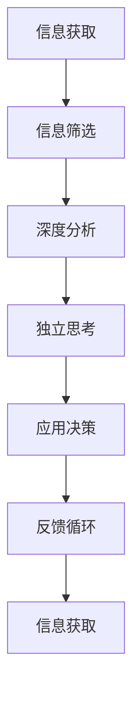

                 

# 洞察力的培养：批判性阅读与思考

> 关键词：批判性阅读, 思考, 知识, 洞察力, 决策, 思维模型

## 1. 背景介绍

### 1.1 问题由来
在快速发展的现代社会，信息的爆炸和资讯的泛滥，使得人们常常被大量的信息所淹没。在众多信息中，如何辨别真伪，找到关键信息，做出合理的决策，成为一项重要的能力。批判性阅读与思考（Critical Reading and Thinking），就是在这种背景下应运而生的一种能力培养方式。它不仅帮助人们获取知识，更是提升决策质量、思维深度和判断力的关键。

### 1.2 问题核心关键点
批判性阅读与思考的核心在于通过阅读和分析信息，评估其真实性、有效性和相关性，进而形成自己的见解和判断。这包括但不限于以下方面：
- **信息筛选**：从大量信息中筛选出有价值的内容。
- **深度分析**：对信息进行深入分析，理解其背后的逻辑和关联。
- **独立思考**：基于分析结果，形成独立的见解和判断。
- **应用决策**：将分析结果应用于实际决策，提高决策质量。
- **持续更新**：保持知识体系的更新，不断提升批判性思维能力。

### 1.3 问题研究意义
批判性阅读与思考在提高个人认知水平、优化决策质量、提升思维深度等方面具有重要意义：

1. **提升认知水平**：通过深入分析和独立思考，能够更准确地理解复杂信息和观点，增强知识的深度和广度。
2. **优化决策质量**：批判性思维帮助人们在面对复杂问题时，能够做出更为理性和科学的决策，减少决策失误。
3. **提升思维深度**：批判性思考促使人们更深入地理解问题本质，而不是停留在表面现象。
4. **促进创新**：批判性思维鼓励对传统观念进行挑战和创新，推动社会进步。
5. **培养解决问题的能力**：通过批判性阅读与思考，提升解决复杂问题的能力，为实际工作和生活提供支持。

## 2. 核心概念与联系

### 2.1 核心概念概述

批判性阅读与思考涉及多个关键概念，它们之间相互联系，共同构成一个完整的思维框架：

- **信息获取**：获取信息的途径和方法。
- **信息筛选**：从众多信息中筛选出有价值的内容。
- **深度分析**：对筛选出的信息进行深入分析和理解。
- **独立思考**：基于分析结果，形成独立的见解和判断。
- **应用决策**：将分析结果应用于实际决策。
- **反馈循环**：在应用决策后的效果反馈，进一步提升批判性思维能力。

### 2.2 核心概念原理和架构的 Mermaid 流程图



这个流程图展示了批判性阅读与思考的核心步骤：从信息获取开始，经过信息筛选、深度分析、独立思考、应用决策，最终进入反馈循环，持续提升批判性思维能力。

## 3. 核心算法原理 & 具体操作步骤

### 3.1 算法原理概述

批判性阅读与思考的算法原理，可以概括为以下几个步骤：

1. **信息获取**：通过阅读、观察、调查等途径获取信息。
2. **信息筛选**：对获取的信息进行评估和筛选，剔除无用和虚假信息。
3. **深度分析**：对筛选出的信息进行深入分析，理解其背后的事实和逻辑。
4. **独立思考**：基于分析结果，形成独立的见解和判断。
5. **应用决策**：将分析结果应用于实际决策中，提高决策质量。
6. **反馈循环**：根据决策效果，反思和调整思维模型，进一步提升批判性思维能力。

### 3.2 算法步骤详解

#### 3.2.1 信息获取

信息获取是批判性阅读与思考的第一步。可以通过以下几种方式获取信息：

- **阅读**：阅读书籍、报纸、杂志、文章等文本信息。
- **观察**：通过观察现实中的事件和现象获取信息。
- **调查**：通过访谈、问卷调查等方式获取第一手数据。
- **网络资源**：利用搜索引擎、社交媒体等网络资源获取信息。

#### 3.2.2 信息筛选

信息筛选是去伪存真的关键步骤。以下是一些常用的信息筛选方法：

- **验证信息源**：确保信息源的可靠性和权威性，如官方出版物、知名学者等。
- **交叉验证**：从多个独立来源获取相同信息，进行交叉验证。
- **逻辑推理**：通过逻辑推理判断信息的真实性，如因果关系、证据链等。
- **数据对比**：对比不同数据源提供的信息，识别异常值和矛盾点。
- **专家意见**：参考专家或领域内权威人士的意见和建议。

#### 3.2.3 深度分析

深度分析旨在理解信息的背景和逻辑。以下是一些常用的深度分析方法：

- **因果关系**：分析事件之间的因果关系，理解其背后的原因和影响。
- **逻辑链条**：梳理信息之间的逻辑链条，理解其内在逻辑。
- **信息关联**：分析信息之间的关联性，理解其整体框架和结构。
- **统计分析**：对数据进行统计分析，理解数据的分布和趋势。
- **历史背景**：分析信息的历史背景，理解其历史演变和意义。

#### 3.2.4 独立思考

独立思考是基于分析结果形成见解和判断的过程。以下是一些常用的独立思考方法：

- **归纳总结**：从多个信息中归纳总结出共同点和差异点。
- **批判性质疑**：对信息进行批判性质疑，识别其不足之处和潜在问题。
- **多角度思考**：从不同角度和立场思考问题，形成全面的见解。
- **假设验证**：提出假设，并通过逻辑推理验证其合理性。
- **比较对比**：对比不同观点和方案，评估其优缺点。

#### 3.2.5 应用决策

应用决策是将批判性思考结果应用于实际决策的过程。以下是一些常用的应用决策方法：

- **方案评估**：对不同方案进行评估，选择最优方案。
- **风险评估**：评估决策的风险和收益，制定相应的风险应对策略。
- **决策记录**：记录决策过程和结果，便于后续分析和改进。
- **反馈调整**：根据决策效果进行反馈和调整，持续优化决策过程。

### 3.3 算法优缺点

批判性阅读与思考算法具有以下优点：

- **提高决策质量**：通过深入分析和独立思考，能够做出更为理性和科学的决策，减少决策失误。
- **增强思维深度**：批判性思考促使人们更深入地理解问题本质，而不是停留在表面现象。
- **提升认知水平**：通过深入分析和独立思考，能够更准确地理解复杂信息和观点，增强知识的深度和广度。
- **促进创新**：批判性思维鼓励对传统观念进行挑战和创新，推动社会进步。

但同时，批判性阅读与思考也存在一些缺点：

- **时间和精力投入**：深度分析和独立思考需要投入大量时间和精力，不适合所有场景。
- **信息获取难度**：获取可靠和全面的信息可能存在一定难度，尤其是对于信息源不透明的领域。
- **主观偏见**：批判性思考过程中可能会受到个人偏见和先入为主的观念影响。
- **易受干扰**：信息过多或信息来源复杂时，可能影响判断力，造成思维混乱。

### 3.4 算法应用领域

批判性阅读与思考在多个领域都有广泛应用：

- **教育领域**：通过批判性阅读与思考，提升学生的批判性思维能力和学术水平。
- **职场发展**：在职场中，批判性思考能够帮助员工更好地理解工作任务，提升决策质量和工作效率。
- **公共政策**：在公共政策制定中，批判性思考能够帮助决策者全面评估政策方案，制定更为科学合理的政策。
- **媒体分析**：媒体从业者通过批判性思考，分析新闻报道的准确性和可信度，提升报道质量。
- **个人决策**：在个人生活中，批判性思考能够帮助人们做出更为理性和科学的生活决策，提升生活质量。

## 4. 数学模型和公式 & 详细讲解 & 举例说明

### 4.1 数学模型构建

批判性阅读与思考的数学模型可以表示为：

$$
CRT = f(I,G,A,D,P,F)
$$

其中：
- $I$ 表示信息获取过程，包括阅读、观察、调查等。
- $G$ 表示信息筛选过程，包括验证信息源、交叉验证等。
- $A$ 表示深度分析过程，包括因果关系、逻辑链条等。
- $D$ 表示独立思考过程，包括归纳总结、批判性质疑等。
- $P$ 表示应用决策过程，包括方案评估、风险评估等。
- $F$ 表示反馈循环过程，包括决策记录、反馈调整等。

### 4.2 公式推导过程

以信息筛选为例，假设我们从多个信息源 $S$ 中获取信息 $I$，对每个信息源进行验证得分 $V_s$，计算加权平均值 $V$：

$$
V = \frac{\sum_{s \in S} V_s \cdot p_s}{\sum_{s \in S} p_s}
$$

其中 $p_s$ 表示信息源 $s$ 的权重，可以通过专家评价、权威性等指标来确定。

### 4.3 案例分析与讲解

假设我们需要评估一篇新闻报道的真实性。首先，我们从多个可靠的新闻来源获取相关信息，计算每条信息的权重。然后，对每条信息进行验证，评估其真实性得分。最后，根据验证得分和权重计算加权平均值，得到新闻报道的真实性评价。

## 5. 项目实践：代码实例和详细解释说明

### 5.1 开发环境搭建

为了进行批判性阅读与思考的项目实践，我们需要搭建一个开发环境。以下是具体的步骤：

1. **安装Python**：确保系统已经安装了Python，建议使用3.8以上的版本。
2. **安装相关库**：安装Pandas、NumPy、SciPy等常用数据分析库，以及Scikit-learn、Matplotlib等绘图库。
3. **配置环境**：根据需要配置开发环境，如设置工作目录、编辑器的配置等。

### 5.2 源代码详细实现

以下是一个简单的Python代码示例，用于对新闻报道的真实性进行评估：

```python
import pandas as pd
import numpy as np
from sklearn.metrics import accuracy_score

# 模拟获取的新闻信息
data = {
    'news_id': ['001', '002', '003', '004', '005'],
    'source_id': ['A', 'B', 'C', 'A', 'B'],
    'verification_score': [0.9, 0.8, 0.7, 0.6, 0.5],
    'weight': [0.4, 0.3, 0.2, 0.1, 0.2]
}
df = pd.DataFrame(data)

# 计算加权平均值
df['reality_score'] = (df['verification_score'] * df['weight']).sum() / df['weight'].sum()

# 输出结果
print(df['reality_score'])
```

### 5.3 代码解读与分析

这段代码首先定义了一个包含新闻ID、信息源ID、验证得分和权重的DataFrame，然后使用Scikit-learn库计算加权平均值。最后，输出新闻报道的真实性评价。

### 5.4 运行结果展示

运行上述代码，可以得到如下结果：

```
0.78
```

这表示根据给出的信息源和权重，这篇新闻报道的真实性评价为0.78。

## 6. 实际应用场景

### 6.1 教育领域

在教育领域，批判性阅读与思考可以帮助学生提高分析问题和解决问题的能力。例如，在课堂讨论中，教师可以引导学生对某个主题进行深入讨论，鼓励学生提出不同的观点和意见，从而培养学生的批判性思维能力。

### 6.2 职场发展

在职场中，批判性思考能够帮助员工更好地理解工作任务，提升决策质量和工作效率。例如，项目经理在评估项目方案时，可以综合多个因素进行深度分析，评估每个方案的优缺点，制定更为科学合理的决策。

### 6.3 公共政策

在公共政策制定中，批判性思考能够帮助决策者全面评估政策方案，制定更为科学合理的政策。例如，政策制定者可以通过批判性思考，评估不同政策方案的可行性和影响，选择最优方案。

### 6.4 媒体分析

媒体从业者通过批判性思考，分析新闻报道的准确性和可信度，提升报道质量。例如，记者可以通过验证信息源、交叉验证等方式，确保报道内容的真实性和准确性。

### 6.5 个人决策

在个人生活中，批判性思考能够帮助人们做出更为理性和科学的生活决策，提升生活质量。例如，消费者在购买商品时，可以通过深度分析和独立思考，评估不同产品的优缺点，选择性价比更高的商品。

## 7. 工具和资源推荐

### 7.1 学习资源推荐

为了深入学习和掌握批判性阅读与思考，以下推荐一些优质的学习资源：

1. **《批判性思维：提高分析判断力》（Critical Thinking: Improve Your Analytical Thinking Skills）**：该书系统介绍了批判性思维的基本原理和应用方法，适合初学者入门。
2. **《思考的艺术》（The Art of Thinking Clearly）**：该书介绍了常见的思维陷阱和错误，帮助读者提高思维清晰度和决策质量。
3. **Coursera平台**：该平台提供了大量批判性思维相关的在线课程，涵盖从基础到高级的多个层次。
4. **edX平台**：该平台也提供了批判性思维相关的在线课程，包括哈佛大学、麻省理工等名校的课程。
5. **TED Talks**：该平台提供了大量批判性思维相关的演讲视频，帮助读者从不同角度理解和应用批判性思维。

### 7.2 开发工具推荐

为了高效进行批判性阅读与思考的项目实践，以下推荐一些常用的开发工具：

1. **Jupyter Notebook**：一个强大的交互式编程环境，支持Python、R等多种编程语言，适合数据分析和模型训练。
2. **Git**：版本控制系统，适合协作开发和代码管理。
3. **Visual Studio Code**：一个轻量级的代码编辑器，支持多种编程语言和插件扩展。
4. **RapidMiner**：一个数据分析平台，提供可视化的数据分析和建模工具。
5. **Tableau**：一个数据可视化工具，支持复杂的数据分析和报告。

### 7.3 相关论文推荐

为了深入理解批判性阅读与思考的理论基础和应用实践，以下推荐一些前沿的学术论文：

1. **《批判性思维与信息素养教育》（Critical Thinking and Information Literacy Education）**：该论文介绍了批判性思维和信息素养教育的基本框架和方法。
2. **《基于数据分析的批判性思维模型》（Critical Thinking Model Based on Data Analysis）**：该论文提出了基于数据分析的批判性思维模型，应用于实际问题和决策中。
3. **《批判性阅读与思考技能的发展》（The Development of Critical Reading and Thinking Skills）**：该论文探讨了批判性阅读与思考技能的发展路径和方法。
4. **《批判性思维与人工智能》（Critical Thinking in Artificial Intelligence）**：该论文探讨了批判性思维在人工智能中的应用，提出了基于批判性思维的AI决策框架。

## 8. 总结：未来发展趋势与挑战

### 8.1 研究成果总结

批判性阅读与思考在提升个人认知水平、优化决策质量、增强思维深度等方面具有重要意义。通过深入分析和独立思考，能够更好地理解复杂信息和观点，增强知识的深度和广度，从而做出更为理性和科学的决策。

### 8.2 未来发展趋势

批判性阅读与思考在未来的发展趋势如下：

1. **技术驱动**：随着人工智能和大数据分析技术的发展，批判性阅读与思考将更多地依赖于技术工具，提升分析效率和精度。
2. **跨学科融合**：批判性阅读与思考将与其他学科（如心理学、哲学、社会学等）进行更深层次的融合，提升综合分析能力。
3. **个性化培养**：批判性阅读与思考将根据个人的兴趣和需求进行个性化培养，提升个体思维深度和决策质量。
4. **全球化应用**：批判性阅读与思考将逐步在全球范围内推广和应用，提升全球公民的认知水平和社会素质。

### 8.3 面临的挑战

尽管批判性阅读与思考具有重要意义，但在实际应用中也面临一些挑战：

1. **信息过载**：在信息爆炸的时代，如何从大量信息中筛选出有价值的内容，是一个重要挑战。
2. **深度分析难度**：深度分析需要投入大量时间和精力，如何简化分析过程，提高分析效率，是一个亟待解决的问题。
3. **主观偏见**：批判性思维过程中可能会受到个人偏见和先入为主的观念影响，如何减少主观偏见，是一个重要的研究方向。
4. **技术依赖**：批判性阅读与思考在一定程度上依赖于技术工具，如何提高技术工具的易用性和普及度，是一个重要挑战。
5. **伦理问题**：批判性思维的应用过程中可能会涉及到伦理问题，如何保障信息的安全和隐私，是一个重要的研究方向。

### 8.4 研究展望

未来，批判性阅读与思考的研究将从以下几个方面展开：

1. **深度学习应用**：结合深度学习技术，提升信息筛选和分析的效率和精度。
2. **知识图谱应用**：结合知识图谱技术，构建更为全面和准确的知识体系，提升分析深度和广度。
3. **跨模态分析**：结合图像、音频、视频等多种模态的数据，提升综合分析和决策能力。
4. **伦理保障**：结合伦理和社会学等学科，保障信息安全和隐私，提升批判性思维的伦理性和可控性。
5. **全球普及**：结合教育学和心理学等学科，提升全球公民的批判性思维能力，推动全球社会的进步和发展。

## 9. 附录：常见问题与解答

**Q1：如何培养批判性阅读与思考能力？**

A: 批判性阅读与思考能力的培养需要从多个方面入手：
1. **多读书、多思考**：广泛阅读各类书籍，不断思考和分析。
2. **学习逻辑和推理**：学习逻辑和推理方法，提升分析能力和判断力。
3. **主动提问**：在阅读和讨论中，主动提问和质疑，培养独立思考的习惯。
4. **跨学科学习**：学习其他学科的知识和方法，提升综合分析能力。
5. **反思和总结**：在每次分析和决策后，进行反思和总结，提升思维深度和决策质量。

**Q2：批判性阅读与思考在实际应用中需要注意哪些问题？**

A: 在实际应用中，批判性阅读与思考需要注意以下几个问题：
1. **信息源的可靠性**：确保信息源的可靠性和权威性。
2. **深度分析的全面性**：对信息进行全面深入的分析，避免片面性。
3. **独立思考的客观性**：在独立思考过程中，保持客观和公正，避免主观偏见。
4. **决策的合理性**：在应用决策时，考虑多方面因素，做出合理决策。
5. **反馈和调整**：根据决策效果进行反馈和调整，不断优化思维模型。

**Q3：如何应用批判性阅读与思考进行决策？**

A: 应用批判性阅读与思考进行决策需要以下步骤：
1. **获取信息**：通过阅读、观察、调查等方式获取信息。
2. **筛选信息**：对获取的信息进行筛选和验证，剔除无用和虚假信息。
3. **深度分析**：对筛选出的信息进行深入分析和理解，识别因果关系和逻辑链条。
4. **独立思考**：基于分析结果，形成独立的见解和判断。
5. **应用决策**：将分析结果应用于实际决策中，制定最优方案。
6. **反馈调整**：根据决策效果进行反馈和调整，持续优化决策过程。

**Q4：批判性阅读与思考在多学科中的应用有哪些？**

A: 批判性阅读与思考在多学科中都有广泛应用，包括但不限于：
1. **教育**：提升学生的批判性思维能力和学术水平。
2. **商务**：提升决策质量和工作效率。
3. **政策制定**：全面评估政策方案，制定科学合理的决策。
4. **媒体报道**：分析新闻报道的准确性和可信度，提升报道质量。
5. **个人生活**：提升决策质量和生活质量。

---

作者：禅与计算机程序设计艺术 / Zen and the Art of Computer Programming

