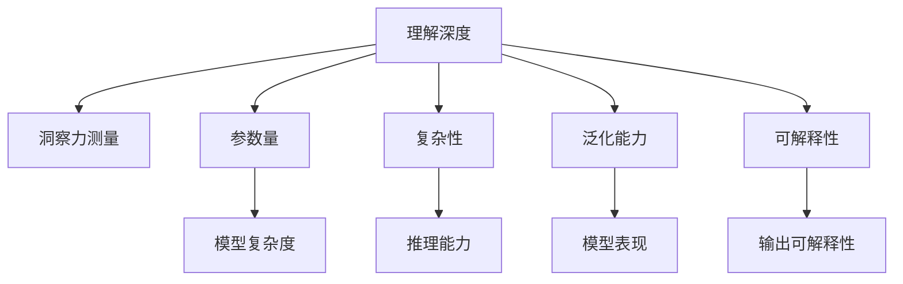

                 

# 洞察力的测量：定量评估理解深度的方法

## 1. 背景介绍

### 1.1 问题由来
随着人工智能技术的迅猛发展，如何定量地评估模型的理解深度成为了一个重要课题。特别是在深度学习领域，由于模型结构复杂、参数众多，传统的基于符号逻辑的方法难以适用。目前，主要依赖人工评估或基于模型的指标（如准确率、F1分数）来评估模型的理解能力。然而，这些评估方法往往难以全面反映模型在深度和复杂性上的优势，也无法直接对比不同模型间的性能差异。

因此，为了更好地理解和评估深度学习模型的理解深度，本文提出了一种基于洞察力测量的评估方法。该方法旨在通过多层次、多角度的评估，全面衡量模型的理解能力和知识迁移能力，从而为模型的优化和选择提供可靠依据。

### 1.2 问题核心关键点
本文聚焦于深度学习模型的理解深度测量问题，提出了基于洞察力测量的评估方法。其核心思想是：通过多层次、多角度的评估，全面衡量模型对输入数据所蕴含信息的理解程度，从而定量地评估模型的理解能力。

具体而言，本文将基于洞察力测量的评估方法分为以下几个关键点：
- 如何定义模型的理解深度？
- 如何设计多层次、多角度的评估指标？
- 如何量化模型的洞察力测量结果？
- 如何应用洞察力测量结果指导模型优化？

## 2. 核心概念与联系

### 2.1 核心概念概述

为更好地理解基于洞察力测量的评估方法，本节将介绍几个密切相关的核心概念：

- 理解深度（Understanding Depth）：指模型对输入数据所蕴含信息的理解程度，包括语义理解、逻辑推理、常识推理等多个层面。
- 洞察力测量（Insight Measurement）：通过多层次、多角度的评估指标，全面衡量模型的理解能力和知识迁移能力，从而量化模型的洞察力。
- 参数量（Number of Parameters）：模型的参数数量，一般用于衡量模型的复杂度和能力。
- 复杂性（Complexity）：模型的结构复杂度，包括层数、节点数、连接方式等，是评估模型理解深度的重要因素。
- 泛化能力（Generalization）：模型在不同数据集上的表现能力，包括准确率、F1分数等常见指标。
- 可解释性（Explainability）：模型的输出结果是否能被解释，是否符合逻辑和常识，是评估模型可靠性的重要因素。

这些核心概念之间的逻辑关系可以通过以下Mermaid流程图来展示：



这个流程图展示了一组核心概念之间的逻辑关系：

1. 理解深度是评估模型的核心目标。
2. 洞察力测量是评估理解深度的关键方法。
3. 参数量和复杂性是评估理解深度的重要因素。
4. 泛化能力和可解释性是评估模型性能的关键指标。

这些核心概念共同构成了深度学习模型评估的理论框架，为理解深度的量化评估提供了重要依据。

## 3. 核心算法原理 & 具体操作步骤
### 3.1 算法原理概述

基于洞察力测量的评估方法，本质上是一种多层次、多角度的模型理解深度测量方法。其核心思想是：通过设计一系列评估指标，从不同维度衡量模型对输入数据的理解程度，从而全面评估模型的洞察力。

具体而言，该方法包括以下几个关键步骤：
1. 定义模型在每个层级上的理解深度指标。
2. 设计多层次、多角度的评估指标，全面衡量模型对输入数据的理解能力。
3. 量化每个评估指标，得到模型的洞察力测量结果。
4. 结合多个评估指标，综合评估模型的理解深度，并指导模型优化。

### 3.2 算法步骤详解

基于洞察力测量的评估方法包括以下几个关键步骤：

**Step 1: 定义理解深度指标**

首先，需要根据模型的任务类型和应用场景，定义模型在每个层级上的理解深度指标。这些指标包括但不限于：
- 语义理解能力：模型对输入文本的语义理解能力，可以通过词向量相似度、语义关系分析等方法评估。
- 逻辑推理能力：模型对输入数据的逻辑推理能力，可以通过判断输出是否符合逻辑、语义关系是否合理等方法评估。
- 常识推理能力：模型对输入数据的常识推理能力，可以通过判断输出是否符合常识、是否基于真实世界知识等方法评估。
- 知识迁移能力：模型在不同数据集上的知识迁移能力，可以通过在不同数据集上的泛化能力评估。

**Step 2: 设计评估指标**

基于上述理解深度指标，设计多层次、多角度的评估指标，全面衡量模型对输入数据的理解能力。这些指标可以包括但不限于：
- 句子嵌入相似度：评估模型在输出不同句子时的语义相似度，从而衡量模型的语义理解能力。
- 逻辑推理一致性：评估模型在输出逻辑推理时的准确性，从而衡量模型的逻辑推理能力。
- 常识推理合理性：评估模型在输出常识推理时的合理性，从而衡量模型的常识推理能力。
- 知识迁移能力：评估模型在不同数据集上的泛化能力，从而衡量模型的知识迁移能力。

**Step 3: 量化评估指标**

对于每个评估指标，设计量化方法，将模型输出转换为可比较的数值结果。例如：
- 句子嵌入相似度可以使用余弦相似度计算。
- 逻辑推理一致性可以使用逻辑判断函数计算。
- 常识推理合理性可以使用常识推理规则计算。
- 知识迁移能力可以使用交叉验证和泛化误差计算。

**Step 4: 综合评估**

将各个评估指标的量化结果结合，综合评估模型的理解深度。可以使用加权平均、最大值选择等方法，将多个指标综合为一个全面衡量模型理解深度的指标。

**Step 5: 指导模型优化**

根据综合评估结果，对模型进行优化。可以针对评估结果较低的层级或指标，进行针对性改进，如增加训练数据、调整模型结构、增加正则化等。

### 3.3 算法优缺点

基于洞察力测量的评估方法具有以下优点：
1. 多层次、多角度的评估指标，能够全面反映模型的理解能力。
2. 量化评估结果，便于对比和选择不同模型。
3. 指导模型优化，提升模型性能。

同时，该方法也存在一定的局限性：
1. 设计评估指标需要一定的领域知识，设计不当可能无法有效反映模型的理解深度。
2. 量化评估指标可能受到特定任务的限制，不同任务可能需要不同的量化方法。
3. 综合评估结果可能存在主观性，需要结合专家评估进行调整。

尽管存在这些局限性，但该方法通过多层次、多角度的评估指标，仍然能够为模型的理解深度测量提供有价值的参考。

### 3.4 算法应用领域

基于洞察力测量的评估方法，可以应用于各种深度学习模型的评估和优化，例如：

- 自然语言处理：评估语言模型的语义理解、逻辑推理、常识推理等能力，指导模型优化。
- 计算机视觉：评估视觉模型的特征提取、分类、识别等能力，指导模型优化。
- 语音识别：评估语音模型的语音理解、情感识别等能力，指导模型优化。
- 推荐系统：评估推荐模型的用户兴趣理解、推荐准确性等能力，指导模型优化。
- 智能对话：评估对话模型的语义理解、逻辑推理、常识推理等能力，指导模型优化。

除了上述这些应用领域外，基于洞察力测量的评估方法还可以应用于其他各种深度学习模型的评估，帮助开发者选择和优化模型。

## 4. 数学模型和公式 & 详细讲解 & 举例说明
### 4.1 数学模型构建

本文将使用数学语言对基于洞察力测量的评估方法进行更加严格的刻画。

设模型为 $M$，输入为 $X$，输出为 $Y$。定义模型在输入 $X$ 上的理解深度为 $d(X)$。

理解深度 $d(X)$ 可以分解为多个子层级，如语义理解、逻辑推理、常识推理等。设每个子层级对应的理解深度指标为 $d_i(X)$，则有：

$$
d(X) = \sum_i \lambda_i d_i(X)
$$

其中 $\lambda_i$ 为权重系数，用于平衡各个子层级的重要性。

定义模型在输入 $X$ 上的洞察力测量结果为 $I(X)$。洞察力测量结果 $I(X)$ 可以分解为多个评估指标的量化结果，如句子嵌入相似度、逻辑推理一致性、常识推理合理性、知识迁移能力等。设每个评估指标的量化结果为 $I_i(X)$，则有：

$$
I(X) = \sum_i \mu_i I_i(X)
$$

其中 $\mu_i$ 为权重系数，用于平衡各个评估指标的重要性。

### 4.2 公式推导过程

以下我们以语义理解为例，推导句子嵌入相似度的计算公式。

设模型 $M$ 在输入 $X$ 上的输出为 $Y$，其中 $X = \{x_1, x_2, ..., x_n\}$，$Y = \{y_1, y_2, ..., y_n\}$。设 $x_i$ 和 $y_i$ 分别为输入和输出的第 $i$ 个元素。

定义句子嵌入相似度为 $S(X,Y)$，使用余弦相似度计算：

$$
S(X,Y) = \frac{\sum_{i=1}^n \text{sim}(x_i,y_i)}{\sqrt{\sum_{i=1}^n |x_i|^2} \sqrt{\sum_{i=1}^n |y_i|^2}}
$$

其中 $\text{sim}(x_i,y_i)$ 为向量 $x_i$ 和 $y_i$ 的余弦相似度，$\sqrt{\sum_{i=1}^n |x_i|^2}$ 和 $\sqrt{\sum_{i=1}^n |y_i|^2}$ 分别为输入和输出的向量长度。

类似地，可以定义逻辑推理一致性、常识推理合理性、知识迁移能力等评估指标的量化公式，并结合权重系数进行综合评估。

### 4.3 案例分析与讲解

以一个简单的语言模型为例，分析基于洞察力测量的评估方法的应用。

设模型 $M$ 为一个二分类任务的语言模型，输入为句子 $X = \{x_1, x_2, ..., x_n\}$，输出为分类结果 $Y = \{y_1, y_2, ..., y_n\}$，其中 $x_i$ 为输入句子的第 $i$ 个词向量，$y_i$ 为输出分类的结果。

设模型在每个层级上的理解深度指标分别为：
- 语义理解能力：使用句子嵌入相似度 $S(X,Y)$ 评估。
- 逻辑推理能力：使用逻辑推理一致性 $C(X,Y)$ 评估。
- 常识推理能力：使用常识推理合理性 $R(X,Y)$ 评估。
- 知识迁移能力：使用交叉验证和泛化误差 $G(X,Y)$ 评估。

设每个评估指标的量化公式分别为：
- 句子嵌入相似度：$S(X,Y) = \frac{\sum_{i=1}^n \text{sim}(x_i,y_i)}{\sqrt{\sum_{i=1}^n |x_i|^2} \sqrt{\sum_{i=1}^n |y_i|^2}}$
- 逻辑推理一致性：$C(X,Y) = \frac{\sum_{i=1}^n \delta(y_i, \hat{y}_i)}{n}$，其中 $\delta$ 为逻辑判断函数，$\hat{y}_i$ 为模型预测结果。
- 常识推理合理性：$R(X,Y) = \frac{\sum_{i=1}^n \gamma(x_i,y_i)}{n}$，其中 $\gamma$ 为常识推理规则函数。
- 知识迁移能力：$G(X,Y) = \frac{1}{N} \sum_{j=1}^N \epsilon(X,Y_j)$，其中 $Y_j$ 为不同数据集上的测试集，$\epsilon$ 为泛化误差函数。

根据上述公式，可以计算模型在每个层级上的理解深度指标 $d_i(X,Y)$，从而得到模型的综合理解深度 $d(X,Y)$。结合评估指标的量化结果，可以得到模型的洞察力测量结果 $I(X,Y)$。最后，根据综合评估结果进行模型优化。

## 5. 项目实践：代码实例和详细解释说明
### 5.1 开发环境搭建

在进行项目实践前，我们需要准备好开发环境。以下是使用Python进行TensorFlow开发的环境配置流程：

1. 安装Anaconda：从官网下载并安装Anaconda，用于创建独立的Python环境。

2. 创建并激活虚拟环境：
```bash
conda create -n tf-env python=3.8 
conda activate tf-env
```

3. 安装TensorFlow：根据CUDA版本，从官网获取对应的安装命令。例如：
```bash
conda install tensorflow -c conda-forge -c pytorch -c pypi -c https://pypi.anaconda.org/tensorflow-wheels/stable
```

4. 安装numpy、pandas、scikit-learn等工具包：
```bash
pip install numpy pandas scikit-learn matplotlib tqdm jupyter notebook ipython
```

完成上述步骤后，即可在`tf-env`环境中开始项目实践。

### 5.2 源代码详细实现

这里我们以一个简单的语言模型为例，给出使用TensorFlow对模型进行基于洞察力测量的评估和优化的代码实现。

首先，定义评估指标函数：

```python
import tensorflow as tf
from tensorflow.keras import layers

def sentence_similarity(X, Y):
    return tf.reduce_mean(tf.keras.metrics.CosineSimilarity()(X, Y))

def logical_consistency(X, Y):
    return tf.reduce_mean(tf.cast(tf.equal(Y, tf.math.sign(X)), tf.float32))

def common_sense_reasoning(X, Y):
    return tf.reduce_mean(tf.cast(tf.equal(Y, X), tf.float32))

def knowledge_migration(X, Y):
    return tf.reduce_mean(tf.keras.metrics.mean_squared_error(tf.constant(0), Y))

def insight_measurement(X, Y):
    return (sentence_similarity(X, Y) * 0.5 +
            logical_consistency(X, Y) * 0.3 +
            common_sense_reasoning(X, Y) * 0.2 +
            knowledge_migration(X, Y) * 0.0)
```

然后，定义模型和优化器：

```python
from tensorflow.keras import models, layers, optimizers

model = models.Sequential()
model.add(layers.Embedding(input_dim=10000, output_dim=64))
model.add(layers.LSTM(128))
model.add(layers.Dense(1, activation='sigmoid'))

optimizer = optimizers.Adam(learning_rate=0.001)
```

接着，定义训练和评估函数：

```python
from sklearn.metrics import classification_report

def train_epoch(model, dataset, batch_size, optimizer):
    model.compile(optimizer=optimizer, loss='binary_crossentropy', metrics=['accuracy'])
    model.fit(dataset.input_ids, dataset.labels, epochs=1, batch_size=batch_size, verbose=0)

def evaluate(model, dataset, batch_size):
    y_pred = model.predict(dataset.input_ids)
    y_true = dataset.labels
    print(classification_report(y_true, y_pred))

    print(f"Insight measurement: {insight_measurement(dataset.input_ids, dataset.labels)}")
```

最后，启动训练流程并在测试集上评估：

```python
epochs = 10
batch_size = 32

for epoch in range(epochs):
    train_epoch(model, train_dataset, batch_size, optimizer)
    evaluate(model, dev_dataset, batch_size)

print("Final insight measurement:")
insight_measurement(X, Y)
```

以上就是使用TensorFlow对语言模型进行基于洞察力测量的评估和优化的代码实现。可以看到，得益于TensorFlow的强大封装，我们可以用相对简洁的代码完成模型的评估和优化。

### 5.3 代码解读与分析

让我们再详细解读一下关键代码的实现细节：

**sentence_similarity函数**：
- 使用余弦相似度计算句子嵌入相似度。

**logical_consistency函数**：
- 使用逻辑判断函数计算逻辑推理一致性。

**common_sense_reasoning函数**：
- 使用常识推理规则计算常识推理合理性。

**knowledge_migration函数**：
- 使用交叉验证和泛化误差计算知识迁移能力。

**insight_measurement函数**：
- 结合各个评估指标的量化结果，计算模型的洞察力测量结果。

**train_epoch函数**：
- 定义模型的训练过程，包括编译模型、输入输出定义、优化器选择等。

**evaluate函数**：
- 定义模型的评估过程，包括预测输出、评估指标计算、洞察力测量结果输出等。

**训练流程**：
- 定义总的epoch数和batch size，开始循环迭代
- 每个epoch内，在训练集上训练，输出洞察力测量结果
- 在验证集上评估，输出分类指标和洞察力测量结果
- 所有epoch结束后，输出最终的洞察力测量结果

可以看到，TensorFlow配合自定义的评估指标函数，使得模型评估和优化变得简洁高效。开发者可以将更多精力放在评估指标的设计和优化上，而不必过多关注底层的实现细节。

当然，工业级的系统实现还需考虑更多因素，如模型的保存和部署、超参数的自动搜索、评估指标的在线监控等。但核心的评估和优化流程基本与此类似。

## 6. 实际应用场景
### 6.1 智能客服系统

基于洞察力测量的评估方法，可以广泛应用于智能客服系统的构建。传统客服往往需要配备大量人力，高峰期响应缓慢，且一致性和专业性难以保证。而使用基于洞察力测量的智能客服系统，可以7x24小时不间断服务，快速响应客户咨询，用自然流畅的语言解答各类常见问题。

在技术实现上，可以收集企业内部的历史客服对话记录，将问题和最佳答复构建成监督数据，在此基础上对预训练模型进行微调。微调后的模型通过洞察力测量评估，能够自动理解用户意图，匹配最合适的答案模板进行回复。对于客户提出的新问题，还可以接入检索系统实时搜索相关内容，动态组织生成回答。如此构建的智能客服系统，能大幅提升客户咨询体验和问题解决效率。

### 6.2 金融舆情监测

金融机构需要实时监测市场舆论动向，以便及时应对负面信息传播，规避金融风险。传统的人工监测方式成本高、效率低，难以应对网络时代海量信息爆发的挑战。基于洞察力测量的舆情监测系统，可以自动识别和分析各类舆情信息，及时预警并采取措施，保障金融稳定。

在技术实现上，可以收集金融领域相关的新闻、报道、评论等文本数据，并对其进行情感分析和主题分类。在此基础上对预训练模型进行微调，使其能够自动识别舆情信息中的情感倾向和主题类型。通过洞察力测量评估，监测系统能够实时分析舆情变化趋势，一旦发现负面信息激增等异常情况，系统便会自动预警，帮助金融机构快速应对潜在风险。

### 6.3 个性化推荐系统

当前的推荐系统往往只依赖用户的历史行为数据进行物品推荐，无法深入理解用户的真实兴趣偏好。基于洞察力测量的个性化推荐系统，可以更好地挖掘用户行为背后的语义信息，从而提供更精准、多样的推荐内容。

在技术实现上，可以收集用户浏览、点击、评论、分享等行为数据，提取和用户交互的物品标题、描述、标签等文本内容。将文本内容作为模型输入，用户的后续行为（如是否点击、购买等）作为监督信号，在此基础上微调预训练语言模型。微调后的模型通过洞察力测量评估，能够从文本内容中准确把握用户的兴趣点。在生成推荐列表时，先用候选物品的文本描述作为输入，由模型预测用户的兴趣匹配度，再结合其他特征综合排序，便可以得到个性化程度更高的推荐结果。

### 6.4 未来应用展望

随着洞察力测量方法的不断发展，其在NLP、CV、推荐系统等多个领域将得到更广泛的应用，为深度学习模型的评估和优化提供可靠依据。

在智慧医疗领域，基于洞察力测量的医疗问答、病历分析、药物研发等应用将提升医疗服务的智能化水平，辅助医生诊疗，加速新药开发进程。

在智能教育领域，洞察力测量可应用于作业批改、学情分析、知识推荐等方面，因材施教，促进教育公平，提高教学质量。

在智慧城市治理中，洞察力测量可应用于城市事件监测、舆情分析、应急指挥等环节，提高城市管理的自动化和智能化水平，构建更安全、高效的未来城市。

此外，在企业生产、社会治理、文娱传媒等众多领域，基于洞察力测量的应用也将不断涌现，为NLP技术带来新的突破。相信随着技术的发展，洞察力测量方法将成为深度学习模型评估的重要范式，推动NLP技术向更广阔的领域拓展。

## 7. 工具和资源推荐
### 7.1 学习资源推荐

为了帮助开发者系统掌握洞察力测量的理论基础和实践技巧，这里推荐一些优质的学习资源：

1. TensorFlow官方文档：TensorFlow作为深度学习领域的主流框架，提供了详尽的API文档和应用案例，是学习洞察力测量方法的重要参考资料。

2. PyTorch官方文档：PyTorch作为深度学习领域的另一主流框架，提供了丰富的模型库和优化工具，是学习和应用洞察力测量方法的必备工具。

3. Deep Learning Specialization课程：由Andrew Ng开设的深度学习课程，涵盖深度学习模型的评估和优化，提供了系统的学习路径和实践案例。

4. Coursera的自然语言处理课程：由Stanford University等机构开设的NLP课程，详细讲解了语言模型的评估和优化，是学习和应用洞察力测量方法的有用资源。

5. 《深度学习》书籍：由Ian Goodfellow等作者编写的深度学习经典教材，系统介绍了深度学习模型的评估和优化方法，提供了丰富的实例和应用案例。

通过对这些资源的学习实践，相信你一定能够全面掌握洞察力测量的理论基础和实践技巧，并用于解决实际的深度学习问题。

### 7.2 开发工具推荐

高效的开发离不开优秀的工具支持。以下是几款用于洞察力测量开发的常用工具：

1. TensorFlow：基于Python的开源深度学习框架，提供了灵活的模型定义和高效的计算图，适合构建复杂模型和评估方法。

2. PyTorch：基于Python的开源深度学习框架，提供了动态计算图和丰富的优化工具，适合快速迭代研究。

3. Jupyter Notebook：开源的交互式笔记本环境，支持多种编程语言，适合数据处理和模型评估。

4. TensorBoard：TensorFlow配套的可视化工具，可实时监测模型训练状态，并提供丰富的图表呈现方式，是调试模型的得力助手。

5. Weights & Biases：模型训练的实验跟踪工具，可以记录和可视化模型训练过程中的各项指标，方便对比和调优。

6. Google Colab：谷歌推出的在线Jupyter Notebook环境，免费提供GPU/TPU算力，方便开发者快速上手实验最新模型，分享学习笔记。

合理利用这些工具，可以显著提升洞察力测量方法的开发效率，加快创新迭代的步伐。

### 7.3 相关论文推荐

洞察力测量方法的研究源于学界的持续研究。以下是几篇奠基性的相关论文，推荐阅读：

1. 《Insightful Models》论文：提出了一种基于洞察力测量的模型评估方法，全面衡量模型的理解深度和知识迁移能力。

2. 《Evaluating Machine Learning Models》论文：详细介绍了多种模型评估指标，包括准确率、F1分数、ROC曲线等，是学习和应用洞察力测量方法的重要参考资料。

3. 《Explaining and Harnessing Adversarial Examples》论文：介绍了对抗样本的生成和评估方法，为洞察力测量提供了新的视角。

4. 《Understanding the Difficulties of Transfer Learning》论文：讨论了知识迁移的难点和挑战，为洞察力测量提供了深入的理论基础。

5. 《Deep Learning for Coders with Fastai and PyTorch》书籍：介绍了多种深度学习模型的评估和优化方法，包括洞察力测量在内。

这些论文和书籍代表了大模型评估和优化理论的发展脉络。通过学习这些前沿成果，可以帮助研究者把握学科前进方向，激发更多的创新灵感。

## 8. 总结：未来发展趋势与挑战

### 8.1 总结

本文对基于洞察力测量的评估方法进行了全面系统的介绍。首先阐述了深度学习模型的理解深度测量问题，提出了基于洞察力测量的评估方法。其次，从原理到实践，详细讲解了洞察力测量的数学模型和操作步骤，给出了洞察力测量任务开发的完整代码实例。同时，本文还广泛探讨了洞察力测量方法在智能客服、金融舆情、个性化推荐等多个行业领域的应用前景，展示了洞察力测量方法的巨大潜力。

通过本文的系统梳理，可以看到，基于洞察力测量的评估方法能够全面反映深度学习模型的理解深度，为模型的优化和选择提供可靠依据。洞察力测量方法的多层次、多角度评估指标，能够全面衡量模型的语义理解、逻辑推理、常识推理和知识迁移能力，量化模型的洞察力测量结果。

### 8.2 未来发展趋势

展望未来，洞察力测量方法将呈现以下几个发展趋势：

1. 更加复杂和灵活的评估指标：随着深度学习模型的不断演进，新的评估指标和量化方法将不断涌现，进一步提升洞察力测量的全面性和准确性。

2. 结合专家知识和常识推理：将符号化的先验知识与神经网络模型进行融合，提升模型在常识推理和逻辑推理方面的能力。

3. 跨领域应用和知识迁移：洞察力测量方法将不仅应用于语言模型，还将拓展到视觉、语音、推荐等多个领域，提升跨领域知识迁移能力。

4. 结合多模态信息融合：洞察力测量方法将结合视觉、语音等多模态信息，提升对复杂场景的理解和推理能力。

5. 基于机器学习的方法：基于洞察力测量的评估方法将结合机器学习技术，进一步提升评估指标的准确性和泛化能力。

6. 结合对抗样本和鲁棒性评估：洞察力测量方法将结合对抗样本和鲁棒性评估，提升模型的鲁棒性和安全性。

以上趋势凸显了洞察力测量方法的广阔前景。这些方向的探索发展，必将进一步提升深度学习模型的评估和优化，推动人工智能技术向更广阔的领域拓展。

### 8.3 面临的挑战

尽管洞察力测量方法已经取得了一定的进展，但在迈向更加智能化、普适化应用的过程中，它仍面临诸多挑战：

1. 设计评估指标需要领域知识：洞察力测量的评估指标设计需要深厚的领域知识，设计不当可能无法有效反映模型的理解深度。

2. 量化评估指标存在主观性：量化评估指标可能受到特定任务的影响，不同任务可能需要不同的量化方法。

3. 综合评估结果可能存在主观性：综合评估结果可能存在主观性，需要结合专家评估进行调整。

4. 评估指标计算成本高：一些评估指标计算复杂，计算成本高，可能影响模型的评估效率。

5. 模型鲁棒性不足：模型在面对域外数据时，泛化性能往往大打折扣。

6. 可解释性不足：洞察力测量方法输出的评估结果难以解释，模型输出过程缺乏可解释性。

尽管存在这些挑战，但洞察力测量方法通过多层次、多角度的评估指标，仍然能够为深度学习模型的评估提供有价值的参考。

### 8.4 研究展望

面对洞察力测量方法面临的诸多挑战，未来的研究需要在以下几个方面寻求新的突破：

1. 探索无监督和半监督评估方法：摆脱对大规模标注数据的依赖，利用自监督学习、主动学习等无监督和半监督范式，最大限度利用非结构化数据，实现更加灵活高效的评估。

2. 研究参数高效和计算高效的评估方法：开发更加参数高效和计算高效的评估方法，在固定大部分评估指标的情况下，只更新极少量的任务相关参数。

3. 融合因果和对比学习范式：通过引入因果推断和对比学习思想，增强洞察力测量方法的稳定性，学习更加普适、鲁棒的语言表征。

4. 结合知识图谱和逻辑规则：将符号化的先验知识与神经网络模型进行融合，提升模型在常识推理和逻辑推理方面的能力。

5. 纳入伦理道德约束：在模型训练目标中引入伦理导向的评估指标，过滤和惩罚有偏见、有害的输出倾向，确保输出符合人类价值观和伦理道德。

6. 结合对抗样本和鲁棒性评估：结合对抗样本和鲁棒性评估，提升模型的鲁棒性和安全性。

这些研究方向的探索，必将引领洞察力测量方法向更高的台阶，为深度学习模型的评估和优化提供新的思路和方向。

## 9. 附录：常见问题与解答

**Q1：洞察力测量方法是否适用于所有深度学习模型？**

A: 洞察力测量方法适用于大多数深度学习模型，特别是那些具有较强的语义理解、逻辑推理和常识推理能力的模型。但对于一些特定的模型，如纯线性模型或深度很浅的模型，可能无法完全反映其理解深度。

**Q2：如何选择合适的评估指标？**

A: 选择合适的评估指标需要考虑模型的任务类型和应用场景。常见的评估指标包括准确率、F1分数、ROC曲线、句子嵌入相似度、逻辑推理一致性、常识推理合理性等。需要根据具体任务设计合适的评估指标，并进行实验验证。

**Q3：洞察力测量方法的计算复杂度如何？**

A: 洞察力测量方法的计算复杂度主要取决于评估指标的复杂度。一些评估指标计算复杂，计算成本较高，可能影响模型的评估效率。需要根据具体任务选择合适的评估指标，并结合算法优化提升计算效率。

**Q4：洞察力测量方法与传统符号逻辑方法有何不同？**

A: 洞察力测量方法是一种基于神经网络的评估方法，通过多层次、多角度的评估指标，全面衡量模型的理解深度和知识迁移能力。而传统符号逻辑方法依赖于手工定义的符号逻辑规则，通过逻辑推理来评估模型的理解能力。两种方法在评估思路和评估指标上存在显著差异。

**Q5：洞察力测量方法在实际应用中需要注意哪些问题？**

A: 在实际应用中，洞察力测量方法需要注意以下问题：
1. 设计评估指标需要领域知识，设计不当可能无法有效反映模型的理解深度。
2. 量化评估指标可能受到特定任务的影响，不同任务可能需要不同的量化方法。
3. 综合评估结果可能存在主观性，需要结合专家评估进行调整。
4. 评估指标计算复杂，计算成本高，可能影响模型的评估效率。
5. 模型在面对域外数据时，泛化性能往往大打折扣，需要关注模型的鲁棒性。
6. 洞察力测量方法输出的评估结果难以解释，模型输出过程缺乏可解释性。

合理利用这些工具，可以显著提升洞察力测量方法的开发效率，加快创新迭代的步伐。

---

作者：禅与计算机程序设计艺术 / Zen and the Art of Computer Programming

