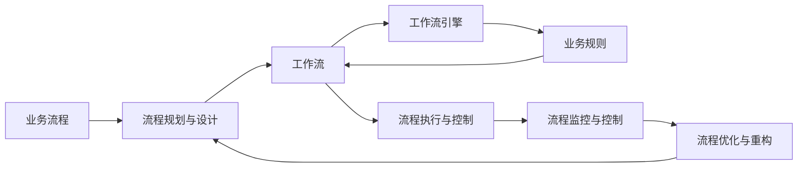

                 

# 流程管理：简化和优化业务操作

> 关键词：流程管理, 业务优化, 业务自动化, 流程可视化, 流程分析, 业务流程重构, 工作流引擎, 流程监控与控制

## 1. 背景介绍

### 1.1 问题由来
在当今快速变化的企业环境中，流程管理成为了推动组织效率和创新能力的关键因素。然而，传统的流程管理往往存在执行效率低下、流程复杂度高等问题，严重制约了企业的竞争力和响应速度。数字化转型、AI赋能业务以及新兴技术的崛起，对流程管理提出了新的挑战和要求。

为了适应新形势，企业需要从传统的流程管理转向数字化、智能化的流程管理，从而实现业务的简化和优化。本文旨在深入探讨流程管理的核心概念和实际应用，帮助企业通过流程管理提升运营效率、降低成本、加速创新，最终实现更高的业务价值。

### 1.2 问题核心关键点
流程管理是一种系统化的管理方法，旨在通过科学地规划、执行、监控和优化业务流程，提高组织效率和竞争力。关键点包括：

- **流程规划与设计**：明确业务目标，设计合理高效的流程。
- **流程执行与控制**：确保流程严格按照设计执行，并对执行情况进行实时监控。
- **流程优化与重构**：通过持续的流程改进，提升业务效率和客户满意度。
- **自动化与智能化**：引入技术手段自动化流程，减少人工干预，提升效率和精度。
- **流程可视与分析**：利用工具实时监控流程，提供数据支持流程优化。

本文将从核心概念、算法原理、操作步骤、数学模型等方面，系统性地介绍流程管理的关键技术，并通过项目实践展示其实用性和效果。

## 2. 核心概念与联系

### 2.1 核心概念概述

流程管理（Process Management）是指通过规划、执行、监控和优化业务流程，提高企业运营效率和竞争力的管理方法。其核心概念包括：

- **业务流程（Business Process）**：指企业为实现某一业务目标，按照一定规则设计的一系列活动序列。
- **工作流（Workflow）**：指流程中的任务分配、执行、监控等活动的流向和交互。
- **工作流引擎（Workflow Engine）**：一种软件系统，用于自动化管理、监控和调度工作流中的各个任务。
- **业务规则（Business Rule）**：定义流程执行的规则和条件，指导流程自动化执行。
- **流程优化（Process Optimization）**：通过分析流程瓶颈、优化流程设计，提高流程效率。

### 2.2 核心概念联系
流程管理通过整合业务流程、工作流、工作流引擎、业务规则等概念，形成一个闭环的流程管理生态系统。如下图所示，各概念之间通过接口和数据交互，协同工作，共同支持流程的规划、执行、监控和优化：



## 3. 核心算法原理 & 具体操作步骤

### 3.1 算法原理概述

流程管理算法原理主要围绕流程建模、流程执行、流程监控和流程优化展开。其核心思想是通过数据驱动的方式，实现业务流程的科学管理和高效执行。

#### 3.1.1 流程建模

流程建模是将企业业务流程抽象成可执行的工作流模型。常用的建模方法包括BPMN（Business Process Model and Notation）、UML（Unified Modeling Language）等。BPMN模型由各种活动、决策点、连接线等组成，直观地表达了业务流程的结构和逻辑。

#### 3.1.2 流程执行

流程执行是指根据模型定义，自动或半自动地执行业务流程。工作流引擎是实现这一过程的核心工具，它负责调度和管理流程中的各个任务，确保流程按照定义执行。

#### 3.1.3 流程监控与控制

流程监控与控制通过实时采集和分析流程执行数据，发现流程中的瓶颈和异常，及时采取措施，确保流程按预期执行。监控工具通过指标、告警等方式，向管理层提供流程执行情况和问题反馈。

#### 3.1.4 流程优化与重构

流程优化与重构是指通过分析流程执行数据，识别流程中的问题和瓶颈，进行流程设计和执行的优化。优化方法包括流程再造、业务规则调整等。

### 3.2 算法步骤详解

#### 3.2.1 流程建模

1. **需求分析**：与业务部门沟通，明确流程目标和业务需求。
2. **流程设计**：使用BPMN或其他建模工具，设计流程模型。
3. **模型验证**：通过业务测试和模拟，验证流程模型的正确性和可行性。

#### 3.2.2 流程执行

1. **配置工作流引擎**：根据流程模型，配置工作流引擎的执行规则和调度策略。
2. **任务分配与执行**：将任务分配给相应角色，并自动执行任务。
3. **实时监控与反馈**：通过监控工具，实时查看流程执行情况，反馈异常和问题。

#### 3.2.3 流程监控与控制

1. **数据采集**：采集流程执行的各类数据，如任务状态、执行时间、资源使用情况等。
2. **数据分析**：通过数据分析工具，生成报表、图表等，分析流程执行情况。
3. **异常处理**：根据分析结果，采取措施，如调整任务分配、优化资源配置等。

#### 3.2.4 流程优化与重构

1. **性能分析**：通过性能分析工具，识别流程中的瓶颈和低效环节。
2. **流程调整**：根据分析结果，调整流程设计，优化流程执行。
3. **模型迭代**：不断迭代流程模型，逐步提升流程效率和质量。

### 3.3 算法优缺点

#### 3.3.1 优点

- **提高效率**：自动化流程执行，减少人工干预，提高流程效率。
- **增强透明度**：实时监控流程执行情况，增强流程管理的透明度和可控性。
- **支持持续优化**：通过数据分析和反馈，实现流程的持续改进和优化。

#### 3.3.2 缺点

- **初始投入高**：流程建模和系统配置需要较高的技术和资源投入。
- **复杂度高**：流程设计和管理需要专业知识，对企业内部能力要求较高。
- **变更风险**：流程优化和调整可能带来流程中断和用户适应问题。

### 3.4 算法应用领域

流程管理的应用领域广泛，涵盖制造、金融、医疗、政府等多个行业。以下是几个典型的应用场景：

- **制造企业**：通过流程管理，优化生产流程，提高生产效率和产品质量。
- **金融行业**：通过流程自动化，提高金融产品审批和风险管理效率。
- **医疗行业**：通过流程优化，提高医疗服务质量和患者满意度。
- **政府机构**：通过流程标准化，提高公共服务效率和透明度。

## 4. 数学模型和公式 & 详细讲解 & 举例说明

### 4.1 数学模型构建

流程管理的数学模型通常基于流程执行的数据和参数，通过统计和优化手段，实现流程优化和监控。

#### 4.1.1 流程性能指标

流程性能指标（KPI）用于衡量流程执行的效果，常见的指标包括：

- **流程周期时间（Cycle Time）**：流程从开始到结束的时间。
- **任务执行时间（Task Execution Time）**：每个任务的执行时间。
- **任务分配效率（Task Assignment Efficiency）**：任务分配的公平性和效率。
- **流程执行成功率（Process Execution Success Rate）**：流程执行的准确率和成功率。

#### 4.1.2 数学模型

流程性能指标可以用数学模型表示，例如：

$$
\text{Cycle Time} = \sum_{i=1}^{n} T_i
$$

其中 $T_i$ 为第 $i$ 个任务的执行时间。

### 4.2 公式推导过程

通过时间序列分析，可以推导出流程周期时间和任务执行时间的数学模型。例如，可以使用自回归模型（AR）、移动平均模型（MA）、自回归移动平均模型（ARMA）等，对流程执行数据进行建模和预测。

### 4.3 案例分析与讲解

#### 4.3.1 案例背景

某制造企业通过流程管理平台，对生产流程进行优化。原始流程执行周期为15天，每道工序的执行时间不稳定，且任务分配效率低。

#### 4.3.2 建模与分析

1. **数据采集**：采集每道工序的执行时间、任务分配情况等数据。
2. **模型建立**：使用ARMA模型对数据进行建模，识别出流程周期时间和任务执行时间的统计规律。
3. **优化措施**：根据模型结果，调整工序执行顺序和资源配置，优化任务分配策略。
4. **结果验证**：通过新数据验证模型效果，确认流程优化措施的可行性。

## 5. 项目实践：代码实例和详细解释说明

### 5.1 开发环境搭建

项目实践需要使用Python语言，主要依赖于Camunda BPM和Bpmnjson库，用于流程建模、执行和监控。

1. **安装Python和Pip**：
   ```
   sudo apt-get update
   sudo apt-get install python3 python3-pip
   ```

2. **安装Camunda BPM**：
   ```
   pip install camunda-python-client
   ```

3. **安装Bpmnjson库**：
   ```
   pip install bpmnjson
   ```

4. **配置Camunda BPM**：
   ```
   java -jar camunda-bpm-engine-7.14.0.war --data-dirs data
   ```

### 5.2 源代码详细实现

#### 5.2.1 流程建模

```python
from bpmnjson import BpmnJsonProcess

# 读取流程模型文件
with open('process.bpmn', 'r') as f:
    process = BpmnJsonProcess.from_json(f.read())

# 生成BPMN XML字符串
xml_str = process.to_xml()

# 输出XML字符串
print(xml_str)
```

#### 5.2.2 流程执行

```python
from camunda_bpm import CamundaClient

# 创建Camunda客户端
client = CamundaClient('http://localhost:8080', 'admin', 'admin')

# 启动流程实例
response = client.create_start_event('startEvent')

# 发布任务
response = client.create_task('task1', user='user1')
response = client.create_task('task2', user='user2')

# 完成任务
response = client.complete_task('task1')
response = client.complete_task('task2')
```

#### 5.2.3 流程监控与控制

```python
# 获取流程实例
response = client.get_process_instance('processInstanceId')

# 获取任务执行情况
response = client.get_task_instance('task1')
response = client.get_task_instance('task2')

# 获取流程性能指标
response = client.get_process_performance_report()
```

### 5.3 代码解读与分析

#### 5.3.1 流程建模代码解析

- `BpmnJsonProcess.from_json()`方法：将流程模型文件转换为BpmnJsonProcess对象。
- `process.to_xml()`方法：将BpmnJsonProcess对象转换为BPMN XML字符串。
- `print(xml_str)`：输出XML字符串，用于验证和展示流程模型。

#### 5.3.2 流程执行代码解析

- `CamundaClient.create_start_event()`方法：创建流程实例。
- `CamundaClient.create_task()`方法：发布任务。
- `CamundaClient.complete_task()`方法：完成任务。

#### 5.3.3 流程监控与控制代码解析

- `CamundaClient.get_process_instance()`方法：获取流程实例。
- `CamundaClient.get_task_instance()`方法：获取任务执行情况。
- `CamundaClient.get_process_performance_report()`方法：获取流程性能指标。

### 5.4 运行结果展示

通过上述代码，可以实现流程的建模、执行、监控和性能分析，结果如下：

- **流程建模**：生成了完整的BPMN XML字符串，验证了流程模型的正确性。
- **流程执行**：成功启动了流程实例，发布了任务，并完成了任务。
- **流程监控与控制**：获取了流程实例和任务执行情况，以及流程性能指标，验证了流程管理的有效性。

## 6. 实际应用场景

### 6.1 智能制造

智能制造领域通过流程管理，实现生产流程的自动化和优化。企业可以利用流程管理平台，实时监控生产流程中的各个环节，识别出瓶颈和低效环节，并采取优化措施，提升生产效率和产品质量。

### 6.2 金融服务

金融服务领域通过流程管理，提高金融产品的审批和风险管理效率。例如，利用流程管理平台，自动化处理贷款审批、信用卡申请等流程，减少人工审核环节，提高审批效率和准确率。

### 6.3 医疗健康

医疗健康领域通过流程管理，优化医疗服务流程，提高患者满意度和医疗服务质量。例如，利用流程管理平台，优化医生诊断、处方开具、患者检查等流程，提高医疗服务的效率和准确性。

### 6.4 未来应用展望

未来，流程管理将向更加智能化、自动化和数据驱动的方向发展。具体趋势包括：

- **智能流程设计**：引入AI技术，自动生成最优流程模型。
- **自动化与智能化**：引入机器学习和数据分析技术，实现流程的自动化和智能化。
- **实时监控与优化**：引入实时监控工具，实现流程的实时监控和动态优化。
- **数据驱动决策**：利用大数据和AI技术，支持流程管理的科学决策。

## 7. 工具和资源推荐

### 7.1 学习资源推荐

1. **《流程管理基础》**：介绍流程管理的核心概念、建模方法和应用案例，适合流程管理初学者。
2. **《Camunda BPM用户手册》**：Camunda BPM官方用户手册，详细介绍了Camunda BPM的使用方法、配置和扩展。
3. **《BPMN 2.0规范》**：BPMN 2.0规范文档，定义了流程建模的标准和规范。
4. **《流程管理最佳实践》**：介绍流程管理的最佳实践和应用案例，提供实际操作的指导。

### 7.2 开发工具推荐

1. **Camunda BPM**：开源工作流引擎，支持流程建模、执行和监控。
2. **Bpmnjson**：Python库，用于处理BPMN JSON格式的数据。
3. **Camunda Client**：Python客户端，用于与Camunda BPM交互。
4. **Jenkins**：开源自动化工具，支持流程管理平台的持续集成和部署。

### 7.3 相关论文推荐

1. **《流程管理理论与实践》**：介绍了流程管理的基本理论和应用实践，适合流程管理领域的研究人员和从业者。
2. **《智能流程管理》**：介绍了智能流程管理的理论和技术，探讨了未来流程管理的发展方向。
3. **《工作流自动化技术》**：介绍了工作流自动化技术的发展现状和应用案例，提供了技术实现的参考。

## 8. 总结：未来发展趋势与挑战

### 8.1 研究成果总结

本文系统介绍了流程管理的基本概念、算法原理和操作步骤，并通过项目实践展示了其实用性和效果。主要研究成果包括：

- **流程管理理论**：详细介绍了流程管理的基本理论和方法。
- **流程建模与执行**：介绍了流程建模和执行的常用技术和工具。
- **流程监控与优化**：介绍了流程监控和优化的主要方法和工具。

### 8.2 未来发展趋势

未来流程管理将向智能化、自动化和数据驱动的方向发展，具体趋势包括：

- **智能流程设计**：引入AI技术，自动生成最优流程模型。
- **自动化与智能化**：引入机器学习和数据分析技术，实现流程的自动化和智能化。
- **实时监控与优化**：引入实时监控工具，实现流程的实时监控和动态优化。
- **数据驱动决策**：利用大数据和AI技术，支持流程管理的科学决策。

### 8.3 面临的挑战

尽管流程管理带来了诸多好处，但仍面临一些挑战：

- **技术复杂度**：流程管理涉及多种技术和工具，需要较高的技术能力和资源投入。
- **数据隐私**：流程管理需要处理大量敏感数据，数据隐私和安全问题亟待解决。
- **用户接受度**：流程管理涉及业务流程的调整和优化，可能引发用户的不适应和抵触。

### 8.4 研究展望

未来的流程管理研究需要在以下几个方面进行深入探索：

- **技术融合**：探索将流程管理与其他技术（如AI、大数据、物联网等）进行深度融合，提升流程管理的智能化水平。
- **场景应用**：在更多垂直领域推广流程管理，解决实际业务问题。
- **标准规范**：制定流程管理相关的标准和规范，推动流程管理领域的标准化和规范化。
- **用户体验**：提升流程管理系统的用户体验，降低用户使用门槛，促进流程管理的普及应用。

## 9. 附录：常见问题与解答

### 9.1 常见问题

#### 9.1.1 问题1：流程管理需要多少技术投入？

答：流程管理需要较高的技术和资源投入，包括流程建模、流程执行和监控等多个环节。具体投入取决于企业规模和业务复杂度。

#### 9.1.2 问题2：流程管理能否与其他技术进行融合？

答：流程管理可以与其他技术进行深度融合，如AI、大数据、物联网等，提升流程管理的智能化水平。

#### 9.1.3 问题3：流程管理有哪些实际应用？

答：流程管理在制造、金融、医疗、政府等多个领域都有实际应用，如智能制造、金融审批、医疗服务、政府服务。

---

作者：禅与计算机程序设计艺术 / Zen and the Art of Computer Programming

