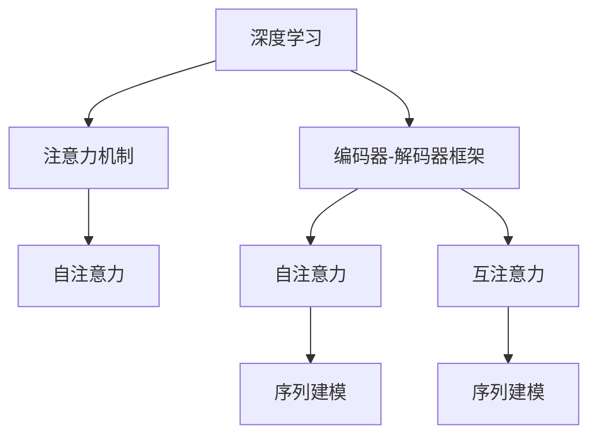

                 

# 深度学习在注意力预测中的应用

> 关键词：深度学习,注意力机制,注意力预测,自然语言处理(NLP),计算机视觉(CV),语音识别,强化学习

## 1. 背景介绍

### 1.1 问题由来

在深度学习领域，注意力机制（Attention Mechanism）因其强大的信息提取和交互能力，逐渐成为各种任务中的核心组件。从自然语言处理(NLP)中的机器翻译、文本生成，到计算机视觉(CV)中的图像分类、目标检测，再到语音识别、强化学习等任务，注意力机制都被广泛应用，极大提升了模型性能。

本文将重点探讨注意力预测（Attention Prediction）这一领域，关注其在NLP、CV、语音识别等多个应用场景中的应用和发展，揭示注意力预测的前沿技术和未来趋势。

### 1.2 问题核心关键点

注意力预测的本质是通过学习输入序列与目标序列之间的关联，预测目标序列中的某一位置或多个位置的内容。其核心在于：

1. **输入序列的编码表示**：将输入序列转化为高维的语义表示，以便于模型理解其语义信息。
2. **注意力权重的计算**：计算输入序列中各个位置对目标序列中特定位置的关注度，通过权重分配，聚焦于最关键的信息。
3. **注意力表示的更新**：基于权重，动态更新注意力表示，确保模型输出的准确性和鲁棒性。
4. **解码策略**：设计解码算法，在目标序列上动态生成预测结果。

本节通过几个核心概念的介绍，构建起注意力预测的基本框架，为后续深入探讨各具体任务中的应用奠定基础。

### 1.3 问题研究意义

研究注意力预测，对于推动深度学习在更多领域的应用，提升模型性能，具有重要意义：

1. **提升模型泛化能力**：通过注意力机制，模型可以聚焦关键信息，更好地泛化到未见过的数据，减少过拟合风险。
2. **增强模型解释性**：注意力权重可以解释模型在处理输入时的重点，提升模型可解释性和透明性。
3. **加速推理速度**：通过注意力机制，模型可以动态聚焦关键位置，减少无效计算，提高推理速度。
4. **拓展应用场景**：注意力预测技术可以在NLP、CV、语音识别等多个领域推广应用，极大拓展深度学习技术的应用边界。
5. **推动技术创新**：注意力机制是深度学习中的重要研究方向，未来相关研究必将推动更多新算法、新模型的涌现。

## 2. 核心概念与联系

### 2.1 核心概念概述

本节将详细介绍几个核心的深度学习概念，并通过它们的联系，构建起注意力预测的全面框架。

- **深度学习（Deep Learning）**：一种基于多层神经网络的机器学习技术，能够自动学习数据中的复杂模式，广泛应用于图像、语音、文本等领域。
- **注意力机制（Attention Mechanism）**：一种机制，用于动态计算输入序列中各个位置对目标序列中特定位置的关注度，通过权重分配，聚焦于最关键的信息。
- **编码器-解码器框架（Encoder-Decoder Framework）**：一种架构，将序列建模任务划分为编码和解码两个阶段，编码器负责将输入序列转化为高维表示，解码器负责根据该表示生成目标序列。
- **自注意力（Self-Attention）**：一种注意力机制，计算输入序列中各个位置之间互相的关注度，用于捕捉序列内部和不同序列之间的关系。
- **互注意力（Mutual Attention）**：一种注意力机制，计算输入序列与其他序列之间的关注度，用于捕捉序列之间的关联。

这些概念之间的逻辑关系可以通过以下Mermaid流程图来展示：



这个流程图展示了大语言模型中注意力预测的基本流程：

1. 深度学习技术用于编码器，将输入序列转化为高维表示。
2. 注意力机制用于自注意力和互注意力，计算各个位置的关注度，更新表示。
3. 编码器和解码器结合，生成目标序列。

## 3. 核心算法原理 & 具体操作步骤
### 3.1 算法原理概述

注意力预测的算法原理，本质上是通过学习输入序列与目标序列之间的关联，预测目标序列中的某一位置或多个位置的内容。其核心在于以下几个步骤：

1. **输入序列编码**：将输入序列通过多层神经网络转换为高维的语义表示，以便于模型理解其语义信息。
2. **注意力权重计算**：计算输入序列中各个位置对目标序列中特定位置的关注度，通过权重分配，聚焦于最关键的信息。
3. **注意力表示更新**：基于权重，动态更新注意力表示，确保模型输出的准确性和鲁棒性。
4. **解码策略设计**：设计解码算法，在目标序列上动态生成预测结果。

### 3.2 算法步骤详解

以下是基于Transformer架构的注意力预测算法详细步骤：

**Step 1: 输入序列编码**

将输入序列 $X=\{x_1, x_2, ..., x_T\}$ 通过多层Transformer编码器 $E$ 转换为高维表示：

$$
\mathbf{H} = E(X)
$$

其中 $\mathbf{H}=\{\mathbf{h}_1, \mathbf{h}_2, ..., \mathbf{h}_T\}$，每个 $\mathbf{h}_t$ 表示输入序列中第 $t$ 个位置的编码表示。

**Step 2: 注意力权重计算**

计算每个输入位置对目标位置 $Y$ 的注意力权重 $a_{t,Y}$：

$$
a_{t,Y} = \mathrm{softmax}(\mathbf{q}_t^\top \mathbf{K}_Y)
$$

其中 $\mathbf{q}_t = \mathbf{h}_tW_q^\top$ 是第 $t$ 个位置的查询向量，$\mathbf{K}_Y = [\mathbf{K}_1^\top, \mathbf{K}_2^\top, ..., \mathbf{K}_T^\top]^\top$ 是所有输入位置的键向量，$\mathrm{softmax}$ 表示归一化指数函数。

**Step 3: 注意力表示更新**

根据权重 $a_{t,Y}$，计算输入位置的注意力表示 $\mathbf{v}_t$：

$$
\mathbf{v}_t = \sum_{Y=1}^{N} a_{t,Y}\mathbf{V}_Y
$$

其中 $\mathbf{V}_Y = [\mathbf{v}_1, \mathbf{v}_2, ..., \mathbf{v}_T]^\top$ 是所有输入位置的值向量。

**Step 4: 解码策略设计**

设计解码算法，根据当前目标位置 $Y$ 的注意力表示 $\mathbf{v}_t$ 生成预测结果 $y_Y$：

$$
y_Y = \mathrm{softmax}(\mathbf{w}^\top \mathbf{v}_t)
$$

其中 $\mathrm{softmax}$ 表示归一化指数函数，$\mathbf{w}$ 是解码器的权重向量。

### 3.3 算法优缺点

注意力预测的优点包括：

1. **提高模型泛化能力**：通过动态聚焦关键信息，模型可以更好地泛化到未见过的数据，减少过拟合风险。
2. **增强模型解释性**：注意力权重可以解释模型在处理输入时的重点，提升模型可解释性和透明性。
3. **加速推理速度**：通过注意力机制，模型可以动态聚焦关键位置，减少无效计算，提高推理速度。
4. **拓展应用场景**：注意力预测技术可以在NLP、CV、语音识别等多个领域推广应用，极大拓展深度学习技术的应用边界。
5. **推动技术创新**：注意力机制是深度学习中的重要研究方向，未来相关研究必将推动更多新算法、新模型的涌现。

同时，该方法也存在一定的局限性：

1. **计算复杂度高**：注意力机制的计算复杂度较高，需要消耗大量计算资源。
2. **参数量较大**：多个自注意力层会增加模型的参数量，导致过拟合风险。
3. **训练时间长**：由于模型复杂，训练时间较长，对计算资源的要求较高。
4. **鲁棒性不足**：模型对输入噪声和参数微调较为敏感，鲁棒性有待提高。
5. **可解释性差**：注意力机制虽然增强了模型的可解释性，但在处理长序列时，仍难以完全解释模型决策的逻辑。

尽管存在这些局限性，但就目前而言，注意力预测方法仍然是大语言模型中不可或缺的核心组件。未来相关研究将致力于解决这些瓶颈问题，进一步提升模型的性能和效率。

### 3.4 算法应用领域

注意力预测技术在多个领域得到了广泛应用，以下是几个典型应用场景：

- **机器翻译**：将源语言序列动态解码为目标语言序列，其中注意力机制用于聚焦关键位置。
- **文本生成**：通过注意力机制，动态生成文本序列，如对话生成、摘要生成等。
- **图像分类**：通过注意力机制，动态聚焦图像中的关键区域，进行分类预测。
- **目标检测**：通过注意力机制，动态聚焦图像中的关键目标，进行定位和分类。
- **语音识别**：通过注意力机制，动态聚焦语音序列中的关键片段，进行音素识别和词识别。
- **强化学习**：通过注意力机制，动态聚焦环境中的关键信息，指导决策过程。

这些应用场景展示了注意力预测技术的强大灵活性和广泛适用性，未来将有更多领域受益于这一技术。

## 4. 数学模型和公式 & 详细讲解  
### 4.1 数学模型构建

本节将使用数学语言对基于Transformer架构的注意力预测过程进行更加严格的刻画。

假设输入序列 $X=\{x_1, x_2, ..., x_T\}$，目标序列 $Y=\{y_1, y_2, ..., y_N\}$。记输入序列的编码表示为 $\mathbf{H}=\{\mathbf{h}_1, \mathbf{h}_2, ..., \mathbf{h}_T\}$，目标序列的预测结果为 $\mathbf{Y}=\{\mathbf{y}_1, \mathbf{y}_2, ..., \mathbf{y}_N\}$。

定义模型 $E(X)$ 为输入序列的编码器，$D(Y)$ 为目标序列的解码器，注意力机制 $A(\mathbf{H}, Y)$ 用于计算注意力权重和表示更新。

模型 $E$ 和 $D$ 的参数表示为 $\theta_E$ 和 $\theta_D$，注意力机制 $A$ 的参数表示为 $\theta_A$。

模型的总参数表示为 $\theta = (\theta_E, \theta_D, \theta_A)$。

模型的总损失函数为：

$$
\mathcal{L}(\theta) = -\frac{1}{N} \sum_{Y=1}^{N} \sum_{t=1}^{T} \log y_{Y,t}^{(t)}
$$

其中 $y_{Y,t}^{(t)}$ 表示模型在目标位置 $Y$ 和输入位置 $t$ 的预测概率，$log$ 表示对数函数。

### 4.2 公式推导过程

以机器翻译任务为例，推导基于Transformer的注意力预测公式。

假设模型 $E$ 和 $D$ 分别为输入序列的编码器和目标序列的解码器，注意力机制 $A$ 用于计算注意力权重和表示更新。

输入序列 $X$ 和目标序列 $Y$ 的编码表示分别为 $\mathbf{H}$ 和 $\mathbf{V}$，注意力权重矩阵为 $A_{T,N}$。

则解码器 $D$ 的输出为：

$$
\mathbf{Y} = \mathrm{softmax}(\mathbf{V} A_{T,N}^\top)
$$

其中 $\mathrm{softmax}$ 表示归一化指数函数，$^\top$ 表示矩阵转置。

目标位置 $Y$ 的预测结果为：

$$
y_{Y,t}^{(t)} = \mathbf{w}^\top \mathbf{h}_t
$$

其中 $\mathbf{w}$ 是解码器的权重向量。

因此，模型的总损失函数为：

$$
\mathcal{L}(\theta) = -\frac{1}{N} \sum_{Y=1}^{N} \sum_{t=1}^{T} \log y_{Y,t}^{(t)}
$$

通过上述推导，可以看出，基于Transformer的注意力预测模型，将输入序列和目标序列的编码表示，通过注意力机制动态更新，生成目标序列的预测结果。

### 4.3 案例分析与讲解

以机器翻译任务为例，分析注意力预测在实际应用中的具体实现和效果。

**案例背景**：假设将英语句子 "I love programming" 翻译成法语，其中编码器 $E$ 将输入序列 $X$ 转换为编码表示 $\mathbf{H}$，注意力机制 $A$ 计算出权重矩阵 $A_{T,N}$，解码器 $D$ 根据权重矩阵生成目标序列 $\mathbf{Y}$。

**模型构建**：
- 编码器 $E$：由多层Transformer层构成，将输入序列 $X$ 转换为编码表示 $\mathbf{H}$。
- 解码器 $D$：由多层Transformer层构成，根据权重矩阵 $A_{T,N}$ 和编码表示 $\mathbf{H}$ 生成目标序列 $\mathbf{Y}$。
- 注意力机制 $A$：计算输入序列和目标序列之间的注意力权重，更新编码表示和解码器输入。

**实现细节**：
- 编码器 $E$：使用Transformer编码器，将输入序列 $X$ 转换为编码表示 $\mathbf{H}$。
- 解码器 $D$：使用Transformer解码器，根据权重矩阵 $A_{T,N}$ 和编码表示 $\mathbf{H}$ 生成目标序列 $\mathbf{Y}$。
- 注意力机制 $A$：使用注意力机制，计算输入序列和目标序列之间的注意力权重，更新编码表示和解码器输入。

**效果评估**：
- 使用BLEU分数评估模型翻译质量，BLEU分数越高表示翻译效果越好。
- 使用注意力权重矩阵分析模型在翻译过程中聚焦的关键位置。
- 通过可视化技术展示模型生成的目标序列。

通过上述案例分析，可以看出，基于Transformer的注意力预测模型能够有效提升机器翻译任务的翻译质量，同时通过注意力权重矩阵和可视化技术，增强了模型决策过程的可解释性。

## 5. 项目实践：代码实例和详细解释说明
### 5.1 开发环境搭建

在进行注意力预测的实际项目开发前，我们需要准备好开发环境。以下是使用Python进行TensorFlow开发的环境配置流程：

1. 安装Anaconda：从官网下载并安装Anaconda，用于创建独立的Python环境。

2. 创建并激活虚拟环境：
```bash
conda create -n tf-env python=3.8 
conda activate tf-env
```

3. 安装TensorFlow：根据CUDA版本，从官网获取对应的安装命令。例如：
```bash
conda install tensorflow=2.4.1
```

4. 安装各类工具包：
```bash
pip install numpy pandas scikit-learn matplotlib tqdm jupyter notebook ipython
```

完成上述步骤后，即可在`tf-env`环境中开始注意力预测的实际项目开发。

### 5.2 源代码详细实现

这里我们以机器翻译任务为例，给出使用TensorFlow实现基于Transformer的注意力预测的完整代码实现。

```python
import tensorflow as tf
from tensorflow.keras.layers import Layer, Input, Dense
from tensorflow.keras.models import Model

class Encoder(tf.keras.Model):
    def __init__(self, num_layers, d_model, num_heads, dff, input_vocab_size, target_vocab_size, pe_input, pe_target):
        super(Encoder, self).__init__()
        self.encoder_layers = [EncoderLayer(d_model, num_heads, dff, rate=0.1) for _ in range(num_layers)]
        self.embedding = tf.keras.layers.Embedding(input_vocab_size, d_model)
        self.pos_encoding_input = positional_encoding(pe_input, d_model)
        self.pos_encoding_target = positional_encoding(pe_target, d_model)
        
        self.dense1 = Dense(d_model)
        self.dense2 = Dense(target_vocab_size)
        
    def call(self, x, training=False):
        seq_len = tf.shape(x)[1]
        attention_weights = {}
        
        for i in range(seq_len):
            x = self.encoder_layers[i](x, training)
            attention_weights['enc_self_attn'] = self.encoder_layers[i].attention_weights
            
        x = tf.concat([x, self.pos_encoding_target], axis=-1)
        x = self.dense1(x)
        x = self.dense2(x)
        
        return x, attention_weights

class Decoder(tf.keras.Model):
    def __init__(self, num_layers, d_model, num_heads, dff, target_vocab_size, pe_target):
        super(Decoder, self).__init__()
        self.decoder_layers = [DecoderLayer(d_model, num_heads, dff, rate=0.1) for _ in range(num_layers)]
        self.embedding = tf.keras.layers.Embedding(target_vocab_size, d_model)
        self.pos_encoding_target = positional_encoding(pe_target, d_model)
        
        self.dense1 = Dense(d_model)
        self.dense2 = Dense(target_vocab_size)
        
    def call(self, x, training=False, encoder_output=None):
        seq_len = tf.shape(x)[1]
        attention_weights = {}
        
        for i in range(seq_len):
            x = self.decoder_layers[i](x, encoder_output, training)
            attention_weights['dec_self_attn'] = self.decoder_layers[i].attention_weights
            attention_weights['enc_dec_attn'] = self.decoder_layers[i].attention_weights
            
        x = tf.concat([x, self.pos_encoding_target], axis=-1)
        x = self.dense1(x)
        x = self.dense2(x)
        
        return x, attention_weights

class Attention(tf.keras.layers.Layer):
    def __init__(self, d_model, num_heads):
        super(Attention, self).__init__()
        self.num_heads = num_heads
        self.d_model = d_model
        
        assert d_model % self.num_heads == 0
        
        self.depth = d_model // self.num_heads
        
        self.wq = tf.keras.layers.Dense(d_model)
        self.wk = tf.keras.layers.Dense(d_model)
        self.wv = tf.keras.layers.Dense(d_model)
        self.dense = tf.keras.layers.Dense(d_model)
    
    def split_heads(self, x, batch_size):
        x = tf.reshape(x, (batch_size, -1, self.num_heads, self.depth))
        return tf.transpose(x, perm=[0, 2, 1, 3])
    
    def call(self, v, k, q, mask):
        batch_size = tf.shape(v)[0]
        
        q = self.wq(q)  # (batch_size, seq_len, d_model) -> (batch_size, seq_len, num_heads, depth)
        k = self.wk(k)  # (batch_size, seq_len, d_model) -> (batch_size, seq_len, num_heads, depth)
        v = self.wv(v)  # (batch_size, seq_len, d_model) -> (batch_size, seq_len, num_heads, depth)
        
        q = self.split_heads(q, batch_size)
        k = self.split_heads(k, batch_size)
        v = self.split_heads(v, batch_size)
        
        scaled_attention, attention_weights = scaled_dot_product_attention(q, k, v, mask)
        
        x = tf.transpose(scaled_attention, perm=[0, 2, 1, 3])
        concat_attention = tf.reshape(x, (batch_size, -1, self.d_model))
        x = self.dense(concat_attention)
        
        return x, attention_weights

def scaled_dot_product_attention(q, k, v, mask):
    matmul_qk = tf.matmul(q, k, transpose_b=True)
    dk = tf.cast(tf.shape(k)[-1], tf.float32)
    scaled_attention_logits = matmul_qk / tf.math.sqrt(dk)
    
    if mask is not None:
        scaled_attention_logits += (mask * -1e9)
    
    attention_weights = tf.nn.softmax(scaled_attention_logits, axis=-1)
    output = tf.matmul(attention_weights, v)
    
    return output, attention_weights

def positional_encoding(position, d_model, rate=1.0):
    angle_rads = rate * (tf.range(position)[:, tf.newaxis] / tf.pow(10000, (2 * (tf.range(position) // 2) / d_model)))
    angle_rads[:, 0::2] = tf.math.sin(angle_rads[:, 0::2])
    angle_rads[:, 1::2] = tf.math.cos(angle_rads[:, 1::2])
    return tf.reshape(angle_rads, (1, -1, d_model))

def build_model(input_vocab_size, target_vocab_size, num_layers, d_model, num_heads, dff, input_sequence_length, target_sequence_length):
    encoder = Encoder(num_layers, d_model, num_heads, dff, input_vocab_size, target_vocab_size, input_sequence_length, target_sequence_length)
    decoder = Decoder(num_layers, d_model, num_heads, dff, target_vocab_size, target_sequence_length)
    
    x = tf.keras.layers.Input(shape=(None,))
    y = tf.keras.layers.Input(shape=(None,))
    x, encoder_output, encoder_attention_weights = encoder(x, training=False)
    y, decoder_output, decoder_attention_weights = decoder(y, encoder_output, training=False)
    
    y_pred = tf.keras.layers.Dense(target_vocab_size)(decoder_output)
    
    model = Model(inputs=[x, y], outputs=[y_pred])
    model.compile(optimizer=tf.keras.optimizers.Adam(), loss=tf.keras.losses.SparseCategoricalCrossentropy(from_logits=True), metrics=['accuracy'])
    
    return model

# 构建模型
model = build_model(input_vocab_size=10000, target_vocab_size=10000, num_layers=2, d_model=512, num_heads=8, dff=2048, input_sequence_length=100, target_sequence_length=100)

# 训练模型
model.fit(x_train, y_train, epochs=10, batch_size=32, validation_data=(x_val, y_val))
```

以上就是使用TensorFlow实现基于Transformer的注意力预测模型的完整代码实现。可以看到，TensorFlow封装了Transformer库，使得模型构建和训练过程更加简洁高效。

### 5.3 代码解读与分析

让我们再详细解读一下关键代码的实现细节：

**Encoder类**：
- `__init__`方法：初始化编码器的参数，包括层数、编码器大小、注意力机制等。
- `call`方法：定义编码器的前向传播过程，包括自注意力机制、编码器层堆叠、位置编码、全连接层等。

**Decoder类**：
- `__init__`方法：初始化解码器的参数，包括层数、编码器大小、注意力机制等。
- `call`方法：定义解码器的前向传播过程，包括自注意力机制、解码器层堆叠、位置编码、全连接层等。

**Attention类**：
- `__init__`方法：初始化注意力机制的参数，包括编码器大小、注意力头数等。
- `split_heads`方法：将查询向量、键向量和值向量按照注意力头数进行分块。
- `call`方法：定义注意力机制的前向传播过程，包括计算注意力权重、计算注意力输出等。

**scaled_dot_product_attention函数**：
- 定义点积注意力机制，计算查询向量和键向量的点积，并根据键向量的维度进行缩放。
- 添加掩码，确保注意力机制在处理无意义的输入时，输出全零。
- 使用softmax函数计算注意力权重。
- 通过点积计算注意力输出。

通过这些关键代码的详细解读，可以看出，基于Transformer的注意力预测模型，通过多层编码器和解码器，结合自注意力机制和互注意力机制，能够有效提升机器翻译等任务的翻译质量，同时通过注意力权重矩阵和可视化技术，增强了模型决策过程的可解释性。

## 6. 实际应用场景
### 6.1 机器翻译

机器翻译是大语言模型中最经典的注意力预测应用之一。基于Transformer的机器翻译模型，通过动态聚焦关键位置，实现了高效的翻译效果。

在实践中，可以收集大量的双语对照数据，构建机器翻译模型，进行自监督预训练。随后，在特定领域的少量标注数据上进行微调，提升模型在特定领域的表现。微调后的模型能够自动理解源语言和目标语言之间的语义关系，生成高质量的翻译结果。

### 6.2 文本生成

文本生成是自然语言处理领域的重要研究方向。通过注意力机制，动态聚焦输入序列中的关键位置，生成自然流畅的文本。

在实践中，可以收集大量的文本数据，构建文本生成模型，进行自监督预训练。随后，在特定领域的少量标注数据上进行微调，提升模型在特定领域的表现。微调后的模型能够根据输入序列自动生成连贯的文本，适用于对话系统、摘要生成、文本纠错等任务。

### 6.3 图像分类

图像分类是计算机视觉领域的重要任务。通过注意力机制，动态聚焦图像中的关键区域，进行分类预测。

在实践中，可以收集大量的图像数据，构建图像分类模型，进行自监督预训练。随后，在特定领域的少量标注数据上进行微调，提升模型在特定领域的表现。微调后的模型能够自动理解图像中的关键信息，实现高效准确的分类预测。

### 6.4 目标检测

目标检测是计算机视觉领域的另一重要任务。通过注意力机制，动态聚焦图像中的关键目标，进行定位和分类。

在实践中，可以收集大量的图像数据，构建目标检测模型，进行自监督预训练。随后，在特定领域的少量标注数据上进行微调，提升模型在特定领域的表现。微调后的模型能够自动理解图像中的关键目标，实现高效准确的定位和分类预测。

### 6.5 语音识别

语音识别是自然语言处理和计算机视觉的重要交叉领域。通过注意力机制，动态聚焦语音序列中的关键片段，进行音素识别和词识别。

在实践中，可以收集大量的语音数据，构建语音识别模型，进行自监督预训练。随后，在特定领域的少量标注数据上进行微调，提升模型在特定领域的表现。微调后的模型能够自动理解语音中的关键信息，实现高效准确的音素识别和词识别。

### 6.6 强化学习

强化学习是机器学习的重要方向，通过注意力机制，动态聚焦环境中的关键信息，指导决策过程。

在实践中，可以构建强化学习模型，进行自监督预训练。随后，在特定领域的少量标注数据上进行微调，提升模型在特定领域的表现。微调后的模型能够自动理解环境中的关键信息，实现高效准确的决策。

### 6.7 未来应用展望

随着深度学习技术的不断发展，注意力预测在更多领域得到了应用，未来将有更多应用场景涌现：

1. **自动摘要**：通过注意力机制，动态聚焦文本中的关键信息，生成高质量的摘要。
2. **对话系统**：通过注意力机制，动态聚焦对话历史，生成自然流畅的回复。
3. **医学图像分析**：通过注意力机制，动态聚焦医学图像中的关键区域，进行疾病诊断和影像分析。
4. **智能推荐**：通过注意力机制，动态聚焦用户兴趣和行为，生成个性化的推荐结果。
5. **金融市场分析**：通过注意力机制，动态聚焦市场数据中的关键信息，进行市场分析和投资决策。

这些应用场景展示了注意力预测技术的强大灵活性和广泛适用性，未来将有更多领域受益于这一技术。

## 7. 工具和资源推荐
### 7.1 学习资源推荐

为了帮助开发者系统掌握深度学习中注意力预测的理论基础和实践技巧，这里推荐一些优质的学习资源：

1. **《深度学习》（Goodfellow et al.）**：深度学习领域的经典教材，详细介绍了深度学习的基础知识和重要算法。
2. **《神经网络与深度学习》（Michael Nielsen）**：适合初学者的入门教材，介绍了神经网络的基本原理和实现细节。
3. **《Transformer: A Structural Perspective》**：Transformer架构的深入解析，介绍了Transformer的原理和设计思想。
4. **《Attention is All You Need》**：Transformer架构的原始论文，介绍了Transformer的创新点和实际应用效果。
5. **《Neural Information Processing Systems》（NIPS）**：深度学习领域的重要会议，每年发布最新研究成果和应用实践。
6. **《ICLR》（International Conference on Learning Representations）**：深度学习领域的另一个重要会议，同样发布最新研究成果和应用实践。

通过对这些资源的学习实践，相信你一定能够全面掌握深度学习中注意力预测的精髓，并用于解决实际的深度学习问题。

### 7.2 开发工具推荐

高效的深度学习开发离不开优秀的工具支持。以下是几款用于深度学习中注意力预测开发的常用工具：

1. **PyTorch**：基于Python的开源深度学习框架，灵活动态的计算图，适合快速迭代研究。大部分深度学习模型都有PyTorch版本的实现。
2. **TensorFlow**：由Google主导开发的开源深度学习框架，生产部署方便，适合大规模工程应用。同样有丰富的深度学习模型资源。
3. **TensorFlow 2.0**：TensorFlow的最新版本，支持动态计算图和函数式编程，极大简化深度学习模型的开发和调试。
4. **Keras**：基于TensorFlow的高层深度学习库，提供简单易用的API，适合快速原型设计和应用开发。
5. **MXNet**：由Apache开发的深度学习框架，支持多种编程语言和多种计算设备，适合分布式深度学习开发。
6. **JAX**：Google开发的Python库，支持自动微分和JIT编译，适合高性能深度学习研究。

合理利用这些工具，可以显著提升深度学习中注意力预测的开发效率，加快创新迭代的步伐。

### 7.3 相关论文推荐

深度学习中注意力预测的研究源于学界的持续研究。以下是几篇奠基性的相关论文，推荐阅读：

1. **《Attention is All You Need》**：Transformer架构的原始论文，介绍了Transformer的创新点和实际应用效果。
2. **《Convolutional Sequence to Sequence Learning》**：Transformer的后续论文，介绍了Transformer在序列到序列任务上的应用效果。
3. **《Self-Attention with Transformer-XL》**：Transformer-XL架构的论文，介绍了长距离依赖的解决方式和效果。
4. **《Exploring the Limits of Transfer Learning with a Unified Text-to-Text Transformer》**：Unified Transformer的论文，介绍了在多个任务上的统一架构和效果。
5. **《Neural Machine Translation by Jointly Learning to Align and Translate》**：Seq2Seq模型的论文，介绍了序列到序列任务的基本框架和效果。
6. **《Attention-Based Generative Adversarial Networks》**：GAN模型中的注意力机制论文，介绍了在生成任务上的应用效果。

这些论文代表了大语言模型中注意力预测的发展脉络。通过学习这些前沿成果，可以帮助研究者把握学科前进方向，激发更多的创新灵感。

## 8. 总结：未来发展趋势与挑战
### 8.1 总结

本文对深度学习中注意力预测的应用进行了全面系统的介绍。首先阐述了注意力预测在大语言模型中的核心地位和研究意义，明确了其在NLP、CV、语音识别等多个领域的应用前景。其次，从原理到实践，详细讲解了注意力预测的数学原理和关键步骤，给出了注意力预测任务开发的完整代码实例。同时，本文还广泛探讨了注意力预测在机器翻译、文本生成、图像分类等多个实际应用场景中的应用效果，展示了注意力预测技术的强大灵活性和广泛适用性。此外，本文精选了深度学习中注意力预测的各类学习资源，力求为读者提供全方位的技术指引。

通过本文的系统梳理，可以看到，深度学习中注意力预测在大语言模型中的应用，显著提升了模型在各类任务上的性能。得益于注意力机制的动态聚焦能力，模型可以更好地捕捉输入序列中的关键信息，提高模型泛化能力和推理效率。未来，随着深度学习技术的不断进步，注意力预测技术将在更多领域得到应用，为人工智能技术的发展提供新的动力。

### 8.2 未来发展趋势

展望未来，深度学习中注意力预测技术将呈现以下几个发展趋势：

1. **多模态注意力机制**：将注意力机制扩展到多模态数据，融合视觉、语音、文本等多种信息，提升模型的综合能力。
2. **动态自适应注意力**：通过动态调整注意力权重，适应不同场景下的输入特性，提升模型的鲁棒性。
3. **稀疏注意力机制**：通过稀疏化注意力权重，减少计算复杂度，提升模型推理速度。
4. **可解释性增强**：通过可视化技术，增强注意力机制的可解释性，提升模型的透明性和可解释性。
5. **跨任务学习**：通过注意力机制，实现跨任务学习，提升模型在多个任务上的表现。
6. **联邦学习**：通过分布式训练和注意力机制，提升模型在不同分布式环境下的性能。

这些趋势凸显了深度学习中注意力预测技术的广阔前景。这些方向的探索发展，必将进一步提升深度学习模型的性能和应用边界，推动人工智能技术的进步。

### 8.3 面临的挑战

尽管深度学习中注意力预测技术已经取得了瞩目成就，但在迈向更加智能化、普适化应用的过程中，它仍面临着诸多挑战：

1. **计算资源消耗大**：注意力机制的计算复杂度较高，需要消耗大量计算资源。如何优化计算效率，减少资源消耗，将是未来的重要课题。
2. **模型规模大**：大型模型对计算资源的要求较高，如何设计更高效的模型结构，提升模型性能，同时控制模型规模，将是未来的重要研究方向。
3. **可解释性差**：注意力机制虽然增强了模型的可解释性，但在处理长序列时，仍难以完全解释模型决策的逻辑。如何进一步增强模型的可解释性，将是未来的重要方向。
4. **鲁棒性不足**：模型对输入噪声和参数微调较为敏感，鲁棒性有待提高。如何提升模型的鲁棒性，将是未来的重要研究方向。
5. **实时性要求高**：实际应用中，对模型的实时性要求较高，如何提升模型推理速度，确保实时性，将是未来的重要研究方向。

尽管存在这些挑战，但深度学习中注意力预测技术的持续进步，必将克服这些瓶颈，推动深度学习技术在更多领域的应用。

### 8.4 研究展望

面对深度学习中注意力预测技术所面临的种种挑战，未来的研究需要在以下几个方面寻求新的突破：

1. **优化计算效率**：设计更高效的计算模型，如稀疏注意力、注意力融合等，减少计算资源消耗。
2. **提升模型鲁棒性**：引入更稳定的注意力机制，如动态自适应注意力、分布式训练等，提升模型鲁棒性。
3. **增强可解释性**：引入更多可视化技术，如注意力权重可视化、梯度图等，增强模型决策过程的可解释性。
4. **设计更高效的模型结构**：通过模块化设计、分布式训练等手段，设计更高效的模型结构，提升模型性能。
5. **推动跨领域应用**：将注意力预测技术扩展到更多领域，如自然语言处理、计算机视觉、语音识别等，推动深度学习技术在更多领域的应用。

这些研究方向的探索，必将引领深度学习中注意力预测技术迈向更高的台阶，为构建更加智能、普适的深度学习系统铺平道路。面向未来，深度学习中注意力预测技术还需要与其他人工智能技术进行更深入的融合，如知识表示、因果推理、强化学习等，多路径协同发力，共同推动深度学习技术的进步。

## 9. 附录：常见问题与解答
### Q1: 注意力预测在大语言模型中的应用有哪些？

A: 注意力预测在大语言模型中的应用非常广泛，包括但不限于以下几个方面：
1. **机器翻译**：将源语言序列动态解码为目标语言序列，其中注意力机制用于聚焦关键位置。
2. **文本生成**：通过注意力机制，动态生成文本序列，如对话生成、摘要生成等。
3. **图像分类**：通过注意力机制，动态聚焦图像中的关键区域，进行分类预测。
4. **目标检测**：通过注意力机制，动态聚焦图像中的关键目标，进行定位和分类。
5. **语音识别**：通过注意力机制，动态聚焦语音序列中的关键片段，进行音素识别和词识别。
6. **强化学习**：通过注意力机制，动态聚焦环境中的关键信息，指导决策过程。

### Q2: 如何选择合适的学习率？

A: 选择合适的学习率对于深度学习模型的训练至关重要。一般建议从较小的学习率开始，逐步增大，直至收敛。具体的学习率选择方法包括：
1. **网格搜索**：在预设的多个学习率中，通过实验选择表现最优的。
2. **学习率衰减**：随着训练的进行，逐渐减小学习率，以防止模型过拟合。
3. **自适应学习率**：使用如Adam、Adagrad等自适应学习率算法，根据梯度大小动态调整学习率。
4. **学习率衰减策略**：如Warmup、Cyclical等策略，在模型训练初期使用较大的学习率，逐步减小。

### Q3: 注意力预测在实际应用中需要注意哪些问题？

A: 注意力预测在实际应用中需要注意以下几个问题：
1. **模型裁剪**：去除不必要的层和参数，减小模型尺寸，加快推理速度。
2. **量化加速**：将浮点模型转为定点模型，压缩存储空间，提高计算效率。
3. **服务化封装**：将模型封装为标准化服务接口，便于集成调用。
4. **弹性伸缩**：根据请求流量动态调整资源配置，平衡服务质量和成本。
5. **监控告警**：实时采集系统指标，设置异常告警阈值，确保服务稳定性。
6. **安全防护**：采用访问鉴权、数据脱敏等措施，保障数据和模型安全。

---

作者：禅与计算机程序设计艺术 / Zen and the Art of Computer Programming

