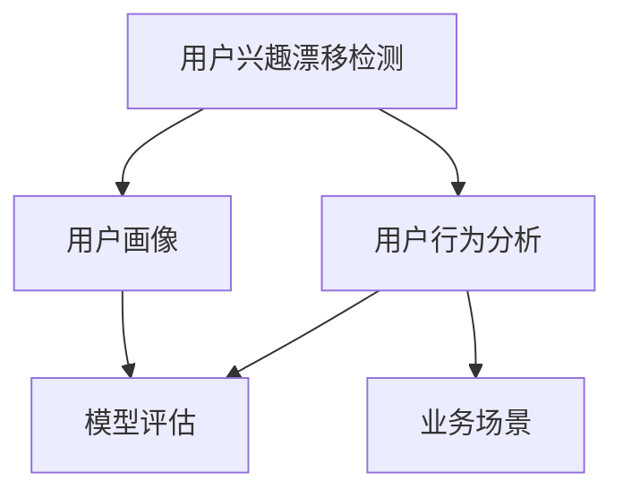

                 

# 深度学习在用户兴趣漂移检测中的应用

> 关键词：深度学习,用户兴趣漂移检测,用户行为分析,用户画像,模型评估,业务场景

## 1. 背景介绍

### 1.1 问题由来

在数字化时代，个性化推荐、广告投放等业务离不开对用户兴趣的深度理解和精准预测。传统的推荐系统，多依赖于用户历史行为数据，如浏览记录、点击行为等，进行兴趣建模和推荐决策。然而，随着用户行为的多样化和兴趣的动态变化，仅仅依靠历史数据可能难以全面刻画用户当前兴趣，从而影响推荐精度。

为了应对这一挑战，用户兴趣漂移检测（User Interest Drift Detection）技术应运而生。通过实时监测用户行为变化，及时发现兴趣的变化趋势，从而对推荐系统进行动态调整，确保推荐内容的个性化和时效性。

### 1.2 问题核心关键点

用户兴趣漂移检测的核心目标，是实时识别用户的兴趣变化趋势，并进行动态调整推荐策略。这种技术的应用，可以显著提升推荐系统的精度和时效性，增强用户体验。

其关键点包括：
- **兴趣漂移定义**：如何准确定义用户兴趣的变化，是兴趣漂移检测的第一步。
- **实时监测方法**：如何实时监测用户行为，是检测过程的关键。
- **异常检测算法**：如何通过机器学习算法，准确识别兴趣漂移的异常行为。
- **业务应用场景**：如何将兴趣漂移检测应用到推荐、广告等业务场景中。

## 2. 核心概念与联系

### 2.1 核心概念概述

为更好地理解用户兴趣漂移检测方法，本节将介绍几个关键概念：

- **用户兴趣漂移检测**：通过实时监测用户行为变化，识别出兴趣的动态变化，及时调整推荐策略，提升推荐系统的效果。
- **用户行为分析**：分析用户的浏览、点击、搜索等行为数据，提取特征信息，用于兴趣建模和行为预测。
- **用户画像**：基于用户历史行为数据和兴趣标签，构建用户兴趣和行为的全景视图。
- **模型评估**：使用多种指标评估模型性能，如准确率、召回率、F1分数等。
- **业务场景**：兴趣漂移检测技术在不同业务场景中的应用，如个性化推荐、广告投放、营销策略等。

这些核心概念之间的逻辑关系可以通过以下Mermaid流程图来展示：



这个流程图展示了好几个核心概念之间的联系：

1. 用户兴趣漂移检测以用户行为分析为前提，通过行为数据提取特征。
2. 用户画像在用户行为分析的基础上，整合多种信息，形成用户兴趣的全景视图。
3. 模型评估用于评估和优化用户兴趣漂移检测方法，确保其有效性和准确性。
4. 业务场景展示了兴趣漂移检测在推荐、广告等实际应用中的具体应用。

## 3. 核心算法原理 & 具体操作步骤

### 3.1 算法原理概述

用户兴趣漂移检测的基本原理是，通过实时监测用户的行为数据，提取特征向量，使用机器学习模型进行异常检测。具体来说，可以分为以下几个步骤：

1. **数据预处理**：收集用户行为数据，提取特征向量，进行数据清洗和标准化处理。
2. **建模训练**：使用历史数据训练异常检测模型，学习到用户行为与兴趣变化的规律。
3. **实时监测**：将实时行为数据输入模型，检测出兴趣漂移的异常行为。
4. **动态调整**：根据检测结果，动态调整推荐策略，确保推荐内容的时效性和个性化。

### 3.2 算法步骤详解

以下是用户兴趣漂移检测的详细操作步骤：

**Step 1: 数据预处理**

1. **数据收集**：从推荐系统、广告平台等业务系统中，收集用户的浏览、点击、搜索等行为数据。
2. **数据清洗**：剔除无用的噪声数据，如重复数据、异常数据等。
3. **特征提取**：根据业务需求和行为特征，选择有意义的特征，如页面访问时长、点击次数、浏览路径等。
4. **标准化处理**：对提取的特征进行归一化处理，使其在统一尺度下进行比较。

**Step 2: 建模训练**

1. **模型选择**：选择适合用户行为分析的机器学习模型，如支持向量机(SVM)、随机森林(Random Forest)、深度学习等。
2. **数据划分**：将历史数据划分为训练集和测试集，用于模型训练和测试。
3. **参数调优**：使用交叉验证等方法，调整模型参数，寻找最优模型配置。
4. **模型训练**：在训练集上训练模型，学习用户行为与兴趣变化的规律。

**Step 3: 实时监测**

1. **数据输入**：实时监测用户的行为数据，并提取特征向量。
2. **模型预测**：将特征向量输入训练好的模型，得到预测结果。
3. **异常判定**：根据模型预测结果，识别出兴趣漂移的异常行为。

**Step 4: 动态调整**

1. **策略调整**：根据兴趣漂移的检测结果，动态调整推荐策略，如推荐相似内容、推荐热门主题等。
2. **用户通知**：向用户展示推荐变化，引导用户继续探索新内容，增加用户粘性。

### 3.3 算法优缺点

用户兴趣漂移检测算法的主要优点包括：

1. **实时性高**：实时监测用户行为，及时调整推荐策略，提升用户体验。
2. **鲁棒性好**：能够适应多样化的用户行为模式，识别复杂的兴趣变化。
3. **可扩展性强**：不同业务场景下，可以通过调整特征和模型，灵活应用。

然而，该算法也存在一些缺点：

1. **数据依赖性高**：依赖于大量高质量的用户行为数据，数据获取成本高。
2. **模型复杂度高**：异常检测模型训练复杂，需要大量的计算资源。
3. **业务场景限制**：不同业务场景下，需要对模型和特征进行定制化调整。
4. **解释性差**：模型内部决策过程不透明，难以解释和调试。

## 4. 数学模型和公式 & 详细讲解 & 举例说明

### 4.1 数学模型构建

假设用户行为数据为 $\mathbf{x} = [x_1, x_2, \dots, x_n]$，其中 $x_i$ 为第 $i$ 个特征。用户兴趣漂移检测模型 $M$ 可以表示为：

$$
M(\mathbf{x}) = \mathbf{w} \cdot \mathbf{x} + b
$$

其中 $\mathbf{w}$ 为模型权重，$b$ 为偏置项。

### 4.2 公式推导过程

1. **数据划分**：将历史数据 $D$ 划分为训练集 $D_{train}$ 和测试集 $D_{test}$。
2. **模型训练**：在训练集上训练模型，得到模型参数 $\mathbf{w}$ 和 $b$。
3. **预测结果**：在测试集上输入新数据 $\mathbf{x}_{test}$，得到预测结果 $\hat{y}_{test}$。
4. **模型评估**：使用评价指标（如准确率、召回率）评估模型性能。

### 4.3 案例分析与讲解

以支持向量机(SVM)为例，其基本流程如下：

1. **数据预处理**：将用户行为数据 $\mathbf{x}$ 转化为向量形式，去除噪声数据。
2. **特征选择**：选择有意义的特征，如页面访问时长、点击次数等。
3. **模型训练**：使用支持向量机算法，训练得到分类器。
4. **实时监测**：实时监测用户行为，提取特征向量，进行预测。
5. **异常判定**：根据模型预测结果，识别出异常行为。
6. **动态调整**：根据检测结果，调整推荐策略。

## 5. 项目实践：代码实例和详细解释说明

### 5.1 开发环境搭建

在进行用户兴趣漂移检测的开发前，我们需要准备好开发环境。以下是使用Python进行PyTorch开发的详细步骤：

1. **安装Python**：从官网下载并安装Python，推荐使用3.7以上版本。
2. **安装PyTorch**：使用pip安装PyTorch，建议使用Anaconda创建虚拟环境进行隔离。
3. **安装相关库**：安装Numpy、Pandas、Scikit-learn等常用库，用于数据处理和模型训练。

### 5.2 源代码详细实现

以下是一个简单的用户兴趣漂移检测的Python代码实现：

```python
import numpy as np
from sklearn.svm import SVC
from sklearn.metrics import accuracy_score, recall_score

# 数据预处理
def preprocess_data(data):
    # 去除噪声数据
    data = data[data['click_count'] > 0]
    # 归一化处理
    data['page_visit_time'] = (data['page_visit_time'] - data['page_visit_time'].mean()) / data['page_visit_time'].std()
    # 特征选择
    features = ['page_visit_time', 'click_count']
    X = data[features]
    y = data['interest_label']
    return X, y

# 建模训练
def train_model(X_train, y_train, C=1.0):
    svm = SVC(kernel='linear', C=C)
    svm.fit(X_train, y_train)
    return svm

# 实时监测
def detect_drift(X_test, svm):
    y_pred = svm.predict(X_test)
    return y_pred

# 动态调整
def adjust_recommendation(y_pred):
    if y_pred == 1:
        print("推荐热门主题")
    else:
        print("推荐相似内容")

# 加载数据
data = pd.read_csv('user_behavior_data.csv')
X_train, y_train = preprocess_data(data)
X_test = preprocess_data(data[20:])

# 训练模型
svm = train_model(X_train, y_train)

# 实时监测
y_pred = detect_drift(X_test, svm)

# 动态调整
adjust_recommendation(y_pred)
```

这个代码实现了SVM模型的用户兴趣漂移检测，并根据检测结果动态调整推荐策略。可以看到，使用Python和Scikit-learn库，可以方便地进行数据预处理、模型训练和实时监测，实现用户兴趣漂移检测的基本功能。

### 5.3 代码解读与分析

让我们详细解读一下代码的关键实现细节：

1. **数据预处理**：`preprocess_data`函数负责数据清洗和标准化处理。去除噪声数据，归一化处理特征值，选择有意义的特征。

2. **建模训练**：`train_model`函数使用SVM模型训练，设置正则化参数C，得到模型权重和偏置项。

3. **实时监测**：`detect_drift`函数接收测试集数据和训练好的模型，进行预测，识别出兴趣漂移的异常行为。

4. **动态调整**：`adjust_recommendation`函数根据检测结果，调整推荐策略。

## 6. 实际应用场景

### 6.1 电商推荐

在电商推荐系统中，用户兴趣漂移检测可以实时监测用户行为变化，及时调整推荐策略，提升推荐精度。例如，某用户连续多日浏览某品牌手机，突然有一天浏览其他品牌手机，系统可以及时发现兴趣变化，调整推荐内容，防止用户流失。

### 6.2 广告投放

在广告投放中，用户兴趣漂移检测可以实时监测用户行为变化，调整投放策略，提高广告效果。例如，某用户在一段时间内频繁点击某类广告，突然对其他类广告感兴趣，系统可以及时调整投放方向，增加用户点击率。

### 6.3 内容推荐

在内容推荐中，用户兴趣漂移检测可以实时监测用户行为变化，调整内容推荐策略，保持用户粘性。例如，某用户在一段时间内频繁阅读某类型文章，突然对其他类型文章感兴趣，系统可以及时调整推荐内容，保持用户持续阅读。

### 6.4 未来应用展望

随着用户行为的多样化和智能设备的普及，用户兴趣漂移检测技术将得到更广泛的应用。未来，以下趋势值得关注：

1. **多模态数据融合**：结合用户行为、社交网络、地理位置等多模态数据，进行更全面的兴趣建模。
2. **实时性要求提高**：随着5G等网络技术的普及，用户兴趣漂移检测需要实时监测和动态调整，确保推荐时效性。
3. **个性化推荐**：用户兴趣漂移检测将结合推荐算法，实现更个性化的推荐内容。
4. **隐私保护**：在保证用户隐私的前提下，实现高效的用户兴趣漂移检测。

## 7. 工具和资源推荐

### 7.1 学习资源推荐

为了系统掌握用户兴趣漂移检测的方法，推荐以下学习资源：

1. 《推荐系统实战》一书：全面介绍了推荐系统的基本原理和实践方法，包括用户兴趣漂移检测。
2. 《深度学习基础》课程：涵盖深度学习的基本概念和算法，是入门深度学习的必选课程。
3. 《机器学习》课程：由斯坦福大学开设的机器学习课程，涵盖机器学习的基本方法和实践案例，是了解机器学习的好资源。
4. 《Python深度学习》一书：全面介绍深度学习在Python中的实现，包含丰富的代码示例。
5. 《Kaggle竞赛》：参加Kaggle竞赛，可以实战锻炼数据处理、模型训练和结果评估能力。

通过这些学习资源，可以快速掌握用户兴趣漂移检测的基本方法和实践技巧，并在实际项目中进行应用。

### 7.2 开发工具推荐

以下是几款用于用户兴趣漂移检测开发的常用工具：

1. Python：作为主流编程语言，Python拥有丰富的科学计算库和机器学习库，是数据处理和模型训练的理想选择。
2. PyTorch：基于Python的深度学习框架，灵活动态的计算图，适合快速迭代研究。
3. Scikit-learn：用于机器学习建模和评估的Python库，提供丰富的机器学习算法和评估指标。
4. TensorFlow：由Google主导开发的深度学习框架，生产部署方便，适合大规模工程应用。
5. Weights & Biases：模型训练的实验跟踪工具，可以记录和可视化模型训练过程中的各项指标，方便对比和调优。

合理利用这些工具，可以显著提升用户兴趣漂移检测任务的开发效率，加快创新迭代的步伐。

### 7.3 相关论文推荐

以下是几篇奠基性的相关论文，推荐阅读：

1. "User Interest Evolution Prediction: A Survey"：综述了用户兴趣变化预测的研究进展，介绍了各种方法和应用。
2. "Real-Time User Interest Change Detection for Recommendation System"：提出了一种实时检测用户兴趣变化的方法，并在实际推荐系统中取得了不错的效果。
3. "Fine-Grained Interest Evolution Prediction and Recommendation"：提出了一种细粒度的用户兴趣变化预测方法，能够更好地捕捉用户兴趣的细微变化。
4. "A Study of Deep Learning Models for User Interest Prediction"：比较了多种深度学习模型在用户兴趣预测中的应用效果，提供了丰富的实验结果。
5. "Adaptive Collaborative Filtering for Recommendation System"：提出了一种自适应的协同过滤方法，能够根据用户兴趣变化动态调整推荐策略。

这些论文代表了用户兴趣漂移检测技术的发展脉络，通过学习这些前沿成果，可以帮助研究者把握学科前进方向，激发更多的创新灵感。

## 8. 总结：未来发展趋势与挑战

### 8.1 研究成果总结

用户兴趣漂移检测技术，通过实时监测用户行为变化，及时调整推荐策略，显著提升了推荐系统的精度和时效性，增强了用户体验。该技术已经在电商推荐、广告投放、内容推荐等诸多业务场景中得到了广泛应用。

### 8.2 未来发展趋势

展望未来，用户兴趣漂移检测技术将呈现以下几个发展趋势：

1. **模型精度提升**：随着深度学习模型的不断发展，用户兴趣漂移检测的精度将不断提升，能够更好地识别出用户兴趣的变化。
2. **实时性要求提高**：随着网络技术的不断进步，用户兴趣漂移检测需要实时监测和动态调整，确保推荐内容的及时性。
3. **多模态数据融合**：结合用户行为、社交网络、地理位置等多模态数据，进行更全面的兴趣建模。
4. **业务场景拓展**：除了推荐系统，用户兴趣漂移检测将在更多业务场景中得到应用，如广告投放、内容创作、用户体验优化等。
5. **隐私保护**：在保证用户隐私的前提下，实现高效的用户兴趣漂移检测。

### 8.3 面临的挑战

尽管用户兴趣漂移检测技术已经取得了显著进展，但在迈向更加智能化、普适化应用的过程中，仍面临诸多挑战：

1. **数据质量问题**：用户行为数据的质量直接影响检测精度，如何获取高质量的数据，是一个重要的挑战。
2. **模型复杂度问题**：用户兴趣漂移检测模型的复杂度较高，需要大量的计算资源和时间成本，如何优化模型，是亟需解决的问题。
3. **业务场景多样性**：不同业务场景下，用户行为模式各异，如何对模型和特征进行定制化调整，是重要的研究方向。
4. **隐私保护问题**：用户行为数据涉及隐私，如何在保证用户隐私的前提下，实现高效的数据处理和分析，是亟需解决的问题。

### 8.4 研究展望

未来的研究需要从以下几个方向进行探索：

1. **多模态数据融合**：结合用户行为、社交网络、地理位置等多模态数据，进行更全面的兴趣建模。
2. **实时性要求提高**：随着网络技术的不断进步，用户兴趣漂移检测需要实时监测和动态调整，确保推荐内容的及时性。
3. **隐私保护**：在保证用户隐私的前提下，实现高效的用户兴趣漂移检测。
4. **业务场景拓展**：除了推荐系统，用户兴趣漂移检测将在更多业务场景中得到应用，如广告投放、内容创作、用户体验优化等。
5. **模型优化**：优化模型结构和算法，降低计算复杂度，提高模型训练和推理效率。

这些研究方向的探索，必将引领用户兴趣漂移检测技术迈向更高的台阶，为推荐系统和其他业务系统提供更智能、更高效、更可靠的技术支持。

## 9. 附录：常见问题与解答

**Q1: 用户兴趣漂移检测如何应对数据质量问题？**

A: 数据质量是用户兴趣漂移检测的核心问题，可以通过以下方法应对：
1. 数据清洗：去除噪声数据和异常数据，保证数据质量。
2. 数据标注：在数据标注时，确保标签的准确性，减少错误标注的影响。
3. 数据增强：通过数据增强技术，扩充数据集规模，提高模型鲁棒性。

**Q2: 用户兴趣漂移检测如何应对模型复杂度问题？**

A: 用户兴趣漂移检测模型复杂度较高，可以通过以下方法应对：
1. 特征选择：选择有意义的特征，减少特征维度。
2. 模型简化：使用简单的模型架构，降低计算复杂度。
3. 分布式计算：使用分布式计算框架，如Spark、Hadoop等，提高计算效率。

**Q3: 用户兴趣漂移检测如何应对业务场景多样性问题？**

A: 不同业务场景下，用户行为模式各异，可以通过以下方法应对：
1. 场景定制：针对不同业务场景，定制化的特征选择和模型训练。
2. 模型集成：结合多个模型的预测结果，综合判断用户兴趣变化。
3. 领域知识：结合领域知识，对模型和特征进行调整，提高模型适应性。

**Q4: 用户兴趣漂移检测如何应对隐私保护问题？**

A: 用户行为数据涉及隐私，可以通过以下方法应对：
1. 匿名化处理：对用户数据进行匿名化处理，保护用户隐私。
2. 差分隐私：使用差分隐私技术，减少数据泄露风险。
3. 联邦学习：在分布式环境下，通过联邦学习技术，保护用户数据隐私。

这些方法可以有效应对用户兴趣漂移检测中面临的数据质量、模型复杂度、业务场景多样性和隐私保护等挑战，提高检测精度和系统可靠性。

---

作者：禅与计算机程序设计艺术 / Zen and the Art of Computer Programming

