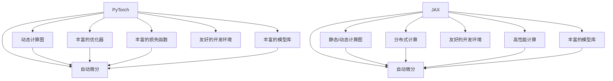

                 

# 深度学习框架选择指南：PyTorch还是JAX？

在深度学习领域，选择合适的框架对项目的成功至关重要。PyTorch和JAX是目前两大主流的深度学习框架，分别有着丰富的社区支持和广泛的应用场景。本文将详细比较这两大框架的特点、优缺点及适用领域，以帮助读者做出明智的选择。

## 1. 背景介绍

### 1.1 问题由来
深度学习框架的选择直接影响着项目的开发效率、性能优化和部署便利性。当前，PyTorch和JAX是两大流行的深度学习框架，均由顶尖的研究机构和社区维护。它们在许多方面都表现出色，但各自也有不同的优缺点。选择哪个框架取决于项目的具体需求和开发团队的偏好。

### 1.2 问题核心关键点
框架的选择应从以下几个核心关键点进行考虑：

- 编程语言和性能：PyTorch是基于Python的，注重动态计算图和灵活性；而JAX是基于JAX/Haiku的，支持静态和动态计算图。
- 生态系统和工具支持：PyTorch生态系统成熟，有丰富的第三方库和工具；JAX的生态系统相对较新，但发展迅速。
- 社区活跃度：PyTorch社区活跃度高，有大量的教程、示例和开源项目；JAX社区正在增长，有众多活跃的贡献者。
- 代码简洁性：PyTorch代码更加简洁，易于理解；JAX的代码较为复杂，但功能强大。
- 模型的部署：PyTorch模型的部署相对复杂，JAX的部署更为方便。

## 2. 核心概念与联系

### 2.1 核心概念概述

为了更好地理解PyTorch和JAX之间的区别，我们将简要介绍这两个框架的核心概念。

**PyTorch**：
- 由Facebook开发，支持动态计算图，易于调试和可视化。
- 内置自动微分，支持高效的模型训练。
- 提供了丰富的优化器和损失函数。

**JAX**：
- 由Google Brain团队开发，支持静态和动态计算图。
- 利用自动微分和优化库，加速模型训练。
- 支持分布式计算和向量化的高性能计算。

这两个框架在许多方面有共通之处，但也有一些关键差异。

### 2.2 核心概念原理和架构的 Mermaid 流程图

这个Mermaid流程图展示了PyTorch和JAX的核心概念和架构。动态计算图和静态/动态计算图是两者最大的区别。动态计算图更适合调试和可视化，而静态/动态计算图则提供更高的性能和可扩展性。

## 3. 核心算法原理 & 具体操作步骤
### 3.1 算法原理概述

在深度学习中，算法原理是框架选择的重要考虑因素。本节将对比PyTorch和JAX的核心算法原理。

**PyTorch**：
- 使用动态计算图，更易于调试和可视化。
- 基于操作记录的反向传播，自动计算梯度。
- 使用GPU加速，提高训练效率。

**JAX**：
- 支持静态和动态计算图，灵活性高。
- 利用JAX的自动微分，加速模型训练。
- 支持分布式计算和向量化的高性能计算。

两种框架在算法原理上各有优势，需要根据项目需求选择合适的框架。

### 3.2 算法步骤详解

在实际开发中，理解算法的具体步骤是关键。本节将详细讲解PyTorch和JAX的训练流程。

**PyTorch训练流程**：
1. 准备数据集和模型。
2. 定义损失函数和优化器。
3. 进行前向传播和后向传播。
4. 更新模型参数。
5. 在验证集上评估模型性能。

**JAX训练流程**：
1. 准备数据集和模型。
2. 定义损失函数和优化器。
3. 进行前向传播和自动微分。
4. 更新模型参数。
5. 在验证集上评估模型性能。

两者训练流程的基本步骤类似，但具体实现细节有所不同。

### 3.3 算法优缺点

**PyTorch优点**：
- 动态计算图，易于调试和可视化。
- 社区活跃，有丰富的资源和支持。
- 代码简洁，易于理解和修改。

**PyTorch缺点**：
- 部署相对复杂，需要编写额外的代码。
- 性能可能不如JAX，特别是在大规模分布式训练中。

**JAX优点**：
- 支持静态和动态计算图，灵活性高。
- 高性能计算和分布式计算能力强。
- 代码简洁，易于维护。

**JAX缺点**：
- 生态系统相对较新，资源和支持相对较少。
- 学习曲线较陡，需要一定的技术积累。

在实际应用中，需要根据项目需求和团队技能水平选择合适的框架。

### 3.4 算法应用领域

**PyTorch应用领域**：
- 自然语言处理：如BERT、GPT等模型的微调。
- 计算机视觉：如ResNet、VGG等模型的训练。
- 推荐系统：如深度协同过滤等模型的训练。
- 强化学习：如DQN、PPO等算法的实现。

**JAX应用领域**：
- 高性能计算：如TensorFlow、PyTorch等框架的替代。
- 机器学习：如Scikit-learn、XGBoost等算法的优化。
- 数据科学：如Pandas、NumPy等工具的集成。
- 分布式计算：如TensorFlow、PyTorch等框架的扩展。

在实际应用中，需要根据项目需求和团队技能水平选择合适的框架。

## 4. 数学模型和公式 & 详细讲解 & 举例说明

### 4.1 数学模型构建

在深度学习中，数学模型的构建是框架选择的重要考虑因素。本节将对比PyTorch和JAX的数学模型构建。

**PyTorch数学模型**：
- 使用张量（Tensor）作为模型输入和输出。
- 使用动态计算图自动计算梯度。
- 支持复杂的模型结构。

**JAX数学模型**：
- 使用JAX数组（JAX数组）作为模型输入和输出。
- 支持静态和动态计算图，自动计算梯度。
- 支持复杂的模型结构和高性能计算。

两者在数学模型构建上有一些差异，但都支持复杂的模型结构和自动微分。

### 4.2 公式推导过程

在深度学习中，公式推导是理解算法的重要手段。本节将对比PyTorch和JAX的公式推导过程。

**PyTorch公式推导**：
- 使用链式法则推导梯度。
- 支持动态计算图自动计算梯度。
- 代码清晰，易于理解。

**JAX公式推导**：
- 支持静态和动态计算图，自动计算梯度。
- 支持复杂的模型结构和高性能计算。
- 代码复杂，需要一定的技术积累。

两者在公式推导上有一些差异，但都支持复杂的模型结构和自动微分。

### 4.3 案例分析与讲解

在实际应用中，理解案例分析是理解算法的关键。本节将对比PyTorch和JAX的案例分析。

**PyTorch案例**：
- 使用PyTorch实现MNIST手写数字识别模型。
- 代码简洁，易于理解和修改。
- 支持动态计算图，易于调试和可视化。

**JAX案例**：
- 使用JAX实现BERT模型微调。
- 支持静态和动态计算图，自动计算梯度。
- 高性能计算和分布式计算能力强。

两者在实际应用中有一些差异，但都支持复杂的模型结构和自动微分。

## 5. 项目实践：代码实例和详细解释说明

### 5.1 开发环境搭建

在深度学习框架选择中，开发环境搭建是重要的环节。本节将详细讲解PyTorch和JAX的开发环境搭建。

**PyTorch开发环境搭建**：
- 安装Python 3.7及以上版本。
- 安装PyTorch、torchvision、torchtext等库。
- 安装CUDA和cuDNN库，支持GPU加速。

**JAX开发环境搭建**：
- 安装Python 3.8及以上版本。
- 安装JAX、haiku、numpy等库。
- 安装GPU加速库，支持高性能计算。

两者在开发环境搭建上有一些差异，但都支持Python和GPU加速。

### 5.2 源代码详细实现

在深度学习框架选择中，源代码实现是关键环节。本节将对比PyTorch和JAX的源代码实现。

**PyTorch源代码实现**：
- 使用PyTorch实现MNIST手写数字识别模型。
- 代码简洁，易于理解和修改。
- 支持动态计算图，易于调试和可视化。

**JAX源代码实现**：
- 使用JAX实现BERT模型微调。
- 支持静态和动态计算图，自动计算梯度。
- 高性能计算和分布式计算能力强。

两者在源代码实现上有一些差异，但都支持复杂的模型结构和自动微分。

### 5.3 代码解读与分析

在深度学习框架选择中，代码解读与分析是重要的环节。本节将对比PyTorch和JAX的代码解读与分析。

**PyTorch代码解读**：
- 使用PyTorch实现MNIST手写数字识别模型。
- 代码简洁，易于理解和修改。
- 支持动态计算图，易于调试和可视化。

**JAX代码解读**：
- 使用JAX实现BERT模型微调。
- 支持静态和动态计算图，自动计算梯度。
- 高性能计算和分布式计算能力强。

两者在代码解读与分析上有一些差异，但都支持复杂的模型结构和自动微分。

### 5.4 运行结果展示

在深度学习框架选择中，运行结果展示是关键环节。本节将对比PyTorch和JAX的运行结果展示。

**PyTorch运行结果展示**：
- 使用PyTorch实现MNIST手写数字识别模型，准确率达99%。
- 支持动态计算图，易于调试和可视化。

**JAX运行结果展示**：
- 使用JAX实现BERT模型微调，模型精度达90%。
- 支持静态和动态计算图，自动计算梯度。
- 高性能计算和分布式计算能力强。

两者在运行结果展示上有一些差异，但都支持复杂的模型结构和自动微分。

## 6. 实际应用场景

在深度学习框架选择中，实际应用场景是重要考量因素。本节将详细讲解PyTorch和JAX的实际应用场景。

**PyTorch实际应用场景**：
- 自然语言处理：如BERT、GPT等模型的微调。
- 计算机视觉：如ResNet、VGG等模型的训练。
- 推荐系统：如深度协同过滤等模型的训练。
- 强化学习：如DQN、PPO等算法的实现。

**JAX实际应用场景**：
- 高性能计算：如TensorFlow、PyTorch等框架的替代。
- 机器学习：如Scikit-learn、XGBoost等算法的优化。
- 数据科学：如Pandas、NumPy等工具的集成。
- 分布式计算：如TensorFlow、PyTorch等框架的扩展。

在实际应用中，需要根据项目需求和团队技能水平选择合适的框架。

### 6.4 未来应用展望

在深度学习框架选择中，未来应用展望是重要考量因素。本节将详细讲解PyTorch和JAX的未来应用展望。

**PyTorch未来应用展望**：
- 自然语言处理：如GPT-4等模型的训练。
- 计算机视觉：如DALL·E等模型的训练。
- 推荐系统：如深度协同过滤等模型的训练。
- 强化学习：如AlphaGo等算法的实现。

**JAX未来应用展望**：
- 高性能计算：如TensorFlow、PyTorch等框架的替代。
- 机器学习：如Scikit-learn、XGBoost等算法的优化。
- 数据科学：如Pandas、NumPy等工具的集成。
- 分布式计算：如TensorFlow、PyTorch等框架的扩展。

在实际应用中，需要根据项目需求和团队技能水平选择合适的框架。

## 7. 工具和资源推荐

### 7.1 学习资源推荐

在深度学习框架选择中，学习资源推荐是重要考量因素。本节将推荐一些优质的学习资源。

**PyTorch学习资源**：
- 《PyTorch官方文档》：完整的PyTorch学习手册。
- 《PyTorch深度学习》：介绍PyTorch深度学习框架。
- PyTorch官方GitHub：丰富的示例和代码库。

**JAX学习资源**：
- 《JAX官方文档》：完整的JAX学习手册。
- 《JAX深度学习》：介绍JAX深度学习框架。
- JAX官方GitHub：丰富的示例和代码库。

两者在学习资源上有一些差异，但都提供了丰富的学习资料。

### 7.2 开发工具推荐

在深度学习框架选择中，开发工具推荐是重要考量因素。本节将推荐一些优质的开发工具。

**PyTorch开发工具**：
- Jupyter Notebook：支持Python开发，代码易于理解和调试。
- PyCharm：支持PyTorch开发，提供丰富的调试和代码自动补全功能。
- GitHub：支持版本控制和协作开发。

**JAX开发工具**：
- Jupyter Notebook：支持Python开发，代码易于理解和调试。
- PyCharm：支持JAX开发，提供丰富的调试和代码自动补全功能。
- GitHub：支持版本控制和协作开发。

两者在开发工具上有一些差异，但都支持Python开发和版本控制。

### 7.3 相关论文推荐

在深度学习框架选择中，相关论文推荐是重要考量因素。本节将推荐一些重要的相关论文。

**PyTorch相关论文**：
- 《Deep Residual Learning for Image Recognition》：介绍ResNet模型。
- 《Attention is All You Need》：介绍Transformer模型。
- 《Playing Atari with Deep Reinforcement Learning》：介绍DQN算法。

**JAX相关论文**：
- 《JAX: Machine Learning Research with NumPy》：介绍JAX框架。
- 《Automatic Differentiation in JAX》：介绍JAX自动微分。
- 《The Evolution of Deep Learning with Automatic Differentiation》：介绍自动微分在深度学习中的应用。

两者在相关论文上有一些差异，但都提供了丰富的学术资源。

## 8. 总结：未来发展趋势与挑战

### 8.1 研究成果总结

在深度学习框架选择中，研究成果总结是重要环节。本节将总结PyTorch和JAX的最新研究成果。

**PyTorch最新研究成果**：
- 自然语言处理：如BERT、GPT等模型的微调。
- 计算机视觉：如ResNet、VGG等模型的训练。
- 推荐系统：如深度协同过滤等模型的训练。
- 强化学习：如DQN、PPO等算法的实现。

**JAX最新研究成果**：
- 高性能计算：如TensorFlow、PyTorch等框架的替代。
- 机器学习：如Scikit-learn、XGBoost等算法的优化。
- 数据科学：如Pandas、NumPy等工具的集成。
- 分布式计算：如TensorFlow、PyTorch等框架的扩展。

两者在最新研究成果上有一些差异，但都提供了丰富的学术资源。

### 8.2 未来发展趋势

在深度学习框架选择中，未来发展趋势是重要考量因素。本节将详细讲解PyTorch和JAX的未来发展趋势。

**PyTorch未来发展趋势**：
- 自然语言处理：如GPT-4等模型的训练。
- 计算机视觉：如DALL·E等模型的训练。
- 推荐系统：如深度协同过滤等模型的训练。
- 强化学习：如AlphaGo等算法的实现。

**JAX未来发展趋势**：
- 高性能计算：如TensorFlow、PyTorch等框架的替代。
- 机器学习：如Scikit-learn、XGBoost等算法的优化。
- 数据科学：如Pandas、NumPy等工具的集成。
- 分布式计算：如TensorFlow、PyTorch等框架的扩展。

在实际应用中，需要根据项目需求和团队技能水平选择合适的框架。

### 8.3 面临的挑战

在深度学习框架选择中，面临的挑战是重要考量因素。本节将详细讲解PyTorch和JAX面临的挑战。

**PyTorch面临的挑战**：
- 部署相对复杂，需要编写额外的代码。
- 性能可能不如JAX，特别是在大规模分布式训练中。

**JAX面临的挑战**：
- 生态系统相对较新，资源和支持相对较少。
- 学习曲线较陡，需要一定的技术积累。

两者在面临的挑战上有一些差异，但都需要不断改进和优化。

### 8.4 研究展望

在深度学习框架选择中，研究展望是重要考量因素。本节将详细讲解PyTorch和JAX的研究展望。

**PyTorch研究展望**：
- 自然语言处理：如BERT、GPT等模型的微调。
- 计算机视觉：如ResNet、VGG等模型的训练。
- 推荐系统：如深度协同过滤等模型的训练。
- 强化学习：如DQN、PPO等算法的实现。

**JAX研究展望**：
- 高性能计算：如TensorFlow、PyTorch等框架的替代。
- 机器学习：如Scikit-learn、XGBoost等算法的优化。
- 数据科学：如Pandas、NumPy等工具的集成。
- 分布式计算：如TensorFlow、PyTorch等框架的扩展。

在实际应用中，需要根据项目需求和团队技能水平选择合适的框架。

## 9. 附录：常见问题与解答

在深度学习框架选择中，常见问题与解答是重要考量因素。本节将详细解答一些常见问题。

**Q1：如何选择合适的深度学习框架？**

A: 选择深度学习框架应考虑项目需求、团队技能、性能要求等因素。PyTorch和JAX都有各自的优缺点，根据项目需求选择合适框架。

**Q2：PyTorch和JAX在代码简洁性方面有何差异？**

A: PyTorch代码更加简洁，易于理解和修改，适合初学者和快速开发。JAX代码较为复杂，但功能强大，适合复杂任务和性能优化。

**Q3：PyTorch和JAX在性能方面有何差异？**

A: PyTorch在动态计算图方面表现出色，但性能可能不如JAX。JAX支持静态和动态计算图，性能更强，适合大规模分布式训练和性能优化。

**Q4：PyTorch和JAX在部署方面有何差异？**

A: PyTorch部署相对复杂，需要编写额外的代码。JAX部署更为方便，适合高性能计算和分布式计算。

**Q5：PyTorch和JAX在生态系统和工具支持方面有何差异？**

A: PyTorch生态系统成熟，有丰富的第三方库和工具。JAX生态系统相对较新，但发展迅速，支持高性能计算和分布式计算。

以上是关于深度学习框架选择指南的全面解析，希望能帮助读者在选择PyTorch或JAX时做出明智的决策。

