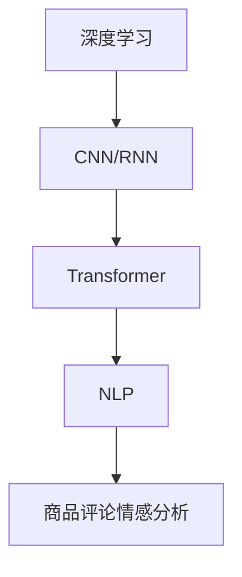

                 

# 深度学习驱动的商品评论情感分析

> 关键词：深度学习,商品评论,情感分析,文本分类,卷积神经网络(CNN),循环神经网络(RNN),Transformer,自然语言处理(NLP),机器学习,计算机视觉,图像处理

## 1. 背景介绍

在现代社会中，商品评论已成为了消费者了解产品、比较选择的重要信息来源。然而，庞大的评论数据带来了分析和利用的挑战，尤其是在海量数据中快速准确地提取商品情感成为了一个重要课题。情感分析（Sentiment Analysis）技术，通过算法对商品评论文本中的情感进行识别和分类，是电商、社交媒体、市场营销等领域的重要应用。

在深度学习技术迅猛发展的背景下，深度学习驱动的情感分析技术已成为当前研究的热点。本博文将深入探讨深度学习如何应用于商品评论情感分析中，并分析当前技术在实际应用中的优劣。

## 2. 核心概念与联系

### 2.1 核心概念概述

- **深度学习（Deep Learning）**：一种机器学习技术，通过构建多层次神经网络模型，自动学习和提取数据的复杂特征。深度学习在图像、语音、自然语言处理等领域有广泛应用。

- **商品评论（Product Reviews）**：电商平台上用户对商品的使用体验和评价，通常包含商品质量、价格、服务、舒适度等方面的信息，可以用于情感分析。

- **情感分析（Sentiment Analysis）**：识别和分类文本中的情感极性（如正面、中性、负面）的技术，广泛应用于社交媒体、电子商务、客户服务等领域。

- **卷积神经网络（Convolutional Neural Network, CNN）**：一种前馈神经网络，广泛应用于图像处理领域，通过卷积操作提取局部特征，适用于文本分类任务。

- **循环神经网络（Recurrent Neural Network, RNN）**：一种特殊的神经网络，能够处理序列数据，适用于文本生成、情感分析等任务。

- **Transformer**：一种基于注意力机制的神经网络结构，用于处理序列数据，相较于传统RNN，Transformer在处理长序列时表现更佳。

- **自然语言处理（Natural Language Processing, NLP）**：涉及计算机与人类语言交互的各个方面，包括文本分类、情感分析、机器翻译等。

- **机器学习（Machine Learning）**：使用算法和统计模型，让计算机通过数据自动学习和提高性能的技术。

这些概念之间存在紧密的联系。深度学习为商品评论情感分析提供了强大的模型和算法支持，卷积神经网络和循环神经网络是深度学习中常用的两种网络结构，在处理序列数据和提取局部特征方面有良好表现。Transformer则进一步提升了处理长序列数据的效率和效果。自然语言处理是情感分析技术的基础，机器学习为模型的训练和优化提供了工具。

### 2.2 核心概念原理和架构的 Mermaid 流程图



此图展示了深度学习在商品评论情感分析中的应用路径：深度学习模型通过CNN或RNN处理文本，再通过Transformer进行序列处理，最终实现情感分类。

## 3. 核心算法原理 & 具体操作步骤

### 3.1 算法原理概述

基于深度学习的商品评论情感分析流程主要包括数据预处理、模型训练、模型评估和预测等步骤。下面详细介绍各个步骤的算法原理。

- **数据预处理**：将原始评论文本转化为模型可接受的格式。包括文本清洗、分词、编码等步骤。

- **模型训练**：利用标注好的评论数据集，通过反向传播算法更新模型参数，优化损失函数。

- **模型评估**：在验证集上评估模型性能，如准确率、召回率、F1-score等。

- **预测**：利用训练好的模型对新评论进行情感分类。

### 3.2 算法步骤详解

#### 3.2.1 数据预处理

1. **文本清洗**：移除评论中的噪声，如特殊符号、非中文字符等。
2. **分词**：将评论分割成单词或词语，以便后续处理。
3. **编码**：将分词后的文本转化为模型可接受的数值形式。

#### 3.2.2 模型训练

1. **网络结构选择**：根据数据集特性选择CNN、RNN或Transformer等模型。
2. **损失函数定义**：如交叉熵损失、Hinge损失等。
3. **反向传播**：计算梯度并更新模型参数，最小化损失函数。
4. **优化器选择**：如SGD、Adam、Adagrad等。
5. **超参数调整**：如学习率、批大小、迭代次数等。

#### 3.2.3 模型评估

1. **划分训练集、验证集、测试集**。
2. **模型预测**：在验证集和测试集上进行预测。
3. **性能指标计算**：如准确率、召回率、F1-score等。
4. **模型选择**：选择表现最佳的模型进行后续预测。

#### 3.2.4 预测

1. **输入预处理**：将新评论转化为模型所需的格式。
2. **模型预测**：利用训练好的模型进行情感分类。
3. **结果输出**：输出情感类别，如正面、中性、负面等。

### 3.3 算法优缺点

#### 3.3.1 优点

- **高效准确**：深度学习模型能够自动学习数据中的复杂特征，适用于大规模数据集。
- **泛化能力强**：深度学习模型具有较好的泛化能力，能在不同商品评论数据上表现一致。
- **可扩展性强**：深度学习模型易于扩展和改进，适用于多种情感分析任务。

#### 3.3.2 缺点

- **计算量大**：深度学习模型需要大量的计算资源和训练时间。
- **数据依赖性强**：模型的性能高度依赖于训练数据的质量和数量。
- **参数可解释性差**：深度学习模型作为“黑盒”模型，难以解释其决策过程。

### 3.4 算法应用领域

基于深度学习的商品评论情感分析在电商、社交媒体、客户服务等诸多领域有广泛应用：

- **电商推荐系统**：利用商品评论的情感分析结果，推荐用户可能喜欢的商品。
- **客户满意度分析**：通过情感分析结果评估客户满意度，提高服务质量。
- **市场趋势分析**：分析商品评论的情感趋势，预测市场变化。
- **产品改进优化**：利用情感分析结果，改进产品设计和用户体验。
- **舆情监测**：实时监测社交媒体上的商品评论情感，预测舆情变化。

## 4. 数学模型和公式 & 详细讲解 & 举例说明

### 4.1 数学模型构建

假设评论文本为 $x$，情感类别为 $y$，模型为 $M$。情感分析的目标是最小化损失函数：

$$
\min_{M} \frac{1}{N}\sum_{i=1}^{N} \mathcal{L}(M(x_i), y_i)
$$

其中 $\mathcal{L}$ 为损失函数，如交叉熵损失、Hinge损失等。

### 4.2 公式推导过程

以CNN模型为例，假设输入评论文本的维度为 $L$，单词向量维度为 $d$，卷积核大小为 $k$，卷积核数量为 $h$。则CNN模型的输出为：

$$
H = \max_{1\leq i \leq L-k+1}(\sum_{j=1}^{h}w_j \ast \sum_{l=0}^{L-k}x_{i+l}\phi(w_j))
$$

其中 $\phi$ 为激活函数，如ReLU、Sigmoid等。

### 4.3 案例分析与讲解

假设有一个简单的情感分类问题，输入评论文本为“这款手机很一般”，标签为“负面”。使用CNN模型进行情感分析的过程如下：

1. 将评论文本转换为数值形式：[[0,0,0,0,0,0,0,0,0,0,1,1,1,1,0,0]]。
2. 通过卷积核进行特征提取：

$$
\begin{bmatrix}
0 & 0 & 0 & 0 & 0 & 0 & 0 & 0 & 0 & 0 & 1 & 1 & 1 & 1 & 0 & 0 \\
0 & 0 & 0 & 0 & 0 & 0 & 0 & 0 & 0 & 0 & 0 & 0 & 0 & 0 & 0 & 0 \\
0 & 0 & 0 & 0 & 0 & 0 & 0 & 0 & 0 & 0 & 1 & 1 & 1 & 1 & 0 & 0 \\
0 & 0 & 0 & 0 & 0 & 0 & 0 & 0 & 0 & 0 & 0 & 0 & 0 & 0 & 0 & 0 \\
\end{bmatrix}
\begin{bmatrix}
w_1 \\
w_2 \\
w_3 \\
w_4 \\
\end{bmatrix}
=
\begin{bmatrix}
1 \\
1 \\
1 \\
1 \\
\end{bmatrix}
$$

3. 通过池化层进行特征归一化：最大池化得到 $[1, 1, 1, 1]$。
4. 连接全连接层进行分类：通过softmax函数输出分类概率，如 $P(负面) = 0.8$。

## 5. 项目实践：代码实例和详细解释说明

### 5.1 开发环境搭建

1. 安装Python和相关库：
```
pip install numpy pandas sklearn tensorflow keras
```

2. 准备数据集：可以从公开数据集如Yelp、Amazon等下载商品评论数据，进行预处理。

### 5.2 源代码详细实现

以下是一个简单的CNN模型实现：

```python
from keras.models import Sequential
from keras.layers import Embedding, Conv1D, MaxPooling1D, Flatten, Dense
from keras.preprocessing.text import Tokenizer
from keras.preprocessing.sequence import pad_sequences

# 文本预处理
tokenizer = Tokenizer(num_words=5000)
tokenizer.fit_on_texts(texts)
sequences = tokenizer.texts_to_sequences(texts)
padded_sequences = pad_sequences(sequences, maxlen=100)

# 构建CNN模型
model = Sequential()
model.add(Embedding(5000, 64, input_length=100))
model.add(Conv1D(64, 5, activation='relu'))
model.add(MaxPooling1D(pool_size=4))
model.add(Flatten())
model.add(Dense(64, activation='relu'))
model.add(Dense(1, activation='sigmoid'))

# 编译模型
model.compile(loss='binary_crossentropy', optimizer='adam', metrics=['accuracy'])

# 训练模型
model.fit(padded_sequences, labels, epochs=10, batch_size=32, validation_split=0.2)
```

### 5.3 代码解读与分析

- **文本预处理**：使用Keras提供的Tokenize和pad_sequences函数对文本进行编码和补齐。
- **模型构建**：从嵌入层开始，通过卷积层、池化层和全连接层进行特征提取和分类。
- **模型编译**：设置损失函数、优化器和评估指标。
- **模型训练**：通过fit函数进行模型训练，设置训练轮数和批次大小。

### 5.4 运行结果展示

在训练完成后，可以使用以下代码进行情感预测：

```python
new_text = "这款手机很一般"
new_sequence = tokenizer.texts_to_sequences([new_text])
new_padded_sequence = pad_sequences(new_sequence, maxlen=100)
predicted_label = model.predict(new_padded_sequence)
```

预测结果将输出0或1，表示“负面”或“正面”。

## 6. 实际应用场景

### 6.1 电商推荐系统

电商推荐系统通过情感分析结果，可以精准推荐用户可能感兴趣的商品。例如，根据用户对某个商品的评论情感，推荐类似商品，提高用户购买意愿和满意度。

### 6.2 客户满意度分析

企业可以分析客户对商品和服务的评论情感，评估客户满意度，发现问题并进行改进。例如，如果大量负面评论集中在某方面，企业可重点关注并优化该方面。

### 6.3 市场趋势分析

分析大量商品评论的情感趋势，可以预测市场变化和消费者偏好。例如，通过情感分析发现某品牌手机近期评论情感转好，可能预示该品牌手机市场份额提升。

### 6.4 产品改进优化

企业利用情感分析结果，改进产品设计和用户体验。例如，如果评论情感集中指某一问题，企业可针对该问题进行改进，提高产品质量和用户满意度。

### 6.5 舆情监测

通过实时监控社交媒体上的商品评论情感，企业可以及时发现舆情变化，防范危机，维护品牌形象。例如，某品牌商品突然大量负面评论，企业可迅速采取措施，减少损失。

## 7. 工具和资源推荐

### 7.1 学习资源推荐

1. **《深度学习》（Ian Goodfellow等）**：介绍深度学习的基本概念和算法，是学习深度学习的重要教材。
2. **《自然语言处理综论》（Daniel Jurafsky和James H. Martin）**：涵盖NLP的各个方面，适合初学者学习。
3. **Kaggle竞赛**：参加Kaggle举办的情感分析竞赛，可以学习到实用的算法和数据处理技巧。
4. **深度学习框架官方文档**：如TensorFlow、Keras、PyTorch等，提供详细的教程和示例代码。

### 7.2 开发工具推荐

1. **Jupyter Notebook**：轻量级交互式编程环境，支持Python和各种库的交互式使用。
2. **TensorBoard**：用于可视化深度学习模型的训练过程，帮助开发者调试模型。
3. **Weights & Biases**：记录和可视化模型的训练参数和性能指标，方便调试和优化。
4. **Git**：版本控制工具，用于管理代码和数据。

### 7.3 相关论文推荐

1. **《A Survey on Deep Learning for Sentiment Analysis》（J.Bolukbasi等）**：系统综述了深度学习在情感分析中的应用和进展。
2. **《Convolutional Neural Networks for Sentence Classification》（K.Chen等）**：介绍CNN在情感分类中的应用。
3. **《Long Short-Term Memory》（H.Graves等）**：介绍RNN在文本分类中的应用。
4. **《Attention is All You Need》（A.Vaswani等）**：介绍Transformer在文本处理中的应用。

## 8. 总结：未来发展趋势与挑战

### 8.1 总结

本文介绍了深度学习在商品评论情感分析中的应用，从数据预处理、模型训练、模型评估到预测的完整流程。深度学习在商品评论情感分析中具有高效、准确、泛化能力强等优点，但在计算资源、数据依赖、模型可解释性等方面仍存在挑战。

### 8.2 未来发展趋势

未来，深度学习在商品评论情感分析中可能会有以下发展趋势：

1. **模型性能提升**：通过更深层次的网络结构和更复杂的模型结构，提高模型的准确率和泛化能力。
2. **多模态融合**：结合图像、声音等多模态信息，提升情感分析的全面性和准确性。
3. **实时性优化**：优化模型结构和算法，实现快速实时情感分析，满足更多场景需求。
4. **小样本学习**：开发少样本学习算法，降低对标注数据的依赖。
5. **模型压缩和优化**：通过模型压缩和量化技术，减少模型大小和计算资源消耗。

### 8.3 面临的挑战

尽管深度学习在商品评论情感分析中取得重要进展，但面临以下挑战：

1. **数据质量和标注成本**：高质量标注数据获取难度大，标注成本高。
2. **模型泛化能力**：模型在不同数据集上泛化能力不足，可能存在过拟合现象。
3. **计算资源消耗**：模型训练和推理资源消耗大，需要大规模计算平台支持。
4. **模型可解释性**：深度学习模型作为“黑盒”模型，难以解释其决策过程。
5. **多语言支持**：现有模型多为英文，支持中文等多语言的能力有待提升。

### 8.4 研究展望

未来，如何在商品评论情感分析中实现以下目标，值得深入探索：

1. **多语言支持**：开发支持多语言的商品评论情感分析模型，提升模型在不同语言下的性能。
2. **跨领域迁移学习**：利用预训练模型，提升模型在不同领域的迁移学习能力。
3. **自监督学习**：利用无标注数据进行自监督学习，降低标注成本。
4. **模型压缩和优化**：通过模型压缩和优化技术，减少模型资源消耗，提升实时性。
5. **小样本学习**：开发少样本学习算法，提升模型在小样本数据上的性能。

## 9. 附录：常见问题与解答

### Q1: 为什么深度学习在商品评论情感分析中表现良好？

A: 深度学习模型能够自动学习数据中的复杂特征，在处理大规模数据时表现优异。同时，深度学习模型通过多层次网络结构，能够更好地提取数据中的语义信息，适用于复杂的情感分析任务。

### Q2: 在商品评论情感分析中，CNN和RNN各自的优势是什么？

A: CNN适用于处理固定长度的文本序列，能够提取局部特征，适用于文本分类任务。RNN适用于处理变长的文本序列，能够捕捉序列中的时间依赖关系，适用于情感分析等任务。Transformer则融合了CNN和RNN的优势，适用于长序列文本的情感分析。

### Q3: 如何提高深度学习模型的泛化能力？

A: 可以通过以下方式提高模型的泛化能力：
1. 数据增强：通过数据增强技术，扩充训练集。
2. 正则化：使用L2正则、Dropout等技术，避免过拟合。
3. 模型集成：通过集成多个模型，提升泛化能力。
4. 多任务学习：将多个任务合并训练，提高模型的泛化能力。

### Q4: 如何处理多语言商品评论情感分析问题？

A: 可以采用以下方法处理多语言商品评论情感分析问题：
1. 使用多语言数据集进行训练。
2. 利用多语言预训练模型，如Bert、RoBERTa等，进行微调。
3. 结合语言翻译技术，将非目标语言文本转换为目标语言，再进行情感分析。

### Q5: 如何优化深度学习模型性能？

A: 可以通过以下方式优化深度学习模型性能：
1. 网络结构优化：调整网络深度、宽度等超参数，提升模型性能。
2. 损失函数优化：选择适合的损失函数，如交叉熵、Hinge等。
3. 正则化技术：使用L2正则、Dropout等技术，避免过拟合。
4. 数据增强：通过数据增强技术，扩充训练集。
5. 模型压缩：通过模型压缩技术，减少模型资源消耗。

---

作者：禅与计算机程序设计艺术 / Zen and the Art of Computer Programming

