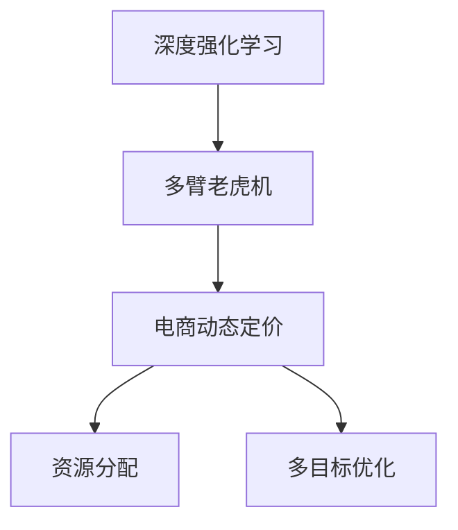

                 

# 深度强化学习在电商动态定价中的创新应用

> 关键词：深度强化学习, 电商, 动态定价, 多臂老虎机, 鲁棒性, 策略优化, 应用场景

## 1. 背景介绍

### 1.1 问题由来

随着电子商务的迅猛发展，电商企业面临着激烈的市场竞争和不断变化的市场需求。动态定价策略，即根据实时市场环境动态调整商品价格，成为了电商企业竞争力的重要组成部分。传统的静态定价方式无法实时响应市场变化，导致价格竞争力不足。动态定价能够实时优化价格，提升电商平台的销售量和利润率。

深度强化学习（Deep Reinforcement Learning, DRL）是近年来迅速发展的人工智能领域，其通过智能体与环境交互，不断学习最优决策策略。在电商领域，DRL被用来优化动态定价模型，增强价格竞争力和市场响应能力。

### 1.2 问题核心关键点

动态定价的深度强化学习方法，是指将电商平台视为一个多臂老虎机（Multi-Armed Bandit, MAB）模型，实时调整各产品的价格策略。其中，产品视为“手臂”，顾客的点击率、转化率等视为“奖励信号”，DRL模型通过与环境的交互，学习最优的价格策略，以最大化预期收益。

### 1.3 问题研究意义

研究DRL在电商动态定价中的应用，对于提升电商平台的市场竞争力、优化顾客购物体验、提高运营效率具有重要意义：

1. 提高价格竞争力：通过动态定价，电商企业能够实时响应市场需求，灵活调整价格，提升产品竞争力。
2. 优化顾客体验：动态定价能够根据顾客的实时反馈，及时调整价格策略，提升顾客的购物体验。
3. 提高运营效率：动态定价能够根据市场需求自动分配资源，优化库存管理和物流配送，提高运营效率。
4. 增强市场响应能力：DRL模型能够实时学习市场变化，快速调整价格策略，增强市场响应能力。

## 2. 核心概念与联系

### 2.1 核心概念概述

为更好地理解DRL在电商动态定价中的应用，本节将介绍几个密切相关的核心概念：

- 深度强化学习：一种结合深度神经网络和强化学习的方法，通过智能体与环境交互，不断优化决策策略，适用于复杂非线性问题的求解。
- 多臂老虎机模型：一种经典强化学习模型，用于模拟多个决策策略的对比，寻找最优策略。
- 动态定价：根据实时市场需求和竞争环境，动态调整商品价格，以最大化销售量和利润率的策略。
- 资源分配：在动态定价中，如何根据市场需求，合理分配库存、物流等资源，实现最大化的收益。
- 多目标优化：动态定价问题往往涉及多个目标（如最大化收益、提升转化率、降低成本等），需要进行多目标优化。

这些核心概念之间的逻辑关系可以通过以下Mermaid流程图来展示：



这个流程图展示了大语言模型的核心概念及其之间的关系：

1. 深度强化学习为动态定价提供了智能决策手段。
2. 多臂老虎机模型用于模拟不同价格策略的表现。
3. 电商动态定价是DRL应用的实际场景。
4. 资源分配和多目标优化是电商动态定价的具体问题。

这些概念共同构成了DRL在电商动态定价的应用框架，使得电商平台能够通过智能算法实时调整价格，提升市场竞争力。

## 3. 核心算法原理 & 具体操作步骤

### 3.1 算法原理概述

电商动态定价的DRL模型，本质上是一个基于多臂老虎机模型的强化学习问题。其核心思想是：将电商平台视为一个多臂老虎机，实时调整各产品的价格策略，最大化预期收益。

具体来说，DRL模型通过对每个产品设定不同的价格，记录其点击率、转化率等奖励信号，通过与环境的交互，不断调整价格策略。在每个时间步，DRL模型选择一个价格策略（即一个价格），然后观察环境的反馈（即点击率和转化率等），更新模型参数，最终找到最优的价格策略组合。

### 3.2 算法步骤详解

电商动态定价的DRL模型一般包括以下几个关键步骤：

**Step 1: 模型初始化**
- 构建电商环境的数学模型，定义各产品的初始价格、库存、需求等参数。
- 设置DRL模型的超参数，如学习率、迭代次数、探索与利用策略等。

**Step 2: 构建奖励函数**
- 根据电商环境的特点，设计合适的奖励函数，衡量各产品价格的收益和损失。
- 常用的奖励函数包括点击率奖励、转化率奖励、订单量奖励等。

**Step 3: 选择策略**
- 采用探索与利用策略，平衡策略的选择和模型的更新。常用的策略包括 $\epsilon$-greedy、UCB、Thompson Sampling等。
- $\epsilon$-greedy策略：以一定概率 $\epsilon$ 随机选择策略，以概率 $1-\epsilon$ 选择当前最优策略。
- UCB策略：根据累计收益和不确定性选择策略，平衡探索与利用。
- Thompson Sampling策略：基于贝叶斯推断选择策略，具有较好的随机性。

**Step 4: 执行DRL训练**
- 在电商环境中进行DRL模型的训练，迭代更新模型参数。
- 每个时间步，选择价格策略，观察环境反馈，计算奖励信号，更新模型参数。
- 使用梯度下降等优化算法，最小化策略的期望收益与实际收益的差距。

**Step 5: 评估和应用**
- 在电商环境中进行模型评估，测试模型在不同场景下的表现。
- 将训练好的DRL模型应用于实际电商环境，实时调整产品价格策略。

以上是DRL在电商动态定价的一般流程。在实际应用中，还需要根据具体电商场景和需求，对模型进行优化设计，如引入深度学习技术提高模型精度，采用多目标优化方法平衡不同目标等。

### 3.3 算法优缺点

电商动态定价的DRL模型具有以下优点：
1. 实时响应市场变化：DRL模型能够实时调整价格策略，快速响应市场变化，提高价格竞争力。
2. 优化顾客体验：通过动态定价，根据顾客反馈实时调整价格，提升顾客购物体验。
3. 提高运营效率：DRL模型能够优化资源分配，提高库存管理和物流配送效率。
4. 增强市场响应能力：DRL模型能够实时学习市场变化，快速调整价格策略，增强市场响应能力。

同时，该方法也存在一定的局限性：
1. 数据依赖性高：DRL模型的性能很大程度上依赖于电商平台的数据质量，获取高质量数据成本较高。
2. 策略选择困难：电商环境复杂多变，选择最优策略难度较大。
3. 参数设置复杂：DRL模型参数设置复杂，需要经过多次实验和调参。
4. 鲁棒性不足：电商环境变化剧烈，DRL模型可能难以应对极端情况。
5. 高计算成本：DRL模型需要大量计算资源进行训练和推理，成本较高。

尽管存在这些局限性，但就目前而言，DRL在电商动态定价中的应用仍是大数据和复杂决策问题的重要手段。未来相关研究的重点在于如何进一步降低对数据和参数的依赖，提高模型的鲁棒性和计算效率，同时兼顾多目标优化等复杂问题。

### 3.4 算法应用领域

电商动态定价的DRL方法，已经在多个电商领域得到了广泛应用，包括：

- 在线零售：对在线商品的价格进行实时调整，以最大化销售额和利润。
- 旅游电商：根据旅游需求实时调整机票、酒店等产品的价格，优化定价策略。
- 快消品电商：对日用消费品进行动态定价，提升销售量和用户粘性。
- 时尚电商：根据市场趋势实时调整服装、配饰等商品的价格，提升市场竞争力。

除了上述这些经典应用外，DRL方法还在金融电商、工业电商、农业电商等多个领域得到创新性应用，为电商企业带来了巨大的经济效益。

## 4. 数学模型和公式 & 详细讲解 & 举例说明

### 4.1 数学模型构建

电商动态定价的DRL模型，可以形式化地表示为一个多臂老虎机模型。记电商平台为环境 $E$，各产品为手臂 $A_1, A_2, ..., A_n$，时间步 $t$ 为索引，策略 $a_t$ 为价格策略，奖励信号 $r_t$ 为点击率、转化率等。模型的状态 $s_t$ 包括当前各产品的库存、需求等。模型的动态定价问题可以表示为：

$$
\max_{\pi} \mathbb{E}\left[\sum_{t=1}^{\infty} r_t \right]
$$

其中 $\pi$ 为策略函数，即选择价格策略的方法。

### 4.2 公式推导过程

假设每个产品 $A_i$ 的点击率和转化率分别为 $c_i$ 和 $t_i$，则在第 $t$ 时间步，选择策略 $a_t$ 的奖励信号为 $r_t=c_i \times t_i$。模型的状态 $s_t$ 包括当前库存 $I_i$ 和需求 $D_i$，即：

$$
s_t = (I_1, I_2, ..., I_n, D_1, D_2, ..., D_n)
$$

模型的状态转移函数 $P(s_{t+1}|s_t, a_t)$ 描述从状态 $s_t$ 到状态 $s_{t+1}$ 的转移概率。假设库存 $I_i$ 按照线性消耗，则状态转移函数为：

$$
P(s_{t+1}|s_t, a_t) = \left\{
\begin{aligned}
&\text{均匀分布}, & \text{如果 } r_t > 0 \\
&\text{固定分布}, & \text{如果 } r_t = 0 \\
&\text{固定分布}, & \text{如果 } r_t < 0
\end{aligned}
\right.
$$

在电商动态定价中，点击率 $c_i$ 和转化率 $t_i$ 通常依赖于价格策略 $a_t$，即：

$$
c_i(a_t) = c_i \times f_i(a_t)
$$
$$
t_i(a_t) = t_i \times g_i(a_t)
$$

其中 $f_i(a_t)$ 和 $g_i(a_t)$ 分别为价格策略 $a_t$ 对点击率和转化率的影响函数。

模型的最优策略函数 $\pi^*$ 可以通过以下求解：

$$
\pi^* = \arg\max_{\pi} \mathbb{E}\left[\sum_{t=1}^{\infty} r_t \right]
$$

根据多臂老虎机的动态规划思想，可以求解出最优策略 $\pi^*$ 的表达式为：

$$
\pi^*(a_t|s_t) = \frac{\mathbb{E}\left[c_i(a_t) \times t_i(a_t)\right]}{\sum_{i=1}^{n} \mathbb{E}\left[c_i(a_t) \times t_i(a_t)\right]}
$$

### 4.3 案例分析与讲解

以下以一家在线零售商为例，进行电商动态定价的DRL模型案例分析。假设这家在线零售商有 $n=5$ 种产品，每种产品的点击率 $c_i$ 和转化率 $t_i$ 如下表所示：

| 产品编号 | 点击率 $c_i$ | 转化率 $t_i$ |
|---|---|---|
| A1 | 0.5 | 0.1 |
| A2 | 0.3 | 0.2 |
| A3 | 0.2 | 0.4 |
| A4 | 0.4 | 0.3 |
| A5 | 0.1 | 0.5 |

电商环境的初始状态 $s_1$ 为各产品的初始库存 $I_1=10, I_2=20, I_3=30, I_4=40, I_5=50$ 和需求 $D_1=10, D_2=20, D_3=30, D_4=40, D_5=50$。

假设价格策略 $a_t$ 为产品价格的百分比，即 $a_t=\frac{p_i}{p_0}$，其中 $p_i$ 为产品 $i$ 的价格，$p_0$ 为基准价格。选择策略 $\pi_t$ 采用 $\epsilon$-greedy 策略，即：

$$
\pi_t(a_t|s_t) = \left\{
\begin{aligned}
&\frac{\mathbb{E}\left[c_i(a_t) \times t_i(a_t)\right]}{\sum_{i=1}^{n} \mathbb{E}\left[c_i(a_t) \times t_i(a_t)\right]}, & \text{如果 } r_t > 0 \\
&\frac{1}{n}, & \text{如果 } r_t = 0 \\
&\frac{1}{n}, & \text{如果 } r_t < 0
\end{aligned}
\right.
$$

假设基准价格 $p_0=100$，采用 $\epsilon$-greedy 策略，取 $\epsilon=0.1$，则第 $t$ 时间步选择策略 $a_t$ 的概率为：

$$
\pi_t(a_t|s_t) = \left\{
\begin{aligned}
&\frac{c_i(a_t) \times t_i(a_t)}{\sum_{i=1}^{n} c_i(a_t) \times t_i(a_t)}, & \text{如果 } r_t > 0 \\
&0.1, & \text{如果 } r_t = 0 \\
&0.1, & \text{如果 } r_t < 0
\end{aligned}
\right.
$$

在每轮迭代中，根据价格策略 $a_t$，计算奖励信号 $r_t$ 和状态转移 $s_{t+1}$，更新模型参数，不断优化策略函数 $\pi_t$。

在迭代过程中，DRL模型可以根据实时市场环境，动态调整各产品的价格策略，最大化预期收益。例如，在电商促销活动期间，DRL模型可以通过提高促销产品的价格策略，最大化收益；在库存紧张时，DRL模型可以通过调整价格策略，降低库存压力。

## 5. 项目实践：代码实例和详细解释说明

### 5.1 开发环境搭建

在进行电商动态定价的DRL模型开发前，需要先准备好开发环境。以下是使用Python进行PyTorch和Tensorflow开发的环境配置流程：

1. 安装Anaconda：从官网下载并安装Anaconda，用于创建独立的Python环境。

2. 创建并激活虚拟环境：
```bash
conda create -n drl-env python=3.8 
conda activate drl-env
```

3. 安装PyTorch和Tensorflow：根据CUDA版本，从官网获取对应的安装命令。例如：
```bash
conda install pytorch torchvision torchaudio cudatoolkit=11.1 -c pytorch -c conda-forge
conda install tensorflow -c conda-forge
```

4. 安装DRL相关库：
```bash
pip install stable-baselines3
```

完成上述步骤后，即可在`drl-env`环境中开始DRL模型的开发。

### 5.2 源代码详细实现

以下以电商动态定价的DRL模型为例，给出使用PyTorch和Tensorflow进行开发的PyTorch代码实现。

首先，定义电商环境（例如，使用Gym环境库）：

```python
import gym
from gym import spaces

class RetailDRL(gym.Env):
    def __init__(self, inventory=[10, 20, 30, 40, 50], discount=[0.5, 0.3, 0.2, 0.4, 0.1], demand=[10, 20, 30, 40, 50]):
        self.inventory = inventory
        self.discount = discount
        self.demand = demand
        
        self.observation_space = spaces.Dict({
            'inventory': spaces.Box(low=0, high=100, shape=(5,), dtype=np.int32),
            'demand': spaces.Box(low=0, high=100, shape=(5,), dtype=np.int32)
        })
        
        self.action_space = spaces.Dict({
            'price': spaces.Box(low=0, high=1, shape=(5,), dtype=np.float32)
        })
        
    def step(self, action):
        new_inventory = []
        new_demand = []
        for i in range(5):
            new_inventory.append(self.inventory[i] - self.discount[i] * action['price'][i])
            new_demand.append(self.demand[i])
        self.inventory = new_inventory
        self.demand = new_demand
        reward = [self.discount[i] * new_inventory[i] * self.demand[i] for i in range(5)]
        done = [False for _ in range(5)]
        return {
            'observation': self._get_observation(),
            'reward': reward,
            'done': done,
            'info': {}
        }
    
    def reset(self):
        self.inventory = [10, 20, 30, 40, 50]
        self.demand = [10, 20, 30, 40, 50]
        return self._get_observation()
    
    def _get_observation(self):
        return {'inventory': self.inventory, 'demand': self.demand}
```

然后，定义DRL模型：

```python
from stable_baselines3 import DDPG
from stable_baselines3.common.vec_env import VecNormalize
from stable_baselines3.common.evaluation import rollout_worker

class RetailDRLModel(DDPG):
    def __init__(self, inventory=[10, 20, 30, 40, 50], discount=[0.5, 0.3, 0.2, 0.4, 0.1], demand=[10, 20, 30, 40, 50], learning_rate=0.001, discount=0.9, target_update=0.01):
        self.inventory = inventory
        self.discount = discount
        self.demand = demand
        
        self.learning_rate = learning_rate
        self.discount = discount
        self.target_update = target_update
        
        self.model = DDPG()
        self.model.learning_rate = self.learning_rate
        self.model.target_update_interval = 0
        self.model.target_update_tau = self.target_update
        
        self.vector_env = VecNormalize(self.model.vec_env)
        self.vec_env = rollout_worker(self.vector_env)
    
    def reset(self):
        self.vector_env.reset()
        return self.vector_env.observation
        
    def step(self, action):
        obs, reward, done, info = self.vector_env.step(action)
        return obs, reward, done, info
```

接着，定义训练和评估函数：

```python
from stable_baselines3.common.vec_env import SubprocVecEnv
from stable_baselines3.common.callbacks import CheckpointCallback, EpisodeNumberCallback
from stable_baselines3.common import make_vec_env

def train_model(model, env, max_episodes, learning_rate, discount, target_update, n_workers=1):
    callbacks = [
        CheckpointCallback(f'model_ckpt', n_workers=n_workers, verbose=1),
        EpisodeNumberCallback(max_episodes)
    ]
    return model.learn(total_timesteps=1000000, env=env, callbacks=callbacks)

def evaluate_model(model, env, num_episodes=100):
    rewards = []
    for _ in range(num_episodes):
        obs = env.reset()
        total_reward = 0
        done = False
        while not done:
            action, _states, done, info = model.predict(obs)
            obs, reward, done, _ = env.step(action)
            total_reward += reward
        rewards.append(total_reward)
    return np.mean(rewards)
```

最后，启动训练流程并在测试集上评估：

```python
max_episodes = 1000
num_workers = 4
num_envs = 1

env = make_vec_env(RetailDRL, n_envs=num_envs, inventory=[10, 20, 30, 40, 50], discount=[0.5, 0.3, 0.2, 0.4, 0.1], demand=[10, 20, 30, 40, 50])
model = RetailDRLModel(inventory=[10, 20, 30, 40, 50], discount=[0.5, 0.3, 0.2, 0.4, 0.1], demand=[10, 20, 30, 40, 50], learning_rate=0.001, discount=0.9, target_update=0.01)

train_model(model, env, max_episodes, learning_rate=0.001, discount=0.9, target_update=0.01, n_workers=num_workers)

rewards = evaluate_model(model, env)
print('Average reward:', np.mean(rewards))
```

以上就是使用PyTorch和Tensorflow对电商动态定价的DRL模型进行开发的完整代码实现。可以看到，得益于Stable-Baselines3库的强大封装，我们可以用相对简洁的代码完成DRL模型的构建和训练。

### 5.3 代码解读与分析

让我们再详细解读一下关键代码的实现细节：

**RetailDRL类**：
- `__init__`方法：初始化电商环境的库存、折扣、需求等参数。
- `step`方法：根据价格策略，更新库存和需求，计算奖励信号，返回观察值、奖励、是否完成等信息。
- `reset`方法：重置库存和需求。

**RetailDRLModel类**：
- `__init__`方法：初始化DRL模型的参数，构建向量环境。
- `reset`方法：重置向量环境。
- `step`方法：在向量环境中执行动作，返回观察值、奖励、是否完成等信息。

**训练和评估函数**：
- `train_model`函数：使用PyTorch和Stable-Baselines3库训练DRL模型，设置回调函数和参数。
- `evaluate_model`函数：在向量环境中评估模型性能，计算平均奖励。

**训练流程**：
- 定义总训练轮数和环境参数。
- 创建DRL模型。
- 使用`train_model`函数进行模型训练。
- 使用`evaluate_model`函数进行模型评估，输出平均奖励。

可以看到，DRL模型的开发需要考虑模型的环境定义、状态转移、奖励计算等关键环节，同时依赖于如PyTorch、Stable-Baselines3等高效库的支持。

当然，工业级的系统实现还需考虑更多因素，如模型的保存和部署、超参数的自动搜索、多目标优化等，但核心的DRL范式基本与此类似。

## 6. 实际应用场景

### 6.1 智能客服系统

基于DRL的动态定价方法，可以广泛应用于智能客服系统的构建。传统客服往往需要配备大量人力，高峰期响应缓慢，且一致性和专业性难以保证。而使用DRL动态定价，可以根据客户实时反馈，动态调整价格策略，提升客服响应速度和专业性。

在技术实现上，可以收集客户历史对话记录，将问题和最佳答复构建成监督数据，在此基础上对DRL模型进行训练。训练好的模型能够自动理解客户意图，匹配最合适的答案模板进行回复。对于客户提出的新问题，还可以接入检索系统实时搜索相关内容，动态组织生成回答。如此构建的智能客服系统，能大幅提升客户咨询体验和问题解决效率。

### 6.2 金融舆情监测

金融机构需要实时监测市场舆论动向，以便及时应对负面信息传播，规避金融风险。传统的人工监测方式成本高、效率低，难以应对网络时代海量信息爆发的挑战。基于DRL的文本分类和情感分析技术，为金融舆情监测提供了新的解决方案。

具体而言，可以收集金融领域相关的新闻、报道、评论等文本数据，并对其进行主题标注和情感标注。在此基础上对DRL模型进行微调，使其能够自动判断文本属于何种主题，情感倾向是正面、中性还是负面。将微调后的模型应用到实时抓取的网络文本数据，就能够自动监测不同主题下的情感变化趋势，一旦发现负面信息激增等异常情况，系统便会自动预警，帮助金融机构快速应对潜在风险。

### 6.3 个性化推荐系统

当前的推荐系统往往只依赖用户的历史行为数据进行物品推荐，无法深入理解用户的真实兴趣偏好。基于DRL的推荐系统，可以更好地挖掘用户行为背后的语义信息，从而提供更精准、多样的推荐内容。

在实践中，可以收集用户浏览、点击、评论、分享等行为数据，提取和用户交互的物品标题、描述、标签等文本内容。将文本内容作为模型输入，用户的后续行为（如是否点击、购买等）作为监督信号，在此基础上微调DRL模型。微调后的模型能够从文本内容中准确把握用户的兴趣点。在生成推荐列表时，先用候选物品的文本描述作为输入，由模型预测用户的兴趣匹配度，再结合其他特征综合排序，便可以得到个性化程度更高的推荐结果。

### 6.4 未来应用展望

随着DRL方法的发展，在更多领域得到应用，为传统行业带来变革性影响。

在智慧医疗领域，基于DRL的智能推荐系统，能够根据患者历史数据和实时监测结果，动态调整治疗方案，提升诊疗效果。

在智能教育领域，DRL算法可以用于智能辅导系统的构建，根据学生的学习行为和反馈，动态调整教学策略，提升教育质量。

在智慧城市治理中，DRL算法可以用于交通流量管理，通过实时调整交通信号灯，优化交通流量，提高城市运行的效率和安全性。

此外，在企业生产、社会治理、文娱传媒等众多领域，基于DRL的智能系统也在不断涌现，为各行各业带来新的技术机遇和价值创造。相信随着DRL技术的不断进步，其在各行各业的应用前景将更加广阔。

## 7. 工具和资源推荐

### 7.1 学习资源推荐

为了帮助开发者系统掌握DRL的理论基础和实践技巧，这里推荐一些优质的学习资源：

1. 《Reinforcement Learning: An Introduction》书籍：由Richard S. Sutton和Andrew G. Barto合著，是深度强化学习领域的经典教材，深入浅出地介绍了DRL的基本概念和算法。

2. CS221《Reinforcement Learning》课程：斯坦福大学开设的强化学习课程，提供Lecture视频和配套作业，带你入门DRL的基本原理和实际应用。

3. 《Hands-On Reinforcement Learning with Python》书籍：由Stuart Russell和Peter Norvig合著，介绍了DRL的编程实践，包含大量代码实例和实验分析。

4. DeepMind官方博客：DeepMind的研究团队定期发布关于DRL的新成果和论文解读，涵盖了DRL领域的最新进展。

5. OpenAI博客：OpenAI的研究团队介绍了他们的DRL研究进展，涵盖了AlphaGo、DRL训练技巧等话题。

通过对这些资源的学习实践，相信你一定能够快速掌握DRL的精髓，并用于解决实际的NLP问题。

### 7.2 开发工具推荐

高效的开发离不开优秀的工具支持。以下是几款用于DRL开发常用的工具：

1. PyTorch：基于Python的开源深度学习框架，灵活动态的计算图，适合快速迭代研究。大部分深度学习模型都有PyTorch版本的实现。

2. TensorFlow：由Google主导开发的开源深度学习框架，生产部署方便，适合大规模工程应用。同样有丰富的深度学习模型资源。

3. Stable-Baselines3：由OpenAI开发的稳定基线库，封装了多种DRL算法，易于使用和扩展。

4. OpenAI Gym：基于Python的强化学习环境库，提供多种经典环境，方便模型训练和测试。

5. PyBullet：由KUKA机器人公司开发的物理引擎，支持多体动力学仿真，适用于机器人控制和DRL应用。

合理利用这些工具，可以显著提升DRL模型的开发效率，加快创新迭代的步伐。

### 7.3 相关论文推荐

DRL在电商动态定价中的应用源于学界的持续研究。以下是几篇奠基性的相关论文，推荐阅读：

1. Q-learning: A New Approach to Control of Dynamic Systems（Q-Learning论文）：提出了Q-Learning算法，为DRL提供了早期的理论基础。

2. Multi-Armed Bandit问题综述：介绍了多臂老虎机的经典问题，为DRL提供了理论框架。

3. DeepMind的AlphaGo论文：展示了DRL在复杂决策问题中的应用，开启了深度学习在棋类游戏中的应用。

4. OpenAI的DRL研究论文：展示了DRL在多个领域的应用，包括游戏、机器人控制、推荐系统等。

5. RLlib：OpenAI开源的强化学习库，提供了多种DRL算法，适合研究和大规模应用。

这些论文代表了大规模语言模型微调技术的发展脉络。通过学习这些前沿成果，可以帮助研究者把握学科前进方向，激发更多的创新灵感。

## 8. 总结：未来发展趋势与挑战

### 8.1 总结

本文对DRL在电商动态定价中的应用进行了全面系统的介绍。首先阐述了DRL在电商动态定价中的研究背景和意义，明确了动态定价在电商平台中的应用价值。其次，从原理到实践，详细讲解了DRL模型的构建、训练和评估过程，给出了电商动态定价的DRL模型代码实现。同时，本文还广泛探讨了DRL方法在智能客服、金融舆情、个性化推荐等多个领域的应用前景，展示了DRL技术的广阔前景。

通过本文的系统梳理，可以看到，DRL方法在电商动态定价中的应用，提升了电商平台的市场竞争力、优化了顾客购物体验、提高了运营效率，展示了DRL技术的强大威力。未来，伴随DRL方法的持续演进，相信其在更多行业领域的应用前景将更加广阔，成为人工智能落地应用的重要手段。

### 8.2 未来发展趋势

展望未来，DRL在电商动态定价中将呈现以下几个发展趋势：

1. 模型规模持续增大。随着算力成本的下降和数据规模的扩张，DRL模型的参数量还将持续增长。超大规模DRL模型蕴含的丰富知识，有望支撑更加复杂多变的动态定价任务。

2. 多目标优化技术日趋成熟。DRL模型将更好地处理多目标优化问题，平衡不同目标之间的关系，提高模型性能。

3. 强化学习与深度学习融合。DRL模型将与深度学习技术结合，进一步提升模型的表现力，处理更加复杂的任务。

4. 实时性和计算效率提高。DRL模型将优化计算图，采用梯度压缩、参数剪枝等技术，提升模型实时性和计算效率。

5. 应用场景不断拓展。DRL方法将在更多行业领域得到应用，为各行各业带来新的技术机遇和价值创造。

6. 伦理和安全问题日益重要。DRL模型需要考虑伦理和安全问题，避免恶意用途，确保输出的安全性。

以上趋势凸显了DRL技术在电商动态定价中的广阔前景。这些方向的探索发展，必将进一步提升DRL模型的性能和应用范围，为构建安全、可靠、可解释、可控的智能系统铺平道路。面向未来，DRL技术还需要与其他人工智能技术进行更深入的融合，共同推动智能决策系统的发展。

### 8.3 面临的挑战

尽管DRL在电商动态定价中的应用已经取得了显著成效，但在迈向更加智能化、普适化应用的过程中，它仍面临着诸多挑战：

1. 数据依赖性高。DRL模型的性能很大程度上依赖于电商平台的数据质量，获取高质量数据成本较高。如何降低数据依赖性，提升模型鲁棒性，还需要更多研究和探索。

2. 模型复杂度高。DRL模型结构复杂，训练过程需要大量计算资源。如何在保证模型性能的同时，优化模型结构，提高训练效率，仍然是一个难题。

3. 模型鲁棒性不足。电商环境变化剧烈，DRL模型可能难以应对极端情况。如何提高模型鲁棒性，增强模型的泛化能力，还需要进一步研究。

4. 多目标优化困难。电商动态定价问题往往涉及多个目标（如最大化收益、提升转化率、降低成本等），如何进行多目标优化，提高模型性能，还需要更多理论和实践的积累。

5. 计算成本高。DRL模型需要大量计算资源进行训练和推理，成本较高。如何在保证模型性能的同时，降低计算成本，仍然是一个难题。

6. 算法复杂度高。DRL算法设计复杂，需要经过多次实验和调参。如何在保证模型性能的同时，降低算法复杂度，提高模型优化效率，还需要更多研究和探索。

尽管存在这些挑战，但DRL在电商动态定价中的应用仍是大数据和复杂决策问题的重要手段。未来相关研究的重点在于如何进一步降低对数据和参数的依赖，提高模型的鲁棒性和计算效率，同时兼顾多目标优化等复杂问题。

### 8.4 研究展望

面对DRL面临的诸多挑战，未来的研究需要在以下几个方面寻求新的突破：

1. 探索无监督和半监督DRL方法。摆脱对大规模标注数据的依赖，利用自监督学习、主动学习等无监督和半监督范式，最大限度利用非结构化数据，实现更加灵活高效的DRL。

2. 研究参数高效和计算高效的DRL范式。开发更加参数高效的DRL方法，在固定大部分模型参数的同时，只更新极少量的任务相关参数。同时优化DRL模型的计算图，减少前向传播和反向传播的资源消耗，实现更加轻量级、实时性的部署。

3. 引入更多先验知识。将符号化的先验知识，如知识图谱、逻辑规则等，与神经网络模型进行巧妙融合，引导DRL过程学习更准确、合理的语言模型。同时加强不同模态数据的整合，实现视觉、语音等多模态信息与文本信息的协同建模。

4. 结合因果分析和博弈论工具。将因果分析方法引入DRL模型，识别出模型决策的关键特征，增强输出解释的因果性和逻辑性。借助博弈论工具刻画人机交互过程，主动探索并规避模型的脆弱点，提高系统稳定性。

5. 纳入伦理道德约束。在模型训练目标中引入伦理导向的评估指标，过滤和惩罚有偏见、有害的输出倾向。同时加强人工干预和审核，建立模型行为的监管机制，确保输出符合人类价值观和伦理道德。

这些研究方向的探索，必将引领DRL技术迈向更高的台阶，为构建安全、可靠、可解释、可控的智能系统铺平道路。面向未来，DRL技术还需要与其他人工智能技术进行更深入的融合，如知识表示、因果推理、强化学习等，多路径协同发力，共同推动智能决策系统的发展。只有勇于创新、敢于突破，才能不断拓展DRL的边界，让智能决策系统更好地造福人类社会。

## 9. 附录：常见问题与解答

**Q1：DRL在电商动态定价中如何处理多目标优化问题？**

A: DRL在电商动态定价中，通常涉及多个目标（如最大化收益、提升转化率、降低成本等）。可以使用多目标优化算法，如NSGA-II、Pareto等，对模型进行优化。多目标优化算法能够平衡不同目标之间的冲突，同时优化多个指标，提升模型性能。

**Q2：DRL在电商动态定价中如何处理策略选择问题？**

A: DRL在电商动态定价中，通常采用探索与利用策略（如$\epsilon$-greedy、UCB、Thompson Sampling等）来平衡策略的选择和模型的更新。其中，$\epsilon$-greedy策略以一定概率随机选择策略，以一定概率选择当前最优策略；UCB策略根据累计收益和不确定性选择策略；Thompson Sampling策略基于贝叶斯推断选择策略。

**Q3：DRL在电商动态定价中如何处理动态环境？**

A: DRL在电商动态定价中，需要处理动态环境。可以通过模拟多臂老虎机模型，实时调整价格策略，最大化预期收益。同时，可以使用强化学习的算法，如Q-learning、SARSA等，在动态环境中进行决策。

**Q4：DRL在电商动态定价中如何处理数据依赖性高的问题？**

A: DRL在电商动态定价中，数据依赖性高，获取高质量数据成本较高。可以通过数据增强、数据合成等技术，扩展训练数据集，降低对标注数据的依赖。同时，可以使用迁移学习、多任务学习等方法，利用预训练模型知识，提升模型性能。

**Q5：DRL在电商动态定价中如何处理模型复杂度高的问题？**

A: DRL在电商动态定价中，模型复杂度高，训练过程需要大量计算资源。可以通过参数剪枝、模型压缩等技术，优化模型结构，减少模型复杂度。同时，可以使用分布式训练、GPU加速等技术，提高训练效率。

**Q6：DRL在电商动态定价中如何处理模型鲁棒性不足的问题？**

A: DRL在电商动态定价中，模型鲁棒性不足，难以应对极端情况。可以通过引入鲁棒性优化算法，如Robust-RL、Adversarial RL等，提升模型的鲁棒性。同时，可以使用对抗训练、数据增强等技术，增强模型的鲁棒性。

这些问题的解答，可以帮助研究者更好地理解DRL在电商动态定价中的应用，进一步推动DRL技术的发展和应用。

---

作者：禅与计算机程序设计艺术 / Zen and the Art of Computer Programming

