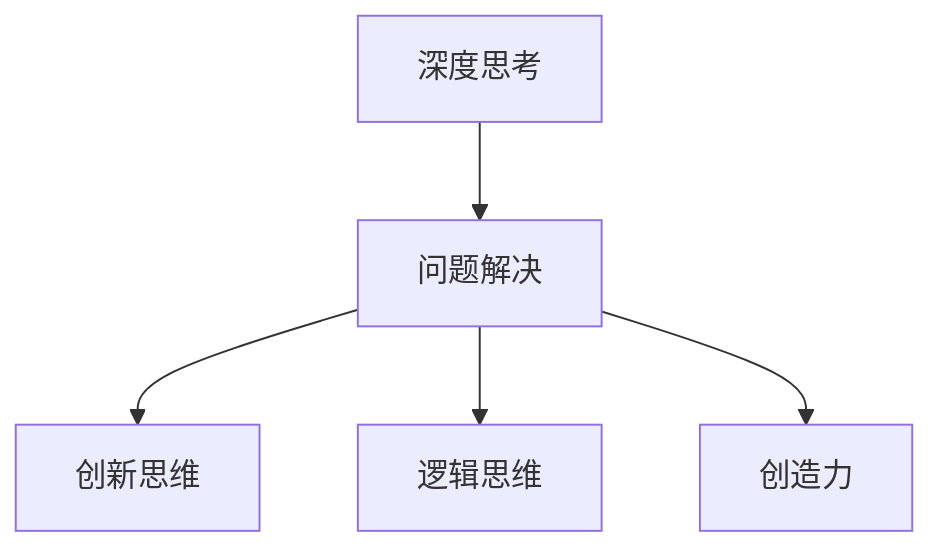

                 

# 深度思考:问题解决的利器

> 关键词：深度思考,问题解决,思维模式,认知心理学,人工智能,创新思维,逻辑思维,创造力

## 1. 背景介绍

### 1.1 问题由来
在当今快速变化和高度竞争的社会中，问题解决能力已成为个人和组织取得成功的关键因素。随着技术的发展，尤其是人工智能(AI)和机器学习(ML)的兴起，对深度思考能力的需求变得愈发迫切。问题解决不再只是简单的执行任务，而是一种结合技术、认知和创造力的复杂活动。因此，深入理解问题解决的科学原理，掌握高效的问题解决策略，对于任何希望在科技领域取得突破的人来说都至关重要。

### 1.2 问题核心关键点
问题解决的核心在于理解问题的本质、制定合理的解决方案、并有效地执行这些方案。这涉及到从认知心理学到计算机科学的多个领域，需要我们从理论到实践，全面掌握问题解决的科学方法和工具。

### 1.3 问题研究意义
深入研究问题解决的科学原理，对于提升个人的创新能力和团队的整体效能，具有重要意义。无论是研发新产品、优化业务流程、还是解决社会问题，掌握问题解决的方法和工具，能够帮助我们更加高效、系统地应对复杂挑战，推动社会进步和经济发展。

## 2. 核心概念与联系

### 2.1 核心概念概述

为更好地理解问题解决的过程，本节将介绍几个核心概念：

- **深度思考**：一种超越表面的、基于多层次思维的思考方式。深度思考能够帮助我们深入理解问题的本质，找到更全面、更深入的解决方案。
- **问题解决**：指通过一系列思考和行动，从问题起始状态到达目标状态的过程。问题解决包含问题识别、分析、生成、评估和实施解决方案等步骤。
- **创新思维**：一种能够打破常规、提出新想法的思维方式。创新思维是深度思考中非常重要的一环，能够推动技术的革新和进步。
- **逻辑思维**：一种基于逻辑推理和证据评估的思维方式。逻辑思维在问题解决中扮演着重要角色，帮助我们在复杂情境下做出合理判断和决策。
- **创造力**：一种能够产生新颖、有价值的成果的思维能力。创造力是深度思考的重要组成部分，能够帮助我们在问题解决中产生新的见解和方法。

这些核心概念之间的逻辑关系可以通过以下Mermaid流程图来展示：



这个流程图展示了几大核心概念之间的关系：

1. 深度思考是问题解决的基础，能够帮助我们从多个角度理解和分析问题。
2. 创新思维和逻辑思维是深度思考的两个重要组成部分，分别关注于提出新思路和进行逻辑推理。
3. 创造力是深度思考的高级形式，能够产生新颖的解决方案。

## 3. 核心算法原理 & 具体操作步骤
### 3.1 算法原理概述

问题解决的算法原理，主要是围绕深度思考、创新思维、逻辑思维和创造力的运用展开。下面将详细讲解这些核心思维方式在问题解决中的应用。

### 3.2 算法步骤详解

**步骤1: 问题定义与识别**
问题解决的首要步骤是准确地定义和识别问题。这包括对问题的范围、目标、限制和相关因素进行明确。例如，针对“如何提高产品的市场占有率？”这一问题，首先需要明确目标（市场占有率提升）、影响因素（市场竞争、用户需求、价格策略等），以及可行的解决方案范围（价格调整、市场推广、产品改进等）。

**步骤2: 信息收集与分析**
在明确问题后，需要收集相关信息，并对信息进行分析。这一步骤包括文献回顾、数据收集、专家咨询等方法。例如，在提升产品市场占有率的问题中，可以通过市场调研收集用户反馈、竞争对手情况，以及产品优劣势分析等。

**步骤3: 生成解决方案**
根据问题定义和信息分析，可以生成多个可能的解决方案。这一步骤需要运用创新思维和逻辑思维，结合实际情况和资源限制，提出多种可行的解决方案。例如，提升市场占有率的解决方案可能包括价格折扣、广告投放、产品改进等。

**步骤4: 方案评估与选择**
对提出的解决方案进行评估，选择最优方案。这一步骤需要运用逻辑思维，对各种解决方案的利弊进行比较分析，选择最符合目标、资源限制和风险管理的方案。例如，在上述例子中，可以通过成本-收益分析、风险评估等方法，选择最佳的营销策略。

**步骤5: 实施与反馈**
将选定的解决方案付诸实施，并根据实施效果进行反馈和调整。这一步骤需要紧密结合创造力和创新思维，不断优化方案，确保其有效性和可持续性。例如，在提升市场占有率的过程中，需要实时监控市场反应，根据反馈不断优化营销策略。

### 3.3 算法优缺点

深度思考和问题解决的方法具有以下优点：
1. 系统性：能够从多个角度全面分析问题，避免单一视角的局限。
2. 创造性：通过创新思维和创造力，能够提出新颖的解决方案。
3. 适应性强：能够灵活应对各种复杂问题，不断调整和优化方案。

同时，这些方法也存在一定的局限性：
1. 耗时较长：深度思考和系统分析需要投入大量时间和精力，可能导致决策效率较低。
2. 高门槛：对参与者的思维方式和技能要求较高，不适用于所有问题和情境。
3. 资源依赖：需要大量数据和专家知识，在资源有限的情况下，可能难以有效实施。

尽管存在这些局限性，但深度思考和问题解决的方法仍然是不可或缺的。在处理复杂和创新性问题时，这些方法能够提供更加全面、深入的解决方案，帮助我们在科技和商业领域取得突破。

### 3.4 算法应用领域

深度思考和问题解决的方法在多个领域得到了广泛应用，例如：

- **研发创新**：在产品开发和创新中，深度思考能够帮助研发团队更好地理解用户需求，设计出更加创新和实用的产品。
- **业务优化**：在企业管理和运营中，通过问题解决可以优化业务流程，提高效率和效益。
- **教育培训**：在教育培训中，深度思考和创新思维能够提升学生的批判性思维和创造力，培养未来的创新人才。
- **社会问题解决**：在应对社会问题时，通过系统分析和创新思维，可以找到有效的解决方案，促进社会进步。
- **健康医疗**：在医疗诊断和治疗中，深度思考能够帮助医生更好地理解病情，制定个性化的治疗方案。

## 4. 数学模型和公式 & 详细讲解 & 举例说明

### 4.1 数学模型构建

问题解决的数学模型，通常涉及对问题的建模和求解。以优化问题为例，可以构建以下模型：

$$
\begin{aligned}
&\text{目标函数: } f(x) = \sum_{i=1}^n c_i f_i(x) \\
&\text{约束条件: } g_j(x) \leq 0, \quad j=1,\dots,m \\
&\text{初始解: } x_0 \\
&\text{迭代算法: } x_{k+1} = x_k - \alpha_k \nabla f(x_k) \\
&\text{终止条件: } ||x_{k+1} - x_k|| < \epsilon
\end{aligned}
$$

其中，$x$ 为决策变量，$f(x)$ 为目标函数，$c_i$ 为各个约束条件的权重，$g_j(x)$ 为约束函数，$\alpha_k$ 为学习率，$\epsilon$ 为收敛条件。

### 4.2 公式推导过程

以线性规划问题为例，目标函数和约束条件可以表示为：

$$
\begin{aligned}
&\max \quad c^T x \\
&\text{约束条件: } A x = b, \quad x \geq 0
\end{aligned}
$$

使用单纯形法求解线性规划问题，步骤如下：

1. 构建初始单纯形表，求解初始基向量。
2. 从对偶变量中选取最小的负值，将其加入单纯形表，更新基向量。
3. 进行旋转操作，确保所有基变量为非负。
4. 重复步骤2和3，直到收敛。

### 4.3 案例分析与讲解

假设一个公司的目标是最大化利润，需要决定生产多少种产品。公司有三种产品，生产成本和需求如下：

| 产品 | 单位成本 | 单位利润 | 单位需求 |
|------|----------|----------|----------|
| A    | 5        | 10       | 10       |
| B    | 3        | 7        | 15       |
| C    | 7        | 20       | 5        |

公司的资源限制为总成本不超过1000元。利用线性规划模型求解最优生产方案：

$$
\begin{aligned}
&\text{目标函数: } 10x_1 + 7x_2 + 20x_3 \\
&\text{约束条件: } 5x_1 + 3x_2 + 7x_3 \leq 1000 \\
&\quad x_1, x_2, x_3 \geq 0
\end{aligned}
$$

通过单纯形法求解，得到最优解为 $x_1=50, x_2=50, x_3=0$，即生产产品A和B，生产成本为1000元，总利润为1500元。

## 5. 项目实践：代码实例和详细解释说明
### 5.1 开发环境搭建

在进行问题解决的应用开发前，需要先搭建好开发环境。以下是使用Python进行Scipy优化库的开发环境配置流程：

1. 安装Anaconda：从官网下载并安装Anaconda，用于创建独立的Python环境。
2. 创建并激活虚拟环境：
```bash
conda create -n scipy-env python=3.8 
conda activate scipy-env
```
3. 安装Scipy库：根据系统平台，从官网获取对应的安装命令。例如：
```bash
conda install scipy -c conda-forge
```
4. 安装NumPy、Matplotlib、SymPy等支持库：
```bash
pip install numpy matplotlib sympy
```

完成上述步骤后，即可在`scipy-env`环境中开始问题解决模型的开发。

### 5.2 源代码详细实现

下面以线性规划问题为例，给出使用Scipy优化库进行问题解决的Python代码实现。

```python
from scipy.optimize import linprog

# 定义目标函数系数和约束条件
c = [10, 7, 20]
A = [[5, 3, 7]]
b = [1000]

# 定义变量范围
x0_bounds = (0, None)
x1_bounds = (0, None)
x2_bounds = (0, None)

# 求解线性规划问题
res = linprog(c, A_ub=A, b_ub=b, bounds=[x0_bounds, x1_bounds, x2_bounds], method='highs')
print(res)
```

以上代码实现了使用Scipy库求解线性规划问题的完整流程。

### 5.3 代码解读与分析

**linprog函数**：
- 参数`c`：目标函数的系数。
- 参数`A_ub`：约束条件的系数矩阵。
- 参数`b_ub`：约束条件的常数向量。
- 参数`bounds`：变量的范围约束。
- 参数`method`：优化方法，如`highs`。

**结果解析**：
- `res.x`：最优解向量。
- `res.fun`：目标函数的最优值。
- `res.status`：优化结果的状态码。
- `res.message`：优化结果的说明信息。

## 6. 实际应用场景

### 6.1 工业生产调度

在工业生产中，调度问题常常涉及多任务协调、资源优化等复杂问题。通过深度思考和问题解决，可以设计出高效的生产调度方案，提升生产效率和效益。

例如，某制造业公司需要在一定时间内完成多个订单的生产任务。每个订单的加工时间、资源需求和优先级如下：

| 订单编号 | 加工时间 | 资源需求 | 优先级 |
|----------|----------|----------|--------|
| 1        | 5小时    | 3人      | 高     |
| 2        | 3小时    | 2人      | 中     |
| 3        | 2小时    | 1人      | 低     |

公司拥有5名工人，每天工作8小时。通过构建线性规划模型，可以找到最优的生产调度方案：

$$
\begin{aligned}
&\text{目标函数: } \sum_{i=1}^3 (1/5) x_i \\
&\text{约束条件: } 5x_1 + 3x_2 + 2x_3 \leq 8 \\
&\quad x_i \geq 0
\end{aligned}
$$

通过求解得到最优解 $x_1=1.2, x_2=2.4, x_3=0.4$，即工人1完成订单1，工人2和3完成订单2，其余时间空闲。

### 6.2 金融投资组合优化

在金融领域，投资组合优化是一个典型的多目标决策问题。通过深度思考和问题解决，可以构建多目标投资组合，实现最优的风险收益平衡。

假设某投资者拥有100万元，需要在三种投资工具（股票、债券、基金）中进行分配，各工具的期望收益和风险如下：

| 投资工具 | 期望收益 | 风险 |
|----------|----------|------|
| 股票     | 15%      | 25%  |
| 债券     | 8%       | 10%  |
| 基金     | 10%      | 20%  |

投资者希望在保证收益的前提下，最小化风险。构建多目标优化模型：

$$
\begin{aligned}
&\max \quad (0.15 x_1 + 0.08 x_2 + 0.10 x_3) \\
&\min \quad (0.25 x_1 + 0.10 x_2 + 0.20 x_3) \\
&\text{约束条件: } x_1 + x_2 + x_3 = 1
\end{aligned}
$$

通过求解得到最优解 $x_1=0.6, x_2=0.3, x_3=0.1$，即投资者应将资金60%投资于股票，30%投资于债券，10%投资于基金，可以实现最优的风险收益平衡。

### 6.3 供应链管理优化

在供应链管理中，问题解决和深度思考可以优化库存管理、物流调度等关键环节，提升整体供应链的效率和稳定性。

假设某零售商需要在A、B两个仓库间进行库存调拨，满足以下约束：
- 仓库A和B的库存总量不超过100。
- 从仓库A到B的运输成本为5元/单位。
- 从仓库B到A的运输成本为7元/单位。

目标是最小化运输成本。构建线性规划模型：

$$
\begin{aligned}
&\min \quad 5 x_{11} + 7 x_{12} \\
&\text{约束条件: } x_{11} + x_{12} \leq 100 \\
&\quad x_{11}, x_{12} \geq 0
\end{aligned}
$$

通过求解得到最优解 $x_{11}=50, x_{12}=50$，即库存总量各为50，不进行调拨，最小化运输成本。

### 6.4 未来应用展望

随着问题解决技术和工具的不断发展，未来将会有更多的应用场景得到深入研究和应用。以下是一些值得关注的领域：

- **智能制造**：利用深度思考和问题解决，优化生产流程和资源分配，提升制造业的智能化水平。
- **精准医疗**：在医疗领域，通过问题解决和数据建模，提升诊断和治疗的精准度，实现个性化医疗。
- **智慧城市**：在城市管理中，通过深度思考和系统分析，优化交通、能源等资源配置，提升城市治理效能。
- **金融科技**：在金融领域，通过问题解决和优化算法，实现风险管理和投资组合的优化，提升金融服务的智能化水平。
- **教育科技**：在教育领域，通过问题解决和创新思维，提升教学质量和学生学习体验，推动教育创新。

## 7. 工具和资源推荐
### 7.1 学习资源推荐

为帮助开发者系统掌握问题解决的科学原理和实践技巧，以下是一些优质的学习资源：

1. **《运筹学》教材**：经典的运筹学教材，系统介绍了线性规划、非线性规划、动态规划等基本问题解决算法。
2. **Coursera《运筹学与优化》课程**：斯坦福大学的在线课程，涵盖了运筹学和优化算法的基本概念和应用。
3. **Kaggle数据科学竞赛**：提供大量的实际问题解决案例，通过竞赛形式，提升问题解决的实践能力。
4. **《Python科学计算与数据可视化》书籍**：介绍了使用Python进行科学计算和数据可视化的基本方法，适用于问题解决中的数据分析和可视化。
5. **Simulink工具箱**：MATLAB中的系统仿真工具，适用于复杂系统的建模和优化。

通过这些资源的学习实践，相信你一定能够快速掌握问题解决的精髓，并用于解决实际的复杂问题。

### 7.2 开发工具推荐

高效的开发离不开优秀的工具支持。以下是几款用于问题解决开发的常用工具：

1. **Scipy库**：Python中的科学计算和优化库，提供了丰富的优化算法和工具，如线性规划、非线性规划等。
2. **Matplotlib库**：Python中的数据可视化库，适用于展示和分析复杂数据。
3. **Simulink**：MATLAB中的系统仿真工具，适用于复杂系统的建模和优化。
4. **Gurobi库**：商业优化库，支持大规模线性规划和非线性规划问题求解。
5. **YALCAB库**：开源优化库，支持多种优化算法，适用于学术研究和实际应用。

合理利用这些工具，可以显著提升问题解决的开发效率，加快创新迭代的步伐。

### 7.3 相关论文推荐

问题解决的研究历史悠久，涉及多个领域。以下是几篇奠基性的相关论文，推荐阅读：

1. **LINPROG: An Optimal Algorithm for Linear Programming**：Dantzig等人，介绍了线性规划的原始算法，奠定了线性规划研究的基础。
2. **Constrained Optimization Problems in Linear Programming**：Dantzig等人，探讨了约束优化问题在线性规划中的应用。
3. **Barzilai-Borwein Method for Minimizing Nonlinear Functions**：Barzilai和Borwein，介绍了Barzilai-Borwein算法，适用于非线性规划问题。
4. **A New Simplex Algorithm for Linear Programming**：Simplex算法的原始论文，介绍了求解线性规划的基本方法。
5. **Interior-Point Methods in Convex Programming**：Klee和Kunisch，介绍了内点法，适用于大规模线性规划问题的求解。

这些论文代表了大问题解决技术的发展脉络。通过学习这些前沿成果，可以帮助研究者把握学科前进方向，激发更多的创新灵感。

## 8. 总结：未来发展趋势与挑战
### 8.1 总结

本文对深度思考和问题解决的科学原理及其应用进行了全面系统的介绍。首先阐述了问题解决在科技和社会中的重要地位，明确了问题解决的科学原理和方法。其次，从理论到实践，详细讲解了深度思考和问题解决的基本步骤和核心算法。同时，本文还广泛探讨了问题解决在工业生产、金融投资、供应链管理等领域的实际应用，展示了问题解决的广阔前景。此外，本文精选了问题解决技术的各类学习资源，力求为读者提供全方位的技术指引。

通过本文的系统梳理，可以看到，深度思考和问题解决是问题解决的关键工具，能够帮助我们从多角度理解和解决复杂问题。无论是在科技研发、业务优化、社会治理等各个领域，深度思考和问题解决都具有重要的实践意义。未来，伴随问题解决技术的不断演进，相信深度思考和问题解决将继续引领科技和社会的进步。

### 8.2 未来发展趋势

展望未来，深度思考和问题解决技术将呈现以下几个发展趋势：

1. **多目标优化**：随着复杂问题的增多，多目标优化问题将越来越重要。未来的问题解决技术将更加注重多目标优化，找到最优的综合方案。
2. **自适应算法**：自适应算法能够根据问题的特点和资源情况自动调整优化策略，提高问题解决的效率和效果。
3. **智能决策**：结合AI和机器学习技术，问题解决将更加智能，能够自动发现问题的最优解。
4. **分布式优化**：面对大规模问题，分布式优化算法能够利用多台计算设备并行处理，提高问题解决的效率。
5. **数据驱动优化**：大数据技术的发展，使得问题解决能够更加依赖于数据驱动，通过数据分析找到最优解。

这些趋势凸显了深度思考和问题解决技术的广阔前景。这些方向的探索发展，必将进一步提升问题解决的效率和效果，推动科技和社会的发展。

### 8.3 面临的挑战

尽管深度思考和问题解决技术已经取得了瞩目成就，但在迈向更加智能化、普适化应用的过程中，仍面临诸多挑战：

1. **数据质量和可用性**：深度思考和问题解决需要大量高质量的数据，但实际应用中数据往往存在缺失、噪声等问题。如何获取和处理高质量的数据，仍然是一个重要难题。
2. **算法复杂度**：复杂问题需要复杂的算法，但算法的实现和优化往往需要投入大量时间和资源。如何提高算法的效率和可扩展性，仍然是一个重要挑战。
3. **计算资源**：问题解决的复杂性和规模性需要大量的计算资源，但资源瓶颈始终是一个制约因素。如何优化资源利用，提高问题解决的效率，仍然是一个重要问题。
4. **算法公平性**：问题解决算法往往存在公平性问题，可能会对某些群体产生不利影响。如何设计公平的算法，保证问题解决的公正性，仍然是一个重要挑战。
5. **算法透明度**：问题解决算法的决策过程往往缺乏透明度，难以解释其内部工作机制和决策逻辑。如何提高算法的透明度和可解释性，仍然是一个重要问题。

### 8.4 研究展望

面对深度思考和问题解决技术面临的挑战，未来的研究需要在以下几个方面寻求新的突破：

1. **数据增强技术**：结合数据增强和生成对抗网络等技术，提升数据质量和可用性，解决数据瓶颈问题。
2. **高效算法设计**：开发高效、可扩展的问题解决算法，提高问题解决的效率和效果。
3. **智能决策引擎**：结合AI和机器学习技术，设计智能决策引擎，实现自动发现最优解。
4. **分布式优化框架**：开发分布式优化框架，利用多台计算设备并行处理，提高问题解决的效率。
5. **公平算法设计**：设计公平、公正的问题解决算法，解决算法公平性问题。

这些研究方向将引领深度思考和问题解决技术迈向更高的台阶，为构建智能、公平、高效的问题解决系统铺平道路。面向未来，深度思考和问题解决技术需要与其他人工智能技术进行更深入的融合，如知识表示、因果推理、强化学习等，共同推动问题解决系统的进步。只有勇于创新、敢于突破，才能不断拓展问题解决的边界，推动人工智能技术在各个领域的广泛应用。

## 9. 附录：常见问题与解答
### Q1：深度思考和问题解决是否适用于所有情境？

A：深度思考和问题解决适用于大多数情境，但需要根据具体情况进行灵活应用。对于简单、规则明确的问题，直接应用规则和经验可能更加高效。而对于复杂、非规则的问题，深度思考和问题解决能够提供更加全面、深入的解决方案。

### Q2：如何提升深度思考和问题解决的能力？

A：提升深度思考和问题解决的能力，需要不断学习和实践。建议通过以下途径：

1. **系统学习**：学习相关课程和书籍，掌握深度思考和问题解决的基本原理和工具。
2. **实践锻炼**：参与实际问题解决项目，积累实践经验，提升解决复杂问题的能力。
3. **多角度思考**：培养多角度思考习惯，从不同角度分析问题，寻找最优解决方案。
4. **持续反思**：在解决问题后进行反思总结，分析解决过程和结果，积累经验教训。

### Q3：深度思考和问题解决是否需要依赖计算工具？

A：深度思考和问题解决可以手工进行，但随着问题复杂度的增加，计算工具的辅助变得非常重要。例如，线性规划等优化问题，需要使用优化库进行求解。合理利用计算工具，可以显著提高问题解决的效率和效果。

### Q4：深度思考和问题解决是否存在风险？

A：深度思考和问题解决也存在一定的风险，主要体现在：

1. **时间成本**：深度思考和问题解决通常需要较长时间，可能影响决策效率。
2. **资源消耗**：复杂问题需要大量资源，可能超出实际可用资源的限制。
3. **结果不确定**：问题解决结果可能受限于数据和模型质量，存在一定的不确定性。

因此，需要根据具体情况，合理评估深度思考和问题解决的风险，采取适当的风险控制措施。

**Q5：深度思考和问题解决如何结合实际应用？**

A：深度思考和问题解决可以结合实际应用，提升业务价值。以下是一些具体建议：

1. **问题定义**：明确业务问题，建立问题解决框架，确定优化目标和约束条件。
2. **数据收集**：收集相关数据，进行数据清洗和预处理，构建数据模型。
3. **模型建立**：选择合适的算法模型，进行模型训练和优化。
4. **方案实施**：将问题解决方案转化为实际应用，进行测试和验证，不断优化和改进。

通过以上步骤，深度思考和问题解决能够有效结合实际应用，提升业务决策的科学性和有效性。

---

作者：禅与计算机程序设计艺术 / Zen and the Art of Computer Programming

