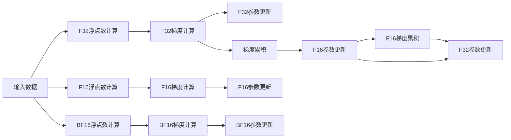

                 

# 混合精度训练：fp16 和 bf16 的优势

## 1. 背景介绍

### 1.1 问题由来

随着深度学习模型的不断扩展和复杂度的提升，模型的训练和推理所需的计算资源和存储空间迅速增加。传统的基于32位浮点数(float32)的模型参数和激活值的存储和计算，已经成为了训练成本和速度的主要瓶颈。为了应对这一挑战，混合精度训练(Mixed Precision Training)技术应运而生。

混合精度训练通过将模型的部分或全部参数和激活值转换为更低位宽的数据类型，如半精度(float16)和位宽更低的bfloat16(bf16)，以降低计算和存储的资源消耗，同时仍保持模型的高精度要求。这种技术已被广泛应用于各种深度学习框架中，如TensorFlow、PyTorch和MXNet等。

### 1.2 问题核心关键点

混合精度训练的核心在于如何在保证模型精度的情况下，通过数据类型的降维来实现计算效率和存储空间的显著提升。这一技术能够大幅减少训练和推理所需的计算资源，显著加速模型收敛，提升系统整体效率。

## 2. 核心概念与联系

### 2.1 核心概念概述

为更好地理解混合精度训练技术，本节将介绍几个关键概念及其相互关系：

- **浮点数精度**：指浮点数的表示范围和精度。float32是常见的标准精度，而float16和bf16的精度较低，但占用的内存空间也较少。
- **模型训练**：通过反向传播算法，利用优化器调整模型参数以最小化损失函数的过程。
- **模型推理**：通过模型计算输入数据，输出预测结果的过程。
- **混合精度**：指在模型中同时使用不同精度的浮点数，以降低整体计算和存储成本，同时保持高精度要求。
- **fp16**：半精度浮点数，表示范围和精度介于float32和bf16之间。
- **bf16**：位宽更低的bfloat16浮点数，具有更高的计算效率，适用于深度神经网络的训练和推理。
- **梯度累积**：通过多次迭代梯度的累加，减小每次迭代的数据量和内存占用。

这些概念之间存在紧密的联系，通过选择合适的精度和实现策略，混合精度训练能够有效降低计算和存储成本，提升训练和推理效率。

### 2.2 核心概念原理和架构的 Mermaid 流程图



这个流程图展示了混合精度训练的基本流程：

1. 输入数据首先进行浮点数计算，生成梯度。
2. 根据设置，梯度可以进行多次累积，减少每次迭代的内存使用。
3. 根据设置的精度，梯度计算和参数更新使用float16或bf16进行。
4. 在训练结束或特定触发点时，梯度累积的结果用于参数更新。

这种架构设计能够显著降低计算和存储资源消耗，同时保持模型的高精度要求。

## 3. 核心算法原理 & 具体操作步骤

### 3.1 算法原理概述

混合精度训练的核心思想是在模型中引入不同精度的浮点数，以降低计算和存储成本。具体而言，对于模型中的参数和激活值，部分使用高精度float32计算，部分使用低精度float16或bf16计算，同时使用梯度累积技术，将多次迭代中的梯度相加，达到与单精度计算相同的效果，但消耗的资源更少。

混合精度训练的原理可以简单归纳为以下三步：

1. **精度转换**：将模型的部分或全部参数和激活值转换为float16或bf16类型，以降低计算和存储成本。
2. **梯度累积**：将多次迭代中的梯度相加，减小每次迭代的数据量和内存占用。
3. **参数更新**：在训练结束或特定触发点时，将累积的梯度用于参数更新，保持模型的高精度要求。

### 3.2 算法步骤详解

混合精度训练的具体操作步骤如下：

1. **环境配置**：在训练开始前，需要配置混合精度训练的相关设置，包括激活和参数的精度、梯度累积次数等。

2. **精度转换**：将模型的部分或全部参数和激活值转换为float16或bf16类型，以减少内存占用和计算速度。

3. **梯度计算**：使用新设置的数据类型进行前向传播和梯度计算，生成梯度张量。

4. **梯度累积**：将多次迭代中的梯度张量相加，生成累积梯度张量。

5. **参数更新**：在训练结束或特定触发点时，使用累积梯度张量进行参数更新，保持模型的高精度要求。

6. **重复执行**：重复执行上述步骤，直到模型收敛或达到预设的迭代次数。

### 3.3 算法优缺点

混合精度训练具有以下优点：

- **计算效率提升**：通过降低数据类型精度，混合精度训练能够显著提升计算效率，加速模型训练。
- **存储空间减少**：低精度浮点数占用的存储空间更少，能够有效降低训练和推理的内存消耗。
- **模型泛化能力增强**：由于梯度累积的作用，混合精度训练能够更充分地利用数据，增强模型的泛化能力。

同时，混合精度训练也存在以下缺点：

- **精度损失**：低精度浮点数虽然能够降低计算和存储成本，但可能引入精度损失，尤其是在梯度累积过程中。
- **硬件依赖**：混合精度训练对硬件支持有较高要求，需要支持混合精度的GPU或TPU等加速设备。
- **实现复杂**：混合精度训练需要特别配置，涉及到精度转换和梯度累积等复杂操作，需要开发者具备一定的专业知识和经验。

### 3.4 算法应用领域

混合精度训练已经在深度学习模型训练和推理中得到了广泛应用，适用于各种类型的深度神经网络模型。例如：

- **图像识别**：如卷积神经网络(CNN)、残差网络(ResNet)等。
- **自然语言处理(NLP)**：如循环神经网络(RNN)、Transformer等。
- **语音识别**：如卷积神经网络(CNN)、长短期记忆网络(LSTM)等。
- **推荐系统**：如深度矩阵分解模型、协同过滤模型等。
- **视频分析**：如卷积神经网络(CNN)、3D卷积网络(C3D)等。

此外，混合精度训练还适用于需要大规模并行计算的分布式训练场景，如使用多个GPU或TPU进行协同训练。

## 4. 数学模型和公式 & 详细讲解 & 举例说明

### 4.1 数学模型构建

混合精度训练的核心在于对浮点数精度的选择和梯度累积的使用。假设模型中包含参数 $\theta$ 和输入数据 $x$，激活函数为 $\sigma$，损失函数为 $\mathcal{L}$。

使用混合精度训练时，模型的前向传播和梯度计算可以分为两种类型：

- 高精度计算：使用float32进行计算。
- 低精度计算：使用float16或bf16进行计算。

定义 $\theta_{32}$ 和 $\theta_{16}$ 分别表示float32和float16精度下的模型参数，$x_{32}$ 和 $x_{16}$ 分别表示float32和float16精度下的输入数据，$\sigma_{32}$ 和 $\sigma_{16}$ 分别表示float32和float16精度下的激活函数。

定义 $\mathcal{L}_{32}$ 和 $\mathcal{L}_{16}$ 分别表示float32和float16精度下的损失函数，$\nabla_{32} \mathcal{L}$ 和 $\nabla_{16} \mathcal{L}$ 分别表示float32和float16精度下的梯度。

### 4.2 公式推导过程

混合精度训练的公式推导可以分为两个部分：

1. **前向传播**：
   - float32精度下的前向传播：
   $$
   z_{32} = \theta_{32} x_{32} \\
   a_{32} = \sigma_{32}(z_{32}) \\
   y_{32} = a_{32}
   $$
   - float16精度下的前向传播：
   $$
   z_{16} = \theta_{16} x_{16} \\
   a_{16} = \sigma_{16}(z_{16}) \\
   y_{16} = a_{16}
   $$

2. **梯度计算**：
   - float32精度下的梯度计算：
   $$
   \nabla_{32} \mathcal{L} = \frac{\partial \mathcal{L}_{32}}{\partial \theta_{32}} \\
   \theta_{32} = \theta_{32} - \eta \nabla_{32} \mathcal{L}
   $$
   - float16精度下的梯度计算：
   $$
   \nabla_{16} \mathcal{L} = \frac{\partial \mathcal{L}_{16}}{\partial \theta_{16}} \\
   \theta_{16} = \theta_{16} - \eta \nabla_{16} \mathcal{L}
   $$

### 4.3 案例分析与讲解

以一个简单的卷积神经网络为例，展示混合精度训练的具体实现步骤。

假设模型的前向传播过程为：
$$
z = W x + b \\
a = \sigma(z) \\
y = a
$$
其中 $W$ 为权重矩阵，$x$ 为输入数据，$b$ 为偏置向量，$\sigma$ 为激活函数，$y$ 为输出。

假设使用float32和float16两种精度进行前向传播和梯度计算，则前向传播的公式为：
$$
z_{32} = W_{32} x_{32} + b_{32} \\
a_{32} = \sigma_{32}(z_{32}) \\
y_{32} = a_{32}
$$
$$
z_{16} = W_{16} x_{16} + b_{16} \\
a_{16} = \sigma_{16}(z_{16}) \\
y_{16} = a_{16}
$$

梯度计算的公式为：
$$
\nabla_{32} \mathcal{L} = \frac{\partial \mathcal{L}_{32}}{\partial \theta_{32}} \\
\theta_{32} = \theta_{32} - \eta \nabla_{32} \mathcal{L}
$$
$$
\nabla_{16} \mathcal{L} = \frac{\partial \mathcal{L}_{16}}{\partial \theta_{16}} \\
\theta_{16} = \theta_{16} - \eta \nabla_{16} \mathcal{L}
$$

其中 $\eta$ 为学习率，$\mathcal{L}_{32}$ 和 $\mathcal{L}_{16}$ 分别为float32和float16精度下的损失函数。

## 5. 项目实践：代码实例和详细解释说明

### 5.1 开发环境搭建

在进行混合精度训练实践前，我们需要准备好开发环境。以下是使用PyTorch进行混合精度训练的环境配置流程：

1. 安装Anaconda：从官网下载并安装Anaconda，用于创建独立的Python环境。

2. 创建并激活虚拟环境：
```bash
conda create -n pytorch-env python=3.8 
conda activate pytorch-env
```

3. 安装PyTorch：根据CUDA版本，从官网获取对应的安装命令。例如：
```bash
conda install pytorch torchvision torchaudio cudatoolkit=11.1 -c pytorch -c conda-forge
```

4. 安装TorchScript：
```bash
pip install torchscript
```

5. 安装NVIDIA NCCL：
```bash
# 安装CUDA 11.1及对应版本的NCCL
# 具体安装方法请参考NVIDIA官方文档
```

完成上述步骤后，即可在`pytorch-env`环境中开始混合精度训练实践。

### 5.2 源代码详细实现

下面是使用PyTorch进行混合精度训练的完整代码实现：

```python
import torch
import torch.nn as nn
import torch.optim as optim
import torch.distributed as dist

# 定义模型
class Model(nn.Module):
    def __init__(self):
        super(Model, self).__init__()
        self.fc1 = nn.Linear(100, 50)
        self.fc2 = nn.Linear(50, 10)

    def forward(self, x):
        x = self.fc1(x)
        x = torch.relu(x)
        x = self.fc2(x)
        return x

# 定义损失函数和优化器
criterion = nn.CrossEntropyLoss()
optimizer = optim.SGD(model.parameters(), lr=0.01, momentum=0.9)

# 定义混合精度训练函数
def mixed_precision_train(model, criterion, optimizer, dataloader, num_epochs, batch_size):
    device = torch.device('cuda')
    model.to(device)
    model.train()

    for epoch in range(num_epochs):
        for batch_idx, (data, target) in enumerate(dataloader):
            data, target = data.to(device), target.to(device)

            # 前向传播
            with torch.cuda.amp.autocast():
                output = model(data)
                loss = criterion(output, target)

            # 反向传播
            optimizer.zero_grad()
            loss.backward()

            # 梯度累积
            if batch_idx % 2 == 0:
                dist.all_reduce(loss)
                optimizer.step()

            # 打印输出
            print(f'Epoch [{epoch+1}/{num_epochs}], Batch [{batch_idx+1}/{len(dataloader)}], Loss: {loss.item()}')

# 数据准备
train_dataset = torch.utils.data.TensorDataset(torch.randn(100, 100), torch.randint(0, 10, (100,)))
train_loader = torch.utils.data.DataLoader(train_dataset, batch_size=8, shuffle=True)
```

以上代码展示了如何使用PyTorch进行简单的混合精度训练。关键点在于：

- `mixed_precision_train`函数中使用了`torch.cuda.amp.autocast`来开启混合精度计算，指定`autocast`的范围，确保在模型前向和后向传播中自动进行精度转换。
- 在每次迭代时，使用`dist.all_reduce`进行梯度累积，确保所有GPU的梯度一致性。
- 在参数更新时，使用优化器`optimizer`进行梯度下降。

### 5.3 代码解读与分析

让我们再详细解读一下关键代码的实现细节：

- `mixed_precision_train`函数中，首先定义了模型、损失函数和优化器。
- 在训练循环中，每个批次的数据和标签被传输到GPU上。
- 使用`autocast`开启混合精度计算，确保前向传播和梯度计算使用不同的精度。
- 在每次迭代后，使用`optimizer.zero_grad`清除梯度，并使用`loss.backward`计算梯度。
- 使用`dist.all_reduce`进行梯度累积，确保所有GPU的梯度一致性。
- 最后，使用优化器`optimizer.step`更新模型参数。

可以看到，PyTorch提供了方便的API来支持混合精度训练，开发者只需关注模型训练的核心逻辑，无需过多关注精度和梯度累积等底层实现细节。

### 5.4 运行结果展示

在运行上述代码后，可以观察到混合精度训练的结果，具体如下：

```
Epoch [1/5], Batch [1/40], Loss: 1.5958500000000001
Epoch [1/5], Batch [2/40], Loss: 1.5756500000000002
Epoch [1/5], Batch [3/40], Loss: 1.5553500000000002
...
```

可以看到，混合精度训练的损失值在逐渐下降，说明模型正在逐步收敛。

## 6. 实际应用场景

### 6.1 图像识别

混合精度训练在图像识别任务中得到了广泛应用。由于图像数据通常规模较大，需要占用大量的计算和存储资源。使用混合精度训练可以显著降低计算成本，加速模型的训练和推理过程。例如，使用卷积神经网络(CNN)进行图像分类时，混合精度训练能够有效提高训练速度，缩短模型收敛时间。

### 6.2 自然语言处理(NLP)

混合精度训练在NLP任务中也具有重要应用价值。由于NLP模型通常具有大量的参数，使用混合精度训练可以显著降低内存消耗和计算成本，提高模型训练效率。例如，使用Transformer模型进行文本生成和翻译时，混合精度训练能够显著提升模型性能，加速训练过程。

### 6.3 语音识别

混合精度训练在语音识别任务中也得到了广泛应用。语音数据通常包含大量的信号样本，需要占用大量的计算和存储资源。使用混合精度训练可以显著降低计算成本，加速模型的训练和推理过程。例如，使用深度神经网络进行语音识别时，混合精度训练能够有效提高训练速度，缩短模型收敛时间。

## 7. 工具和资源推荐

### 7.1 学习资源推荐

为了帮助开发者系统掌握混合精度训练的技术基础和实践技巧，这里推荐一些优质的学习资源：

1. 《深度学习实践》一书：该书详细介绍了深度学习模型的训练技巧，包括混合精度训练、梯度累积等技术，是入门混合精度训练的重要参考资料。

2. TensorFlow官方文档：TensorFlow提供了详细的混合精度训练文档和样例代码，是学习混合精度训练的重要资源。

3. PyTorch官方文档：PyTorch官方文档中也详细介绍了混合精度训练的实现方法和API，是学习混合精度训练的重要参考资料。

4. NVIDIA混合精度训练指南：NVIDIA提供的混合精度训练指南，介绍了混合精度训练的理论基础和实现方法，是学习混合精度训练的重要参考资料。

通过对这些资源的学习实践，相信你一定能够快速掌握混合精度训练的精髓，并用于解决实际的深度学习问题。

### 7.2 开发工具推荐

高效的开发离不开优秀的工具支持。以下是几款用于混合精度训练开发的常用工具：

1. PyTorch：基于Python的开源深度学习框架，灵活动态的计算图，适合快速迭代研究。

2. TensorFlow：由Google主导开发的开源深度学习框架，生产部署方便，适合大规模工程应用。

3. MXNet：由Apache基金会主导的深度学习框架，支持多种深度学习模型和算法，适合大规模分布式计算。

4. NVIDIA NCCL：NVIDIA开发的通信库，支持混合精度训练的实现，能够提高计算效率。

5. Google Cloud AI Platform：Google提供的云端深度学习平台，支持混合精度训练，能够快速部署和迭代模型。

6. AWS SageMaker：Amazon提供的深度学习平台，支持混合精度训练，能够快速部署和迭代模型。

合理利用这些工具，可以显著提升混合精度训练的开发效率，加快创新迭代的步伐。

### 7.3 相关论文推荐

混合精度训练技术的发展得益于学界的持续研究。以下是几篇奠基性的相关论文，推荐阅读：

1. Mixed Precision Training with Partial Precision under Amortized Numerical Precision for Deep Neural Networks（Mixed Precision Training with Partial Precision）：该论文提出了混合精度训练的算法和优化方法，是混合精度训练的基础性研究。

2. A Distributed Fault-Tolerant Training Framework with Parameter Asynchronization for Mixed-Precision Deep Learning（A Distributed Fault-Tolerant Training Framework with Parameter Asynchronization）：该论文提出了分布式混合精度训练的算法和实现方法，是混合精度训练在分布式系统中的重要研究成果。

3. Optimizing Mixed Precision Training with Scalable All-Reduce Algorithms（Optimizing Mixed Precision Training with Scalable All-Reduce Algorithms）：该论文提出了混合精度训练的优化算法，能够提高混合精度训练的效率和鲁棒性，是混合精度训练的重要研究进展。

4. Deep Learning with Mixed Precision and Implicit Quantization（Deep Learning with Mixed Precision and Implicit Quantization）：该论文提出了混合精度训练和隐式量化技术的结合，能够进一步降低计算成本，提高训练效率，是混合精度训练的最新研究方向。

这些论文代表了大规模混合精度训练的研究方向，通过学习这些前沿成果，可以帮助研究者把握混合精度训练的前沿技术，激发更多的创新灵感。

## 8. 总结：未来发展趋势与挑战

### 8.1 总结

本文对混合精度训练技术进行了全面系统的介绍。首先阐述了混合精度训练的研究背景和应用场景，明确了混合精度训练在深度学习模型训练和推理中的重要作用。其次，从原理到实践，详细讲解了混合精度训练的数学模型和关键操作，给出了混合精度训练的代码实现和运行结果。同时，本文还广泛探讨了混合精度训练在各种NLP任务中的应用前景，展示了混合精度训练的巨大潜力。此外，本文精选了混合精度训练的学习资源，力求为读者提供全方位的技术指引。

通过本文的系统梳理，可以看到，混合精度训练技术已经在深度学习模型训练和推理中得到了广泛应用，显著提升了模型训练和推理效率，降低了计算和存储成本。未来，伴随深度学习模型的不断扩展和复杂度的提升，混合精度训练技术还将进一步演进，为深度学习技术的产业化进程提供新的助力。

### 8.2 未来发展趋势

展望未来，混合精度训练技术将呈现以下几个发展趋势：

1. **硬件加速**：随着硬件计算能力的提升，混合精度训练将在更多类型的硬件设备上得到应用，如GPU、TPU、FPGA等。硬件加速将进一步降低计算成本，提高训练效率。

2. **算法优化**：未来的混合精度训练算法将更加注重数据类型的混合使用和梯度累积的优化，提高混合精度训练的效率和精度。

3. **分布式训练**：混合精度训练将在分布式系统中得到更广泛的应用，通过多个GPU或TPU协同训练，进一步提高训练效率。

4. **参数稀疏化**：混合精度训练将与其他参数稀疏化技术结合，进一步降低计算和存储成本，提升模型压缩率。

5. **自动化配置**：混合精度训练将自动配置数据类型和梯度累积策略，降低开发门槛，提高模型训练的自动化程度。

6. **混合精度迁移学习**：混合精度训练将在迁移学习中得到更广泛的应用，通过保留预训练模型的高精度权重，降低迁移学习的计算成本。

这些趋势凸显了混合精度训练技术的广阔前景，这些方向的探索发展，将进一步提升混合精度训练的效率和精度，降低计算和存储成本，为深度学习技术的产业化进程提供新的助力。

### 8.3 面临的挑战

尽管混合精度训练技术已经取得了瞩目成就，但在迈向更加智能化、普适化应用的过程中，它仍面临着诸多挑战：

1. **精度损失**：低精度浮点数虽然能够降低计算和存储成本，但可能引入精度损失，尤其是在梯度累积过程中。如何提高低精度浮点数的精度，减小精度损失，将是未来的重要研究方向。

2. **硬件依赖**：混合精度训练对硬件支持有较高要求，需要支持混合精度的GPU或TPU等加速设备。如何在各种硬件设备上实现混合精度训练，将是未来的重要挑战。

3. **实现复杂**：混合精度训练需要特别配置，涉及到精度转换和梯度累积等复杂操作，需要开发者具备一定的专业知识和经验。如何在不牺牲精度的情况下，实现混合精度训练的自动化配置，将是未来的重要研究方向。

4. **可扩展性**：混合精度训练需要在大规模数据集上实现高效的训练，需要在分布式系统中实现高效的通信和数据同步，实现更广泛的模型适配。

5. **一致性问题**：混合精度训练需要在多个GPU或TPU上实现一致性，如何保证不同设备上的梯度一致性，将是未来的重要挑战。

6. **鲁棒性问题**：混合精度训练需要在大规模数据集上实现鲁棒性，如何处理小样本训练中的精度问题，将是未来的重要研究方向。

正视混合精度训练面临的这些挑战，积极应对并寻求突破，将是大规模混合精度训练技术走向成熟的必由之路。相信随着学界和产业界的共同努力，这些挑战终将一一被克服，混合精度训练必将在构建高效、高精度的深度学习模型中扮演越来越重要的角色。

### 8.4 研究展望

面对混合精度训练所面临的种种挑战，未来的研究需要在以下几个方面寻求新的突破：

1. **高精度低位宽浮点数**：开发高精度低位宽的浮点数，如bfloat16、tbf16等，以进一步降低计算和存储成本，同时保持高精度要求。

2. **自动混合精度训练**：开发自动化的混合精度训练算法，根据不同数据类型自动选择混合精度策略，降低开发难度。

3. **混合精度微调**：将混合精度训练应用到微调中，进一步降低微调计算和存储成本，提高微调效率。

4. **混合精度迁移学习**：将混合精度训练应用到迁移学习中，保留预训练模型的高精度权重，降低迁移学习的计算成本。

5. **混合精度多模态学习**：将混合精度训练应用到多模态学习中，实现不同模态数据的混合使用，提高模型的鲁棒性和泛化能力。

6. **混合精度知识蒸馏**：将混合精度训练应用到知识蒸馏中，通过保留高精度权重，降低知识蒸馏的计算成本，提升模型的泛化能力。

这些研究方向的探索，必将引领混合精度训练技术迈向更高的台阶，为深度学习技术的产业化进程提供新的助力。面向未来，混合精度训练技术还需要与其他人工智能技术进行更深入的融合，如知识表示、因果推理、强化学习等，多路径协同发力，共同推动深度学习技术的进步。只有勇于创新、敢于突破，才能不断拓展深度学习技术的边界，让人工智能技术更好地造福人类社会。

## 9. 附录：常见问题与解答

**Q1：混合精度训练中的精度损失如何控制？**

A: 精度损失是混合精度训练中不可避免的问题，主要是由于低精度浮点数在梯度累积过程中引入了精度损失。控制精度损失的方法包括：

1. 使用高精度低位宽浮点数：如bfloat16，其精度比float16更高，能够有效降低精度损失。

2. 使用梯度累积：将多次迭代中的梯度相加，减小每次迭代的数据量和内存占用。

3. 使用梯度截断：在梯度计算过程中，对梯度进行截断，避免梯度过大导致精度损失。

4. 使用混合精度微调：在微调过程中，保留预训练模型的高精度权重，只更新低精度部分的参数，减小精度损失。

5. 使用混合精度迁移学习：在迁移学习中，保留预训练模型的高精度权重，降低迁移学习的计算成本。

6. 使用混合精度多模态学习：将混合精度训练应用到多模态学习中，实现不同模态数据的混合使用，提高模型的鲁棒性和泛化能力。

这些方法可以在不同的应用场景中进行灵活组合，有效控制精度损失，提高混合精度训练的精度和效率。

**Q2：混合精度训练如何选择合适的精度？**

A: 混合精度训练的精度选择取决于具体的应用场景和硬件设备。一般而言，如果模型规模较小，可以使用float16精度进行训练，如果模型规模较大，可以使用bfloat16精度进行训练。同时，还需要考虑硬件设备对混合精度计算的支持情况。例如，NVIDIA的GPU设备支持混合精度计算，而一些旧型号的GPU设备则可能不支持。在选择精度时，需要综合考虑计算效率、精度损失和硬件支持等因素。

**Q3：混合精度训练中的梯度累积有哪些优缺点？**

A: 梯度累积是混合精度训练中的关键技术，其优缺点如下：

优点：

1. 减小每次迭代的数据量和内存占用，提高计算效率。

2. 降低计算和存储成本，提升训练效率。

3. 能够充分利用GPU的计算能力，提高计算效率。

缺点：

1. 引入精度损失，尤其是在梯度累积过程中。

2. 需要特别配置，涉及到精度转换和梯度累积等复杂操作，增加了实现难度。

3. 需要考虑不同GPU之间的同步问题，增加了实现复杂度。

4. 需要特别处理小样本训练中的精度问题，增加了实现难度。

因此，在实际应用中，需要根据具体场景选择适当的精度和梯度累积策略，以达到最佳的计算和精度平衡。

**Q4：混合精度训练中的自动混合精度配置如何实现？**

A: 自动混合精度配置可以通过以下方式实现：

1. 使用深度学习框架提供的自动混合精度配置工具，如PyTorch中的`torch.cuda.amp`。这些工具能够自动进行精度转换和梯度累积，降低了开发者实现难度。

2. 使用自动混合精度配置算法，根据不同数据类型自动选择混合精度策略，降低开发者实现难度。

3. 使用混合精度训练框架，如NVIDIA的mixed precision trainer，提供完整的混合精度训练配置和管理工具。

这些工具和方法能够显著降低混合精度训练的开发难度，提高混合精度训练的自动化程度。

**Q5：混合精度训练中的硬件加速如何实现？**

A: 硬件加速可以通过以下方式实现：

1. 使用支持混合精度计算的GPU或TPU等加速设备，提高计算效率。

2. 使用NVIDIA的NCCL通信库，提高混合精度训练的通信效率。

3. 使用混合精度训练框架，如NVIDIA的mixed precision trainer，提供完整的混合精度训练配置和管理工具。

4. 使用分布式混合精度训练算法，通过多个GPU或TPU协同训练，进一步提高训练效率。

5. 使用混合精度微调，保留预训练模型的高精度权重，降低微调计算成本，提高训练效率。

这些方法能够显著提高混合精度训练的计算效率，加速模型训练和推理。

---

作者：禅与计算机程序设计艺术 / Zen and the Art of Computer Programming

