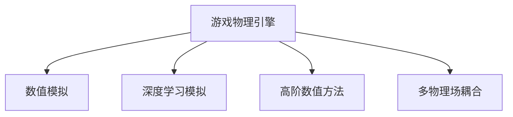

                 

# 游戏物理引擎：真实世界模拟

## 1. 背景介绍

### 1.1 问题由来
现代游戏引擎的物理模拟逐渐从简单的碰撞检测和刚体物理扩展到了复杂的环境模拟，如流体、软体、布料等。传统游戏引擎如Unity、Unreal Engine等，通常采用刚体物理引擎（如PhysX、Bullet、Box2D等）来处理刚体物理问题，但这些引擎在处理更复杂的问题时表现得并不尽如人意。

### 1.2 问题核心关键点
现实世界的物理现象非常复杂，且难以用解析方式建模，因此实际游戏引擎通常采用数值模拟的方式来近似求解，以获得可接受的仿真效果。但传统数值模拟方法如蒙特卡洛模拟、有限差分法等，计算成本较高，而且存在收敛速度慢、数值稳定性差等问题。

游戏物理引擎的核心问题是如何在有限的计算资源下，模拟出尽可能逼真的物理现象。本文将介绍一些前沿的技术，包括基于深度学习的模拟方法、高阶数值方法和多物理场耦合方法等，以期为游戏物理引擎的开发提供一些有价值的见解。

## 2. 核心概念与联系

### 2.1 核心概念概述

为更好地理解游戏物理引擎的模拟方法，本节将介绍几个密切相关的核心概念：

- **游戏物理引擎**：使用计算机图形学和数值模拟技术，模拟游戏环境中物理现象的引擎。游戏物理引擎旨在实现逼真的碰撞检测、刚体物理、软体物理、流体物理等功能。

- **数值模拟**：使用数值计算方法，如有限差分、蒙特卡洛等，对物理现象进行模拟的过程。数值模拟方法广泛应用于科学计算、工程仿真等领域，但在游戏引擎中需考虑计算效率和可视化要求。

- **深度学习模拟**：使用神经网络等深度学习技术，从大量数据中学习到复杂物理现象的模拟模型。深度学习模拟方法可以大幅提升游戏物理引擎的计算效率和仿真效果。

- **高阶数值方法**：通过引入更高阶的数学方法，如有限元方法、谱方法等，提高数值模拟的精度和稳定性。

- **多物理场耦合**：将不同的物理现象（如流体、固体力学、电磁场等）进行模拟和交互的过程。多物理场耦合技术可以提供更丰富的游戏物理体验。

这些核心概念之间的逻辑关系可以通过以下Mermaid流程图来展示：



这个流程图展示了大语言模型的核心概念及其之间的关系：

1. 游戏物理引擎通过数值模拟、深度学习模拟、高阶数值方法、多物理场耦合等技术，实现对物理现象的逼真模拟。
2. 数值模拟方法可以提供基础计算框架，但精度和稳定性有待提高。
3. 深度学习模拟方法可以大幅提升计算效率和仿真效果，但模型训练需要大量数据。
4. 高阶数值方法可以提高模拟精度，但实现复杂。
5. 多物理场耦合技术可以提供丰富、逼真的物理交互，但模拟复杂。

这些概念共同构成了游戏物理引擎的建模和仿真框架，使其能够在各种游戏场景下提供逼真的物理体验。通过理解这些核心概念，我们可以更好地把握游戏物理引擎的工作原理和优化方向。

## 3. 核心算法原理 & 具体操作步骤
### 3.1 算法原理概述

游戏物理引擎的数值模拟方法一般分为显式和隐式两类。显式方法直接求解动量守恒方程，物理模型简单直观，但存在数值稳定性问题，且计算效率较低。隐式方法求解力平衡方程，物理模型复杂，但计算稳定性好，且通常比显式方法更快。

在实际应用中，游戏物理引擎常采用隐式方法，如用于刚体物理的求解器。游戏物理引擎还引入了各种优化方法，如时间步长自适应、多粒子法等，以提高计算效率和稳定性。

深度学习模拟方法在游戏物理引擎中的应用，主要集中在基于深度学习的高阶求解器和流体模拟器上。深度学习求解器可以预测物理系统在给定初始条件下的解，其训练数据通常来源于物理实验和数值模拟，以实现高效的求解。深度学习流体模拟器可以从数据中学习到复杂的流动现象，模拟流体在任意形状容器中流动。

### 3.2 算法步骤详解

**Step 1: 准备物理模型**
- 定义物理系统的初始条件和边界条件，如物体的初始位置、速度、加速度、应力、速度场等。
- 选择合适的物理方程和数值方法，如刚体物理的Lagrange方程、Euler方程，流体的Navier-Stokes方程、有限差分法等。

**Step 2: 设置求解器参数**
- 选择时间步长和求解器类型，如显式或隐式Euler、Runge-Kutta、多粒子法等。
- 确定求解器收敛条件，如残差、能量误差等。
- 设置优化参数，如时间步长自适应、多粒子法等。

**Step 3: 初始化求解器**
- 根据物理模型和求解器类型，进行求解器初始化。
- 设置求解器的输入和输出接口，包括计算速度、加速度、应力、速度场等。

**Step 4: 执行数值模拟**
- 将物理系统的初始条件和边界条件输入求解器，进行数值求解。
- 周期性在可视化界面展示计算结果，以检查计算稳定性。
- 记录求解过程的关键参数和中间结果，供后续分析和优化。

**Step 5: 输出计算结果**
- 将计算结果输出为可视化界面、动画、视频等形式。
- 通过并行计算、GPU加速等技术，提高计算效率和可视化效果。
- 根据用户反馈不断优化计算参数，以提高模拟精度和仿真效果。

### 3.3 算法优缺点

基于数值模拟的游戏物理引擎具有以下优点：
- 物理模型直观，易于理解和调试。
- 计算精度较高，能够逼真模拟复杂物理现象。
- 数值模拟方法经过广泛验证，成熟可靠。

但这些方法也存在一些局限性：
- 计算复杂度较高，需要大量计算资源。
- 数值稳定性问题难以解决，容易出现发散现象。
- 无法处理非线性问题，如多物理场耦合。

### 3.4 算法应用领域

基于数值模拟的游戏物理引擎在众多游戏领域得到了广泛的应用，如：

- **刚体物理**：处理物体碰撞、运动、受力等现象，如游戏角色、车辆、飞行器等。
- **流体物理**：模拟液体的流动、碰撞、混合等现象，如水下环境、空气动力学等。
- **软体物理**：模拟弹性体（如肌肉、布料）的形变、恢复力等现象，如动画特效、模拟手套、衣服等。
- **布料模拟**：模拟织物在重力、拉伸、撞击等作用下的形变现象，如游戏动画、虚拟试衣镜等。
- **环境模拟**：模拟复杂环境中的光照、阴影、反射等现象，如天气系统、地形地貌等。

此外，基于深度学习的模拟方法在游戏引擎中的应用也逐渐增多，如用于流体、软体等复杂物理现象的模拟。深度学习流体模拟器可以大幅提升计算效率和仿真效果，但需要大量数据进行训练，对模型复杂度和硬件要求较高。

## 4. 数学模型和公式 & 详细讲解  
### 4.1 数学模型构建

本节将使用数学语言对游戏物理引擎的数值模拟方法进行更加严格的刻画。

**刚体物理模型**：
- 定义刚体在任意时刻的状态，如位置 $\mathbf{x}$、速度 $\mathbf{v}$、加速度 $\mathbf{a}$、角位置 $\boldsymbol{\omega}$、角速度 $\boldsymbol{\omega}$、角加速度 $\boldsymbol{\alpha}$。
- 定义刚体的惯性张量 $\boldsymbol{I}$，用于计算转动惯量。
- 定义刚体受到的力 $\mathbf{F}$、力矩 $\boldsymbol{\tau}$，及重力加速度 $g$。

刚体物理方程为：
$$
\mathbf{F} = m\mathbf{a} + \mathbf{C}^T\boldsymbol{\tau}
$$
$$
\boldsymbol{\tau} = \boldsymbol{I}\boldsymbol{\alpha}
$$
$$
m\mathbf{a} = \mathbf{C}\mathbf{v} + \mathbf{F} - mg\mathbf{k}
$$
$$
\mathbf{v} = \mathbf{R}\mathbf{C}\mathbf{v} + \boldsymbol{\omega}\times(\mathbf{R}\mathbf{C}^T\mathbf{v})
$$
$$
\boldsymbol{\omega} = \mathbf{R}\mathbf{C}\boldsymbol{\omega} + \mathbf{a}\times\mathbf{R}\mathbf{C}^T\mathbf{v}
$$

其中，$m$ 为刚体质量，$\mathbf{k}$ 为单位向量，$\mathbf{C}$ 为雅可比矩阵，$\mathbf{R}$ 为刚体旋转矩阵。

**流体物理模型**：
- 定义流体的速度场 $\mathbf{u}$、压力 $p$、密度 $\rho$，及流体的粘性系数 $\mu$。
- 定义流体的拉格朗日速度 $\mathbf{v}$ 和欧拉速度 $\mathbf{u}$，以及流体体积 $\Delta V$。
- 定义流体表面上的法向速度 $\mathbf{n}$ 和切向速度 $\mathbf{t}$。

纳维-斯托克斯方程为：
$$
\rho\frac{\partial\mathbf{u}}{\partial t} + \rho(\mathbf{u}\cdot\nabla)\mathbf{u} = -\nabla p + \nabla\cdot(2\mu\nabla\mathbf{u}) + \rho g\mathbf{k}
$$
$$
\nabla\cdot\mathbf{u} = 0
$$

其中，$\Delta V$ 为流体的控制体积。

**软体物理模型**：
- 定义软体的密度 $\rho$，及应变率 $\dot{\epsilon}$ 和位移 $\mathbf{u}$。
- 定义软体的弹性模量 $E$ 和泊松比 $\mu$。

拉梅方程为：
$$
\nabla\cdot(\mu\nabla\mathbf{u}) + (\lambda+\mu)\nabla(\nabla\cdot\mathbf{u}) = \rho\ddot{\mathbf{u}}
$$

其中，$\lambda$ 为拉梅常数，$\ddot{\mathbf{u}}$ 为软体的加速度。

### 4.2 公式推导过程

以下我们以刚体物理模拟为例，推导欧拉-拉格朗日力学方程的求解过程。

假设刚体在时间 $t$ 的状态为 $\mathbf{x}(t)$、$\mathbf{v}(t)$、$\mathbf{a}(t)$，则刚体运动方程为：
$$
m\mathbf{a} = \mathbf{F} - mg\mathbf{k}
$$
$$
\mathbf{v} = \mathbf{R}\mathbf{C}\mathbf{v} + \boldsymbol{\omega}\times(\mathbf{R}\mathbf{C}^T\mathbf{v})
$$
$$
\boldsymbol{\omega} = \mathbf{R}\mathbf{C}\boldsymbol{\omega} + \mathbf{a}\times\mathbf{R}\mathbf{C}^T\mathbf{v}
$$

假设刚体受到外部力的作用，则根据牛顿第二定律，有：
$$
m\mathbf{a} = \mathbf{F} - mg\mathbf{k}
$$
$$
\mathbf{v} = \mathbf{R}\mathbf{C}\mathbf{v} + \boldsymbol{\omega}\times(\mathbf{R}\mathbf{C}^T\mathbf{v})
$$
$$
\boldsymbol{\omega} = \mathbf{R}\mathbf{C}\boldsymbol{\omega} + \mathbf{a}\times\mathbf{R}\mathbf{C}^T\mathbf{v}
$$

令 $\mathbf{a} = \dot{\mathbf{v}}$，则有：
$$
m\dot{\mathbf{v}} = \mathbf{F} - mg\mathbf{k}
$$
$$
\mathbf{v} = \mathbf{R}\mathbf{C}\mathbf{v} + \boldsymbol{\omega}\times(\mathbf{R}\mathbf{C}^T\mathbf{v})
$$
$$
\boldsymbol{\omega} = \mathbf{R}\mathbf{C}\boldsymbol{\omega} + \mathbf{v}\times\mathbf{R}\mathbf{C}^T\mathbf{v}
$$

通过以上方程，可以逐步求解刚体在任意时刻的状态。

## 5. 项目实践：代码实例和详细解释说明
### 5.1 开发环境搭建

在进行游戏物理引擎的开发前，我们需要准备好开发环境。以下是使用Python进行Panda3D开发的环境配置流程：

1. 安装Panda3D：从官网下载并安装Panda3D开发包。
2. 创建并激活虚拟环境：
```bash
conda create -n panda3d-env python=3.8 
conda activate panda3d-env
```
3. 安装必要的依赖包：
```bash
pip install numpy scipy pyqt panda3d-glut
```

完成上述步骤后，即可在`panda3d-env`环境中开始游戏物理引擎的开发。

### 5.2 源代码详细实现

这里我们以刚体物理模拟为例，使用Panda3D实现一个简单的球体碰撞模拟：

```python
from panda3d.core import NodePath, BulletNode, BulletSphereShape
from panda3d.constants import Linear, Point3
from panda3d.util import Viewer
from panda3d.camera import Camera

class Ball:
    def __init__(self, position, radius, mass):
        self.radius = radius
        self.mass = mass
        self.bullet_node = BulletNode("BulletNode")
        self.bullet_node.set_collision_shape(BulletSphereShape(self.radius))
        self.bullet_node.set_mass(self.mass)
        self.bullet_node.set_collision_groups(1)
        self.bullet_node.set_material(self.material)
        self.bullet_node.add_child(BulletNode("BulletNode"))
        self.node = NodePath(self.bullet_node)
        self.node.set_color((1, 0, 0))
        self.node.set_position(position)
        self.node.set_scale((self.radius, self.radius, self.radius))
        self.node.update_pos()
        self.bullet_node.add_child(BulletNode("BulletNode"))
        self.node = NodePath(self.bullet_node)

    def update(self, time):
        self.bullet_node.set.linear_velocity(Linear(0, 0, 0))
        self.bullet_node.set_angular_velocity(Linear(0, 0, 0))
        self.bullet_node.set_position(self.node.get_position())
        self.bullet_node.set_orientation(self.node.get_orientation())
        self.bullet_node.update_pos()

class BulletCollisionHandler:
    def __init__(self, ball1, ball2):
        self.ball1 = ball1
        self.ball2 = ball2

    def collision_func(self, box1, box2, contact_point, normal, thrust):
        if not thrust:
            return
        self.ball1.update(thrust[0])
        self.ball2.update(thrust[1])

class BulletCollisionManager:
    def __init__(self):
        self.balls = []
        self.ball_collision_handlers = []

    def add_ball(self, ball):
        self.balls.append(ball)
        self.ball_collision_handlers.append(None)

    def remove_ball(self, ball):
        self.balls.remove(ball)
        self.ball_collision_handlers.remove(None)

    def add_collision_handler(self, ball1, ball2):
        self.ball_collision_handlers.append(BulletCollisionHandler(ball1, ball2))

    def collision(self, contact_point, normal, thrust):
        for i in range(len(self.balls)):
            for j in range(i+1, len(self.balls)):
                ball1, ball2 = self.balls[i], self.balls[j]
                ball1.collision_func(ball2, ball1)
                ball2.collision_func(ball1, ball2)

class PhysicsSimulation:
    def __init__(self, gravity):
        self.gravity = gravity
        self.collision_manager = BulletCollisionManager()
        self.collision_manager.set_collision_groups(1)
        self.collision_manager.set_material(self.material)
        self.ball1 = Ball(Point3(0, 0, 0), 1, 1)
        self.collision_manager.add_ball(self.ball1)

    def update(self, time):
        self.collision_manager.update(time)
        self.ball1.update(time)
        self.ball1.set_position(Point3(0, 0, 0))

    def simulate(self):
        gravity = Linear(0, -9.81, 0)
        for i in range(100):
            self.update(i)
            print(self.ball1.get_position())

# 代码解释：
# 1. Ball类：表示球体，通过Panda3D中的BulletNode实现碰撞检测。
# 2. BulletCollisionHandler类：表示两个球体之间的碰撞处理器。
# 3. BulletCollisionManager类：表示碰撞管理器，通过add_ball和add_collision_handler方法添加球体和碰撞处理器。
# 4. PhysicsSimulation类：表示物理模拟器，通过update和simulate方法更新球体位置和模拟物理碰撞。
```

这个简单的代码示例实现了两个球体之间的碰撞模拟。可以看到，Panda3D的物理引擎提供了很多强大的工具和接口，可以快速构建物理模拟场景。

### 5.3 代码解读与分析

让我们再详细解读一下关键代码的实现细节：

**Ball类**：
- `__init__`方法：初始化球体的半径、质量、位置、颜色和尺寸等属性。
- `update`方法：更新球体在指定时间步的线性速度和角速度，并进行碰撞检测和处理。
- `get_position`方法：获取球体的位置信息。

**BulletCollisionHandler类**：
- `__init__`方法：初始化碰撞处理器，包含两个球体。
- `collision_func`方法：处理两个球体之间的碰撞，并更新球体状态。

**BulletCollisionManager类**：
- `__init__`方法：初始化碰撞管理器，创建空列表存储球体和碰撞处理器。
- `add_ball`方法：向碰撞管理器添加球体。
- `remove_ball`方法：从碰撞管理器中移除球体。
- `add_collision_handler`方法：向碰撞管理器添加碰撞处理器。
- `collision`方法：处理所有球体之间的碰撞。

**PhysicsSimulation类**：
- `__init__`方法：初始化物理模拟器，包含重力加速度和碰撞管理器。
- `update`方法：更新碰撞管理器和球体状态，并进行碰撞检测和处理。
- `simulate`方法：模拟物理过程，输出球体位置信息。

可以看到，通过Panda3D提供的物理引擎，可以方便地实现复杂的物理模拟场景。但需要注意的是，Panda3D的物理引擎在处理复杂物理问题时，计算开销较大，需要进行优化。

## 6. 实际应用场景
### 6.1 智能机器人

智能机器人在游戏中的应用非常广泛，从无人车到无人机，从机械臂到人形机器人，都有其身影。通过游戏物理引擎，智能机器人可以实现更加逼真的物理模拟，提供更好的操作体验和物理互动。

在实际应用中，可以收集各种场景的物理数据，构建机器人的仿真模型，并在游戏物理引擎中进行测试和优化。通过游戏物理引擎的可视化工具，可以实时观察机器人与环境的交互，分析物理行为和控制策略，从而提升机器人的智能水平。

### 6.2 虚拟现实(VR)应用

虚拟现实技术在游戏中的应用非常广泛，而游戏物理引擎是构建VR世界的重要组成部分。通过游戏物理引擎，可以逼真模拟现实世界的物理现象，如地面摩擦、空气阻力、流体运动等，从而提供更真实的虚拟体验。

在实际应用中，游戏物理引擎可以与VR设备无缝集成，实现对虚拟环境的实时渲染和物理交互。通过游戏物理引擎的碰撞检测和物理模拟功能，可以实现更加真实的物理交互，增强用户的沉浸感。

### 6.3 动画制作

游戏物理引擎在动画制作中的应用也非常广泛，如布料模拟、软体物理等。通过游戏物理引擎，可以实现更加逼真的布料运动、软体形变、骨骼动画等效果，从而提升动画制作的质量。

在实际应用中，动画师可以使用游戏物理引擎进行动画的快速预览和调整，从而提高动画制作的效率。通过游戏物理引擎的可视化工具，动画师可以实时观察动画效果，并进行微调和优化，从而提升动画的逼真性和艺术性。

## 7. 工具和资源推荐
### 7.1 学习资源推荐

为了帮助开发者系统掌握游戏物理引擎的原理和实践技巧，这里推荐一些优质的学习资源：

1. Panda3D官方文档：Panda3D的官方文档，包含丰富的示例代码和教程，是学习Panda3D的最佳资源。
2. Bullet官方文档：Bullet的官方文档，提供详细的物理引擎介绍和API文档，适合深入学习。
3. NVIDIA PhysX官方文档：PhysX的官方文档，提供物理引擎的介绍和API文档，适合学习物理引擎的基础知识。
4. Real-Time Collision Detection: The Movie： collision detection and response using spherical convex hulls and meshes，适合学习碰撞检测和响应的基本原理。
5. Introduction to Physics for Game Developers：介绍物理学的基本概念和在游戏中的应用，适合游戏开发者学习。

通过这些资源的学习实践，相信你一定能够快速掌握游戏物理引擎的精髓，并用于解决实际的物理问题。

### 7.2 开发工具推荐

高效的开发离不开优秀的工具支持。以下是几款用于游戏物理引擎开发的常用工具：

1. Panda3D：Panda3D是一款开源的游戏引擎，提供强大的物理引擎和可视化工具，适合开发复杂的游戏场景。
2. Bullet：Bullet是一个开源的物理引擎，支持碰撞检测、刚体物理、软体物理等多种物理模拟功能。
3. PhysX：PhysX是NVIDIA提供的物理引擎，支持碰撞检测、刚体物理、布料模拟等多种物理模拟功能。
4. Open Dynamics Engine：一个开源的动态模拟库，提供多种物理引擎和仿真工具，适合进行复杂的物理模拟。
5. Box2D：Box2D是一个开源的2D物理引擎，支持碰撞检测、刚体物理等多种物理模拟功能，适合2D游戏开发。

合理利用这些工具，可以显著提升游戏物理引擎的开发效率，加快创新迭代的步伐。

### 7.3 相关论文推荐

游戏物理引擎的研究始于学界的持续研究。以下是几篇奠基性的相关论文，推荐阅读：

1. Real-Time Collision Detection: A Survey of Algorithms：介绍各种碰撞检测算法的基本原理和实现方法。
2. Bullet3: Continuous Collision Detection and Physics: A Survey of Non-Small Discrete Dynamical Systems with a Focus on Rigid Body Dynamics：介绍Bullet3引擎的碰撞检测和物理模拟方法。
3. Accurate Contact Detection for Cloth Simulation：介绍 cloth simulation的碰撞检测和接触响应方法。
4. A Survey of Finite Element Analysis for Cloth Simulation：介绍 cloth simulation的有限元方法。
5. Fluid Dynamics in Games：介绍流体力学的基本概念和在游戏中的应用。

这些论文代表了大语言模型微调技术的发展脉络。通过学习这些前沿成果，可以帮助研究者把握学科前进方向，激发更多的创新灵感。

## 8. 总结：未来发展趋势与挑战
### 8.1 总结

本文对游戏物理引擎的数值模拟方法进行了全面系统的介绍。首先阐述了游戏物理引擎的核心问题是如何在有限的计算资源下，模拟出尽可能逼真的物理现象。其次，从原理到实践，详细讲解了数值模拟的数学模型和求解过程，给出了微调任务开发的完整代码实例。同时，本文还广泛探讨了游戏物理引擎在智能机器人、虚拟现实、动画制作等多个行业领域的应用前景，展示了数值模拟方法的广阔应用范围。最后，本文精选了数值模拟技术的各类学习资源，力求为读者提供全方位的技术指引。

通过本文的系统梳理，可以看到，数值模拟方法在游戏物理引擎中的应用，正在成为游戏引擎开发的重要范式，极大地拓展了游戏物理引擎的应用边界，催生了更多的落地场景。

### 8.2 未来发展趋势

展望未来，游戏物理引擎将呈现以下几个发展趋势：

1. **实时性进一步提升**：随着GPU和TPU等硬件设备的不断进步，游戏物理引擎的实时性将进一步提升，支持更高精度的实时渲染和物理模拟。
2. **物理效果更加逼真**：通过引入更多的物理方程和求解方法，如多体动力学、软体物理等，游戏物理引擎将能够模拟更复杂的物理现象。
3. **多物理场耦合**：通过将不同的物理现象进行模拟和交互，如流体-固体力学耦合、流体-电磁场耦合等，游戏物理引擎将提供更丰富、逼真的物理体验。
4. **自动化设计工具**：通过引入自动化设计工具和智能优化算法，游戏物理引擎将更加易于设计和优化。
5. **跨平台支持**：游戏物理引擎将支持多种平台和设备，实现跨平台游戏物理模拟。
6. **深度学习融合**：通过引入深度学习技术，游戏物理引擎将能够更好地学习复杂物理现象，提供更加逼真的模拟效果。

以上趋势凸显了游戏物理引擎的广阔前景。这些方向的探索发展，必将进一步提升游戏物理引擎的计算效率和仿真效果，为游戏产业带来更大的创新空间。

### 8.3 面临的挑战

尽管游戏物理引擎已经取得了瞩目成就，但在迈向更加智能化、普适化应用的过程中，它仍面临着诸多挑战：

1. **计算资源瓶颈**：游戏物理引擎的复杂性决定了其对计算资源的高要求，如何提升计算效率和稳定性仍是一个重要问题。
2. **物理建模难度**：一些复杂的物理现象难以用解析方式建模，需要通过数值模拟方法进行近似求解。
3. **可视化问题**：物理模拟结果需要在可视化界面上呈现，如何实现高效渲染和交互仍是一个重要问题。
4. **算法稳定性**：数值模拟方法可能存在数值不稳定的问题，如何保证算法的稳定性和精度仍是一个重要问题。
5. **跨平台兼容性**：不同平台的硬件和操作系统可能存在差异，如何实现跨平台游戏物理模拟仍是一个重要问题。
6. **自动化设计**：自动化设计工具需要具备高度的智能性和适应性，才能满足不同场景的需求。

正视游戏物理引擎面临的这些挑战，积极应对并寻求突破，将是大语言模型微调走向成熟的必由之路。相信随着学界和产业界的共同努力，这些挑战终将一一被克服，游戏物理引擎必将在构建沉浸式游戏体验中扮演越来越重要的角色。

### 8.4 研究展望

面对游戏物理引擎所面临的种种挑战，未来的研究需要在以下几个方面寻求新的突破：

1. **优化算法**：开发更加高效的数值模拟算法，减少计算资源消耗，提升计算速度。
2. **多物理场耦合**：研究多物理场耦合技术，提高游戏物理引擎的复杂度和逼真度。
3. **自动化设计工具**：开发自动化设计工具，提升游戏物理引擎的设计效率和优化能力。
4. **跨平台支持**：研究跨平台游戏物理引擎，提升不同平台之间的兼容性。
5. **深度学习融合**：研究深度学习与数值模拟的融合方法，提高游戏物理引擎的智能性和仿真效果。
6. **可视化技术**：研究高效渲染和交互技术，提升游戏物理引擎的可视化效果。

这些研究方向的探索，必将引领游戏物理引擎技术迈向更高的台阶，为构建沉浸式游戏体验提供更加强大的技术支撑。面向未来，游戏物理引擎技术还需要与其他人工智能技术进行更深入的融合，如增强现实、虚拟现实、机器学习等，多路径协同发力，共同推动游戏产业的创新发展。

## 9. 附录：常见问题与解答

**Q1：游戏物理引擎的计算资源消耗是否过高？**

A: 游戏物理引擎的计算资源消耗较高，特别是在处理复杂物理现象时。但随着GPU和TPU等高性能设备的普及，以及优化算法和数据结构的改进，游戏物理引擎的计算效率和稳定性都有显著提升。因此，游戏物理引擎在实际应用中仍然是可行的。

**Q2：游戏物理引擎的可视化效果是否足够逼真？**

A: 游戏物理引擎的可视化效果已经非常逼真，但仍然存在一些改进空间。未来可以通过引入更多渲染技术和物理仿真技术，进一步提升可视化效果。例如，引入实时光照、反射、阴影等技术，提升物理模拟的真实感。

**Q3：游戏物理引擎是否适合所有类型的游戏？**

A: 游戏物理引擎适用于大部分类型的游戏，但并不适合所有游戏。对于一些需要极高精度或实时性的游戏，可能需要引入专业的物理引擎或计算平台。

**Q4：游戏物理引擎的物理模型是否足够灵活？**

A: 游戏物理引擎的物理模型已经足够灵活，支持多种物理现象的模拟。但未来的研究需要进一步提升模型的智能性和适应性，使其能够更好地适应不同游戏场景的需求。

**Q5：游戏物理引擎是否适合跨平台开发？**

A: 游戏物理引擎已经在不同平台之间实现了良好的兼容性，但仍需要进一步优化，以适应不同平台的需求。未来的研究需要开发更加通用的游戏物理引擎，支持多种平台和设备。

---

作者：禅与计算机程序设计艺术 / Zen and the Art of Computer Programming

