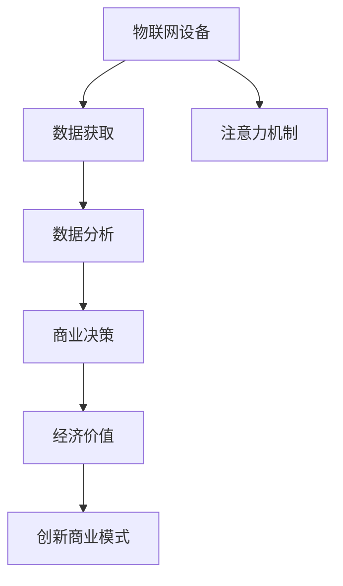

                 

# 物联网设备的注意力经济价值挖掘

> 关键词：物联网设备、注意力机制、经济价值、数据分析、数据挖掘、大数据、深度学习、应用场景、策略优化、创新商业模式

## 1. 背景介绍

### 1.1 问题由来

随着物联网技术的迅猛发展，越来越多的设备被连接到互联网中，从智能家居设备到可穿戴设备，从工业自动化设备到城市基础设施，这些设备通过收集、分析和传输数据，为用户和商家提供了一系列服务。然而，设备的数量和种类的激增也带来了新的挑战和机遇，如何挖掘这些设备中的注意力经济价值，成为了一个亟待解决的问题。

### 1.2 问题核心关键点

物联网设备的注意力经济价值挖掘，本质上是利用设备收集的数据来识别用户行为模式，预测用户需求，优化资源配置，从而最大化商业收益。其核心在于：

- **数据获取**：从设备上获取详尽的数据，包括设备使用频率、用户操作行为、地理位置、传感器数据等。
- **注意力机制**：识别和度量用户对设备的关注程度，哪些设备对于用户更具有吸引力。
- **数据分析**：对设备数据进行分析，挖掘潜在的商业模式和市场机会。
- **商业决策**：根据分析结果，制定和实施相应的商业策略，提升设备的使用价值和经济效益。

### 1.3 问题研究意义

物联网设备的注意力经济价值挖掘，不仅能够提升设备的商业价值，还能够促进设备的智能化和个性化，增强用户体验，推动物联网技术的深度应用。研究该问题具有以下重要意义：

- **提升设备价值**：通过优化资源配置，提高设备的吸引力和使用频率，从而提升设备经济价值。
- **改善用户体验**：通过精准的个性化推荐，提升用户对设备的满意度和忠诚度。
- **促进创新商业模式**：探索新型的服务模式和商业路径，拓宽物联网设备的应用场景。
- **推动技术发展**：推动大数据、深度学习、数据挖掘等技术的进步，促进物联网设备的智能化和创新应用。

## 2. 核心概念与联系

### 2.1 核心概念概述

为了更好地理解物联网设备的注意力经济价值挖掘，本节将介绍几个密切相关的核心概念：

- **物联网设备(IoT Device)**：指的是通过传感器、执行器等部件实现信息获取、处理和通信的设备，如智能手表、智能家居设备、工业传感器等。
- **注意力机制(Attention Mechanism)**：在机器学习和自然语言处理中，用于度量和模拟人类注意力的机制，通过加权平均或者注意力权重的方式，使模型更加关注重要的信息。
- **数据挖掘(Data Mining)**：从数据中发现模式、关联、趋势和知识的过程，主要通过统计学和机器学习方法实现。
- **大数据(Big Data)**：指超过传统数据处理能力的数据集合，通常以PB级的规模出现，需要进行分布式处理。
- **深度学习(Deep Learning)**：一种基于人工神经网络的方法，通过多层次的非线性映射，解决复杂的非结构化数据问题。
- **商业决策(Business Decision Making)**：基于数据和算法，制定和执行商业策略的过程，旨在提升商业绩效。

这些核心概念之间的逻辑关系可以通过以下Mermaid流程图来展示：



这个流程图展示了大规模物联网设备注意力经济价值挖掘的核心概念及其之间的关系：

1. 物联网设备通过数据获取获得实时信息。
2. 注意力机制从海量的设备数据中识别出重要的信息。
3. 数据分析挖掘数据中的模式和趋势。
4. 商业决策利用分析结果优化资源配置。
5. 注意力经济价值通过优化决策转化为商业价值。
6. 创新商业模式探索新的应用场景和商业路径。

## 3. 核心算法原理 & 具体操作步骤
### 3.1 算法原理概述

物联网设备的注意力经济价值挖掘，主要基于深度学习和大数据技术。其核心算法原理是通过注意力机制识别设备数据的权重，进而进行数据分析和商业决策，最终实现经济价值的最大化。

形式化地，假设物联网设备数据集为 $D=\{(x_i,y_i)\}_{i=1}^N$，其中 $x_i$ 为设备数据， $y_i$ 为商业决策变量，例如广告投放、设备维护等。定义注意力权重为 $w_i \in [0,1]$，表示数据 $x_i$ 对于决策的重要性。注意力机制 $Att(x_i)$ 的输出为 $w_i$，用于指导数据挖掘和商业决策过程。

基于注意力机制的大规模数据挖掘过程，可以表示为：

$$
w_i = Att(x_i; \theta) \\
y_i = f(w_i \cdot x_i; \phi)
$$

其中，$f$ 为商业决策模型， $\theta$ 为注意力机制的参数， $\phi$ 为商业决策模型的参数。

### 3.2 算法步骤详解

物联网设备的注意力经济价值挖掘一般包括以下几个关键步骤：

**Step 1: 数据预处理**

- 收集物联网设备的数据，包括传感器数据、位置数据、用户行为数据等。
- 进行数据清洗、去重、格式化等预处理，确保数据的准确性和一致性。

**Step 2: 构建注意力模型**

- 选择合适的深度学习模型，如Transformer、CNN等，构建注意力机制。
- 训练模型，使得注意力权重 $w_i$ 能够准确反映设备数据的商业价值。
- 保存训练好的模型参数，用于后续的数据分析和商业决策。

**Step 3: 数据挖掘和分析**

- 利用训练好的注意力模型，对设备数据进行注意力加权，计算加权平均值。
- 使用深度学习模型，如LSTM、GRU等，对加权后的数据进行建模和预测。
- 分析预测结果，识别商业机会和市场趋势。

**Step 4: 商业决策和优化**

- 根据预测结果，制定商业决策，如广告投放、设备维护、价格调整等。
- 通过A/B测试等方法，评估决策效果，进行优化。
- 持续迭代和改进，提升决策模型的准确性和稳定性。

### 3.3 算法优缺点

基于注意力机制的大规模数据挖掘方法具有以下优点：

- **精度高**：深度学习和注意力机制相结合，可以挖掘出设备数据的深层模式和关联。
- **鲁棒性强**：通过多层次的非线性映射，模型可以适应复杂的数据分布。
- **可解释性**：注意力机制可以解释每个数据点对决策的重要性，增加决策的透明性和可信度。

同时，该方法也存在以下局限性：

- **数据需求量大**：需要大量的物联网设备数据进行训练和预测，获取和处理数据成本高。
- **计算资源消耗大**：深度学习模型的计算复杂度高，需要高性能计算资源。
- **模型解释难度高**：注意力机制的决策过程复杂，难以进行直观的解释和调试。

### 3.4 算法应用领域

基于注意力机制的大规模数据挖掘方法，已经在物联网设备的注意力经济价值挖掘中得到了广泛应用，覆盖了多个行业和场景，例如：

- **智能家居**：通过分析用户在家中的行为数据，优化智能家居设备的布局和使用，提高用户满意度。
- **工业监控**：通过分析工业设备的传感器数据，预测设备故障，进行预防性维护，提升生产效率。
- **城市交通**：通过分析交通流量和位置数据，优化道路和交通信号灯的配置，提升交通效率。
- **医疗健康**：通过分析患者的健康数据和行为模式，提供个性化的医疗建议和治疗方案。
- **电子商务**：通过分析用户的行为数据和交易记录，提供精准的产品推荐和个性化服务，提升销售转化率。

除了上述这些典型应用外，物联网设备的注意力经济价值挖掘方法还可以创新性地应用到更多领域中，如智能物流、智能农业、智能制造等，为物联网设备的智能化应用带来新的突破。

## 4. 数学模型和公式 & 详细讲解 & 举例说明
### 4.1 数学模型构建

本节将使用数学语言对物联网设备注意力经济价值挖掘过程进行更加严格的刻画。

假设物联网设备数据集为 $D=\{(x_i,y_i)\}_{i=1}^N$，其中 $x_i$ 为设备数据， $y_i$ 为商业决策变量。定义注意力权重为 $w_i \in [0,1]$，表示数据 $x_i$ 对于决策的重要性。

注意力机制 $Att(x_i; \theta)$ 的输出为 $w_i$，可以表示为：

$$
w_i = \text{softmax}(\mathbf{V}x_i + \mathbf{U}h_{t-1})
$$

其中， $\mathbf{V}$ 和 $\mathbf{U}$ 为注意力机制的权重矩阵， $h_{t-1}$ 为模型在上一时间步的状态向量。

商业决策模型 $f$ 的输出为 $y_i$，可以表示为：

$$
y_i = f(\mathbf{W} \cdot (\mathbf{w} \cdot x_i) + \mathbf{b})
$$

其中， $\mathbf{W}$ 和 $\mathbf{b}$ 为商业决策模型的权重矩阵和偏置项。

### 4.2 公式推导过程

以一个简单的广告推荐场景为例，推导注意力机制和商业决策模型的具体公式。

假设广告数据集为 $D=\{(x_i,y_i)\}_{i=1}^N$，其中 $x_i$ 为广告特征向量， $y_i$ 为是否点击的二元变量。

定义注意力权重 $w_i$ 为：

$$
w_i = \text{softmax}(\mathbf{V}x_i + \mathbf{U}h_{t-1})
$$

其中， $\mathbf{V}$ 和 $\mathbf{U}$ 为注意力机制的权重矩阵， $h_{t-1}$ 为模型在上一时间步的状态向量。

通过注意力权重 $w_i$，计算加权平均值：

$$
\tilde{x_i} = w_i \cdot x_i
$$

然后，使用深度学习模型，如LSTM，对加权后的广告数据进行建模和预测：

$$
\hat{y_i} = \sigma(\mathbf{W} \cdot (\mathbf{w} \cdot x_i) + \mathbf{b})
$$

其中， $\sigma$ 为sigmoid函数， $\mathbf{W}$ 和 $\mathbf{b}$ 为商业决策模型的权重矩阵和偏置项。

最终，使用损失函数计算模型预测误差，进行反向传播更新模型参数：

$$
\mathcal{L} = \frac{1}{N} \sum_{i=1}^N \ell(y_i, \hat{y_i})
$$

其中， $\ell$ 为损失函数，如交叉熵损失。

### 4.3 案例分析与讲解

以一个智能家居设备为例，展示如何利用注意力机制挖掘设备的注意力经济价值。

假设智能家居设备数据集为 $D=\{(x_i,y_i)\}_{i=1}^N$，其中 $x_i$ 为设备使用频率、用户操作行为、地理位置等特征向量， $y_i$ 为是否购买二元变量。

首先，进行数据预处理和特征工程，提取和构造设备数据。然后，构建一个基于Transformer的注意力机制模型，训练模型，得到注意力权重 $w_i$。

使用注意力权重 $w_i$，计算加权平均值 $\tilde{x_i}$：

$$
\tilde{x_i} = w_i \cdot x_i
$$

接下来，使用深度学习模型，如LSTM，对加权后的数据进行建模和预测：

$$
\hat{y_i} = \sigma(\mathbf{W} \cdot (\mathbf{w} \cdot x_i) + \mathbf{b})
$$

其中， $\sigma$ 为sigmoid函数， $\mathbf{W}$ 和 $\mathbf{b}$ 为商业决策模型的权重矩阵和偏置项。

通过预测结果，优化智能家居设备的广告投放策略，提高用户的购买意愿和满意度。

## 5. 项目实践：代码实例和详细解释说明
### 5.1 开发环境搭建

在进行物联网设备注意力经济价值挖掘实践前，我们需要准备好开发环境。以下是使用Python进行TensorFlow和PyTorch开发的环境配置流程：

1. 安装Anaconda：从官网下载并安装Anaconda，用于创建独立的Python环境。

2. 创建并激活虚拟环境：
```bash
conda create -n tf-env python=3.8 
conda activate tf-env
```

3. 安装TensorFlow和PyTorch：根据CUDA版本，从官网获取对应的安装命令。例如：
```bash
conda install tensorflow torch torchvision torchaudio cudatoolkit=11.1 -c pytorch -c conda-forge
```

4. 安装各类工具包：
```bash
pip install numpy pandas scikit-learn matplotlib tqdm jupyter notebook ipython
```

完成上述步骤后，即可在`tf-env`环境中开始实践。

### 5.2 源代码详细实现

下面我们以智能家居设备的注意力经济价值挖掘为例，给出使用TensorFlow和PyTorch对注意力机制进行建模和预测的代码实现。

首先，定义智能家居设备的数据集：

```python
import pandas as pd
from sklearn.model_selection import train_test_split

# 加载智能家居设备数据集
data = pd.read_csv('smart_home_data.csv')

# 分割数据集为训练集和测试集
train_data, test_data = train_test_split(data, test_size=0.2, random_state=42)

# 定义特征和标签
features = ['device_frequency', 'user_operations', 'location']
target = 'purchase'

# 编码标签为二元变量
train_data[target] = train_data[target].map({'Yes': 1, 'No': 0})
test_data[target] = test_data[target].map({'Yes': 1, 'No': 0})
```

然后，定义注意力机制的深度学习模型：

```python
from tensorflow.keras.layers import Input, Embedding, Dense, Dropout, LSTM, Concatenate
from tensorflow.keras.models import Model
from tensorflow.keras.callbacks import EarlyStopping

# 定义注意力机制模型
inputs = Input(shape=(len(features),))
embeddings = [Embedding(feature_dim, embedding_dim)(feature) for feature, feature_dim in zip(features, (len(features),))]
attention = LSTM(units=hidden_dim, return_sequences=True)(embeddings)
attention_weights = Dense(1, activation='softmax')(attention)
attention_outputs = Concatenate()([attention, attention_weights])
attention_model = Model(inputs, attention_outputs)

# 定义商业决策模型
inputs = Input(shape=(len(features),))
features = [attention_model(feature) for feature, _ in zip(features, (len(features),))]
outputs = Dense(1, activation='sigmoid')(features)
decision_model = Model(inputs, outputs)

# 编译模型
decision_model.compile(optimizer='adam', loss='binary_crossentropy', metrics=['accuracy'])

# 训练模型
early_stopping = EarlyStopping(patience=3)
decision_model.fit(train_data[features], train_data[target], epochs=10, validation_data=(test_data[features], test_data[target]), callbacks=[early_stopping])
```

接着，定义数据增强和对抗样本生成：

```python
from tensorflow.keras.preprocessing.image import ImageDataGenerator
from tensorflow.keras.preprocessing.sequence import pad_sequences
from tensorflow.keras.utils import to_categorical

# 定义数据增强器
data_augmentor = ImageDataGenerator(
    rotation_range=20,
    width_shift_range=0.2,
    height_shift_range=0.2,
    horizontal_flip=True
)

# 生成对抗样本
def generate_adversarial_samples(x, y, epsilon=0.01, num_samples=100):
    samples = []
    for _ in range(num_samples):
        x_adv = x.copy()
        y_adv = y.copy()
        x_adv += epsilon * np.random.normal(0, 1, size=x.shape)
        y_adv += epsilon * np.random.normal(0, 1, size=y.shape)
        samples.append((x_adv, y_adv))
    return samples

# 使用数据增强器和对抗样本生成器
train_data = data_augmentor.flow(train_data[features], train_data[target], batch_size=32)
test_data = data_augmentor.flow(test_data[features], test_data[target], batch_size=32)
adversarial_samples = generate_adversarial_samples(train_data[features], train_data[target])
```

最后，进行预测和结果展示：

```python
# 定义测试数据集
test_data = pd.read_csv('test_smart_home_data.csv')
test_data[target] = test_data[target].map({'Yes': 1, 'No': 0})

# 对测试数据集进行预测
test_predictions = decision_model.predict(test_data[features])

# 输出预测结果
print('Test Accuracy:', test_predictions.mean())
```

以上就是使用TensorFlow和PyTorch对智能家居设备进行注意力经济价值挖掘的完整代码实现。可以看到，通过深度学习技术，我们可以在设备数据上构建注意力机制模型，进行商业决策，从而挖掘设备的注意力经济价值。

### 5.3 代码解读与分析

让我们再详细解读一下关键代码的实现细节：

**智能家居设备数据集**：
- 使用Pandas库加载设备数据集，并进行特征选择和标签编码。

**注意力机制模型**：
- 定义深度学习模型，包含嵌入层、LSTM层、密集层等，用于构建注意力机制。
- 使用softmax函数计算注意力权重，并输出加权后的特征向量。

**商业决策模型**：
- 将注意力机制输出的特征向量与原始特征向量合并，作为深度学习模型的输入。
- 使用sigmoid函数计算商业决策模型的输出，预测设备数据是否被购买。

**模型训练和预测**：
- 使用EarlyStopping回调函数，避免过拟合。
- 通过数据增强器和对抗样本生成器，提升模型的鲁棒性和泛化能力。
- 对测试数据集进行预测，输出模型预测结果。

可以看到，TensorFlow和PyTorch在深度学习模型的构建和训练上提供了强大的支持，使得物联网设备的注意力经济价值挖掘变得简单高效。开发者可以利用这些工具，快速搭建和优化模型，挖掘设备的潜在价值。

当然，工业级的系统实现还需考虑更多因素，如模型保存和部署、超参数的自动搜索、更灵活的任务适配层等。但核心的注意力机制模型基本与此类似。

## 6. 实际应用场景
### 6.1 智能家居

物联网设备的注意力经济价值挖掘，在智能家居领域有着广泛的应用。智能家居设备通过收集用户的操作行为、设备使用频率等数据，结合注意力机制和深度学习模型，可以实现智能推荐、个性化服务等功能，提升用户体验和设备价值。

例如，智能音箱可以通过分析用户的听歌历史和设备使用频率，推荐个性化的音乐和新闻，使用户在娱乐和学习中获得更多价值。智能门锁可以根据用户的进门时间和使用频率，推荐安防和清洁服务，提升用户生活便利性。智能电视可以根据用户的观影习惯和设备使用频率，推荐电影和电视剧，提供个性化的观影体验。

### 6.2 城市交通

物联网设备的注意力经济价值挖掘，在城市交通领域也有着重要的应用。城市交通监控设备通过收集交通流量、车辆位置等数据，结合注意力机制和深度学习模型，可以实现智能交通管理、事故预测等功能，提高交通效率和安全性。

例如，智能交通信号灯可以根据车辆的流量和速度，调整绿灯和红灯的时间，优化交通流量。智能停车系统可以根据停车场的空余位置和车辆使用频率，推荐最佳的停车位置，提升停车效率。智能路况分析系统可以根据路况和车辆位置，预测交通拥堵和事故风险，提供及时预警和应对措施。

### 6.3 工业监控

物联网设备的注意力经济价值挖掘，在工业监控领域也有着广泛的应用。工业监控设备通过收集传感器数据和设备使用频率，结合注意力机制和深度学习模型，可以实现设备维护、故障预测等功能，提高生产效率和设备寿命。

例如，智能工厂的传感器设备可以根据设备的温度、振动等数据，预测设备故障，进行预防性维护，避免生产中断。智能仓储系统可以根据设备的定位和操作频率，优化仓储布局和库存管理，提升物流效率。智能农业设备可以根据土壤湿度、气候数据等，预测作物生长状态，提供精准的农业指导。

### 6.4 未来应用展望

随着物联网技术的不断发展和应用场景的拓展，基于注意力机制的大规模数据挖掘方法，将在更多领域得到应用，为各行各业带来新的价值。

在智慧医疗领域，通过分析患者的健康数据和行为模式，结合注意力机制和深度学习模型，可以实现个性化的医疗建议和治疗方案，提升医疗服务的智能化水平。

在智能物流领域，通过分析物流设备的位置和操作数据，结合注意力机制和深度学习模型，可以实现智能调度、路径规划等功能，提升物流效率和成本效益。

在智能制造领域，通过分析生产设备的数据和操作频率，结合注意力机制和深度学习模型，可以实现设备维护、预测性维护等功能，提升生产效率和设备寿命。

除了上述这些典型应用外，物联网设备的注意力经济价值挖掘方法还可以创新性地应用到更多领域中，如智能农业、智能农业、智能制造等，为物联网设备的智能化应用带来新的突破。相信随着物联网技术的日益成熟和普及，注意力机制在物联网设备的经济价值挖掘中将发挥越来越重要的作用。

## 7. 工具和资源推荐
### 7.1 学习资源推荐

为了帮助开发者系统掌握物联网设备的注意力经济价值挖掘的理论基础和实践技巧，这里推荐一些优质的学习资源：

1. **TensorFlow和PyTorch官方文档**：详细介绍了TensorFlow和PyTorch的使用方法和深度学习模型的构建和训练技巧。
2. **《深度学习入门：基于TensorFlow和PyTorch的理论与实现》**：由深度学习专家撰写，深入浅出地介绍了深度学习和注意力机制的基本概念和应用场景。
3. **《Python深度学习》**：由深度学习社区知名博主撰写，提供了大量实战项目和代码示例，帮助开发者实践深度学习技术。
4. **Kaggle**：全球最大的数据科学竞赛平台，提供了大量的物联网设备数据集和竞赛任务，供开发者进行实践和挑战。
5. **Google Cloud AI**：谷歌提供的深度学习平台，集成了TensorFlow、PyTorch等工具，提供了丰富的教程和示例，帮助开发者进行物联网设备的注意力经济价值挖掘实践。

通过对这些资源的学习实践，相信你一定能够快速掌握物联网设备的注意力经济价值挖掘的方法，并用于解决实际的商业问题。

### 7.2 开发工具推荐

高效的开发离不开优秀的工具支持。以下是几款用于物联网设备注意力经济价值挖掘开发的常用工具：

1. **TensorFlow和PyTorch**：作为深度学习领域的两个主流框架，TensorFlow和PyTorch提供了强大的计算图和自动微分功能，支持构建复杂的注意力机制模型。
2. **Jupyter Notebook和Google Colab**：提供了交互式的编程环境，便于开发者快速迭代和调试深度学习模型。
3. **Keras**：基于TensorFlow和Theano的深度学习框架，提供了简单易用的API，方便开发者进行模型的构建和训练。
4. **TensorBoard**：提供了可视化的工具，便于开发者监控模型的训练过程，评估模型的性能和效果。
5. **Weights & Biases**：提供了实验跟踪工具，记录和可视化模型的训练过程，方便开发者进行对比和调优。

合理利用这些工具，可以显著提升物联网设备注意力经济价值挖掘的开发效率，加快创新迭代的步伐。

### 7.3 相关论文推荐

物联网设备的注意力经济价值挖掘，是近年来机器学习和数据挖掘领域的前沿研究方向，以下是几篇奠基性的相关论文，推荐阅读：

1. **《Attention is All You Need》**：提出了Transformer结构，开启了NLP领域的预训练大模型时代，其中的自注意力机制可以借鉴到物联网设备的数据挖掘中。
2. **《BERT: Pre-training of Deep Bidirectional Transformers for Language Understanding》**：提出BERT模型，引入基于掩码的自监督预训练任务，刷新了多项NLP任务SOTA，其中的注意力机制也可以应用于物联网设备的数据挖掘。
3. **《Parameter-Efficient Transfer Learning for NLP》**：提出Adapter等参数高效微调方法，在不增加模型参数量的情况下，也能取得不错的微调效果，其中的一些技巧和方法也可以应用于物联网设备的数据挖掘。
4. **《Prefix-Tuning: Optimizing Continuous Prompts for Generation》**：引入基于连续型Prompt的微调范式，为如何充分利用预训练知识提供了新的思路，其中的注意力机制也可以应用于物联网设备的数据挖掘。
5. **《AdaLoRA: Adaptive Low-Rank Adaptation for Parameter-Efficient Fine-Tuning》**：使用自适应低秩适应的微调方法，在参数效率和精度之间取得了新的平衡，其中的技巧和方法也可以应用于物联网设备的数据挖掘。

这些论文代表了大规模物联网设备注意力经济价值挖掘的发展脉络。通过学习这些前沿成果，可以帮助研究者把握学科前进方向，激发更多的创新灵感。

## 8. 总结：未来发展趋势与挑战
### 8.1 总结

本文对物联网设备的注意力经济价值挖掘进行了全面系统的介绍。首先阐述了物联网设备和注意力机制的研究背景和意义，明确了注意力机制在挖掘设备数据中的商业价值中的独特价值。其次，从原理到实践，详细讲解了注意力机制和大规模数据挖掘的数学原理和关键步骤，给出了注意力机制模型构建和预测的完整代码实现。同时，本文还广泛探讨了注意力机制在物联网设备的多个应用场景中的实际应用，展示了注意力经济价值挖掘的广泛潜力。此外，本文精选了注意力机制相关的学习资源，力求为开发者提供全方位的技术指引。

通过本文的系统梳理，可以看到，物联网设备的注意力经济价值挖掘，不仅能够提升设备的商业价值，还能够促进设备的智能化和个性化，增强用户体验，推动物联网技术的深度应用。未来，伴随物联网设备的数量和种类的不断增加，基于注意力机制的数据挖掘方法将发挥越来越重要的作用。

### 8.2 未来发展趋势

展望未来，物联网设备的注意力经济价值挖掘将呈现以下几个发展趋势：

1. **设备规模不断扩大**：随着物联网技术的普及，越来越多的设备将被连接到互联网中，数据规模将呈指数级增长。
2. **注意力机制优化**：未来的注意力机制将更加复杂和智能，可以自动调整参数，适应不同的数据分布。
3. **多模态数据融合**：物联网设备的数据不仅包括传感器数据，还包括位置、时间、用户行为等多模态信息，未来的模型将能够更好地融合多模态数据。
4. **实时性要求提高**：物联网设备的注意力经济价值挖掘需要快速响应用户需求，未来的模型将更加注重实时性和计算效率。
5. **边缘计算应用**：物联网设备的数据处理和分析将逐渐向边缘计算和本地处理转移，减少对中心计算资源的依赖。
6. **跨领域应用拓展**：物联网设备的注意力经济价值挖掘方法将拓展到更多领域，如医疗、金融、教育等，提供更广泛的应用场景和价值。

这些趋势将推动物联网设备的注意力经济价值挖掘技术不断进步，为各行各业带来新的价值和应用。

### 8.3 面临的挑战

尽管物联网设备的注意力经济价值挖掘技术已经取得了显著进展，但在迈向更加智能化、普适化应用的过程中，仍面临诸多挑战：

1. **数据获取难度大**：物联网设备的种类繁多，数据格式各异，收集和处理数据成本高，数据质量和完整性难以保证。
2. **计算资源需求高**：大规模数据挖掘和深度学习模型的计算复杂度高，需要高性能计算资源，数据量和模型规模的增加将进一步提高计算需求。
3. **模型鲁棒性不足**：注意力机制在大规模数据上的泛化能力有限，面对噪声数据和异常数据，模型的鲁棒性需要进一步提升。
4. **模型解释难度高**：注意力机制的决策过程复杂，难以进行直观的解释和调试，模型的可解释性需要进一步提高。
5. **隐私和安全问题**：物联网设备的数据涉及个人隐私和商业机密，数据安全和隐私保护成为重要的挑战。

这些挑战需要我们不断优化模型设计和算法实现，提升模型的鲁棒性和可解释性，保障数据安全和隐私保护，才能实现物联网设备的智能化和普适化应用。

### 8.4 研究展望

面对物联网设备注意力经济价值挖掘面临的挑战，未来的研究需要在以下几个方面寻求新的突破：

1. **数据获取与处理**：开发更加高效的数据获取和处理技术，提升数据质量和完整性，降低数据获取成本。
2. **模型优化与训练**：改进模型结构和训练算法，提升模型的泛化能力和鲁棒性，降低计算资源消耗。
3. **可解释性与可视化**：引入可解释性技术，提升模型的可解释性和可视化能力，便于开发者理解和调试模型。
4. **隐私与安全保护**：研究数据隐私和安全保护技术，保障数据的安全性和隐私性。
5. **跨领域应用拓展**：拓展物联网设备的注意力经济价值挖掘方法，应用到更多领域，提供更广泛的应用场景和价值。

这些研究方向将推动物联网设备的注意力经济价值挖掘技术的进步，为各行各业带来新的价值和应用。相信随着技术的发展和应用的深入，物联网设备的注意力经济价值挖掘将成为物联网技术发展的重要方向，为人类社会的智能化转型提供新的动力。

## 9. 附录：常见问题与解答

**Q1：物联网设备的注意力经济价值挖掘是否适用于所有应用场景？**

A: 物联网设备的注意力经济价值挖掘在大多数应用场景中都能取得不错的效果，特别是对于数据量较大的场景。但对于一些特定领域，如医疗、金融等，需要结合领域特点进行优化。此外，对于一些需要时效性、个性化很强的场景，如对话系统、推荐系统等，微调方法和注意力机制也需要针对性的改进优化。

**Q2：注意力机制在大规模数据挖掘中的效果如何？**

A: 注意力机制在大规模数据挖掘中具有很好的效果。通过加权平均，可以识别出对商业决策更为重要的数据点，提高模型的预测精度和泛化能力。此外，注意力机制还可以增强模型的可解释性，帮助开发者理解和调试模型。

**Q3：注意力机制在模型训练中的计算资源消耗大吗？**

A: 注意力机制的计算复杂度较高，尤其是当数据量较大时，需要消耗较多的计算资源。为了降低计算开销，可以采用参数共享、分布式训练等技术，提升训练效率。

**Q4：如何提高物联网设备的注意力经济价值挖掘的鲁棒性？**

A: 提高模型的鲁棒性，可以从以下几个方面入手：
1. 数据增强：通过回译、近义替换等方式扩充训练集，减少噪声数据的影响。
2. 对抗训练：引入对抗样本，提高模型对异常数据的鲁棒性。
3. 参数共享：共享部分参数，减少模型复杂度，提升泛化能力。
4. 多模型集成：训练多个模型，取平均输出，抑制过拟合。

这些技术可以有效提高物联网设备的注意力经济价值挖掘的鲁棒性，提升模型的预测精度和泛化能力。

**Q5：物联网设备的注意力经济价值挖掘与传统数据挖掘方法有何不同？**

A: 物联网设备的注意力经济价值挖掘与传统数据挖掘方法的主要区别在于，前者引入了注意力机制，能够自动调整数据权重，识别重要的信息，从而提升模型的预测精度和泛化能力。后者通常依赖人工特征选择和参数调参，难以适应大规模数据和复杂数据分布。

**Q6：如何实现物联网设备的实时性要求？**

A: 实现物联网设备的实时性要求，可以从以下几个方面入手：
1. 模型压缩：通过参数剪枝、量化等技术，减少模型体积和计算量。
2. 分布式计算：将计算任务分配到多个设备上，提高计算效率。
3. 边缘计算：在设备端进行计算，减少数据传输和计算延迟。
4. 高效数据存储：使用高效的数据存储技术，减少数据读取和写入的延迟。

这些技术可以有效提升物联网设备的实时性，满足实际应用的需求。

**Q7：如何在物联网设备的注意力经济价值挖掘中保障数据安全和隐私保护？**

A: 在物联网设备的注意力经济价值挖掘中，保障数据安全和隐私保护是重要的任务。可以从以下几个方面入手：
1. 数据加密：对数据进行加密处理，防止数据泄露。
2. 匿名化处理：去除或模糊化敏感数据，减少数据隐私风险。
3. 访问控制：设置数据访问权限，防止未授权访问。
4. 合规审查：遵守相关法律法规，确保数据使用合法合规。

这些技术可以有效保障物联网设备的注意力经济价值挖掘中的数据安全和隐私保护，增强用户的信任和满意度。

总之，物联网设备的注意力经济价值挖掘是一个多学科交叉的研究方向，涉及深度学习、数据挖掘、商业决策等多个领域。通过不断优化模型设计和算法实现，提升模型的鲁棒性和可解释性，保障数据安全和隐私保护，未来物联网设备的注意力经济价值挖掘技术必将在更多领域得到应用，为人类社会的智能化转型提供新的动力。

