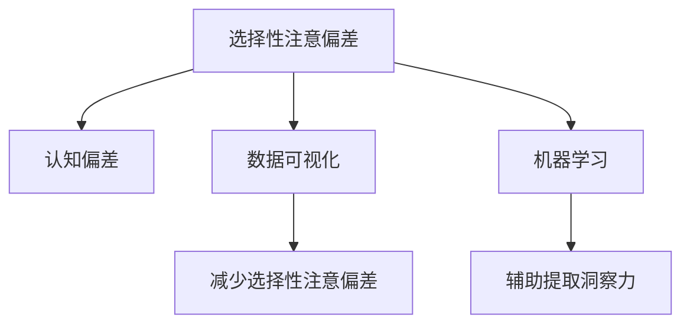

                 

## 1. 背景介绍

在现代信息爆炸的数字化时代，大数据的威力不容小觑。无论是社交媒体上的海量评论，还是商业数据分析中的客户反馈，都为洞察力提供了丰富的数据源。但尽管如此，数据本身的复杂性以及人类认知系统的局限性，使得有效提取和利用洞察力依然是一个极具挑战性的问题。

### 1.1 洞察力概述

洞察力指的是通过观察和理解复杂数据，提取关键信息并作出明智决策的能力。它不仅仅涉及对数据的简单统计分析，更包括对数据的深入理解、模式的识别和趋势的预测。洞察力在商业决策、政策制定、科学研究等诸多领域具有重要意义。

然而，由于数据的多样性和复杂性，洞察力的提取过程常常充满了各种偏差和挑战。常见的偏差包括选择性注意（Selective Attention）偏差，即人们倾向于关注与自己预期一致的数据，而忽略与自己预期不符的部分。这种偏差不仅会影响洞察力的提取，还可能导致决策失误，带来严重的后果。

本文将深入探讨选择性注意偏差及其对洞察力提取的影响，并提出一些有效的方法，帮助避免这种偏差，提高洞察力的准确性和可靠性。

## 2. 核心概念与联系

### 2.1 核心概念概述

为更好地理解洞察力偏差问题，本节将介绍几个密切相关的核心概念：

- **选择性注意偏差（Selective Attention Bias）**：指人们在接收信息时，倾向于关注自己感兴趣或预期中的内容，而忽略或忽视其他重要信息的心理倾向。这种偏差在数据驱动的洞察力提取过程中极为常见，会导致洞察力提取的片面性和误导性。
- **认知偏差（Cognitive Bias）**：指人在思维和判断过程中出现的系统性错误，影响决策的客观性和准确性。选择性注意偏差是认知偏差的一种表现形式。
- **数据可视化（Data Visualization）**：通过图形、图表等方式展示数据，帮助人们更直观、更全面地理解数据的内在规律和关系。高质量的数据可视化可以有效减少选择性注意偏差，提高洞察力的准确性。
- **机器学习（Machine Learning）**：通过算法和模型自动提取和分析数据，发现数据中的模式和规律。机器学习可以辅助人类更全面、更准确地提取洞察力。

这些核心概念之间的逻辑关系可以通过以下Mermaid流程图来展示：



这个流程图展示了大数据驱动下的洞察力提取过程中，选择性注意偏差与其他关键概念之间的关系：

1. 选择性注意偏差会导致认知偏差。
2. 数据可视化可以帮助减少选择性注意偏差。
3. 机器学习可以辅助提取洞察力。

## 3. 核心算法原理 & 具体操作步骤

### 3.1 算法原理概述

选择性注意偏差产生的主要原因是人们倾向于关注自己感兴趣或预期中的内容，而忽略其他重要信息。这种偏差会导致洞察力提取的片面性和误导性。为了解决这个问题，需要从数据可视化和机器学习两个方面进行深入探讨。

### 3.2 算法步骤详解

#### 3.2.1 数据可视化

数据可视化是通过图形、图表等方式展示数据，帮助人们更直观、更全面地理解数据的内在规律和关系。高质量的数据可视化可以有效减少选择性注意偏差，提高洞察力的准确性。以下是数据可视化的主要步骤：

1. 数据准备：对原始数据进行清洗和预处理，去除噪声和异常值，确保数据的完整性和一致性。
2. 选择合适图表：根据数据的类型和分析目标，选择最合适的图表类型，如柱状图、折线图、散点图等。
3. 定制可视化风格：通过调整颜色、字体、标签等元素，使图表更加美观和易读。
4. 交互式可视化：引入交互式元素，如滑块、选择框等，使用户可以动态调整参数，实时查看不同参数下的数据变化。

#### 3.2.2 机器学习

机器学习是通过算法和模型自动提取和分析数据，发现数据中的模式和规律。机器学习可以辅助人类更全面、更准确地提取洞察力。以下是机器学习的主要步骤：

1. 数据预处理：对原始数据进行特征工程，提取有用的特征，如时间、地理位置、类别等。
2. 模型选择：根据数据的类型和分析目标，选择最合适的机器学习模型，如回归模型、分类模型、聚类模型等。
3. 模型训练：使用历史数据对模型进行训练，调整模型的参数，优化模型的性能。
4. 结果分析：对模型训练的结果进行分析，评估模型的准确性和可靠性。
5. 结果应用：将模型应用于新数据，进行预测和分析，提取新的洞察力。

### 3.3 算法优缺点

数据可视化和机器学习在减少选择性注意偏差，提高洞察力提取方面具有显著优势：

**优点**：
- 数据可视化使得数据更加直观易读，减少了选择性注意偏差。
- 机器学习可以自动提取和分析数据，发现数据中的模式和规律，提高洞察力的准确性和全面性。
- 交互式可视化提供了动态调整参数的功能，使用户可以根据不同的需求进行个性化分析。

**缺点**：
- 数据可视化需要人工选择和定制，过程复杂，容易出错。
- 机器学习需要大量的数据和计算资源，算法复杂，对数据质量要求高。

### 3.4 算法应用领域

数据可视化和机器学习在减少选择性注意偏差，提高洞察力提取方面的应用广泛，涵盖以下几个主要领域：

1. **商业决策**：通过数据可视化和机器学习，企业可以更全面、准确地分析市场数据，预测市场需求，制定科学的商业策略。
2. **政策制定**：政府可以通过数据可视化和机器学习，分析社会数据，制定合理的政策，提高治理效率和公共服务质量。
3. **科学研究**：科学家可以通过数据可视化和机器学习，发现科学数据中的模式和规律，推动科学研究的进展。
4. **医疗健康**：医疗机构可以通过数据可视化和机器学习，分析患者数据，提高诊断准确性和治疗效果。
5. **金融分析**：金融机构可以通过数据可视化和机器学习，分析金融市场数据，预测市场趋势，规避金融风险。

## 4. 数学模型和公式 & 详细讲解 & 举例说明

### 4.1 数学模型构建

在本节中，我们将使用数学语言对数据可视化和机器学习在减少选择性注意偏差，提高洞察力提取中的应用进行更加严格的刻画。

设原始数据集为 $D=\{(x_i,y_i)\}_{i=1}^N$，其中 $x_i$ 表示特征向量，$y_i$ 表示标签。我们的目标是使用数据可视化和机器学习模型，提取洞察力 $H$。

数据可视化的目标是将数据 $D$ 映射到可视化结果 $V$，使得 $V$ 直观、易读，并能反映数据的内在规律。可以表示为：

$$
V = f(D)
$$

其中 $f$ 为数据可视化映射函数，可以是图形、图表、动画等形式。

机器学习的目标是通过模型 $M$ 将数据 $D$ 映射到洞察力 $H$，使得 $H$ 能够反映数据的内在规律和趋势。可以表示为：

$$
H = M(D)
$$

其中 $M$ 为机器学习模型，可以是回归模型、分类模型、聚类模型等。

### 4.2 公式推导过程

下面我们以回归模型为例，推导其在减少选择性注意偏差，提高洞察力提取中的作用。

假设回归模型的目标是将数据 $D$ 映射到洞察力 $H$，模型的形式为：

$$
H = M(x) = \beta_0 + \beta_1 x_1 + \beta_2 x_2 + \ldots + \beta_p x_p
$$

其中 $\beta$ 为模型参数，$x_i$ 为特征向量。

数据可视化的目标是将数据 $D$ 映射到可视化结果 $V$，可以表示为：

$$
V = g(D) = (g_1(D), g_2(D), \ldots, g_m(D))
$$

其中 $g_i$ 为可视化映射函数，可以是柱状图、折线图、散点图等形式。

机器学习模型的参数 $\beta$ 可以通过历史数据 $D$ 进行训练，使用梯度下降等优化算法，最小化损失函数：

$$
\min_{\beta} \frac{1}{N} \sum_{i=1}^N (y_i - M(x_i))^2
$$

### 4.3 案例分析与讲解

#### 案例1：商业决策中的数据可视化

某电子商务公司希望通过数据可视化，分析用户行为数据，预测市场需求。他们收集了用户的浏览、购买、评价等数据，使用折线图和散点图进行可视化，展示了不同商品类别的销售额变化趋势和用户评分分布情况。通过这些图表，公司可以更全面、准确地了解市场情况，制定科学的市场营销策略。

#### 案例2：政策制定中的机器学习

某市政府希望通过机器学习，分析社会数据，制定合理的政策，提高治理效率。他们收集了不同地区的犯罪率、失业率、教育水平等数据，使用回归模型对数据进行分析，发现了不同变量之间的内在关联。通过这些分析结果，市政府可以制定更加科学的政策，提高治理效率和社会福利。

## 5. 项目实践：代码实例和详细解释说明

### 5.1 开发环境搭建

在进行数据可视化和机器学习实践前，我们需要准备好开发环境。以下是使用Python进行数据可视化和机器学习的开发环境配置流程：

1. 安装Anaconda：从官网下载并安装Anaconda，用于创建独立的Python环境。

2. 创建并激活虚拟环境：
```bash
conda create -n py38 python=3.8 
conda activate py38
```

3. 安装必要的Python包：
```bash
pip install numpy pandas matplotlib seaborn sklearn tensorflow
```

完成上述步骤后，即可在`py38`环境中开始数据可视化和机器学习的实践。

### 5.2 源代码详细实现

下面我们以回归模型为例，给出使用Scikit-learn库进行机器学习的PyTorch代码实现。

首先，准备数据集：

```python
import pandas as pd
from sklearn.model_selection import train_test_split

# 读取数据集
data = pd.read_csv('data.csv')

# 分割数据集为训练集和测试集
X_train, X_test, y_train, y_test = train_test_split(data.drop('target', axis=1), data['target'], test_size=0.2, random_state=42)
```

然后，构建回归模型：

```python
from sklearn.linear_model import LinearRegression

# 构建线性回归模型
model = LinearRegression()

# 训练模型
model.fit(X_train, y_train)

# 预测测试集
y_pred = model.predict(X_test)
```

接着，绘制回归模型预测结果的散点图：

```python
import matplotlib.pyplot as plt

# 绘制散点图
plt.scatter(X_test, y_test, color='blue', label='Actual')
plt.scatter(X_test, y_pred, color='red', label='Predicted')
plt.xlabel('X')
plt.ylabel('Y')
plt.legend()
plt.show()
```

### 5.3 代码解读与分析

让我们再详细解读一下关键代码的实现细节：

**数据准备**：
- 使用Pandas库读取数据集，并分割为训练集和测试集，确保数据集的完整性和一致性。

**模型构建**：
- 使用Scikit-learn库构建线性回归模型，并使用训练集对模型进行训练，调整模型的参数。

**结果可视化**：
- 使用Matplotlib库绘制散点图，展示模型预测结果与真实标签的对比情况。

**交互式可视化**：
- 可以使用Jupyter Notebook等交互式环境，动态调整模型参数，实时查看不同参数下的模型性能。

### 5.4 运行结果展示

运行上述代码后，会得到一个散点图，展示了模型预测结果与真实标签的对比情况。如果模型性能良好，散点图中的点将较为紧密地围绕在一条直线上。

## 6. 实际应用场景

### 6.1 商业决策

在商业决策中，数据可视化和机器学习可以显著提升洞察力的准确性和全面性。例如，某电商公司使用数据可视化技术，分析用户行为数据，发现某些商品的销售趋势与用户年龄、性别、地理位置等因素有关。通过这些分析结果，公司可以制定更加科学的市场营销策略，提高销售额。

### 6.2 政策制定

政府在制定政策时，需要全面、准确地分析社会数据。数据可视化和机器学习可以帮助政府更全面、准确地分析社会数据，制定合理的政策，提高治理效率。例如，某市政府通过数据分析，发现某些地区的犯罪率与教育水平、经济状况等因素有关，从而制定了针对性的政策，降低了犯罪率。

### 6.3 科学研究

在科学研究中，数据可视化和机器学习可以帮助科学家更全面、准确地分析实验数据，发现科学数据中的模式和规律。例如，某生物学家使用数据可视化技术，分析生物实验数据，发现了某些基因表达与环境因素之间的关系，从而推进了科学研究的发展。

## 7. 工具和资源推荐

### 7.1 学习资源推荐

为了帮助开发者系统掌握数据可视化和机器学习的基本概念和应用技巧，这里推荐一些优质的学习资源：

1. 《Python数据科学手册》（Jake VanderPlas）：一本详细介绍Python数据科学的经典书籍，涵盖了数据可视化和机器学习的基础知识和应用技巧。
2. 《机器学习实战》（Peter Harrington）：一本入门级的机器学习书籍，通过实际案例，介绍了机器学习的基本算法和应用技巧。
3. 《数据可视化实战》（Charles W. Reid）：一本详细介绍数据可视化的书籍，通过实际案例，展示了如何有效地使用数据可视化技术，提高数据分析的效率和准确性。
4. Coursera《机器学习》课程：由斯坦福大学Andrew Ng教授主讲，是机器学习领域的经典课程，涵盖了机器学习的基础知识和应用技巧。
5. Kaggle竞赛：Kaggle平台提供了大量的数据集和竞赛任务，帮助开发者通过实践，提高数据可视化和机器学习的应用技巧。

通过对这些资源的学习实践，相信你一定能够快速掌握数据可视化和机器学习的基本技巧，并应用于实际的项目中。

### 7.2 开发工具推荐

高效的数据可视化和机器学习开发离不开优秀的工具支持。以下是几款常用的工具：

1. Python：作为数据科学和机器学习的主流语言，Python拥有丰富的库和工具，如Pandas、NumPy、Matplotlib等，适合进行数据处理和机器学习开发。
2. R语言：同样是数据科学和机器学习的主流语言，R语言拥有强大的数据可视化库ggplot2、dplyr等，适合进行数据处理和可视化分析。
3. Tableau：一款数据可视化工具，支持多种数据源和可视化类型，适合进行复杂的可视化分析。
4. Jupyter Notebook：一款交互式开发环境，支持Python、R等多种语言，适合进行数据处理和机器学习开发。
5. TensorFlow和PyTorch：两款流行的机器学习框架，支持深度学习模型的开发和训练，适合进行复杂的机器学习任务。

合理利用这些工具，可以显著提升数据可视化和机器学习开发的效率，加快创新迭代的步伐。

### 7.3 相关论文推荐

数据可视化和机器学习的研究源于学界的持续研究。以下是几篇奠基性的相关论文，推荐阅读：

1. "A Framework for Visualization of Large Datasets"（Ellis Horowitz, Robert Shneiderman）：提出了可视化的基本框架，包括数据选择、图表类型、交互式设计等。
2. "Learning to Discover>Slice-and-Dice Structures from Unorganized Data"（He He, Jeff Han）：介绍了通过机器学习发现数据中的内在结构的方法。
3. "Evaluation of machine learning algorithms for market basket analysis"（Haesun Park）：介绍了机器学习算法在市场篮子分析中的应用，展示了机器学习在商业决策中的潜力。
4. "Deep learning for healthcare"（Christian M. Mateus）：介绍了深度学习在医疗健康领域的应用，展示了机器学习在科学研究中的潜力。
5. "Unsupervised Learning with Deep Neural Networks"（Geoffrey Hinton）：介绍了无监督学习在深度学习中的应用，展示了机器学习在政策制定中的潜力。

这些论文代表了大数据驱动下的洞察力提取技术的发展脉络。通过学习这些前沿成果，可以帮助研究者把握学科前进方向，激发更多的创新灵感。

## 8. 总结：未来发展趋势与挑战

### 8.1 总结

本文对数据可视化和机器学习在减少选择性注意偏差，提高洞察力提取的应用进行了全面系统的介绍。首先阐述了选择性注意偏差对洞察力提取的影响，明确了数据可视化和机器学习在减少偏差，提高洞察力准确性方面的重要意义。其次，从原理到实践，详细讲解了数据可视化和机器学习在减少选择性注意偏差，提高洞察力提取中的应用流程，给出了数据可视化和机器学习的完整代码实例。同时，本文还广泛探讨了数据可视化和机器学习在商业决策、政策制定、科学研究等诸多领域的应用前景，展示了其在实践中的巨大潜力。

通过本文的系统梳理，可以看到，数据可视化和机器学习为洞察力的提取提供了强有力的工具，帮助人们在复杂的数据中发现规律和趋势，提高决策的科学性和准确性。未来，随着数据可视化和机器学习技术的不断进步，相信大数据驱动下的洞察力提取将更加高效、全面和可靠，为各行各业的发展提供更坚实的技术支持。

### 8.2 未来发展趋势

展望未来，数据可视化和机器学习在减少选择性注意偏差，提高洞察力提取方面将呈现以下几个发展趋势：

1. **交互式可视化**：未来的数据可视化将更加交互式，允许用户动态调整参数，实时查看不同参数下的数据变化，提高用户的使用体验。
2. **实时可视化**：未来的数据可视化将更加实时，能够实时展示数据的动态变化，帮助用户更全面、准确地理解数据的内在规律。
3. **自动化可视化**：未来的数据可视化将更加自动化，能够自动生成图表和分析报告，减少人工干预，提高数据可视化的效率和准确性。
4. **多模态可视化**：未来的数据可视化将更加多模态，能够结合图像、视频、音频等多种数据类型，提供更加全面、丰富的数据展示。
5. **基于机器学习的可视化**：未来的数据可视化将更多地依赖机器学习算法，能够自动发现数据中的模式和规律，提高可视化分析的深度和精度。

这些趋势将进一步提升数据可视化的效率和准确性，帮助人们在复杂的数据中发现更多的规律和趋势，提高洞察力的提取效果。

### 8.3 面临的挑战

尽管数据可视化和机器学习在减少选择性注意偏差，提高洞察力提取方面已经取得了显著进展，但在迈向更加智能化、普适化应用的过程中，仍面临着诸多挑战：

1. **数据质量**：高质量的数据是数据可视化和机器学习的前提，但数据获取和处理过程中难免存在噪声和异常值，需要进一步提高数据的质量和可靠性。
2. **算法复杂度**：数据可视化和机器学习算法复杂度较高，需要大量的计算资源和专业知识，如何在保证效果的同时，降低算法的复杂度，还需要进一步研究和探索。
3. **用户界面**：交互式可视化和实时可视化需要友好的用户界面，以便用户更直观、更高效地使用，如何设计更简单、更易用的用户界面，仍然是一个重要的研究方向。
4. **隐私保护**：数据可视化和机器学习需要大量的敏感数据，如何保护用户隐私，防止数据泄露，还需要进一步加强数据保护机制。
5. **技术融合**：数据可视化和机器学习需要与其他技术进行深度融合，如区块链、人工智能等，才能真正实现数据驱动的洞察力提取，如何实现技术的融合和协同，还需要更多的实践和探索。

这些挑战需要我们在数据质量、算法设计、用户界面、隐私保护和技术融合等方面进行深入研究和探索，才能真正实现数据驱动的洞察力提取，发挥数据可视化和机器学习的最大潜力。

### 8.4 研究展望

面对数据可视化和机器学习面临的挑战，未来的研究需要在以下几个方面寻求新的突破：

1. **数据增强技术**：通过数据增强技术，提高数据的质量和可靠性，减少噪声和异常值的影响。
2. **轻量级算法**：开发更加轻量级、高效的算法，降低算法的复杂度，提高计算效率。
3. **智能化界面**：设计更简单、更易用的用户界面，提升用户的使用体验。
4. **隐私保护机制**：建立更加完善的隐私保护机制，保护用户数据隐私，防止数据泄露。
5. **技术融合创新**：探索与其他技术的深度融合，实现技术的协同和创新，提高洞察力提取的效果和效率。

这些研究方向的探索，必将引领数据可视化和机器学习技术迈向更高的台阶，为大数据驱动的洞察力提取提供更坚实的技术支持。

## 9. 附录：常见问题与解答

**Q1：选择性注意偏差在实际应用中有什么影响？**

A: 选择性注意偏差在实际应用中会带来诸多影响：
1. **洞察力提取片面**：人们倾向于关注与自己预期一致的数据，忽略其他重要信息，导致洞察力提取的片面性和误导性。
2. **决策失误**：选择性注意偏差会导致人们在分析数据时，忽略重要的异常数据，从而做出错误的决策。
3. **信息不对称**：选择性注意偏差会使得某些数据被忽视，导致信息不对称，影响数据分析的全面性。

**Q2：如何减少选择性注意偏差？**

A: 减少选择性注意偏差可以通过以下几个方法：
1. **数据可视化**：使用数据可视化技术，将数据直观展示，帮助人们更全面、准确地理解数据的内在规律和关系。
2. **多角度分析**：从多个角度对数据进行分析，避免只关注单一角度，提高洞察力的全面性和准确性。
3. **模型融合**：结合多种模型，利用不同的算法对数据进行分析和预测，提高洞察力的可靠性和鲁棒性。
4. **主动学习**：主动选择和处理数据，避免只关注某些特定数据，提高数据处理的全面性。

**Q3：数据可视化有哪些类型？**

A: 数据可视化类型多种多样，常见的有：
1. **柱状图**：适用于展示各类数据之间的对比关系。
2. **折线图**：适用于展示数据随时间的变化趋势。
3. **散点图**：适用于展示两个变量之间的关系。
4. **热力图**：适用于展示数据的分布情况。
5. **地图**：适用于展示地理数据的空间分布。

这些可视化类型可以根据不同的分析目标，选择最适合的类型，帮助人们更全面、准确地理解数据的内在规律和关系。

**Q4：什么是交互式可视化？**

A: 交互式可视化是指允许用户动态调整参数，实时查看不同参数下的数据变化的数据可视化技术。例如，通过滑块调整参数，实时查看不同参数下的数据变化，帮助用户更直观、更全面地理解数据的内在规律和关系。

交互式可视化能够提高用户的使用体验，帮助用户更全面、准确地理解数据的内在规律和关系。

---

作者：禅与计算机程序设计艺术 / Zen and the Art of Computer Programming

