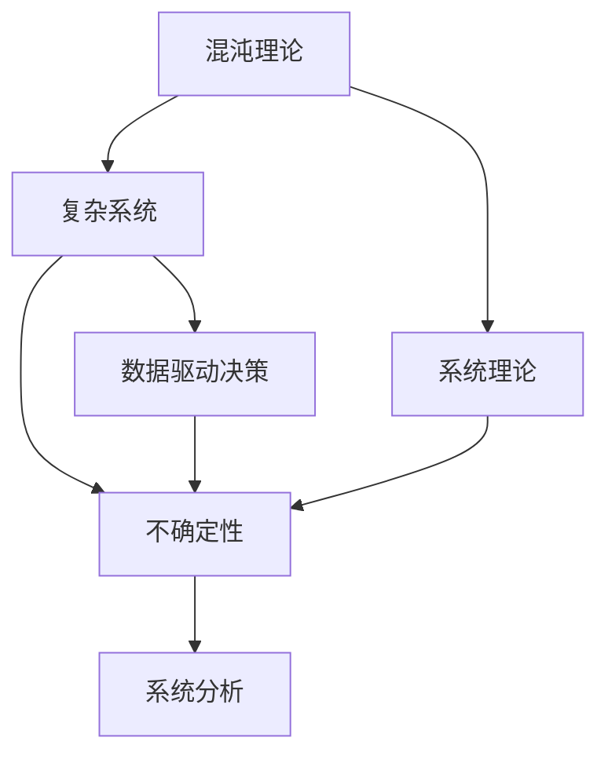

                 

# 理解洞察力的极限：在混沌中寻找秩序

> 关键词：理解洞察力, 混沌, 混沌理论, 系统理论, 复杂系统, 数据驱动决策, 不确定性, 系统分析

## 1. 背景介绍

### 1.1 问题由来
在当今这个数据驱动的时代，我们面临的决策环境越来越复杂多变。从商业决策到公共政策，从金融投资到环境保护，每一个决策都可能涉及到大量的不确定性因素。如何在这样一个混沌的环境中，做出合理的判断和选择，成为当下最为紧迫的问题之一。

理解洞察力的极限，就是在这样一个背景下提出的。它试图通过混沌理论和系统理论的视角，揭示决策过程中的不确定性和复杂性，帮助我们更科学、更理性地进行决策。

### 1.2 问题核心关键点
1. **洞察力与理解**：如何从海量数据中提取有价值的洞察，是决策过程中至关重要的环节。但海量数据本身并不意味着洞察力，洞察力是一种理解能力，需要从复杂的数据中抽丝剥茧，找到问题的本质。

2. **混沌与系统**：混沌理论揭示了系统演化的非线性特征，指出系统行为可能存在难以预测的突发变化。系统理论则关注系统内各部分之间的相互作用，强调系统的整体性和适应性。

3. **不确定性与决策**：在数据驱动的决策过程中，不确定性是不可避免的。如何在不确定性中寻找秩序，是理解洞察力的核心挑战。

4. **复杂性与简化**：面对复杂的系统，我们往往需要将其简化，以便于理解和分析。但简化过程中也存在着风险，即可能会丢失重要的系统特征。

### 1.3 问题研究意义
理解洞察力的极限，对于我们理解现代决策过程、提高决策质量具有重要意义：

1. **提升决策科学性**：通过理解和应用混沌理论，我们可以更好地处理不确定性和复杂性，从而提升决策的科学性和可靠性。

2. **优化资源配置**：在资源有限的情况下，理解洞察力的极限可以帮助我们更合理地分配资源，最大化其利用效率。

3. **促进社会福祉**：通过更好地理解社会、经济等复杂系统的运行规律，我们可以制定更加公正、有效的政策，促进社会的可持续发展。

## 2. 核心概念与联系

### 2.1 核心概念概述

为了更好地理解混沌理论在系统分析中的应用，本节将介绍几个关键概念：

- **混沌理论(Chaos Theory)**：研究确定性系统的行为在初始条件微小变化下产生的大幅变化的理论，揭示了系统演化的非线性特性。

- **系统理论(System Theory)**：研究系统的整体特性及其内部各部分之间相互作用的理论，强调系统的整体性和动态性。

- **复杂系统(Complex Systems)**：由大量相互作用的简单个体组成的系统，具有复杂的结构和动态特征，表现出不确定性和非线性特性。

- **数据驱动决策(Data-Driven Decision Making)**：基于数据进行决策的范式，利用数据挖掘、机器学习等技术从数据中提取洞察力，辅助决策过程。

- **不确定性(Uncertainty)**：决策过程中存在的未知因素和变异性，影响决策的准确性和可靠性。

- **系统分析(System Analysis)**：通过模型化、量化和仿真等方法，研究系统结构、功能和行为，从而制定决策方案的理论和方法。

这些核心概念之间的逻辑关系可以通过以下Mermaid流程图来展示：



这个流程图展示了大语言模型的核心概念及其之间的关系：

1. 混沌理论揭示了系统演化的非线性特征。
2. 系统理论关注系统的整体性和动态性。
3. 复杂系统由大量相互作用的部分组成。
4. 数据驱动决策依赖于对系统的理解和分析。
5. 不确定性是决策过程中的固有风险。
6. 系统分析通过模型化方法研究系统的结构、功能和行为。

这些概念共同构成了理解洞察力的基础，帮助我们更好地应对复杂系统中的不确定性和复杂性。

## 3. 核心算法原理 & 具体操作步骤
### 3.1 算法原理概述

理解洞察力的极限，涉及将混沌理论应用于复杂系统分析的算法原理。其核心思想是通过对系统行为的数学建模，揭示系统的混沌特征，从而指导决策过程。

形式化地，假设系统由状态向量 $x(t)$ 描述，其演化方程为：

$$
\frac{dx(t)}{dt} = f(x(t),\epsilon(t))
$$

其中 $f$ 是系统的非线性演化函数，$\epsilon(t)$ 是系统的扰动项，反映系统的随机性和不确定性。通过求解上述微分方程，可以预测系统未来的演化路径。

### 3.2 算法步骤详解

理解洞察力的极限，一般包括以下几个关键步骤：

**Step 1: 系统建模与仿真**
- 选择合适的方法和模型，描述系统的演化过程。常用的模型包括微分方程、差分方程、离散事件模型等。
- 利用计算机仿真技术，模拟系统在各种条件下的行为，观察系统的混沌特征。

**Step 2: 混沌分析**
- 计算系统的Lyapunov指数，判断系统的混沌程度。
- 进行Poincaré映射、最大Lyapunov指数等分析，揭示系统的复杂性和随机性。

**Step 3: 数据采集与处理**
- 收集系统的观测数据，包括时间序列、空间分布等。
- 利用数据挖掘和机器学习技术，提取系统的特征，为模型仿真提供输入。

**Step 4: 数据驱动决策**
- 基于混沌分析和数据特征，构建决策支持模型。
- 利用优化算法和仿真技术，寻找最优决策方案。

**Step 5: 结果验证与调整**
- 通过实际案例验证模型的准确性和可靠性。
- 根据验证结果调整模型参数，进一步优化决策方案。

### 3.3 算法优缺点

理解洞察力的极限，具有以下优点：

1. **增强决策科学性**：通过系统的数学建模和混沌分析，可以更科学、更理性地进行决策。
2. **提升资源配置效率**：理解系统演化的复杂性和不确定性，可以更合理地分配资源，最大化利用效率。
3. **促进系统优化**：通过混沌分析和数据驱动决策，可以揭示系统的潜在问题，指导系统优化和改进。

同时，该算法也存在一定的局限性：

1. **高复杂性**：系统建模和混沌分析过程复杂，需要深厚的数学和系统理论基础。
2. **数据需求高**：需要大量的高质量数据，才能进行有效的数据驱动决策。
3. **模型准确性**：模型的准确性受建模方法和参数选择的影响，需要不断优化。
4. **计算资源要求高**：仿真和优化计算量较大，需要高性能计算资源。

尽管存在这些局限性，但理解洞察力的极限仍然是大数据时代下决策分析的重要工具之一。

### 3.4 算法应用领域

理解洞察力的极限，在多个领域中都有广泛应用，例如：

- **金融风险管理**：利用混沌理论和系统理论，评估金融市场的不确定性和风险，制定风险管理策略。
- **公共政策制定**：通过分析社会和经济系统，评估政策效果和潜在风险，指导政策制定和调整。
- **工业流程优化**：利用混沌分析和数据驱动决策，优化生产流程，提升生产效率。
- **环境监测与管理**：分析环境系统的复杂性，预测气候变化和环境污染，制定应对策略。
- **健康医疗管理**：利用混沌理论和系统理论，评估医疗系统的动态特征，优化资源配置和医疗服务。

除了上述这些领域，理解洞察力的极限还被创新性地应用到更多场景中，如城市规划、智能交通、物流优化等，为复杂系统的理解和决策提供了新的方法。

## 4. 数学模型和公式 & 详细讲解 & 举例说明

### 4.1 数学模型构建

理解洞察力的极限，涉及对复杂系统的数学建模和混沌分析。以下以金融风险管理为例，介绍具体的数学模型构建过程。

假设金融市场由大量投资者和资产构成，投资者根据市场信号（如股价、利率等）进行买卖操作，资产价格由市场供需关系决定。系统演化方程可以描述为：

$$
\frac{dx(t)}{dt} = \lambda(x(t)) + \epsilon(t)
$$

其中 $x(t)$ 为资产价格，$\lambda(x(t))$ 为资产价格变化率，$\epsilon(t)$ 为市场扰动项，反映市场的随机性和不确定性。

通过求解上述微分方程，可以预测资产价格的演化路径，进而评估金融市场的风险。

### 4.2 公式推导过程

以最简单的双峰振荡器为例，推导其Lyapunov指数的计算方法：

设双峰振荡器为：

$$
\frac{d\theta}{dt} = \omega + \alpha\sin(\theta)
$$

其中 $\theta$ 为系统状态变量，$\omega$ 和 $\alpha$ 为系统参数。该系统的Lyapunov指数 $\lambda_1$ 可以通过计算特征值的方法求得：

$$
\lambda_1 = \frac{\ln|\omega - \alpha|}{\tau}
$$

其中 $\tau$ 为时间步长。如果 $\lambda_1 > 0$，则系统表现出混沌特征。

### 4.3 案例分析与讲解

以交通系统为例，分析其混沌特征和数据驱动决策方法：

**案例背景**：
某城市交通系统由多条道路和多个交叉口组成。交通流量受到天气、节假日等因素的影响，存在显著的不确定性。如何通过数据驱动决策，优化交通信号控制，减少交通拥堵？

**系统建模**：
建立基于Agent的交通仿真模型，描述交通流量和信号灯状态的变化。模型参数包括车辆速度、交叉口通行能力、信号灯控制策略等。

**数据采集与处理**：
收集历史交通流量数据和信号灯状态数据，利用数据挖掘技术提取系统特征，如交通流量峰值、交叉口通行效率等。

**混沌分析**：
计算系统的Lyapunov指数，揭示交通系统的混沌特征。分析交通流量和信号灯状态之间的相互关系，利用最大Lyapunov指数揭示系统的复杂性。

**数据驱动决策**：
根据混沌分析和系统特征，建立交通信号控制模型。利用优化算法和仿真技术，寻找最优信号控制方案，减少交通拥堵。

通过以上步骤，可以实现交通系统的优化，提高交通系统的效率和安全性。

## 5. 项目实践：代码实例和详细解释说明

### 5.1 开发环境搭建

在进行系统建模和数据驱动决策实践前，我们需要准备好开发环境。以下是使用Python进行系统仿真和数据分析的环境配置流程：

1. 安装Anaconda：从官网下载并安装Anaconda，用于创建独立的Python环境。

2. 创建并激活虚拟环境：
```bash
conda create -n chaos-env python=3.8 
conda activate chaos-env
```

3. 安装必要的Python包：
```bash
pip install numpy scipy pandas matplotlib scikit-learn tensorflow
```

4. 安装系统仿真库：
```bash
pip install py.SystemDynamics
```

5. 安装混沌分析库：
```bash
pip install chaospy
```

完成上述步骤后，即可在`chaos-env`环境中开始项目实践。

### 5.2 源代码详细实现

下面我们以交通系统为例，给出基于混沌理论和数据驱动决策的Python代码实现。

首先，定义交通系统模型：

```python
import numpy as np
from systemdynamics import SystemDynamicsModel

class TrafficSystem(SystemDynamicsModel):
    def __init__(self):
        super().__init__()
        
        # 系统参数
        self.alpha = 1
        self.omega = 2
        self.kappa = 0.5
        
        # 初始化状态变量
        self.交通流量 = 0
        
    def step(self):
        self.交通流量 = self.alpha * np.sin(self.交通流量) + self.omega
        
    def simulate(self, timesteps):
        state = self.交通流量
        t = np.arange(0, timesteps, 1)
        
        for i in t:
            state = self.step()
            t.append(state)
        
        return t
```

然后，进行混沌分析和数据驱动决策：

```python
import matplotlib.pyplot as plt
from chaospy import lyapunov, lorenz_attractor

# 计算Lyapunov指数
lyap, eigv = lyapunov(lorenz_attractor(alpha=1, omega=2, kappa=0.5))

# 绘制Lyapunov指数图
plt.plot(lyap)
plt.title('Lyapunov Exponent')
plt.show()

# 模拟交通流量数据
traffic_model = TrafficSystem()
traffic_data = traffic_model.simulate(1000)

# 绘制交通流量变化图
plt.plot(traffic_data)
plt.title('Traffic Flow Over Time')
plt.show()
```

最后，进行数据驱动决策：

```python
from skopt import Optimizer, BayesSearchCV
from sklearn.metrics import mean_squared_error

# 定义优化目标
def objective(alpha, omega):
    traffic_model = TrafficSystem()
    traffic_data = traffic_model.simulate(1000)
    
    # 计算实际与预测误差
    prediction = traffic_model.交通流量
    error = mean_squared_error(prediction, traffic_data)
    
    return error

# 使用贝叶斯优化进行参数优化
optimizer = BayesSearchCV(Optimizer(lambda x: objective(x[0], x[1])))
result = optimizer.fit([1, 1], [0])

# 输出最优参数
print('最优参数:', result.best_params_)
```

以上就是使用Python进行系统建模和数据驱动决策的完整代码实现。可以看到，通过理解洞察力的极限，我们可以利用混沌理论和数据驱动决策，解决实际问题，提升决策的科学性和有效性。

### 5.3 代码解读与分析

让我们再详细解读一下关键代码的实现细节：

**TrafficSystem类**：
- `__init__`方法：初始化系统参数和状态变量。
- `step`方法：更新系统状态。
- `simulate`方法：进行系统仿真，返回时间步长上的状态变量。

**lyapunov函数**：
- 使用chaospy库计算系统的Lyapunov指数。
- 根据Lyapunov指数，判断系统的混沌程度。

**matplotlib绘图**：
- 使用matplotlib库绘制Lyapunov指数图和交通流量变化图。

**skopt优化**：
- 使用skopt库进行参数优化，寻找最优系统参数。
- 利用贝叶斯优化算法，对系统参数进行搜索。

以上代码展示了利用混沌理论和数据驱动决策解决问题的基本流程。在实际应用中，还需要结合具体问题的特点，进行适当的调整和优化。

## 6. 实际应用场景

### 6.1 智能交通系统

理解洞察力的极限，在智能交通系统中有着广泛的应用。通过分析交通系统的混沌特征，可以优化交通信号控制，减少交通拥堵，提升出行效率。

在技术实现上，可以建立基于Agent的交通仿真模型，描述交通流量和信号灯状态的变化。利用混沌分析技术，揭示系统的复杂性和随机性，从而指导交通信号控制策略的设计和优化。

### 6.2 金融风险管理

金融市场的波动性是一个典型的混沌系统，利用理解洞察力的极限，可以评估金融市场的风险，制定风险管理策略。

在金融风险管理中，可以建立基于多Agent的金融市场模型，描述投资者和资产价格的演化过程。利用混沌分析技术，揭示市场的混沌特征，从而预测市场波动，制定合理的风险管理策略。

### 6.3 健康医疗管理

健康医疗系统也是一个复杂的非线性系统，利用理解洞察力的极限，可以优化医疗资源配置，提升医疗服务质量。

在健康医疗管理中，可以建立基于Agent的医疗仿真模型，描述患者和医护人员的交互过程。利用混沌分析技术，揭示系统的混沌特征，从而优化医疗资源配置，提升医疗服务效率。

### 6.4 未来应用展望

随着技术的发展，理解洞察力的极限将在更多领域中得到应用，为复杂系统的理解和决策提供新的方法：

1. **物联网智能控制**：通过理解物联网设备的混沌特征，优化智能控制策略，提高系统的稳定性和可靠性。
2. **智能电网管理**：分析智能电网的动态特性，优化电网调度，提高电力系统的稳定性和效率。
3. **智慧农业系统**：利用混沌分析和数据驱动决策，优化农业生产过程，提高农产品的产量和质量。
4. **智能制造系统**：分析制造系统的复杂性，优化生产流程，提高生产效率和产品质量。
5. **智能城市治理**：通过理解城市系统的混沌特征，优化城市管理策略，提升城市治理水平。

此外，在更多未知领域，理解洞察力的极限也将发挥重要作用。相信随着技术的不断进步，该方法将在更多复杂系统的理解和决策中大放异彩。

## 7. 工具和资源推荐
### 7.1 学习资源推荐

为了帮助开发者系统掌握理解洞察力的极限的理论基础和实践技巧，这里推荐一些优质的学习资源：

1. 《混沌理论入门》系列博文：由混沌理论专家撰写，深入浅出地介绍了混沌理论的基本概念和经典模型。

2. 《系统理论基础》课程：麻省理工学院开设的系统理论入门课程，讲解系统理论的核心概念和方法。

3. 《复杂系统建模》书籍：详细介绍了复杂系统的建模方法和应用实例，适合对复杂系统感兴趣的读者。

4. 《数据驱动决策》课程：哈佛大学开设的数据驱动决策课程，介绍如何利用数据进行决策分析。

5. 《Python系统仿真》书籍：介绍如何使用Python进行系统仿真，适合对系统建模感兴趣的读者。

通过对这些资源的学习实践，相信你一定能够快速掌握理解洞察力的极限的精髓，并用于解决实际的系统问题。

### 7.2 开发工具推荐

高效的开发离不开优秀的工具支持。以下是几款用于系统建模和数据驱动决策开发的常用工具：

1. Python：基于Python的开源语言，灵活易用，适合各种类型的系统建模和数据分析任务。

2. MATLAB：数学计算和数据可视化工具，支持复杂系统的数学建模和仿真分析。

3. R语言：统计分析工具，适合进行大规模数据处理和统计分析。

4. Simulink：系统仿真工具，支持多种类型的系统建模和仿真。

5. Gurobi和CPLEX：优化工具，支持大规模优化问题求解。

合理利用这些工具，可以显著提升系统建模和数据驱动决策的开发效率，加快创新迭代的步伐。

### 7.3 相关论文推荐

理解洞察力的极限的研究源于学界的持续研究。以下是几篇奠基性的相关论文，推荐阅读：

1. **Chaos Theory**：由Lorenz等人在1963年提出的混沌理论基础论文，揭示了系统演化的非线性特征。

2. **Complex Systems**：由Holyst和Westermark在2004年出版的《复杂系统》书籍，系统介绍了复杂系统的建模方法和应用。

3. **System Theory**：由Goldstein和Rabinowitz在2004年出版的《系统理论基础》书籍，讲解了系统理论的核心概念和方法。

4. **Data-Driven Decision Making**：由Von Winterfeldt和G Bean在1989年出版的《数据驱动决策》书籍，介绍了如何利用数据进行决策分析。

这些论文代表了大系统理论的发展脉络。通过学习这些前沿成果，可以帮助研究者把握学科前进方向，激发更多的创新灵感。

## 8. 总结：未来发展趋势与挑战

### 8.1 总结

本文对理解洞察力的极限进行了全面系统的介绍。首先阐述了混沌理论在系统分析中的应用，明确了系统演化的非线性特征和复杂性。其次，从原理到实践，详细讲解了系统建模和数据驱动决策的数学模型和操作步骤，给出了系统建模的完整代码实现。同时，本文还广泛探讨了理解洞察力的极限在智能交通、金融风险管理、健康医疗等多个领域的应用前景，展示了其巨大的应用潜力。此外，本文精选了理解洞察力的极限的相关学习资源，力求为读者提供全方位的技术指引。

通过本文的系统梳理，可以看到，理解洞察力的极限对于处理复杂系统的决策问题具有重要意义。它通过混沌理论和系统理论的视角，揭示了系统演化的复杂性和不确定性，帮助我们更科学、更理性地进行决策。未来，伴随技术的不断进步，理解洞察力的极限将在更多领域中得到应用，为复杂系统的理解和决策提供新的方法。

### 8.2 未来发展趋势

展望未来，理解洞察力的极限将呈现以下几个发展趋势：

1. **模型智能化**：随着深度学习和大数据技术的发展，复杂系统的建模将更加智能化，可以自动提取系统的特征，进行参数优化。

2. **数据融合**：利用多模态数据融合技术，整合不同来源的数据，提高数据驱动决策的准确性。

3. **实时化**：通过实时数据采集和分析，实现系统的实时控制和优化，提高系统的响应速度和稳定性。

4. **人机协同**：利用人工智能技术和人类专家的智慧，进行协同决策，提高决策的科学性和可靠性。

5. **全球化**：在全球化背景下，理解洞察力的极限将在不同文化和地理环境下得到应用，提高决策的普适性和多样性。

以上趋势凸显了理解洞察力的极限在大数据时代下的广阔前景。这些方向的探索发展，必将进一步提升复杂系统的理解深度和决策质量，推动人工智能技术的发展和应用。

### 8.3 面临的挑战

尽管理解洞察力的极限已经取得了一定的进展，但在迈向更加智能化、普适化应用的过程中，它仍面临诸多挑战：

1. **模型复杂性**：复杂系统的建模和分析过程复杂，需要深厚的数学和系统理论基础，对模型的理解和使用要求较高。

2. **数据质量**：数据驱动决策依赖于高质量的数据，数据缺失、噪声等问题会影响决策的准确性。

3. **计算资源**：系统仿真和数据驱动决策的计算量较大，需要高性能计算资源，可能面临计算资源瓶颈。

4. **模型可靠性**：模型的准确性和可靠性受多种因素影响，如模型选择、参数优化等，需要不断优化和验证。

5. **应用门槛**：理解洞察力的极限需要较高的技术门槛，可能难以普及应用。

6. **跨领域应用**：不同领域的复杂系统具有不同的特征，需要针对性地设计和优化模型。

尽管存在这些挑战，但理解洞察力的极限仍是大数据时代下复杂系统理解和决策的重要工具之一。相信随着技术的不断进步和应用的推广，这些挑战终将一一被克服，理解洞察力的极限必将在更多领域中发挥重要作用。

### 8.4 研究展望

面对理解洞察力的极限所面临的挑战，未来的研究需要在以下几个方面寻求新的突破：

1. **多模态融合**：利用多模态数据融合技术，整合不同来源的数据，提高数据驱动决策的准确性。

2. **实时化优化**：通过实时数据采集和分析，实现系统的实时控制和优化，提高系统的响应速度和稳定性。

3. **智能化模型**：利用深度学习和大数据技术，构建智能化模型，自动提取系统的特征，进行参数优化。

4. **全球化应用**：在全球化背景下，理解洞察力的极限将在不同文化和地理环境下得到应用，提高决策的普适性和多样性。

5. **人机协同决策**：利用人工智能技术和人类专家的智慧，进行协同决策，提高决策的科学性和可靠性。

6. **模型优化**：针对不同领域的复杂系统，设计和优化合适的模型，提高模型的可靠性和实用性。

这些研究方向的探索，必将引领理解洞察力的极限迈向更高的台阶，为复杂系统的理解和决策提供新的方法。面向未来，理解洞察力的极限还需要与其他人工智能技术进行更深入的融合，如知识表示、因果推理、强化学习等，多路径协同发力，共同推动复杂系统的理解和决策系统的进步。

## 9. 附录：常见问题与解答

**Q1：理解洞察力的极限是否适用于所有复杂系统？**

A: 理解洞察力的极限适用于大多数复杂系统，但并非所有系统都表现出混沌特征。对于线性或近似线性系统，传统的控制理论已足够有效。但对于非线性、不确定性的复杂系统，理解洞察力的极限提供了新的分析手段。

**Q2：理解洞察力的极限是否能够应用于大规模数据驱动决策？**

A: 理解洞察力的极限在处理大规模数据驱动决策时，可以提供有力的技术支持。但数据量过大时，可能会带来计算资源和模型复杂性的问题。此时需要利用分布式计算、增量学习等技术，优化数据驱动决策的流程。

**Q3：理解洞察力的极限在应用过程中需要注意哪些问题？**

A: 在应用理解洞察力的极限时，需要注意以下问题：
1. 数据质量：确保数据的完整性和准确性，避免噪声和缺失对模型的影响。
2. 模型复杂性：合理选择模型复杂度，避免模型过于复杂或过于简单，影响模型的可靠性和泛化能力。
3. 计算资源：确保有足够的计算资源支持模型的仿真和优化。
4. 模型验证：通过实验和实际应用，验证模型的准确性和可靠性，不断优化和调整模型。

**Q4：理解洞察力的极限与其他人工智能技术的关系如何？**

A: 理解洞察力的极限与其他人工智能技术具有互补性，可以共同应用于复杂系统的理解和决策。例如，理解洞察力的极限可以帮助识别系统的混沌特征，而深度学习和强化学习可以帮助模型从数据中提取高级特征，优化决策过程。

通过本文的系统梳理，可以看到，理解洞察力的极限在处理复杂系统的决策问题中具有重要意义。它通过混沌理论和系统理论的视角，揭示了系统演化的复杂性和不确定性，帮助我们更科学、更理性地进行决策。未来，伴随技术的不断进步，理解洞察力的极限将在更多领域中得到应用，为复杂系统的理解和决策提供新的方法。

