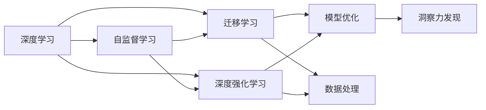
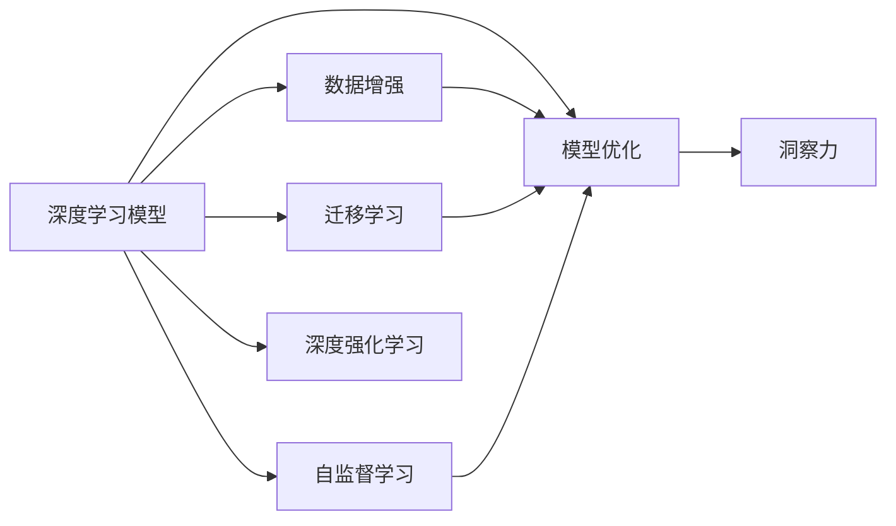

                 

## 1. 背景介绍

在现代信息社会中，数据无处不在。从互联网的搜索记录、社交媒体的评论，到传感器的信号、购物平台的用户点击，大量的数据充斥着我们的生活。数据量的激增带来了两个显著变化：一方面，数据的获取成本降低，数据种类和来源丰富多样；另一方面，数据的复杂性急剧上升，呈现出多样性、异构性和动态性的特征。在这种背景下，如何从海量数据中提取有价值的洞察力，成为了人工智能领域一个核心问题。

### 1.1 问题由来
从人工智能的角度看，洞察力指的是从数据中学习到潜在的模式、结构、趋势和规律。在传统的统计分析、机器学习、数据挖掘等领域，洞察力的发现往往依赖于对数据的统计建模和特征工程，但面对大规模、复杂的数据集，这些方法已经难以满足需求。近年来，深度学习技术，特别是神经网络的发展，为从数据中提取洞察力提供了新的思路。

深度学习模型能够通过多层非线性变换学习到数据的复杂表示，从原始数据中提取出高层次的抽象特征，进而发现数据中的潜在模式。但面对高度异构、动态变化的数据，传统的深度学习模型也面临挑战：
- **数据复杂性**：数据类型多样，结构复杂，异构性高，数据分布不均衡。
- **模型性能**：深度模型往往参数量大，计算复杂度高，难以高效训练和部署。
- **计算资源**：模型规模和数据规模不断增大，对计算资源的需求也在不断增长。

这些问题促使我们思考：如何更高效、更准确地从数据中提取洞察力？本文将从深度学习的角度，探讨如何在复杂、动态的数据环境中寻找洞察力的新方法。

### 1.2 问题核心关键点
深度学习中的洞察力发现，核心在于两个方面：
1. **模型优化**：设计高效的神经网络模型，学习数据中的复杂结构。
2. **数据处理**：利用数据增强、迁移学习等技术，提高模型的泛化能力和适应性。

本文将从这两个核心点出发，分别介绍当前深度学习中洞察力发现的方法和应用。

## 2. 核心概念与联系

### 2.1 核心概念概述

为了深入理解如何在复杂数据环境中寻找洞察力，我们先定义几个核心概念：

- **深度学习**：一种基于多层神经网络的机器学习技术，能够自动学习数据的复杂表示，适用于处理结构化、非结构化数据。
- **自监督学习**：一种无监督学习范式，利用未标注数据，自动生成监督信号，学习数据中的内在结构。
- **迁移学习**：一种机器学习范式，通过在源任务上训练的模型，在新任务上进行微调，以利用源任务的先验知识。
- **深度强化学习**：一种结合深度学习和强化学习的技术，通过在模拟环境中训练智能体，学习数据中的动态行为。

这些概念在深度学习中扮演重要角色，共同构成了从数据中提取洞察力的基础框架。下面通过一个Mermaid流程图来展示这些概念之间的联系：



这个流程图展示了深度学习中的核心概念及其关联关系：
- 自监督学习、迁移学习和深度强化学习通过不同的方式，辅助深度学习模型学习数据中的内在结构。
- 模型优化和数据处理是洞察力发现的两个关键环节，前者通过改进模型结构提高学习效率，后者通过数据增强、迁移学习等技术提升模型泛化能力。
- 洞察力发现是最终目标，通过优化后的模型对数据进行推理，提取有价值的信息。

### 2.2 核心概念原理和架构的 Mermaid 流程图



该流程图展示了深度学习模型在提取洞察力过程中的主要流程。其中，模型优化和数据增强是模型训练的两个主要过程，迁移学习和自监督学习是数据预处理的两大手段，而深度强化学习则是处理动态数据的关键技术。

## 3. 核心算法原理 & 具体操作步骤

### 3.1 算法原理概述

深度学习中的洞察力发现，本质上是利用神经网络模型从数据中学习到潜在的模式、结构、趋势和规律。这通常通过两个关键步骤实现：
1. **模型训练**：在给定的数据集上，通过反向传播算法更新模型参数，使得模型能够逼近数据生成分布。
2. **模型推理**：在新的数据集上，利用训练好的模型进行前向传播，输出模型对数据的预测或推理结果，进而发现数据中的潜在洞察力。

### 3.2 算法步骤详解

下面详细介绍深度学习中洞察力发现的核心算法步骤：

**Step 1: 数据预处理**
- 对原始数据进行清洗、归一化、特征工程等预处理步骤，准备数据集。
- 选择合适的损失函数，如交叉熵、均方误差等。

**Step 2: 模型训练**
- 设计神经网络模型，选择合适的深度层次、激活函数、优化器等。
- 在训练集上进行前向传播和反向传播，更新模型参数。
- 使用验证集监控模型性能，避免过拟合。
- 设定合适的学习率、批量大小、迭代次数等超参数。

**Step 3: 模型推理**
- 在测试集或真实数据上进行前向传播，得到模型对数据的预测或推理结果。
- 分析模型输出，提取数据中的潜在模式、结构、趋势和规律。

**Step 4: 洞察力验证**
- 对模型推理结果进行可视化、统计分析等操作，评估模型性能。
- 结合领域知识和专家经验，对模型的推理结果进行验证和解释。

### 3.3 算法优缺点

深度学习中的洞察力发现方法，具有以下优点：
1. **高效性**：利用神经网络自动学习数据中的复杂表示，能够高效处理大规模数据集。
2. **适应性**：通过迁移学习、自监督学习等技术，能够适应不同领域、不同类型的数据。
3. **灵活性**：通过深度强化学习，能够处理动态变化的数据，发现数据中的动态行为模式。

同时，也存在一些缺点：
1. **计算资源需求高**：深度模型参数量大，计算复杂度高，需要高性能计算资源支持。
2. **模型可解释性不足**：深度模型通常被视为“黑盒”，难以解释其内部工作机制和推理逻辑。
3. **数据隐私问题**：深度学习模型训练过程中需要大量的数据，存在数据隐私和安全问题。

### 3.4 算法应用领域

深度学习中的洞察力发现方法，已经在多个领域得到了广泛应用，例如：

- **自然语言处理**：利用语言模型、序列到序列模型等技术，发现文本中的语义模式、情感倾向等。
- **计算机视觉**：利用卷积神经网络等技术，发现图像中的特征、对象、场景等。
- **医疗诊断**：利用深度学习模型，发现医疗影像中的病变区域、病理特征等。
- **金融分析**：利用时间序列模型、深度学习模型等技术，发现股票价格、市场趋势等。
- **工业制造**：利用传感器数据，发现设备故障、生产异常等。

## 4. 数学模型和公式 & 详细讲解 & 举例说明

### 4.1 数学模型构建

深度学习中的洞察力发现，主要通过构建神经网络模型来实现。这里以一个简单的多层感知机(MLP)模型为例，展示其数学模型构建过程。

设输入数据 $x \in \mathbb{R}^d$，输出 $y \in \mathbb{R}^k$，模型参数为 $\theta$，包括权重矩阵和偏置项。模型的输出公式为：

$$
\hat{y} = \sigma(W^{(1)}x + b^{(1)})^{[1]}W^{(2)} + b^{(2)}
$$

其中，$\sigma$ 为激活函数，$W^{(1)}$、$W^{(2)}$ 为权重矩阵，$b^{(1)}$、$b^{(2)}$ 为偏置项。模型的损失函数为：

$$
\mathcal{L}(\theta) = \frac{1}{N}\sum_{i=1}^N \|y_i - \hat{y}_i\|^2
$$

### 4.2 公式推导过程

下面详细介绍深度学习模型中常见的激活函数、损失函数、优化器等概念的数学推导。

**激活函数**：激活函数 $\sigma$ 通常采用ReLU函数，其数学定义为：

$$
\sigma(z) = \max(0,z)
$$

**损失函数**：交叉熵损失函数 $\mathcal{L}$ 的数学推导如下：

$$
\mathcal{L}(y,\hat{y}) = -\frac{1}{N}\sum_{i=1}^N(y_i \log \hat{y}_i + (1-y_i) \log(1-\hat{y}_i))
$$

**优化器**：常用的梯度下降优化器，包括标准梯度下降(SGD)、动量梯度下降(Momentum)、自适应梯度下降(Adagrad)、Adam等。其更新公式为：

$$
\theta \leftarrow \theta - \eta \nabla_{\theta}\mathcal{L}(\theta)
$$

其中，$\eta$ 为学习率，$\nabla_{\theta}\mathcal{L}(\theta)$ 为损失函数对参数 $\theta$ 的梯度。

### 4.3 案例分析与讲解

以文本分类任务为例，展示深度学习模型的应用。设输入为文本 $x$，输出为分类标签 $y$，模型为神经网络。训练集数据 $D=\{(x_i,y_i)\}_{i=1}^N$，损失函数为交叉熵损失，优化器为Adam。训练步骤如下：

1. 数据预处理：对文本进行分词、向量化处理，得到输入 $x$ 和标签 $y$。
2. 模型定义：定义多层感知机模型，包括输入层、隐藏层、输出层。
3. 模型训练：在训练集 $D$ 上，使用Adam优化器，最小化交叉熵损失。
4. 模型推理：在测试集上，使用训练好的模型进行前向传播，得到分类结果 $\hat{y}$。
5. 洞察力验证：分析分类结果，提取文本中的分类模式、情感倾向等。

## 5. 项目实践：代码实例和详细解释说明

### 5.1 开发环境搭建

在进行深度学习模型训练和推理前，需要准备好开发环境。以下是使用Python进行TensorFlow开发的环境配置流程：

1. 安装Anaconda：从官网下载并安装Anaconda，用于创建独立的Python环境。
2. 创建并激活虚拟环境：
```bash
conda create -n tf-env python=3.8 
conda activate tf-env
```
3. 安装TensorFlow：根据CUDA版本，从官网获取对应的安装命令。例如：
```bash
conda install tensorflow -c conda-forge
```
4. 安装各类工具包：
```bash
pip install numpy pandas scikit-learn matplotlib tqdm jupyter notebook ipython
```

完成上述步骤后，即可在`tf-env`环境中开始深度学习实践。

### 5.2 源代码详细实现

下面我们以文本分类任务为例，给出使用TensorFlow进行神经网络模型训练和推理的代码实现。

首先，定义模型和数据处理函数：

```python
import tensorflow as tf
from tensorflow.keras import layers, models
import numpy as np

# 定义模型
model = models.Sequential([
    layers.Embedding(input_dim=10000, output_dim=16),
    layers.LSTM(32),
    layers.Dense(5, activation='softmax')
])

# 数据预处理
def preprocess_text(text):
    tokenizer = tf.keras.preprocessing.text.Tokenizer(num_words=10000)
    tokenizer.fit_on_texts(text)
    sequences = tokenizer.texts_to_sequences(text)
    padded_sequences = tf.keras.preprocessing.sequence.pad_sequences(sequences, padding='post', maxlen=256)
    return padded_sequences, tokenizer.word_index

# 加载数据
texts = ['some text data', 'more text data']
labels = [0, 1]

padded_texts, word_index = preprocess_text(texts)
```

然后，定义模型训练和推理函数：

```python
# 定义交叉熵损失函数
def binary_crossentropy(y_true, y_pred):
    return tf.keras.losses.BinaryCrossentropy(from_logits=True)(y_true, y_pred)

# 定义优化器
optimizer = tf.keras.optimizers.Adam(learning_rate=0.001)

# 训练模型
model.compile(optimizer=optimizer, loss=binary_crossentropy)
model.fit(x=padded_texts, y=labels, epochs=10, batch_size=32)

# 推理模型
test_texts = ['text data for prediction']
padded_test_texts, _ = preprocess_text(test_texts)
predictions = model.predict(padded_test_texts)
```

最后，运行训练和推理过程：

```python
model.summary()
train_loss, train_acc = model.evaluate(x=padded_texts, y=labels, batch_size=32)
print('Train loss:', train_loss)
print('Train acc:', train_acc)
print('Test predictions:', predictions)
```

以上代码实现了使用TensorFlow进行文本分类任务的神经网络模型训练和推理。可以看到，TensorFlow的Keras API使得模型的定义、训练和推理过程非常简洁和易于理解。

### 5.3 代码解读与分析

让我们再详细解读一下关键代码的实现细节：

**模型定义**：
- `Sequential`：构建线性堆叠的神经网络模型，通过添加`Embedding`、`LSTM`、`Dense`等层实现文本分类。
- `Embedding`：将输入文本转换为稠密向量，输入维度为10000，输出维度为16。
- `LSTM`：处理文本序列数据，隐藏层单元数为32。
- `Dense`：输出分类结果，共有5个神经元，激活函数为softmax。

**数据预处理**：
- `Tokenizer`：将文本转换为数字序列，使用单词表（word index）进行编码。
- `pad_sequences`：对序列进行填充，保证序列长度一致。

**训练过程**：
- `compile`：配置优化器和损失函数。
- `fit`：在训练集上训练模型，设定epoch数和batch size。
- `evaluate`：在测试集上评估模型性能。

**推理过程**：
- `predict`：在新的文本数据上，进行前向传播预测分类结果。

通过以上代码，可以看出TensorFlow的Keras API使得深度学习模型的训练和推理过程非常便捷和高效。开发者可以关注于模型设计和数据处理，而不必过多关注底层实现细节。

## 6. 实际应用场景

### 6.1 金融风险管理

在金融领域，洞察力发现具有重要应用价值。通过深度学习模型，可以从大量的交易数据中学习到市场趋势、风险因子、异常交易等，为风险管理提供决策依据。

具体而言，可以利用深度学习模型对历史交易数据进行建模，预测未来价格变化。通过时间序列分析、深度学习等技术，可以发现市场中的异常交易行为，及时预警潜在的市场风险。此外，还可以利用深度学习模型进行信用评估，预测客户的违约风险，为信贷决策提供支持。

### 6.2 工业故障预测

在工业生产中，设备故障预测是一个关键问题。深度学习模型可以从传感器数据中学习到设备运行状态的变化规律，提前预测设备故障，减少停机时间，降低生产成本。

通过采集设备传感器数据，利用深度学习模型学习设备运行的动态行为，可以实时监测设备状态，预测设备故障。例如，可以利用卷积神经网络(CNN)处理图像数据，识别设备状态的变化；利用循环神经网络(RNN)处理时序数据，预测设备运行的异常行为。结合多模态数据的融合，可以提高设备故障预测的准确性和鲁棒性。

### 6.3 医疗影像诊断

医疗影像诊断是一个典型的深度学习应用场景。通过深度学习模型，可以从大量的医学影像数据中学习到病变的特征和模式，辅助医生进行诊断。

在医学影像分析中，可以利用深度学习模型对医学影像进行分割、分类、检测等操作。例如，可以使用卷积神经网络(CNN)对医学影像进行分割，识别出病变区域；使用循环神经网络(RNN)对医学影像序列进行分析，发现病变发展的趋势。结合医生专家的知识，可以进一步提高诊断的准确性和可解释性。

### 6.4 未来应用展望

随着深度学习技术的发展，深度学习在洞察力发现中的应用前景将更加广阔。未来可能的应用包括：

- **智能推荐系统**：利用深度学习模型分析用户行为数据，发现用户兴趣和偏好，实现个性化的推荐服务。
- **智能客服**：利用深度学习模型分析用户对话数据，发现用户需求和情绪，提供更加智能化的客服服务。
- **智能家居**：利用深度学习模型分析家庭环境数据，发现用户行为和习惯，提供个性化的家居服务。
- **智能交通**：利用深度学习模型分析交通数据，发现交通流量变化规律，优化交通管理决策。

总之，深度学习在洞察力发现中的应用，将会为各行各业带来巨大的变革和创新。通过深度学习模型的训练和推理，可以从大规模、复杂的数据中提取有价值的洞察力，推动智能技术的发展和应用。

## 7. 工具和资源推荐

### 7.1 学习资源推荐

为了帮助开发者系统掌握深度学习在洞察力发现中的应用，这里推荐一些优质的学习资源：

1. **《深度学习》书籍**：Ian Goodfellow等人合著的经典教材，系统介绍了深度学习的基本概念、算法和应用。
2. **CS231n《卷积神经网络》课程**：斯坦福大学开设的计算机视觉课程，涵盖深度学习在图像分类、目标检测等任务中的应用。
3. **CS224n《自然语言处理》课程**：斯坦福大学开设的NLP课程，涵盖深度学习在文本分类、序列建模等任务中的应用。
4. **Coursera《深度学习专项课程》**：Coursera推出的深度学习系列课程，涵盖了深度学习的基础知识、高级算法和实际应用。
5. **Kaggle数据竞赛**：Kaggle提供的各类数据竞赛和比赛，可以通过实践项目，深入理解深度学习在实际问题中的应用。

通过这些学习资源，相信你一定能够全面掌握深度学习在洞察力发现中的应用，为解决实际问题提供有力的支持。

### 7.2 开发工具推荐

高效的工具是深度学习开发不可或缺的利器。以下是几款用于深度学习开发的常用工具：

1. **TensorFlow**：由Google主导开发的深度学习框架，支持分布式训练和推理，性能高效。
2. **PyTorch**：由Facebook开发的深度学习框架，灵活性和易用性高，社区活跃。
3. **Keras**：高层次的深度学习框架，简单易用，可以快速构建和训练模型。
4. **MXNet**：由Apache开发的深度学习框架，支持多种编程语言和硬件平台。
5. **JAX**：由Google开发的深度学习框架，支持自动微分、动态图等先进特性。

这些工具在深度学习开发中各具特色，开发者可以根据实际需求选择合适的工具。

### 7.3 相关论文推荐

深度学习在洞察力发现中的应用，已经涌现出大量前沿研究成果。以下是几篇具有代表性的论文，推荐阅读：

1. **《ImageNet Classification with Deep Convolutional Neural Networks》**：Alex Krizhevsky等人在2012年提出的深度卷积神经网络，开启了深度学习在图像分类领域的应用。
2. **《Convolutional Neural Networks for Sentence Classification》**：Karpathy等人提出的卷积神经网络在文本分类中的应用。
3. **《Long Short-Term Memory》**：Hochreiter等人提出的循环神经网络在时间序列分析中的应用。
4. **《Deep Residual Learning for Image Recognition》**：He等人提出的残差网络，解决了深度神经网络中的梯度消失问题。
5. **《Attention is All You Need》**：Vaswani等人提出的Transformer结构，开启了深度学习在自然语言处理中的应用。

这些论文代表了大深度学习在洞察力发现领域的发展脉络，通过学习这些前沿成果，可以帮助研究者把握学科前进方向，激发更多的创新灵感。

## 8. 总结：未来发展趋势与挑战

### 8.1 总结

本文对深度学习在洞察力发现中的应用进行了全面系统的介绍。首先阐述了深度学习在从大规模数据中提取洞察力的重要性，明确了深度学习在多领域中的广泛应用价值。其次，从算法原理和操作步骤两个方面，详细讲解了深度学习模型的训练和推理过程，给出了代码实例和详细解释说明。同时，本文还探讨了深度学习在金融、工业、医疗等领域的应用前景，展示了深度学习在洞察力发现中的巨大潜力。最后，本文精选了深度学习在洞察力发现中的各类学习资源、开发工具和相关论文，力求为读者提供全方位的技术指引。

通过本文的系统梳理，可以看到，深度学习在洞察力发现中的应用前景广阔，具备高效性、适应性和灵活性等优势。这些方法的不断演进和优化，必将进一步提升深度学习系统的性能和应用范围，为各行各业带来新的变革和发展。

### 8.2 未来发展趋势

展望未来，深度学习在洞察力发现中的应用将呈现以下几个趋势：

1. **模型结构优化**：通过模型压缩、稀疏化等技术，进一步提升模型的效率和性能。
2. **跨模态学习**：结合不同类型的数据，如文本、图像、语音等，进行跨模态学习，提高模型的泛化能力和适应性。
3. **对抗学习**：通过对抗学习技术，提高模型的鲁棒性和安全性，避免模型的过拟合和泛化能力不足。
4. **迁移学习**：结合迁移学习和自监督学习，利用领域间的知识迁移，提高模型在不同数据集上的表现。
5. **可解释性增强**：利用可解释性方法，提高模型的透明度和可信度，确保模型的输出可以被解释和理解。

这些趋势凸显了深度学习在洞察力发现中的应用前景。这些方向的探索发展，必将进一步提升深度学习系统的性能和应用范围，为各行各业带来新的变革和发展。

### 8.3 面临的挑战

尽管深度学习在洞察力发现中的应用已经取得了显著进展，但在迈向更加智能化、普适化应用的过程中，仍面临诸多挑战：

1. **数据质量问题**：数据的不完整、不均衡、噪声等，对深度学习模型的训练和推理效果有较大影响。
2. **计算资源需求高**：深度学习模型参数量大，计算复杂度高，需要高性能计算资源支持。
3. **模型可解释性不足**：深度学习模型通常被视为“黑盒”，难以解释其内部工作机制和推理逻辑。
4. **数据隐私问题**：深度学习模型训练过程中需要大量的数据，存在数据隐私和安全问题。

### 8.4 研究展望

面对深度学习在洞察力发现中面临的挑战，未来的研究需要在以下几个方面寻求新的突破：

1. **无监督学习和半监督学习**：利用无监督学习、半监督学习等技术，降低对标注数据的依赖，提高模型的泛化能力和适应性。
2. **分布式训练**：通过分布式训练技术，提升模型训练的效率和效果，应对大规模数据和高计算资源需求的问题。
3. **跨模态数据融合**：结合不同类型的数据，如文本、图像、语音等，进行跨模态学习，提高模型的泛化能力和适应性。
4. **可解释性方法**：利用可解释性方法，提高模型的透明度和可信度，确保模型的输出可以被解释和理解。
5. **隐私保护技术**：结合隐私保护技术，如差分隐私、联邦学习等，保护数据隐私和安全。

这些研究方向的探索，必将引领深度学习在洞察力发现领域迈向更高的台阶，为构建安全、可靠、可解释、可控的智能系统铺平道路。面向未来，深度学习在洞察力发现中的研究还需要与其他人工智能技术进行更深入的融合，如知识表示、因果推理、强化学习等，多路径协同发力，共同推动深度学习系统的进步。只有勇于创新、敢于突破，才能不断拓展深度学习的边界，让智能技术更好地造福人类社会。

## 9. 附录：常见问题与解答

**Q1：深度学习模型如何应对数据质量问题？**

A: 深度学习模型对数据质量非常敏感。为了应对数据的不完整、不均衡、噪声等问题，可以采用以下方法：
1. 数据清洗：对数据进行预处理，去除无关信息、噪声等。
2. 数据增强：通过对数据进行扩充、增强，提高模型的泛化能力。
3. 数据采样：通过采样技术，生成更多的训练数据，弥补数据不均衡问题。
4. 异常检测：对数据进行异常检测，识别并处理异常数据点。

**Q2：深度学习模型的计算资源需求如何降低？**

A: 深度学习模型对计算资源的需求较高，可以通过以下方法降低计算资源需求：
1. 模型压缩：通过剪枝、量化等技术，减小模型的参数量和计算量。
2. 分布式训练：通过分布式训练技术，将模型分布在多个计算节点上并行训练，提高训练效率。
3. 硬件优化：使用GPU、TPU等高性能硬件设备，提升模型训练和推理速度。
4. 模型并行：将模型并行化，通过多线程、多进程等技术提高计算效率。

**Q3：如何提升深度学习模型的可解释性？**

A: 深度学习模型的可解释性不足，可以通过以下方法提升：
1. 可解释性方法：利用可解释性方法，如LIME、SHAP等，对模型的决策过程进行解释。
2. 可视化技术：通过可视化技术，展示模型的内部结构和特征变化。
3. 简化模型：通过简化模型结构，减小模型的复杂度，提高模型的可解释性。
4. 模型融合：将多个模型进行融合，提升模型的可解释性。

通过这些方法，可以提高深度学习模型的透明度和可信度，确保模型的输出可以被解释和理解。

**Q4：如何在保护数据隐私的前提下，进行深度学习模型的训练？**

A: 深度学习模型的训练过程中，数据隐私是一个重要问题。可以通过以下方法保护数据隐私：
1. 差分隐私：通过在训练数据中添加噪声，保护数据隐私。
2. 联邦学习：通过将模型训练分布在多个设备上，保护数据隐私。
3. 数据加密：对数据进行加密处理，保护数据隐私。
4. 模型蒸馏：通过模型蒸馏技术，保护数据隐私，同时保持模型性能。

这些方法可以帮助在保护数据隐私的前提下，进行深度学习模型的训练。

**Q5：如何通过深度学习模型预测未来事件？**

A: 预测未来事件是深度学习模型的一个重要应用。可以通过以下方法进行预测：
1. 时间序列分析：利用时间序列分析技术，发现数据中的趋势和周期性。
2. 深度学习模型：利用深度学习模型，如RNN、LSTM等，对时间序列数据进行建模。
3. 集成学习：结合多个深度学习模型进行集成预测，提高预测的准确性和鲁棒性。
4. 模型校验：对预测模型进行校验和评估，确保模型的预测效果。

通过这些方法，可以在大规模数据上，利用深度学习模型进行未来事件的预测。

