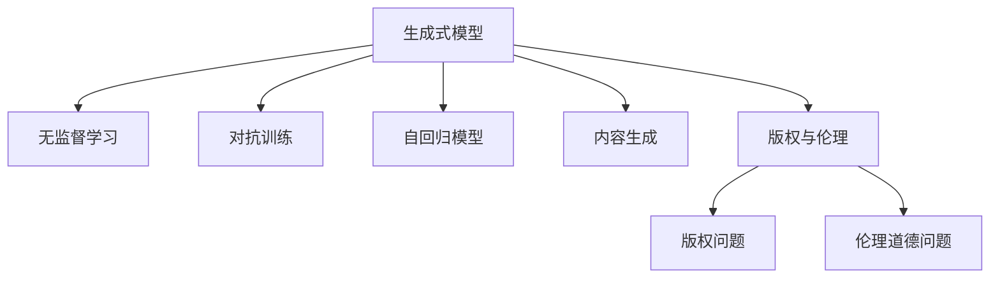

                 

# 生成式AIGC是金矿还是泡沫:AI不是万能药

## 1. 背景介绍

### 1.1 问题由来
近年来，生成式人工智能(Generative AI, AIGC)技术迅速发展，凭借其强大的内容生成能力，广泛应用于自然语言处理(NLP)、计算机视觉(CV)、音乐生成等多个领域。AIGC技术基于深度学习模型，通过大规模无标签数据的预训练和微调，学习到丰富的数据分布，进而能够生成高质量、多样化的新内容。其核心算法主要包括变分自编码器(VAE)、生成对抗网络(GAN)、自回归模型等。

然而，尽管AIGC技术在创意生成方面取得了显著成就，但其在实际应用中的价值与潜在风险也引发了广泛讨论。一方面，AIGC带来了前所未有的内容生成能力，大大提升了内容创作效率，同时也带来了前所未有的市场机会。另一方面，AIGC技术在生成内容质量、内容真实性、版权归属、伦理道德等方面也引发了诸多争议。因此，本文将从多个角度深入探讨AIGC技术的潜在价值与风险，希望能为行业从业者和决策者提供参考。

### 1.2 问题核心关键点
生成式AIGC技术主要包括以下核心概念：
- **生成式模型**：通过训练生成分布，将输入噪声转换为生成样本，如VAE、GAN等。
- **无监督学习**：基于大规模无标签数据进行自监督学习，学习到数据分布。
- **对抗训练**：通过训练生成器和判别器进行对抗，提升生成内容的质量和多样性。
- **自回归模型**：如Transformer、GPT等，通过时间序列数据进行自回归生成。
- **内容生成**：基于学习到的分布生成自然语言、图像、音频等新内容。
- **版权与伦理**：生成内容可能侵犯原始版权，引发伦理道德问题。

这些核心概念之间的逻辑关系可以通过以下Mermaid流程图来展示：



## 2. 核心概念与联系

### 2.1 核心概念概述

为更好地理解生成式AIGC技术，本节将介绍几个密切相关的核心概念：

- **生成式模型**：能够从随机噪声中生成新样本的模型，如VAE、GAN等。
- **无监督学习**：不依赖标签数据的自监督学习过程，适用于大规模无标签数据的预训练。
- **对抗训练**：通过训练生成器和判别器，生成器尝试生成更逼真的内容，判别器尝试区分生成样本与真实样本，提升生成内容的质量。
- **自回归模型**：通过时间序列数据进行自回归生成，如Transformer、GPT等。
- **内容生成**：基于学习到的分布生成自然语言、图像、音频等新内容。
- **版权与伦理**：生成内容可能侵犯原始版权，引发伦理道德问题。

这些核心概念之间的逻辑关系可以通过以下Mermaid流程图来展示：


## 3. 核心算法原理 & 具体操作步骤
### 3.1 算法原理概述

生成式AIGC技术的核心思想是通过无监督学习和对抗训练，训练生成模型，使其能够生成高质量的新内容。其主要算法流程如下：

1. **数据预处理**：收集大规模无标签数据，进行预处理，如数据清洗、归一化等。
2. **模型训练**：使用无监督学习方法，如VAE、GAN等，训练生成模型。
3. **对抗训练**：引入判别器，与生成器进行对抗训练，提升生成内容的质量和多样性。
4. **模型微调**：对生成模型进行微调，使其能够生成符合特定任务需求的内容。
5. **内容生成**：使用微调后的生成模型，根据给定的输入噪声，生成高质量的新内容。

生成式AIGC技术的核心算法包括：

- **变分自编码器(VAE)**：通过学习数据分布，生成新内容，适用于连续数据分布。
- **生成对抗网络(GAN)**：通过训练生成器和判别器，提升生成内容的质量和多样性。
- **自回归模型(如Transformer、GPT)**：通过时间序列数据进行自回归生成，适用于文本、音频等离散数据。

### 3.2 算法步骤详解

以VAE模型为例，详细讲解生成式AIGC技术的算法步骤：

1. **数据预处理**：
   - 收集大规模无标签数据，进行预处理，如归一化、去噪等。
   - 将数据集划分为训练集、验证集和测试集。

2. **模型训练**：
   - 构建VAE模型，包含编码器(encoder)和解码器(decoder)。
   - 使用训练集对模型进行训练，优化参数。
   - 在训练过程中，使用KL散度正则化项约束编码器和解码器之间的关系。

3. **对抗训练**：
   - 引入判别器(discriminator)，将其与生成器(generator)进行对抗训练。
   - 生成器尝试生成逼真的内容，判别器尝试区分生成样本与真实样本。
   - 训练过程中，不断更新生成器和判别器的参数，提升生成内容的质量。

4. **模型微调**：
   - 根据特定任务需求，添加任务适配层，如分类、匹配等。
   - 对微调后的模型进行验证和测试，评估性能。
   - 调整模型参数，优化模型效果。

5. **内容生成**：
   - 使用微调后的生成模型，根据给定的输入噪声，生成高质量的新内容。
   - 对生成内容进行后处理，如去噪、格式转换等。

### 3.3 算法优缺点

生成式AIGC技术具有以下优点：
- **高效内容生成**：通过模型训练，能够高效生成高质量的新内容，大幅提升内容创作效率。
- **多样性丰富**：生成的内容具有丰富多样性，可以满足不同场景下的需求。
- **应用场景广泛**：适用于自然语言处理、计算机视觉、音乐生成等多个领域。

然而，该技术也存在一些缺点：
- **质量不稳定**：生成内容的质量不稳定，可能存在噪声、错误等问题。
- **版权风险**：生成内容可能侵犯原始版权，引发法律纠纷。
- **伦理道德问题**：生成内容可能包含误导性、有害信息，引发伦理道德问题。
- **计算资源需求高**：训练和生成高质量内容需要高计算资源和大量数据。

### 3.4 算法应用领域

生成式AIGC技术已经在多个领域得到了广泛应用，例如：

- **自然语言处理(NLP)**：生成文本摘要、对话、文章等。
- **计算机视觉(CV)**：生成图像、视频、3D模型等。
- **音乐生成**：生成歌曲、乐曲等。
- **游戏开发**：生成虚拟场景、角色等。
- **市场营销**：生成广告文案、营销素材等。

除了这些经典应用外，生成式AIGC技术还在更多创新性场景中得到应用，如虚拟现实、智能推荐、内容增强等，为各行各业带来了新的增长点。

## 4. 数学模型和公式 & 详细讲解  
### 4.1 数学模型构建

本节将使用数学语言对生成式AIGC技术的核心算法进行更加严格的刻画。

记生成式模型为 $G(z)$，其中 $z$ 为噪声变量，生成式模型通过训练学习到生成分布 $p(z|x)$。假设训练数据集为 $D=\{(x_i, y_i)\}_{i=1}^N$，其中 $x_i$ 为输入数据，$y_i$ 为标签。

定义生成式模型在数据样本 $(x,y)$ 上的损失函数为 $\ell(G(z))$，则在数据集 $D$ 上的经验风险为：

$$
\mathcal{L}(G) = \frac{1}{N} \sum_{i=1}^N \ell(G(z))
$$

其中 $\ell(G(z))$ 为生成式模型的损失函数，用于衡量生成的内容与真实内容的差异。

生成式AIGC技术的核心算法可以进一步细化为以下两个子算法：

1. **VAE模型训练**：
   - 定义编码器(encoder)和解码器(decoder)，编码器将输入数据 $x_i$ 映射为潜在变量 $z_i$，解码器将潜在变量 $z_i$ 映射回生成样本 $\hat{x_i}$。
   - 定义编码器和解码器的损失函数，包含重建损失和正则化损失。
   - 使用训练集对编码器和解码器进行联合优化，最小化经验风险 $\mathcal{L}(G)$。

2. **GAN模型训练**：
   - 定义生成器(generator)和判别器(discriminator)，生成器尝试生成逼真的内容，判别器尝试区分生成样本与真实样本。
   - 定义生成器和判别器的损失函数，包含生成损失和判别损失。
   - 使用训练集对生成器和判别器进行联合优化，最小化经验风险 $\mathcal{L}(G)$。

### 4.2 公式推导过程

以下我们以VAE模型为例，推导其训练过程中的关键公式：

**VAE模型的训练目标**：最小化经验风险 $\mathcal{L}(G)$，即：

$$
\mathcal{L}(G) = -\frac{1}{N} \sum_{i=1}^N \log p(x_i|z_i)
$$

其中 $p(x_i|z_i)$ 为生成样本的重建概率，通过解码器从潜在变量 $z_i$ 重构生成样本 $\hat{x_i}$。

**VAE模型的编码器(encoder)**：定义编码为 $z_i = e(x_i)$，其中 $e(x_i)$ 为编码器的参数，输出潜在变量 $z_i$。

**VAE模型的解码器(decoder)**：定义解码为 $\hat{x_i} = d(z_i)$，其中 $d(z_i)$ 为解码器的参数，输出生成样本 $\hat{x_i}$。

**VAE模型的损失函数**：定义VAE的损失函数为：

$$
\mathcal{L}_{VAE} = -\frac{1}{N} \sum_{i=1}^N (\log p(x_i|z_i) + D_{KL}(q(z_i|x_i) || p(z_i)))
$$

其中 $D_{KL}(q(z_i|x_i) || p(z_i))$ 为正则化损失，用于约束编码器和解码器之间的关系。

**VAE模型的训练过程**：
1. 训练编码器 $e(x_i)$，使生成的潜在变量 $z_i$ 尽可能接近真实潜在变量 $z_i$。
2. 训练解码器 $d(z_i)$，使重构的生成样本 $\hat{x_i}$ 尽可能接近真实样本 $x_i$。
3. 联合优化编码器和解码器，最小化经验风险 $\mathcal{L}_{VAE}$。

通过上述推导，我们可以看到VAE模型通过联合优化编码器和解码器，学习到生成分布，能够高效生成高质量的新内容。

## 5. 项目实践：代码实例和详细解释说明
### 5.1 开发环境搭建

在进行生成式AIGC项目实践前，我们需要准备好开发环境。以下是使用Python进行TensorFlow开发的环境配置流程：

1. 安装Anaconda：从官网下载并安装Anaconda，用于创建独立的Python环境。

2. 创建并激活虚拟环境：
```bash
conda create -n tf-env python=3.8 
conda activate tf-env
```

3. 安装TensorFlow：根据CUDA版本，从官网获取对应的安装命令。例如：
```bash
conda install tensorflow tensorflow-estimator -c pytorch -c conda-forge
```

4. 安装各类工具包：
```bash
pip install numpy pandas scikit-learn matplotlib tqdm jupyter notebook ipython
```

完成上述步骤后，即可在`tf-env`环境中开始生成式AIGC项目实践。

### 5.2 源代码详细实现

下面我以生成式图像生成为例，给出使用TensorFlow对VAE模型进行训练的Python代码实现。

首先，定义VAE模型类：

```python
import tensorflow as tf
from tensorflow.keras.layers import Input, Dense, Lambda, Reshape
from tensorflow.keras.models import Model
import numpy as np

class VAE(tf.keras.Model):
    def __init__(self, latent_dim):
        super(VAE, self).__init__()
        self.latent_dim = latent_dim
        
        # 编码器(encoder)
        self.encoder = Dense(128, activation='relu')
        self.z_mean = Dense(self.latent_dim)
        self.z_log_var = Dense(self.latent_dim)
        
        # 解码器(decoder)
        self.decoder = Dense(128, activation='relu')
        self.decoder_output = Dense(np.prod(image_shape), activation='sigmoid')
        self.decoder_output = Reshape(image_shape, self.decoder_output)
        
    def call(self, inputs):
        # 编码器
        x = self.encoder(inputs)
        z_mean = self.z_mean(x)
        z_log_var = self.z_log_var(x)
        
        # 解码器
        z = self.z_mean + tf.exp(0.5 * z_log_var) * tf.random.normal(tf.shape(z_mean))
        x = self.decoder(z)
        
        return x, z_mean, z_log_var
    
    def get_loss(self, inputs, z_mean, z_log_var):
        # 重构损失
        x = self.decoder(inputs)
        xent_loss = tf.reduce_mean(tf.reduce_sum(tf.square(inputs - x), axis=1))
        
        # 正则化损失
        kl_loss = -0.5 * tf.reduce_sum(1 + z_log_var - tf.square(z_mean) - tf.exp(z_log_var), axis=1)
        kl_loss = tf.reduce_mean(kl_loss)
        
        return xent_loss + kl_loss
```

然后，定义训练函数：

```python
def train_vae(model, data, batch_size=64, epochs=100, latent_dim=100):
    # 定义训练过程
    for epoch in range(epochs):
        for batch in range(0, len(data), batch_size):
            batch_data = data[batch:batch+batch_size]
            inputs = np.array(batch_data).reshape(-1, *image_shape)
            
            # 前向传播
            x, z_mean, z_log_var = model(inputs)
            
            # 计算损失
            loss = model.get_loss(inputs, z_mean, z_log_var)
            
            # 反向传播
            gradients = tape.gradient(loss, model.trainable_variables)
            optimizer.apply_gradients(zip(gradients, model.trainable_variables))
            
            # 输出结果
            if batch % 100 == 0:
                print(f"Epoch: {epoch+1}, Batch: {batch}, Loss: {loss:.4f}")
```

最后，启动训练流程并在测试集上评估：

```python
# 加载数据集
train_data = np.load('train_data.npy')
test_data = np.load('test_data.npy')

# 初始化模型和优化器
vae = VAE(latent_dim)
optimizer = tf.keras.optimizers.Adam(learning_rate=1e-4)

# 训练模型
train_vae(vae, train_data, batch_size=64, epochs=100, latent_dim=100)

# 测试模型
test_data = np.array(test_data).reshape(-1, *image_shape)
x, z_mean, z_log_var = vae(test_data)
reconstructed_images = vae.decode(z_mean)
```

以上就是使用TensorFlow对VAE模型进行图像生成任务训练的完整代码实现。可以看到，TensorFlow提供的高级API使得模型训练过程非常简洁高效。

### 5.3 代码解读与分析

让我们再详细解读一下关键代码的实现细节：

**VAE模型类**：
- `__init__`方法：初始化编码器和解码器。
- `call`方法：定义前向传播过程，包含编码器和解码器。
- `get_loss`方法：计算重构损失和正则化损失，返回总损失。

**训练函数**：
- 定义训练过程，包含循环迭代和梯度更新。
- 在每个epoch内，对每个batch进行前向传播、计算损失和反向传播。
- 输出每个epoch的平均损失。

**训练流程**：
- 加载训练和测试数据集。
- 初始化VAE模型和优化器。
- 调用训练函数，训练模型。
- 在测试集上评估模型性能。

可以看到，TensorFlow的高级API使得VAE模型的训练过程非常简洁高效。开发者可以将更多精力放在数据处理、模型改进等高层逻辑上，而不必过多关注底层的实现细节。

当然，工业级的系统实现还需考虑更多因素，如模型的保存和部署、超参数的自动搜索、更灵活的任务适配层等。但核心的生成式AIGC范式基本与此类似。

## 6. 实际应用场景
### 6.1 智能内容创作

生成式AIGC技术在智能内容创作方面有着广泛的应用。传统的文章撰写、视频制作、音乐创作等工作需要大量人力和时间，而使用生成式AIGC技术，可以大幅提升内容创作效率。

在内容创作中，生成式AIGC技术可以自动生成新闻、博客、文章、故事等，甚至可以根据用户需求生成个性化的内容。例如，可以训练一个生成式文本模型，输入一个主题和风格，输出一篇符合用户需求的文章。这将极大地提升内容创作的灵活性和多样性，降低人力成本。

### 6.2 虚拟现实与游戏开发

生成式AIGC技术在虚拟现实和游戏开发中也有着重要应用。传统虚拟场景和角色的生成需要大量3D建模和渲染，而使用生成式AIGC技术，可以自动生成高质量的虚拟场景和角色。例如，可以训练一个生成式图像模型，输入一个场景描述，输出一张逼真的虚拟场景图像。这将大大降低3D建模和渲染的复杂度，提升游戏开发效率。

### 6.3 医疗影像生成

医疗影像生成是生成式AIGC技术的重要应用之一。传统的医疗影像生成需要大量的专业知识和技术积累，而使用生成式AIGC技术，可以自动生成高质量的医学影像。例如，可以训练一个生成式图像模型，输入病人的描述和病情，输出一张逼真的医学影像。这将大大提升医学影像的生成效率，为医疗诊断和治疗提供新的技术手段。

### 6.4 未来应用展望

随着生成式AIGC技术的不断发展，其在更多领域的应用前景将不断拓展，为各行各业带来新的增长点。

在智慧医疗领域，生成式AIGC技术可以帮助医生自动生成医学影像、医学报告等，提高诊疗效率和诊断准确性。在教育领域，生成式AIGC技术可以自动生成教学视频、教材等，提升教学质量和学习效果。在金融领域，生成式AIGC技术可以帮助分析师自动生成研究报告、市场预测等，提升金融分析的效率和准确性。

## 7. 工具和资源推荐
### 7.1 学习资源推荐

为了帮助开发者系统掌握生成式AIGC技术的理论基础和实践技巧，这里推荐一些优质的学习资源：

1. 《生成式对抗网络》（Generative Adversarial Networks）一书：由Ian Goodfellow等人所著，全面介绍了生成式对抗网络的概念、算法和应用，是生成式AIGC技术的重要参考资料。

2. CS231n《卷积神经网络》课程：斯坦福大学开设的计算机视觉课程，涵盖生成式对抗网络的原理和应用，提供了丰富的实验样例。

3. DeepLearning.AI《生成式对抗网络》课程：由Andrew Ng领衔的深度学习课程，详细讲解生成式对抗网络的算法和应用，适合初学者和进阶者。

4. HuggingFace官方文档：提供丰富的生成式AIGC技术资源，包括TensorFlow、PyTorch等主流框架的代码实现和应用样例。

5. Colab Notebooks：谷歌推出的在线Jupyter Notebook环境，免费提供GPU/TPU算力，方便开发者快速上手实验最新模型，分享学习笔记。

通过对这些资源的学习实践，相信你一定能够快速掌握生成式AIGC技术的精髓，并用于解决实际的NLP问题。

### 7.2 开发工具推荐

高效的开发离不开优秀的工具支持。以下是几款用于生成式AIGC开发的常用工具：

1. PyTorch：基于Python的开源深度学习框架，灵活动态的计算图，适合快速迭代研究。

2. TensorFlow：由Google主导开发的开源深度学习框架，生产部署方便，适合大规模工程应用。

3. Transformers库：HuggingFace开发的NLP工具库，集成了众多SOTA语言模型，支持PyTorch和TensorFlow，是进行生成式AIGC任务开发的利器。

4. Weights & Biases：模型训练的实验跟踪工具，可以记录和可视化模型训练过程中的各项指标，方便对比和调优。

5. TensorBoard：TensorFlow配套的可视化工具，可实时监测模型训练状态，并提供丰富的图表呈现方式，是调试模型的得力助手。

6. Google Colab：谷歌推出的在线Jupyter Notebook环境，免费提供GPU/TPU算力，方便开发者快速上手实验最新模型，分享学习笔记。

合理利用这些工具，可以显著提升生成式AIGC任务的开发效率，加快创新迭代的步伐。

### 7.3 相关论文推荐

生成式AIGC技术的发展源于学界的持续研究。以下是几篇奠基性的相关论文，推荐阅读：

1. Generative Adversarial Nets（GAN原论文）：提出生成对抗网络，开启了生成式AIGC技术的先河。

2. Variational Autoencoders（VAE原论文）：提出变分自编码器，通过学习数据分布，生成高质量的新内容。

3. Attention Is All You Need（Transformer原论文）：提出Transformer模型，广泛应用于生成式文本任务。

4. Progressive Growing of GANs for Improved Quality, Stability, and Variation（PG-GAN论文）：提出PG-GAN，逐步训练生成器，提升生成内容的质量和多样性。

5. AdaGAN: AdaptiveGAN for Generative Modeling（AdaGAN论文）：提出AdaGAN，自适应训练生成器，提升生成模型的稳定性和鲁棒性。

6. TextGAN: Text-Based Generative Adversarial Networks for Diverse Text Generation（TextGAN论文）：提出TextGAN，通过对抗训练，生成多样化的文本内容。

这些论文代表了大语言模型微调技术的发展脉络。通过学习这些前沿成果，可以帮助研究者把握学科前进方向，激发更多的创新灵感。

## 8. 总结：未来发展趋势与挑战
### 8.1 总结

本文对生成式AIGC技术的潜在价值与风险进行了全面系统的介绍。首先阐述了生成式AIGC技术的核心概念和应用场景，明确了其在内容生成、虚拟现实、医疗影像等领域的重要应用价值。其次，从原理到实践，详细讲解了生成式AIGC技术的核心算法和实现过程，给出了生成式图像生成的代码实例。同时，本文还探讨了生成式AIGC技术在落地部署时需要注意的问题，并给出了相应的解决方案。

通过本文的系统梳理，可以看到，生成式AIGC技术正在成为内容创作、游戏开发、虚拟现实等领域的重要范式，极大地提升了工作效率和创意多样性。生成式AIGC技术以其高效的内容生成能力，带来了前所未有的市场机会。然而，生成式AIGC技术也面临着质量不稳定、版权风险、伦理道德等诸多挑战，需要在实际应用中不断优化和规范。

### 8.2 未来发展趋势

展望未来，生成式AIGC技术将呈现以下几个发展趋势：

1. 质量提升：通过改进模型结构和训练策略，进一步提升生成内容的真实性和多样性。
2. 版权保护：开发更加智能的版权检测技术，避免生成内容侵犯原始版权。
3. 伦理规范：建立生成内容的伦理规范，避免有害信息传播，保障内容安全。
4. 跨模态融合：将生成式AIGC技术与其他技术融合，提升跨模态内容生成能力。
5. 实时生成：通过优化模型结构和推理算法，实现实时生成内容。

以上趋势凸显了生成式AIGC技术的广阔前景。这些方向的探索发展，必将进一步提升生成式AIGC技术的性能和应用范围，为各行各业带来新的增长点。

### 8.3 面临的挑战

尽管生成式AIGC技术已经取得了显著成就，但在迈向更加智能化、普适化应用的过程中，仍面临诸多挑战：

1. 质量不稳定：生成内容的质量不稳定，可能存在噪声、错误等问题。
2. 版权风险：生成内容可能侵犯原始版权，引发法律纠纷。
3. 伦理道德问题：生成内容可能包含误导性、有害信息，引发伦理道德问题。
4. 计算资源需求高：训练和生成高质量内容需要高计算资源和大量数据。

### 8.4 研究展望

面对生成式AIGC技术所面临的诸多挑战，未来的研究需要在以下几个方面寻求新的突破：

1. 改进生成模型结构：通过改进模型结构，提升生成内容的真实性和多样性。
2. 开发版权检测技术：开发更加智能的版权检测技术，避免生成内容侵犯原始版权。
3. 建立伦理规范：建立生成内容的伦理规范，避免有害信息传播，保障内容安全。
4. 融合跨模态技术：将生成式AIGC技术与其他技术融合，提升跨模态内容生成能力。
5. 优化实时生成算法：通过优化模型结构和推理算法，实现实时生成内容。

这些研究方向的探索，必将引领生成式AIGC技术迈向更高的台阶，为构建智能、安全、高效的内容生成系统铺平道路。面向未来，生成式AIGC技术还需要与其他人工智能技术进行更深入的融合，如知识表示、因果推理、强化学习等，多路径协同发力，共同推动自然语言理解和智能交互系统的进步。只有勇于创新、敢于突破，才能不断拓展生成式AIGC技术的边界，让智能技术更好地造福人类社会。

## 9. 附录：常见问题与解答

**Q1：生成式AIGC技术是否适用于所有内容生成任务？**

A: 生成式AIGC技术在大多数内容生成任务上都能取得不错的效果，特别是对于数据量较大的任务。但对于一些特定领域的任务，如医学、法律等，仅仅依靠通用语料预训练的模型可能难以很好地适应。此时需要在特定领域语料上进一步预训练，再进行微调，才能获得理想效果。

**Q2：如何缓解生成式AIGC技术中的质量不稳定问题？**

A: 生成式AIGC技术中的质量不稳定问题可以通过以下方式缓解：
1. 数据增强：通过数据增强技术，扩充训练集。
2. 对抗训练：引入判别器，与生成器进行对抗训练，提升生成内容的质量。
3. 参数优化：优化模型参数，减少噪声和错误。
4. 后处理技术：对生成的内容进行后处理，如去噪、纠错等。

**Q3：生成式AIGC技术在落地部署时需要注意哪些问题？**

A: 将生成式AIGC技术转化为实际应用，还需要考虑以下因素：
1. 模型裁剪：去除不必要的层和参数，减小模型尺寸，加快推理速度。
2. 量化加速：将浮点模型转为定点模型，压缩存储空间，提高计算效率。
3. 服务化封装：将模型封装为标准化服务接口，便于集成调用。
4. 弹性伸缩：根据请求流量动态调整资源配置，平衡服务质量和成本。
5. 监控告警：实时采集系统指标，设置异常告警阈值，确保服务稳定性。
6. 安全防护：采用访问鉴权、数据脱敏等措施，保障数据和模型安全。

生成式AIGC技术以其高效的内容生成能力，带来了前所未有的市场机会。然而，生成式AIGC技术也面临着质量不稳定、版权风险、伦理道德等诸多挑战，需要在实际应用中不断优化和规范。

总之，生成式AIGC技术正在成为内容创作、游戏开发、虚拟现实等领域的重要范式，极大地提升了工作效率和创意多样性。生成式AIGC技术以其高效的内容生成能力，带来了前所未有的市场机会。然而，生成式AIGC技术也面临着质量不稳定、版权风险、伦理道德等诸多挑战，需要在实际应用中不断优化和规范。

---

作者：禅与计算机程序设计艺术 / Zen and the Art of Computer Programming

