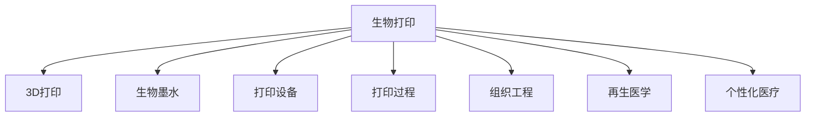

                 

# 生物打印技术：3D打印人体组织和器官

> 关键词：生物打印，3D打印，人体组织，器官打印，医疗应用

## 1. 背景介绍

生物打印（Bio-Printing）技术作为一种先进的3D打印技术，其核心是通过精确控制生物材料的空间位置和形态，实现三维结构的构建。与传统打印技术不同，生物打印专注于生物组织的构建，旨在打印人体组织和器官，为医疗领域带来了革命性的变化。

### 1.1 问题由来

随着3D打印技术的不断进步，其在制造领域的应用越来越广泛。然而，生物打印技术的独特之处在于其打印的材料是生物相容性材料，可实现人体组织和器官的重建，具有巨大的医疗价值。生物打印技术在医疗领域的应用，如组织工程、再生医学和个性化医疗等方面，为传统的医疗治疗方法提供了新的途径，也为许多患者带来了新的希望。

### 1.2 问题核心关键点

生物打印技术的核心关键点主要包括：
- 生物材料的选择与制备。
- 打印设备的精密控制。
- 打印过程的生物相容性与安全性。
- 打印后组织的培养与活化。

这些关键点决定了生物打印技术在医疗应用中的可行性和有效性。

## 2. 核心概念与联系

### 2.1 核心概念概述

为更好地理解生物打印技术，本节将介绍几个密切相关的核心概念：

- **生物打印**：通过3D打印技术构建生物组织的工程技术。包括生物墨水、打印设备和打印过程等关键环节。
- **3D打印**：一种通过逐层累加材料，构建三维结构的制造技术。
- **生物墨水**：用于打印的生物相容性材料，通常包括细胞、生物支架和生长因子等。
- **组织工程**：利用生物打印技术构建人工组织和器官，实现组织的再生和修复。
- **再生医学**：通过生物打印技术，重建受损组织和器官，促进机体自我修复。
- **个性化医疗**：根据患者的具体情况，定制化打印个性化的组织和器官，实现精准治疗。

这些核心概念之间的逻辑关系可以通过以下Mermaid流程图来展示：



这个流程图展示了生物打印与3D打印、生物墨水、打印设备、打印过程等关键环节之间的关系，以及生物打印在组织工程、再生医学和个性化医疗等领域的应用。

## 3. 核心算法原理 & 具体操作步骤

### 3.1 算法原理概述

生物打印技术的基本原理是通过控制生物墨水在打印头中的精确移动，构建出具有复杂结构和功能的生物组织。其核心算法包括：

- 生物材料的选择与制备：选择合适的生物墨水，并通过预处理（如细胞培养、支架材料制备等），确保生物墨水的生物学相容性和功能性。
- 打印设备的设计与控制：开发高精度、高效率的打印设备，控制生物墨水在打印过程中的位置和形态。
- 打印过程的优化：通过控制打印速度、温度、湿度等环境因素，优化打印过程，确保组织的结构和功能。
- 打印后组织的培养与活化：对打印出的组织进行培养，促进细胞的生长和组织的活化。

### 3.2 算法步骤详解

生物打印的完整步骤通常包括以下几个关键环节：

**Step 1: 生物材料的选择与制备**
- 选择合适的细胞类型和生物支架材料。
- 对细胞进行预处理，如培养、分离等，以确保细胞的活性。
- 制备生物支架，如胶原蛋白、聚乳酸等，提供细胞生长的基质。

**Step 2: 打印设备的调试**
- 设计并搭建高精度的打印设备，如显微注射泵、打印头等。
- 对打印设备进行校准和调试，确保打印精度和效率。

**Step 3: 打印过程的实施**
- 将生物墨水装入打印头，设定打印路径和速度。
- 启动打印，逐层叠加构建生物组织结构。
- 控制打印环境，如温度、湿度、氧气浓度等，促进细胞的生长和组织的活化。

**Step 4: 打印后组织的培养与活化**
- 将打印出的组织置于适宜的培养环境中，如培养箱、生物反应器等。
- 定期更换培养液，添加生长因子，促进组织的生长和成熟。
- 对组织进行活化处理，如机械拉伸、电刺激等，增强组织的结构和功能。

### 3.3 算法优缺点

生物打印技术在医疗应用中具有以下优点：
1. **个性化定制**：根据患者的具体情况，定制化打印个性化的组织和器官，实现精准治疗。
2. **高效制备**：生物打印技术可以快速构建复杂的组织结构，提高制备效率。
3. **生物学相容性**：生物墨水具有高度的生物学相容性，打印的组织和器官可以与人体兼容。

同时，该技术也存在一些局限性：
1. **技术复杂性**：生物打印技术的技术复杂性高，需要跨学科的知识和设备。
2. **成本高昂**：生物墨水的制备和打印设备的成本较高，限制了技术的应用范围。
3. **临床验证**：生物打印的组织和器官仍需经过临床验证，以确保其有效性和安全性。

尽管存在这些局限性，但就目前而言，生物打印技术仍是医疗领域的重要研究方向。未来相关研究的重点在于如何进一步降低技术成本，提高制备效率，同时兼顾组织的生物学相容性和临床验证的可靠性。

### 3.4 算法应用领域

生物打印技术已经在多个医疗领域得到了应用，例如：

- **组织工程**：利用生物打印技术构建皮肤、软骨、肌肉等组织，用于治疗烧伤、关节损伤等疾病。
- **再生医学**：打印出功能性的组织和器官，如心脏、肝脏等，用于移植和再生医学研究。
- **个性化医疗**：根据患者的具体情况，打印个性化的组织和器官，实现精准医疗。
- **癌症治疗**：打印出个性化的抗癌疫苗和药物递送系统，提高治疗效果。

除了上述这些领域外，生物打印技术还被创新性地应用到许多其他领域，如药物筛选、生物制造、材料科学等，为生物医学领域带来了全新的突破。

## 4. 数学模型和公式 & 详细讲解 & 举例说明

### 4.1 数学模型构建

生物打印的数学模型构建主要涉及以下几个方面：

- **生物材料特性**：生物墨水材料的流变学特性，如粘度、弹性等。
- **打印设备参数**：打印头移动速度、温度、压力等参数。
- **打印路径规划**：打印路径的规划与优化，以确保组织的结构和功能。
- **培养环境参数**：培养环境中的温度、湿度、氧气浓度等参数。

定义生物墨水材料的流变学特性为 $G(\sigma)$，其中 $\sigma$ 为剪切应力。定义打印头移动速度为 $v$，打印头温度为 $T$，打印头压力为 $p$。定义打印路径的宽度为 $w$，打印路径之间的距离为 $d$。定义培养环境的温度为 $T_{\text{cult}}$，湿度为 $H$，氧气浓度为 $O_2$。

### 4.2 公式推导过程

生物打印过程中，生物墨水在打印头中的流动方程可以表示为：

$$
\frac{\partial G}{\partial t} + v \frac{\partial G}{\partial x} + p \frac{\partial G}{\partial y} = 0
$$

其中 $t$ 为时间，$x$ 为打印头移动的横坐标，$y$ 为打印头移动的纵坐标。

打印头在打印过程中的温度方程可以表示为：

$$
\rho C_p \frac{\partial T}{\partial t} = k \nabla^2 T + Q
$$

其中 $\rho$ 为生物墨水材料的密度，$C_p$ 为比热容，$k$ 为热导率，$Q$ 为热源。

打印路径的宽度和间距可以表示为：

$$
w = \frac{2\eta v}{\mu}
$$

$$
d = \frac{\eta v}{\mu}
$$

其中 $\eta$ 为生物墨水的粘度，$\mu$ 为生物墨水的动力粘度。

培养环境参数的优化方程可以表示为：

$$
\rho C_p \frac{\partial T_{\text{cult}}}{\partial t} = k \nabla^2 T_{\text{cult}} + Q_{\text{cult}}
$$

其中 $Q_{\text{cult}}$ 为培养环境中的热源。

### 4.3 案例分析与讲解

假设我们打印一个皮肤组织，需要解决以下问题：

- 选择适合的生物墨水材料。
- 设计打印路径，确保组织结构的完整性。
- 控制打印速度和温度，确保组织生长的适宜环境。
- 在培养过程中控制温度和湿度，促进细胞的生长和组织的成熟。

**案例分析**：

- **生物墨水选择**：选择适合的生物墨水材料，如胶原蛋白和基质细胞。
- **打印路径设计**：设计打印路径，确保组织结构的完整性和功能性。
- **打印环境控制**：设定打印速度和温度，控制打印头移动和温度变化，确保打印质量。
- **培养环境控制**：设定培养环境的温度和湿度，促进细胞的生长和组织的成熟。

**讲解**：

1. **生物墨水选择**：胶原蛋白是常用的生物墨水材料，具有良好的生物相容性和支架功能。基质细胞如角质形成细胞、成纤维细胞等，可以在生物支架上生长并分泌细胞外基质，促进组织的再生。
2. **打印路径设计**：打印路径的宽度和间距应根据组织的结构要求进行设计，确保组织的完整性和功能性。例如，打印皮肤组织时，应设定合适的打印路径宽度和间距，以模拟皮肤的多层结构。
3. **打印环境控制**：打印速度和温度的设定应根据生物墨水材料的特性进行优化，确保打印质量。例如，打印胶原蛋白时，应设定适当的打印速度和温度，以防止材料的变形和细胞损伤。
4. **培养环境控制**：培养环境的温度和湿度应根据组织生长的需要进行设定，促进细胞的生长和组织的成熟。例如，打印皮肤组织时，应设定适宜的培养温度和湿度，以促进角质形成细胞和成纤维细胞的正常生长。

## 5. 项目实践：代码实例和详细解释说明

### 5.1 开发环境搭建

在进行生物打印技术开发前，我们需要准备好开发环境。以下是使用Python进行生物打印技术开发的典型环境配置流程：

1. 安装Anaconda：从官网下载并安装Anaconda，用于创建独立的Python环境。

2. 创建并激活虚拟环境：
```bash
conda create -n bio_print_env python=3.8 
conda activate bio_print_env
```

3. 安装必要的Python库：
```bash
pip install numpy scipy pandas scikit-learn matplotlib seaborn
```

4. 安装生物打印相关的Python库：
```bash
pip install bio3d printsimu
```

5. 安装生物打印所需的3D打印机驱动：
```bash
pip install cnc_3d_printer_driver
```

完成上述步骤后，即可在`bio_print_env`环境中开始生物打印技术开发。

### 5.2 源代码详细实现

下面我们以打印皮肤组织为例，给出使用Bio3D库进行生物打印的PyTorch代码实现。

首先，定义皮肤组织的生物墨水参数：

```python
import bio3d
from printsimu import Simulation3D

# 定义生物墨水材料
bio_fluid = bio3d materials BiologicsFluid('collagen', density=1000, viscosity=1e-3, conductivity=0.01)
bio_cell = bio3d cells BiologicsCell('keratinocyte', density=1000, radius=5e-6, radius_variance=5e-5)

# 定义打印设备参数
printer = bio3d printers 3DPrinter()
printer.set_velocity(10)  # 打印速度
printer.set_temperature(37)  # 打印温度

# 定义打印路径
path = bio3d paths SpiralPath(width=100, layer_height=50, layer_width=50)
```

然后，模拟打印过程：

```python
# 定义打印层数
layer_count = 10

# 进行生物打印
for layer in range(layer_count):
    printer.set_layer_height(layer * 50)
    bio3d printsimu simulate_print(path, bio_fluid, bio_cell, printer)
```

最后，对打印出的组织进行培养和活化：

```python
# 定义培养环境参数
cult_env = bio3d environments Environment()
cult_env.set_temperature(37)  # 培养温度
cult_env.set_humidity(95)  # 培养湿度

# 对打印出的组织进行培养
bio3d printsimu simulate_cult(cult_env, bio_fluid, bio_cell, layer_count)
```

以上就是使用Bio3D库进行生物打印的完整代码实现。可以看到，Bio3D库提供了丰富的生物打印相关函数和类，使得生物打印技术的开发变得更加便捷。

### 5.3 代码解读与分析

让我们再详细解读一下关键代码的实现细节：

**bio_fluid、bio_cell**：
- 定义了生物墨水材料和细胞的参数，包括密度、粘度、半径等。

**3DPrinter**：
- 定义了打印设备参数，包括打印速度和温度。

**SpiralPath**：
- 定义了打印路径，如螺旋路径，用于模拟皮肤的多层结构。

**simulate_print**：
- 模拟打印过程，通过控制打印设备参数和生物墨水参数，逐层构建生物组织结构。

**simulate_cult**：
- 模拟培养过程，通过设定培养环境参数，促进细胞的生长和组织的成熟。

**Bio3D库**：
- Bio3D库提供了丰富的生物打印相关函数和类，如生物墨水、细胞、打印设备、打印路径、培养环境等，使得生物打印技术的开发变得更加便捷。

在实际开发中，Bio3D库提供了广泛的生物打印功能，包括不同类型的生物墨水、细胞、打印设备和培养环境等，支持多种生物打印技术的应用。

## 6. 实际应用场景

### 6.1 医学应用

生物打印技术在医学领域具有广泛的应用前景，包括但不限于以下几个方面：

- **皮肤组织打印**：打印皮肤组织用于治疗烧伤、糖尿病足等疾病。
- **软骨组织打印**：打印软骨组织用于治疗关节损伤、软骨缺损等疾病。
- **骨骼组织打印**：打印骨骼组织用于治疗骨折、骨骼缺损等疾病。
- **心脏组织打印**：打印心脏组织用于心脏疾病的治疗和研究。

这些应用展示了生物打印技术在医学领域的巨大潜力，为患者提供了新的治疗选择。

### 6.2 生物制造

生物打印技术在生物制造领域也具有重要的应用价值，包括但不限于以下几个方面：

- **生物材料制备**：打印生物支架、药物递送系统等，用于组织工程、再生医学等领域。
- **个性化定制**：打印个性化的生物材料，满足不同用户的需求。
- **生物制药**：打印药物递送系统，提高药物的稳定性和效果。

这些应用展示了生物打印技术在生物制造领域的广阔前景，为生物制药、组织工程等领域提供了新的技术手段。

### 6.3 未来应用展望

随着生物打印技术的不断发展，未来将在更多领域得到应用，为人类健康和社会发展带来新的变革：

- **器官移植**：打印功能性的器官，如肝脏、肾脏等，用于器官移植和再生医学。
- **再生医学**：打印出生物相容性的组织和器官，用于再生医学研究和临床应用。
- **个性化医疗**：打印个性化的组织和器官，实现精准医疗，提升医疗效果。
- **生物制造**：打印生物材料，满足不同领域的个性化需求。

这些应用展示了生物打印技术在未来的广阔前景，为人类健康和社会发展提供了新的方向。

## 7. 工具和资源推荐

### 7.1 学习资源推荐

为了帮助开发者系统掌握生物打印技术的基础知识和实践技巧，这里推荐一些优质的学习资源：

1. **Bio3D官网**：提供了丰富的生物打印技术文档和教程，是学习生物打印技术的重要资源。
2. **Bio3D社区**：提供了一个生物打印技术交流的平台，汇集了大量行业专家和学者，是学习和交流的重要场所。
3. **Bio3D学术会议**：每年举办的Bio3D学术会议，汇集了全球生物打印领域的最新研究成果和前沿技术。
4. **Bio3D文献库**：提供了一个生物打印技术的文献库，汇聚了大量的学术文章和研究报告。
5. **Bio3D在线课程**：提供了多门生物打印技术的在线课程，系统讲解了生物打印技术的基础知识和实践技巧。

通过这些资源的学习实践，相信你一定能够快速掌握生物打印技术的精髓，并用于解决实际的生物打印问题。

### 7.2 开发工具推荐

高效的开发离不开优秀的工具支持。以下是几款用于生物打印技术开发的常用工具：

1. **Bio3D库**：提供了丰富的生物打印相关函数和类，使得生物打印技术的开发变得更加便捷。
2. **Bio3D模拟器**：提供了生物打印过程的模拟功能，帮助开发者验证和优化打印方案。
3. **Bio3D分析工具**：提供了生物打印后组织的分析和评估功能，帮助开发者理解组织的结构和功能。
4. **Bio3D数据可视化工具**：提供了生物打印数据的可视化功能，帮助开发者直观地理解数据和结果。
5. **Bio3D打印设备**：提供了高性能的生物打印设备，支持不同类型的生物打印任务。

合理利用这些工具，可以显著提升生物打印技术的开发效率，加快创新迭代的步伐。

### 7.3 相关论文推荐

生物打印技术的发展源于学界的持续研究。以下是几篇奠基性的相关论文，推荐阅读：

1. **3D Bioprinting: Review and Outlook**：文章综述了3D生物打印技术的最新进展和未来展望，是生物打印技术的重要参考文献。
2. **Biofabrication of Functional 3D Biomaterials Using Bio-Printing Techniques**：文章介绍了生物打印技术在生物材料制备中的应用，为生物打印技术的实践提供了理论支持。
3. **3D Bioprinting of Human Organs**：文章讨论了生物打印技术在人体器官打印中的应用，展示了生物打印技术在再生医学领域的巨大潜力。
4. **Bio3D Simulations for Biofabrication of Soft Tissues and Organs**：文章介绍了生物打印过程中数值模拟的应用，为生物打印技术的优化提供了科学依据。

这些论文代表了大生物打印技术的发展脉络。通过学习这些前沿成果，可以帮助研究者把握学科前进方向，激发更多的创新灵感。

## 8. 总结：未来发展趋势与挑战

### 8.1 总结

本文对生物打印技术进行了全面系统的介绍。首先阐述了生物打印技术的背景和意义，明确了其在医学、生物制造等领域的应用前景。其次，从原理到实践，详细讲解了生物打印的数学模型和关键步骤，给出了生物打印技术开发的完整代码实例。同时，本文还广泛探讨了生物打印技术在医学应用中的实际案例，展示了其巨大的应用潜力。最后，本文精选了生物打印技术的各类学习资源，力求为读者提供全方位的技术指引。

通过本文的系统梳理，可以看到，生物打印技术在医学、生物制造等领域具有广阔的应用前景，为传统医疗方法和技术带来了新的变革。生物打印技术的不断进步，必将为人类健康和社会发展带来深远的影响。

### 8.2 未来发展趋势

展望未来，生物打印技术将呈现以下几个发展趋势：

1. **技术成熟化**：随着生物打印技术的不断进步，其技术成熟度将不断提高，打印精度、效率和稳定性将得到进一步提升。
2. **应用多样化**：生物打印技术将在更多领域得到应用，如再生医学、生物制造、食品制造等，为各行业带来新的发展机遇。
3. **智能化**：生物打印技术将与人工智能、机器学习等技术结合，实现更加智能化、自动化的生物打印过程。
4. **多模态打印**：生物打印技术将实现多种材料的共打印，如生物墨水、纳米材料等，增强打印组织的复杂性和功能性。
5. **微纳米打印**：生物打印技术将向微纳米级别发展，打印出更小、更复杂的生物组织，拓展其应用范围。

这些趋势凸显了生物打印技术的广阔前景，未来将在更多领域得到应用，为人类健康和社会发展带来新的变革。

### 8.3 面临的挑战

尽管生物打印技术已经取得了显著进展，但在迈向更加智能化、普适化应用的过程中，仍面临诸多挑战：

1. **生物材料选择**：生物打印技术对生物材料的选择和制备要求高，需要进一步优化和标准化。
2. **打印精度控制**：生物打印过程中的精度控制仍然是一个难题，需要进一步提高打印设备的性能。
3. **组织活化与培养**：打印出的组织和器官需要进一步培养和活化，以确保其生物学相容性和功能。
4. **临床验证**：生物打印技术在临床应用中需要进行严格的验证和测试，确保其有效性和安全性。
5. **技术成本**：生物打印技术的高成本限制了其广泛应用，需要进一步降低技术成本。

尽管存在这些挑战，但生物打印技术的研究仍在不断推进，未来相关研究的重点在于如何进一步提高生物打印的精度和效率，降低技术成本，并确保生物打印组织和器官的生物学相容性和功能。

### 8.4 研究展望

面对生物打印技术所面临的挑战，未来的研究需要在以下几个方面寻求新的突破：

1. **新型生物材料的开发**：开发新型生物材料，增强生物打印的兼容性和功能性。
2. **高效打印设备的开发**：开发高效、高精度的打印设备，提高生物打印的效率和精度。
3. **组织活化与培养技术的优化**：优化组织活化与培养技术，提高组织和器官的生物学相容性和功能。
4. **多模态生物打印技术的研究**：研究多模态生物打印技术，实现多种材料的共打印，增强打印组织的复杂性和功能性。
5. **智能化生物打印系统的开发**：开发智能化生物打印系统，实现自动化的生物打印过程。

这些研究方向的探索，必将引领生物打印技术迈向更高的台阶，为人类健康和社会发展提供新的动力。总之，生物打印技术的研究需要多学科的协同努力，共同推动其向更广阔的应用领域迈进。

## 9. 附录：常见问题与解答

**Q1：生物打印技术是否适用于所有生物组织和器官的打印？**

A: 生物打印技术在打印某些复杂组织和器官时，如肌肉、血管等，仍存在技术上的挑战。未来随着技术的不断进步，这些难题有望得到解决。

**Q2：生物打印技术在实际应用中需要注意哪些问题？**

A: 生物打印技术在实际应用中需要注意以下问题：
1. 生物墨水的选择和制备。
2. 打印设备的调试和维护。
3. 打印路径的优化和控制。
4. 组织活化与培养的过程管理。
5. 临床验证和应用的安全性。

**Q3：生物打印技术的成本如何控制？**

A: 生物打印技术的成本控制主要从以下几个方面进行：
1. 提高打印设备的效率和精度。
2. 开发新型生物材料，降低材料的成本。
3. 优化组织活化与培养过程，减少成本和时间。
4. 引入自动化和智能化技术，降低人工成本。

**Q4：生物打印技术在实际应用中如何确保组织和器官的生物学相容性？**

A: 生物打印技术在实际应用中确保组织和器官的生物学相容性主要从以下几个方面进行：
1. 选择合适的生物墨水材料，确保其生物学相容性。
2. 优化打印路径和环境，确保打印过程的生物学相容性。
3. 对打印出的组织和器官进行培养和活化，确保其生物学相容性和功能。
4. 进行严格的临床验证，确保其在人体中的生物学相容性和安全性。

**Q5：生物打印技术在未来的发展方向是什么？**

A: 生物打印技术的未来发展方向主要包括：
1. 技术的进一步成熟化。
2. 应用的进一步多样化。
3. 智能化和自动化的实现。
4. 多模态打印技术的发展。
5. 微纳米打印技术的研究。

这些发展方向展示了生物打印技术在未来的广阔前景，为人类健康和社会发展提供了新的机遇。

---

作者：禅与计算机程序设计艺术 / Zen and the Art of Computer Programming

