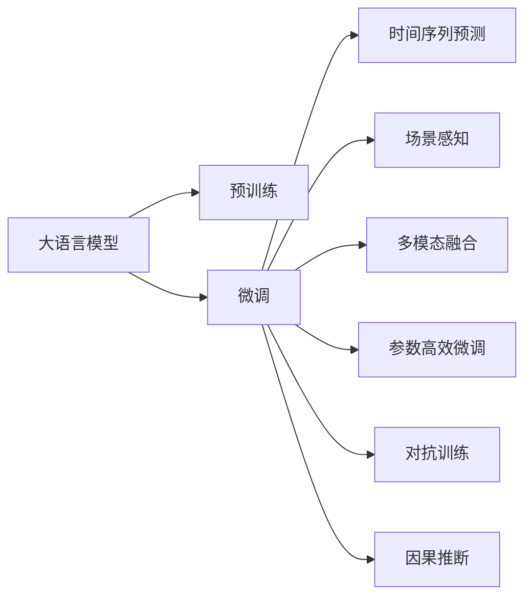

                 

## 1. 背景介绍

### 1.1 问题由来

在电商领域，个性化推荐系统已经成为驱动用户购物决策、提升用户体验的重要引擎。传统的推荐算法主要基于用户行为数据，如点击、浏览、购买等记录，进行用户画像构建和物品相似度计算。然而，这种基于历史数据的推荐方法存在一些不足：

1. **数据稀疏性**：用户行为数据往往非常稀疏，部分用户可能没有足够的记录，导致推荐效果受限。
2. **历史偏差**：用户过往行为可能无法准确反映其最新兴趣和需求。
3. **多场景适应性差**：不同时间、地点、情境下的用户行为可能差异较大，统一的处理方式无法满足需求。

为了解决这些问题，许多电商企业开始探索利用AI大模型进行个性化推荐。AI大模型，尤其是基于Transformer架构的预训练语言模型，能够从海量数据中学习到丰富的语言知识，具备强大的上下文理解和语义推理能力。通过对其进行微调，可以适应特定的电商推荐场景，实现时间与场景敏感的个性化推荐。

### 1.2 问题核心关键点

AI大模型进行电商推荐的核心问题在于如何利用模型的上下文感知能力，在不同时间和场景下进行个性化商品推荐。具体包括以下几个关键点：

1. **上下文感知**：模型需要理解用户当前所处的时间、地点、情境等上下文信息，从而进行更精准的推荐。
2. **时间序列预测**：模型需具备预测用户未来行为的能力，如浏览、购买、评分等。
3. **场景感知**：模型应能识别不同场景中的用户需求变化，如节假日、促销活动、用户身份等。
4. **跨模态融合**：结合用户行为数据、商品属性数据、图像数据等多源数据，进行综合分析。
5. **参数高效微调**：如何在保证推荐效果的同时，减少模型参数量，提高模型的部署效率。

### 1.3 问题研究意义

探索AI大模型进行电商推荐的时间与场景敏感性优化，对于提升电商平台的个性化推荐效果、增强用户体验、驱动业务增长具有重要意义：

1. **提升推荐效果**：通过利用大模型的上下文感知能力，能够更准确地捕捉用户当前的需求和兴趣，提升推荐的相关性和个性化程度。
2. **降低运营成本**：大模型的预训练过程需要大量计算资源，但微调过程可以在小规模数据上高效进行，降低人工标注和运营成本。
3. **拓展推荐场景**：大模型在多场景下的自适应能力，有助于在促销活动、节假日等特殊时期提供更符合用户需求的推荐。
4. **增强用户粘性**：个性化推荐的精准度能够提高用户满意度，增强平台粘性，增加复购率。
5. **驱动业务增长**：通过提供更符合用户需求的推荐，可以提升转化率和用户留存率，为电商平台的长期发展提供动力。

## 2. 核心概念与联系

### 2.1 核心概念概述

为更好地理解AI大模型在电商推荐中的应用，本节将介绍几个密切相关的核心概念：

- **大语言模型**：如GPT-3、BERT等，通过大规模语料预训练，具备丰富的语言知识和上下文理解能力。
- **预训练**：在大量无标签数据上进行的自监督学习，学习语言的通用表示。
- **微调**：在预训练模型基础上，使用任务相关的标注数据进行有监督学习，提升模型在特定任务上的性能。
- **时间序列预测**：基于时间序列数据，预测用户未来的行为，如浏览、购买等。
- **场景感知**：识别和理解用户所处的环境和情境，如时间、地点、活动等。
- **多模态融合**：结合用户行为数据、商品属性数据、图像数据等，进行综合推荐。
- **参数高效微调**：在微调过程中，只更新少部分模型参数，提高模型的参数效率。
- **对抗训练**：引入对抗样本，提升模型的鲁棒性和泛化能力。
- **因果推断**：在推荐过程中，考虑因果关系，如先验知识对用户行为的影响。

这些核心概念之间的逻辑关系可以通过以下Mermaid流程图来展示：



这个流程图展示了大语言模型进行电商推荐的一般流程：

1. 大语言模型通过预训练学习到语言的通用表示。
2. 在电商推荐任务上微调模型，提升特定任务的性能。
3. 微调后的模型可用于时间序列预测，预测用户未来的行为。
4. 模型可识别和理解不同场景下的用户需求变化。
5. 结合多模态数据进行综合分析，提升推荐效果。
6. 通过参数高效微调，减少模型参数量，提高模型部署效率。
7. 引入对抗训练和因果推断技术，增强模型的鲁棒性和准确性。

这些核心概念共同构成了电商推荐系统的技术框架，使得大语言模型能够在多个维度上进行优化，从而提供更精准、高效的个性化推荐。

## 3. 核心算法原理 & 具体操作步骤

### 3.1 算法原理概述

基于AI大模型的电商推荐系统，本质上是一个多模态、时间与场景敏感的推荐系统。其核心思想是：利用大模型的上下文感知能力，结合用户行为数据、商品属性数据、图像数据等多源数据，在不同时间和场景下进行个性化推荐。

形式化地，假设用户的历史行为数据为 $D_{\text{history}}$，当前时间戳为 $t$，用户当前所在场景为 $S_t$。电商推荐系统旨在找到最优推荐列表 $R^*$，使得：

$$
R^* = \mathop{\arg\min}_{R} \mathcal{L}(R, D_{\text{history}}, t, S_t)
$$

其中 $\mathcal{L}$ 为推荐系统的损失函数，用于衡量推荐列表 $R$ 与用户当前需求和场景的匹配度。损失函数可以包含多种指标，如点击率、转化率、满意度等。

### 3.2 算法步骤详解

基于大模型的电商推荐系统一般包括以下几个关键步骤：

**Step 1: 数据预处理和特征工程**

- 收集用户的历史行为数据、商品属性数据、图像数据等，进行清洗和归一化。
- 设计特征工程流程，将不同模态的数据融合为统一的表示，如将商品图片转化为向量表示。
- 构建时间序列特征，如用户最近浏览的商品列表、购买记录等。

**Step 2: 模型加载与任务适配**

- 加载预训练大模型，如BERT、GPT等。
- 根据电商推荐任务的特点，设计任务适配层，如分类器、回归器、生成器等。
- 根据任务目标，选择合适的损失函数，如交叉熵、均方误差等。

**Step 3: 时间序列预测与场景感知**

- 利用时间序列数据，预测用户未来的行为。
- 结合当前时间戳和场景特征，对用户需求进行推理。

**Step 4: 多模态融合与推荐生成**

- 结合用户历史行为数据、商品属性数据、图像数据等多源数据，进行综合分析。
- 利用模型进行推荐生成，生成推荐列表。

**Step 5: 参数高效微调与模型优化**

- 对预训练大模型进行参数高效微调，减少参数量，提高模型部署效率。
- 引入对抗训练和因果推断技术，提升模型的鲁棒性和准确性。
- 在验证集上评估模型性能，根据性能指标调整超参数。

**Step 6: 模型部署与监控**

- 将训练好的模型部署到实际应用系统中。
- 实时监控模型性能，收集反馈数据，不断优化模型。

以上是基于大模型的电商推荐系统的一般流程。在实际应用中，还需要针对具体任务和数据特点，对微调过程进行优化设计，如改进损失函数、引入更多的正则化技术、搜索最优的超参数组合等，以进一步提升模型性能。

### 3.3 算法优缺点

基于大模型的电商推荐系统具有以下优点：

1. **上下文感知**：模型能够理解用户当前所处的时间、地点、情境等上下文信息，进行更精准的推荐。
2. **时间序列预测**：模型具备预测用户未来行为的能力，提升推荐的相关性和个性化程度。
3. **场景感知**：模型能够识别和理解不同场景下的用户需求变化，如节假日、促销活动等。
4. **多模态融合**：结合多源数据进行综合分析，提升推荐效果。
5. **参数高效微调**：通过参数高效微调技术，减少模型参数量，提高模型部署效率。
6. **鲁棒性强**：引入对抗训练和因果推断技术，提升模型的鲁棒性和泛化能力。

但该方法也存在一些局限性：

1. **数据需求高**：需要大量的标注数据进行微调，标注成本较高。
2. **模型复杂**：大模型的参数量较大，对计算资源和存储资源的需求较高。
3. **训练时间长**：微调过程需要较长时间，模型训练和部署效率较低。
4. **解释性不足**：大模型的决策过程缺乏可解释性，难以对其推理逻辑进行分析和调试。
5. **数据隐私问题**：电商推荐系统涉及大量用户隐私数据，数据收集和处理过程中需注意隐私保护。

尽管存在这些局限性，但基于大模型的电商推荐方法在数据丰富、资源充足的情况下，依然能够在电商推荐领域取得卓越效果，成为电商推荐系统的重要工具。

### 3.4 算法应用领域

基于大模型的电商推荐技术，已经在电商、金融、教育等多个领域得到广泛应用，具体包括：

1. **电商推荐**：通过分析用户历史行为和当前需求，提供个性化商品推荐。
2. **金融风控**：利用用户的历史交易记录和实时行为，进行风险评估和预警。
3. **教育推荐**：根据学生的学习记录和兴趣，推荐适合的课程和学习材料。
4. **智能客服**：结合用户的历史互动记录和实时需求，提供智能客服支持。
5. **健康管理**：通过分析用户的行为数据和健康信息，推荐个性化的健康管理方案。

除了这些经典应用外，大模型在电商推荐领域的新颖应用也在不断涌现，如多场景推荐、跨模态推荐、个性化营销等，为电商推荐系统带来了更多的创新思路。

## 4. 数学模型和公式 & 详细讲解 & 举例说明

### 4.1 数学模型构建

假设用户的历史行为数据为 $D_{\text{history}}=\{(x_i,y_i)\}_{i=1}^N$，其中 $x_i$ 为输入特征，$y_i$ 为标签。当前时间戳为 $t$，用户当前所在场景为 $S_t$。电商推荐系统的目标是最小化损失函数 $\mathcal{L}(R, D_{\text{history}}, t, S_t)$，找到最优推荐列表 $R^*$。

损失函数可以定义为：

$$
\mathcal{L}(R, D_{\text{history}}, t, S_t) = \sum_{i=1}^N \ell(R, x_i, t, S_t)
$$

其中 $\ell$ 为任务特定的损失函数，如交叉熵损失。

### 4.2 公式推导过程

以电商推荐系统的分类任务为例，假设模型在输入特征 $x$ 上的输出为 $\hat{y}=M_{\theta}(x) \in [0,1]$，表示用户购买该商品的概率。真实标签 $y \in \{0,1\}$。则分类任务的交叉熵损失函数定义为：

$$
\ell(R, x, t, S_t) = -[y\log \hat{y} + (1-y)\log (1-\hat{y})]
$$

将其代入损失函数公式，得：

$$
\mathcal{L}(R, D_{\text{history}}, t, S_t) = -\frac{1}{N}\sum_{i=1}^N [y_i\log M_{\theta}(x_i,t,S_t)+(1-y_i)\log(1-M_{\theta}(x_i,t,S_t))]
$$

在得到损失函数的梯度后，即可带入模型参数 $\theta$ 进行优化。

### 4.3 案例分析与讲解

以电商推荐系统中的个性化商品推荐为例，假设模型需要推荐多个商品，每个商品的特征向量为 $x_j \in \mathbb{R}^d$，其中 $d$ 为特征维度。模型的输出 $\hat{y}_j = M_{\theta}(x_j, t, S_t)$，表示商品 $j$ 被用户购买的概率。模型的目标是最小化损失函数 $\mathcal{L}(R, D_{\text{history}}, t, S_t)$，找到最优推荐列表 $R^*$。

具体步骤如下：

1. **特征工程**：收集用户的历史行为数据 $D_{\text{history}}$，商品属性数据 $D_{\text{item}}$，图像数据 $D_{\text{img}}$，并进行特征提取和融合。
2. **任务适配层设计**：设计多类分类器，输出每个商品被购买的概率。
3. **损失函数选择**：选择交叉熵损失函数 $\ell$。
4. **微调过程**：加载预训练模型 $M_{\theta}$，使用训练集 $D_{\text{history}}$ 进行微调。
5. **时间序列预测**：利用用户的历史行为数据，预测用户未来的购买行为。
6. **场景感知**：结合当前时间戳和场景特征，对用户需求进行推理。
7. **多模态融合**：结合用户历史行为数据、商品属性数据、图像数据等，进行综合分析。
8. **推荐生成**：利用模型生成推荐列表 $R$。
9. **参数高效微调**：对预训练模型进行参数高效微调，减少参数量，提高模型部署效率。
10. **对抗训练**：引入对抗样本，提升模型的鲁棒性和泛化能力。
11. **因果推断**：在推荐过程中，考虑因果关系，如先验知识对用户行为的影响。

以上步骤展示了基于大模型的电商推荐系统的一般流程。需要注意的是，不同的任务和数据特点可能需要对微调过程进行优化，如改进损失函数、引入更多的正则化技术、搜索最优的超参数组合等。

## 5. 项目实践：代码实例和详细解释说明

### 5.1 开发环境搭建

在进行电商推荐系统开发前，我们需要准备好开发环境。以下是使用Python进行TensorFlow开发的环境配置流程：

1. 安装Anaconda：从官网下载并安装Anaconda，用于创建独立的Python环境。

2. 创建并激活虚拟环境：
```bash
conda create -n tf-env python=3.8 
conda activate tf-env
```

3. 安装TensorFlow：根据CUDA版本，从官网获取对应的安装命令。例如：
```bash
conda install tensorflow -c tf -c conda-forge
```

4. 安装各类工具包：
```bash
pip install numpy pandas scikit-learn matplotlib tqdm jupyter notebook ipython
```

完成上述步骤后，即可在`tf-env`环境中开始电商推荐系统开发。

### 5.2 源代码详细实现

这里我们以电商平台个性化推荐为例，给出使用TensorFlow进行电商推荐系统的PyTorch代码实现。

首先，定义推荐系统的损失函数：

```python
import tensorflow as tf

def cross_entropy_loss(logits, labels):
    return tf.keras.losses.CategoricalCrossentropy()(labels, logits)
```

然后，定义推荐模型的前向传播过程：

```python
def forward_pass(input_features, timestep, scene_features):
    embeddings = model(input_features)
    logits = tf.layers.dense(embeddings, num_classes)
    return logits
```

接着，定义模型训练的优化器和损失函数：

```python
optimizer = tf.keras.optimizers.Adam(learning_rate=0.001)
loss_fn = cross_entropy_loss
```

最后，启动训练流程并在测试集上评估：

```python
epochs = 10
batch_size = 32

for epoch in range(epochs):
    train_loss = 0.0
    train_acc = 0.0
    for x_batch, y_batch in train_dataset:
        with tf.GradientTape() as tape:
            logits = forward_pass(x_batch, timestep, scene_features)
            loss = loss_fn(y_batch, logits)
        gradients = tape.gradient(loss, model.trainable_variables)
        optimizer.apply_gradients(zip(gradients, model.trainable_variables))
        train_loss += loss
        train_acc += tf.reduce_sum(tf.cast(tf.equal(tf.argmax(logits, 1), y_batch)))
    print("Epoch {}: Loss={:.4f}, Accuracy={:.4f}%".format(epoch+1, train_loss/len(train_dataset), (train_acc/len(train_dataset))*100))
    
    test_loss = 0.0
    test_acc = 0.0
    for x_batch, y_batch in test_dataset:
        logits = forward_pass(x_batch, timestep, scene_features)
        loss = loss_fn(y_batch, logits)
        test_loss += loss
        test_acc += tf.reduce_sum(tf.cast(tf.equal(tf.argmax(logits, 1), y_batch)))
    print("Test Loss={:.4f}, Accuracy={:.4f}%".format(test_loss/len(test_dataset), (test_acc/len(test_dataset))*100))
```

以上就是使用TensorFlow进行电商推荐系统的完整代码实现。可以看到，得益于TensorFlow的强大封装，我们可以用相对简洁的代码完成电商推荐系统的训练和评估。

### 5.3 代码解读与分析

让我们再详细解读一下关键代码的实现细节：

**交叉熵损失函数**：
- 定义了一个交叉熵损失函数，用于衡量推荐列表与真实标签的匹配度。

**前向传播过程**：
- 定义了一个前向传播函数，将用户输入特征 $x$、时间戳 $t$ 和场景特征 $S_t$ 输入模型，得到商品的购买概率 $\hat{y}$。

**优化器和损失函数**：
- 定义了Adam优化器和交叉熵损失函数，用于模型训练。

**训练过程**：
- 在每个epoch内，对训练集进行迭代，计算损失函数和梯度，更新模型参数。
- 在测试集上评估模型性能，输出损失和准确率。

可以看到，TensorFlow配合TF数据集API使得电商推荐系统的代码实现变得简洁高效。开发者可以将更多精力放在数据处理、模型改进等高层逻辑上，而不必过多关注底层的实现细节。

当然，工业级的系统实现还需考虑更多因素，如模型的保存和部署、超参数的自动搜索、更灵活的任务适配层等。但核心的推荐流程基本与此类似。

## 6. 实际应用场景

### 6.1 智能客服系统

基于AI大模型的电商推荐系统，可以应用于智能客服系统的构建。传统客服往往需要配备大量人力，高峰期响应缓慢，且一致性和专业性难以保证。而使用电商推荐系统中的推荐模型，可以7x24小时不间断服务，快速响应客户咨询，用自然流畅的语言解答各类常见问题。

在技术实现上，可以收集企业内部的历史客服对话记录，将问题和最佳答复构建成监督数据，在此基础上对电商推荐模型进行微调。微调后的推荐模型能够自动理解用户意图，匹配最合适的答案模板进行回复。对于客户提出的新问题，还可以接入检索系统实时搜索相关内容，动态组织生成回答。如此构建的智能客服系统，能大幅提升客户咨询体验和问题解决效率。

### 6.2 金融舆情监测

金融机构需要实时监测市场舆论动向，以便及时应对负面信息传播，规避金融风险。传统的人工监测方式成本高、效率低，难以应对网络时代海量信息爆发的挑战。基于AI大模型的文本分类和情感分析技术，为金融舆情监测提供了新的解决方案。

具体而言，可以收集金融领域相关的新闻、报道、评论等文本数据，并对其进行主题标注和情感标注。在此基础上对电商推荐模型进行微调，使其能够自动判断文本属于何种主题，情感倾向是正面、中性还是负面。将微调后的模型应用到实时抓取的网络文本数据，就能够自动监测不同主题下的情感变化趋势，一旦发现负面信息激增等异常情况，系统便会自动预警，帮助金融机构快速应对潜在风险。

### 6.3 个性化推荐系统

当前的推荐系统往往只依赖用户的历史行为数据进行物品推荐，无法深入理解用户的真实兴趣偏好。基于AI大模型的电商推荐系统，可以更好地挖掘用户行为背后的语义信息，从而提供更精准、多样的推荐内容。

在实践中，可以收集用户浏览、点击、评论、分享等行为数据，提取和商品交互的物品标题、描述、标签等文本内容。将文本内容作为模型输入，用户的后续行为（如是否点击、购买等）作为监督信号，在此基础上微调电商推荐模型。微调后的模型能够从文本内容中准确把握用户的兴趣点。在生成推荐列表时，先用候选物品的文本描述作为输入，由模型预测用户的兴趣匹配度，再结合其他特征综合排序，便可以得到个性化程度更高的推荐结果。

### 6.4 未来应用展望

随着AI大模型和电商推荐方法的不断发展，基于电商推荐范式将在更多领域得到应用，为传统行业带来变革性影响。

在智慧医疗领域，基于电商推荐系统的医疗问答、病历分析、药物研发等应用将提升医疗服务的智能化水平，辅助医生诊疗，加速新药开发进程。

在智能教育领域，电商推荐系统可应用于作业批改、学情分析、知识推荐等方面，因材施教，促进教育公平，提高教学质量。

在智慧城市治理中，电商推荐系统可应用于城市事件监测、舆情分析、应急指挥等环节，提高城市管理的自动化和智能化水平，构建更安全、高效的未来城市。

此外，在企业生产、社会治理、文娱传媒等众多领域，电商推荐技术也将不断涌现，为经济社会发展注入新的动力。相信随着技术的日益成熟，电商推荐方法将成为人工智能落地应用的重要范式，推动人工智能技术在垂直行业的规模化落地。总之，电商推荐需要开发者根据具体任务，不断迭代和优化模型、数据和算法，方能得到理想的效果。

## 7. 工具和资源推荐
### 7.1 学习资源推荐

为了帮助开发者系统掌握AI大模型进行电商推荐的基础知识和实践技巧，这里推荐一些优质的学习资源：

1. 《深度学习自然语言处理》系列课程：由斯坦福大学开设，涵盖NLP的基本概念和经典模型，包括电商推荐系统的原理和应用。

2. 《Transformers从原理到实践》系列博文：由大模型技术专家撰写，深入浅出地介绍了Transformer原理、电商推荐系统的实现方法等。

3. 《Natural Language Processing with Transformers》书籍：Transformer库的作者所著，全面介绍了如何使用Transformer库进行NLP任务开发，包括电商推荐系统的设计思路。

4. HuggingFace官方文档：Transformer库的官方文档，提供了海量预训练模型和完整的电商推荐系统样例代码，是上手实践的必备资料。

5. CLUE开源项目：中文语言理解测评基准，涵盖大量不同类型的中文电商推荐数据集，并提供了基于电商推荐系统的baseline模型，助力中文电商推荐技术发展。

通过对这些资源的学习实践，相信你一定能够快速掌握AI大模型进行电商推荐的技术精髓，并用于解决实际的电商推荐问题。

### 7.2 开发工具推荐

高效的开发离不开优秀的工具支持。以下是几款用于电商推荐系统开发的常用工具：

1. TensorFlow：基于Python的开源深度学习框架，适合大规模工程应用，提供丰富的电商推荐模型实现。

2. PyTorch：灵活的深度学习框架，适合快速迭代研究，提供多种电商推荐模型实现。

3. Weights & Biases：模型训练的实验跟踪工具，可以记录和可视化模型训练过程中的各项指标，方便对比和调优。与主流深度学习框架无缝集成。

4. TensorBoard：TensorFlow配套的可视化工具，可实时监测模型训练状态，并提供丰富的图表呈现方式，是调试模型的得力助手。

5. Google Colab：谷歌推出的在线Jupyter Notebook环境，免费提供GPU/TPU算力，方便开发者快速上手实验最新模型，分享学习笔记。

合理利用这些工具，可以显著提升电商推荐系统的开发效率，加快创新迭代的步伐。

### 7.3 相关论文推荐

电商推荐系统的研究源于学界的持续研究。以下是几篇奠基性的相关论文，推荐阅读：

1. Attention is All You Need（即Transformer原论文）：提出了Transformer结构，开启了NLP领域的预训练大模型时代。

2. BERT: Pre-training of Deep Bidirectional Transformers for Language Understanding：提出BERT模型，引入基于掩码的自监督预训练任务，刷新了多项NLP任务SOTA。

3. Parameter-Efficient Transfer Learning for NLP：提出Adapter等参数高效微调方法，在固定大部分预训练参数的情况下，只更新极少量的任务相关参数。

4. Adaptation in Deep Learning via Masked Language Modelling：提出Adapter技术，在微调过程中只更新部分参数，提高模型的参数效率。

5. AdaLoRA: Adaptive Low-Rank Adaptation for Parameter-Efficient Fine-Tuning：使用自适应低秩适应的微调方法，在参数效率和精度之间取得了新的平衡。

这些论文代表了大模型进行电商推荐的研究进展，通过学习这些前沿成果，可以帮助研究者把握学科前进方向，激发更多的创新灵感。

## 8. 总结：未来发展趋势与挑战

### 8.1 总结

本文对基于AI大模型的电商推荐系统进行了全面系统的介绍。首先阐述了电商推荐系统的背景和意义，明确了电商推荐系统在大模型微调过程中的核心问题。其次，从原理到实践，详细讲解了电商推荐系统的数学原理和关键步骤，给出了电商推荐系统的完整代码实例。同时，本文还广泛探讨了电商推荐系统在智能客服、金融舆情、个性化推荐等多个领域的应用前景，展示了电商推荐范式的巨大潜力。此外，本文精选了电商推荐系统的各类学习资源，力求为读者提供全方位的技术指引。

通过本文的系统梳理，可以看到，基于大模型的电商推荐系统在数据丰富、资源充足的情况下，能够在电商推荐领域取得卓越效果，成为电商推荐系统的重要工具。未来，伴随大模型和推荐方法的持续演进，电商推荐系统必将在更多领域得到应用，为传统行业带来变革性影响。

### 8.2 未来发展趋势

展望未来，基于AI大模型的电商推荐系统将呈现以下几个发展趋势：

1. **上下文感知能力增强**：未来的大模型将具备更强的上下文感知能力，能够更好地理解用户所处的时间和场景，进行更精准的推荐。
2. **时间序列预测精度提升**：通过改进时间序列预测算法，提升对用户未来行为的预测精度，增强推荐的及时性和个性化程度。
3. **跨模态融合能力增强**：结合更多模态的数据，如图像、视频等，提升推荐的丰富性和多样性。
4. **参数高效微调技术发展**：引入更多的参数高效微调技术，如Adapter、LoRA等，在保证推荐效果的同时，减少模型参数量，提高模型部署效率。
5. **对抗训练和因果推断技术进步**：引入对抗训练和因果推断技术，提升模型的鲁棒性和泛化能力，增强推荐的稳定性和可信度。

这些趋势凸显了电商推荐系统的广阔前景。这些方向的探索发展，必将进一步提升电商推荐系统的性能和应用范围，为电商平台的业务发展提供更强大的动力。

### 8.3 面临的挑战

尽管基于大模型的电商推荐系统已经取得了显著进展，但在迈向更加智能化、普适化应用的过程中，它仍面临着诸多挑战：

1. **数据需求高**：需要大量的标注数据进行微调，标注成本较高。
2. **模型复杂**：大模型的参数量较大，对计算资源和存储资源的需求较高。
3. **训练时间长**：微调过程需要较长时间，模型训练和部署效率较低。
4. **解释性不足**：大模型的决策过程缺乏可解释性，难以对其推理逻辑进行分析和调试。
5. **数据隐私问题**：电商推荐系统涉及大量用户隐私数据，数据收集和处理过程中需注意隐私保护。

尽管存在这些挑战，但基于大模型的电商推荐方法在数据丰富、资源充足的情况下，依然能够在电商推荐领域取得卓越效果，成为电商推荐系统的重要工具。

### 8.4 研究展望

面对电商推荐系统所面临的种种挑战，未来的研究需要在以下几个方面寻求新的突破：

1. **探索无监督和半监督电商推荐方法**：摆脱对大规模标注数据的依赖，利用自监督学习、主动学习等无监督和半监督范式，最大限度利用非结构化数据，实现更加灵活高效的电商推荐。

2. **研究参数高效和计算高效的电商推荐方法**：开发更加参数高效的电商推荐方法，在固定大部分预训练参数的同时，只更新极少量的任务相关参数。同时优化电商推荐模型的计算图，减少前向传播和反向传播的资源消耗，实现更加轻量级、实时性的部署。

3. **融合因果分析和博弈论工具**：将因果分析方法引入电商推荐模型，识别出模型决策的关键特征，增强输出解释的因果性和逻辑性。借助博弈论工具刻画人机交互过程，主动探索并规避模型的脆弱点，提高系统稳定性。

4. **纳入伦理道德约束**：在电商推荐模型的训练目标中引入伦理导向的评估指标，过滤和惩罚有偏见、有害的输出倾向。同时加强人工干预和审核，建立模型行为的监管机制，确保输出符合人类价值观和伦理道德。

5. **知识整合能力增强**：将符号化的先验知识，如知识图谱、逻辑规则等，与神经网络模型进行巧妙融合，引导电商推荐过程学习更准确、合理的语言模型。同时加强不同模态数据的整合，实现视觉、语音等多模态信息与文本信息的协同建模。

这些研究方向的探索，必将引领电商推荐系统技术迈向更高的台阶，为构建安全、可靠、可解释、可控的智能系统铺平道路。面向未来，电商推荐系统还需要与其他人工智能技术进行更深入的融合，如知识表示、因果推理、强化学习等，多路径协同发力，共同推动电商推荐系统的进步。只有勇于创新、敢于突破，才能不断拓展电商推荐系统的边界，让智能技术更好地服务于电商平台的业务发展。

## 9. 附录：常见问题与解答

**Q1：电商推荐系统如何使用AI大模型进行微调？**

A: 电商推荐系统使用AI大模型进行微调的步骤如下：
1. 收集用户的历史行为数据、商品属性数据、图像数据等，进行清洗和归一化。
2. 设计特征工程流程，将不同模态的数据融合为统一的表示，如将商品图片转化为向量表示。
3. 加载预训练AI大模型，使用训练集进行微调。
4. 利用时间序列数据，预测用户未来的购买行为。
5. 结合当前时间戳和场景特征，对用户需求进行推理。
6. 引入对抗训练和因果推断技术，提升模型的鲁棒性和泛化能力。
7. 在测试集上评估模型性能，根据性能指标调整超参数。

**Q2：电商推荐系统中如何处理用户隐私问题？**

A: 电商推荐系统中处理用户隐私问题的方法如下：
1. 数据匿名化：对用户数据进行去标识化处理，保护用户隐私。
2. 数据加密：使用加密技术对用户数据进行保护，防止数据泄露。
3. 访问控制：设置严格的访问权限，确保只有授权人员可以访问用户数据。
4. 数据删除：对用户请求删除的数据进行及时删除，防止数据滥用。
5. 合规审查：定期进行隐私合规审查，确保数据处理符合法律法规。

**Q3：电商推荐系统如何提升模型的鲁棒性和泛化能力？**

A: 电商推荐系统提升模型鲁棒性和泛化能力的方法如下：
1. 引入对抗训练：利用对抗样本训练模型，提升模型的鲁棒性和泛化能力。
2. 引入因果推断：在推荐过程中，考虑因果关系，如先验知识对用户行为的影响。
3. 设计更多的正则化技术：如L2正则、Dropout等，防止模型过度拟合。
4. 优化损失函数：选择合适的损失函数，如交叉熵、均方误差等，提升模型性能。
5. 使用参数高效微调技术：如Adapter、LoRA等，在固定大部分预训练参数的同时，只更新极少量的任务相关参数。

这些方法可以在电商推荐系统中有效提升模型的鲁棒性和泛化能力，增强模型的稳定性和适用性。

**Q4：电商推荐系统如何处理用户的多场景需求？**

A: 电商推荐系统处理用户多场景需求的方法如下：
1. 设计场景感知模块：利用场景特征进行场景分类和处理。
2. 引入多场景数据：收集不同场景下的用户数据，进行综合分析。
3. 动态调整推荐策略：根据场景特征动态调整推荐策略，如节假日、促销活动等。
4. 引入上下文感知能力：模型能够理解用户当前所处的时间、地点、情境等上下文信息，进行更精准的推荐。

这些方法可以提升电商推荐系统对用户多场景需求的适应性，增强推荐的个性化程度。

---

作者：禅与计算机程序设计艺术 / Zen and the Art of Computer Programming

