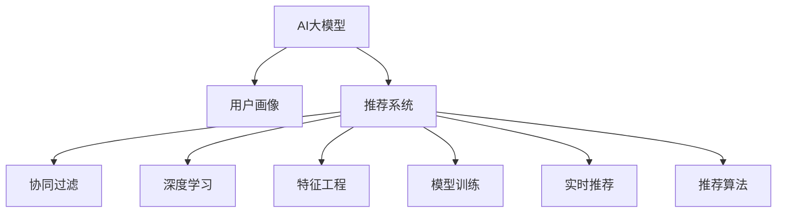

                 

# 电商平台个性化推送：AI大模型的精准营销

> 关键词：电商个性化推荐, 用户画像, AI大模型, 深度学习, 特征工程, 模型训练, 实时推荐, 用户行为分析, 推荐系统

## 1. 背景介绍

### 1.1 问题由来

随着互联网的普及和电子商务的快速发展，电商平台已成为人们日常生活中不可或缺的一部分。电商平台利用其巨大的用户基础和丰富商品资源，通过精准的个性化推荐系统，帮助用户快速找到自己心仪的商品，提升购物体验。近年来，基于大数据和AI技术的推荐系统，如商品推荐、内容推荐等，得到了广泛应用，成为电商平台的核心竞争力之一。

但同时，电商平台的推荐系统也面临着许多挑战。传统的推荐系统基于协同过滤、基于内容的推荐、基于矩阵分解等方法，主要依赖用户的历史行为数据进行推荐。然而，用户行为数据量巨大且稀疏，难以充分挖掘用户偏好，导致推荐效果有限。为此，越来越多的电商平台开始采用基于AI大模型的推荐系统，以期通过强大的语言理解能力和知识图谱结合，实现更为精准的推荐。

### 1.2 问题核心关键点

本文聚焦于利用AI大模型进行电商平台的个性化推荐系统，旨在解决以下问题：

1. 如何通过AI大模型，结合用户行为数据和商品信息，实现精准的用户画像建模。
2. 如何通过模型训练和优化，提高推荐系统的个性化和准确性。
3. 如何在电商平台的实时环境中，高效地进行商品推荐，并及时调整推荐策略。
4. 如何保护用户隐私，确保推荐系统的透明度和公平性。

解决这些问题，将有助于电商平台构建高效、智能、安全的推荐系统，提升用户体验和平台业绩。

### 1.3 问题研究意义

大语言模型和推荐系统在电商平台的融合，将为个性化推荐带来革命性的突破。大语言模型能够理解和处理自然语言，结合电商场景中的商品描述、用户评论等文本信息，提供更深入的语义理解。同时，大模型可以整合多模态数据，如图片、视频、评论等，形成更为全面、准确的用户画像。

此外，结合大模型的自适应能力，电商平台可以实现更灵活、个性化的推荐策略，通过实时调整推荐内容，适应用户的即时需求和行为变化。最后，大模型的透明性和可解释性，有助于提升推荐系统的公平性和用户信任度，保障用户隐私，实现商业价值和社会价值的双重提升。

## 2. 核心概念与联系

### 2.1 核心概念概述

为更好地理解基于AI大模型的电商推荐系统，本节将介绍几个密切相关的核心概念：

- AI大模型(AI Large Models)：指采用深度学习技术，参数量以亿计，能够处理大规模数据，并具备强大语言理解能力和知识图谱整合能力的预训练模型，如BERT、GPT等。
- 推荐系统(Recommender Systems)：通过分析用户的历史行为和偏好，向用户推荐其可能感兴趣的商品或内容，旨在提升用户体验和平台业绩。
- 用户画像(User Profiling)：根据用户的历史行为、属性信息、社交关系等，构建详细的用户画像，用于推荐系统的个性化推荐。
- 协同过滤(Collaborative Filtering)：基于用户历史行为数据，寻找相似用户，预测新用户对商品的兴趣。
- 深度学习(Deep Learning)：通过多层神经网络，学习输入数据的抽象特征，从而进行分类、回归、推荐等任务。
- 特征工程(Feature Engineering)：根据任务需求，选择和构造合适的特征，用于模型训练和优化。
- 模型训练(Model Training)：通过给定标注数据，调整模型参数，使得模型能够正确预测新样本的标签。
- 实时推荐(Real-Time Recommendation)：在用户访问电商平台时，即时进行推荐，提升用户体验和转化率。
- 推荐算法(Recommendation Algorithms)：结合电商场景和用户需求，设计高效的推荐策略，如基于协同过滤、基于内容的推荐、基于深度学习的推荐等。

这些核心概念之间的逻辑关系可以通过以下Mermaid流程图来展示：



这个流程图展示了大语言模型与推荐系统的核心概念及其之间的关系：

1. AI大模型通过预训练获得基础能力。
2. 用户画像通过对用户行为数据的分析，构建详细的用户画像。
3. 推荐系统结合用户画像和商品信息，进行个性化推荐。
4. 协同过滤、深度学习、特征工程、模型训练和实时推荐，是推荐系统的关键技术环节。
5. 推荐算法是实际应用中的重要决策工具。

这些核心概念共同构成了电商平台推荐系统的技术框架，使其能够高效、智能地进行商品推荐。

## 3. 核心算法原理 & 具体操作步骤
### 3.1 算法原理概述

基于AI大模型的电商推荐系统，本质上是一种基于深度学习的个性化推荐范式。其核心思想是：通过AI大模型，结合用户行为数据和商品信息，构建详细的用户画像，利用深度学习技术进行模型训练和优化，最终在电商平台的实时环境中，高效地进行商品推荐，并及时调整推荐策略。

形式化地，假设电商平台的推荐系统为 $S$，其中包含用户画像 $P$ 和商品信息 $G$。设 $U$ 为所有用户的集合，$I$ 为所有商品的集合，$X$ 为用户画像的特征向量，$Y$ 为商品信息的特征向量，$Z$ 为推荐系统输出用户对商品 $i$ 的兴趣评分 $z_i$。推荐系统的目标函数为：

$$
\maximize_{P,G} \sum_{u \in U} \sum_{i \in I} z_i y_i
$$

其中 $y_i$ 为商品 $i$ 的标签，可以是热销、新品、好评等。目标函数的优化过程，可以通过以下步骤实现：

1. 收集用户行为数据和商品信息，构建用户画像和商品图谱。
2. 使用AI大模型进行预训练，学习语言和知识图谱的表示。
3. 结合用户画像和商品图谱，设计合适的推荐算法和模型结构。
4. 对模型进行训练和优化，提升推荐系统的准确性和个性化。
5. 在电商平台的实时环境中，进行实时推荐，并根据用户反馈及时调整推荐策略。

### 3.2 算法步骤详解

基于AI大模型的电商推荐系统，一般包括以下几个关键步骤：

**Step 1: 数据准备与预处理**

- 收集电商平台的原始数据，包括用户行为数据、商品信息、用户画像等。
- 对数据进行清洗和预处理，如去除异常值、缺失值处理、特征归一化等。
- 对文本数据进行分词、去停用词等处理，使用BertTokenizer等工具实现。

**Step 2: 构建用户画像**

- 根据用户的历史行为数据，如浏览、点击、购买、评价等，提取用户兴趣特征。
- 使用AI大模型对用户兴趣特征进行编码，得到用户画像 $X_u$。
- 对用户画像 $X_u$ 进行归一化、降维等处理，确保其表达稳定、泛化能力强。

**Step 3: 构建商品图谱**

- 根据商品的描述、标签、评价等，构建商品图谱 $G_i$。
- 使用AI大模型对商品图谱进行编码，得到商品向量 $Y_i$。
- 对商品向量 $Y_i$ 进行归一化、降维等处理，确保其表达稳定、泛化能力强。

**Step 4: 模型训练与优化**

- 选择合适的推荐算法，如基于协同过滤、基于内容的推荐、基于深度学习的推荐等。
- 使用推荐算法和用户画像、商品图谱设计合适的模型结构。
- 结合用户画像和商品图谱，对模型进行训练和优化，提升推荐系统的准确性和个性化。

**Step 5: 实时推荐与策略调整**

- 在电商平台的实时环境中，对新访问用户进行实时推荐，预测其对商品的兴趣评分。
- 根据用户反馈及时调整推荐策略，如调整推荐算法参数、更新用户画像和商品图谱等。
- 定期对推荐系统进行评估和优化，提升推荐效果。

以上是基于AI大模型的电商推荐系统的基本流程。在实际应用中，还需要根据具体场景进行优化设计，如改进推荐算法、引入更多的特征工程、优化模型结构等，以进一步提升推荐系统的性能。

### 3.3 算法优缺点

基于AI大模型的电商推荐系统具有以下优点：

1. 精度高。通过大语言模型的语义理解能力和知识图谱的整合能力，能够更好地理解用户需求和商品信息，提升推荐准确性。
2. 鲁棒性好。大模型的泛化能力强，能够适应不同用户、不同商品的多样性，提高推荐系统的稳定性和鲁棒性。
3. 实时性强。大模型可以在电商平台的实时环境中进行高效推理，快速响应用户需求，提升用户体验。
4. 可解释性强。大模型的透明性和可解释性，有助于提升推荐系统的公平性和用户信任度。
5. 灵活性好。大模型可以灵活融合多种模态数据，提升推荐系统的综合能力。

同时，该方法也存在一定的局限性：

1. 数据依赖性强。电商平台的推荐系统高度依赖用户行为数据和商品信息，数据缺失或不准确会影响推荐效果。
2. 模型复杂度高。AI大模型参数量庞大，训练和推理所需计算资源高，对硬件要求高。
3. 隐私风险大。用户画像和商品图谱的构建，涉及用户隐私和数据安全问题。
4. 算法透明度不足。推荐系统的决策过程复杂，难以理解和解释。
5. 实时调参难度大。电商平台的实时调参涉及多维度的数据和算法，难度较高。

尽管存在这些局限性，但就目前而言，基于AI大模型的推荐系统仍然是电商推荐领域的主流范式。未来相关研究的重点在于如何进一步降低数据依赖，提高模型的实时性和可解释性，同时兼顾隐私保护和推荐效果。

### 3.4 算法应用领域

基于AI大模型的电商推荐系统，已经在多个电商平台上得到了广泛应用，涵盖了商品推荐、内容推荐、广告投放等诸多场景，取得了显著效果。例如：

- 商品推荐：通过AI大模型，结合用户行为数据和商品信息，推荐用户可能感兴趣的商品。
- 内容推荐：利用AI大模型，推荐用户可能喜欢的内容，如视频、文章等。
- 广告投放：基于AI大模型，对用户进行广告定向推荐，提升广告转化率。

除了上述这些经典任务外，AI大模型还被创新性地应用于更多场景中，如个性化推荐、用户画像建模、交叉销售等，为电商平台带来了全新的突破。随着AI大模型的演进和推荐技术的不断进步，相信AI大模型将进一步拓展其应用领域，为电商推荐带来更多创新和可能。

## 4. 数学模型和公式 & 详细讲解  
### 4.1 数学模型构建

本节将使用数学语言对基于AI大模型的电商推荐系统进行更加严格的刻画。

设电商平台的推荐系统为 $S$，其中包含用户画像 $P$ 和商品图谱 $G$。设 $U$ 为所有用户的集合，$I$ 为所有商品的集合，$X$ 为用户画像的特征向量，$Y$ 为商品信息的特征向量，$Z$ 为推荐系统输出用户对商品 $i$ 的兴趣评分 $z_i$。

定义推荐系统的目标函数为：

$$
\maximize_{P,G} \sum_{u \in U} \sum_{i \in I} z_i y_i
$$

其中 $y_i$ 为商品 $i$ 的标签，可以是热销、新品、好评等。目标函数的优化过程，可以通过以下步骤实现：

1. 收集用户行为数据和商品信息，构建用户画像和商品图谱。
2. 使用AI大模型进行预训练，学习语言和知识图谱的表示。
3. 结合用户画像和商品图谱，设计合适的推荐算法和模型结构。
4. 对模型进行训练和优化，提升推荐系统的准确性和个性化。
5. 在电商平台的实时环境中，进行实时推荐，并根据用户反馈及时调整推荐策略。

### 4.2 公式推导过程

以下我们以基于深度学习的电商推荐系统为例，推导推荐目标函数及其梯度的计算公式。

假设用户画像 $P$ 和商品图谱 $G$ 分别表示为 $d$ 维向量，推荐系统输出用户对商品 $i$ 的兴趣评分 $z_i$ 表示为：

$$
z_i = \sigma (\mathbf{W}^T [\mathbf{P}_u; \mathbf{G}_i] + b)
$$

其中 $\mathbf{W}$ 为推荐模型的权重矩阵，$\sigma$ 为激活函数，$\mathbf{P}_u$ 和 $\mathbf{G}_i$ 分别为用户画像和商品图谱的表示。

推荐系统的目标函数为：

$$
\maximize_{\mathbf{W},b} \sum_{u \in U} \sum_{i \in I} z_i y_i
$$

根据梯度上升法，推荐模型的训练目标为：

$$
\maximize_{\mathbf{W},b} \sum_{u \in U} \sum_{i \in I} y_i \log(z_i) + (1-y_i) \log(1-z_i)
$$

将 $z_i$ 的表达式代入上式，得：

$$
\maximize_{\mathbf{W},b} \sum_{u \in U} \sum_{i \in I} \log(\sigma (\mathbf{W}^T [\mathbf{P}_u; \mathbf{G}_i] + b))
$$

对 $\mathbf{W}$ 和 $b$ 求偏导，得：

$$
\frac{\partial \log(z_i)}{\partial \mathbf{W}} = \frac{[\mathbf{P}_u; \mathbf{G}_i] \sigma (\mathbf{W}^T [\mathbf{P}_u; \mathbf{G}_i] + b) - z_i(1-\sigma (\mathbf{W}^T [\mathbf{P}_u; \mathbf{G}_i] + b)}{\sigma^2(\mathbf{W}^T [\mathbf{P}_u; \mathbf{G}_i] + b)}
$$

$$
\frac{\partial \log(z_i)}{\partial b} = \frac{z_i - \sigma (\mathbf{W}^T [\mathbf{P}_u; \mathbf{G}_i] + b)}{\sigma(\mathbf{W}^T [\mathbf{P}_u; \mathbf{G}_i] + b)}
$$

在得到梯度后，即可带入梯度上升法，对 $\mathbf{W}$ 和 $b$ 进行更新，实现推荐系统的训练和优化。重复上述过程直至收敛，最终得到适应电商推荐任务的最优模型参数。

## 5. 项目实践：代码实例和详细解释说明
### 5.1 开发环境搭建

在进行推荐系统实践前，我们需要准备好开发环境。以下是使用Python进行PyTorch开发的环境配置流程：

1. 安装Anaconda：从官网下载并安装Anaconda，用于创建独立的Python环境。

2. 创建并激活虚拟环境：
```bash
conda create -n pytorch-env python=3.8 
conda activate pytorch-env
```

3. 安装PyTorch：根据CUDA版本，从官网获取对应的安装命令。例如：
```bash
conda install pytorch torchvision torchaudio cudatoolkit=11.1 -c pytorch -c conda-forge
```

4. 安装TensorFlow：如果需要使用TensorFlow的推荐系统算法，执行以下命令：
```bash
conda install tensorflow tensorflow-gpu -c conda-forge -c pypi
```

5. 安装相关库：
```bash
pip install pandas numpy scipy scikit-learn jupyter notebook ipython
```

完成上述步骤后，即可在`pytorch-env`环境中开始推荐系统开发。

### 5.2 源代码详细实现

下面我们以商品推荐为例，给出使用PyTorch进行电商推荐系统的PyTorch代码实现。

首先，定义推荐系统的输入特征和目标标签：

```python
import torch
import torch.nn as nn
import torch.optim as optim

# 定义输入特征和目标标签
class Dataset:
    def __init__(self, data):
        self.data = data
        self.labels = data['label']

    def __len__(self):
        return len(self.data)

    def __getitem__(self, item):
        return self.data[item], self.labels[item]

# 定义训练集和测试集
train_dataset = Dataset(train_data)
test_dataset = Dataset(test_data)
```

然后，定义推荐模型的结构：

```python
# 定义推荐模型结构
class Recommender(nn.Module):
    def __init__(self, input_dim, hidden_dim):
        super(Recommender, self).__init__()
        self.fc1 = nn.Linear(input_dim, hidden_dim)
        self.fc2 = nn.Linear(hidden_dim, 1)
        
    def forward(self, x):
        x = self.fc1(x)
        x = torch.sigmoid(self.fc2(x))
        return x
```

接着，定义推荐系统的损失函数和优化器：

```python
# 定义损失函数和优化器
criterion = nn.BCELoss()
optimizer = optim.Adam(model.parameters(), lr=0.001)

# 定义训练函数
def train(model, dataset, num_epochs, batch_size, device):
    for epoch in range(num_epochs):
        model.train()
        total_loss = 0
        for data, target in train_loader:
            data, target = data.to(device), target.to(device)
            optimizer.zero_grad()
            output = model(data)
            loss = criterion(output, target)
            loss.backward()
            optimizer.step()
            total_loss += loss.item()
        print(f'Epoch {epoch+1}, Loss: {total_loss/len(train_loader):.4f}')
```

最后，启动训练流程：

```python
# 定义训练参数
num_epochs = 10
batch_size = 32
device = torch.device('cuda' if torch.cuda.is_available() else 'cpu')

# 加载数据
train_loader = DataLoader(train_dataset, batch_size=batch_size, shuffle=True)
test_loader = DataLoader(test_dataset, batch_size=batch_size, shuffle=False)

# 训练模型
model.train()
for epoch in range(num_epochs):
    train(model, train_loader, num_epochs, batch_size, device)

# 测试模型
model.eval()
with torch.no_grad():
    correct = 0
    total = 0
    for data, target in test_loader:
        data, target = data.to(device), target.to(device)
        output = model(data)
        _, predicted = torch.max(output.data, 1)
        total += target.size(0)
        correct += (predicted == target).sum().item()
    print(f'Test Accuracy: {100 * correct / total:.2f}%')
```

以上就是使用PyTorch进行电商推荐系统的完整代码实现。可以看到，得益于PyTorch的强大封装，我们可以用相对简洁的代码完成推荐模型的构建和训练。

### 5.3 代码解读与分析

让我们再详细解读一下关键代码的实现细节：

**Dataset类**：
- `__init__`方法：初始化数据和标签。
- `__len__`方法：返回数据集的大小。
- `__getitem__`方法：对单个样本进行处理，返回输入和标签。

**Recommender类**：
- `__init__`方法：定义推荐模型的结构。
- `forward`方法：定义前向传播过程。

**损失函数和优化器**：
- 使用BCELoss作为损失函数，适用于二分类问题。
- 使用Adam优化器，适合深度学习模型的优化。

**训练函数**：
- 在每个epoch中，对数据进行迭代，更新模型参数。
- 在每个batch中，进行前向传播、反向传播和参数更新。

**训练流程**：
- 定义训练参数，如epoch数、batch大小等。
- 加载数据集，创建DataLoader。
- 在每个epoch中，进行训练和测试，输出损失和准确率。

可以看出，PyTorch使得电商推荐系统的代码实现变得简洁高效。开发者可以将更多精力放在模型改进和算法优化上，而不必过多关注底层的实现细节。

当然，工业级的系统实现还需考虑更多因素，如模型的保存和部署、超参数的自动搜索、更灵活的任务适配层等。但核心的推荐范式基本与此类似。

## 6. 实际应用场景
### 6.1 智能客服

智能客服是电商平台的重要组成部分，通过智能推荐系统，可以提升客服的效率和质量，增强用户满意度。智能客服系统能够自动回答用户的问题，处理用户的反馈和投诉，提升用户体验。

在技术实现上，智能客服系统可以结合AI大模型和自然语言处理技术，构建智能问答系统。通过收集用户的提问数据，构建用户画像和商品图谱，利用AI大模型进行语义理解，预测用户的问题类型和回答内容。在回答用户问题时，可以通过多轮对话生成自然流畅的回答，提升用户体验。同时，智能客服系统还可以集成情感分析技术，根据用户的情感倾向，及时调整回答策略，提升服务质量。

### 6.2 个性化推荐

个性化推荐是电商平台的核心功能之一，通过智能推荐系统，可以根据用户的历史行为和偏好，推荐其可能感兴趣的商品。个性化推荐系统能够提高用户的购物体验，提升平台的转化率和销售额。

在技术实现上，个性化推荐系统可以结合AI大模型和推荐算法，构建推荐引擎。通过收集用户的历史行为数据，构建用户画像和商品图谱，利用AI大模型进行语义理解和知识图谱整合，预测用户对商品的兴趣。在推荐商品时，可以采用协同过滤、基于内容的推荐、基于深度学习的推荐等方法，提升推荐效果。同时，个性化推荐系统还可以结合实时数据分析，及时调整推荐策略，提升推荐效果。

### 6.3 商品推荐

商品推荐是电商平台的重要功能之一，通过智能推荐系统，可以提升用户的购物体验，提高平台的销售额。商品推荐系统能够根据用户的兴趣和偏好，推荐其可能感兴趣的商品。

在技术实现上，商品推荐系统可以结合AI大模型和推荐算法，构建推荐引擎。通过收集用户的历史行为数据，构建用户画像和商品图谱，利用AI大模型进行语义理解和知识图谱整合，预测用户对商品的兴趣。在推荐商品时，可以采用协同过滤、基于内容的推荐、基于深度学习的推荐等方法，提升推荐效果。同时，商品推荐系统还可以结合实时数据分析，及时调整推荐策略，提升推荐效果。

### 6.4 未来应用展望

随着AI大模型的演进和推荐技术的不断进步，基于AI大模型的推荐系统将在电商领域带来更多创新和可能。

在智慧零售领域，通过AI大模型和推荐技术，可以构建智能化的零售体验，提升用户购物的便利性和愉悦性。例如，结合图像识别和自然语言处理技术，构建智能导购系统，用户通过语音或图像与导购系统互动，获取商品信息和推荐。同时，智能导购系统还可以根据用户的行为数据，预测其未来的购买意向，提供个性化的商品推荐。

在智慧物流领域，通过AI大模型和推荐技术，可以提升物流的智能化水平，优化供应链管理。例如，结合自然语言处理和推荐技术，构建智能客服系统，用户可以通过自然语言查询物流信息，获取最新的物流状态和配送信息。同时，智能客服系统还可以根据用户的订单信息，预测其配送需求，提供个性化的物流推荐。

此外，在电商平台的营销广告、商品管理等多个领域，基于AI大模型的推荐系统也将不断拓展，为电商平台带来更多的商业价值和社会价值。相信随着技术的不断进步，基于AI大模型的推荐系统将在电商领域展现更加广阔的前景。

## 7. 工具和资源推荐
### 7.1 学习资源推荐

为了帮助开发者系统掌握基于AI大模型的电商推荐技术，这里推荐一些优质的学习资源：

1. 《深度学习》系列博文：由大模型技术专家撰写，深入浅出地介绍了深度学习的基本概念和应用场景。

2. 《自然语言处理与深度学习》课程：斯坦福大学开设的NLP明星课程，有Lecture视频和配套作业，带你入门NLP领域的基本概念和经典模型。

3. 《推荐系统》书籍：介绍了推荐系统的发展历程、主要算法和应用场景，是推荐系统开发的必备参考书。

4. Weights & Biases：模型训练的实验跟踪工具，可以记录和可视化模型训练过程中的各项指标，方便对比和调优。

5. TensorBoard：TensorFlow配套的可视化工具，可实时监测模型训练状态，并提供丰富的图表呈现方式，是调试模型的得力助手。

通过对这些资源的学习实践，相信你一定能够快速掌握基于AI大模型的电商推荐技术的精髓，并用于解决实际的电商推荐问题。

### 7.2 开发工具推荐

高效的开发离不开优秀的工具支持。以下是几款用于电商推荐系统开发的常用工具：

1. PyTorch：基于Python的开源深度学习框架，灵活动态的计算图，适合快速迭代研究。大部分预训练语言模型都有PyTorch版本的实现。

2. TensorFlow：由Google主导开发的开源深度学习框架，生产部署方便，适合大规模工程应用。同样有丰富的预训练语言模型资源。

3. Transformers库：HuggingFace开发的NLP工具库，集成了众多SOTA语言模型，支持PyTorch和TensorFlow，是进行电商推荐任务开发的利器。

4. Weights & Biases：模型训练的实验跟踪工具，可以记录和可视化模型训练过程中的各项指标，方便对比和调优。

5. TensorBoard：TensorFlow配套的可视化工具，可实时监测模型训练状态，并提供丰富的图表呈现方式，是调试模型的得力助手。

合理利用这些工具，可以显著提升电商推荐系统的开发效率，加快创新迭代的步伐。

### 7.3 相关论文推荐

电商推荐系统涉及深度学习、自然语言处理、推荐算法等多个领域，以下是几篇奠基性的相关论文，推荐阅读：

1. Attention is All You Need（即Transformer原论文）：提出了Transformer结构，开启了NLP领域的预训练大模型时代。

2. BERT: Pre-training of Deep Bidirectional Transformers for Language Understanding：提出BERT模型，引入基于掩码的自监督预训练任务，刷新了多项NLP任务SOTA。

3. Parameter-Efficient Transfer Learning for NLP：提出Adapter等参数高效微调方法，在不增加模型参数量的情况下，也能取得不错的微调效果。

4. Adaptation in Multi-task Learning（HAN模型）：提出Hierarchical Attention Network（HAN）模型，将多任务学习与深度神经网络结合，实现更好的特征共享和任务学习。

5. Contextual Attention for NLP（CA模型）：提出CA模型，利用注意力机制，在自监督预训练中引入上下文信息，提升模型的语言理解能力。

6. Masked Language Model Pretraining for Text Generation（GPT-3论文）：展示了大规模语言模型的强大zero-shot学习能力，引发了对于通用人工智能的新一轮思考。

这些论文代表了大语言模型和推荐系统的研究脉络。通过学习这些前沿成果，可以帮助研究者把握学科前进方向，激发更多的创新灵感。

## 8. 总结：未来发展趋势与挑战

### 8.1 总结

本文对基于AI大模型的电商推荐系统进行了全面系统的介绍。首先阐述了电商推荐系统的发展背景和意义，明确了基于AI大模型的推荐系统在提升用户体验、提升平台业绩等方面的独特价值。其次，从原理到实践，详细讲解了电商推荐系统的数学原理和关键步骤，给出了电商推荐任务开发的完整代码实例。同时，本文还广泛探讨了电商推荐系统在智能客服、个性化推荐、商品推荐等场景中的应用前景，展示了AI大模型在电商领域的巨大潜力。最后，本文精选了电商推荐系统的各类学习资源，力求为读者提供全方位的技术指引。

通过本文的系统梳理，可以看到，基于AI大模型的电商推荐系统正在成为电商推荐领域的重要范式，极大地提升了电商平台的个性化推荐能力。AI大模型在语义理解、知识图谱整合等方面的强大能力，为电商推荐带来了革命性的突破。未来，伴随AI大模型的演进和推荐技术的不断进步，基于AI大模型的推荐系统将在电商领域展现更加广阔的前景。

### 8.2 未来发展趋势

展望未来，基于AI大模型的电商推荐系统将呈现以下几个发展趋势：

1. 数据依赖性降低。未来推荐系统将逐步降低对大规模数据的需求，通过预训练和微调技术，利用有限的数据实现更好的推荐效果。

2. 实时性增强。基于AI大模型的推荐系统，可以实现高效的实时推荐，提升用户体验和平台转化率。

3. 可解释性提升。AI大模型的透明性和可解释性，有助于提升推荐系统的公平性和用户信任度。

4. 模型泛化性增强。基于AI大模型的推荐系统，将具备更强的跨领域泛化能力，适应不同类型的数据和任务。

5. 多模态融合。结合图像、视频、音频等多模态数据，提升推荐系统的综合能力，提供更丰富、全面的推荐内容。

6. 推荐策略优化。通过融合因果推理、强化学习等方法，提升推荐系统的决策能力和优化能力。

以上趋势凸显了基于AI大模型的电商推荐系统的广阔前景。这些方向的探索发展，必将进一步提升电商平台的推荐效果，为电商推荐带来更多创新和可能。

### 8.3 面临的挑战

尽管基于AI大模型的推荐系统已经取得了瞩目成就，但在迈向更加智能化、普适化应用的过程中，它仍面临着诸多挑战：

1. 数据缺失问题。电商平台的数据量虽然庞大，但仍有大量商品和用户行为数据缺失，难以充分挖掘用户需求。

2. 模型复杂度。AI大模型参数量庞大，训练和推理所需计算资源高，对硬件要求高。

3. 隐私保护。电商平台的推荐系统高度依赖用户行为数据和商品信息，数据安全问题不可忽视。

4. 实时调参难度。电商平台的实时调参涉及多维度的数据和算法，难度较高。

5. 算法透明度不足。推荐系统的决策过程复杂，难以理解和解释。

尽管存在这些挑战，但就目前而言，基于AI大模型的推荐系统仍然是电商推荐领域的主流范式。未来相关研究的重点在于如何进一步降低数据依赖，提高模型的实时性和可解释性，同时兼顾隐私保护和推荐效果。

### 8.4 研究展望

面向未来，基于AI大模型的电商推荐系统还需要在其他领域寻求新的突破：

1. 探索无监督和半监督推荐方法。摆脱对大规模数据的需求，利用自监督学习、主动学习等无监督和半监督范式，最大限度利用非结构化数据，实现更加灵活高效的推荐。

2. 研究参数高效和计算高效的推荐范式。开发更加参数高效的推荐方法，在固定大部分预训练参数的同时，只更新极少量的任务相关参数。同时优化推荐模型的计算图，减少前向传播和反向传播的资源消耗，实现更加轻量级、实时性的部署。

3. 融合因果和对比学习范式。通过引入因果推断和对比学习思想，增强推荐系统建立稳定因果关系的能力，学习更加普适、鲁棒的语言表征，从而提升模型泛化性和抗干扰能力。

4. 引入更多先验知识。将符号化的先验知识，如知识图谱、逻辑规则等，与神经网络模型进行巧妙融合，引导推荐过程学习更准确、合理的语言模型。同时加强不同模态数据的整合，实现视觉、语音等多模态信息与文本信息的协同建模。

5. 结合因果分析和博弈论工具。将因果分析方法引入推荐系统，识别出推荐决策的关键特征，增强输出解释的因果性和逻辑性。借助博弈论工具刻画人机交互过程，主动探索并规避推荐系统的脆弱点，提高系统稳定性。

6. 纳入伦理道德约束。在推荐系统的训练目标中引入伦理导向的评估指标，过滤和惩罚有偏见、有害的输出倾向。同时加强人工干预和审核，建立推荐系统的监管机制，确保用户隐私和数据安全。

这些研究方向的探索，必将引领基于AI大模型的推荐系统走向更高的台阶，为电商推荐带来更多创新和可能。相信随着学界和产业界的共同努力，这些挑战终将一一被克服，基于AI大模型的推荐系统必将在电商推荐领域实现更大的突破。

## 9. 附录：常见问题与解答

**Q1：AI大模型在电商推荐系统中的应用场景有哪些？**

A: AI大模型在电商推荐系统中的应用场景非常广泛，主要包括以下几个方面：

1. 商品推荐：利用AI大模型，结合用户行为数据和商品信息，推荐用户可能感兴趣的商品。
2. 个性化推荐：通过AI大模型，对用户进行个性化推荐，提升用户体验和平台转化率。
3. 智能客服：结合自然语言处理技术，构建智能客服系统，提升客服的效率和质量。
4. 智能广告：利用AI大模型，对用户进行广告定向推荐，提升广告转化率。
5. 用户画像：通过AI大模型，构建详细的用户画像，实现更为精准的用户推荐。

AI大模型的强大语言理解和知识图谱整合能力，为电商推荐带来了革命性的突破，将大幅提升推荐系统的个性化和准确性。

**Q2：电商推荐系统如何保护用户隐私？**

A: 电商推荐系统在数据使用和处理过程中，需要严格遵守用户隐私保护的原则。主要包括以下几个方面：

1. 数据匿名化：在收集用户数据时，对敏感信息进行匿名化处理，确保用户隐私不被泄露。
2. 数据加密：对用户数据进行加密存储和传输，防止数据被非法获取和篡改。
3. 数据访问控制：对用户数据进行严格控制，只有授权人员才能访问和处理数据。
4. 数据去重：对重复数据进行去重处理，防止数据泄露和滥用。
5. 数据最小化：仅收集和处理必要的数据，避免过度收集和存储用户数据。

通过以上措施，可以最大限度地保护用户隐私，确保电商推荐系统的合法合规性。

**Q3：电商推荐系统的评价指标有哪些？**

A: 电商推荐系统的评价指标包括但不限于以下几个方面：

1. 准确率(Accuracy)：推荐系统正确预测用户感兴趣商品的能力，通常用预测正确的商品数量与总商品数量的比例来衡量。
2. 召回率(Recall)：推荐系统能召回用户感兴趣商品的能力，通常用预测正确的商品数量与用户感兴趣的商品数量的比例来衡量。
3. F1分数(F1-Score)：综合考虑准确率和召回率，计算推荐系统综合性能的指标。
4. 平均绝对误差(MAE)：衡量推荐系统预测误差的大小，通常用预测评分与实际评分之间的差值来衡量。
5. 平均绝对百分比误差(MAPE)：衡量推荐系统预测误差的相对大小，通常用预测评分与实际评分之间的绝对误差的百分比来衡量。
6. 命中率(Hit Rate)：衡量推荐系统能命中用户感兴趣商品的能力，通常用推荐正确的商品数量与用户感兴趣的商品数量的比例来衡量。
7. 覆盖率(Coverage)：衡量推荐系统推荐商品的多样性，通常用推荐商品的多样性与所有商品的多样性的比例来衡量。

通过以上评价指标，可以全面评估电商推荐系统的性能，发现和优化系统的薄弱环节。

**Q4：电商推荐系统如何进行实时调参？**

A: 电商推荐系统进行实时调参，需要综合考虑多维度的数据和算法。主要包括以下几个方面：

1. A/B测试：对不同的调参方案进行A/B测试，选择最优方案。
2. 在线学习：利用在线学习算法，实时调整模型参数，适应新数据和新用户。
3. 增量学习：利用增量学习算法，逐步更新模型参数，适应新数据和新用户。
4. 自适应学习：利用自适应学习算法，根据用户反馈和实时数据，动态调整推荐策略。
5. 实时监控：对模型性能进行实时监控，及时发现和解决调参问题。

通过以上措施，可以确保电商推荐系统在实时环境中，能够高效地进行调参优化，提升推荐效果。

**Q5：电商推荐系统如何进行实时推荐？**

A: 电商推荐系统进行实时推荐，需要综合考虑多维度的数据和算法。主要包括以下几个方面：

1. 实时数据处理：对用户实时行为数据进行处理，提取用户兴趣特征。
2. 实时模型推理：利用电商推荐模型，对用户兴趣特征进行推理，生成推荐结果。
3. 实时推荐显示：将推荐结果实时显示给用户，提升用户体验。
4. 实时反馈收集：对用户实时反馈进行收集和分析，及时调整推荐策略。

通过以上措施，可以确保电商推荐系统在实时环境中，能够高效地进行推荐，提升用户体验和平台转化率。

**Q6：电商推荐系统的数据来源有哪些？**

A: 电商推荐系统的数据来源包括但不限于以下几个方面：

1. 用户行为数据：如浏览、点击、购买、评价等数据，用于构建用户画像和商品图谱。
2. 商品信息数据：如商品描述、标签、评价等数据，用于构建商品图谱。
3. 外部数据：如公共数据集、用户评论、社交媒体数据等，用于提升推荐系统的泛化能力和鲁棒性。
4. 内部数据：如电商平台的交易数据、用户数据等，用于提升推荐系统的精准度和覆盖面。

通过以上数据来源，可以构建完整的电商推荐系统数据体系，提升推荐系统的准确性和个性化。

---

作者：禅与计算机程序设计艺术 / Zen and the Art of Computer Programming

