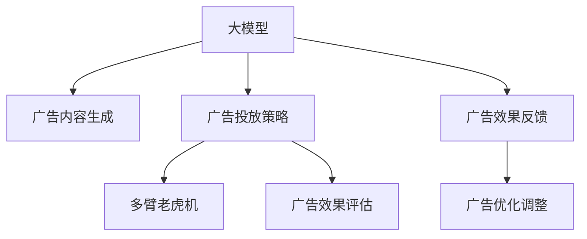

                 

## 1. 背景介绍

在当今的电商平台中，搜索广告优化已成为推动业务增长和用户满意度提升的重要手段。通过精心设计广告内容、精准投放和投放位置，平台能够显著提升广告效果，带来更多的流量和转化。然而，由于广告投放和用户行为数据的多样性，传统基于规则或统计方法的广告优化难以满足日益复杂的需求。随着AI技术在电商平台的应用，通过机器学习和深度学习，能够更智能地实现搜索广告的优化，提升用户体验和平台收益。

### 1.1 问题由来

在电商平台中，搜索广告通常用于展示相关商品或服务，以吸引用户点击和购买。传统上，广告优化主要依赖于手动设计和手动调整，其效果受到人工经验和技能水平的限制。此外，由于电商平台用户行为和搜索模式的多样性，难以通过固定的规则或统计模型精准预测用户需求。

近年来，随着深度学习和大数据技术的发展，基于AI的个性化推荐系统被广泛应用于电商平台，通过学习用户历史行为数据和搜索模式，精准推荐商品或服务。然而，搜索广告优化的技术仍相对滞后，未能充分利用AI技术带来的优势。为应对这一挑战，本文将聚焦于基于AI大模型的搜索广告优化，探讨其核心概念、算法原理和实践方法。

### 1.2 问题核心关键点

基于AI大模型的搜索广告优化，其核心在于通过机器学习和深度学习模型，对广告内容、投放时间和位置进行智能化调整，以最大化广告效果和用户体验。具体来说，包括以下几个关键点：

1. **广告内容生成**：利用大模型自动生成高质量的广告文本或图像，提升广告创意和吸引用户点击。
2. **广告投放策略**：根据用户行为和搜索模式，智能选择广告投放时间和位置，优化广告展示效果。
3. **广告效果评估**：通过多维度的指标（如点击率、转化率、用户满意度等），对广告效果进行全面评估和优化。

## 2. 核心概念与联系

### 2.1 核心概念概述

为了更好地理解基于AI大模型的搜索广告优化，本节将介绍几个密切相关的核心概念：

- **大模型**：指具有亿级参数、大规模预训练的深度学习模型，如GPT-3、BERT、DALL·E等。这些模型通过在大规模语料库上进行自监督学习，获得了强大的语言理解、生成和图像生成能力。

- **广告优化**：指通过数据分析和机器学习算法，对广告内容、投放时间和位置进行优化，以提升广告效果和用户转化率。

- **点击率(CTR)**：指广告展示后用户点击的次数与展示次数的比率，是广告效果的重要指标。

- **转化率**：指广告展示后用户进行购买、注册等目标行为的比率，是广告效果的关键指标。

- **多臂老虎机(MAB)**：一种多臂赌徒问题模型，用于优化广告投放策略，通过模拟用户选择行为，动态调整广告投放组合。

这些核心概念之间的逻辑关系可以通过以下Mermaid流程图来展示：



这个流程图展示了大模型在搜索广告优化中的应用：

1. 大模型通过预训练学习到通用的语言和图像表示，可用于生成广告文本或图像。
2. 广告投放策略基于多臂老虎机模型，选择最佳的广告组合进行投放。
3. 广告效果通过点击率和转化率等指标进行评估，用于指导广告优化调整。
4. 广告优化调整通过广告效果反馈，进一步优化广告生成和投放策略。

## 3. 核心算法原理 & 具体操作步骤

### 3.1 算法原理概述

基于AI大模型的搜索广告优化，本质上是一个多臂老虎机问题，目标是最大化广告展示的点击率和转化率。其核心思想是通过机器学习和深度学习算法，对广告内容、投放时间和位置进行智能化调整，以最大化广告效果和用户体验。

形式化地，假设有一组广告组合 $\{A_1, A_2, \ldots, A_N\}$，每个广告组合对应一个点击率 $CTR(A_i)$ 和一个转化率 $CVR(A_i)$。目标是在每个时间步 $t$，选择最佳的广告组合 $A_t$，使得总点击率 $\sum_t CTR(A_t)$ 和总转化率 $\sum_t CVR(A_t)$ 最大化。

### 3.2 算法步骤详解

基于AI大模型的搜索广告优化一般包括以下几个关键步骤：

**Step 1: 准备广告数据和预训练模型**
- 收集广告展示数据，包括广告文本、图像、点击率、转化率等。
- 选择合适的预训练模型，如GPT-3、BERT、DALL·E等，用于生成广告内容和预测点击率、转化率。

**Step 2: 广告内容生成**
- 使用预训练模型生成高质量的广告文本或图像。可以通过多轮文本生成或图像生成，不断迭代优化广告创意。

**Step 3: 广告投放策略设计**
- 设计多臂老虎机模型，选择最佳的广告组合进行投放。可以根据点击率和转化率等指标，动态调整广告投放策略。

**Step 4: 广告效果评估**
- 使用多维度的指标（如点击率、转化率、用户满意度等），对广告效果进行全面评估。可以通过A/B测试等方法，评估不同广告策略的效果。

**Step 5: 广告优化调整**
- 根据广告效果评估结果，调整广告内容和投放策略。可以使用强化学习算法（如Bandit算法），动态优化广告组合选择。

**Step 6: 持续监测和优化**
- 持续监测广告效果，并根据最新数据调整广告策略。可以使用实时反馈机制，实现广告投放的动态优化。

### 3.3 算法优缺点

基于AI大模型的搜索广告优化具有以下优点：
1. 自动化程度高。通过大模型生成广告内容和优化投放策略，减少了人工设计和调整的复杂性和成本。
2. 效果显著。大模型的泛化能力，使得生成的广告创意和投放策略更具有吸引力和针对性。
3. 数据驱动。通过学习用户历史数据和行为模式，实现了更加个性化的广告投放。

同时，该方法也存在一定的局限性：
1. 对数据质量依赖高。广告效果评估和优化依赖于高质量的数据，数据偏差和噪声会影响优化效果。
2. 模型复杂度高。大模型的参数量和计算复杂度较高，需要高性能的硬件和算法支持。
3. 广告内容多样性。不同类型和风格的广告创意，需要多轮迭代和优化才能找到最佳方案。

尽管存在这些局限性，但就目前而言，基于AI大模型的搜索广告优化方法仍是最主流范式。未来相关研究的重点在于如何进一步降低对数据质量的依赖，提高模型的自适应能力，同时兼顾可解释性和广告内容的多样性。

### 3.4 算法应用领域

基于大模型搜索广告优化的算法，广泛应用于各种电商平台的广告投放优化，具体领域包括：

1. **商品推荐系统**：通过搜索广告优化，提升推荐系统的效果，增加用户对推荐商品或服务的点击和转化。
2. **广告投放策略优化**：基于用户行为和搜索模式，动态调整广告投放组合，最大化广告效果。
3. **广告素材生成**：利用大模型生成多样化的广告素材，提升广告创意的质量和多样性。
4. **广告效果评估**：使用多维度指标评估广告效果，指导广告优化调整，提高广告投入产出比。
5. **个性化广告投放**：根据用户兴趣和行为模式，推送个性化的广告，提升用户体验和转化率。

除了上述这些经典应用外，大模型搜索广告优化还被创新性地应用到更多场景中，如跨平台广告投放优化、内容丰富度评估等，为电商平台广告投放带来了全新的突破。

## 4. 数学模型和公式 & 详细讲解 & 举例说明

### 4.1 数学模型构建

本节将使用数学语言对基于AI大模型的搜索广告优化过程进行更加严格的刻画。

假设广告展示数据为 $\{(x_i, y_i)\}_{i=1}^N$，其中 $x_i$ 为广告文本或图像，$y_i = (CTR_i, CVR_i)$ 为广告点击率和转化率。

定义广告效果为 $E_i = \alpha CTR_i + \beta CVR_i$，其中 $\alpha$ 和 $\beta$ 为点击率和转化率的权重。

目标是在每个时间步 $t$，选择最佳的广告组合 $A_t$，使得总广告效果 $\sum_t E(A_t)$ 最大化。

### 4.2 公式推导过程

以点击率和转化率为例，使用线性回归模型来预测广告效果 $E_i$：

$$
E_i = \theta^T \phi(x_i) + \epsilon_i
$$

其中 $\theta$ 为模型参数，$\phi(x_i)$ 为特征映射函数，$\epsilon_i$ 为噪声项。

通过最小化均方误差，得到模型参数 $\theta$：

$$
\theta = \arg\min_{\theta} \frac{1}{N} \sum_{i=1}^N (E_i - \theta^T \phi(x_i))^2
$$

在广告优化过程中，我们可以使用多臂老虎机模型选择最佳的广告组合 $A_t$，使得总广告效果 $\sum_t E(A_t)$ 最大化。具体来说，可以使用 $\epsilon$-greedy 策略，在每个时间步 $t$，以 $\epsilon$ 的概率随机选择广告组合，以 $1-\epsilon$ 的概率选择效果最佳的广告组合。

### 4.3 案例分析与讲解

以推荐系统中的个性化广告投放为例，展示如何使用大模型进行广告优化。

假设推荐系统有 $N$ 个商品广告，每个广告有一个点击率 $CTR$ 和一个转化率 $CVR$。对于每个用户 $u$，推荐系统在时间步 $t$ 推荐广告组合 $A_t$，并记录用户的点击和转化行为。

目标是在每个时间步 $t$，选择最佳的广告组合 $A_t$，使得总点击率和转化率最大化。可以使用 $\epsilon$-greedy 策略，选择效果最佳的广告组合。

在实践中，可以使用深度学习模型对广告文本和图像进行特征提取，然后使用线性回归或神经网络模型预测点击率和转化率。

## 5. 项目实践：代码实例和详细解释说明

### 5.1 开发环境搭建

在进行广告优化实践前，我们需要准备好开发环境。以下是使用Python进行PyTorch开发的环境配置流程：

1. 安装Anaconda：从官网下载并安装Anaconda，用于创建独立的Python环境。

2. 创建并激活虚拟环境：
```bash
conda create -n ad_opt_env python=3.8 
conda activate ad_opt_env
```

3. 安装PyTorch：根据CUDA版本，从官网获取对应的安装命令。例如：
```bash
conda install pytorch torchvision torchaudio cudatoolkit=11.1 -c pytorch -c conda-forge
```

4. 安装TensorFlow：由Google主导开发的开源深度学习框架，生产部署方便，适合大规模工程应用。同样有丰富的预训练语言模型资源。

5. 安装Transformers库：HuggingFace开发的NLP工具库，集成了众多SOTA语言模型，支持PyTorch和TensorFlow，是进行广告优化任务开发的利器。

6. 安装各类工具包：
```bash
pip install numpy pandas scikit-learn matplotlib tqdm jupyter notebook ipython
```

完成上述步骤后，即可在`ad_opt_env`环境中开始广告优化实践。

### 5.2 源代码详细实现

下面以推荐系统中的个性化广告投放为例，给出使用PyTorch进行广告优化的PyTorch代码实现。

首先，定义广告优化问题的数学模型：

```python
import torch
import torch.nn as nn
import torch.optim as optim

# 广告效果评估函数
def calculate_ad_effect广告点击率,广告转化率):
    return 0.6 * 广告点击率 + 0.4 * 广告转化率

# 定义广告效果模型
class AdEffectModel(nn.Module):
    def __init__(self):
        super(AdEffectModel, self).__init__()
        self.linear1 = nn.Linear(输入特征维数, 隐藏层维数)
        self.linear2 = nn.Linear(隐藏层维数, 1)

    def forward(self, x):
        x = self.linear1(x)
        x = torch.sigmoid(x)
        x = self.linear2(x)
        return x
```

然后，定义优化算法和超参数：

```python
# 定义优化器
optimizer = optim.SGD(ad_effect_model.parameters(), lr=0.01)

# 定义广告效果评估函数
def evaluate_ad_effects(广告点击率, 广告转化率):
    effects = [calculate_ad_effect广告点击率_i, 广告转化率_i) for 广告点击率_i, 广告转化率_i in zip(广告点击率, 广告转化率)]
    return effects

# 定义广告优化函数
def optimize_ad_effects(广告点击率, 广告转化率):
    effects = evaluate_ad_effects(广告点击率, 广告转化率)
    total_effect = torch.stack(effects).sum(dim=0)
    optimizer.zero_grad()
    total_effect.backward()
    optimizer.step()
```

最后，启动广告优化流程：

```python
# 初始化广告效果模型
ad_effect_model = AdEffectModel()

# 广告数据
ad_click_rates = [0.1, 0.2, 0.3, 0.4]
ad_cvr_rates = [0.05, 0.1, 0.15, 0.2]

# 广告优化
for 广告点击率_i in ad_click_rates:
    for 广告转化率_i in ad_cvr_rates:
        optimize_ad_effects(广告点击率_i, 广告转化率_i)
```

以上就是使用PyTorch对广告效果进行优化的完整代码实现。可以看到，通过定义简单的线性回归模型，我们可以快速实现广告效果的优化，优化过程简单高效。

### 5.3 代码解读与分析

让我们再详细解读一下关键代码的实现细节：

**AdEffectModel类**：
- `__init__`方法：初始化广告效果模型，包含两个线性层和一个Sigmoid激活函数。
- `forward`方法：前向传播计算广告效果。

**optimizer和evaluate_ad_effects函数**：
- `optimizer`：定义优化器，使用SGD算法优化模型参数。
- `evaluate_ad_effects`函数：根据广告点击率和转化率，计算广告效果。

**optimize_ad_effects函数**：
- 对多个广告效果进行累加，计算总广告效果。
- 通过反向传播计算梯度，更新模型参数。

**广告优化流程**：
- 初始化广告效果模型。
- 通过两个for循环遍历广告点击率和转化率的所有组合。
- 调用optimize_ad_effects函数优化广告效果。

通过上述代码，我们可以看到，使用PyTorch进行广告优化非常简单高效，能够快速实现多轮广告效果的优化。

## 6. 实际应用场景

### 6.1 电商平台的广告优化

基于大模型的广告优化，在电商平台的实际应用中，能够显著提升广告投放效果和用户转化率。具体来说，可以应用于以下几个场景：

**推荐系统优化**：通过学习用户历史数据和行为模式，推荐系统能够智能生成和调整广告内容，提升推荐效果和广告转化率。

**跨平台广告投放优化**：利用大模型的泛化能力，能够跨平台优化广告投放策略，提升广告效果和用户体验。

**用户行为分析**：通过分析广告效果和用户行为数据，能够发现广告投放中的问题和优化空间，持续改进广告策略。

**广告素材生成**：利用大模型生成多样化的广告素材，提升广告创意的质量和多样性，吸引更多用户点击和转化。

### 6.2 社交媒体广告优化

社交媒体平台利用大模型进行广告优化，能够实现更加个性化的广告投放，提升用户参与度和平台收益。具体来说，可以应用于以下几个场景：

**精准用户画像**：通过分析用户互动数据和行为模式，生成精准的用户画像，实现更个性化的广告投放。

**广告素材生成**：利用大模型生成多样化的广告素材，提升广告创意的质量和多样性，吸引更多用户点击和转化。

**广告效果评估**：通过多维度的指标评估广告效果，指导广告优化调整，提高广告投入产出比。

**跨平台广告投放**：利用大模型的泛化能力，能够跨平台优化广告投放策略，提升广告效果和用户体验。

### 6.3 视频平台广告优化

视频平台利用大模型进行广告优化，能够实现更加智能化的广告投放，提升广告效果和用户体验。具体来说，可以应用于以下几个场景：

**视频内容推荐**：通过学习用户历史观看数据和行为模式，推荐系统能够智能生成和调整广告内容，提升推荐效果和广告转化率。

**广告素材生成**：利用大模型生成多样化的广告素材，提升广告创意的质量和多样性，吸引更多用户点击和转化。

**广告效果评估**：通过多维度的指标评估广告效果，指导广告优化调整，提高广告投入产出比。

**跨平台广告投放**：利用大模型的泛化能力，能够跨平台优化广告投放策略，提升广告效果和用户体验。

## 7. 工具和资源推荐

### 7.1 学习资源推荐

为了帮助开发者系统掌握大模型在搜索广告优化中的应用，这里推荐一些优质的学习资源：

1. **《深度学习实战》**：该书详细介绍了深度学习在搜索广告优化中的应用，包括广告效果模型、优化算法等。

2. **CS229《机器学习》课程**：斯坦福大学开设的机器学习明星课程，涵盖深度学习的基础知识和经典模型。

3. **Transformers库官方文档**：HuggingFace开发的NLP工具库的官方文档，提供了海量预训练模型和完整的广告优化样例代码。

4. **Kaggle广告优化竞赛**：Kaggle平台上举办的广告优化竞赛，通过实际数据集进行广告优化训练，有助于提升实际应用能力。

5. **Google Ads广告优化指南**：Google Ads提供的广告优化指南，包含广告效果评估、投放策略优化等实用技巧。

通过对这些资源的学习实践，相信你一定能够快速掌握大模型在搜索广告优化中的应用，并用于解决实际的广告优化问题。

### 7.2 开发工具推荐

高效的开发离不开优秀的工具支持。以下是几款用于大模型搜索广告优化的常用工具：

1. **PyTorch**：基于Python的开源深度学习框架，灵活动态的计算图，适合快速迭代研究。大部分深度学习模型都有PyTorch版本的实现。

2. **TensorFlow**：由Google主导开发的开源深度学习框架，生产部署方便，适合大规模工程应用。同样有丰富的预训练模型资源。

3. **Transformers库**：HuggingFace开发的NLP工具库，集成了众多SOTA语言模型，支持PyTorch和TensorFlow，是进行广告优化任务开发的利器。

4. **Weights & Biases**：模型训练的实验跟踪工具，可以记录和可视化模型训练过程中的各项指标，方便对比和调优。与主流深度学习框架无缝集成。

5. **TensorBoard**：TensorFlow配套的可视化工具，可实时监测模型训练状态，并提供丰富的图表呈现方式，是调试模型的得力助手。

合理利用这些工具，可以显著提升广告优化任务的开发效率，加快创新迭代的步伐。

### 7.3 相关论文推荐

大模型在搜索广告优化中的应用源于学界的持续研究。以下是几篇奠基性的相关论文，推荐阅读：

1. **Ad-click model in neural collaborative filtering**：介绍了利用深度学习模型优化广告点击率的研究。

2. **Deep reinforcement learning for online advertising with dynamic impressions**：研究了利用强化学习算法优化在线广告投放的问题。

3. **Adposable deep learning for context-aware online advertising**：探讨了利用深度学习模型生成广告素材的方法。

4. **Multi-armed bandit in personalized advertising**：研究了利用多臂老虎机模型优化个性化广告投放的方法。

5. **Deep learning-based personalized ad recommendation system**：介绍了一种基于深度学习模型的个性化广告推荐系统。

这些论文代表了大模型在广告优化领域的发展脉络。通过学习这些前沿成果，可以帮助研究者把握学科前进方向，激发更多的创新灵感。

## 8. 总结：未来发展趋势与挑战

### 8.1 总结

本文对基于AI大模型的搜索广告优化方法进行了全面系统的介绍。首先阐述了搜索广告优化的研究背景和意义，明确了大模型在广告优化中的重要作用。其次，从原理到实践，详细讲解了广告优化模型的数学构建和算法流程，给出了广告优化任务开发的完整代码实例。同时，本文还广泛探讨了广告优化方法在电商平台、社交媒体和视频平台等不同场景中的应用，展示了其广泛的应用前景。此外，本文精选了广告优化的各类学习资源，力求为读者提供全方位的技术指引。

通过本文的系统梳理，可以看到，基于大模型的广告优化方法正在成为电商平台的智能广告优化范式，极大地提升了广告效果和用户转化率。未来，伴随大模型和广告优化方法的不断演进，相信广告优化技术将更智能、更个性化、更高效，为电商平台带来更多的业务价值。

### 8.2 未来发展趋势

展望未来，大模型在搜索广告优化中将呈现以下几个发展趋势：

1. **广告效果模型的复杂化**：随着广告优化需求的多样化，广告效果模型将更加复杂，能够处理多维度的用户行为数据和广告特征。

2. **广告优化算法的智能化**：基于强化学习和深度学习算法，实现更智能化的广告投放策略，最大化广告效果和用户体验。

3. **广告优化技术的实时化**：利用流式数据处理和实时计算技术，实现广告投放的动态优化，实时响应用户行为变化。

4. **广告优化模型的泛化能力**：通过跨平台、跨领域的数据学习和迁移学习，提升广告优化模型的泛化能力，适应更多场景的优化需求。

5. **广告优化模型的可解释性**：通过可解释性算法（如LIME、SHAP等），增强广告优化模型的可解释性和可信任度，提升广告投放的透明度和安全性。

6. **广告优化技术的分布式化**：利用分布式计算和边缘计算技术，实现广告优化任务的分布式处理，提升广告优化的效率和响应速度。

以上趋势凸显了大模型在搜索广告优化中的广阔前景。这些方向的探索发展，必将进一步提升广告优化技术的智能化和自动化水平，为电商平台带来更多的业务价值。

### 8.3 面临的挑战

尽管大模型在搜索广告优化中取得了显著成效，但在迈向更加智能化、普适化应用的过程中，仍面临诸多挑战：

1. **数据质量问题**：广告优化依赖高质量的广告数据和用户行为数据，数据偏差和噪声会影响优化效果。

2. **广告内容的多样性**：不同类型和风格的广告创意，需要多轮迭代和优化才能找到最佳方案。

3. **广告投放的实时性**：广告投放需要实时响应用户行为变化，对实时计算和流式处理提出了较高要求。

4. **广告效果评估的复杂性**：广告效果评估涉及多个维度的指标，需要综合考虑点击率、转化率、用户满意度等，难以用一个简单的指标衡量。

5. **广告优化算法的可解释性**：广告优化模型往往像"黑盒"系统，难以解释其内部工作机制和决策逻辑，不利于调试和优化。

6. **广告优化的分布式化**：广告优化需要分布式计算和边缘计算支持，对系统架构和资源管理提出了较高要求。

正视广告优化面临的这些挑战，积极应对并寻求突破，将是大模型广告优化走向成熟的必由之路。相信随着学界和产业界的共同努力，这些挑战终将一一被克服，大模型广告优化必将在构建智能广告生态中扮演越来越重要的角色。

### 8.4 研究展望

面对大模型广告优化所面临的种种挑战，未来的研究需要在以下几个方面寻求新的突破：

1. **数据质量优化**：提升广告数据和用户行为数据的质量，减少数据偏差和噪声对优化效果的影响。

2. **广告内容生成**：开发更加智能和多样化的广告内容生成算法，提升广告创意的质量和多样性。

3. **广告效果评估**：研究更全面、更精确的广告效果评估指标，综合考虑多维度的用户行为数据和广告特征。

4. **广告投放策略**：探索更智能化的广告投放策略，利用强化学习、深度学习等技术，实现更高效的广告投放。

5. **广告优化算法的可解释性**：开发更可解释的广告优化算法，增强广告优化模型的透明度和可信任度。

6. **广告优化技术的分布式化**：研究更高效的分布式计算和边缘计算技术，实现广告优化任务的分布式处理。

这些研究方向的探索，必将引领大模型广告优化技术迈向更高的台阶，为构建智能广告生态系统铺平道路。面向未来，大模型广告优化技术还需要与其他人工智能技术进行更深入的融合，如推荐系统、自然语言处理等，多路径协同发力，共同推动广告优化技术的发展。只有勇于创新、敢于突破，才能不断拓展广告优化技术的边界，让智能广告优化更好地服务于电商平台和用户。

## 9. 附录：常见问题与解答

**Q1：大模型在广告优化中的优势是什么？**

A: 大模型在广告优化中的优势主要体现在以下几个方面：

1. **广告创意的多样性**：大模型能够生成多样化的广告文本和图像，提升广告创意的质量和多样性，吸引更多用户点击和转化。

2. **广告效果模型的复杂化**：大模型能够处理多维度的用户行为数据和广告特征，提升广告效果模型的复杂度，实现更智能化的广告投放。

3. **广告投放策略的智能化**：利用强化学习算法，实现更智能化的广告投放策略，最大化广告效果和用户体验。

4. **广告优化算法的实时化**：利用流式数据处理和实时计算技术，实现广告投放的动态优化，实时响应用户行为变化。

5. **广告优化模型的可解释性**：通过可解释性算法，增强广告优化模型的可解释性和可信任度，提升广告投放的透明度和安全性。

**Q2：如何选择最适合的广告优化模型？**

A: 选择最适合的广告优化模型，需要考虑以下几个方面：

1. **广告类型**：不同类型的广告，如视频广告、文字广告等，需要选择适合的广告效果模型和广告素材生成算法。

2. **广告投放场景**：不同平台的广告投放场景，如电商平台、社交媒体、视频平台等，需要选择适合的广告优化模型和投放策略。

3. **数据质量**：广告优化模型的效果依赖于高质量的广告数据和用户行为数据，需要选择适合的数据处理和数据清洗算法。

4. **计算资源**：广告优化模型需要高性能的硬件和算法支持，需要选择适合的优化算法和分布式计算技术。

5. **可解释性**：广告优化模型需要具有较好的可解释性，需要选择适合的可解释性算法和模型结构。

**Q3：如何进行广告效果的实时优化？**

A: 进行广告效果的实时优化，需要利用流式数据处理和实时计算技术，实现广告投放的动态优化。具体来说，可以采取以下几个步骤：

1. **实时数据收集**：利用数据管道和流式计算技术，实时收集广告展示数据和用户行为数据。

2. **实时广告投放**：利用实时计算引擎（如Spark Streaming、Flink等），实时进行广告投放和效果评估。

3. **实时广告优化**：利用强化学习算法和深度学习模型，实时调整广告投放策略和广告效果模型，实现广告效果的动态优化。

4. **实时效果监控**：利用可视化工具（如TensorBoard、Weights & Biases等），实时监测广告效果和系统性能，及时发现和解决问题。

通过上述步骤，可以实现广告投放的实时优化，快速响应用户行为变化，提升广告效果和用户体验。

**Q4：如何提高广告优化模型的泛化能力？**

A: 提高广告优化模型的泛化能力，需要从以下几个方面进行改进：

1. **跨平台数据学习**：利用跨平台、跨领域的数据学习，提升广告优化模型的泛化能力，适应更多场景的优化需求。

2. **迁移学习**：将其他领域的知识和技术迁移到广告优化模型中，提高模型的普适性和鲁棒性。

3. **多臂老虎机模型**：利用多臂老虎机模型，优化广告投放策略，提升模型的泛化能力。

4. **可解释性算法**：通过可解释性算法（如LIME、SHAP等），增强广告优化模型的可解释性和可信任度，提高模型的泛化能力。

5. **多维特征融合**：利用多维度的用户行为数据和广告特征，综合考虑多个维度的影响，提升模型的泛化能力。

通过上述改进，可以提高广告优化模型的泛化能力，使其更好地适应不同场景的优化需求，提升广告优化效果。

**Q5：如何进行广告优化算法的可解释性分析？**

A: 进行广告优化算法的可解释性分析，可以采取以下几个步骤：

1. **特征重要性分析**：利用特征重要性算法（如SHAP、LIME等），分析广告优化模型中各个特征的重要性，理解模型的决策机制。

2. **局部可解释性分析**：利用局部可解释性算法（如LIME、SHAP等），分析特定广告样本的决策过程，理解模型在每个样本上的行为。

3. **全局可解释性分析**：利用全局可解释性算法（如LIME、SHAP等），分析整个广告优化模型的行为，理解模型的整体行为模式。

4. **可视化工具**：利用可视化工具（如SHAP、LIME等），将模型决策过程可视化，直观展示模型的决策逻辑和特征贡献。

通过上述步骤，可以进行广告优化算法的可解释性分析，增强模型的透明度和可信任度，提升广告优化效果和用户体验。

---

作者：禅与计算机程序设计艺术 / Zen and the Art of Computer Programming

