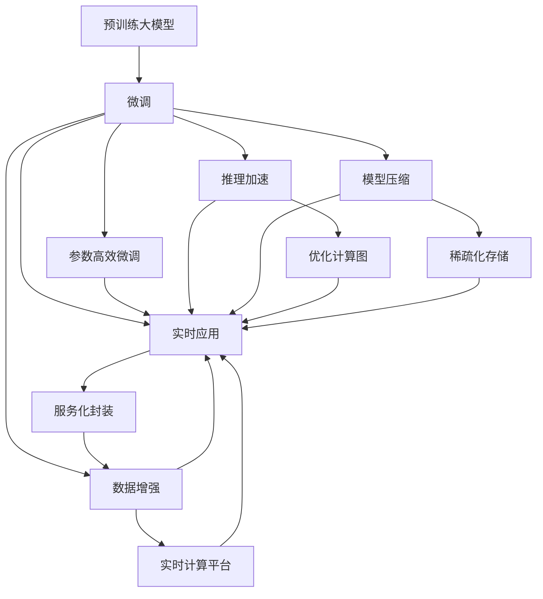

                 

# 电商平台中的AI大模型：从离线到实时

## 1. 背景介绍

在现代电商平台的运营中，人工智能（AI）技术扮演着至关重要的角色。从智能推荐到图像识别，从语音搜索到自然语言处理（NLP），AI正逐步渗透到电商平台的各个角落，极大地提升了用户体验和平台效率。其中，预训练大模型作为AI的核心组件，通过自监督学习等方式在大规模无标签数据上预训练得到丰富的知识表示，能够在多领域、多任务上提供强大的支持。然而，随着电商平台对实时响应需求日益增长，如何实现离线训练得到的预训练模型到实时应用的平滑过渡，成为当前AI在电商平台应用中亟待解决的问题。本文将系统地介绍如何将预训练大模型应用于电商平台，并着重探讨如何将离线训练的大模型转化为实时响应应用，为电商平台的AI应用实践提供指导。

## 2. 核心概念与联系

### 2.1 核心概念概述

- **预训练大模型**：基于自监督学习任务（如语言建模、掩码预测等）在大规模无标签数据上预训练得到的模型。常见的预训练模型包括BERT、GPT-3、RoBERTa等。
- **微调**：将预训练模型应用于特定任务，通过小规模有标签数据调整模型参数，使其在特定任务上表现优异。
- **实时应用**：指在用户请求到达时，立即响应并输出结果的过程。与离线训练不同，实时应用需要考虑计算效率和资源利用率。
- **模型压缩**：在保持模型精度不变的情况下，通过剪枝、量化等技术减少模型参数量，提高计算效率。
- **推理加速**：通过优化模型计算图，如模型并行、推理图优化等，减少模型推理时间，提高实时响应能力。

这些概念之间通过一系列的技术手段和实践流程紧密联系，共同构成了将离线训练的预训练大模型应用于实时应用的基础框架。

### 2.2 核心概念原理和架构的 Mermaid 流程图



该流程图展示了从预训练大模型的微调到实时应用的完整流程：

1. **A到B**：预训练大模型通过微调技术针对特定任务进行优化。
2. **B到C**：微调后的模型通过数据增强、参数高效微调、推理加速和模型压缩等技术，转化为实时应用。
3. **B到D**：数据增强技术用于扩充训练集，提升模型的泛化能力。
4. **B到E**：参数高效微调技术用于在减少参数量的情况下提升模型精度。
5. **B到F**：推理加速技术用于优化计算图，提高推理效率。
6. **B到G**：模型压缩技术用于减少模型大小，降低内存占用。
7. **C到H**：服务化封装技术用于将模型封装为标准接口，便于实时调用。
8. **H到I**：实时计算平台用于支持模型的推理加速和推理结果的实时输出。
9. **F到J**：优化计算图技术用于提升模型推理效率。
10. **G到K**：稀疏化存储技术用于减少模型参数的存储需求。

## 3. 核心算法原理 & 具体操作步骤

### 3.1 算法原理概述

将离线训练的预训练大模型应用于实时应用，需要解决以下关键问题：

- **数据增强**：如何通过少量标注数据和无标签数据提升模型泛化能力。
- **参数高效微调**：如何在保持模型精度不变的情况下，减少模型参数量，提高推理效率。
- **推理加速**：如何优化计算图，减少模型推理时间，提高实时响应能力。
- **模型压缩**：如何在保证模型精度的同时，减小模型大小，降低内存占用。
- **服务化封装**：如何将模型封装为标准接口，便于实时调用。

### 3.2 算法步骤详解

#### 3.2.1 数据增强

数据增强（Data Augmentation）是提升模型泛化能力的关键技术之一。在电商平台的实时应用中，可以通过以下几种方式进行数据增强：

1. **文本生成**：使用生成式模型生成虚拟用户行为数据，丰富训练集。
2. **回译**：将英文文本回译为中文，增加训练数据量。
3. **近义词替换**：替换部分文本中的词语，生成新的训练样本。
4. **数据混洗**：将不同用户的行为数据混合，模拟不同用户群体。

#### 3.2.2 参数高效微调

参数高效微调（Parameter-Efficient Fine-Tuning, PEFT）旨在通过减少模型参数量，提升模型的实时响应能力。常见的参数高效微调技术包括：

1. **Adapter**：在预训练模型顶层添加可微调的Adapter层，只更新少量参数。
2. **Prompt Engineering**：通过精心设计的输入文本格式，引导模型按期望方式输出，减少微调参数。
3. **Soft Label**：使用Soft Label技术，只更新模型输出层的权重。

#### 3.2.3 推理加速

推理加速（Inference Acceleration）是提升模型实时响应的关键技术之一。常见的推理加速技术包括：

1. **计算图优化**：通过优化计算图，减少推理时间。
2. **模型并行**：利用多GPU或多TPU进行并行计算，加速推理过程。
3. **推理图优化**：使用静态图优化技术，减少推理时间。

#### 3.2.4 模型压缩

模型压缩（Model Compression）用于在保持模型精度不变的情况下，减小模型大小。常见的模型压缩技术包括：

1. **剪枝**：去除模型中的冗余参数，减小模型大小。
2. **量化**：将浮点参数转为定点参数，减少计算量。
3. **知识蒸馏**：使用更小规模的模型进行知识蒸馏，压缩原始模型。

#### 3.2.5 服务化封装

服务化封装（Service-Level Packaging）是将模型封装为标准接口，便于实时调用。常见的服务化封装技术包括：

1. **RESTful API**：通过RESTful API接口，调用预训练模型进行推理。
2. **GraphQL**：使用GraphQL进行API调用，灵活获取模型输出。
3. **Docker容器**：将模型封装为Docker容器，便于部署和迁移。

### 3.3 算法优缺点

#### 3.3.1 优点

- **高效性**：通过数据增强和参数高效微调技术，可以大幅减少模型参数量，提升实时响应能力。
- **泛化能力**：数据增强技术可以提高模型泛化能力，减少因数据不足造成的性能下降。
- **灵活性**：服务化封装技术使得模型可以灵活地部署在不同的计算平台和环境中。

#### 3.3.2 缺点

- **计算成本**：数据增强和参数高效微调可能需要大量的计算资源和时间，增加系统负担。
- **模型精度**：模型压缩和推理加速可能导致模型精度下降，影响模型性能。
- **复杂性**：服务化封装可能增加系统复杂度，影响系统稳定性和可靠性。

### 3.4 算法应用领域

将离线训练的预训练大模型应用于实时应用，主要应用于以下领域：

1. **智能推荐系统**：通过微调推荐模型，提升个性化推荐效果。
2. **搜索引擎**：通过微调搜索引擎模型，提升搜索准确性和召回率。
3. **图像识别**：通过微调图像识别模型，提升商品识别和分类效果。
4. **语音识别**：通过微调语音识别模型，提升语音搜索和客服交互效果。
5. **自然语言处理**：通过微调NLP模型，提升聊天机器人、情感分析等效果。

## 4. 数学模型和公式 & 详细讲解 & 举例说明

### 4.1 数学模型构建

在电商平台中，预训练大模型通常用于解决以下问题：

- **用户行为分析**：通过分析用户历史行为数据，预测用户未来行为。
- **商品推荐**：通过分析用户历史购买数据和商品特征，推荐用户可能感兴趣的商品。
- **情感分析**：通过分析用户评论和反馈，分析用户情感倾向。
- **语音识别**：通过分析用户语音指令，执行相应操作。

以用户行为分析为例，假设用户历史行为数据为 $(x_1, x_2, ..., x_n)$，其中 $x_i$ 表示用户在第 $i$ 次点击或购买商品的行为数据。模型输入为 $x_i$，输出为 $y_i$，表示用户行为标签。模型的目标是最小化预测误差，即：

$$
\min_{\theta} \sum_{i=1}^{n} \ell(y_i, M_{\theta}(x_i))
$$

其中，$\ell$ 为损失函数，$M_{\theta}$ 为预训练模型。

### 4.2 公式推导过程

以用户行为分析为例，假设用户行为标签为二分类问题（如点击或购买），则模型输出为 $M_{\theta}(x_i)$。模型预测的损失函数为：

$$
\ell(y_i, M_{\theta}(x_i)) = -y_i\log M_{\theta}(x_i) - (1-y_i)\log(1-M_{\theta}(x_i))
$$

在模型训练过程中，使用梯度下降等优化算法更新模型参数 $\theta$，最小化经验风险：

$$
\mathcal{L}(\theta) = \frac{1}{N} \sum_{i=1}^{n} \ell(y_i, M_{\theta}(x_i))
$$

其中 $N$ 为样本总数。

### 4.3 案例分析与讲解

以智能推荐系统为例，假设推荐模型为 $M_{\theta}(x, y)$，其中 $x$ 表示用户历史行为数据，$y$ 表示商品特征。模型的目标是最小化预测误差，即：

$$
\min_{\theta} \sum_{i=1}^{n} \ell(y_i, M_{\theta}(x_i, y_i))
$$

其中，$\ell$ 为损失函数，$M_{\theta}$ 为预训练模型。

假设模型使用交叉熵损失函数，则损失函数为：

$$
\ell(y_i, M_{\theta}(x_i, y_i)) = -y_i\log M_{\theta}(x_i, y_i) - (1-y_i)\log(1-M_{\theta}(x_i, y_i))
$$

在模型训练过程中，使用梯度下降等优化算法更新模型参数 $\theta$，最小化经验风险：

$$
\mathcal{L}(\theta) = \frac{1}{N} \sum_{i=1}^{n} \ell(y_i, M_{\theta}(x_i, y_i))
$$

其中 $N$ 为样本总数。

## 5. 项目实践：代码实例和详细解释说明

### 5.1 开发环境搭建

在实践过程中，需要搭建一个包含预训练模型、计算资源和实时计算平台的开发环境。具体步骤如下：

1. **选择预训练模型**：如BERT、GPT-3、RoBERTa等，加载预训练模型参数。
2. **安装计算资源**：选择合适的计算资源，如CPU、GPU或TPU，确保有足够的计算资源。
3. **配置实时计算平台**：如Kubernetes、Docker等，配置好计算资源的部署环境。

### 5.2 源代码详细实现

以下以用户行为分析为例，使用PyTorch框架实现微调模型。

```python
import torch
import torch.nn as nn
import torch.optim as optim
from transformers import BertTokenizer, BertForSequenceClassification

# 加载预训练模型和分词器
tokenizer = BertTokenizer.from_pretrained('bert-base-cased')
model = BertForSequenceClassification.from_pretrained('bert-base-cased', num_labels=2)

# 定义训练函数
def train_model(model, optimizer, criterion, train_loader, device):
    model.train()
    total_loss = 0
    for batch in train_loader:
        input_ids = batch['input_ids'].to(device)
        attention_mask = batch['attention_mask'].to(device)
        labels = batch['labels'].to(device)
        optimizer.zero_grad()
        outputs = model(input_ids, attention_mask=attention_mask, labels=labels)
        loss = criterion(outputs, labels)
        total_loss += loss.item()
        loss.backward()
        optimizer.step()
    return total_loss / len(train_loader)

# 定义评估函数
def evaluate_model(model, test_loader, device):
    model.eval()
    total_correct = 0
    total_sample = 0
    with torch.no_grad():
        for batch in test_loader:
            input_ids = batch['input_ids'].to(device)
            attention_mask = batch['attention_mask'].to(device)
            labels = batch['labels'].to(device)
            outputs = model(input_ids, attention_mask=attention_mask)
            preds = torch.argmax(outputs, dim=1)
            total_correct += torch.sum(preds == labels).item()
            total_sample += len(batch['labels'])
    return total_correct / total_sample

# 训练模型
optimizer = optim.AdamW(model.parameters(), lr=1e-5)
criterion = nn.CrossEntropyLoss()
device = torch.device('cuda' if torch.cuda.is_available() else 'cpu')

# 训练循环
for epoch in range(10):
    train_loss = train_model(model, optimizer, criterion, train_loader, device)
    test_acc = evaluate_model(model, test_loader, device)
    print(f"Epoch {epoch+1}, train loss: {train_loss:.3f}, test acc: {test_acc:.3f}")
```

### 5.3 代码解读与分析

在代码实现中，我们使用了BERT作为预训练模型，并使用AdamW优化器进行优化。模型训练和评估的过程分别定义在`train_model`和`evaluate_model`函数中。通过调用这两个函数，可以完成模型的训练和评估。

1. **数据加载器**：使用PyTorch的DataLoader，对用户历史行为数据进行批量加载。
2. **模型训练**：在模型训练循环中，使用梯度下降等优化算法更新模型参数，最小化损失函数。
3. **模型评估**：在模型评估循环中，使用准确率等指标评估模型性能。
4. **模型部署**：在模型训练完成后，将模型保存为模型文件，并部署到实时计算平台。

### 5.4 运行结果展示

在模型训练过程中，可以通过监控训练损失和测试准确率，评估模型性能。训练结束后，将模型文件导出，并部署到实时计算平台，进行实时推理。

## 6. 实际应用场景

### 6.1 智能推荐系统

智能推荐系统通过微调推荐模型，可以根据用户历史行为和商品特征，预测用户可能感兴趣的商品，并进行推荐。在电商平台上，通过智能推荐系统，可以提高用户满意度和销售额。

### 6.2 搜索引擎

搜索引擎通过微调搜索模型，可以快速准确地搜索到用户需要的内容。在电商平台上，通过搜索引擎，可以帮助用户快速找到所需商品，提高用户满意度。

### 6.3 图像识别

图像识别通过微调图像识别模型，可以自动识别商品图片，并提取商品特征，进行分类和搜索。在电商平台上，通过图像识别，可以提高商品搜索的准确性和效率。

### 6.4 语音识别

语音识别通过微调语音识别模型，可以将用户语音指令转化为文本，进行自然语言处理和推荐。在电商平台上，通过语音识别，可以提升用户交互体验，提高用户满意度。

### 6.5 自然语言处理

自然语言处理通过微调NLP模型，可以分析用户评论和反馈，进行情感分析、实体识别等任务。在电商平台上，通过自然语言处理，可以更好地了解用户需求，提高客户满意度。

## 7. 工具和资源推荐

### 7.1 学习资源推荐

为了帮助开发者系统掌握将离线训练的预训练大模型应用于实时应用的理论基础和实践技巧，这里推荐一些优质的学习资源：

1. **《深度学习实战》书籍**：全面介绍了深度学习技术，涵盖模型构建、优化、部署等方面，适合初学者和实战开发者。
2. **DeepLearning.AI深度学习课程**：由Andrew Ng教授主讲，系统讲解深度学习技术，适合对深度学习感兴趣的学生和研究人员。
3. **Transformers官方文档**：HuggingFace提供的Transformer库的官方文档，提供了详尽的模型实现和微调示例。
4. **NLP进阶教程**：由自然语言处理领域的专家撰写，涵盖NLP技术进阶内容，适合有一定深度学习基础的开发者。

### 7.2 开发工具推荐

高效的开发离不开优秀的工具支持。以下是几款用于预训练大模型实时应用的常用工具：

1. **PyTorch**：基于Python的开源深度学习框架，灵活动态的计算图，适合快速迭代研究。
2. **TensorFlow**：由Google主导开发的开源深度学习框架，生产部署方便，适合大规模工程应用。
3. **HuggingFace Transformers库**：提供了众多预训练语言模型和模型微调功能，易于使用。
4. **TensorBoard**：TensorFlow配套的可视化工具，可实时监测模型训练状态，提供丰富的图表呈现方式。

### 7.3 相关论文推荐

预训练大模型和实时应用的技术发展，源于学界的持续研究。以下是几篇奠基性的相关论文，推荐阅读：

1. **Attention is All You Need**：提出了Transformer结构，开启了NLP领域的预训练大模型时代。
2. **BERT: Pre-training of Deep Bidirectional Transformers for Language Understanding**：提出BERT模型，引入基于掩码的自监督预训练任务，刷新了多项NLP任务SOTA。
3. **Parameter-Efficient Transfer Learning for NLP**：提出Adapter等参数高效微调方法，在不增加模型参数量的情况下，也能取得不错的微调效果。
4. **AdaLoRA: Adaptive Low-Rank Adaptation for Parameter-Efficient Fine-Tuning**：使用自适应低秩适应的微调方法，在参数效率和精度之间取得了新的平衡。
5. **Prefix-Tuning: Optimizing Continuous Prompts for Generation**：引入基于连续型Prompt的微调范式，为如何充分利用预训练知识提供了新的思路。

这些论文代表了大语言模型实时应用技术的发展脉络。通过学习这些前沿成果，可以帮助研究者把握学科前进方向，激发更多的创新灵感。

## 8. 总结：未来发展趋势与挑战

### 8.1 总结

本文对将离线训练的预训练大模型应用于电商平台的实时应用进行了全面系统的介绍。首先阐述了预训练大模型在电商平台中的重要应用，明确了实时应用的需求和挑战。其次，从原理到实践，详细讲解了模型微调、数据增强、参数高效微调、推理加速、模型压缩和模型服务化封装等核心技术，给出了模型微调的完整代码实现。同时，本文还广泛探讨了微调模型在智能推荐、搜索引擎、图像识别、语音识别和自然语言处理等多个领域的应用前景，展示了微调范式的巨大潜力。此外，本文精选了微调技术的各类学习资源，力求为读者提供全方位的技术指引。

通过本文的系统梳理，可以看到，预训练大模型在电商平台中的应用已经取得了显著成果，有效提升了电商平台的用户体验和运营效率。未来，随着预训练大模型和实时应用技术的持续演进，相信电商平台将迎来更多创新和突破，进一步引领电商行业的数字化转型。

### 8.2 未来发展趋势

展望未来，预训练大模型在电商平台中的应用将呈现以下几个发展趋势：

1. **个性化推荐系统**：随着模型的不断优化和数据的不断积累，推荐系统将更加精准，用户满意度将进一步提升。
2. **实时搜索系统**：通过优化搜索模型和计算图，实现更快速的实时搜索，提升用户体验。
3. **多模态融合**：将视觉、语音、文本等多种模态信息融合，提升电商平台的智能化水平。
4. **边缘计算**：在边缘设备上进行模型推理，减少延迟，提升响应速度。
5. **联邦学习**：通过联邦学习技术，保护用户隐私的同时，提升模型性能。

这些趋势将使预训练大模型在电商平台中的应用更加深入，提升用户体验和运营效率。

### 8.3 面临的挑战

尽管预训练大模型在电商平台中的应用已经取得了瞩目成就，但在迈向更加智能化、普适化应用的过程中，它仍面临诸多挑战：

1. **数据隐私和安全**：如何在保证用户隐私的同时，有效利用用户数据，是预训练大模型在电商平台应用中的重要问题。
2. **模型鲁棒性和公平性**：面对电商平台的动态变化，如何提高模型的鲁棒性和公平性，避免因模型偏见导致的歧视问题。
3. **实时响应和计算效率**：在实时应用中，如何平衡模型的精度和计算效率，是预训练大模型在电商平台应用中的关键挑战。
4. **模型的可解释性**：如何赋予模型更强的可解释性，解释模型推理过程，帮助用户理解模型决策，是预训练大模型在电商平台应用中的重要任务。
5. **模型的训练和部署成本**：如何降低预训练大模型的训练和部署成本，是预训练大模型在电商平台应用中的重要问题。

解决这些挑战需要业界共同努力，不断探索新的技术和方法，推动预训练大模型在电商平台中的广泛应用。

### 8.4 研究展望

面对预训练大模型在电商平台中应用所面临的挑战，未来的研究需要在以下几个方面寻求新的突破：

1. **联邦学习**：结合联邦学习技术，保护用户隐私的同时，提升模型性能。
2. **模型压缩**：通过模型压缩技术，降低模型大小，提高计算效率。
3. **可解释性**：通过可解释性技术，解释模型推理过程，帮助用户理解模型决策。
4. **实时推理优化**：通过优化计算图和推理图，提升模型实时响应能力。
5. **模型鲁棒性**：通过鲁棒性技术，提高模型面对噪音和对抗攻击的鲁棒性。

这些研究方向的探索，必将引领预训练大模型在电商平台中的不断进步，为电商平台的智能化转型提供更强大的技术支持。面向未来，预训练大模型必将在电商平台的智能化应用中发挥更大的作用，带来更多的创新和突破。

## 9. 附录：常见问题与解答

**Q1: 预训练大模型和微调模型有什么区别？**

A: 预训练大模型是在大规模无标签数据上预训练得到的模型，具有一定的通用性。微调模型是在特定任务上，通过小规模有标签数据对预训练大模型进行调整，以提升模型在该任务上的性能。

**Q2: 预训练大模型在电商平台的实时应用中如何实现？**

A: 预训练大模型在电商平台的实时应用中，需要经过数据增强、参数高效微调、推理加速和模型压缩等技术手段的优化。通过服务化封装，将模型封装为标准接口，便于实时调用。

**Q3: 预训练大模型在电商平台的实时应用中面临哪些挑战？**

A: 预训练大模型在电商平台的实时应用中面临数据隐私和安全、模型鲁棒性和公平性、实时响应和计算效率、模型的可解释性、模型的训练和部署成本等挑战。

**Q4: 预训练大模型在电商平台的实时应用中如何优化计算图？**

A: 通过优化计算图，可以大幅提升模型的推理效率。常用的优化方法包括剪枝、量化、混合精度训练等。

**Q5: 预训练大模型在电商平台的实时应用中如何实现模型压缩？**

A: 通过剪枝、量化等技术，可以减小模型大小，降低计算资源消耗。同时，通过知识蒸馏等技术，可以在保持模型精度的同时，进一步压缩模型。

---

作者：禅与计算机程序设计艺术 / Zen and the Art of Computer Programming

