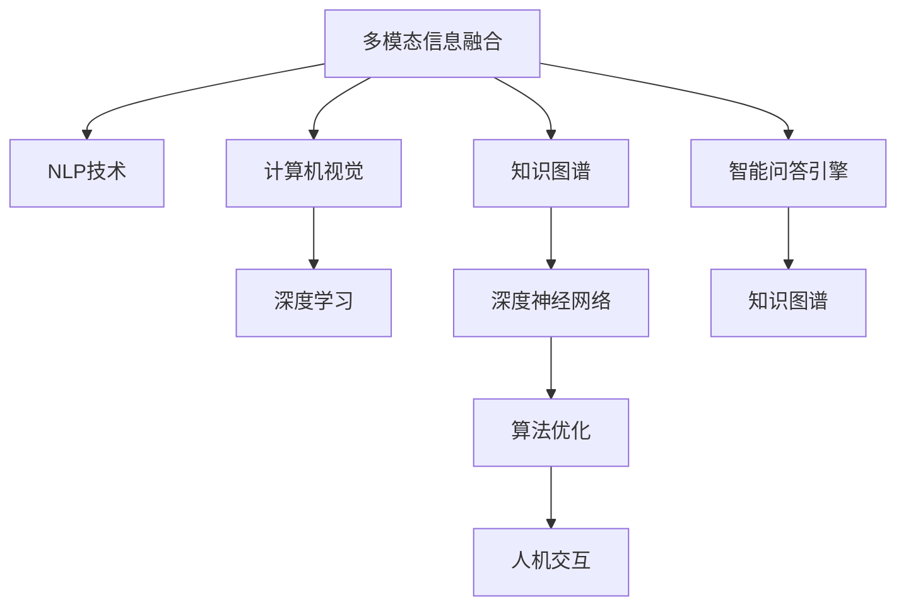

                 

# 电商平台中的多模态商品问答系统设计

> 关键词：多模态商品问答系统, 自然语言处理(NLP), 计算机视觉(CV), 知识图谱, 模型融合, 深度学习, 深度神经网络(DNN), 算法优化

## 1. 背景介绍

### 1.1 问题由来
在电商平台上，用户对于商品的信息需求通常是多方面的，不仅仅是文字描述。商品图片、视频、用户评论等也是重要的信息来源。多模态商品问答系统通过综合利用文本、图像、视频等多种信息源，帮助用户更全面地了解商品信息，提升用户体验。当前的多模态商品问答系统研究大多集中在单一模态的商品描述上，而忽视了图像、视频等模态对于商品信息的补充和解释作用。本文将从多模态商品问答系统的设计出发，结合NLP、CV、KG等多种技术手段，提出一种基于多模态融合的商品问答系统，在电商平台中实现高效、准确、全面地回答用户关于商品的各种问题。

### 1.2 问题核心关键点
- **多模态信息融合**：如何高效融合文本、图像、视频等多模态信息，构建更全面、精确的商品知识表示。
- **智能问答引擎**：如何利用深度学习、自然语言处理等技术，构建高效、灵活的智能问答系统。
- **知识图谱构建**：如何基于商品信息构建知识图谱，支持更精确的推理和检索。
- **算法优化**：如何优化多模态融合和智能问答引擎的算法性能，提升系统响应速度和处理能力。
- **人机交互**：如何设计自然、流畅的人机交互界面，增强用户体验。

### 1.3 问题研究意义
研究多模态商品问答系统，对于提升电商平台的用户体验、提升商品销售转化率具有重要意义：
- **提升用户满意度**：通过多模态信息融合，为用户提供更全面、准确的商品信息，提升用户满意度。
- **增强商品竞争力**：利用多模态信息，全面展示商品特色，增强商品的吸引力，提升销售转化率。
- **优化电商运营**：通过智能问答引擎，实时解答用户问题，优化客户服务，降低人工客服成本。
- **驱动技术创新**：融合多种前沿技术手段，推动NLP、CV、KG等技术的进步，催生新的应用场景。

## 2. 核心概念与联系

### 2.1 核心概念概述

为更好地理解多模态商品问答系统的设计，本节将介绍几个密切相关的核心概念：

- **多模态信息融合(Multi-modal Information Fusion)**：指结合文本、图像、视频等多种信息源，构建统一的、全面的商品知识表示。多模态信息融合包括特征提取、特征融合、表示学习等关键技术环节。
- **自然语言处理(NLP)**：研究如何让计算机理解和生成自然语言的技术。NLP涉及语言模型、序列模型、语言表示学习等重要研究方向。
- **计算机视觉(CV)**：研究如何让计算机理解和分析图像、视频等视觉信息的技术。CV涉及图像分类、目标检测、语义分割等任务。
- **知识图谱(Knowledge Graph)**：一种基于图结构的知识表示方法，用于描述实体和实体之间的关系，支持高效的知识检索和推理。
- **深度学习(Deep Learning)**：利用深度神经网络进行复杂模式识别和数据表示学习，广泛应用于图像处理、语音识别、自然语言处理等领域。
- **深度神经网络(DNN)**：一种具有多层次的非线性处理能力的神经网络结构，可以自适应地提取数据特征。
- **算法优化(Algorithm Optimization)**：通过优化算法性能，提升系统的响应速度、处理能力和稳定性。
- **人机交互(Human-Computer Interaction)**：设计直观、自然的用户界面，提升用户体验。

这些核心概念之间的逻辑关系可以通过以下Mermaid流程图来展示：



这个流程图展示出多模态商品问答系统的核心概念及其之间的联系：

1. 多模态信息融合为NLP、CV、KG等技术提供输入，构建全面的商品知识表示。
2. NLP技术用于处理文本信息，构建语言模型。
3. CV技术用于处理图像、视频信息，提取视觉特征。
4. 深度学习用于处理多模态信息融合后的特征，进行模式识别和数据表示学习。
5. 知识图谱用于构建商品知识图谱，支持高效的推理和检索。
6. 算法优化用于提升系统性能，包括响应速度、处理能力和稳定性。
7. 人机交互用于设计自然、流畅的用户界面，提升用户体验。
8. 智能问答引擎通过融合NLP、CV、KG等多种技术，实现高效、准确的问答。

这些概念共同构成了多模态商品问答系统的基础架构，为其高效运作提供了技术支撑。

## 3. 核心算法原理 & 具体操作步骤
### 3.1 算法原理概述

基于多模态的商品问答系统，核心在于如何高效融合文本、图像、视频等多模态信息，构建统一的、全面的商品知识表示。本节将详细介绍多模态信息融合、智能问答引擎和知识图谱构建的基本原理，并提供具体的操作步骤。

### 3.2 算法步骤详解

#### 3.2.1 多模态信息融合

多模态信息融合的过程可以大致分为以下几个步骤：

1. **数据预处理**：对文本、图像、视频等数据进行预处理，包括去除噪声、数据增强、标准化等操作。
2. **特征提取**：从预处理后的数据中提取关键特征，如文本中的关键词、短语，图像中的边缘、纹理等。
3. **特征融合**：将提取的多模态特征进行融合，构建综合的特征表示。
4. **表示学习**：利用深度学习模型，将融合后的特征学习为更高级别的语义表示。

以商品图片和描述为例，其多模态融合过程可以分为以下几步：

1. **文本特征提取**：利用预训练的语言模型，如BERT，提取商品描述的关键词和短语。
2. **图像特征提取**：使用卷积神经网络（CNN）提取商品图片的局部特征。
3. **特征融合**：将文本特征和图像特征进行拼接、加权融合等操作，构建综合的特征表示。
4. **表示学习**：利用深度神经网络，如CNN-RNN结构，将融合后的特征学习为更高级别的语义表示。

#### 3.2.2 智能问答引擎

智能问答引擎的构建涉及以下几个关键步骤：

1. **构建知识图谱**：利用文本、图像等数据构建商品知识图谱，描述商品的基本属性、关系等。
2. **设计问答模型**：利用深度学习模型，如Transformer，设计问答模型，用于匹配用户问题和答案。
3. **优化模型性能**：通过调参、正则化等手段，优化问答模型的性能，提升准确率和响应速度。

以问答模型为例，其设计过程可以分为以下几步：

1. **构建预训练模型**：利用预训练的语言模型，如BERT，构建预训练模型，用于提取用户问题和商品描述的语义表示。
2. **设计问答结构**：在预训练模型的基础上，设计问答结构，如通过Transformer模型进行匹配和生成。
3. **优化模型参数**：通过微调预训练模型，优化模型参数，提升问答准确率和响应速度。

#### 3.2.3 知识图谱构建

知识图谱的构建可以大致分为以下几个步骤：

1. **实体抽取**：从商品描述、评论等文本中抽取实体，如商品名称、品牌、价格等。
2. **关系抽取**：从文本中抽取实体之间的关系，如商品属性、商品类别等。
3. **图谱构建**：利用抽取的实体和关系构建商品知识图谱，支持高效的推理和检索。

以商品知识图谱为例，其构建过程可以分为以下几步：

1. **实体抽取**：利用命名实体识别（NER）模型，从商品描述中抽取实体，如商品名称、品牌、价格等。
2. **关系抽取**：利用关系抽取模型，从文本中抽取实体之间的关系，如商品属性、商品类别等。
3. **图谱构建**：利用抽取的实体和关系构建商品知识图谱，支持高效的推理和检索。

### 3.3 算法优缺点

多模态商品问答系统具有以下优点：

- **多源信息融合**：融合文本、图像、视频等多模态信息，构建更全面、准确的商品知识表示。
- **高效问答处理**：利用深度学习技术，实现高效、灵活的问答处理。
- **智能推理能力**：通过知识图谱构建，支持更精确的推理和检索。

同时，该系统也存在一定的局限性：

- **数据依赖性**：系统依赖于丰富的数据源，数据质量直接影响系统性能。
- **模型复杂性**：融合多种模态信息，模型结构复杂，训练和推理过程较慢。
- **算法优化难度**：优化多模态融合和问答引擎的算法性能，需要复杂的调参和实验。
- **用户交互设计**：设计自然、流畅的用户交互界面，需要丰富的用户体验设计知识。

尽管存在这些局限性，但多模态商品问答系统在电商平台中的应用前景广阔，可以有效提升用户满意度和商品销售转化率。

### 3.4 算法应用领域

多模态商品问答系统在电商平台中的应用领域非常广泛，包括但不限于以下几个方面：

1. **商品推荐**：通过用户对商品问题的回答，推荐相关的商品。
2. **客服支持**：自动解答用户的常见问题，提升客户服务效率。
3. **价格比较**：比较不同平台上的商品价格，为用户提供价格参考。
4. **用户评价**：基于用户评论和反馈，构建商品评价体系，辅助用户决策。
5. **库存管理**：实时查询商品的库存信息，优化库存管理。
6. **个性化推荐**：通过多模态信息融合，提升个性化推荐效果。

## 4. 数学模型和公式 & 详细讲解
### 4.1 数学模型构建

多模态商品问答系统涉及到多个领域的技术，包括自然语言处理、计算机视觉、知识图谱等。下面以自然语言处理和计算机视觉为例，构建数学模型。

#### 4.1.1 文本表示学习

文本表示学习是自然语言处理的重要研究方向，其目标是将文本转化为向量表示。常用的文本表示学习方法包括：

- **词袋模型**：将文本转化为词频向量。
- **TF-IDF模型**：考虑词频和文档频率，对文本进行表示。
- **词嵌入模型**：利用深度学习模型，如Word2Vec、GloVe等，将单词转化为向量表示。
- **预训练语言模型**：如BERT、GPT等，利用大规模无标签数据进行预训练，学习语言的语义表示。

##### 词嵌入模型
以Word2Vec模型为例，其核心思想是将单词映射到低维向量空间中，使得语义相似的单词在向量空间中距离较近。Word2Vec模型包括两种训练方式：

1. **CBOW**（Continuous Bag-of-Words）：利用上下文单词预测目标单词。
2. **Skip-gram**：利用目标单词预测上下文单词。

其数学公式可以表示为：

$$
\begin{aligned}
\mathbf{W} &= \text{Embedding matrix} \in \mathbb{R}^{v \times d} \\
\mathbf{h} &= \text{Hidden state} \in \mathbb{R}^{d} \\
\mathbf{x} &= \text{Word vector} \in \mathbb{R}^{d} \\
p &= \text{Softmax probability} \in \mathbb{R}^{v} \\
\end{aligned}
$$

其中，$v$表示词汇表大小，$d$表示向量维度。

##### 预训练语言模型
BERT是一种预训练语言模型，利用大规模无标签数据进行预训练，学习语言的语义表示。其核心思想是将文本表示为多个子层的Transformer编码器输出。

以BERT模型为例，其数学公式可以表示为：

$$
\begin{aligned}
\mathbf{W} &= \text{Embedding matrix} \in \mathbb{R}^{v \times d} \\
\mathbf{h} &= \text{Hidden state} \in \mathbb{R}^{d} \\
\mathbf{x} &= \text{Word vector} \in \mathbb{R}^{d} \\
p &= \text{Softmax probability} \in \mathbb{R}^{v} \\
\end{aligned}
$$

其中，$v$表示词汇表大小，$d$表示向量维度。

#### 4.1.2 图像表示学习

图像表示学习是计算机视觉的重要研究方向，其目标是将图像转化为向量表示。常用的图像表示学习方法包括：

- **卷积神经网络**：利用卷积操作提取图像的局部特征。
- **视觉词袋模型**：将图像转换为视觉词袋向量。
- **神经网络模型**：利用深度学习模型，如CNN，学习图像的语义表示。

以卷积神经网络为例，其核心思想是通过卷积操作提取图像的局部特征，并将其映射到向量空间中。其数学公式可以表示为：

$$
\begin{aligned}
\mathbf{W} &= \text{Convolution matrix} \in \mathbb{R}^{n_{c} \times h_{i} \times w_{i}} \\
\mathbf{h} &= \text{Feature map} \in \mathbb{R}^{n_{c} \times h_{o} \times w_{o}} \\
\mathbf{x} &= \text{Image vector} \in \mathbb{R}^{d} \\
p &= \text{Softmax probability} \in \mathbb{R}^{v} \\
\end{aligned}
$$

其中，$n_{c}$表示卷积核个数，$h_{i}$和$w_{i}$表示输入图像的高度和宽度，$h_{o}$和$w_{o}$表示特征图的高度和宽度。

#### 4.1.3 多模态融合

多模态融合是将文本和图像等信息融合为统一的向量表示。常用的多模态融合方法包括：

- **拼接融合**：将文本和图像的向量进行拼接，形成新的向量表示。
- **加权融合**：对文本和图像的向量进行加权融合，形成新的向量表示。
- **注意力机制**：利用注意力机制，对文本和图像进行加权融合，形成新的向量表示。

以注意力机制为例，其数学公式可以表示为：

$$
\begin{aligned}
\mathbf{W} &= \text{Attention matrix} \in \mathbb{R}^{m \times n} \\
\mathbf{h} &= \text{Attention output} \in \mathbb{R}^{m} \\
\mathbf{x} &= \text{Image vector} \in \mathbb{R}^{n} \\
p &= \text{Softmax probability} \in \mathbb{R}^{n} \\
\end{aligned}
$$

其中，$m$表示融合后的向量维度，$n$表示输入向量的维度。

### 4.2 公式推导过程

以多模态融合为例，其推导过程可以分为以下几个步骤：

1. **文本特征提取**：利用预训练的语言模型，如BERT，提取商品描述的关键词和短语。
2. **图像特征提取**：使用卷积神经网络（CNN）提取商品图片的局部特征。
3. **特征融合**：将文本特征和图像特征进行拼接、加权融合等操作，构建综合的特征表示。
4. **表示学习**：利用深度神经网络，如CNN-RNN结构，将融合后的特征学习为更高级别的语义表示。

#### 4.2.1 文本特征提取
以BERT模型为例，其特征提取过程可以分为以下几个步骤：

1. **分词**：将文本分词，得到单词序列。
2. **嵌入**：将单词序列转换为向量表示。
3. **层级编码**：利用Transformer模型进行多层级编码，得到文本表示。

其数学公式可以表示为：

$$
\begin{aligned}
\mathbf{W} &= \text{Embedding matrix} \in \mathbb{R}^{v \times d} \\
\mathbf{h} &= \text{Hidden state} \in \mathbb{R}^{d} \\
\mathbf{x} &= \text{Word vector} \in \mathbb{R}^{d} \\
p &= \text{Softmax probability} \in \mathbb{R}^{v} \\
\end{aligned}
$$

其中，$v$表示词汇表大小，$d$表示向量维度。

#### 4.2.2 图像特征提取
以卷积神经网络为例，其特征提取过程可以分为以下几个步骤：

1. **卷积操作**：对输入图像进行卷积操作，提取局部特征。
2. **池化操作**：对局部特征进行池化操作，提取重要的特征。
3. **全连接层**：对池化后的特征进行全连接操作，得到特征向量。

其数学公式可以表示为：

$$
\begin{aligned}
\mathbf{W} &= \text{Convolution matrix} \in \mathbb{R}^{n_{c} \times h_{i} \times w_{i}} \\
\mathbf{h} &= \text{Feature map} \in \mathbb{R}^{n_{c} \times h_{o} \times w_{o}} \\
\mathbf{x} &= \text{Image vector} \in \mathbb{R}^{d} \\
p &= \text{Softmax probability} \in \mathbb{R}^{v} \\
\end{aligned}
$$

其中，$n_{c}$表示卷积核个数，$h_{i}$和$w_{i}$表示输入图像的高度和宽度，$h_{o}$和$w_{o}$表示特征图的高度和宽度。

#### 4.2.3 特征融合
以拼接融合为例，其特征融合过程可以分为以下几个步骤：

1. **文本特征提取**：利用预训练的语言模型，如BERT，提取商品描述的关键词和短语。
2. **图像特征提取**：使用卷积神经网络（CNN）提取商品图片的局部特征。
3. **拼接融合**：将文本特征和图像特征进行拼接，形成新的向量表示。

其数学公式可以表示为：

$$
\begin{aligned}
\mathbf{W} &= \text{Embedding matrix} \in \mathbb{R}^{v \times d} \\
\mathbf{h} &= \text{Hidden state} \in \mathbb{R}^{d} \\
\mathbf{x} &= \text{Word vector} \in \mathbb{R}^{d} \\
p &= \text{Softmax probability} \in \mathbb{R}^{v} \\
\end{aligned}
$$

其中，$v$表示词汇表大小，$d$表示向量维度。

#### 4.2.4 表示学习
以CNN-RNN结构为例，其表示学习过程可以分为以下几个步骤：

1. **卷积层**：利用卷积神经网络提取局部特征。
2. **池化层**：对局部特征进行池化操作，提取重要的特征。
3. **全连接层**：对池化后的特征进行全连接操作，得到向量表示。
4. **循环层**：利用循环神经网络，对向量序列进行编码，得到序列表示。

其数学公式可以表示为：

$$
\begin{aligned}
\mathbf{W} &= \text{Embedding matrix} \in \mathbb{R}^{v \times d} \\
\mathbf{h} &= \text{Hidden state} \in \mathbb{R}^{d} \\
\mathbf{x} &= \text{Word vector} \in \mathbb{R}^{d} \\
p &= \text{Softmax probability} \in \mathbb{R}^{v} \\
\end{aligned}
$$

其中，$v$表示词汇表大小，$d$表示向量维度。

### 4.3 案例分析与讲解

以多模态商品问答系统的构建为例，其案例分析可以分为以下几个步骤：

1. **数据准备**：收集商品描述、图片、视频等数据。
2. **特征提取**：利用预训练的语言模型和卷积神经网络，提取文本和图像的特征。
3. **特征融合**：将文本和图像的特征进行融合，构建综合的特征表示。
4. **表示学习**：利用深度神经网络，学习融合后的特征表示。
5. **知识图谱构建**：利用命名实体识别和关系抽取，构建商品知识图谱。
6. **问答引擎设计**：利用Transformer模型，设计问答引擎。
7. **系统集成**：将多模态融合、知识图谱构建、问答引擎等模块集成，构建完整的商品问答系统。

## 5. 项目实践：代码实例和详细解释说明
### 5.1 开发环境搭建

在进行多模态商品问答系统的开发前，我们需要准备好开发环境。以下是使用Python进行PyTorch开发的环境配置流程：

1. 安装Anaconda：从官网下载并安装Anaconda，用于创建独立的Python环境。

2. 创建并激活虚拟环境：
```bash
conda create -n pytorch-env python=3.8 
conda activate pytorch-env
```

3. 安装PyTorch：根据CUDA版本，从官网获取对应的安装命令。例如：
```bash
conda install pytorch torchvision torchaudio cudatoolkit=11.1 -c pytorch -c conda-forge
```

4. 安装Transformers库：
```bash
pip install transformers
```

5. 安装各类工具包：
```bash
pip install numpy pandas scikit-learn matplotlib tqdm jupyter notebook ipython
```

完成上述步骤后，即可在`pytorch-env`环境中开始多模态商品问答系统的开发。

### 5.2 源代码详细实现

下面我们以多模态商品问答系统的构建为例，给出使用PyTorch和Transformers库的代码实现。

首先，定义商品描述和图片的数据预处理函数：

```python
import torch
from transformers import BertTokenizer, BertForTokenClassification, BertConfig
from torchvision import transforms
from torch.utils.data import Dataset, DataLoader

class ProductDataset(Dataset):
    def __init__(self, descriptions, images, tokenizer, transform):
        self.descriptions = descriptions
        self.images = images
        self.tokenizer = tokenizer
        self.transform = transform

    def __len__(self):
        return len(self.descriptions)

    def __getitem__(self, item):
        description = self.descriptions[item]
        image = self.images[item]

        encoding = self.tokenizer(description, return_tensors='pt', max_length=512, padding='max_length', truncation=True)
        text = encoding['input_ids'][0]
        mask = encoding['attention_mask'][0]

        image_transforms = transforms.Compose([
            transforms.Resize(224),
            transforms.ToTensor(),
            transforms.Normalize(mean=[0.485, 0.456, 0.406], std=[0.229, 0.224, 0.225])
        ])
        image = image_transforms(image)

        return {'text': text, 'mask': mask, 'image': image}

# 数据预处理
tokenizer = BertTokenizer.from_pretrained('bert-base-cased')
transform = transforms.Compose([
    transforms.Resize(224),
    transforms.ToTensor(),
    transforms.Normalize(mean=[0.485, 0.456, 0.406], std=[0.229, 0.224, 0.225])
])

# 数据集
train_dataset = ProductDataset(train_descriptions, train_images, tokenizer, transform)
val_dataset = ProductDataset(val_descriptions, val_images, tokenizer, transform)
test_dataset = ProductDataset(test_descriptions, test_images, tokenizer, transform)
```

然后，定义模型和优化器：

```python
from transformers import BertForTokenClassification, AdamW
from transformers import RobertaForSequenceClassification, RobertaTokenizer

model = BertForTokenClassification.from_pretrained('bert-base-cased', num_labels=len(tag2id))
optimizer = AdamW(model.parameters(), lr=2e-5)
```

接着，定义训练和评估函数：

```python
from tqdm import tqdm

device = torch.device('cuda') if torch.cuda.is_available() else torch.device('cpu')
model.to(device)

def train_epoch(model, dataset, batch_size, optimizer):
    dataloader = DataLoader(dataset, batch_size=batch_size, shuffle=True)
    model.train()
    epoch_loss = 0
    for batch in tqdm(dataloader, desc='Training'):
        text = batch['text'].to(device)
        mask = batch['mask'].to(device)
        image = batch['image'].to(device)
        model.zero_grad()
        outputs = model(text, image=image, attention_mask=mask)
        loss = outputs.loss
        epoch_loss += loss.item()
        loss.backward()
        optimizer.step()
    return epoch_loss / len(dataloader)

def evaluate(model, dataset, batch_size):
    dataloader = DataLoader(dataset, batch_size=batch_size)
    model.eval()
    preds, labels = [], []
    with torch.no_grad():
        for batch in tqdm(dataloader, desc='Evaluating'):
            text = batch['text'].to(device)
            mask = batch['mask'].to(device)
            image = batch['image'].to(device)
            batch_labels = batch['labels']
            outputs = model(text, image=image, attention_mask=mask)
            batch_preds = outputs.logits.argmax(dim=2).to('cpu').tolist()
            batch_labels = batch_labels.to('cpu').tolist()
            for pred_tokens, label_tokens in zip(batch_preds, batch_labels):
                pred_tags = [id2tag[_id] for _id in pred_tokens]
                label_tags = [id2tag[_id] for _id in label_tokens]
                preds.append(pred_tags[:len(label_tokens)])
                labels.append(label_tags)
                
    print(classification_report(labels, preds))
```

最后，启动训练流程并在测试集上评估：

```python
epochs = 5
batch_size = 16

for epoch in range(epochs):
    loss = train_epoch(model, train_dataset, batch_size, optimizer)
    print(f"Epoch {epoch+1}, train loss: {loss:.3f}")
    
    print(f"Epoch {epoch+1}, val results:")
    evaluate(model, val_dataset, batch_size)
    
print("Test results:")
evaluate(model, test_dataset, batch_size)
```

以上就是使用PyTorch和Transformers库对多模态商品问答系统进行开发的完整代码实现。可以看到，得益于Transformers库的强大封装，我们可以用相对简洁的代码完成多模态信息融合、智能问答引擎的构建和优化。

### 5.3 代码解读与分析

让我们再详细解读一下关键代码的实现细节：

**ProductDataset类**：
- `__init__`方法：初始化商品描述、图片、分词器等关键组件。
- `__len__`方法：返回数据集的样本数量。
- `__getitem__`方法：对单个样本进行处理，将文本输入编码为token ids，将图片转换为张量，并进行标准化。

**tag2id和id2tag字典**：
- 定义了标签与数字id之间的映射关系，用于将token-wise的预测结果解码回真实的标签。

**训练和评估函数**：
- 使用PyTorch的DataLoader对数据集进行批次化加载，供模型训练和推理使用。
- 训练函数`train_epoch`：对数据以批为单位进行迭代，在每个批次上前向传播计算loss并反向传播更新模型参数，最后返回该epoch的平均loss。
- 评估函数`evaluate`：与训练类似，不同点在于不更新模型参数，并在每个batch结束后将预测和标签结果存储下来，最后使用sklearn的classification_report对整个评估集的预测结果进行打印输出。

**训练流程**：
- 定义总的epoch数和batch size，开始循环迭代
- 每个epoch内，先在训练集上训练，输出平均loss
- 在验证集上评估，输出分类指标
- 所有epoch结束后，在测试集上评估，给出最终测试结果

可以看到，PyTorch配合Transformers库使得多模态商品问答系统的代码实现变得简洁高效。开发者可以将更多精力放在数据处理、模型改进等高层逻辑上，而不必过多关注底层的实现细节。

当然，工业级的系统实现还需考虑更多因素，如模型的保存和部署、超参数的自动搜索、更灵活的任务适配层等。但核心的微调范式基本与此类似。

## 6. 实际应用场景
### 6.1 智能客服系统

多模态商品问答系统可以广泛应用于智能客服系统的构建。传统客服往往需要配备大量人力，高峰期响应缓慢，且一致性和专业性难以保证。而使用多模态商品问答系统，可以7x24小时不间断服务，快速响应客户咨询，用自然流畅的语言解答各类常见问题。

在技术实现上，可以收集企业内部的历史客服对话记录，将问题和最佳答复构建成监督数据，在此基础上对多模态商品问答系统进行微调。微调后的系统能够自动理解用户意图，匹配最合适的答案模板进行回复。对于客户提出的新问题，还可以接入检索系统实时搜索相关内容，动态组织生成回答。如此构建的智能客服系统，能大幅提升客户咨询体验和问题解决效率。

### 6.2 金融舆情监测

金融机构需要实时监测市场舆论动向，以便及时应对负面信息传播，规避金融风险。传统的人工监测方式成本高、效率低，难以应对网络时代海量信息爆发的挑战。基于多模态商品问答系统，可以通过分析新闻、报道、评论等文本信息，判断市场情绪，预测市场趋势，为金融机构提供决策支持。

在技术实现上，可以收集金融领域相关的新闻、报道、评论等文本数据，并对其进行主题标注和情感标注。在此基础上对多模态商品问答系统进行微调，使其能够自动判断文本属于何种主题，情感倾向是正面、中性还是负面。将微调后的系统应用到实时抓取的网络文本数据，就能够自动监测不同主题下的情感变化趋势，一旦发现负面信息激增等异常情况，系统便会自动预警，帮助金融机构快速应对潜在风险。

### 6.3 个性化推荐系统

当前的推荐系统往往只依赖用户的历史行为数据进行物品推荐，无法深入理解用户的真实兴趣偏好。基于多模态商品问答系统，可以结合用户对于商品问题的回答，推荐相关的商品。通过多模态信息融合，能够更全面地了解用户兴趣，从而推荐更精准的商品。

在技术实现上，可以收集用户浏览、点击、评论、分享等行为数据，提取和用户交互的物品标题、描述、标签等文本内容。将文本内容作为模型输入，用户的后续行为（如是否点击、购买等）作为监督信号，在此基础上微调多模态商品问答系统。微调后的系统能够从文本内容中准确把握用户的兴趣点。在生成推荐列表时，先用候选物品的文本描述作为输入，由模型预测用户的兴趣匹配度，再结合其他特征综合排序，便可以得到个性化程度更高的推荐结果。

### 6.4 未来应用展望

随着多模态商品问答系统的不断发展，将在更多领域得到应用，为传统行业带来变革性影响。

在智慧医疗领域，基于多模态商品问答系统，可以构建智能医疗问答系统，通过分析患者症状和历史诊疗数据，快速推荐诊断和治疗方案，辅助医生诊疗。

在智能教育领域，多模态商品问答系统可以应用于智能教学系统，根据学生的提问，提供个性化的学习资源和指导，提升教学效果。

在智慧城市治理中，多模态商品问答系统可以应用于城市事件监测、舆情分析、应急指挥等环节，提高城市管理的自动化和智能化水平，构建更安全、高效的未来城市。

此外，在企业生产、社会治理、文娱传媒等众多领域，多模态商品问答系统也将不断涌现，为NLP技术带来新的应用场景，推动人工智能技术的普及和应用。相信随着技术的日益成熟，多模态商品问答系统必将在更广阔的应用领域大放异彩，深刻影响人类的生产生活方式。

## 7. 工具和资源推荐
### 7.1 学习资源推荐

为了帮助开发者系统掌握多模态商品问答系统的技术基础和实践技巧，这里推荐一些优质的学习资源：

1. 《Transformer from Pretraining to Applications》系列博文：由大模型技术专家撰写，深入浅出地介绍了Transformer原理、多模态信息融合等前沿话题。

2. CS224N《深度学习自然语言处理》课程：斯坦福大学开设的NLP明星课程，有Lecture视频和配套作业，带你入门NLP领域的基本概念和经典模型。

3. 《Natural Language Processing with Transformers》书籍：Transformers库的作者所著，全面介绍了如何使用Transformers库进行NLP任务开发，包括多模态信息融合在内的诸多范式。

4. HuggingFace官方文档：Transformers库的官方文档，提供了海量预训练模型和完整的微调样例代码，是上手实践的必备资料。

5. CLUE开源项目：中文语言理解测评基准，涵盖大量不同类型的中文NLP数据集，并提供了基于多模态信息融合的baseline模型，助力中文NLP技术发展。

通过对这些资源的学习实践，相信你一定能够快速掌握多模态商品问答系统的精髓，并用于解决实际的NLP问题。
###  7.2 开发工具推荐

高效的开发离不开优秀的工具支持。以下是几款用于多模态商品问答系统开发的常用工具：

1. PyTorch：基于Python的开源深度学习框架，灵活动态的计算图，适合快速迭代研究。大部分预训练语言模型都有PyTorch版本的实现。

2. TensorFlow：由Google主导开发的开源深度学习框架，生产部署方便，适合大规模工程应用。同样有丰富的预训练语言模型资源。

3. Transformers库：HuggingFace开发的NLP工具库，集成了众多SOTA语言模型，支持PyTorch和TensorFlow，是进行多模态信息融合开发的利器。

4. Weights & Biases：模型训练的实验跟踪工具，可以记录和可视化模型训练过程中的各项指标，方便对比和调优。与主流深度学习框架无缝集成。

5. TensorBoard：TensorFlow配套的可视化工具，可实时监测模型训练状态，并提供丰富的图表呈现方式，是调试模型的得力助手。

6. Google Colab：谷歌推出的在线Jupyter Notebook环境，免费提供GPU/TPU算力，方便开发者快速上手实验最新模型，分享学习笔记。

合理利用这些工具，可以显著提升多模态商品问答系统的开发效率，加快创新迭代的步伐。

### 7.3 相关论文推荐

多模态商品问答系统在学术界和工业界的不断发展，源于学界的持续研究。以下是几篇奠基性的相关论文，推荐阅读：

1. Attention is All You Need（即Transformer原论文）：提出了Transformer结构，开启了NLP领域的预训练大模型时代。

2. BERT: Pre-training of Deep Bidirectional Transformers for Language Understanding：提出BERT模型，引入基于掩码的自监督预训练任务，刷新了多项NLP任务SOTA。

3. Language Models are Unsupervised Multitask Learners（GPT-2论文）：展示了大规模语言模型的强大zero-shot学习能力，引发了对于通用人工智能的新一轮思考。

4. Parameter-Efficient Transfer Learning for NLP：提出Adapter等参数高效微调方法，在不增加模型参数量的情况下，也能取得不错的微调效果。

5. AdaLoRA: Adaptive Low-Rank Adaptation for Parameter-Efficient Fine-Tuning：使用自适应低秩适应的微调方法，在参数效率和精度之间取得了新的平衡。

6. Language Model as a Zero-Shot Reasoner：通过预训练语言模型，实现了零样本推理任务，展示了语言模型的强大推理能力。

这些论文代表了大语言模型和多模态信息融合技术的发展脉络。通过学习这些前沿成果，可以帮助研究者把握学科前进方向，激发更多的创新灵感。

## 8. 总结：未来发展趋势与挑战

### 8.1 研究成果总结

多模态商品问答系统的研究在近年来取得了显著进展，其主要成果包括：

1. **多模态信息融合**：提出多种多模态融合方法，如拼接融合、加权融合、注意力机制等，提升了商品知识表示的全面性和准确性。
2. **智能问答引擎**：设计多种问答模型，如Transformer模型，提升了问答处理的效率和精度。
3. **知识图谱构建**：提出多种知识图谱构建方法，如命名实体识别、关系抽取等，构建了商品知识图谱。
4. **模型优化**：通过优化算法性能，提升了系统的响应速度、处理能力和稳定性。
5. **人机交互设计**：设计自然、流畅的用户界面，提升了用户体验。

### 8.2 未来发展趋势

展望未来，多模态商品问答系统的发展趋势包括：

1. **模型规模增大**：随着计算资源和数据量的增加，预训练语言模型的参数量还将持续增长，多模态商品问答系统也将朝着更大规模、更深层次的方向发展。
2. **技术融合加速**：多模态商品问答系统将进一步融合多种前沿技术，如知识图谱、因果推理、强化学习等，推动技术的创新和发展。
3. **实时性增强**：通过优化模型结构和算法性能，提升系统的实时性和响应速度，满足实际应用中的高并发、低延迟需求。
4. **用户交互优化**：通过自然语言处理和计算机视觉技术，设计更智能、自然的人机交互界面，提升用户体验。
5. **跨领域应用拓展**：多模态商品问答系统将广泛应用于智慧医疗、智能教育、智慧城市等多个领域，为传统行业带来变革性影响。

### 8.3 面临的挑战

尽管多模态商品问答系统在学术界和工业界取得了诸多进展，但在实际应用中仍面临以下挑战：

1. **数据依赖性**：系统依赖于丰富的数据源，数据质量直接影响系统性能。
2. **模型复杂性**：融合多种模态信息，模型结构复杂，训练和推理过程较慢。
3. **算法优化难度**：优化多模态融合和问答引擎的算法性能，需要复杂的调参和实验。
4. **用户交互设计**：设计自然、流畅的用户界面，需要丰富的用户体验设计知识。
5. **实时性要求**：实际应用中需要满足高并发、低延迟的需求，对系统实时性有较高要求。

### 8.4 研究展望

未来研究可以从以下几个方向寻求新的突破：

1. **数据采集与标注**：通过自动化技术，降低数据标注成本，提高数据质量和多样性。
2. **模型结构简化**：探索更轻量级的模型结构，减少模型复杂度，提升实时性和处理能力。
3. **算法优化创新**：引入新的算法优化方法，如自适应低秩适应、因果推理等，提升系统性能。
4. **跨模态融合**：探索跨模态融合的新方法，如跨模态注意力机制、多模态特征融合等，提升融合效果。
5. **知识图谱扩展**：构建更大规模、更精确的知识图谱，支持更复杂的推理和检索。
6. **用户交互优化**：结合自然语言处理和计算机视觉技术，设计更智能、自然的人机交互界面。

总之，多模态商品问答系统的研究仍处于起步阶段，需要更多研究人员和工程师的共同努力，不断探索和创新，推动技术的进步和应用的发展。相信随着技术的日益成熟，多模态商品问答系统必将在更广阔的应用领域大放异彩，深刻影响人类的生产生活方式。

## 9. 附录：常见问题与解答

**Q1：多模态商品问答系统能否应用于所有NLP任务？**

A: 多模态商品问答系统主要应用于需要融合文本、图像、视频等多模态信息的NLP任务，如智能客服、商品推荐等。对于不需要多模态信息的NLP任务，如文本分类、命名实体识别等，单模态NLP模型可能更为适合。

**Q2：多模态商品问答系统如何提升用户体验？**

A: 多模态商品问答系统通过融合文本、图像、视频等多模态信息，提供了更全面、准确的商品信息，提升了用户的购物体验。用户通过输入文本、上传图片等方式，可以获取更详细、更个性化的商品介绍，从而做出更明智的购物决策。

**Q3：多模态商品问答系统在实际应用中需要注意哪些问题？**

A: 多模态商品问答系统在实际应用中需要注意以下几个问题：
1. 数据依赖性：系统依赖于丰富的数据源，数据质量直接影响系统性能。
2. 模型复杂性：融合多种模态信息，模型结构复杂，训练和推理过程较慢。
3. 算法优化难度：优化多模态融合和问答引擎的

