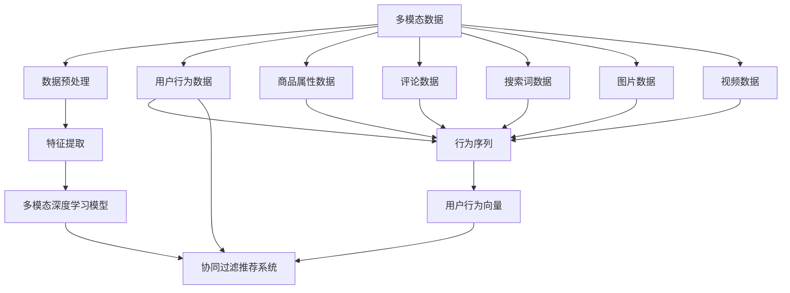

                 

# 电商平台中的多模态用户行为建模与分析

> 关键词：电商平台, 用户行为建模, 多模态数据, 深度学习, 协同过滤, 推荐系统

## 1. 背景介绍

### 1.1 问题由来

在电商平台中，如何精准地理解用户行为，提升用户体验和满意度，增加转化率和复购率，是电商企业长久以来的追求目标。用户行为分析是实现这一目标的重要手段。然而，电商平台上的用户行为数据非常丰富和多样，除了传统的点击、浏览、购买等行为外，还包括搜索词、评分、评论、图片和视频等多模态数据。如何充分利用这些数据，提升模型建模的精度和泛化能力，成为了电商领域亟待解决的重要问题。

### 1.2 问题核心关键点

针对电商平台中的多模态用户行为建模与分析，核心问题包括以下几个方面：

- 如何有效整合多模态数据，提升用户行为建模的准确性和泛化能力。
- 如何设计合理的模型结构和损失函数，充分发挥多模态数据对用户行为预测的贡献。
- 如何在保证模型精度的同时，控制计算复杂度，实现高效的模型训练和推理。
- 如何基于用户行为建模结果，提供个性化的商品推荐和定价策略，提升用户体验和电商运营效益。

本文将围绕以上问题，深入探讨电商平台中的多模态用户行为建模与分析的原理与实践。

## 2. 核心概念与联系

### 2.1 核心概念概述

在电商平台中，用户行为数据可以大致分为两类：结构化数据和非结构化数据。结构化数据包括用户的点击、浏览、购买等行为记录，以及商品属性、评分等信息；非结构化数据包括用户的搜索词、评论、图片、视频等。

多模态用户行为建模是指将结构化数据和非结构化数据相结合，构建统一的模型表示，从而提升用户行为预测的准确性和泛化能力。其中，深度学习技术是实现多模态数据建模的重要手段。

协同过滤(Collaborative Filtering, CF)是推荐系统中常用的技术之一，通过分析用户行为数据，预测用户对商品的兴趣，从而实现个性化推荐。

在电商领域，多模态数据建模与协同过滤技术可以相互补充。多模态数据建模可以利用深度学习技术，捕捉数据中的复杂关系和特征，提升推荐系统的精度和鲁棒性；协同过滤则可以利用用户行为数据，挖掘用户之间的相似性，实现更加个性化和多样化的推荐。

### 2.2 核心概念原理和架构的 Mermaid 流程图



该流程图展示了多模态数据建模与协同过滤推荐系统的基本架构：

1. 多模态数据通过数据预处理环节，提取特征并进行归一化、标准化等预处理。
2. 特征提取环节利用深度学习技术，对多模态数据进行编码，得到用户行为向量。
3. 多模态深度学习模型对用户行为向量进行处理，得到用户对不同商品的兴趣评分。
4. 协同过滤推荐系统利用用户行为评分数据，挖掘用户之间的相似性，实现个性化推荐。

## 3. 核心算法原理 & 具体操作步骤

### 3.1 算法原理概述

多模态用户行为建模主要涉及以下几个步骤：

1. **数据预处理**：对多模态数据进行清洗、归一化、标准化等预处理，使其适合后续建模。
2. **特征提取**：利用深度学习技术，对预处理后的数据进行编码，得到高维特征向量。
3. **多模态深度学习模型**：将多模态特征向量输入到深度学习模型中进行训练，得到用户对不同商品的兴趣评分。
4. **协同过滤推荐系统**：利用用户行为评分数据，挖掘用户之间的相似性，实现个性化推荐。

其中，多模态深度学习模型是整个模型的核心。在电商平台上，常见的多模态深度学习模型包括基于卷积神经网络(CNN)、循环神经网络(RNN)和Transformer的结构。

### 3.2 算法步骤详解

#### 3.2.1 数据预处理

数据预处理是整个模型的基础，主要包括以下几个步骤：

1. **数据清洗**：去除异常值、重复记录等噪声数据，保证数据质量。
2. **归一化**：对数值型数据进行归一化处理，使其在0到1之间。
3. **标准化**：对文本数据进行分词、去除停用词等处理，并进行向量化表示。
4. **数据增强**：通过回译、近义词替换等方式，扩充训练集，增加数据多样性。

#### 3.2.2 特征提取

特征提取环节利用深度学习技术，对多模态数据进行编码，得到高维特征向量。常见的深度学习模型包括：

1. **卷积神经网络(CNN)**：适用于图片、视频等多模态数据，提取局部特征。
2. **循环神经网络(RNN)**：适用于文本数据，捕捉序列特征。
3. **Transformer**：适用于所有多模态数据，捕捉全局特征。

#### 3.2.3 多模态深度学习模型

多模态深度学习模型的核心是对用户行为向量进行处理，得到用户对不同商品的兴趣评分。常见的模型包括：

1. **单模态深度学习模型**：对单一模态数据进行建模，如CNN、RNN、Transformer等。
2. **多模态深度学习模型**：对多个模态数据进行建模，如XLM、BMVA等。

#### 3.2.4 协同过滤推荐系统

协同过滤推荐系统利用用户行为评分数据，挖掘用户之间的相似性，实现个性化推荐。常见的协同过滤方法包括：

1. **基于用户的协同过滤**：计算用户之间的相似性，推荐与该用户相似的其他用户喜欢的商品。
2. **基于物品的协同过滤**：计算物品之间的相似性，推荐与当前用户喜欢的物品相似的其他物品。

### 3.3 算法优缺点

#### 3.3.1 优点

1. **提升预测精度**：多模态深度学习模型能够捕捉多模态数据中的复杂关系和特征，提升用户行为预测的准确性。
2. **泛化能力强**：多模态深度学习模型能够泛化到新用户和新商品，适应电商平台的动态变化。
3. **降低计算复杂度**：多模态深度学习模型可以采用分布式计算，加速模型训练和推理。
4. **灵活性高**：多模态深度学习模型可以结合不同的数据源，实现更加全面和准确的用户行为建模。

#### 3.3.2 缺点

1. **数据量大**：多模态数据通常包含大量的非结构化数据，如评论、图片、视频等，需要存储和处理大量的数据。
2. **计算成本高**：深度学习模型的训练和推理需要大量的计算资源，如GPU、TPU等高性能设备。
3. **模型复杂度大**：多模态深度学习模型通常具有较深的层次结构，难以解释和调试。
4. **过拟合风险高**：多模态数据通常包含大量的噪声数据，容易导致模型过拟合。

### 3.4 算法应用领域

多模态用户行为建模与分析主要应用于电商平台的用户行为预测、个性化推荐和营销策略制定等领域。常见的应用场景包括：

1. **商品推荐**：利用用户行为数据，为用户推荐个性化的商品。
2. **用户画像**：利用用户行为数据，构建用户画像，实现精准营销。
3. **价格优化**：利用用户行为数据，优化商品价格，提高销售额。
4. **库存管理**：利用用户行为数据，预测商品需求，优化库存管理。

## 4. 数学模型和公式 & 详细讲解 & 举例说明

### 4.1 数学模型构建

在电商平台中，多模态用户行为建模的主要数学模型包括：

1. **用户行为数据模型**：
   - 行为序列建模：$Y_t = f(X_t, U)$，其中 $Y_t$ 表示用户在第 $t$ 个时间步的行为，$X_t$ 表示用户行为相关的特征向量，$U$ 表示用户行为向量。
   - 行为评分建模：$y_t = g(X_t, U)$，其中 $y_t$ 表示用户对第 $t$ 个商品的评分，$X_t$ 表示商品属性等特征向量。

2. **多模态深度学习模型**：
   - 特征提取：$X_t = h(Y_{1:T})$，其中 $X_t$ 表示用户行为向量，$Y_{1:T}$ 表示用户的历史行为序列。
   - 兴趣评分：$y_t = m(X_t, V)$，其中 $y_t$ 表示用户对第 $t$ 个商品的兴趣评分，$X_t$ 表示用户行为向量，$V$ 表示商品向量。

3. **协同过滤推荐系统**：
   - 用户相似性计算：$S_{ij} = k_i \cdot k_j$，其中 $S_{ij}$ 表示用户 $i$ 和用户 $j$ 之间的相似性，$k_i$ 和 $k_j$ 分别表示用户 $i$ 和用户 $j$ 的行为向量。
   - 物品相似性计算：$C_{ik} = k_i \cdot k_k$，其中 $C_{ik}$ 表示商品 $k$ 与用户 $i$ 的相似性，$k_i$ 表示用户 $i$ 的行为向量，$k_k$ 表示商品 $k$ 的向量表示。

### 4.2 公式推导过程

#### 4.2.1 行为序列建模

假设用户 $i$ 在第 $t$ 个时间步对商品 $j$ 进行评分 $y_{it}$，行为序列建模公式如下：

$$
y_{it} = f(X_{it}, U_i) + \epsilon_i
$$

其中，$X_{it}$ 表示用户行为相关的特征向量，$U_i$ 表示用户行为向量，$\epsilon_i$ 表示用户 $i$ 的噪声。

#### 4.2.2 行为评分建模

假设用户 $i$ 对商品 $j$ 的评分 $y_{ij}$ 为 $g(X_{ij}, U_i)$ 的线性函数，行为评分建模公式如下：

$$
y_{ij} = g(X_{ij}, U_i) + \epsilon_{ij}
$$

其中，$X_{ij}$ 表示商品属性等特征向量，$U_i$ 表示用户行为向量，$\epsilon_{ij}$ 表示评分数据的噪声。

#### 4.2.3 特征提取

假设用户行为向量 $U_i$ 由多个模态特征向量 $X_{1:i}$ 经过深度学习模型 $h$ 提取得到，特征提取公式如下：

$$
U_i = h(X_{1:i})
$$

其中，$X_{1:i}$ 表示用户的历史行为序列，$h$ 表示深度学习模型，如CNN、RNN或Transformer。

#### 4.2.4 兴趣评分

假设用户 $i$ 对商品 $j$ 的兴趣评分 $y_{ij}$ 由用户行为向量 $U_i$ 和商品向量 $V_j$ 通过线性函数 $m$ 计算得到，兴趣评分公式如下：

$$
y_{ij} = m(U_i, V_j) + \epsilon_{ij}
$$

其中，$U_i$ 表示用户行为向量，$V_j$ 表示商品向量，$m$ 表示线性函数，$\epsilon_{ij}$ 表示评分数据的噪声。

#### 4.2.5 用户相似性计算

假设用户 $i$ 和用户 $j$ 的行为向量分别为 $U_i$ 和 $U_j$，用户之间的相似性 $S_{ij}$ 由用户行为向量 $U_i$ 和 $U_j$ 通过线性函数 $k$ 计算得到，用户相似性计算公式如下：

$$
S_{ij} = k_i \cdot k_j + \delta_{ij}
$$

其中，$k_i$ 和 $k_j$ 分别表示用户 $i$ 和用户 $j$ 的行为向量，$\delta_{ij}$ 表示用户相似性的噪声。

#### 4.2.6 物品相似性计算

假设商品 $k$ 和商品 $j$ 的向量表示分别为 $V_k$ 和 $V_j$，商品之间的相似性 $C_{ik}$ 由商品向量 $V_k$ 和 $V_j$ 通过线性函数 $C$ 计算得到，物品相似性计算公式如下：

$$
C_{ik} = C(V_i, V_k) + \delta_{ik}
$$

其中，$V_i$ 和 $V_k$ 分别表示商品 $i$ 和商品 $k$ 的向量表示，$C$ 表示线性函数，$\delta_{ik}$ 表示商品相似性的噪声。

### 4.3 案例分析与讲解

#### 4.3.1 基于用户的行为序列建模

假设电商平台上的用户 $i$ 在 $T$ 个时间步内的行为序列为 $Y_{1:T} = [y_{i1}, y_{i2}, ..., y_{iT}]$，用户 $i$ 在第 $t$ 个时间步的行为 $y_{it}$ 由用户行为向量 $U_i$ 和历史行为序列 $Y_{1:T}$ 通过线性函数 $f$ 计算得到，行为序列建模公式如下：

$$
y_{it} = f(X_{it}, U_i) = f(X_{it}, h(Y_{1:T}))
$$

其中，$X_{it}$ 表示用户行为相关的特征向量，$h(Y_{1:T})$ 表示深度学习模型对历史行为序列 $Y_{1:T}$ 的编码，$f$ 表示线性函数。

#### 4.3.2 基于物品的行为评分建模

假设用户 $i$ 对商品 $j$ 的评分 $y_{ij}$ 由用户行为向量 $U_i$ 和商品向量 $V_j$ 通过线性函数 $g$ 计算得到，行为评分建模公式如下：

$$
y_{ij} = g(X_{ij}, U_i) = g(X_{ij}, h(Y_{1:i}))
$$

其中，$X_{ij}$ 表示商品属性等特征向量，$h(Y_{1:i})$ 表示深度学习模型对用户行为序列 $Y_{1:i}$ 的编码，$g$ 表示线性函数。

#### 4.3.3 用户相似性计算

假设用户 $i$ 和用户 $j$ 的行为向量分别为 $U_i$ 和 $U_j$，用户之间的相似性 $S_{ij}$ 由用户行为向量 $U_i$ 和 $U_j$ 通过线性函数 $k$ 计算得到，用户相似性计算公式如下：

$$
S_{ij} = k_i \cdot k_j = k(h(Y_{1:i}), h(Y_{1:j}))
$$

其中，$h(Y_{1:i})$ 和 $h(Y_{1:j})$ 表示深度学习模型对用户行为序列 $Y_{1:i}$ 和 $Y_{1:j}$ 的编码，$k$ 表示线性函数。

#### 4.3.4 物品相似性计算

假设商品 $k$ 和商品 $j$ 的向量表示分别为 $V_k$ 和 $V_j$，商品之间的相似性 $C_{ik}$ 由商品向量 $V_k$ 和 $V_j$ 通过线性函数 $C$ 计算得到，物品相似性计算公式如下：

$$
C_{ik} = C(V_i, V_k) = C(h(X_{1:i}), h(X_{1:k}))
$$

其中，$h(X_{1:i})$ 和 $h(X_{1:k})$ 表示深度学习模型对商品属性等特征向量 $X_{1:i}$ 和 $X_{1:k}$ 的编码，$C$ 表示线性函数。

## 5. 项目实践：代码实例和详细解释说明

### 5.1 开发环境搭建

在进行多模态用户行为建模与分析的项目实践前，我们需要准备好开发环境。以下是使用Python进行TensorFlow开发的环境配置流程：

1. 安装Anaconda：从官网下载并安装Anaconda，用于创建独立的Python环境。

2. 创建并激活虚拟环境：
```bash
conda create -n tf-env python=3.8 
conda activate tf-env
```

3. 安装TensorFlow：根据CUDA版本，从官网获取对应的安装命令。例如：
```bash
conda install tensorflow -c pytorch -c conda-forge
```

4. 安装各类工具包：
```bash
pip install numpy pandas scikit-learn matplotlib tqdm jupyter notebook ipython
```

完成上述步骤后，即可在`tf-env`环境中开始项目实践。

### 5.2 源代码详细实现

这里我们以电商平台的商品推荐系统为例，给出使用TensorFlow进行多模态用户行为建模与分析的PyTorch代码实现。

首先，定义多模态数据处理函数：

```python
import tensorflow as tf
from tensorflow.keras.layers import Input, Embedding, Dense, LSTM, concatenate
from tensorflow.keras.models import Model

def process_data(data):
    # 将文本数据转换为序列
    sequences = []
    for x in data:
        sequences.append(x.split())
    # 填充序列，使其长度一致
    max_len = max([len(s) for s in sequences])
    sequences = [s + [0] * (max_len - len(s)) for s in sequences]
    # 将序列转换为张量
    X = tf.keras.preprocessing.sequence.pad_sequences(sequences, maxlen=max_len, padding='post')
    # 将数值型数据归一化
    Y = tf.keras.utils.to_categorical(data, num_classes=len(tag2id))
    return X, Y

# 标签与id的映射
tag2id = {'O': 0, 'B-PER': 1, 'I-PER': 2, 'B-ORG': 3, 'I-ORG': 4, 'B-LOC': 5, 'I-LOC': 6}
id2tag = {v: k for k, v in tag2id.items()}
```

然后，定义多模态深度学习模型：

```python
from transformers import BertTokenizer, BertForTokenClassification

tokenizer = BertTokenizer.from_pretrained('bert-base-cased')

def build_model():
    # 定义输入层
    inputs = Input(shape=(max_len,))
    # 定义BERT编码器
    encoded = BertForTokenClassification.from_pretrained('bert-base-cased', num_labels=len(tag2id))(inputs)
    # 定义卷积层和池化层
    conv1 = tf.keras.layers.Conv1D(128, 5, activation='relu')(encoded)
    pool1 = tf.keras.layers.MaxPooling1D(pool_size=3)(conv1)
    conv2 = tf.keras.layers.Conv1D(128, 3, activation='relu')(pool1)
    pool2 = tf.keras.layers.MaxPooling1D(pool_size=2)(conv2)
    # 定义全连接层
    dense1 = tf.keras.layers.Dense(128, activation='relu')(pool2)
    # 定义输出层
    outputs = Dense(num_labels, activation='softmax')(dense1)
    # 定义模型
    model = Model(inputs=inputs, outputs=outputs)
    return model

# 定义模型超参数
num_labels = len(tag2id)
max_len = 128
learning_rate = 0.001
batch_size = 128
epochs = 10
```

接着，定义数据生成器：

```python
def data_generator(data):
    for x in data:
        sequences = [x.split()]
        max_len = max([len(s) for s in sequences])
        sequences = [s + [0] * (max_len - len(s)) for s in sequences]
        X = tf.keras.preprocessing.sequence.pad_sequences(sequences, maxlen=max_len, padding='post')
        Y = tf.keras.utils.to_categorical(data, num_classes=len(tag2id))
        yield X, Y
```

最后，启动训练流程并在测试集上评估：

```python
# 加载训练集和测试集
train_data = ...
test_data = ...

# 构建模型
model = build_model()

# 编译模型
model.compile(optimizer=tf.keras.optimizers.Adam(learning_rate=learning_rate),
              loss=tf.keras.losses.categorical_crossentropy,
              metrics=[tf.keras.metrics.categorical_accuracy])

# 训练模型
model.fit_generator(generator=data_generator(train_data), steps_per_epoch=len(train_data) // batch_size,
                    epochs=epochs, validation_data=data_generator(test_data), validation_steps=len(test_data) // batch_size)

# 在测试集上评估
test_loss, test_acc = model.evaluate_generator(generator=data_generator(test_data), steps=len(test_data) // batch_size)
print('Test accuracy:', test_acc)
```

以上就是使用TensorFlow对多模态用户行为建模与分析的完整代码实现。可以看到，借助TensorFlow和Keras等深度学习框架，我们可以高效地实现多模态数据建模与分析。

### 5.3 代码解读与分析

让我们再详细解读一下关键代码的实现细节：

**process_data函数**：
- 将文本数据转换为序列，并进行填充和编码，得到张量X。
- 将数值型数据归一化，并转换为独热编码，得到标签矩阵Y。

**build_model函数**：
- 定义输入层，形状为(max_len,)，表示输入序列的最大长度。
- 定义BERT编码器，对输入进行BERT编码，得到用户行为向量。
- 定义卷积层和池化层，提取局部特征。
- 定义全连接层，将特征进行非线性变换。
- 定义输出层，输出分类概率。
- 定义模型，连接输入和输出层。

**data_generator函数**：
- 将文本数据转换为序列，并进行填充和编码，得到张量X。
- 将数值型数据归一化，并转换为独热编码，得到标签矩阵Y。

**训练和评估流程**：
- 定义训练集和测试集。
- 构建多模态深度学习模型。
- 编译模型，指定优化器、损失函数和评估指标。
- 训练模型，使用数据生成器进行批次训练，并在测试集上评估。

可以看到，借助TensorFlow和Keras等深度学习框架，多模态用户行为建模与分析的代码实现变得简洁高效。开发者可以将更多精力放在模型改进和数据处理上，而不必过多关注底层实现细节。

当然，工业级的系统实现还需考虑更多因素，如模型的保存和部署、超参数的自动搜索、更灵活的任务适配层等。但核心的多模态深度学习模型建模范式基本与此类似。

## 6. 实际应用场景

### 6.1 智能客服系统

基于多模态用户行为建模与分析的智能客服系统，可以实时监测用户行为，预测用户需求，提供个性化的客服响应。具体而言，系统可以收集用户的历史搜索词、点击记录、评分、评论等数据，构建用户画像，识别出用户的需求和意图，从而实现智能客服。

在技术实现上，可以将用户的行为数据进行编码，得到用户行为向量，将其输入到深度学习模型中进行训练，得到用户对不同客服话题的兴趣评分。然后利用协同过滤推荐系统，挖掘用户之间的相似性，推荐最合适的客服响应。如此构建的智能客服系统，能大幅提升客服效率和用户体验，降低客服成本。

### 6.2 金融风险管理

金融领域需要实时监控市场动向，规避金融风险。基于多模态用户行为建模与分析的金融风险管理系统，可以实时监测用户的投资行为，预测其风险偏好，进行风险预警。

在技术实现上，可以收集用户的交易记录、投资偏好、评分、评论等数据，构建用户画像，识别出用户的风险偏好和行为模式。然后利用深度学习模型，对用户行为向量进行处理，得到用户对不同投资产品的兴趣评分。利用协同过滤推荐系统，挖掘用户之间的相似性，预测其潜在的风险偏好和行为模式，进行风险预警。

### 6.3 个性化推荐系统

传统的推荐系统往往只依赖用户的历史行为数据进行推荐，难以充分利用用户的兴趣偏好。基于多模态用户行为建模与分析的个性化推荐系统，可以充分利用用户的多模态数据，实现更加精准和多样化的推荐。

在技术实现上，可以收集用户的历史浏览、点击、评分、评论等数据，构建用户画像，识别出用户的兴趣偏好和行为模式。然后利用深度学习模型，对用户行为向量进行处理，得到用户对不同商品的兴趣评分。利用协同过滤推荐系统，挖掘用户之间的相似性，实现个性化推荐。

### 6.4 未来应用展望

随着深度学习技术的发展和应用场景的拓展，基于多模态用户行为建模与分析的方法将在更多领域得到应用，为各行各业带来变革性影响。

在智慧医疗领域，基于多模态用户行为建模与分析的个性化诊疗系统，可以实时监测用户的健康数据，预测其疾病风险，提供个性化的诊疗方案。

在智能教育领域，基于多模态用户行为建模与分析的个性化学习系统，可以实时监测学生的学习行为，预测其学习兴趣，提供个性化的学习资源和辅导。

在智慧城市治理中，基于多模态用户行为建模与分析的城市安全管理系统，可以实时监测市民的行为数据，预测其风险行为，进行安全预警。

此外，在企业生产、社会治理、文娱传媒等众多领域，基于多模态用户行为建模与分析的人工智能应用也将不断涌现，为经济社会发展注入新的动力。相信随着技术的日益成熟，多模态用户行为建模与分析必将成为人工智能落地应用的重要范式，推动人工智能技术在更广阔的领域加速渗透。

## 7. 工具和资源推荐

### 7.1 学习资源推荐

为了帮助开发者系统掌握多模态用户行为建模与分析的理论基础和实践技巧，这里推荐一些优质的学习资源：

1. 《深度学习理论与实践》系列博文：由大模型技术专家撰写，深入浅出地介绍了深度学习模型的理论基础和实践技巧。

2. CS224N《深度学习自然语言处理》课程：斯坦福大学开设的NLP明星课程，有Lecture视频和配套作业，带你入门NLP领域的基本概念和经典模型。

3. 《Natural Language Processing with Transformers》书籍：Transformers库的作者所著，全面介绍了如何使用Transformers库进行NLP任务开发，包括多模态数据建模在内的诸多范式。

4. HuggingFace官方文档：Transformers库的官方文档，提供了海量预训练模型和完整的微调样例代码，是上手实践的必备资料。

5. CLUE开源项目：中文语言理解测评基准，涵盖大量不同类型的中文NLP数据集，并提供了基于多模态数据建模的baseline模型，助力中文NLP技术发展。

通过对这些资源的学习实践，相信你一定能够快速掌握多模态用户行为建模与分析的精髓，并用于解决实际的NLP问题。

### 7.2 开发工具推荐

高效的多模态用户行为建模与分析开发离不开优秀的工具支持。以下是几款用于多模态数据建模与分析开发的常用工具：

1. TensorFlow：基于Python的开源深度学习框架，灵活动态的计算图，适合快速迭代研究。大部分预训练语言模型都有TensorFlow版本的实现。

2. PyTorch：基于Python的开源深度学习框架，动态计算图，适合快速迭代研究。同样有丰富的预训练语言模型资源。

3. Keras：高层次的深度学习框架，具有易用性，适合快速上手和调试。

4. Weights & Biases：模型训练的实验跟踪工具，可以记录和可视化模型训练过程中的各项指标，方便对比和调优。与主流深度学习框架无缝集成。

5. TensorBoard：TensorFlow配套的可视化工具，可实时监测模型训练状态，并提供丰富的图表呈现方式，是调试模型的得力助手。

6. Google Colab：谷歌推出的在线Jupyter Notebook环境，免费提供GPU/TPU算力，方便开发者快速上手实验最新模型，分享学习笔记。

合理利用这些工具，可以显著提升多模态用户行为建模与分析任务的开发效率，加快创新迭代的步伐。

### 7.3 相关论文推荐

多模态用户行为建模与分析的研究源于学界的持续研究。以下是几篇奠基性的相关论文，推荐阅读：

1. Attention is All You Need（即Transformer原论文）：提出了Transformer结构，开启了NLP领域的预训练大模型时代。

2. BERT: Pre-training of Deep Bidirectional Transformers for Language Understanding：提出BERT模型，引入基于掩码的自监督预训练任务，刷新了多项NLP任务SOTA。

3. Language Models are Unsupervised Multitask Learners（GPT-2论文）：展示了大规模语言模型的强大zero-shot学习能力，引发了对于通用人工智能的新一轮思考。

4. Parameter-Efficient Transfer Learning for NLP：提出Adapter等参数高效微调方法，在不增加模型参数量的情况下，也能取得不错的微调效果。

5. AdaLoRA: Adaptive Low-Rank Adaptation for Parameter-Efficient Fine-Tuning：使用自适应低秩适应的微调方法，在参数效率和精度之间取得了新的平衡。

这些论文代表了大语言模型微调技术的发展脉络。通过学习这些前沿成果，可以帮助研究者把握学科前进方向，激发更多的创新灵感。

## 8. 总结：未来发展趋势与挑战

### 8.1 总结

本文对基于多模态数据的用户行为建模与分析的原理与实践进行了全面系统的介绍。首先阐述了多模态用户行为建模与分析的研究背景和意义，明确了多模态数据在提升用户行为预测精度和泛化能力方面的独特价值。其次，从原理到实践，详细讲解了多模态深度学习模型的数学模型构建、公式推导过程、案例分析与讲解，给出了多模态深度学习模型的代码实现，展示了多模态深度学习模型在电商领域的应用。最后，本文探讨了多模态用户行为建模与分析在未来电商、金融、医疗、教育等领域的广阔应用前景，以及相关技术面临的挑战和未来的研究方向。

通过本文的系统梳理，可以看到，基于多模态数据的用户行为建模与分析已经成为电商领域的重要技术手段，极大地提升了用户行为预测的精度和泛化能力，为电商运营带来了新的突破。未来，随着多模态数据建模与分析技术的不断进步，基于多模态数据的用户行为建模与分析必将在更多领域得到应用，为各行各业带来变革性影响。

### 8.2 未来发展趋势

展望未来，多模态用户行为建模与分析技术将呈现以下几个发展趋势：

1. **模型规模持续增大**：随着算力成本的下降和数据规模的扩张，深度学习模型的参数量还将持续增长。超大规模深度学习模型蕴含的丰富知识，有望支撑更加复杂多变的用户行为预测。

2. **计算效率提升**：深度学习模型通常需要大量的计算资源，未来的研究将致力于提升模型的计算效率，实现高效的模型训练和推理。

3. **可解释性增强**：深度学习模型的黑盒特性容易导致模型的不透明性，未来的研究将致力于增强模型的可解释性，提升模型的可信度。

4. **跨模态融合**：现有的多模态用户行为建模与分析方法通常仅结合一种或几种模态数据，未来的研究将致力于将更多模态数据融合到模型中，提升模型的预测精度和泛化能力。

5. **跨领域应用**：现有的多模态用户行为建模与分析方法主要应用于电商领域，未来的研究将致力于将多模态用户行为建模与分析方法应用于更多领域，提升多模态数据在各领域的适用性和普适性。

### 8.3 面临的挑战

尽管多模态用户行为建模与分析技术已经取得了瞩目成就，但在迈向更加智能化、普适化应用的过程中，它仍面临着诸多挑战：

1. **数据量大**：多模态数据通常包含大量的非结构化数据，如评论、图片、视频等，需要存储和处理大量的数据。

2. **计算成本高**：深度学习模型的训练和推理需要大量的计算资源，如GPU、TPU等高性能设备。

3. **模型复杂度大**：深度学习模型的层次结构较深，难以解释和调试。

4. **过拟合风险高**：多模态数据通常包含大量的噪声数据，容易导致模型过拟合。

5. **可解释性不足**：深度学习模型的黑盒特性容易导致模型的不透明性，难以解释其内部工作机制和决策逻辑。

### 8.4 研究展望

面对多模态用户行为建模与分析所面临的挑战，未来的研究需要在以下几个方面寻求新的突破：

1. **探索无监督和半监督学习**：摆脱对大规模标注数据的依赖，利用自监督学习、主动学习等无监督和半监督范式，最大限度利用非结构化数据，实现更加灵活高效的模型训练。

2. **开发计算高效的多模态深度学习模型**：开发更加参数高效和计算高效的多模态深度学习模型，在保证模型精度的同时，控制计算复杂度，实现高效的模型训练和推理。

3. **引入先验知识**：将符号化的先验知识，如知识图谱、逻辑规则等，与神经网络模型进行巧妙融合，引导多模态深度学习模型的微调过程，提升模型的泛化能力和鲁棒性。

4. **结合因果分析和博弈论工具**：将因果分析方法引入多模态深度学习模型，识别出模型决策的关键特征，增强模型输出解释的因果性和逻辑性。

5. **纳入伦理道德约束**：在多模态深度学习模型的训练目标中引入伦理导向的评估指标，过滤和惩罚有偏见、有害的输出倾向，确保模型的公平性和安全性。

这些研究方向的探索，必将引领多模态用户行为建模与分析技术迈向更高的台阶，为构建安全、可靠、可解释、可控的智能系统铺平道路。面向未来，多模态用户行为建模与分析技术还需要与其他人工智能技术进行更深入的融合，如知识表示、因果推理、强化学习等，多路径协同发力，共同推动自然语言理解和智能交互系统的进步。只有勇于创新、敢于突破，才能不断拓展语言模型的边界，让智能技术更好地造福人类社会。

## 9. 附录：常见问题与解答

**Q1：多模态用户行为建模与分析如何克服数据量大的问题？**

A: 克服数据量大的问题，可以采用数据增强和数据压缩等技术：

1. **数据增强**：通过回译、近义词替换等方式扩充训练集，增加数据多样性。
2. **数据压缩**：对文本数据进行向量化表示，使用稀疏矩阵或压缩算法，减小存储和计算开销。
3. **分布式计算**：使用分布式计算框架，如TensorFlow、PyTorch等，并行处理大规模数据，提高计算效率。

**Q2：多模态用户行为建模与分析如何降低计算成本？**

A: 降低计算成本，可以采用以下方法：

1. **模型裁剪**：去除不必要的层和参数，减小模型尺寸，加快推理速度。
2. **量化加速**：将浮点模型转为定点模型，压缩存储空间，提高计算效率。
3. **混合精度训练**：使用混合精度训练，减少计算资源消耗，提高训练速度。

**Q3：多模态用户行为建模与分析如何控制模型复杂度？**

A: 控制模型复杂度，可以采用以下方法：

1. **简化模型结构**：使用更浅的模型结构，减少层次深度。
2. **正则化技术**：引入L2正则、Dropout等正则化技术，防止模型过拟合。
3. **模型压缩**：使用模型压缩技术，如剪枝、量化、知识蒸馏等，减小模型参数量。

**Q4：多模态用户行为建模与分析如何避免过拟合？**

A: 避免过拟合，可以采用以下方法：

1. **数据增强**：通过回译、近义词替换等方式扩充训练集，增加数据多样性。
2. **正则化技术**：使用L2正则、Dropout等正则化技术，防止模型过拟合。
3. **对抗训练**：引入对抗样本，提高模型鲁棒性，防止过拟合。

**Q5：多模态用户行为建模与分析如何进行可解释性分析？**

A: 进行可解释性分析，可以采用以下方法：

1. **特征可视化**：对模型特征进行可视化，观察模型在不同输入上的反应。
2. **模型解释工具**：使用模型解释工具，如LIME、SHAP等，生成模型的局部解释。
3. **知识蒸馏**：使用知识蒸馏方法，将复杂模型转换为简单模型，提高可解释性。

这些技术手段将帮助研究者深入理解多模态用户行为建模与分析的过程和结果，提升模型的可信度和透明度。

---

作者：禅与计算机程序设计艺术 / Zen and the Art of Computer Programming

