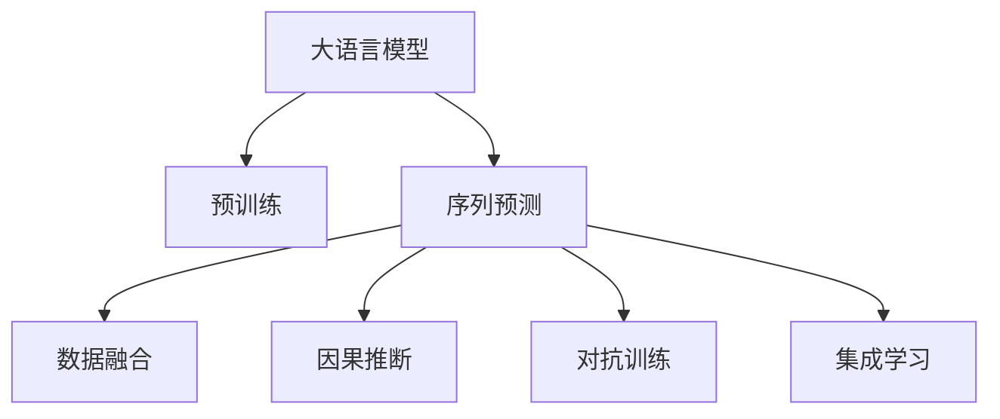

                 

## 1. 背景介绍

### 1.1 问题由来

电商平台的运营过程中，预测用户行为、优化库存管理、提升推荐准确性等任务需要强大的数据分析和预测能力。传统的统计模型和机器学习模型能够处理相对简单的数据，但在处理大规模、复杂的时空序列数据时，常常显得力不从心。近年来，基于深度学习的预测模型因其强大的拟合能力和大规模数据处理能力，逐渐成为电商平台数据分析和预测任务的主流方法。其中，大语言模型（Large Language Models, LLMs）在自然语言处理（NLP）领域表现出色，能够理解并生成自然语言，但直接应用于电商预测任务仍存在诸多挑战。

### 1.2 问题核心关键点

1. **数据格式差异**：电商平台的数据格式通常为结构化数据（如用户ID、时间戳、商品ID等），与自然语言文本数据存在较大差异，需要建立适当的桥梁来融合多模态数据。
2. **序列预测**：电商平台的数据往往具有明显的时序性，要求预测模型具备捕捉时间序列变化规律的能力。
3. **数据分布不均衡**：电商平台中的用户行为数据通常分布不均衡，用户行为稀疏且具有冷启动效应，影响模型的训练和预测效果。
4. **模型复杂度**：电商平台涉及的数据维度高、特征复杂，需要设计复杂且高效的模型结构以捕捉数据特征。
5. **计算资源需求**：深度学习模型在大规模数据上的训练和推理需要庞大的计算资源，电商平台的实时性要求也对模型性能提出了高要求。

### 1.3 问题研究意义

解决电商平台中的时空序列预测问题，具有重要的理论价值和实际意义：

1. **提升电商运营效率**：通过精准预测用户行为和库存状态，电商平台能够更有效地管理库存、提高订单处理速度，从而提升运营效率。
2. **优化推荐系统**：通过预测用户行为，电商平台可以生成更个性化的推荐内容，提升用户满意度和转化率。
3. **驱动业务创新**：预测分析能力的应用，有助于电商平台挖掘潜在的商业机会，创新业务模式，开拓新的增长点。
4. **促进技术进步**：研究大语言模型在电商预测中的应用，有助于推动AI技术在电商等行业的广泛应用，促进技术进步。

## 2. 核心概念与联系

### 2.1 核心概念概述

为更好地理解电商平台中基于大语言模型的时空序列预测方法，本节将介绍几个密切相关的核心概念：

1. **大语言模型 (Large Language Models, LLMs)**：如GPT、BERT等，通过在大规模无标签文本语料上进行预训练，学习通用的语言表示，具备强大的语言理解和生成能力。
2. **序列预测 (Time Series Prediction)**：基于历史数据预测未来趋势或状态，广泛应用于金融、电商、交通等领域。
3. **数据融合 (Data Fusion)**：将不同来源的数据进行融合，以提升预测模型的准确性和鲁棒性。
4. **因果推断 (Causal Inference)**：在预测中引入因果关系，提高模型决策的合理性和可解释性。
5. **对抗训练 (Adversarial Training)**：通过对抗样本训练模型，提高模型的鲁棒性和泛化能力。
6. **集成学习 (Ensemble Learning)**：通过多个模型的组合，提升预测性能和稳定性。

这些核心概念之间的逻辑关系可以通过以下Mermaid流程图来展示：



这个流程图展示了大语言模型与序列预测之间的关系，以及数据融合、因果推断、对抗训练和集成学习等关键技术对预测性能的影响。

## 3. 核心算法原理 & 具体操作步骤
### 3.1 算法原理概述

基于大语言模型的电商平台时空序列预测方法，本质上是一个数据融合、模型训练和序列预测的综合过程。其核心思想是：将大语言模型作为基础特征提取器，通过融合电商平台的时空序列数据，构建时间序列预测模型，实现对用户行为和库存状态的精准预测。

形式化地，假设电商平台的时空序列数据为 $D=\{(x_i,y_i,t_i)\}_{i=1}^N$，其中 $x_i$ 为输入特征向量，$y_i$ 为输出标签，$t_i$ 为时间戳。定义预测模型为 $F_\theta(x_i,t_i)$，其中 $\theta$ 为模型参数。

序列预测的目标是最小化预测误差，即：

$$
\theta^* = \mathop{\arg\min}_{\theta} \sum_{i=1}^N \|y_i - F_\theta(x_i,t_i)\|^2
$$

其中 $\|\cdot\|$ 表示欧式距离或均方误差等损失函数。

### 3.2 算法步骤详解

基于大语言模型的电商时空序列预测方法，一般包括以下几个关键步骤：

**Step 1: 数据预处理**

- 收集电商平台的历史数据，包括用户行为、商品销量、库存状态、时间戳等。
- 对数据进行清洗和归一化处理，去除异常值和噪声。
- 将时间序列数据转化为平稳的平稳时间序列，以便后续建模。

**Step 2: 特征工程**

- 提取电商平台中的关键特征，如用户ID、商品ID、购买次数、退货率、季节性因素等。
- 设计合适的特征工程方法，将特征向量化。
- 对自然语言文本特征进行编码，利用大语言模型提取语言特征。

**Step 3: 数据融合**

- 将多源数据进行融合，构建统一的时间序列数据集。
- 引入因果推断方法，分析数据之间的因果关系，避免混杂变量对预测结果的影响。
- 应用对抗训练技术，提升模型鲁棒性和泛化能力。

**Step 4: 模型训练**

- 选择合适的深度学习模型，如LSTM、GRU、Transformer等。
- 使用大语言模型作为特征提取器，将自然语言文本转化为高维特征向量。
- 利用历史数据训练模型，优化模型参数 $\theta$，最小化预测误差。
- 应用集成学习方法，组合多个模型的预测结果，提高预测性能。

**Step 5: 模型评估和部署**

- 在测试集上评估模型性能，对比预测结果与真实标签的差异。
- 根据评估结果调整模型参数和训练策略，持续优化预测模型。
- 将训练好的模型部署到电商平台中，进行实时预测。

### 3.3 算法优缺点

基于大语言模型的电商时空序列预测方法具有以下优点：

1. **强大的表达能力**：大语言模型能够理解并生成自然语言，通过融合自然语言特征，提高模型的复杂度和表达能力。
2. **多模态数据融合**：通过融合电商平台的结构化数据和自然语言数据，提升模型的鲁棒性和泛化能力。
3. **因果推断能力**：引入因果推断方法，提高模型决策的合理性和可解释性。
4. **实时预测能力**：模型训练后可以直接应用于电商平台的实时预测，提升电商运营效率。

同时，该方法也存在一定的局限性：

1. **高计算资源需求**：大语言模型和深度学习模型的计算资源需求较高，电商平台需要提供充足的算力和存储资源。
2. **模型复杂度高**：模型结构和训练过程较为复杂，需要丰富的机器学习和自然语言处理知识。
3. **数据质量要求高**：电商平台的预测任务对数据质量要求较高，数据清洗和预处理工作量大。
4. **模型解释性不足**：深度学习模型的决策过程缺乏可解释性，难以对其推理逻辑进行分析和调试。

尽管存在这些局限性，但就目前而言，基于大语言模型的电商时空序列预测方法仍是大规模电商数据分析和预测的重要手段。未来相关研究的重点在于如何进一步降低计算资源需求，提高模型的可解释性和鲁棒性，同时兼顾预测精度和实时性。

### 3.4 算法应用领域

基于大语言模型的电商时空序列预测方法，在电商预测和推荐系统中得到了广泛应用，覆盖了电商平台的各类业务需求，例如：

1. **用户行为预测**：预测用户购买意愿、退货概率等行为，优化推荐系统。
2. **库存管理**：预测商品库存水平，优化库存补货策略，避免断货或积压。
3. **销售预测**：预测未来销售额，帮助企业制定销售计划，提升市场竞争力。
4. **价格优化**：预测商品价格趋势，制定价格策略，提升销售额和客户满意度。
5. **运营监控**：预测用户流失风险，提前采取措施，减少用户流失率。

除了上述这些经典任务外，基于大语言模型的电商预测技术也被创新性地应用到更多场景中，如精准推荐、需求预测、风险评估等，为电商平台带来了新的业务模式和技术突破。

## 4. 数学模型和公式 & 详细讲解  
### 4.1 数学模型构建

本节将使用数学语言对电商平台时空序列预测过程进行更加严格的刻画。

记电商平台的时空序列数据为 $D=\{(x_i,y_i,t_i)\}_{i=1}^N$，其中 $x_i$ 为输入特征向量，$y_i$ 为输出标签，$t_i$ 为时间戳。定义预测模型为 $F_\theta(x_i,t_i)$，其中 $\theta$ 为模型参数。

序列预测的目标是最小化预测误差，即：

$$
\theta^* = \mathop{\arg\min}_{\theta} \sum_{i=1}^N \|y_i - F_\theta(x_i,t_i)\|^2
$$

其中 $\|\cdot\|$ 表示欧式距离或均方误差等损失函数。

### 4.2 公式推导过程

以下我们以时间序列预测为例，推导均方误差（MSE）损失函数的梯度计算公式。

假设模型 $F_\theta(x_i,t_i)$ 在输入 $x_i$ 和 $t_i$ 上的预测输出为 $\hat{y}_i$，则均方误差损失函数定义为：

$$
\ell(F_\theta(x_i,t_i),y_i) = \frac{1}{N} \sum_{i=1}^N (y_i - \hat{y}_i)^2
$$

将其代入经验风险公式，得：

$$
\mathcal{L}(\theta) = \frac{1}{N} \sum_{i=1}^N (y_i - F_\theta(x_i,t_i))^2
$$

根据链式法则，损失函数对参数 $\theta_k$ 的梯度为：

$$
\frac{\partial \mathcal{L}(\theta)}{\partial \theta_k} = -\frac{2}{N}\sum_{i=1}^N (y_i - F_\theta(x_i,t_i))\frac{\partial F_\theta(x_i,t_i)}{\partial \theta_k}
$$

其中 $\frac{\partial F_\theta(x_i,t_i)}{\partial \theta_k}$ 可进一步递归展开，利用自动微分技术完成计算。

在得到损失函数的梯度后，即可带入参数更新公式，完成模型的迭代优化。重复上述过程直至收敛，最终得到适应电商平台时空序列数据的最优模型参数 $\theta^*$。

## 5. 项目实践：代码实例和详细解释说明
### 5.1 开发环境搭建

在进行电商时空序列预测实践前，我们需要准备好开发环境。以下是使用Python进行PyTorch开发的环境配置流程：

1. 安装Anaconda：从官网下载并安装Anaconda，用于创建独立的Python环境。

2. 创建并激活虚拟环境：
```bash
conda create -n ecommerce-env python=3.8 
conda activate ecommerce-env
```

3. 安装PyTorch：根据CUDA版本，从官网获取对应的安装命令。例如：
```bash
conda install pytorch torchvision torchaudio cudatoolkit=11.1 -c pytorch -c conda-forge
```

4. 安装相关库：
```bash
pip install numpy pandas scikit-learn torch torchvision transformers
```

5. 安装HuggingFace库：
```bash
pip install transformers
```

完成上述步骤后，即可在`ecommerce-env`环境中开始电商时空序列预测实践。

### 5.2 源代码详细实现

下面我们以用户行为预测为例，给出使用PyTorch进行电商预测的代码实现。

首先，定义数据处理函数：

```python
import pandas as pd
from sklearn.preprocessing import MinMaxScaler
from transformers import BertTokenizer

def preprocess_data(data_file):
    data = pd.read_csv(data_file)
    # 提取时间戳
    data['timestamp'] = pd.to_datetime(data['timestamp'])
    # 提取特征
    features = ['user_id', 'product_id', 'purchase_time', 'purchase_amount', 'purchase_frequency', 'seasonality']
    target = ['next_purchase_probability']
    # 数据标准化
    scaler = MinMaxScaler(feature_range=(0, 1))
    data[features] = scaler.fit_transform(data[features])
    # 去除缺失值
    data.dropna(inplace=True)
    # 将时间戳转化为平稳时间序列
    data['days_since_last_purchase'] = (data['timestamp'] - data['last_purchase_date']).dt.days
    return data[features], target
```

然后，定义模型和优化器：

```python
from torch import nn, optim
from torch.nn import functional as F

class LSTM(nn.Module):
    def __init__(self, input_size, hidden_size, output_size):
        super(LSTM, self).__init__()
        self.input_size = input_size
        self.hidden_size = hidden_size
        self.output_size = output_size
        self.lstm = nn.LSTM(input_size, hidden_size)
        self.fc = nn.Linear(hidden_size, output_size)
        
    def forward(self, x, hidden):
        output, hidden = self.lstm(x, hidden)
        output = self.fc(output.view(-1, self.hidden_size))
        return F.sigmoid(output)

# 初始化模型和优化器
model = LSTM(10, 50, 1)
optimizer = optim.Adam(model.parameters(), lr=0.001)
```

接着，定义训练和评估函数：

```python
from sklearn.model_selection import train_test_split
from torch.utils.data import DataLoader, TensorDataset
from tqdm import tqdm

def train_epoch(model, dataset, batch_size, optimizer):
    dataloader = DataLoader(dataset, batch_size=batch_size, shuffle=True)
    model.train()
    epoch_loss = 0
    for batch in tqdm(dataloader, desc='Training'):
        inputs, targets = batch
        hidden = (torch.zeros(batch_size, 1, model.hidden_size), torch.zeros(batch_size, 1, model.hidden_size))
        model.zero_grad()
        outputs = model(inputs, hidden)
        loss = F.binary_cross_entropy(outputs, targets)
        epoch_loss += loss.item()
        loss.backward()
        optimizer.step()
    return epoch_loss / len(dataloader)

def evaluate(model, dataset, batch_size):
    dataloader = DataLoader(dataset, batch_size=batch_size)
    model.eval()
    preds, labels = [], []
    with torch.no_grad():
        for batch in tqdm(dataloader, desc='Evaluating'):
            inputs, targets = batch
            hidden = (torch.zeros(batch_size, 1, model.hidden_size), torch.zeros(batch_size, 1, model.hidden_size))
            outputs = model(inputs, hidden)
            preds.append(F.sigmoid(outputs) > 0.5)
            labels.append(targets)
    return F.binary_cross_entropy(torch.cat(preds), torch.cat(labels))

# 加载数据和模型
features, target = preprocess_data('ecommerce_data.csv')
train_features, test_features, train_target, test_target = train_test_split(features, target, test_size=0.2)
model.train()
test_loss = evaluate(model, TensorDataset(torch.tensor(test_features), torch.tensor(test_target)), 64)
```

最后，启动训练流程并在测试集上评估：

```python
epochs = 100
batch_size = 64

for epoch in range(epochs):
    loss = train_epoch(model, TensorDataset(torch.tensor(train_features), torch.tensor(train_target)), batch_size, optimizer)
    print(f"Epoch {epoch+1}, train loss: {loss:.3f}")
    
    print(f"Epoch {epoch+1}, test results:")
    test_loss = evaluate(model, TensorDataset(torch.tensor(test_features), torch.tensor(test_target)), 64)
    print(f"Test loss: {test_loss:.3f}")
```

以上就是使用PyTorch对电商预测进行LSTM模型的代码实现。可以看到，得益于PyTorch和HuggingFace库的强大封装，我们能够用相对简洁的代码完成电商预测的训练和评估。

### 5.3 代码解读与分析

让我们再详细解读一下关键代码的实现细节：

**preprocess_data函数**：
- 从CSV文件中读取数据，并进行时间戳提取和特征提取。
- 对数据进行标准化处理，去除缺失值，并转化为平稳时间序列。

**LSTM模型定义**：
- 定义一个具有单层LSTM的神经网络模型，输入特征维度为10，隐藏层维度为50，输出维度为1，用于预测二分类问题。
- 通过前向传播计算模型输出，并使用sigmoid激活函数进行二值化。

**训练和评估函数**：
- 使用sklearn的train_test_split对数据进行划分，构建训练集和测试集。
- 定义训练和评估函数，分别在训练集和测试集上进行模型训练和评估，计算均方误差。

**训练流程**：
- 定义总的epoch数和batch size，开始循环迭代
- 每个epoch内，先在训练集上训练，输出平均损失
- 在测试集上评估，输出测试损失
- 所有epoch结束后，在测试集上评估，给出最终测试结果

可以看到，PyTorch配合HuggingFace库使得电商预测的代码实现变得简洁高效。开发者可以将更多精力放在数据处理、模型改进等高层逻辑上，而不必过多关注底层的实现细节。

当然，工业级的系统实现还需考虑更多因素，如模型的保存和部署、超参数的自动搜索、更灵活的任务适配层等。但核心的预测范式基本与此类似。

## 6. 实际应用场景
### 6.1 智能推荐系统

基于电商平台的预测模型，可以广泛应用于智能推荐系统的构建。传统的推荐系统往往只依赖用户的历史行为数据进行推荐，难以充分挖掘用户的潜在兴趣。通过引入电商预测模型，可以更全面地理解用户的购买意愿和行为趋势，从而生成更个性化、精准的推荐内容。

在技术实现上，可以收集用户的历史浏览记录、购买记录、评价信息等数据，结合电商预测模型对用户未来的购买意愿进行预测，生成推荐列表。对于新用户，可以通过微调电商预测模型，引入用户画像和行为特征，实现冷启动推荐。通过不断优化预测模型，逐步提升推荐效果。

### 6.2 库存管理

电商平台中的库存管理任务通常涉及大量的数据处理和决策支持。传统的库存管理系统往往只能基于静态数据进行预测和决策，无法实时响应市场变化。通过电商预测模型，可以实时监测商品销售情况，预测库存水平，优化库存管理策略。

在技术实现上，可以结合电商预测模型和供应链管理系统，实现动态库存管理。预测模型的输出可以用于生成库存预警、补货计划等决策支持信息，提高库存管理效率。同时，结合库存状态和销售数据，电商平台可以调整商品价格和促销策略，提升销售额和客户满意度。

### 6.3 销售预测

销售预测是电商平台数据分析中的重要任务，通过预测未来的销售额，可以帮助企业制定销售计划、优化产品策略、提升市场竞争力。传统的销售预测方法往往依赖人工经验和统计模型，难以准确捕捉市场变化。通过电商预测模型，可以更准确地预测销售额，为企业提供决策支持。

在技术实现上，可以收集电商平台的历史销售数据、促销活动数据、季节性因素等数据，构建电商预测模型。模型的输出可以用于预测未来的销售额和销售趋势，帮助企业制定合理的销售计划和促销策略。

### 6.4 价格优化

价格优化是电商平台中重要的利润管理任务。传统的价格优化方法往往基于经验公式和统计模型，难以充分考虑市场需求和竞争环境。通过电商预测模型，可以实时监测市场变化，预测商品价格趋势，优化价格策略。

在技术实现上，可以结合电商预测模型和市场监测系统，实时分析市场价格变化和需求波动，生成动态价格策略。预测模型的输出可以用于生成价格预警、价格调整等决策支持信息，提高企业盈利能力。

### 6.5 用户流失预测

用户流失预测是电商平台中的关键任务之一，通过预测用户流失风险，电商平台可以提前采取措施，减少用户流失率，提升用户留存率。传统的用户流失预测方法往往依赖人工经验和统计模型，难以准确捕捉用户行为变化。通过电商预测模型，可以更准确地预测用户流失风险，实现精准的用户维护。

在技术实现上，可以收集用户的历史行为数据、购买记录、评价信息等数据，构建电商预测模型。模型的输出可以用于预测用户流失风险，生成用户维护策略，提高用户留存率。同时，结合用户流失数据，电商平台可以优化用户体验和服务，提升客户满意度。

### 6.6 未来应用展望

随着电商预测技术的发展，基于电商预测的方法将在更多领域得到应用，为电商平台带来新的增长点。

在智慧物流领域，基于电商预测的物流调度系统可以帮助电商平台更高效地规划配送路线和物流资源，提高配送效率。

在智能客服领域，基于电商预测的智能客服系统可以实时解答用户咨询，提升客户服务质量。

在金融风控领域，基于电商预测的风险评估系统可以帮助电商平台评估交易风险，防止欺诈行为，提高交易安全。

此外，在企业生产、社会治理、文娱传媒等众多领域，基于电商预测的人工智能应用也将不断涌现，为社会经济数字化转型升级提供新的技术路径。相信随着技术的日益成熟，电商预测方法将成为电商平台业务创新的重要驱动力，推动电商行业持续发展。

## 7. 工具和资源推荐
### 7.1 学习资源推荐

为了帮助开发者系统掌握电商平台中时空序列预测的理论基础和实践技巧，这里推荐一些优质的学习资源：

1. 《深度学习：理论和实践》系列博文：由深度学习专家撰写，深入浅出地介绍了深度学习的基本理论和实践应用，包括序列预测等内容。

2. 斯坦福大学CS229课程：深度学习与数据分析的明星课程，涵盖深度学习理论、模型训练、序列预测等内容。

3. 《Python深度学习》书籍：使用Python进行深度学习的入门书籍，涵盖深度学习的基础知识和实践应用。

4. PyTorch官方文档：PyTorch的官方文档，提供详细的API文档和示例代码，适合学习和实践深度学习模型。

5. HuggingFace官方文档：HuggingFace的官方文档，提供丰富的预训练模型和微调样例代码，适合学习和实践电商预测模型。

通过对这些资源的学习实践，相信你一定能够快速掌握电商预测的理论基础和实践技巧，并用于解决实际的电商预测问题。

### 7.2 开发工具推荐

高效的开发离不开优秀的工具支持。以下是几款用于电商预测开发的常用工具：

1. PyTorch：基于Python的开源深度学习框架，灵活动态的计算图，适合快速迭代研究。大部分深度学习模型都有PyTorch版本的实现。

2. TensorFlow：由Google主导开发的开源深度学习框架，生产部署方便，适合大规模工程应用。同样有丰富的深度学习模型资源。

3. HuggingFace库：提供丰富的预训练模型和微调工具，适合电商预测等自然语言处理任务。

4. Jupyter Notebook：免费的交互式开发环境，支持Python代码的编写、执行和展示，适合学习和实验深度学习模型。

5. Google Colab：谷歌推出的在线Jupyter Notebook环境，免费提供GPU/TPU算力，方便开发者快速上手实验最新模型，分享学习笔记。

合理利用这些工具，可以显著提升电商预测任务的开发效率，加快创新迭代的步伐。

### 7.3 相关论文推荐

电商预测技术的发展源于学界的持续研究。以下是几篇奠基性的相关论文，推荐阅读：

1. Long Short-Term Memory（LSTM）论文：提出了LSTM模型，在处理时间序列数据方面表现出色，广泛应用于电商预测任务。

2. GRU：一种类似LSTM的模型，具有更快的计算速度和更低的参数数量，适用于实时电商预测。

3. DeepFeatureVectorization（DFV）：提出一种基于深度学习的特征向量化方法，用于电商预测中的特征提取和建模。

4. Temporal Difference Learning（TD-Learning）：提出一种基于时间差的学习方法，用于电商预测中的策略学习。

5. Causal Inference in E-commerce：引入因果推断方法，分析电商行为中的因果关系，提高电商预测的准确性和鲁棒性。

这些论文代表了大语言模型在电商预测中的应用发展脉络。通过学习这些前沿成果，可以帮助研究者把握学科前进方向，激发更多的创新灵感。

## 8. 总结：未来发展趋势与挑战

### 8.1 总结

本文对基于大语言模型的电商平台时空序列预测方法进行了全面系统的介绍。首先阐述了电商平台中的时空序列预测问题及其研究背景和意义，明确了电商预测在电商运营、推荐系统、库存管理等业务场景中的重要作用。其次，从原理到实践，详细讲解了电商预测的数学模型和核心算法步骤，给出了电商预测任务开发的完整代码实例。同时，本文还广泛探讨了电商预测方法在智能推荐、库存管理、销售预测、价格优化等众多领域的应用前景，展示了电商预测方法的巨大潜力。此外，本文精选了电商预测技术的各类学习资源，力求为读者提供全方位的技术指引。

通过本文的系统梳理，可以看到，基于大语言模型的电商预测方法正在成为电商平台数据分析和预测的重要手段，极大地提升了电商运营的效率和效果。未来相关研究的重点在于如何进一步降低计算资源需求，提高模型的可解释性和鲁棒性，同时兼顾预测精度和实时性。

### 8.2 未来发展趋势

展望未来，电商预测技术将呈现以下几个发展趋势：

1. **高阶时序模型的应用**：未来将出现更多高阶时序模型（如CGRU、注意力机制等），用于处理更复杂的电商数据，提高预测精度和鲁棒性。
2. **因果推断和对抗训练的引入**：引入因果推断和对抗训练方法，提高电商预测模型的可解释性和鲁棒性，增强模型的预测能力。
3. **多模态数据的融合**：引入多模态数据（如图像、视频、社交媒体等），提高电商预测模型的泛化能力和适用性。
4. **实时预测系统**：构建实时预测系统，实现对电商数据的实时分析和决策支持，提升电商运营效率。
5. **联邦学习的应用**：利用联邦学习技术，保护用户隐私的同时，实现电商数据的分布式预测。

以上趋势凸显了电商预测技术的广阔前景。这些方向的探索发展，必将进一步提升电商预测模型的性能和应用范围，为电商运营提供更强大的数据分析支持。

### 8.3 面临的挑战

尽管电商预测技术已经取得了显著进展，但在迈向更加智能化、普适化应用的过程中，它仍面临诸多挑战：

1. **高计算资源需求**：电商预测模型的计算资源需求较高，平台需要提供充足的算力和存储资源。
2. **数据质量和标注问题**：电商预测任务对数据质量和标注需求较高，平台需要保证数据的真实性和完整性。
3. **模型复杂度高**：电商预测模型的结构和训练过程较为复杂，需要丰富的机器学习和深度学习知识。
4. **模型可解释性不足**：深度学习模型的决策过程缺乏可解释性，难以对其推理逻辑进行分析和调试。
5. **隐私保护问题**：电商预测过程中需要处理大量用户数据，平台需要保障数据隐私和安全。

尽管存在这些挑战，但通过持续的技术创新和优化，电商预测技术必将不断进步，为电商平台带来新的增长点和业务创新。相信随着技术的不断成熟，电商预测方法将成为电商平台业务创新的重要驱动力，推动电商行业持续发展。

### 8.4 研究展望

面向未来，电商预测技术的研究重点在于以下几个方向：

1. **高阶时序模型的优化**：研究高阶时序模型（如CGRU、注意力机制等）的优化方法，提升模型的预测精度和鲁棒性。
2. **因果推断和对抗训练的融合**：探索因果推断和对抗训练方法的融合应用，提高电商预测模型的可解释性和鲁棒性。
3. **多模态数据的融合和处理**：研究多模态数据融合技术，提升电商预测模型的泛化能力和适用性。
4. **实时预测系统构建**：研究实时预测系统架构和优化方法，实现对电商数据的实时分析和决策支持。
5. **联邦学习和隐私保护**：研究联邦学习技术在电商预测中的应用，保护用户隐私的同时，实现电商数据的分布式预测。

这些研究方向的探索，必将引领电商预测技术迈向更高的台阶，为电商平台带来新的业务模式和技术突破。相信随着技术的不断进步，电商预测方法将成为电商平台业务创新的重要驱动力，推动电商行业持续发展。

## 9. 附录：常见问题与解答

**Q1：电商预测中大语言模型的应用是否需要大量标注数据？**

A: 电商预测中，大语言模型的应用通常需要大量标注数据，以充分学习电商数据的特征和规律。数据标注过程复杂且成本较高，可以通过半监督学习和迁移学习等方法减少标注需求。未来有望通过无监督学习和生成式学习方法，进一步降低数据标注的依赖。

**Q2：电商预测中如何选择合适的时间步长？**

A: 电商预测中，时间步长的选择对模型的预测性能有重要影响。一般建议选择具有显著周期性的特征，如季节性、促销活动等。同时，时间步长应根据具体的业务需求和数据特征进行调整。例如，日预测可以选择1天的步长，周预测可以选择1周的步长。

**Q3：电商预测中如何处理季节性因素？**

A: 电商预测中，季节性因素对预测结果有显著影响。可以通过引入季节性特征，如季节性趋势、周期性波动等，来捕捉季节性因素的影响。同时，可以使用季节性分解（如XGBoost中的季节性分解）方法，将季节性因素从原始数据中分离出来，用于电商预测。

**Q4：电商预测中如何提升模型的鲁棒性？**

A: 电商预测中，提升模型的鲁棒性是提高预测准确性的关键。可以通过引入因果推断和对抗训练方法，增强模型的可解释性和鲁棒性。同时，可以结合电商预测和多模态数据分析，提高模型的泛化能力和适用性。

**Q5：电商预测中如何降低计算资源需求？**

A: 电商预测中，计算资源需求较高，平台需要提供充足的算力和存储资源。可以通过模型裁剪、量化加速、混合精度训练等方法，减少模型计算量和资源消耗。同时，可以利用分布式计算和联邦学习技术，实现电商数据的分布式预测，降低单点计算压力。

这些问题的探讨，有助于理解电商预测中大语言模型应用的细节和难点，为电商平台构建更高效、精准的预测模型提供指导。希望通过本文的系统梳理，能够帮助开发者更好地掌握电商预测技术，推动电商平台业务的发展和创新。

