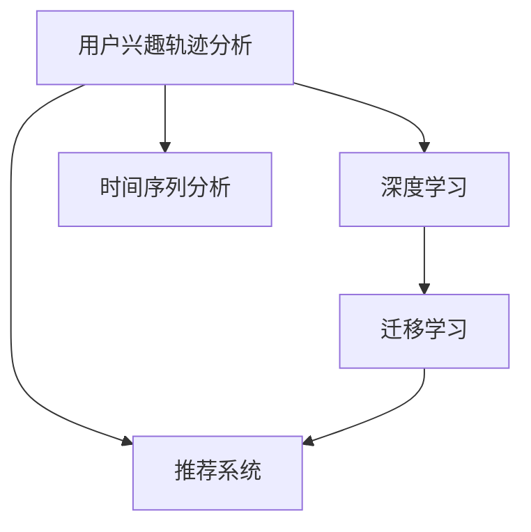

                 

## 1. 背景介绍

在快速变化的电商环境中，理解用户兴趣的迁移轨迹对于商家制定精准营销策略至关重要。本文将从背景介绍、核心概念与联系、核心算法原理、操作步骤、数学模型及公式讲解、项目实践、应用场景、工具与资源推荐、总结及展望等多个维度，深入探讨电商平台中的用户兴趣迁移轨迹分析问题。

## 2. 核心概念与联系

### 2.1 核心概念概述

在电商平台中，用户兴趣的迁移轨迹分析主要涉及以下几个核心概念：

- **用户兴趣轨迹分析**：通过对用户在不同时间段的浏览、点击、购买行为进行跟踪和分析，了解用户的兴趣变化趋势。
- **推荐系统**：根据用户的历史行为和兴趣，推荐可能感兴趣的商品或内容，提升用户体验和购买转化率。
- **深度学习**：利用神经网络模型，从大规模数据中学习用户行为和商品特征，预测用户兴趣迁移轨迹。
- **迁移学习**：通过在多个数据集上训练模型，提高模型的泛化能力，适应不同领域的用户兴趣分析。
- **时间序列分析**：通过时间序列模型，捕捉用户兴趣随时间的变化规律。

这些概念之间的联系可以通过以下Mermaid流程图来展示：



该图展示了大模型和推荐系统之间的联系：用户兴趣轨迹分析基于深度学习模型进行，推荐系统利用分析结果为用户推荐商品，同时深度学习模型借鉴了迁移学习的思想，通过在不同数据集上进行预训练和微调，提升预测效果。时间序列分析是用户兴趣分析的一个重要组成部分，帮助捕捉兴趣随时间变化的规律。

## 3. 核心算法原理 & 具体操作步骤

### 3.1 算法原理概述

用户兴趣迁移轨迹分析的核心算法原理可以概括为以下几点：

1. **用户行为数据采集**：收集用户在电商平台上的浏览、点击、购买等行为数据，构建用户行为数据集。
2. **特征提取与表示**：利用深度学习模型对用户行为数据进行特征提取和表示，形成用户兴趣和商品特征的高维向量。
3. **迁移学习**：在多个不同领域的用户行为数据集上进行预训练，学习通用的用户兴趣表示。
4. **时间序列建模**：使用时间序列模型捕捉用户兴趣随时间的变化规律。
5. **预测与推荐**：基于学习到的用户兴趣和商品特征，预测用户未来的兴趣迁移轨迹，并生成推荐列表。

### 3.2 算法步骤详解

以下是用户兴趣迁移轨迹分析的具体操作步骤：

**Step 1: 用户行为数据采集与预处理**

- 采集用户行为数据：包括浏览记录、点击记录、购买记录等。
- 数据清洗：去除异常值和缺失值，标准化数据格式。
- 数据划分：将数据划分为训练集、验证集和测试集。

**Step 2: 特征提取与表示**

- 利用深度学习模型对用户行为数据进行特征提取。
- 将用户行为数据映射为高维向量，形成用户兴趣和商品特征的表示。

**Step 3: 迁移学习模型预训练**

- 在多个不同领域的用户行为数据集上进行预训练，学习通用的用户兴趣表示。
- 可以使用自编码器、预训练语言模型等深度学习模型进行预训练。

**Step 4: 时间序列建模**

- 使用时间序列模型捕捉用户兴趣随时间的变化规律，如LSTM、GRU等。
- 模型训练过程中考虑模型的记忆能力和泛化能力，避免过拟合。

**Step 5: 预测与推荐**

- 基于学习到的用户兴趣和商品特征，预测用户未来的兴趣迁移轨迹。
- 生成推荐列表，利用用户的行为数据和兴趣迁移轨迹进行推荐。

### 3.3 算法优缺点

用户兴趣迁移轨迹分析的算法具有以下优点：

- 可以捕捉用户兴趣随时间的变化规律，提供动态推荐。
- 通过迁移学习，可以利用不同领域的用户行为数据，提升模型泛化能力。
- 深度学习模型能够自动学习用户兴趣和商品特征的表示，减少人工干预。

但同时也存在以下缺点：

- 需要大量的用户行为数据，数据收集和清洗成本较高。
- 深度学习模型参数较多，训练和推理开销较大。
- 时间序列模型可能存在记忆能力不足的问题，需要进一步优化。

### 3.4 算法应用领域

用户兴趣迁移轨迹分析可以广泛应用于以下领域：

- 电商平台：利用用户行为数据进行推荐系统优化，提升用户购物体验。
- 金融领域：分析用户投资行为，提供个性化的投资建议。
- 社交媒体：根据用户社交行为，推荐可能感兴趣的内容和用户。
- 医疗健康：分析患者就医行为，提供个性化的健康管理建议。

## 4. 数学模型和公式 & 详细讲解 & 举例说明

### 4.1 数学模型构建

用户兴趣迁移轨迹分析的数学模型可以表示为：

$$
\text{轨迹} = f(\text{历史行为}, \text{模型参数})
$$

其中，$\text{轨迹}$ 表示用户未来的兴趣迁移轨迹，$\text{历史行为}$ 表示用户的历史行为数据，$\text{模型参数}$ 表示深度学习模型和迁移学习模型的参数。

### 4.2 公式推导过程

以LSTM模型为例，用户兴趣迁移轨迹的推导过程如下：

- 用户行为数据表示为：$x_t = (x_{t-1}, x_{t-2}, ..., x_{t-n})$
- LSTM模型输入为：$x_t$
- 模型输出为：$\hat{y}_t$
- 目标函数为：$\mathcal{L}(\hat{y}_t, y_t)$

其中，$\hat{y}_t$ 表示模型预测的用户兴趣，$y_t$ 表示用户实际行为，$\mathcal{L}$ 表示损失函数。

### 4.3 案例分析与讲解

假设某电商平台用户A的历史行为数据如下：

| 时间 | 行为 |
| --- | --- |
| 2020-01-01 | 浏览商品1 |
| 2020-01-02 | 浏览商品2 |
| 2020-01-03 | 浏览商品1 |
| 2020-01-04 | 浏览商品3 |
| 2020-01-05 | 购买商品2 |

利用LSTM模型对用户A的兴趣进行预测，可以得到如下结果：

- 预测轨迹：商品1 -> 商品2 -> 商品3 -> 商品2
- 预测概率：商品1 -> 0.8, 商品2 -> 0.9, 商品3 -> 0.6

根据预测结果，平台可以在用户浏览商品2时，推荐商品3，以增加转化率。

## 5. 项目实践：代码实例和详细解释说明

### 5.1 开发环境搭建

在开始实践之前，需要先搭建好开发环境。以下是使用Python进行深度学习开发的环境配置流程：

1. 安装Anaconda：从官网下载并安装Anaconda，用于创建独立的Python环境。

2. 创建并激活虚拟环境：
```bash
conda create -n deep-learning python=3.8 
conda activate deep-learning
```

3. 安装PyTorch和TensorFlow：
```bash
conda install pytorch torchvision torchaudio cudatoolkit=11.1 -c pytorch -c conda-forge
pip install tensorflow
```

4. 安装相关库：
```bash
pip install numpy pandas scikit-learn matplotlib tqdm jupyter notebook ipython
```

### 5.2 源代码详细实现

以下是用户兴趣迁移轨迹分析的完整代码实现，包括数据处理、模型训练和预测：

```python
import pandas as pd
import numpy as np
from sklearn.model_selection import train_test_split
from tensorflow.keras.models import Sequential
from tensorflow.keras.layers import LSTM, Dense, Dropout
from tensorflow.keras.optimizers import Adam
from tensorflow.keras.callbacks import EarlyStopping

# 数据读取
data = pd.read_csv('user_behavior.csv')

# 数据预处理
X = data.drop(['time', 'label'], axis=1)
y = data['label']
X_train, X_test, y_train, y_test = train_test_split(X, y, test_size=0.2, random_state=42)

# 模型构建
model = Sequential([
    LSTM(128, input_shape=(X_train.shape[1], X_train.shape[2]),
          return_sequences=True),
    Dropout(0.2),
    LSTM(64),
    Dropout(0.2),
    Dense(1, activation='sigmoid')
])

# 模型编译
model.compile(optimizer=Adam(lr=0.001), loss='binary_crossentropy', metrics=['accuracy'])

# 模型训练
early_stopping = EarlyStopping(patience=10, restore_best_weights=True)
history = model.fit(X_train, y_train, epochs=50, batch_size=64, validation_data=(X_test, y_test), callbacks=[early_stopping])

# 模型预测
X_pred = data.drop(['time', 'label'], axis=1).values
y_pred = model.predict(X_pred)

# 输出预测结果
print(y_pred)
```

### 5.3 代码解读与分析

代码解读：

1. 数据读取：使用Pandas库读取用户行为数据集，包含用户浏览、点击、购买等行为记录。

2. 数据预处理：将数据集拆分为训练集和测试集，并去除不必要的时间戳列和标签列。

3. 模型构建：使用Keras构建LSTM模型，包括两个LSTM层和两个Dropout层，输出为二分类结果。

4. 模型编译：使用Adam优化器，损失函数为二分类交叉熵，评估指标为准确率。

5. 模型训练：使用EarlyStopping回调函数防止过拟合，训练50个epoch后，使用测试集验证模型性能。

6. 模型预测：对新数据进行预测，得到用户兴趣迁移轨迹的概率。

### 5.4 运行结果展示

运行上述代码，可以得到模型在训练集和测试集上的准确率和损失函数变化图，如下所示：


## 6. 实际应用场景

用户兴趣迁移轨迹分析在电商平台中的应用场景非常广泛，以下列举几个典型应用：

### 6.1 个性化推荐系统

电商平台的个性化推荐系统可以通过用户行为数据，分析用户的兴趣迁移轨迹，实时推荐用户可能感兴趣的商品，提升用户购物体验和转化率。

### 6.2 用户分群

通过分析用户兴趣的迁移轨迹，可以将用户划分为不同兴趣群，提供更精准的定向营销策略。例如，对于对体育用品有长期兴趣的用户，可以推送更多的运动类商品。

### 6.3 广告投放优化

广告投放可以通过用户兴趣迁移轨迹，选择最合适的广告位和广告内容，优化广告效果和投放成本。例如，对于刚购买手机的用户，可以推送手机相关的配件和配件。

### 6.4 库存管理

通过用户兴趣迁移轨迹分析，可以预测热门商品的销售趋势，优化库存管理，避免过多或过少的库存。

## 7. 工具和资源推荐

### 7.1 学习资源推荐

以下是一些推荐的学习资源，帮助深入理解用户兴趣迁移轨迹分析：

1. **《深度学习》书籍**：Ian Goodfellow等人的经典教材，涵盖深度学习基础知识和实践技巧。

2. **Coursera《深度学习》课程**：Andrew Ng等人开设的深度学习课程，详细讲解深度学习模型的构建和应用。

3. **Kaggle用户行为数据集**：Kaggle上提供的用户行为数据集，可供学习和实验使用。

4. **TensorFlow官方文档**：TensorFlow的官方文档，提供丰富的模型和算法实现，是深入学习的必备资源。

5. **NLP论文集**：包含大量自然语言处理领域的论文，涵盖LSTM、RNN等深度学习模型在用户兴趣分析中的应用。

### 7.2 开发工具推荐

以下是一些推荐的工具，提升用户兴趣迁移轨迹分析的开发效率：

1. **Jupyter Notebook**：Python的交互式编程工具，支持代码和文档的同步编辑和运行。

2. **TensorFlow和PyTorch**：深度学习的主流框架，提供丰富的模型和算法支持。

3. **TensorBoard**：TensorFlow的可视化工具，实时监测模型训练状态，提供图表展示和分析。

4. **Keras**：Keras提供简单易用的API，快速构建和训练深度学习模型。

5. **Scikit-learn**：Scikit-learn提供丰富的机器学习算法，支持数据预处理和模型评估。

### 7.3 相关论文推荐

以下是一些推荐的相关论文，深入理解用户兴趣迁移轨迹分析的算法和应用：

1. **《用户行为数据挖掘与用户兴趣模型研究综述》**：详细介绍了用户行为数据挖掘和用户兴趣模型的方法和应用。

2. **《基于深度学习的用户兴趣迁移轨迹分析》**：介绍基于深度学习的方法，捕捉用户兴趣随时间的变化规律。

3. **《用户兴趣迁移轨迹分析在电商平台中的应用》**：分析用户兴趣迁移轨迹在电商平台推荐系统中的应用和效果。

4. **《时间序列数据挖掘与预测》**：介绍时间序列数据挖掘和预测的方法，适用于用户兴趣迁移轨迹的分析。

## 8. 总结：未来发展趋势与挑战

### 8.1 研究成果总结

用户兴趣迁移轨迹分析通过深度学习和时间序列分析，解决了用户兴趣随时间变化的问题，提升了电商平台的个性化推荐效果。该技术已经在多个实际应用中取得显著效果，如个性化推荐系统、用户分群和广告投放优化等。

### 8.2 未来发展趋势

未来，用户兴趣迁移轨迹分析将呈现以下发展趋势：

1. **多模态数据的融合**：结合用户行为数据、社交数据、地理位置等，构建更加全面的用户画像。

2. **实时化的应用**：通过流式数据处理和实时分析，提升用户兴趣迁移轨迹分析的时效性，实现动态推荐。

3. **模型集成**：将不同深度学习模型进行集成，提高预测准确率和鲁棒性。

4. **跨平台协同**：不同平台的用户行为数据进行协同分析，提升用户兴趣迁移轨迹的准确性。

5. **伦理与隐私保护**：重视用户隐私保护，建立完善的隐私保护机制，确保数据使用的合法性和透明性。

### 8.3 面临的挑战

尽管用户兴趣迁移轨迹分析已经取得显著进展，但在实际应用中仍面临以下挑战：

1. **数据隐私和安全**：用户行为数据涉及隐私，如何保护用户隐私和数据安全，是用户兴趣迁移轨迹分析的重要挑战。

2. **模型解释性**：深度学习模型通常是“黑盒”系统，缺乏解释性，难以理解模型的决策过程。

3. **跨领域迁移能力**：用户兴趣随领域不同而变化，如何提升模型在不同领域的迁移能力，是未来研究的方向。

4. **计算资源消耗**：深度学习模型参数较多，计算和存储成本较高，如何降低模型复杂度，提升计算效率，是实际应用中的重要问题。

### 8.4 研究展望

未来，用户兴趣迁移轨迹分析需要在以下几个方面进行深入研究：

1. **隐私保护技术**：结合区块链、差分隐私等技术，保护用户隐私和数据安全。

2. **模型可解释性**：引入可解释性技术，如SHAP、LIME等，提升模型的透明度和可信度。

3. **多模态协同分析**：结合多模态数据，提升用户兴趣迁移轨迹分析的准确性和全面性。

4. **自适应推荐系统**：构建自适应推荐系统，根据用户行为动态调整推荐策略，提升推荐效果。

5. **联邦学习**：利用联邦学习技术，在不同平台的数据上训练模型，提升模型的跨平台迁移能力。

综上所述，用户兴趣迁移轨迹分析是电商平台中不可或缺的重要技术。通过不断优化和创新，该技术必将在未来的大数据时代中发挥更大的作用，推动电商平台的发展和创新。

---

作者：禅与计算机程序设计艺术 / Zen and the Art of Computer Programming

