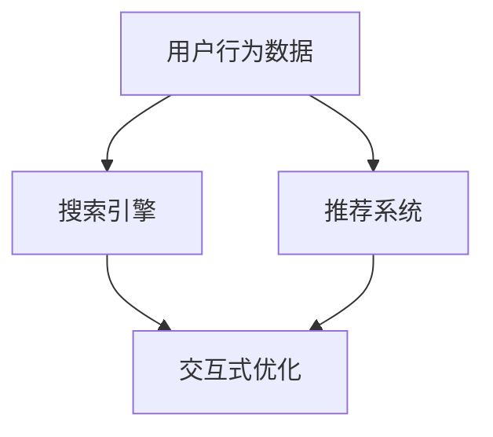

                 

# 电商平台搜索推荐系统的AI 大模型优化：提高系统性能、效率与用户体验

## 1. 背景介绍

随着电商平台的不断发展，用户行为数据变得日益复杂和多样化，搜索推荐系统的设计和使用也面临了新的挑战。传统的基于规则或统计的推荐算法已经难以满足用户个性化需求，AI大模型技术以其强大的数据处理能力和学习能力，逐渐成为搜索推荐系统优化的重要手段。

搜索推荐系统的主要目标是提高用户体验，通过精准推荐满足用户需求。然而，由于用户行为和偏好具有多样性和动态性，系统设计需要在性能、效率和用户体验之间找到平衡。基于AI大模型的优化，旨在通过提升模型的泛化能力和推理效率，使得系统能够更快速、更准确地响应用户需求，提升整体的用户体验。

## 2. 核心概念与联系

### 2.1 核心概念概述

为了更好地理解AI大模型在搜索推荐系统中的应用，本节将介绍几个核心概念：

- **AI大模型**：指采用深度学习技术，在大规模数据上进行训练，具备强大的数据处理和推理能力的人工智能模型。大模型可以应用于自然语言处理、计算机视觉、推荐系统等多个领域。

- **搜索引擎**：指根据用户输入的查询语句，从海量数据中匹配最相关的结果返回给用户的系统。搜索引擎的核心任务是理解查询意图，精确匹配和排序搜索结果。

- **推荐系统**：根据用户的历史行为和兴趣偏好，动态生成个性化推荐结果的系统。推荐系统的主要目标是提高用户满意度和转化率，降低流失率。

- **用户行为数据**：指用户在电商平台上的浏览、点击、购买等行为数据。这些数据是推荐系统的主要输入，用于训练和优化模型。

- **交互式优化**：指在推荐过程中实时采集用户反馈，动态调整推荐策略和模型参数，以提高推荐效果和用户满意度。

这些核心概念之间的逻辑关系可以通过以下Mermaid流程图来展示：



这个流程图展示了搜索推荐系统的核心组件及其之间的交互关系。用户行为数据先进入搜索引擎，搜索系统理解用户查询意图，然后交由推荐系统生成推荐结果。推荐系统可以根据用户反馈实时调整模型参数，提升推荐效果。

## 3. 核心算法原理 & 具体操作步骤

### 3.1 算法原理概述

基于AI大模型的搜索推荐系统优化，主要通过以下几个步骤实现：

1. **数据准备**：收集用户行为数据，并对数据进行预处理和清洗。
2. **模型选择与训练**：选择合适的AI大模型，并在大规模数据上进行训练，以获取泛化能力强的模型。
3. **模型微调**：在特定领域数据集上微调大模型，以适应具体的推荐任务和搜索场景。
4. **交互式优化**：在实际应用中，通过实时反馈数据不断优化模型参数，提升推荐效果。

### 3.2 算法步骤详解

#### 3.2.1 数据准备

数据准备是优化搜索推荐系统的第一步。主要包括以下几个步骤：

- **数据收集**：收集用户的历史行为数据，如浏览记录、点击行为、购买记录等。
- **数据清洗**：去除无效数据，如重复、缺失或不规范数据，保证数据质量。
- **数据划分**：将数据集划分为训练集、验证集和测试集，以便于模型训练和评估。
- **特征工程**：从用户行为数据中提取有意义的特征，如点击率、转化率、浏览时间等。

#### 3.2.2 模型选择与训练

选择合适的AI大模型是优化搜索推荐系统的关键。常用的模型包括：

- **预训练语言模型**：如BERT、GPT-3等，用于理解用户查询和商品描述。
- **卷积神经网络**：如CNN，用于处理图像数据，适用于商品图片推荐。
- **循环神经网络**：如RNN、LSTM，用于处理序列数据，适用于基于时间序列的行为预测。
- **强化学习模型**：如Q-learning、DQN，用于优化推荐策略和模型参数。

在大规模数据集上训练AI大模型，可以获取泛化能力强的模型，为后续微调和优化打下基础。

#### 3.2.3 模型微调

模型微调是通过在特定领域数据集上微调AI大模型，以适应具体的推荐任务和搜索场景。微调过程通常包括以下几个步骤：

- **任务适配**：根据具体推荐任务和搜索场景，设计合适的任务适配层，如全连接层、注意力机制等。
- **优化器选择**：选择合适的优化算法，如Adam、SGD等，设置学习率、批大小等超参数。
- **正则化技术**：使用L2正则、Dropout等技术，防止过拟合。
- **早期停止**：当模型在验证集上性能不再提升时，停止训练，防止过拟合。

#### 3.2.4 交互式优化

在实际应用中，AI大模型需要根据用户反馈实时调整推荐策略和模型参数。交互式优化过程通常包括以下几个步骤：

- **实时反馈数据采集**：通过用户行为数据实时采集用户反馈，如点击率、转化率等。
- **模型参数更新**：根据实时反馈数据，动态更新模型参数，以提高推荐效果。
- **A/B测试**：对不同优化策略进行A/B测试，选择效果最优的策略进行推广。

### 3.3 算法优缺点

基于AI大模型的搜索推荐系统优化具有以下优点：

- **泛化能力强**：AI大模型在大规模数据上预训练，具备较强的泛化能力，能够适应多种推荐场景。
- **推理速度快**：大模型通常采用高效的推理机制，能够快速生成推荐结果。
- **用户满意度高**：通过实时优化，能够根据用户反馈动态调整推荐策略，提升用户满意度。

同时，这种优化方法也存在以下缺点：

- **数据依赖性高**：优化效果依赖于数据质量和数量，数据偏差可能影响模型效果。
- **计算成本高**：训练和微调AI大模型需要大量的计算资源，成本较高。
- **可解释性差**：大模型通常被认为是"黑盒"，难以解释其内部工作机制。

### 3.4 算法应用领域

基于AI大模型的搜索推荐系统优化已经在电商、社交媒体、视频网站等多个领域得到了广泛应用，提升了用户体验和转化率。以下是几个典型的应用场景：

- **电商平台搜索**：通过大模型优化，能够根据用户输入的查询词，快速匹配相关商品，提高搜索精度和效率。
- **个性化推荐**：根据用户历史行为和兴趣偏好，动态生成个性化推荐，提升用户满意度和转化率。
- **内容推荐**：如音乐、视频等，根据用户兴趣和行为，推荐相关内容，提升用户体验。
- **广告投放**：通过优化广告推荐策略，提高广告投放效果和用户点击率。

## 4. 数学模型和公式 & 详细讲解 & 举例说明

### 4.1 数学模型构建

本节将使用数学语言对基于AI大模型的搜索推荐系统优化过程进行更加严格的刻画。

记用户行为数据为 $D=\{(x_i,y_i)\}_{i=1}^N$，其中 $x_i$ 为行为数据，$y_i$ 为标签（如购买行为、点击行为等）。假设AI大模型为 $M_{\theta}(x)$，其中 $\theta$ 为模型参数。

定义模型的损失函数为：

$$
\mathcal{L}(\theta) = \frac{1}{N}\sum_{i=1}^N \ell(M_{\theta}(x_i),y_i)
$$

其中 $\ell$ 为损失函数，常用的损失函数包括交叉熵损失、均方误差损失等。

### 4.2 公式推导过程

以交叉熵损失为例，损失函数 $\ell$ 为：

$$
\ell(M_{\theta}(x),y) = -[y\log M_{\theta}(x) + (1-y)\log (1-M_{\theta}(x))]
$$

将其代入损失函数，得：

$$
\mathcal{L}(\theta) = -\frac{1}{N}\sum_{i=1}^N [y_i\log M_{\theta}(x_i)+(1-y_i)\log(1-M_{\theta}(x_i))]
$$

优化目标是最小化损失函数 $\mathcal{L}(\theta)$。使用梯度下降算法，得到参数更新公式为：

$$
\theta \leftarrow \theta - \eta \nabla_{\theta}\mathcal{L}(\theta)
$$

其中 $\eta$ 为学习率，$\nabla_{\theta}\mathcal{L}(\theta)$ 为损失函数对参数 $\theta$ 的梯度。

### 4.3 案例分析与讲解

以电商平台个性化推荐为例，假设用户历史行为数据 $D=\{(x_i,y_i)\}_{i=1}^N$，其中 $x_i$ 为商品ID，$y_i$ 为是否购买行为。使用预训练语言模型 $M_{\theta}(x)$ 预测用户对商品的兴趣程度 $p_i$，损失函数 $\ell(p_i,y_i)$ 为：

$$
\ell(p_i,y_i) = -[y_i\log p_i + (1-y_i)\log (1-p_i)]
$$

定义模型在数据集 $D$ 上的损失函数为：

$$
\mathcal{L}(\theta) = -\frac{1}{N}\sum_{i=1}^N [y_i\log M_{\theta}(x_i)+(1-y_i)\log(1-M_{\theta}(x_i))]
$$

使用Adam优化算法，设置学习率 $\eta=0.001$，批大小 $batch\_size=64$，迭代轮数 $epochs=10$。通过交叉验证选择最佳模型参数。

## 5. 项目实践：代码实例和详细解释说明

### 5.1 开发环境搭建

在进行搜索推荐系统优化前，我们需要准备好开发环境。以下是使用Python进行TensorFlow开发的环境配置流程：

1. 安装Anaconda：从官网下载并安装Anaconda，用于创建独立的Python环境。

2. 创建并激活虚拟环境：
```bash
conda create -n tf-env python=3.8 
conda activate tf-env
```

3. 安装TensorFlow：根据CUDA版本，从官网获取对应的安装命令。例如：
```bash
pip install tensorflow
```

4. 安装各类工具包：
```bash
pip install numpy pandas scikit-learn matplotlib tqdm jupyter notebook ipython
```

完成上述步骤后，即可在`tf-env`环境中开始搜索推荐系统优化的实践。

### 5.2 源代码详细实现

这里我们以电商平台个性化推荐为例，给出使用TensorFlow对大模型进行优化和微调的代码实现。

首先，定义数据处理函数：

```python
import tensorflow as tf
from tensorflow.keras.layers import Dense, Embedding, Flatten
from tensorflow.keras.models import Sequential
from tensorflow.keras.callbacks import EarlyStopping
from tensorflow.keras.optimizers import Adam

def preprocess_data(X_train, X_test, y_train, y_test):
    X_train = tf.keras.preprocessing.sequence.pad_sequences(X_train, maxlen=128)
    X_test = tf.keras.preprocessing.sequence.pad_sequences(X_test, maxlen=128)
    
    return X_train, X_test, y_train, y_test
```

然后，定义模型：

```python
def create_model(input_dim, output_dim):
    model = Sequential()
    model.add(Embedding(input_dim, 128))
    model.add(Flatten())
    model.add(Dense(64, activation='relu'))
    model.add(Dense(output_dim, activation='sigmoid'))
    
    return model
```

接着，定义训练和评估函数：

```python
def train_model(model, X_train, X_test, y_train, y_test, epochs=10, batch_size=64):
    model.compile(optimizer=Adam(lr=0.001), loss='binary_crossentropy', metrics=['accuracy'])
    
    early_stopping = EarlyStopping(patience=5, restore_best_weights=True)
    
    history = model.fit(X_train, y_train, batch_size=batch_size, epochs=epochs, validation_data=(X_test, y_test), callbacks=[early_stopping])
    
    return model, history
```

最后，启动训练流程并在测试集上评估：

```python
input_dim = len(X_train[0])
output_dim = len(y_train[0])

model = create_model(input_dim, output_dim)
X_train, X_test, y_train, y_test = preprocess_data(X_train, X_test, y_train, y_test)

model, history = train_model(model, X_train, X_test, y_train, y_test)

test_loss, test_acc = model.evaluate(X_test, y_test)
print('Test accuracy:', test_acc)
```

以上就是使用TensorFlow对大模型进行电商推荐优化的完整代码实现。可以看到，得益于TensorFlow的强大封装，我们可以用相对简洁的代码完成大模型的训练和优化。

### 5.3 代码解读与分析

让我们再详细解读一下关键代码的实现细节：

**preprocess_data函数**：
- `pad_sequences`方法将输入序列按照最大长度进行填充，保证输入数据的统一长度。

**create_model函数**：
- 使用Keras搭建模型，包括嵌入层、全连接层和输出层，适用于文本数据和二分类任务。

**train_model函数**：
- `compile`方法设置模型优化器、损失函数和评估指标。
- `EarlyStopping`回调函数设置提前停止训练的机制，避免过拟合。
- `fit`方法进行模型训练，指定训练集、验证集、批大小和迭代轮数。

**训练流程**：
- 定义输入和输出维度，创建模型。
- 对输入数据进行填充。
- 调用`train_model`函数进行模型训练，输出测试集上的精度。

可以看到，TensorFlow结合Keras的封装，使得模型训练和优化的代码实现变得简洁高效。开发者可以将更多精力放在数据处理、模型改进等高层逻辑上，而不必过多关注底层的实现细节。

当然，工业级的系统实现还需考虑更多因素，如模型的保存和部署、超参数的自动搜索、更灵活的任务适配层等。但核心的搜索推荐范式基本与此类似。

## 6. 实际应用场景

### 6.1 智能客服系统

基于AI大模型的智能客服系统，可以显著提升客户咨询体验，提升客户满意度和转化率。智能客服系统通常由自然语言处理、机器学习和数据挖掘等技术实现，具备以下主要功能：

- **自然语言理解**：通过NLP技术理解用户输入，识别用户的意图和情感。
- **信息检索**：从知识库中检索相关信息，提供准确、及时的回答。
- **用户意图匹配**：将用户意图与知识库中的信息进行匹配，生成最佳答案。
- **机器学习优化**：通过机器学习算法，不断优化自然语言处理和信息检索的性能。

在实际应用中，智能客服系统可以通过实时数据反馈，动态调整模型参数，提升系统的准确性和效率。

### 6.2 个性化推荐系统

个性化推荐系统通过分析用户行为数据，动态生成个性化推荐结果，提升用户体验和转化率。推荐系统通常包括以下几个关键组件：

- **用户画像构建**：根据用户行为数据构建用户画像，捕捉用户的兴趣偏好和行为特征。
- **商品画像构建**：根据商品数据构建商品画像，捕捉商品的特征和标签。
- **推荐算法设计**：设计合适的推荐算法，如协同过滤、内容推荐等，生成个性化推荐结果。
- **推荐效果评估**：通过A/B测试等手段，评估推荐效果，不断优化推荐算法。

使用AI大模型优化推荐系统，可以在大规模数据上进行训练，获取泛化能力强的模型，提升推荐效果。

### 6.3 内容推荐系统

内容推荐系统通过分析用户行为数据和内容特征，动态生成个性化推荐结果，提升用户体验。内容推荐系统通常包括以下几个关键组件：

- **用户画像构建**：根据用户行为数据构建用户画像，捕捉用户的兴趣偏好和行为特征。
- **内容画像构建**：根据内容数据构建内容画像，捕捉内容的特征和标签。
- **推荐算法设计**：设计合适的推荐算法，如协同过滤、内容推荐等，生成个性化推荐结果。
- **推荐效果评估**：通过A/B测试等手段，评估推荐效果，不断优化推荐算法。

使用AI大模型优化推荐系统，可以在大规模数据上进行训练，获取泛化能力强的模型，提升推荐效果。

### 6.4 未来应用展望

随着AI大模型和推荐技术的不断发展，基于大模型的推荐系统将呈现以下几个发展趋势：

- **模型规模持续增大**：随着算力成本的下降和数据规模的扩张，AI大模型参数量还将持续增长。超大规模语言模型蕴含的丰富语言知识，有望支撑更加复杂多变的推荐场景。
- **推荐方法日趋多样**：除了传统的协同过滤、内容推荐外，未来将涌现更多参数高效的推荐方法，如LoRA等，在节省计算资源的同时也能保证推荐精度。
- **个性化推荐个性化**：基于用户兴趣和行为的深度理解，生成更加个性化、精准的推荐结果，提升用户体验。
- **推荐效果实时优化**：通过实时数据反馈，动态调整推荐策略和模型参数，提升推荐效果。

以上趋势凸显了AI大模型在推荐系统中的巨大潜力。这些方向的探索发展，必将进一步提升推荐系统的性能和用户体验，为电商、视频、社交媒体等领域带来新的突破。

## 7. 工具和资源推荐

### 7.1 学习资源推荐

为了帮助开发者系统掌握大模型在搜索推荐系统中的应用，这里推荐一些优质的学习资源：

1. **TensorFlow官方文档**：提供全面详细的API文档和使用指南，适合初学者和进阶开发者。
2. **《深度学习与推荐系统》课程**：由深度学习与推荐系统专家李航教授主讲，涵盖深度学习、推荐系统、搜索算法等多个方面。
3. **《深度学习》书籍**：西瓜书，适合入门学习深度学习和推荐系统的基础概念和算法原理。
4. **Kaggle竞赛平台**：提供大量推荐系统相关数据集和竞赛任务，适合实战练习和经验积累。

通过对这些资源的学习实践，相信你一定能够快速掌握大模型在搜索推荐系统中的应用，并用于解决实际的推荐问题。

### 7.2 开发工具推荐

高效的开发离不开优秀的工具支持。以下是几款用于大模型搜索推荐系统开发的常用工具：

1. **TensorFlow**：开源深度学习框架，提供丰富的模型库和优化器，适合深度学习模型的开发和训练。
2. **Keras**：Keras封装了TensorFlow等框架，提供简洁易用的API接口，适合快速原型开发和模型验证。
3. **PyTorch**：开源深度学习框架，支持动态计算图和自动微分，适合研究性和实验性开发。
4. **HuggingFace Transformers**：自然语言处理工具库，提供多种预训练语言模型和优化算法，适合NLP模型的开发和优化。

合理利用这些工具，可以显著提升大模型搜索推荐系统的开发效率，加快创新迭代的步伐。

### 7.3 相关论文推荐

大模型在搜索推荐系统中的应用源于学界的持续研究。以下是几篇奠基性的相关论文，推荐阅读：

1. **Deep Mining of Large-scale Document Data with Generic Features**：提出基于大模型的信息检索方法，通过文档特征抽取和通用特征挖掘，提升检索效果。
2. **Personalized Sequential Recommendations with Deep BERT Representations**：提出基于BERT的个性化推荐模型，通过预训练和微调，提升推荐效果。
3. **Dual Context Enrichment of Neural Collaborative Filtering with Big Data**：提出基于大模型的推荐算法，通过上下文增强和数据融合，提升推荐效果。
4. **Neural Collaborative Filtering via LSTM Latent Factors**：提出基于LSTM的推荐算法，通过记忆和学习，提升推荐效果。
5. **Adaptive Deep Mining of Sequential Data for Multi-dimensional Recommendations**：提出基于大模型的多维度推荐算法，通过序列数据挖掘和适应性学习，提升推荐效果。

这些论文代表了大模型在搜索推荐系统中的发展脉络。通过学习这些前沿成果，可以帮助研究者把握学科前进方向，激发更多的创新灵感。

## 8. 总结：未来发展趋势与挑战

### 8.1 总结

本文对基于AI大模型的搜索推荐系统优化进行了全面系统的介绍。首先阐述了AI大模型在搜索推荐系统中的研究背景和重要性，明确了优化搜索推荐系统的重要性。其次，从原理到实践，详细讲解了AI大模型优化过程的数学原理和关键步骤，给出了搜索推荐系统优化的完整代码实例。同时，本文还广泛探讨了AI大模型在智能客服、个性化推荐、内容推荐等多个行业领域的应用前景，展示了AI大模型优化的巨大潜力。最后，本文精选了搜索推荐系统的各类学习资源，力求为读者提供全方位的技术指引。

通过本文的系统梳理，可以看到，基于AI大模型的搜索推荐系统优化已经成为电商、社交媒体、视频网站等领域的重要范式，极大地提升了用户体验和转化率。未来，伴随AI大模型和推荐技术的持续演进，基于大模型的推荐系统将迎来更多的创新和突破，为电商、视频、社交媒体等领域带来新的变革。

### 8.2 未来发展趋势

展望未来，AI大模型在搜索推荐系统中的应用将呈现以下几个发展趋势：

- **模型规模持续增大**：随着算力成本的下降和数据规模的扩张，AI大模型参数量还将持续增长。超大规模语言模型蕴含的丰富语言知识，有望支撑更加复杂多变的推荐场景。
- **推荐方法日趋多样**：除了传统的协同过滤、内容推荐外，未来将涌现更多参数高效的推荐方法，如LoRA等，在节省计算资源的同时也能保证推荐精度。
- **个性化推荐个性化**：基于用户兴趣和行为的深度理解，生成更加个性化、精准的推荐结果，提升用户体验。
- **推荐效果实时优化**：通过实时数据反馈，动态调整推荐策略和模型参数，提升推荐效果。

以上趋势凸显了AI大模型在搜索推荐系统中的巨大潜力。这些方向的探索发展，必将进一步提升推荐系统的性能和用户体验，为电商、视频、社交媒体等领域带来新的突破。

### 8.3 面临的挑战

尽管AI大模型在搜索推荐系统中已经取得了瞩目成就，但在迈向更加智能化、普适化应用的过程中，它仍面临着诸多挑战：

- **数据依赖性高**：优化效果依赖于数据质量和数量，数据偏差可能影响模型效果。
- **计算成本高**：训练和微调AI大模型需要大量的计算资源，成本较高。
- **可解释性差**：AI大模型通常被认为是"黑盒"，难以解释其内部工作机制。
- **推荐效果不稳定**：模型在面对异常数据时，容易产生误导性推荐。
- **用户隐私保护**：用户行为数据隐私保护问题，需要合理设计数据收集和使用策略。

### 8.4 研究展望

面对AI大模型在搜索推荐系统中的挑战，未来的研究需要在以下几个方面寻求新的突破：

- **无监督和半监督学习**：探索无监督和半监督学习范式，摆脱对大规模标注数据的依赖，利用自监督学习、主动学习等无监督和半监督范式，最大限度利用非结构化数据，实现更加灵活高效的搜索推荐系统。
- **参数高效和计算高效优化**：开发更加参数高效的优化方法，如LoRA等，在固定大部分预训练参数的同时，只更新极少量的任务相关参数。同时优化模型的计算图，减少前向传播和反向传播的资源消耗，实现更加轻量级、实时性的部署。
- **知识图谱和符号计算**：引入知识图谱和符号计算技术，增强模型的知识理解和推理能力，提升推荐效果。
- **多模态信息融合**：将符号化的先验知识，如知识图谱、逻辑规则等，与神经网络模型进行巧妙融合，引导搜索推荐过程学习更准确、合理的语言模型。同时加强不同模态数据的整合，实现视觉、语音等多模态信息与文本信息的协同建模。
- **实时数据反馈**：引入实时数据反馈机制，动态调整推荐策略和模型参数，提升推荐效果。

这些研究方向的研究方向将引领AI大模型在搜索推荐系统中的发展，为构建智能推荐系统铺平道路。面向未来，AI大模型需要与其他人工智能技术进行更深入的融合，如知识表示、因果推理、强化学习等，多路径协同发力，共同推动搜索推荐系统的进步。只有勇于创新、敢于突破，才能不断拓展AI大模型的边界，让智能推荐系统更好地造福人类社会。

## 9. 附录：常见问题与解答

**Q1：AI大模型在搜索推荐系统中的适用性如何？**

A: AI大模型在搜索推荐系统中具有较强的适用性。大模型通过大规模数据训练，具备强大的泛化能力，可以适应多种推荐场景。通过微调和优化，能够显著提升推荐效果和用户满意度。

**Q2：如何选择适合搜索推荐系统的AI大模型？**

A: 选择适合搜索推荐系统的AI大模型，需要考虑以下因素：
- 数据类型：如果数据主要是文本数据，可以选择预训练语言模型；如果数据主要是图像数据，可以选择预训练图像模型。
- 推荐任务：根据推荐任务的类型和难度，选择适合的模型结构。
- 计算资源：考虑计算资源限制，选择合适的大模型规模。

**Q3：如何提高AI大模型在搜索推荐系统中的推理效率？**

A: 提高AI大模型在搜索推荐系统中的推理效率，可以采取以下措施：
- 模型裁剪：去除不必要的层和参数，减小模型尺寸，加快推理速度。
- 量化加速：将浮点模型转为定点模型，压缩存储空间，提高计算效率。
- 模型并行：采用模型并行技术，提升模型的推理效率。

**Q4：如何平衡搜索推荐系统的精度和效率？**

A: 平衡搜索推荐系统的精度和效率，可以采取以下措施：
- 特征工程：提取有意义的特征，减少噪声数据的干扰，提高精度。
- 数据增强：通过数据增强技术，提高模型的泛化能力，降低过拟合风险。
- 模型优化：通过模型优化技术，提升模型的推理效率，降低计算成本。

通过这些措施的综合运用，可以在搜索推荐系统中实现精度和效率的平衡。

**Q5：如何保证AI大模型在搜索推荐系统中的安全性？**

A: 保证AI大模型在搜索推荐系统中的安全性，可以采取以下措施：
- 数据隐私保护：设计合理的数据收集和使用策略，保护用户隐私。
- 模型公平性：通过公平性评估和调整，避免模型偏见和歧视。
- 安全防护：采用访问鉴权、数据脱敏等措施，保障数据和模型安全。

这些措施可以有效保护搜索推荐系统中的数据和模型安全，提升系统的可信度和可靠性。

**Q6：如何优化AI大模型在搜索推荐系统中的效果？**

A: 优化AI大模型在搜索推荐系统中的效果，可以采取以下措施：
- 数据清洗：对数据进行清洗，去除无效和噪声数据，保证数据质量。
- 模型微调：通过微调和优化，提升模型的泛化能力和推理效率。
- 交互式优化：通过实时数据反馈，动态调整推荐策略和模型参数，提升推荐效果。

通过这些措施的综合运用，可以显著提升AI大模型在搜索推荐系统中的效果，提升用户满意度和转化率。

---

作者：禅与计算机程序设计艺术 / Zen and the Art of Computer Programming

