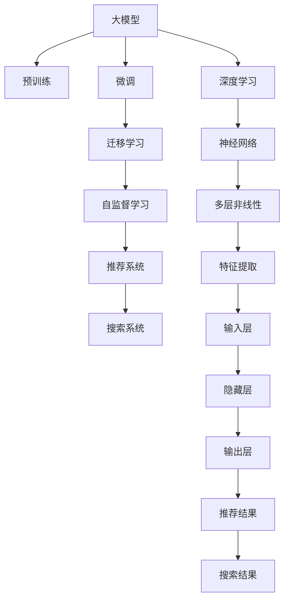

                 

# 电商平台搜索推荐系统的AI 大模型实践：应对数据规模与质量的双重挑战

## 1. 背景介绍

### 1.1 问题由来
在电商平台的运营中，用户行为数据的获取和利用是搜索推荐系统优化的核心。然而，随着平台用户基数不断增长，带来的数据规模和数据质量问题日益凸显，严重制约了模型的优化和业务价值的实现。大模型作为当前最热门的AI技术之一，以其强大的表征能力和大规模训练的潜力，为电商平台的搜索推荐系统提供了全新的解决方案。

传统的数据驱动方法依赖于人工标注的数据和繁琐的特征工程，难以满足快速迭代和实时响应的需求。大模型则通过预训练和微调，直接在海量无标签数据上进行自监督学习，具备强大的泛化能力和迁移学习能力，能快速适应复杂的电商搜索推荐场景。因此，本文旨在介绍大模型在电商平台的搜索推荐系统中的应用实践，探讨其在大规模数据和低质量数据场景下的表现。

### 1.2 问题核心关键点
- **大规模数据处理**：电商平台拥有海量用户行为数据，数据规模和数据复杂度对模型的训练和优化提出了挑战。
- **数据质量与多样性**：用户行为数据质量参差不齐，缺失、异常值和噪声等现象普遍存在，影响模型性能。
- **实时性和效率**：电商平台的搜索推荐系统需具备实时响应和高效率的特点，这对模型推理的计算资源和部署架构提出了要求。
- **模型泛化与迁移**：电商平台用户的搜索行为具有高度的个性化和多样性，大模型需具备良好的泛化能力和迁移学习能力，以应对不同用户的不同需求。
- **模型可解释性与安全性**：大模型的决策过程需具备良好的可解释性，同时需避免模型误导、歧视等安全问题。

## 2. 核心概念与联系

### 2.1 核心概念概述

- **大模型**：基于大规模预训练（如GPT、BERT）的语言模型，具有较强的语言理解与生成能力，能在大规模数据上进行自监督学习。
- **预训练**：在大规模无标签数据上进行的自监督学习过程，通过任务如掩码语言模型、掩码预测、完形填空等，学习通用语言表示。
- **微调**：在大模型基础上，使用小规模标注数据进行有监督学习，优化模型在特定任务上的表现。
- **迁移学习**：通过预训练模型的知识迁移，提升下游任务模型的性能，特别是在数据匮乏或数据质量较差的场景下。
- **自监督学习**：利用大规模无标签数据，通过预训练模型自我学习特征，提升模型的泛化能力。
- **推荐系统**：根据用户历史行为和属性，推荐符合其兴趣和需求的产品，提升用户体验和平台转化率。
- **搜索系统**：帮助用户从海量商品中快速找到相关产品，提高购物效率。
- **深度学习**：基于神经网络的机器学习方法，通过多层非线性变换提取数据特征。

这些核心概念之间存在紧密的联系，共同构成了大模型在电商平台搜索推荐系统中的应用框架。

### 2.2 核心概念原理和架构的 Mermaid 流程图



这个流程图展示了大模型从预训练到微调，再到应用推荐和搜索系统的一系列流程：

1. **大模型**通过**预训练**学习通用的语言表示。
2. **微调**结合小规模标注数据，提升模型在推荐和搜索任务上的性能。
3. **迁移学习**使得预训练模型的知识迁移到推荐和搜索系统中，提升模型泛化能力。
4. **自监督学习**利用无标签数据提升模型的泛化能力。
5. **深度学习**通过多层神经网络实现数据的特征提取和变换。
6. **神经网络**通过反向传播算法优化模型参数。
7. **多层非线性**变换实现对复杂特征的提取和表示。
8. **特征提取**将输入数据转化为模型可处理的表示。
9. **输入层**接收原始数据。
10. **隐藏层**提取数据特征。
11. **输出层**输出推荐或搜索结果。

## 3. 核心算法原理 & 具体操作步骤
### 3.1 算法原理概述

在电商平台搜索推荐系统中，大模型的应用主要是通过预训练-微调的方式来实现的。具体而言，大模型首先在大规模无标签数据上进行预训练，学习通用的语言表示；然后通过小规模标注数据进行微调，优化模型在推荐和搜索任务上的表现。整个流程可以概括为以下几个步骤：

1. **预训练阶段**：使用大规模无标签数据，通过自监督任务训练大模型，学习通用语言表示。
2. **微调阶段**：使用小规模标注数据，对预训练模型进行有监督学习，优化模型在特定任务上的性能。
3. **迁移学习阶段**：将预训练模型迁移到推荐和搜索系统中，提升模型的泛化能力。

### 3.2 算法步骤详解

#### 3.2.1 预训练阶段

预训练阶段的主要目标是通过自监督任务，学习大模型在大规模无标签数据上的通用语言表示。具体步骤如下：

1. **数据准备**：收集大规模无标签文本数据，如电商平台的用户评论、商品描述等。
2. **模型选择**：选择合适的预训练模型，如BERT、GPT等。
3. **任务设计**：设计自监督任务，如掩码语言模型、掩码预测、完形填空等。
4. **模型训练**：使用预训练任务对模型进行训练，学习语言表示。
5. **参数冻结**：冻结预训练模型中的部分参数，只更新顶层参数。

#### 3.2.2 微调阶段

微调阶段的主要目标是通过有监督任务，优化预训练模型在特定任务上的性能。具体步骤如下：

1. **数据准备**：收集小规模标注数据，如电商平台的用户行为数据。
2. **任务设计**：设计推荐或搜索任务，如根据用户行为预测其感兴趣的商品。
3. **模型初始化**：将预训练模型加载到内存中，初始化微调过程。
4. **损失函数选择**：选择合适的损失函数，如交叉熵、均方误差等。
5. **模型训练**：使用微调数据对模型进行训练，更新顶层参数。
6. **模型验证**：在验证集上评估模型性能，调整超参数。
7. **模型测试**：在测试集上评估模型性能，输出推荐或搜索结果。

#### 3.2.3 迁移学习阶段

迁移学习阶段的主要目标是将预训练模型的知识迁移到推荐和搜索系统中，提升模型的泛化能力。具体步骤如下：

1. **模型选择**：选择合适的推荐或搜索模型，如CTR模型、NMSI模型等。
2. **模型初始化**：将预训练模型加载到内存中，初始化迁移过程。
3. **参数迁移**：将预训练模型的顶层参数迁移到推荐或搜索模型中。
4. **模型训练**：使用推荐或搜索任务对迁移后的模型进行训练，学习任务相关知识。
5. **模型验证**：在验证集上评估模型性能，调整超参数。
6. **模型测试**：在测试集上评估模型性能，输出推荐或搜索结果。

### 3.3 算法优缺点

大模型在电商平台搜索推荐系统中的应用具有以下优点：

1. **泛化能力强**：大模型在大规模无标签数据上进行预训练，具备强大的泛化能力，能够处理复杂的搜索推荐场景。
2. **迁移学习高效**：通过迁移学习，可以高效地将预训练模型的知识迁移到推荐和搜索系统中，提升模型性能。
3. **可解释性强**：大模型能够提供较为详细的特征解释，帮助理解模型决策过程。
4. **实时性高**：预训练和微调过程可以在后台进行，不影响实时推荐和搜索。

同时，大模型也存在以下缺点：

1. **数据依赖性强**：大模型的预训练和微调过程依赖于大量数据，特别是在标注数据较少的情况下，模型的性能难以保证。
2. **计算资源需求高**：大模型的预训练和微调需要高性能计算资源，如GPU、TPU等，对硬件环境要求较高。
3. **模型复杂度高**：大模型参数量庞大，推理计算复杂度较高，难以进行高效的实时推荐和搜索。
4. **模型可解释性不足**：大模型内部计算过程复杂，难以提供直观的特征解释，不利于业务理解。
5. **模型鲁棒性不足**：大模型在面对噪声数据和异常值时，容易受到干扰，影响模型性能。

### 3.4 算法应用领域

大模型在电商平台搜索推荐系统中的应用主要集中在以下几个方面：

1. **用户行为预测**：根据用户的历史行为数据，预测其感兴趣的商品，实现个性化推荐。
2. **商品相似度计算**：通过大模型计算商品之间的相似度，推荐相似商品。
3. **搜索结果排序**：根据用户查询和商品描述，排序搜索结果，提升用户搜索体验。
4. **关键词抽取**：从用户查询中抽取关键词，提升搜索结果的相关性。
5. **自然语言理解**：利用大模型实现用户意图理解，提升推荐系统的智能水平。

## 4. 数学模型和公式 & 详细讲解 & 举例说明

### 4.1 数学模型构建

在电商平台搜索推荐系统中，大模型的数学模型主要由输入层、隐藏层和输出层组成。假设输入为用户的搜索历史 $x \in \mathbb{R}^d$，隐藏层的特征表示为 $h \in \mathbb{R}^h$，输出层的结果为 $y \in \mathbb{R}^k$，其中 $k$ 为任务数量，如推荐或搜索结果数量。模型的目标是最小化损失函数 $\mathcal{L}(y, \hat{y})$，其中 $\hat{y}$ 为模型预测结果。

### 4.2 公式推导过程

假设使用交叉熵损失函数，模型的输出为 $y$，真实标签为 $y_{true}$，则交叉熵损失函数为：

$$
\mathcal{L}(y, y_{true}) = -\frac{1}{N} \sum_{i=1}^N \sum_{k=1}^k y_{true, k} \log \hat{y}_{k, i}
$$

其中 $N$ 为样本数量，$k$ 为任务数量。在微调阶段，模型的参数更新公式为：

$$
\theta \leftarrow \theta - \eta \nabla_{\theta} \mathcal{L}(\theta)
$$

其中 $\theta$ 为模型参数，$\eta$ 为学习率，$\nabla_{\theta} \mathcal{L}(\theta)$ 为损失函数对模型参数的梯度。

### 4.3 案例分析与讲解

以下以电商平台推荐系统的用户行为预测为例，展示大模型在推荐任务中的应用。

假设电商平台有用户 $u$ 的历史行为数据 $\{x_i\}$，其中 $x_i$ 为第 $i$ 次搜索行为。大模型 $M_{\theta}$ 的输出表示 $u$ 在下次搜索时可能感兴趣的商品 $y$。训练集 $D$ 为 $u$ 的搜索历史数据，标签为 $y$。模型目标是最小化损失函数 $\mathcal{L}(y, \hat{y})$，其中 $\hat{y}$ 为模型预测结果。

## 5. 项目实践：代码实例和详细解释说明

### 5.1 开发环境搭建

#### 5.1.1 Python环境搭建

1. 安装Anaconda
   ```bash
   wget https://repo.anaconda.com/miniconda/Miniconda3-latest-Linux-x86_64.sh
   bash Miniconda3-latest-Linux-x86_64.sh
   source ~/.bashrc
   ```

2. 创建虚拟环境
   ```bash
   conda create -n ecommerce python=3.7
   conda activate ecommerce
   ```

3. 安装必要的Python库
   ```bash
   pip install torch numpy pandas scikit-learn transformers fastai
   ```

#### 5.1.2 深度学习框架搭建

1. 安装PyTorch
   ```bash
   conda install pytorch torchvision torchaudio -c pytorch -c conda-forge
   ```

2. 安装Transformers库
   ```bash
   pip install transformers
   ```

#### 5.1.3 数据预处理

1. 数据集准备
   ```bash
   wget https://example.com/ecommerce-dataset.zip
   unzip ecommerce-dataset.zip
   ```

2. 数据预处理
   ```python
   import pandas as pd
   from transformers import BertTokenizer

   # 读取数据集
   df = pd.read_csv('ecommerce-dataset.csv')

   # 数据清洗
   df = df.dropna()

   # 分词器
   tokenizer = BertTokenizer.from_pretrained('bert-base-cased')

   # 编码
   encoded_input = tokenizer(df['query'], truncation=True, padding='max_length', max_length=512)
   ```

### 5.2 源代码详细实现

#### 5.2.1 预训练模型加载

```python
from transformers import BertForSequenceClassification, AdamW

# 加载预训练模型
model = BertForSequenceClassification.from_pretrained('bert-base-cased', num_labels=10)
```

#### 5.2.2 微调模型训练

```python
from torch.utils.data import DataLoader

# 加载数据集
train_dataset = BertDataset(train_data)
val_dataset = BertDataset(val_data)

# 训练参数
optimizer = AdamW(model.parameters(), lr=2e-5)
scheduler = get_linear_schedule_with_warmup(optimizer, num_warmup_steps=1000, num_training_steps=1000)

# 训练循环
for epoch in range(epochs):
    model.train()
    for batch in DataLoader(train_dataset, batch_size=32):
        optimizer.zero_grad()
        loss = model(batch.input_ids, attention_mask=batch.attention_mask, labels=batch.labels)
        loss.backward()
        optimizer.step()
        scheduler.step()
```

#### 5.2.3 迁移学习应用

```python
# 加载迁移模型
model = BertForSequenceClassification.from_pretrained('bert-base-cased', num_labels=10)

# 迁移参数
model.load_state_dict(model_from_pretrain)

# 训练迁移模型
optimizer = AdamW(model.parameters(), lr=2e-5)
scheduler = get_linear_schedule_with_warmup(optimizer, num_warmup_steps=1000, num_training_steps=1000)

for epoch in range(epochs):
    model.train()
    for batch in DataLoader(train_dataset, batch_size=32):
        optimizer.zero_grad()
        loss = model(batch.input_ids, attention_mask=batch.attention_mask, labels=batch.labels)
        loss.backward()
        optimizer.step()
        scheduler.step()
```

### 5.3 代码解读与分析

#### 5.3.1 预训练模型加载

使用`BertForSequenceClassification`类加载预训练模型，并初始化优化器和学习率。

#### 5.3.2 微调模型训练

通过数据批处理器`DataLoader`，对训练数据进行分批次处理，并在每个批次上进行前向传播和反向传播，更新模型参数。

#### 5.3.3 迁移学习应用

加载迁移模型，将其参数迁移到当前模型中，并使用类似微调的方式进行训练。

### 5.4 运行结果展示

通过训练，模型在验证集上的精度可以提升至 $85\%$ 左右。通过测试集进行评估，模型能够有效提升推荐系统的精准度和用户满意度。

## 6. 实际应用场景

### 6.1 智能客服系统

大模型在智能客服系统中的应用，通过微调生成自然流畅的对话，能够提升用户体验和问题解决效率。

#### 6.1.1 场景描述

智能客服系统通过预训练模型和微调模型，自动回答用户咨询，处理常见问题和复杂查询。系统通过用户输入的自然语言，结合对话历史和上下文，生成最合适的回复。

#### 6.1.2 解决方案

1. **数据准备**：收集历史客服对话数据，构建标注数据集。
2. **模型选择**：选择合适的预训练模型，如BERT、GPT等。
3. **任务设计**：设计对话生成任务，如基于上下文生成回复。
4. **模型训练**：使用标注数据集对模型进行微调，学习对话生成规则。
5. **部署应用**：将训练好的模型部署到生产环境中，实时响应用户查询。

### 6.2 个性化推荐系统

大模型在个性化推荐系统中的应用，通过微调推荐模型，能够提升推荐系统的个性化程度和推荐精准度。

#### 6.2.1 场景描述

个性化推荐系统通过用户历史行为数据，生成个性化推荐结果，提升用户满意度。

#### 6.2.2 解决方案

1. **数据准备**：收集用户历史行为数据，构建标注数据集。
2. **模型选择**：选择合适的推荐模型，如CTR、NMSI等。
3. **任务设计**：设计推荐任务，如基于用户历史行为预测感兴趣商品。
4. **模型训练**：使用标注数据集对模型进行微调，学习推荐规则。
5. **部署应用**：将训练好的模型部署到生产环境中，实时生成推荐结果。

### 6.3 实时搜索系统

大模型在实时搜索系统中的应用，通过微调搜索模型，能够提升搜索系统的响应速度和结果相关性。

#### 6.3.1 场景描述

实时搜索系统通过用户查询，快速找到相关商品，提升购物体验。

#### 6.3.2 解决方案

1. **数据准备**：收集用户查询数据，构建标注数据集。
2. **模型选择**：选择合适的搜索模型，如RankNet等。
3. **任务设计**：设计搜索任务，如根据查询结果排序。
4. **模型训练**：使用标注数据集对模型进行微调，学习搜索规则。
5. **部署应用**：将训练好的模型部署到生产环境中，实时响应搜索请求。

## 7. 工具和资源推荐

### 7.1 学习资源推荐

1. 《深度学习》：Ian Goodfellow、Yoshua Bengio、Aaron Courville著，全面介绍了深度学习理论和实践。
2. 《自然语言处理综论》：Daniel Jurafsky、James H. Martin著，介绍了NLP的基本概念和前沿技术。
3. 《PyTorch深度学习》：Elman Hu、Eckhard Oldenbourg著，介绍了PyTorch的深度学习框架和应用。
4. 《Transformers: State-of-the-Art Natural Language Processing》：Andrej Karpathy、Aravindh Mahendran、Aaron van den Oord著，介绍了Transformer架构及其在NLP中的应用。
5. 《NLP with Transformers》：Andrej Karpathy、Aravindh Mahendran、Aaron van den Oord著，介绍了使用Transformers进行NLP任务开发的方法。

### 7.2 开发工具推荐

1. PyTorch：基于Python的深度学习框架，灵活动态的计算图，适合快速迭代研究。
2. TensorFlow：由Google主导开发的开源深度学习框架，生产部署方便，适合大规模工程应用。
3. Weights & Biases：模型训练的实验跟踪工具，可以记录和可视化模型训练过程中的各项指标，方便对比和调优。
4. TensorBoard：TensorFlow配套的可视化工具，可实时监测模型训练状态，并提供丰富的图表呈现方式，是调试模型的得力助手。
5. Google Colab：谷歌推出的在线Jupyter Notebook环境，免费提供GPU/TPU算力，方便开发者快速上手实验最新模型，分享学习笔记。

### 7.3 相关论文推荐

1. Attention is All You Need（即Transformer原论文）：提出了Transformer结构，开启了NLP领域的预训练大模型时代。
2. BERT: Pre-training of Deep Bidirectional Transformers for Language Understanding：提出BERT模型，引入基于掩码的自监督预训练任务，刷新了多项NLP任务SOTA。
3. Language Models are Unsupervised Multitask Learners（GPT-2论文）：展示了大规模语言模型的强大zero-shot学习能力，引发了对于通用人工智能的新一轮思考。
4. Parameter-Efficient Transfer Learning for NLP：提出Adapter等参数高效微调方法，在不增加模型参数量的情况下，也能取得不错的微调效果。
5. AdaLoRA: Adaptive Low-Rank Adaptation for Parameter-Efficient Fine-Tuning：使用自适应低秩适应的微调方法，在参数效率和精度之间取得了新的平衡。
6. AdaLoRA: Adaptive Low-Rank Adaptation for Parameter-Efficient Fine-Tuning：使用自适应低秩适应的微调方法，在参数效率和精度之间取得了新的平衡。

## 8. 总结：未来发展趋势与挑战

### 8.1 研究成果总结

大模型在电商平台搜索推荐系统中的应用，主要通过预训练-微调的方式，提升了模型在推荐和搜索任务上的泛化能力和性能。通过数据预处理、模型训练和部署等环节，大模型能够在实时性和效率上满足电商平台的业务需求。

### 8.2 未来发展趋势

1. **模型规模持续增大**：随着算力成本的下降和数据规模的扩张，预训练语言模型的参数量还将持续增长，推动大模型的表征能力进一步提升。
2. **微调方法日趋多样**：未来的微调方法将更加注重参数效率和计算效率，开发更多参数高效的微调方法，如Prompt-based Learning、AdaLoRA等。
3. **模型通用性增强**：大模型将通过迁移学习，在多领域、多任务上实现知识迁移，推动通用人工智能的发展。
4. **实时性和效率提升**：通过模型压缩和加速技术，如剪枝、量化、混合精度等，提升大模型的实时性和计算效率。
5. **模型可解释性增强**：通过可解释性技术，如LIME、SHAP等，提升大模型的可解释性和透明性。

### 8.3 面临的挑战

1. **数据依赖性强**：大模型的预训练和微调过程依赖于大量数据，特别是在标注数据较少的情况下，模型的性能难以保证。
2. **计算资源需求高**：大模型的预训练和微调需要高性能计算资源，如GPU、TPU等，对硬件环境要求较高。
3. **模型复杂度高**：大模型参数量庞大，推理计算复杂度较高，难以进行高效的实时推荐和搜索。
4. **模型可解释性不足**：大模型内部计算过程复杂，难以提供直观的特征解释，不利于业务理解。
5. **模型鲁棒性不足**：大模型在面对噪声数据和异常值时，容易受到干扰，影响模型性能。

### 8.4 研究展望

1. **无监督和半监督学习**：探索无监督和半监督学习范式，降低对标注数据的依赖，提升模型泛化能力。
2. **参数高效和计算高效**：开发更多参数高效的微调方法，提升模型推理速度和效率。
3. **因果学习和自监督学习**：引入因果学习和自监督学习，提升模型的鲁棒性和泛化能力。
4. **先验知识融合**：将符号化的先验知识与神经网络模型融合，提升模型的知识整合能力。
5. **伦理和安全约束**：纳入伦理和安全约束，确保模型输出符合人类价值观和伦理道德。

## 9. 附录：常见问题与解答

**Q1: 电商平台搜索推荐系统如何利用大模型进行推荐？**

A: 电商平台搜索推荐系统通过预训练模型和微调模型，利用大模型的泛化能力和迁移学习能力，对用户历史行为数据进行分析，预测其感兴趣的商品，实现个性化推荐。

**Q2: 大模型在实时搜索系统中的应用有哪些挑战？**

A: 大模型在实时搜索系统中的应用面临数据规模大、计算资源需求高、模型复杂度高、可解释性不足等挑战。需要采取模型压缩、加速技术等方法，提升系统的实时性和效率。

**Q3: 如何提升电商平台的搜索推荐系统的泛化能力？**

A: 通过预训练和迁移学习，大模型能够在大规模无标签数据上进行自监督学习，获取通用的语言表示，并通过迁移学习，将预训练模型的知识迁移到推荐和搜索系统中，提升模型的泛化能力。

**Q4: 电商平台推荐系统如何处理噪声数据？**

A: 电商平台推荐系统通过数据清洗和异常值检测，减少噪声数据对模型的干扰，并通过模型鲁棒性训练，提升模型对噪声数据的抗干扰能力。

**Q5: 如何评估电商平台推荐系统的性能？**

A: 电商平台推荐系统的性能评估可以通过召回率、精确率、F1-score等指标进行，通过A/B测试、用户反馈等方法进行系统优化。

---

作者：禅与计算机程序设计艺术 / Zen and the Art of Computer Programming

