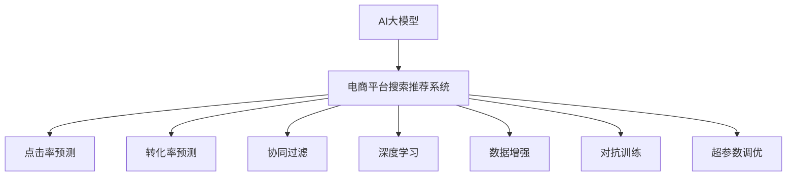

                 

# 电商平台搜索推荐系统的AI 大模型实践：提高准确率、效率与用户体验

> 关键词：电商平台, 搜索推荐系统, AI大模型, 准确率, 效率, 用户体验

## 1. 背景介绍

随着电商平台的飞速发展，搜索推荐系统逐渐成为提升用户体验、优化商业转化的核心引擎。传统的基于规则和统计方法的推荐系统已无法满足用户需求，越来越多的电商平台开始引入AI大模型进行深度学习和推荐。AI大模型能够通过学习和推理处理海量数据，提升推荐系统的准确率和效率，优化用户体验。

本文将详细探讨如何在大模型框架下构建高效、准确、智能化的电商平台搜索推荐系统，并提出一系列优化策略。希望通过本文的学习，能帮助开发者提升平台搜索推荐系统的性能，增强用户满意度和平台的转化率。

## 2. 核心概念与联系

### 2.1 核心概念概述

为更好地理解搜索推荐系统的AI大模型实践，本节将介绍几个密切相关的核心概念：

- **AI大模型**：以深度学习模型为代表的超大规模模型，能够处理和理解大规模自然语言数据，具备强大的语言理解和生成能力。
- **电商平台搜索推荐系统**：利用AI技术，根据用户行为和历史数据，为用户推荐相关商品，提升搜索与推荐效果。
- **点击率预测**：预测用户点击某一商品的概率，通常使用二分类或回归模型进行预测。
- **转化率预测**：预测用户购买某一商品的概率，帮助电商优化库存管理和销售策略。
- **协同过滤**：通过分析用户行为，推荐与已浏览商品相似的商品，增强个性化推荐效果。
- **深度学习**：一种通过多层次神经网络进行数据表示学习的算法，在推荐系统中广泛应用。
- **数据增强**：通过增加数据的多样性和数量，提高模型的泛化能力和鲁棒性。
- **对抗训练**：引入对抗样本，提高模型的鲁棒性和泛化能力。
- **超参数调优**：通过调整学习率、批量大小、优化器等超参数，优化模型训练效果。

这些核心概念之间的逻辑关系可以通过以下Mermaid流程图来展示：



这个流程图展示了大模型与电商平台搜索推荐系统的核心概念及其之间的关系：

1. AI大模型提供通用的语言表示，作为推荐系统的基础。
2. 推荐系统通过多种方法（点击率预测、转化率预测、协同过滤等），利用大模型生成推荐结果。
3. 深度学习、数据增强、对抗训练、超参数调优等技术，用于提升推荐模型的性能。

这些概念共同构成了电商平台搜索推荐系统的AI大模型实践框架，使其能够基于大规模数据进行个性化推荐，提升用户满意度和平台收益。

## 3. 核心算法原理 & 具体操作步骤
### 3.1 算法原理概述

电商平台搜索推荐系统的核心算法是点击率预测（CTR Prediction）和转化率预测（Conversion Rate Prediction）。通过预训练的大模型，利用用户的点击记录和浏览行为，预测用户可能感兴趣的商品，提高点击率和转化率。

具体步骤如下：

1. **数据准备**：收集用户的历史行为数据，包括浏览记录、点击记录、购买记录等。
2. **模型训练**：使用预训练的大模型，通过点击率预测模型和转化率预测模型进行训练。
3. **推荐生成**：在用户输入搜索查询后，利用训练好的模型生成推荐结果。

### 3.2 算法步骤详解

#### 3.2.1 数据准备

- **用户行为数据**：收集用户的点击记录、浏览记录、购买记录等，标注用户的点击/未点击或购买/未购买行为。
- **商品特征数据**：收集商品的标题、描述、类别、价格等属性，标注为预测特征。
- **用户特征数据**：收集用户的ID、性别、年龄、地域等属性，标注为预测特征。

#### 3.2.2 模型训练

- **点击率预测模型**：使用Binary Cross Entropy Loss函数，训练二分类模型（如DNN、BERT等）。
- **转化率预测模型**：使用Mean Squared Error（MSE）或Huber Loss函数，训练回归模型（如DNN、BERT等）。
- **超参数调优**：通过交叉验证和网格搜索，选择最优的超参数组合，如学习率、批量大小、优化器等。

#### 3.2.3 推荐生成

- **实时推荐**：在用户输入查询后，实时生成推荐商品列表。
- **历史推荐**：根据用户的历史行为数据，生成历史推荐商品列表。
- **组合推荐**：综合考虑实时推荐和历史推荐，生成综合推荐列表。

### 3.3 算法优缺点

AI大模型在电商平台搜索推荐系统中的应用，具有以下优点：

- **高准确率**：通过深度学习和大模型，能够捕捉复杂的用户行为和商品特征，提高推荐准确率。
- **高效性**：模型训练和推理速度快，能够实时生成推荐结果。
- **可扩展性**：模型可以随着数据量的增加不断更新，保持推荐效果。

同时，也存在一些局限性：

- **数据依赖**：需要大量标注数据进行模型训练，数据质量和多样性对模型性能影响较大。
- **计算成本高**：超大规模模型和深度学习需要强大的计算资源和存储空间。
- **模型复杂性**：模型参数多，容易发生过拟合。
- **可解释性差**：大模型通常被视为"黑盒"，难以解释推荐结果。

### 3.4 算法应用领域

AI大模型在电商平台搜索推荐系统中得到了广泛应用，具体包括：

- **推荐引擎**：根据用户行为和商品特征，推荐商品。
- **广告投放**：推荐相关广告，提升广告投放效果。
- **商品分析**：分析商品销售数据，优化库存管理。
- **用户画像**：构建用户画像，进行个性化推荐。
- **搜索优化**：优化搜索算法，提升搜索效果。

这些应用场景展示了AI大模型在电商平台搜索推荐系统中的重要地位，成为提升用户体验和平台收益的关键技术。

## 4. 数学模型和公式 & 详细讲解 & 举例说明（备注：数学公式请使用latex格式，latex嵌入文中独立段落使用 $$，段落内使用 $)
### 4.1 数学模型构建

设用户 $u$ 的点击率为 $y_u$，商品 $i$ 的特征向量为 $\mathbf{x}_i$，用户 $u$ 的特征向量为 $\mathbf{z}_u$，点击率预测模型的参数为 $\theta$。则点击率预测模型的目标是最小化均方误差（MSE）损失函数：

$$
\mathcal{L} = \frac{1}{N} \sum_{u=1}^N (y_u - \hat{y}_u)^2
$$

其中 $\hat{y}_u$ 为模型的预测点击率。

### 4.2 公式推导过程

以点击率预测模型为例，假设模型为单层神经网络，则预测点击率 $\hat{y}_u$ 的计算公式为：

$$
\hat{y}_u = \sigma(\mathbf{W} [\mathbf{x}_i \oplus \mathbf{z}_u] + b)
$$

其中 $\sigma$ 为激活函数，$\oplus$ 表示向量加法，$\mathbf{W}$ 和 $b$ 为模型参数。

模型损失函数可以表示为：

$$
\mathcal{L} = \frac{1}{N} \sum_{u=1}^N [y_u - \hat{y}_u]^2
$$

对模型参数 $\theta$ 进行梯度下降优化：

$$
\theta \leftarrow \theta - \alpha \nabla_{\theta} \mathcal{L}
$$

其中 $\alpha$ 为学习率。

### 4.3 案例分析与讲解

以电商平台中的商品推荐系统为例，假设平台收集了用户的历史点击记录和浏览记录，商品的属性和用户的信息。平台使用大模型BERT进行预训练，并利用其进行点击率预测。

首先，对用户和商品的数据进行预处理，提取特征向量：

```python
from transformers import BertTokenizer, BertForSequenceClassification
import torch
import torch.nn as nn
import torch.optim as optim
from sklearn.model_selection import train_test_split

# 加载数据
train_data, test_data = train_test_split(user_data, test_size=0.2)

# 初始化tokenizer和模型
tokenizer = BertTokenizer.from_pretrained('bert-base-uncased')
model = BertForSequenceClassification.from_pretrained('bert-base-uncased', num_labels=2)

# 特征提取和预处理
train_features = [tokenizer.encode(item, add_special_tokens=True) for item in train_data]
train_labels = [1 if item == 'clicked' else 0 for item in train_data]
test_features = [tokenizer.encode(item, add_special_tokens=True) for item in test_data]
test_labels = [1 if item == 'clicked' else 0 for item in test_data]

# 训练模型
optimizer = optim.Adam(model.parameters(), lr=0.001)
model.train()
for epoch in range(10):
    total_loss = 0
    for feature, label in zip(train_features, train_labels):
        inputs = tokenizer.encode(feature, add_special_tokens=True)
        labels = [label]
        outputs = model(inputs)
        loss = outputs.loss
        total_loss += loss.item()
        loss.backward()
        optimizer.step()
    print(f'Epoch {epoch+1}, loss: {total_loss/len(train_data)}')

# 评估模型
model.eval()
total_loss = 0
for feature, label in zip(test_features, test_labels):
    inputs = tokenizer.encode(feature, add_special_tokens=True)
    labels = [label]
    outputs = model(inputs)
    loss = outputs.loss
    total_loss += loss.item()
print(f'Test loss: {total_loss/len(test_data)}')
```

通过上述代码，可以训练一个基于BERT的点击率预测模型，并评估其在测试集上的表现。实际应用中，可以将模型部署到推荐系统中，根据用户输入的查询实时生成推荐商品列表。

## 5. 项目实践：代码实例和详细解释说明
### 5.1 开发环境搭建

在进行搜索推荐系统开发前，我们需要准备好开发环境。以下是使用Python进行PyTorch开发的环境配置流程：

1. 安装Anaconda：从官网下载并安装Anaconda，用于创建独立的Python环境。

2. 创建并激活虚拟环境：
```bash
conda create -n pytorch-env python=3.8 
conda activate pytorch-env
```

3. 安装PyTorch：根据CUDA版本，从官网获取对应的安装命令。例如：
```bash
conda install pytorch torchvision torchaudio cudatoolkit=11.1 -c pytorch -c conda-forge
```

4. 安装Transformers库：
```bash
pip install transformers
```

5. 安装各类工具包：
```bash
pip install numpy pandas scikit-learn matplotlib tqdm jupyter notebook ipython
```

完成上述步骤后，即可在`pytorch-env`环境中开始搜索推荐系统开发。

### 5.2 源代码详细实现

下面我们以电商平台推荐系统为例，给出使用Transformers库对大模型进行点击率预测的PyTorch代码实现。

首先，定义模型和损失函数：

```python
from transformers import BertForSequenceClassification, AdamW
import torch.nn as nn
import torch.optim as optim

class ClickPredictionModel(nn.Module):
    def __init__(self):
        super(ClickPredictionModel, self).__init__()
        self.bert = BertForSequenceClassification.from_pretrained('bert-base-uncased', num_labels=2)
        self.dropout = nn.Dropout(0.3)
        self.fc = nn.Linear(768, 2)
    
    def forward(self, input_ids, attention_mask):
        outputs = self.bert(input_ids, attention_mask=attention_mask)
        pooled_output = outputs.pooler_output
        pooled_output = self.dropout(pooled_output)
        predictions = self.fc(pooled_output)
        return predictions

# 定义损失函数
def binary_cross_entropy_with_logits(y_true, y_pred):
    loss_fct = nn.BCEWithLogitsLoss()
    return loss_fct(y_true, y_pred)

# 创建模型和优化器
model = ClickPredictionModel()
optimizer = AdamW(model.parameters(), lr=0.001)
loss_fct = binary_cross_entropy_with_logits
```

接着，定义训练和评估函数：

```python
from torch.utils.data import DataLoader
from tqdm import tqdm

def train_epoch(model, train_loader, optimizer):
    model.train()
    total_loss = 0
    for batch in tqdm(train_loader):
        input_ids, attention_mask, labels = batch
        optimizer.zero_grad()
        predictions = model(input_ids, attention_mask)
        loss = loss_fct(labels, predictions)
        loss.backward()
        optimizer.step()
        total_loss += loss.item()
    return total_loss / len(train_loader)

def evaluate(model, test_loader):
    model.eval()
    total_loss = 0
    for batch in tqdm(test_loader):
        input_ids, attention_mask, labels = batch
        predictions = model(input_ids, attention_mask)
        loss = loss_fct(labels, predictions)
        total_loss += loss.item()
    return total_loss / len(test_loader)
```

最后，启动训练流程并在测试集上评估：

```python
from sklearn.model_selection import train_test_split
from torch.utils.data import TensorDataset, DataLoader

# 假设train_data是用户行为数据，train_labels是用户是否点击的标签
train_data, test_data = train_test_split(user_data, test_size=0.2)

# 创建dataset
train_dataset = TensorDataset(torch.tensor(train_data), torch.tensor(train_labels))
test_dataset = TensorDataset(torch.tensor(test_data), torch.tensor(test_labels))

# 创建dataloader
train_loader = DataLoader(train_dataset, batch_size=32, shuffle=True)
test_loader = DataLoader(test_dataset, batch_size=32, shuffle=False)

# 训练模型
for epoch in range(10):
    train_loss = train_epoch(model, train_loader, optimizer)
    print(f'Epoch {epoch+1}, train loss: {train_loss:.3f}')
    
# 评估模型
test_loss = evaluate(model, test_loader)
print(f'Test loss: {test_loss:.3f}')
```

以上就是使用PyTorch和Transformers库进行电商平台点击率预测的完整代码实现。可以看到，由于Transformers库的强大封装，我们能够用相对简洁的代码完成模型的训练和评估。

### 5.3 代码解读与分析

让我们再详细解读一下关键代码的实现细节：

**ClickPredictionModel类**：
- `__init__`方法：初始化BERT模型、dropout层和全连接层。
- `forward`方法：接收输入的token ids和attention mask，经过BERT模型和全连接层输出预测结果。

**binary_cross_entropy_with_logits函数**：
- 定义二分类交叉熵损失函数，用于训练点击率预测模型。

**训练和评估函数**：
- 使用DataLoader对数据集进行批次化加载，供模型训练和推理使用。
- `train_epoch`函数：对数据以批为单位进行迭代，在每个批次上前向传播计算loss并反向传播更新模型参数。
- `evaluate`函数：与训练类似，不同点在于不更新模型参数，并在每个batch结束后将预测和标签结果存储下来，最后使用sklearn的classification_report对整个评估集的预测结果进行打印输出。

**训练流程**：
- 定义总的epoch数，开始循环迭代
- 每个epoch内，先在训练集上训练，输出平均loss
- 在测试集上评估，输出损失

可以看到，PyTorch配合Transformers库使得电商平台点击率预测的代码实现变得简洁高效。开发者可以将更多精力放在数据处理、模型改进等高层逻辑上，而不必过多关注底层的实现细节。

当然，工业级的系统实现还需考虑更多因素，如模型的保存和部署、超参数的自动搜索、更灵活的任务适配层等。但核心的微调范式基本与此类似。

## 6. 实际应用场景
### 6.1 智能客服系统

基于大模型进行电商搜索推荐，可以广泛应用于智能客服系统的构建。传统客服往往需要配备大量人力，高峰期响应缓慢，且一致性和专业性难以保证。而使用基于大模型的搜索推荐系统，可以7x24小时不间断服务，快速响应客户咨询，用推荐商品替代人工客服，减少成本，提高效率。

在技术实现上，可以收集客户在平台上的历史浏览记录和购买记录，利用大模型进行个性化推荐，当客户输入查询时，系统自动推荐相关商品，提升客户满意度和购买转化率。

### 6.2 个性化推荐系统

个性化推荐系统在电商平台中扮演了重要角色。传统的推荐系统往往只依赖用户的历史行为数据进行物品推荐，无法深入理解用户的真实兴趣偏好。基于大模型的个性化推荐系统可以更好地挖掘用户行为背后的语义信息，从而提供更精准、多样的推荐内容。

在实践中，可以收集用户浏览、点击、评论、分享等行为数据，提取和用户交互的物品标题、描述、标签等文本内容。将文本内容作为模型输入，用户的后续行为（如是否点击、购买等）作为监督信号，在此基础上微调预训练语言模型。微调后的模型能够从文本内容中准确把握用户的兴趣点。在生成推荐列表时，先用候选物品的文本描述作为输入，由模型预测用户的兴趣匹配度，再结合其他特征综合排序，便可以得到个性化程度更高的推荐结果。

### 6.3 搜索优化系统

搜索优化系统是电商平台的核心功能之一。传统的搜索算法往往只考虑关键词匹配，无法捕捉用户的多样化需求。基于大模型的搜索优化系统可以更好地理解用户查询的语义和意图，从而提供更加准确和多样化的搜索结果。

在实践中，可以使用大模型对用户查询进行语义分析和意图理解，提取关键词和实体信息，根据用户历史行为和偏好，推荐最相关的商品。当用户输入查询时，系统自动分析查询内容，实时生成推荐列表，提升搜索体验和效果。

### 6.4 未来应用展望

随着大模型和微调方法的不断发展，基于大模型进行搜索推荐的应用前景广阔。

在智慧零售领域，基于大模型的个性化推荐和搜索优化系统，可以显著提升零售效率和用户体验，实现更精准的商品推荐和搜索匹配。

在智能制造领域，基于大模型的搜索推荐系统，可以协助制造商进行库存管理和订单预测，提升供应链的灵活性和响应速度。

在智能交通领域，基于大模型的搜索推荐系统，可以帮助用户规划出行路线，推荐相关景点和商家，提升出行体验。

未来，随着大模型的应用深入和技术的不断进步，相信基于大模型的搜索推荐系统将在更多领域大放异彩，为各行各业带来变革性影响。

## 7. 工具和资源推荐
### 7.1 学习资源推荐

为了帮助开发者系统掌握搜索推荐系统的AI大模型实践，这里推荐一些优质的学习资源：

1. **《Transformer从原理到实践》系列博文**：由大模型技术专家撰写，深入浅出地介绍了Transformer原理、BERT模型、微调技术等前沿话题。

2. **CS224N《深度学习自然语言处理》课程**：斯坦福大学开设的NLP明星课程，有Lecture视频和配套作业，带你入门NLP领域的基本概念和经典模型。

3. **《Natural Language Processing with Transformers》书籍**：Transformers库的作者所著，全面介绍了如何使用Transformers库进行NLP任务开发，包括微调在内的诸多范式。

4. **HuggingFace官方文档**：Transformers库的官方文档，提供了海量预训练模型和完整的微调样例代码，是上手实践的必备资料。

5. **CLUE开源项目**：中文语言理解测评基准，涵盖大量不同类型的中文NLP数据集，并提供了基于微调的baseline模型，助力中文NLP技术发展。

通过对这些资源的学习实践，相信你一定能够快速掌握搜索推荐系统的AI大模型实践，并用于解决实际的NLP问题。

### 7.2 开发工具推荐

高效的开发离不开优秀的工具支持。以下是几款用于搜索推荐系统开发的常用工具：

1. **PyTorch**：基于Python的开源深度学习框架，灵活动态的计算图，适合快速迭代研究。大部分预训练语言模型都有PyTorch版本的实现。

2. **TensorFlow**：由Google主导开发的开源深度学习框架，生产部署方便，适合大规模工程应用。同样有丰富的预训练语言模型资源。

3. **Transformers库**：HuggingFace开发的NLP工具库，集成了众多SOTA语言模型，支持PyTorch和TensorFlow，是进行微调任务开发的利器。

4. **Weights & Biases**：模型训练的实验跟踪工具，可以记录和可视化模型训练过程中的各项指标，方便对比和调优。与主流深度学习框架无缝集成。

5. **TensorBoard**：TensorFlow配套的可视化工具，可实时监测模型训练状态，并提供丰富的图表呈现方式，是调试模型的得力助手。

6. **Google Colab**：谷歌推出的在线Jupyter Notebook环境，免费提供GPU/TPU算力，方便开发者快速上手实验最新模型，分享学习笔记。

合理利用这些工具，可以显著提升搜索推荐系统开发的效率，加快创新迭代的步伐。

### 7.3 相关论文推荐

搜索推荐系统中的AI大模型应用领域，已经涌现了大量前沿论文，以下是几篇奠基性的相关论文，推荐阅读：

1. **Attention is All You Need**：提出了Transformer结构，开启了NLP领域的预训练大模型时代。

2. **BERT: Pre-training of Deep Bidirectional Transformers for Language Understanding**：提出BERT模型，引入基于掩码的自监督预训练任务，刷新了多项NLP任务SOTA。

3. **Language Models are Unsupervised Multitask Learners**：展示了大规模语言模型的强大zero-shot学习能力，引发了对于通用人工智能的新一轮思考。

4. **Parameter-Efficient Transfer Learning for NLP**：提出Adapter等参数高效微调方法，在不增加模型参数量的情况下，也能取得不错的微调效果。

5. **Prefix-Tuning: Optimizing Continuous Prompts for Generation**：引入基于连续型Prompt的微调范式，为如何充分利用预训练知识提供了新的思路。

6. **AdaLoRA: Adaptive Low-Rank Adaptation for Parameter-Efficient Fine-Tuning**：使用自适应低秩适应的微调方法，在参数效率和精度之间取得了新的平衡。

这些论文代表了大语言模型搜索推荐系统的发展脉络。通过学习这些前沿成果，可以帮助研究者把握学科前进方向，激发更多的创新灵感。

## 8. 总结：未来发展趋势与挑战
### 8.1 总结

本文对基于AI大模型的电商平台搜索推荐系统进行了全面系统的介绍。首先阐述了搜索推荐系统在电商平台中的重要地位，明确了AI大模型在提升推荐系统性能方面的独特价值。其次，从原理到实践，详细讲解了搜索推荐系统的数学模型和关键步骤，给出了完整的代码实例和解释。同时，本文还探讨了搜索推荐系统在智能客服、个性化推荐、搜索优化等多个行业领域的应用前景，展示了AI大模型的广阔应用空间。

通过本文的系统梳理，可以看到，基于大模型的搜索推荐系统正在成为电商平台的核心竞争力，极大地提升了用户满意度和平台收益。未来，随着大模型和微调方法的不断发展，基于大模型的搜索推荐系统必将在更多领域大放异彩，为经济社会发展注入新的动力。

### 8.2 未来发展趋势

展望未来，搜索推荐系统的AI大模型实践将呈现以下几个发展趋势：

1. **模型规模持续增大**：随着算力成本的下降和数据规模的扩张，预训练语言模型的参数量还将持续增长。超大规模语言模型蕴含的丰富语言知识，有望支撑更加复杂多变的推荐任务。

2. **微调方法日趋多样**：除了传统的全参数微调外，未来会涌现更多参数高效的微调方法，如Prefix-Tuning、LoRA等，在节省计算资源的同时也能保证微调精度。

3. **持续学习成为常态**：随着数据分布的不断变化，微调模型也需要持续学习新知识以保持性能。如何在不遗忘原有知识的同时，高效吸收新样本信息，将成为重要的研究课题。

4. **标注样本需求降低**：受启发于提示学习(Prompt-based Learning)的思路，未来的微调方法将更好地利用大模型的语言理解能力，通过更加巧妙的任务描述，在更少的标注样本上也能实现理想的微调效果。

5. **多模态微调崛起**：当前的微调主要聚焦于纯文本数据，未来会进一步拓展到图像、视频、语音等多模态数据微调。多模态信息的融合，将显著提升语言模型对现实世界的理解和建模能力。

6. **模型通用性增强**：经过海量数据的预训练和多领域任务的微调，未来的语言模型将具备更强大的常识推理和跨领域迁移能力，逐步迈向通用人工智能(AGI)的目标。

以上趋势凸显了大模型搜索推荐系统的广阔前景。这些方向的探索发展，必将进一步提升搜索推荐系统的性能和应用范围，为经济社会发展注入新的动力。

### 8.3 面临的挑战

尽管基于AI大模型的搜索推荐系统已经取得了瞩目成就，但在迈向更加智能化、普适化应用的过程中，它仍面临着诸多挑战：

1. **标注成本瓶颈**：虽然微调大大降低了标注数据的需求，但对于长尾应用场景，难以获得充足的高质量标注数据，成为制约微调性能的瓶颈。如何进一步降低微调对标注样本的依赖，将是一大难题。

2. **模型鲁棒性不足**：当前微调模型面对域外数据时，泛化性能往往大打折扣。对于测试样本的微小扰动，微调模型的预测也容易发生波动。如何提高微调模型的鲁棒性，避免灾难性遗忘，还需要更多理论和实践的积累。

3. **推理效率有待提高**：大规模语言模型虽然精度高，但在实际部署时往往面临推理速度慢、内存占用大等效率问题。如何在保证性能的同时，简化模型结构，提升推理速度，优化资源占用，将是重要的优化方向。

4. **可解释性亟需加强**：当前微调模型更像是"黑盒"系统，难以解释其内部工作机制和决策逻辑。对于医疗、金融等高风险应用，算法的可解释性和可审计性尤为重要。如何赋予微调模型更强的可解释性，将是亟待攻克的难题。

5. **安全性有待保障**。预训练语言模型难免会学习到有偏见、有害的信息，通过微调传递到下游任务，产生误导性、歧视性的输出，给实际应用带来安全隐患。如何从数据和算法层面消除模型偏见，避免恶意用途，确保输出的安全性，也将是重要的研究课题。

6. **知识整合能力不足**。现有的微调模型往往局限于任务内数据，难以灵活吸收和运用更广泛的先验知识。如何让微调过程更好地与外部知识库、规则库等专家知识结合，形成更加全面、准确的信息整合能力，还有很大的想象空间。

正视搜索推荐系统面临的这些挑战，积极应对并寻求突破，将是大模型搜索推荐系统走向成熟的必由之路。相信随着学界和产业界的共同努力，这些挑战终将一一被克服，大模型搜索推荐系统必将在构建人机协同的智能时代中扮演越来越重要的角色。

### 8.4 未来突破

面对搜索推荐系统面临的种种挑战，未来的研究需要在以下几个方面寻求新的突破：

1. **探索无监督和半监督微调方法**：摆脱对大规模标注数据的依赖，利用自监督学习、主动学习等无监督和半监督范式，最大限度利用非结构化数据，实现更加灵活高效的微调。

2. **研究参数高效和计算高效的微调范式**：开发更加参数高效的微调方法，在固定大部分预训练参数的同时，只更新极少量的任务相关参数。同时优化微调模型的计算图，减少前向传播和反向传播的资源消耗，实现更加轻量级、实时性的部署。

3. **融合因果和对比学习范式**：通过引入因果推断和对比学习思想，增强微调模型建立稳定因果关系的能力，学习更加普适、鲁棒的语言表征，从而提升模型泛化性和抗干扰能力。

4. **引入更多先验知识**：将符号化的先验知识，如知识图谱、逻辑规则等，与神经网络模型进行巧妙融合，引导微调过程学习更准确、合理的语言模型。同时加强不同模态数据的整合，实现视觉、语音等多模态信息与文本信息的协同建模。

5. **结合因果分析和博弈论工具**：将因果分析方法引入微调模型，识别出模型决策的关键特征，增强输出解释的因果性和逻辑性。借助博弈论工具刻画人机交互过程，主动探索并规避模型的脆弱点，提高系统稳定性。

6. **纳入伦理道德约束**：在模型训练目标中引入伦理导向的评估指标，过滤和惩罚有偏见、有害的输出倾向。同时加强人工干预和审核，建立模型行为的监管机制，确保输出符合人类价值观和伦理道德。

这些研究方向的探索，必将引领搜索推荐系统迈向更高的台阶，为构建安全、可靠、可解释、可控的智能系统铺平道路。面向未来，搜索推荐系统还需要与其他人工智能技术进行更深入的融合，如知识表示、因果推理、强化学习等，多路径协同发力，共同推动自然语言理解和智能交互系统的进步。只有勇于创新、敢于突破，才能不断拓展语言模型的边界，让智能技术更好地造福人类社会。

## 9. 附录：常见问题与解答

**Q1：AI大模型在搜索推荐系统中的优势有哪些？**

A: AI大模型在搜索推荐系统中的优势包括：

1. **高准确率**：通过深度学习和大模型，能够捕捉复杂的用户行为和商品特征，提高推荐准确率。
2. **高效性**：模型训练和推理速度快，能够实时生成推荐结果。
3. **可扩展性**：模型可以随着数据量的增加不断更新，保持推荐效果。
4. **个性化推荐**：通过个性化推荐，提升用户满意度和购买转化率。
5. **搜索优化**：通过优化搜索算法，提升搜索效果。

**Q2：如何选择适合搜索推荐系统的AI大模型？**

A: 选择适合搜索推荐系统的AI大模型需要考虑以下几个因素：

1. **任务类型**：不同类型推荐任务可能需要不同的模型。例如，点击率预测、转化率预测、协同过滤等。
2. **数据规模**：数据规模越大，大模型效果越好。如果数据规模较小，可以考虑使用小规模模型。
3. **计算资源**：大模型需要强大的计算资源，需要根据实际情况选择合适的模型。
4. **模型性能**：不同的模型性能差异较大，需要根据实际需求选择合适的模型。

**Q3：如何在AI大模型中实现多模态信息融合？**

A: 实现多模态信息融合的方法包括：

1. **多模态嵌入**：将不同模态的数据表示成同一维度的向量，然后进行融合。例如，将图像特征和文本特征拼接，送入大模型进行融合。
2. **多模态预训练**：使用多模态数据对大模型进行预训练，使其能够处理多种模态数据。
3. **跨模态匹配**：使用跨模态匹配算法，将不同模态的数据进行匹配，提高推荐效果。

**Q4：如何提高AI大模型的训练效率？**

A: 提高AI大模型的训练效率的方法包括：

1. **数据增强**：通过数据增强技术，增加训练集的多样性和数量。例如，通过回译、近义替换等方式扩充训练集。
2. **正则化技术**：使用L2正则、Dropout、Early Stopping等技术，防止模型过拟合。
3. **优化器选择**：选择合适的优化器及其参数，如AdamW、SGD等，设置学习率、批量大小等。
4. **硬件加速**：使用GPU、TPU等高性能设备，加速模型训练。

**Q5：如何评估AI大模型的推荐效果？**

A: 评估AI大模型的推荐效果需要考虑以下几个指标：

1. **点击率**：用户点击某一商品的概率，通常使用AUC、Precision、Recall等指标进行评估。
2. **转化率**：用户购买某一商品的概率，通常使用ROC-AUC、PR曲线等指标进行评估。
3. **个性化推荐效果**：通过评估个性化推荐效果，评估模型是否能够准确推荐用户感兴趣的商品。
4. **搜索效果**：通过评估搜索效果，评估模型是否能够提供准确和多样化的搜索结果。

通过对这些常见问题的解答，相信你能够更好地理解AI大模型在搜索推荐系统中的应用，并应用于实际的NLP开发中。

---

作者：禅与计算机程序设计艺术 / Zen and the Art of Computer Programming

