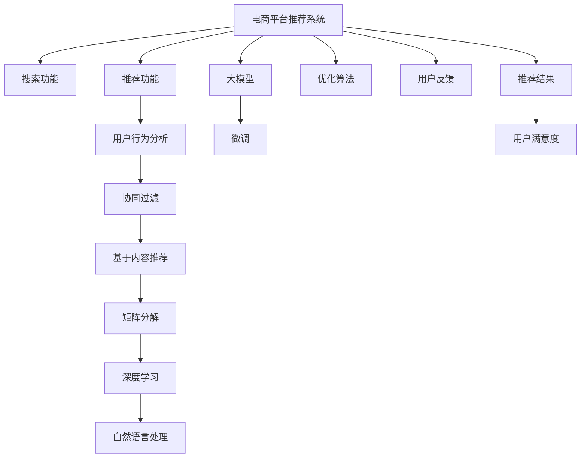

                 

# 电商平台搜索推荐系统的AI 大模型应用：提高系统性能、效率与用户体验

> 关键词：
1. 搜索推荐系统 (Search and Recommendation System)
2. 电商平台 (E-commerce Platform)
3. 大模型 (Large Model)
4. 自然语言处理 (Natural Language Processing, NLP)
5. 深度学习 (Deep Learning)
6. 用户行为分析 (User Behavior Analysis)
7. 推荐算法 (Recommendation Algorithm)

## 1. 背景介绍

### 1.1 问题由来

随着电商平台用户量的激增和数据量的爆炸式增长，传统基于规则或基于特征的推荐系统已难以满足个性化需求。这不仅影响了用户的购物体验，也导致了平台的流失率增加和业务收益受损。

为了应对这一挑战，各大电商平台纷纷引入人工智能技术，以机器学习为基础的推荐系统成为主要解决方案。然而，传统的基于小规模数据的机器学习模型，往往面临着样本稀疏性、特征工程复杂度高、冷启动问题等挑战，难以实现全面且准确的推荐。

大模型技术的崛起，为电商平台推荐系统带来了新的突破口。结合大模型强大的泛化能力和丰富的语义理解能力，可以显著提高推荐系统的性能和效率。特别是，近年来基于预训练大模型的微调技术，已在推荐领域显示出巨大潜力。

## 2. 核心概念与联系

### 2.1 核心概念概述

为更好地理解AI大模型在电商平台推荐系统中的应用，本节将介绍几个密切相关的核心概念：

- **电商平台搜索推荐系统**：结合搜索和推荐两个核心功能，为用户提供个性化商品展示和信息检索的电商平台应用。

- **大模型**：指预训练在大规模数据集上的大规模神经网络模型，如BERT、GPT等。通过自监督学习获得通用知识，具备强大的泛化能力和语义理解能力。

- **自然语言处理 (NLP)**：涉及计算机处理和理解人类语言的技术，包括分词、词向量表示、语义理解等。NLP技术在大模型推荐系统中起到了关键作用。

- **深度学习**：基于神经网络模型进行学习和预测的机器学习范式。深度学习模型具有强大的非线性表达能力和自适应学习能力，非常适合处理电商推荐系统的多维度、高复杂性数据。

- **用户行为分析**：通过分析用户在电商平台上的行为数据，如浏览、点击、购买等，来预测用户偏好和兴趣，为用户提供个性化推荐。

- **推荐算法**：如协同过滤、基于内容的推荐、矩阵分解等，用于计算用户与商品之间的相似度，从而推荐可能感兴趣的物品。

- **精度、效率、用户体验**：电商平台推荐系统成功的关键指标，即推荐结果的准确性、系统的运行效率以及用户的使用体验。

这些核心概念之间的逻辑关系可以通过以下Mermaid流程图来展示：



这个流程图展示了大语言模型的核心概念及其之间的关系：

1. 电商平台推荐系统包含搜索和推荐两个核心功能，结合用户行为分析。
2. 深度学习和自然语言处理技术是推荐系统的关键技术。
3. 协同过滤、基于内容推荐、矩阵分解等推荐算法在大模型微调的基础上，可以更好地处理电商数据。
4. 大模型通过微调进行进一步优化，从而提高推荐精度。
5. 优化算法如AdamW、SGD等用于模型的训练和调优。
6. 用户反馈可以进一步优化推荐算法，提升用户体验。

## 3. 核心算法原理 & 具体操作步骤
### 3.1 算法原理概述

基于大模型的电商平台推荐系统，本质上是一个通过预训练-微调进行个性化推荐的过程。其核心思想是：将大模型作为强大的“特征提取器”，通过微调学习电商用户的个性化特征，从而生成个性化的推荐结果。

形式化地，假设电商平台推荐系统包含一个预训练大模型 $M_{\theta}$，其中 $\theta$ 为预训练得到的模型参数。根据用户行为数据 $D=\{(x_i,y_i)\}_{i=1}^N$，其中 $x_i$ 为用户的历史行为数据，$y_i$ 为商品的标签（如价格、类别、评分等）。推荐系统的目标是最小化推荐损失函数 $\mathcal{L}$，即：

$$
\hat{\theta} = \mathop{\arg\min}_{\theta} \mathcal{L}(M_{\theta},D)
$$

常见的推荐损失函数包括均方误差损失、交叉熵损失等。微调过程中，通过梯度下降等优化算法更新模型参数 $\theta$，从而最小化损失函数 $\mathcal{L}$，生成个性化的推荐结果。

### 3.2 算法步骤详解

基于大模型的电商平台推荐系统，通常包括以下关键步骤：

**Step 1: 准备预训练模型和数据集**

- 选择合适的预训练语言模型 $M_{\theta}$，如BERT、GPT等。
- 收集电商平台用户的历史行为数据，将其标注为商品标签，构建推荐数据集 $D=\{(x_i,y_i)\}_{i=1}^N$。

**Step 2: 设计推荐目标函数**

- 根据电商平台的推荐任务，设计适合的推荐目标函数。
- 对于点击率预测任务，目标函数可以是二元交叉熵损失；对于评分预测任务，可以是均方误差损失。

**Step 3: 添加推荐层**

- 在预训练模型的基础上，添加推荐层和输出层。
- 对于二分类任务，如点击率预测，通常添加一个全连接层，输出结果经过Sigmoid函数得到概率值。
- 对于回归任务，如评分预测，通常添加一个全连接层，输出结果直接为预测值。

**Step 4: 设置微调超参数**

- 选择合适的优化算法及其参数，如 AdamW、SGD 等，设置学习率、批大小、迭代轮数等。
- 设置正则化技术及强度，包括权重衰减、Dropout、Early Stopping 等。
- 确定冻结预训练参数的策略，如仅微调顶层，或全部参数都参与微调。

**Step 5: 执行梯度训练**

- 将推荐数据集 $D$ 分批次输入模型，前向传播计算损失函数。
- 反向传播计算参数梯度，根据设定的优化算法和学习率更新模型参数。
- 周期性在验证集上评估模型性能，根据性能指标决定是否触发 Early Stopping。
- 重复上述步骤直到满足预设的迭代轮数或 Early Stopping 条件。

**Step 6: 测试和部署**

- 在测试集上评估微调后模型的推荐效果，对比微调前后的精度提升。
- 使用微调后的模型对新用户行为进行预测，集成到实际的应用系统中。
- 持续收集新数据，定期重新微调模型，以适应数据分布的变化。

### 3.3 算法优缺点

基于大模型的电商平台推荐系统具有以下优点：

- **强大的泛化能力**：预训练大模型在处理大规模数据时，具备强大的泛化能力和语义理解能力。
- **高效率**：模型结构简单，通常通过微调即可实现快速部署，运行效率高。
- **低成本**：微调所需样本数量少，且不需要从头训练模型，大大降低了算法开发和部署成本。
- **个性化推荐**：通过微调学习用户个性化特征，能够提供更精准的个性化推荐。

同时，该方法也存在一些局限性：

- **对数据质量依赖高**：推荐系统的效果依赖于标注数据的质量，标注数据的不足可能导致推荐效果不佳。
- **冷启动问题**：新用户缺乏历史行为数据，导致无法进行有效的推荐。
- **过拟合风险**：当数据集过小或模型复杂度过高时，存在过拟合的风险。
- **模型维护难度大**：大模型结构复杂，微调过程中需要持续监控模型性能，调整超参数。

尽管存在这些局限性，但就目前而言，基于大模型的推荐系统仍是最主流范式。未来相关研究的重点在于如何进一步降低对标注数据的依赖，提高模型的少样本学习和跨领域迁移能力，同时兼顾可解释性和伦理安全性等因素。

### 3.4 算法应用领域

基于大模型的电商平台推荐系统已经在电商领域得到了广泛应用，如京东、淘宝、亚马逊等平台都已成功部署了基于大模型的推荐系统。以下是几个典型应用场景：

- **个性化商品推荐**：基于用户的历史浏览和购买行为，生成个性化商品推荐列表。通过微调使模型学习到用户与商品之间的关联，提升推荐效果。
- **智能搜索结果排序**：基于用户的搜索历史，生成个性化的搜索结果排序。通过微调使模型学习到用户的搜索偏好，优化搜索结果的相关性。
- **广告投放优化**：基于用户的点击行为，生成个性化的广告推荐。通过微调使模型学习到用户对不同广告的兴趣，优化广告投放效果。
- **异常行为检测**：检测用户的异常行为，如恶意刷单、虚假交易等。通过微调使模型学习到用户行为模式，识别出异常行为。

除了上述这些经典场景外，基于大模型的推荐系统还被创新性地应用于社交电商、直播电商、C2M（Customer to Manufacturing）等新业态中，为电商平台带来了更多的商业价值。随着大模型技术的不断发展，相信电商推荐系统将在更广阔的应用领域大放异彩。

## 4. 数学模型和公式 & 详细讲解  
### 4.1 数学模型构建

本节将使用数学语言对基于大模型的电商平台推荐系统进行更加严格的刻画。

假设电商平台推荐系统包含一个预训练大模型 $M_{\theta}$，其中 $\theta$ 为预训练得到的模型参数。根据电商平台推荐数据集 $D=\{(x_i,y_i)\}_{i=1}^N$，其中 $x_i$ 为用户的历史行为数据，$y_i$ 为商品的标签（如价格、类别、评分等）。

推荐系统的目标是最小化推荐损失函数 $\mathcal{L}$，即：

$$
\mathcal{L}(\theta) = \frac{1}{N}\sum_{i=1}^N \ell(M_{\theta}(x_i),y_i)
$$

其中 $\ell$ 为目标函数，可以是二元交叉熵损失函数、均方误差损失函数等。

根据上述损失函数，模型的梯度更新公式为：

$$
\theta \leftarrow \theta - \eta \nabla_{\theta}\mathcal{L}(\theta)
$$

其中 $\eta$ 为学习率，$\nabla_{\theta}\mathcal{L}(\theta)$ 为目标函数对模型参数 $\theta$ 的梯度。

### 4.2 公式推导过程

以下我们以点击率预测任务为例，推导目标函数及其梯度的计算公式。

假设模型 $M_{\theta}$ 在输入 $x_i$ 上的输出为 $\hat{y}=M_{\theta}(x_i) \in [0,1]$，表示用户点击商品的概率。真实标签 $y_i \in \{0,1\}$。则二元交叉熵损失函数定义为：

$$
\ell(M_{\theta}(x_i),y_i) = -[y_i\log \hat{y} + (1-y_i)\log (1-\hat{y})]
$$

将其代入经验风险公式，得：

$$
\mathcal{L}(\theta) = -\frac{1}{N}\sum_{i=1}^N [y_i\log M_{\theta}(x_i)+(1-y_i)\log(1-M_{\theta}(x_i))]
$$

根据链式法则，损失函数对参数 $\theta_k$ 的梯度为：

$$
\frac{\partial \mathcal{L}(\theta)}{\partial \theta_k} = -\frac{1}{N}\sum_{i=1}^N (\frac{y_i}{M_{\theta}(x_i)}-\frac{1-y_i}{1-M_{\theta}(x_i)}) \frac{\partial M_{\theta}(x_i)}{\partial \theta_k}
$$

其中 $\frac{\partial M_{\theta}(x_i)}{\partial \theta_k}$ 可进一步递归展开，利用自动微分技术完成计算。

在得到损失函数的梯度后，即可带入参数更新公式，完成模型的迭代优化。重复上述过程直至收敛，最终得到适应电商平台推荐任务的最优模型参数 $\theta^*$。

## 5. 项目实践：代码实例和详细解释说明
### 5.1 开发环境搭建

在进行电商推荐系统开发前，我们需要准备好开发环境。以下是使用Python进行TensorFlow开发的环境配置流程：

1. 安装Anaconda：从官网下载并安装Anaconda，用于创建独立的Python环境。

2. 创建并激活虚拟环境：
```bash
conda create -n tf-env python=3.8 
conda activate tf-env
```

3. 安装TensorFlow：根据CUDA版本，从官网获取对应的安装命令。例如：
```bash
conda install tensorflow -c pytorch -c conda-forge
```

4. 安装各类工具包：
```bash
pip install numpy pandas scikit-learn matplotlib tqdm jupyter notebook ipython
```

完成上述步骤后，即可在`tf-env`环境中开始电商推荐系统的开发。

### 5.2 源代码详细实现

下面我们以电商平台个性化商品推荐为例，给出使用TensorFlow进行大模型微调的PyTorch代码实现。

首先，定义推荐数据处理函数：

```python
import tensorflow as tf
from tensorflow.keras.preprocessing.sequence import pad_sequences

class Recommender(tf.keras.Model):
    def __init__(self, input_dim, output_dim):
        super(Recommender, self).__init__()
        self.input_dim = input_dim
        self.output_dim = output_dim
        self.dense = tf.keras.layers.Dense(output_dim, activation='sigmoid')
        self.prediction = tf.keras.layers.Dense(output_dim, activation='sigmoid')

    def call(self, inputs, training=False):
        x = self.dense(inputs)
        return self.prediction(x)

# 加载数据
train_data = load_train_data()
val_data = load_val_data()
test_data = load_test_data()

# 数据预处理
train_X = train_data['features']
train_y = train_data['target']
train_X = pad_sequences(train_X)
val_X = val_data['features']
val_y = val_data['target']
val_X = pad_sequences(val_X)
test_X = test_data['features']
test_y = test_data['target']
test_X = pad_sequences(test_X)

# 模型定义
model = Recommender(input_dim=train_X.shape[1], output_dim=1)

# 损失函数
loss_fn = tf.keras.losses.BinaryCrossentropy(from_logits=True)

# 优化器
optimizer = tf.keras.optimizers.Adam(learning_rate=0.001)
```

然后，定义训练和评估函数：

```python
# 训练函数
def train_step(inputs, targets):
    with tf.GradientTape() as tape:
        logits = model(inputs)
        loss_value = loss_fn(targets, logits)
    grads = tape.gradient(loss_value, model.trainable_variables)
    optimizer.apply_gradients(zip(grads, model.trainable_variables))

# 评估函数
def evaluate_step(inputs, targets):
    logits = model(inputs)
    return loss_fn(targets, logits).numpy()

# 训练过程
epochs = 10
batch_size = 32

for epoch in range(epochs):
    for i in range(0, len(train_X), batch_size):
        train_step(train_X[i:i+batch_size], train_y[i:i+batch_size])
    val_loss = evaluate_step(val_X, val_y)
    print(f'Epoch {epoch+1}, val loss: {val_loss:.4f}')
```

最后，启动训练流程并在测试集上评估：

```python
epochs = 10
batch_size = 32

for epoch in range(epochs):
    for i in range(0, len(train_X), batch_size):
        train_step(train_X[i:i+batch_size], train_y[i:i+batch_size])
    val_loss = evaluate_step(val_X, val_y)
    print(f'Epoch {epoch+1}, val loss: {val_loss:.4f}')
    
test_loss = evaluate_step(test_X, test_y)
print(f'Test loss: {test_loss:.4f}')
```

以上就是使用TensorFlow对电商平台推荐系统进行个性化商品推荐微调的完整代码实现。可以看到，TensorFlow通过Keras API封装了复杂的深度学习模型定义和优化算法，使得微调过程变得简洁高效。

### 5.3 代码解读与分析

让我们再详细解读一下关键代码的实现细节：

**Recommender类**：
- `__init__`方法：定义模型层结构，包括输入层、全连接层和输出层。
- `call`方法：模型前向传播的接口，接收输入并输出预测结果。

**数据预处理**：
- `load_train_data()`、`load_val_data()`、`load_test_data()`方法：用于加载训练集、验证集和测试集的数据。
- `pad_sequences`函数：将输入序列进行填充，使其长度统一，方便模型处理。

**训练和评估函数**：
- `train_step`函数：定义模型训练步骤，使用梯度下降更新模型参数。
- `evaluate_step`函数：定义模型评估步骤，计算损失函数。

**训练流程**：
- `epochs`定义训练轮数，`batch_size`定义批次大小。
- 使用循环迭代训练集，并在每个epoch结束后在验证集上评估模型性能。
- 最终在测试集上评估模型性能。

可以看到，TensorFlow通过Keras API使得电商推荐系统的代码实现变得简洁高效。开发者可以将更多精力放在数据处理、模型改进等高层逻辑上，而不必过多关注底层的实现细节。

当然，工业级的系统实现还需考虑更多因素，如模型的保存和部署、超参数的自动搜索、更灵活的任务适配层等。但核心的微调范式基本与此类似。

## 6. 实际应用场景
### 6.1 个性化推荐

基于大模型的电商平台推荐系统，可以通过微调学习用户个性化特征，生成个性化的推荐列表。通过用户行为数据，如浏览、点击、购买等，模型能够学习到用户与商品之间的关联，从而推荐可能感兴趣的物品。

具体而言，可以将用户的浏览历史、点击历史等数据作为输入，通过微调使模型学习到用户的个性化特征。模型能够根据这些特征，对用户的购物行为进行预测，生成个性化的商品推荐列表，提升用户的购物体验。

### 6.2 智能搜索结果排序

电商平台还需要提供高效的搜索结果排序服务。基于大模型的推荐系统可以通过微调学习用户搜索偏好，生成个性化的搜索结果排序。

例如，用户搜索某个商品时，系统可以通过用户历史搜索数据，生成个性化的搜索结果排序，将用户最有可能感兴趣的商品排在最前面。这样不仅提升了用户满意度，也提高了电商平台的转化率和销售额。

### 6.3 广告投放优化

广告投放是电商平台重要的业务环节。通过微调学习用户点击行为，可以生成个性化的广告推荐。例如，用户在浏览某个商品时，系统可以自动推送相关的广告，提高广告的点击率和转化率。

具体而言，可以将用户浏览商品的历史数据作为输入，通过微调使模型学习到用户的兴趣偏好。根据用户的兴趣偏好，系统可以生成个性化的广告推荐，提高广告的点击率和转化率，增加平台的收益。

### 6.4 异常行为检测

电商平台还需要检测用户的异常行为，如恶意刷单、虚假交易等。通过微调学习用户正常行为模式，可以识别出异常行为。

例如，用户正常购买行为可能是突然下单大量商品，然后立即取消订单。而异常行为可能是批量下单，但不取消订单。通过微调使模型学习到正常行为模式，可以识别出这些异常行为，并及时进行处理。

### 6.5 未来应用展望

随着大模型技术的不断发展，基于微调范式的电商平台推荐系统将在更多领域得到应用，为电商平台带来新的商业价值。

在智慧零售领域，基于大模型的推荐系统可以结合物联网、大数据等技术，实现个性化商品推荐、库存优化等，提高零售效率和用户体验。

在智能供应链管理中，基于大模型的推荐系统可以优化商品采购、库存管理等环节，降低运营成本，提升供应链效率。

在智能客服系统中，基于大模型的推荐系统可以提供个性化的商品推荐和客服服务，提升用户满意度和忠诚度。

除了上述这些场景外，基于大模型的推荐系统还可以应用于智能家居、智能城市、智慧交通等多个领域，为各行各业带来智能化升级。

## 7. 工具和资源推荐
### 7.1 学习资源推荐

为了帮助开发者系统掌握大模型在电商平台推荐系统中的应用，这里推荐一些优质的学习资源：

1. **深度学习与推荐系统课程**：各大高校和在线平台提供的深度学习和推荐系统课程，系统介绍推荐算法、深度学习模型、模型训练等知识。

2. **大模型应用实战指南**：面向大模型的书籍和在线文档，详细介绍大模型在推荐系统中的应用，包括数据处理、模型训练、超参数调优等细节。

3. **TensorFlow官方文档**：TensorFlow的官方文档，提供详细的模型定义、优化算法和训练流程，适合新手快速上手。

4. **Keras官方文档**：Keras的官方文档，提供简洁的API接口和丰富的示例代码，适合快速迭代开发。

5. **Transformers库官方文档**：HuggingFace开发的NLP工具库，提供丰富的预训练模型和微调样例，适合快速实现推荐系统。

6. **RecoSys 2021 推荐系统大会论文集**：推荐系统领域的重要会议论文集，涵盖最新的研究成果和前沿技术，适合深入学习。

通过对这些资源的学习实践，相信你一定能够快速掌握大模型在电商平台推荐系统中的应用，并用于解决实际的推荐问题。

### 7.2 开发工具推荐

高效的开发离不开优秀的工具支持。以下是几款用于大模型在电商推荐系统中应用的工具：

1. **TensorFlow**：基于Python的开源深度学习框架，具有灵活的计算图和分布式训练能力，适合大规模模型训练。

2. **Keras**：TensorFlow的高级API，提供简洁的接口和丰富的模型库，适合快速开发和迭代。

3. **Transformers库**：HuggingFace开发的NLP工具库，集成了众多预训练模型和微调样例，适合快速实现推荐系统。

4. **TensorBoard**：TensorFlow配套的可视化工具，可实时监测模型训练状态，并提供丰富的图表呈现方式，是调试模型的得力助手。

5. **Weights & Biases**：模型训练的实验跟踪工具，可以记录和可视化模型训练过程中的各项指标，方便对比和调优。

6. **Jupyter Notebook**：交互式开发环境，支持Python和TensorFlow等工具，适合快速迭代和实验。

合理利用这些工具，可以显著提升大模型在电商平台推荐系统中的应用效率，加快创新迭代的步伐。

### 7.3 相关论文推荐

大模型在电商平台推荐系统中的应用源于学界的持续研究。以下是几篇奠基性的相关论文，推荐阅读：

1. **深度学习在电商推荐中的应用**：详细介绍了深度学习在推荐系统中的应用，包括模型设计、训练优化和评估指标等。

2. **基于大模型的电商推荐系统**：讨论了基于大模型的推荐系统架构和训练流程，介绍了不同模型的应用案例。

3. **推荐系统中的自适应学习**：研究了推荐系统中的自适应学习技术，包括基于大模型的推荐系统和自适应学习算法。

4. **多任务学习在电商推荐中的应用**：讨论了多任务学习在推荐系统中的应用，包括模型架构和训练方法。

5. **基于知识图谱的推荐系统**：研究了知识图谱在推荐系统中的应用，包括图神经网络、知识图谱融合等技术。

这些论文代表了大模型在电商平台推荐系统中的应用发展脉络。通过学习这些前沿成果，可以帮助研究者把握学科前进方向，激发更多的创新灵感。

## 8. 总结：未来发展趋势与挑战

### 8.1 总结

本文对基于大模型的电商平台推荐系统进行了全面系统的介绍。首先阐述了电商平台推荐系统的问题由来和现状，明确了大模型在推荐系统中的独特价值。其次，从原理到实践，详细讲解了基于大模型的推荐系统的工作流程，包括数据预处理、模型设计、微调优化等环节，给出了推荐系统开发的完整代码实例。同时，本文还广泛探讨了推荐系统在大电商、智慧零售、智能供应链等领域的实际应用场景，展示了大模型技术的广泛适用性。此外，本文精选了推荐系统开发的各类学习资源，力求为读者提供全方位的技术指引。

通过本文的系统梳理，可以看到，基于大模型的电商平台推荐系统具有强大的泛化能力和高效率，能够提供个性化的商品推荐、智能搜索结果排序、广告投放优化等功能，显著提升电商平台的用户体验和运营效率。未来，随着大模型技术的不断演进，推荐系统将在更多领域得到应用，为电商行业带来深远的影响。

### 8.2 未来发展趋势

展望未来，基于大模型的电商推荐系统将呈现以下几个发展趋势：

1. **大规模数据应用**：随着电商数据的快速增长，预训练模型和微调模型将处理更大的数据集，从而获取更丰富的知识。大规模数据应用将显著提升推荐系统的精度和鲁棒性。

2. **多模态融合**：推荐系统将结合视觉、音频等多模态数据，提升推荐效果。多模态融合技术将使推荐系统具备更全面、更深入的理解用户需求。

3. **自适应学习**：推荐系统将结合用户行为数据和外部知识库，进行自适应学习。自适应学习技术将使推荐系统能够不断优化，适应新的用户需求和市场变化。

4. **混合推荐**：推荐系统将结合基于内容的推荐、协同过滤、深度学习等多种推荐方法，提升推荐效果。混合推荐技术将使推荐系统更加个性化、多样化。

5. **端到端学习**：推荐系统将实现端到端的训练和优化，避免传统推荐系统中的特征工程瓶颈。端到端学习技术将使推荐系统更加高效、智能。

6. **联邦学习**：推荐系统将结合联邦学习技术，在多个平台间进行知识共享和优化。联邦学习技术将使推荐系统具备更强的隐私保护和安全性。

以上趋势凸显了大模型在电商平台推荐系统中的广阔前景。这些方向的探索发展，必将进一步提升推荐系统的性能和用户体验，推动电商行业迈向新的高度。

### 8.3 面临的挑战

尽管基于大模型的电商推荐系统已经取得了瞩目成就，但在迈向更加智能化、普适化应用的过程中，它仍面临着诸多挑战：

1. **数据隐私与安全**：电商推荐系统处理大量用户数据，存在隐私泄露和数据安全风险。如何在保护用户隐私的前提下，进行高效推荐，是亟待解决的问题。

2. **推荐系统公平性**：推荐系统可能会存在偏见，导致某些用户群体被忽视或歧视。如何在推荐过程中消除偏见，实现公平推荐，是推荐系统的重要课题。

3. **推荐系统透明性**：用户可能无法理解推荐系统的决策过程，导致信任度下降。如何在推荐过程中增加透明度，提高用户信任度，是推荐系统的重要研究方向。

4. **推荐系统鲁棒性**：推荐系统可能对数据分布的变化敏感，导致模型性能下降。如何提高推荐系统的鲁棒性，避免模型过拟合，是推荐系统的核心挑战。

5. **推荐系统稳定性**：推荐系统在高并发、大规模数据处理过程中，可能会面临性能瓶颈和系统稳定性问题。如何在保证推荐效果的同时，提高系统的稳定性和可靠性，是推荐系统的重要研究方向。

6. **推荐系统计算成本**：大模型推荐系统的计算成本高，需要高性能计算资源。如何在降低计算成本的同时，提高推荐系统性能，是推荐系统的重要课题。

正视推荐系统面临的这些挑战，积极应对并寻求突破，将是大模型推荐系统走向成熟的必由之路。相信随着学界和产业界的共同努力，这些挑战终将一一被克服，大模型推荐系统必将在构建智能电商时代中扮演越来越重要的角色。

### 8.4 研究展望

面对大模型推荐系统所面临的种种挑战，未来的研究需要在以下几个方面寻求新的突破：

1. **数据隐私保护**：研究如何保护用户隐私，同时充分利用用户数据进行高效推荐。隐私保护技术包括差分隐私、联邦学习等。

2. **推荐系统公平性**：研究如何消除推荐系统中的偏见，实现公平推荐。公平性研究包括消除数据偏差、设计公平算法等。

3. **推荐系统透明性**：研究如何增强推荐系统的透明度，提高用户信任度。透明性研究包括可解释性模型、推荐解释工具等。

4. **推荐系统鲁棒性**：研究如何提高推荐系统的鲁棒性，避免模型过拟合。鲁棒性研究包括正则化、对抗训练、多任务学习等。

5. **推荐系统稳定性**：研究如何提高推荐系统的稳定性，优化系统性能。稳定性研究包括模型压缩、缓存技术、分布式系统等。

6. **推荐系统计算成本**：研究如何降低推荐系统的计算成本，提高推荐系统性能。计算成本研究包括模型裁剪、量化加速、分布式训练等。

这些研究方向的探索，必将引领大模型推荐系统迈向更高的台阶，为构建智能电商推荐系统提供新的技术路径。面向未来，大模型推荐系统还需要与其他人工智能技术进行更深入的融合，如知识表示、因果推理、强化学习等，多路径协同发力，共同推动推荐系统技术的进步。只有勇于创新、敢于突破，才能不断拓展推荐系统的边界，让智能技术更好地造福电商用户。

## 9. 附录：常见问题与解答

**Q1：电商平台推荐系统如何评估推荐效果？**

A: 电商平台推荐系统通常使用以下指标来评估推荐效果：

1. **准确率 (Precision)**：衡量推荐的物品中，有多少是用户真正感兴趣的。公式为：Precision = TP / (TP + FP)。
2. **召回率 (Recall)**：衡量推荐系统推荐的物品中，有多少是用户真正感兴趣的。公式为：Recall = TP / (TP + FN)。
3. **F1分数 (F1-Score)**：综合考虑准确率和召回率，公式为：F1-Score = 2 * Precision * Recall / (Precision + Recall)。
4. **点击率 (Click-Through Rate, CTR)**：衡量用户对推荐物品的点击行为。公式为：CTR = Click次数 / 展示次数。
5. **转化率 (Conversion Rate, CVR)**：衡量用户对推荐物品的购买行为。公式为：CVR = Convert次数 / Click次数。

通过对这些指标的计算和评估，可以全面了解推荐系统的性能表现。

**Q2：如何优化大模型在电商平台推荐系统中的应用？**

A: 优化大模型在电商平台推荐系统中的应用，可以从以下几个方面入手：

1. **数据预处理**：对用户数据进行有效的特征工程，提取有意义的特征，去除噪声数据。同时，对商品数据进行合适的编码和处理，减少数据不平衡问题。

2. **模型设计**：选择适合电商推荐任务的模型架构，如深度神经网络、矩阵分解、协同过滤等。设计合理的模型层结构，增强模型的泛化能力和表达能力。

3. **超参数调优**：选择合适的超参数，如学习率、批大小、迭代轮数等。使用网格搜索、贝叶斯优化等方法，找到最佳的超参数组合。

4. **正则化技术**：使用L2正则、Dropout、Early Stopping等方法，避免模型过拟合。增强模型的鲁棒性和泛化能力。

5. **模型优化**：使用梯度积累、混合精度训练等技术，提高模型的训练效率和计算效率。

6. **模型部署**：优化模型结构，减小模型参数量。使用模型裁剪、量化加速等技术，减少模型存储空间和计算资源消耗。

7. **模型评估与迭代**：在训练过程中，定期在验证集上评估模型性能。根据评估结果，调整模型结构、超参数等，不断优化模型效果。

通过以上优化措施，可以有效提升大模型在电商平台推荐系统中的应用效果，提升用户满意度和电商平台收益。

**Q3：电商平台推荐系统如何处理冷启动问题？**

A: 电商平台推荐系统处理冷启动问题，可以从以下几个方面入手：

1. **基于物品的推荐**：利用已有数据对物品进行推荐。例如，将相似的物品推荐给相似的用户。

2. **基于内容的推荐**：利用物品的特征，如类别、属性等，进行推荐。例如，将同一类别的商品推荐给感兴趣的用户。

3. **协同过滤推荐**：利用用户的历史行为数据，进行协同过滤推荐。例如，将相似用户喜欢的商品推荐给当前用户。

4. **混合推荐**：结合基于内容的推荐、基于用户的推荐、协同过滤等多种推荐方法，提升推荐效果。

5. **用户画像构建**：利用用户的浏览、点击、购买等数据，构建用户画像。例如，通过用户的浏览记录，推测用户的兴趣偏好。

6. **标签和主题词**：利用标签和主题词，增强推荐系统的个性化推荐。例如，将热门标签的推荐物品推荐给感兴趣的用户。

7. **推荐算法迭代**：通过不断迭代和优化推荐算法，提升推荐系统的效果。例如，利用A/B测试等方法，对比不同推荐算法的效果。

通过对这些方法的综合应用，可以有效处理电商推荐系统的冷启动问题，提升用户的购物体验和平台的转化率。

**Q4：电商平台推荐系统如何实现个性化推荐？**

A: 电商平台推荐系统实现个性化推荐，可以从以下几个方面入手：

1. **用户行为分析**：通过用户的浏览、点击、购买等行为数据，学习用户的兴趣偏好。例如，通过用户的浏览历史，推荐用户可能感兴趣的商品。

2. **用户画像构建**：利用用户的个人信息、历史行为数据等，构建用户画像。例如，通过用户的年龄、性别、地理位置等，推荐符合用户需求的商品。

3. **多维度特征融合**：将用户的年龄、性别、地理位置等多维度特征进行融合，生成更全面的用户画像。例如，将用户的浏览历史和地理位置信息结合，推荐符合用户兴趣的商品。

4. **推荐系统优化**：通过不断的优化和迭代，提升推荐系统的效果。例如，利用用户反馈数据，调整推荐算法，提高推荐精度。

5. **实时推荐**：利用实时数据，进行实时推荐。例如，根据用户当前浏览的网页，推荐相关商品。

6. **推荐算法优化**：通过优化推荐算法，提升推荐系统的效果。例如，利用深度学习模型，提升推荐系统的泛化能力和表达能力。

通过对这些方法的综合应用，可以有效实现电商推荐系统的个性化推荐，提升用户的购物体验和平台的转化率。

**Q5：电商平台推荐系统如何实现智能搜索结果排序？**

A: 电商平台推荐系统实现智能搜索结果排序，可以从以下几个方面入手：

1. **用户行为分析**：通过用户的搜索历史和浏览记录，学习用户的搜索偏好。例如，通过用户的搜索历史，推荐符合用户需求的商品。

2. **关键词匹配**：利用用户的搜索关键词，进行关键词匹配。例如，将与搜索关键词相关的商品推荐给用户。

3. **搜索排序算法**：利用排序算法，对搜索结果进行排序。例如，利用协同过滤算法，将用户可能感兴趣的物品排在前面。

4. **实时更新**：利用实时数据，进行实时更新。例如，根据用户当前浏览的网页，调整搜索结果的排序。

5. **推荐算法优化**：通过优化推荐算法，提升推荐系统的效果。例如，利用深度学习模型，提升推荐系统的泛化能力和表达能力。

通过对这些方法的综合应用，可以有效实现电商推荐系统的智能搜索结果排序，提升用户的搜索体验和平台的转化率。

---

作者：禅与计算机程序设计艺术 / Zen and the Art of Computer Programming

