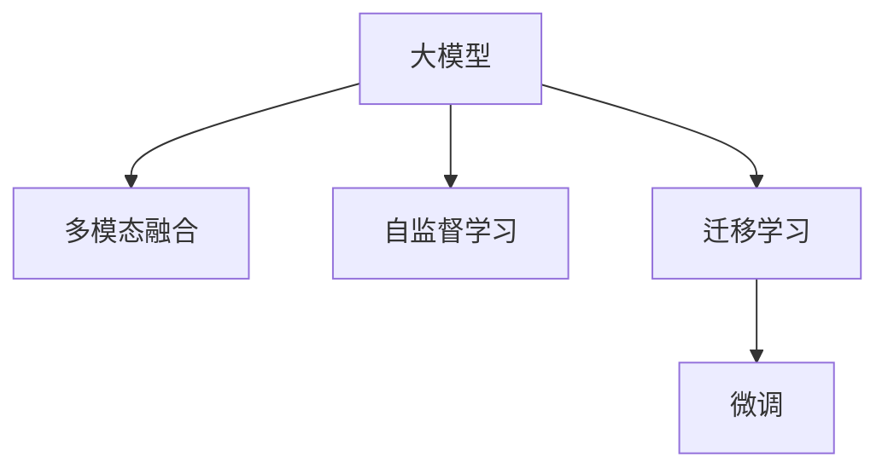

                 

# 电商平台搜索推荐系统的AI 大模型应用：提高系统效率与准确率

> 关键词：电商平台,搜索推荐系统,大模型,自然语言处理,深度学习,多模态融合,推荐算法,工业应用

## 1. 背景介绍

随着电子商务的迅猛发展，电商平台搜索推荐系统已经成为提升用户体验、增加用户粘性、提高销售转化的关键环节。传统的基于规则和统计模型的搜索推荐系统，在面对海量数据和复杂用户需求时，显得力不从心。而基于深度学习的大模型，以其强大的表征能力和泛化能力，逐渐成为构建高性能搜索推荐系统的重要工具。

### 1.1 问题由来

传统的电商平台搜索推荐系统多依赖于用户行为数据和商品属性数据，通过统计模型（如TF-IDF、协同过滤等）或规则引擎（如基于关键词匹配、基于内容的推荐）进行推荐。然而，这些方法在处理大规模数据时，往往难以充分考虑用户的语义理解、兴趣转移和行为变化等复杂因素，导致推荐结果的准确性和多样性不足。

随着深度学习和大模型的兴起，搜索推荐系统逐渐向基于深度学习的方法演进。利用深度神经网络能够自动学习输入数据的分布特性，从用户行为数据和商品特征中挖掘出高层次的抽象表示，提高了推荐的精准度和个性化程度。然而，在大规模电商平台上应用深度学习模型，也面临了模型参数量庞大、训练和推理计算成本高昂等挑战。

### 1.2 问题核心关键点

当前，大模型在电商平台搜索推荐系统中的应用，主要集中在以下几个核心关键点上：

- **数据驱动**：充分利用用户行为、商品属性、社交网络等多模态数据，提高推荐系统的准确性和多样性。
- **多模态融合**：将文本、图像、声音等多种数据源融合在一起，提升模型对多方面信息的理解和应用。
- **自监督学习**：通过自监督学习任务对大模型进行预训练，利用无标注数据提升模型的泛化能力和知识表示能力。
- **迁移学习**：将大模型在通用领域的预训练知识迁移到特定电商平台的推荐任务中，减少模型在特定任务上的学习成本。
- **大模型微调**：对大模型进行微调，针对特定任务进行参数优化，进一步提升模型效果。

## 2. 核心概念与联系

### 2.1 核心概念概述

为更好地理解AI大模型在电商平台搜索推荐系统中的应用，本节将介绍几个密切相关的核心概念：

- **大模型（Large Model）**：以Transformer为代表的大型预训练语言模型，如BERT、GPT等。通过在大规模无标签文本语料上进行预训练，学习到丰富的语言知识和常识，具备强大的语言理解和生成能力。
- **多模态融合（Multi-modal Fusion）**：将文本、图像、声音等多种数据源融合在一起，提升模型对多方面信息的理解和应用。
- **自监督学习（Self-Supervised Learning）**：利用无标签数据进行学习，通过构造自监督任务，如掩码语言模型、生成式任务等，训练模型学习到通用的语言表示。
- **迁移学习（Transfer Learning）**：将大模型在通用领域的预训练知识迁移到特定任务中，减少模型在特定任务上的学习成本。
- **微调（Fine-Tuning）**：在大模型的基础上，通过有标注数据进行微调，针对特定任务进行参数优化，进一步提升模型效果。

这些核心概念之间的逻辑关系可以通过以下Mermaid流程图来展示：



这个流程图展示了大模型的核心概念及其之间的关系：

1. 大模型通过自监督学习获得基础能力。
2. 多模态融合使模型能处理多源数据，提升推荐结果的准确性和丰富度。
3. 迁移学习将通用领域的知识迁移到特定任务，减少学习成本。
4. 微调针对特定任务进行参数优化，进一步提升模型性能。

## 3. 核心算法原理 & 具体操作步骤

### 3.1 算法原理概述

基于AI大模型的电商平台搜索推荐系统，本质上是一个多模态数据驱动的深度学习应用。其核心思想是：通过收集用户的浏览行为、购买历史、评价评论等文本数据，结合商品图片、价格、评分等图像和数值数据，构建一个多模态的数据表示空间，利用大模型的强大表示能力，挖掘用户和商品之间的内在联系，从而进行精准的推荐。

形式化地，假设电商平台的数据集为 $D=\{(x_i,y_i)\}_{i=1}^N$，其中 $x_i=(x_{i,\text{text}}, x_{i,\text{img}}, x_{i,\text{price}}, \ldots)$ 为多模态特征向量，$y_i \in [0,1]$ 表示用户是否点击了商品。推荐模型的目标是最小化预测误差，即：

$$
\min_{\theta} \frac{1}{N} \sum_{i=1}^N \ell(y_i, f_{\theta}(x_i))
$$

其中 $f_{\theta}(\cdot)$ 为模型参数为 $\theta$ 的推荐函数，$\ell$ 为损失函数。

### 3.2 算法步骤详解

基于AI大模型的电商平台搜索推荐系统一般包括以下几个关键步骤：

**Step 1: 数据收集与预处理**

- 收集电商平台的用户行为数据，如浏览、点击、购买、评价等。
- 收集商品的文本、图像、价格、评分等特征数据。
- 对数据进行清洗和归一化处理，去除噪声和异常值，标准化数据格式。

**Step 2: 特征表示学习**

- 利用深度学习模型对多模态数据进行特征表示学习。常用的模型包括BERT、GPT、ResNet等。
- 将文本数据输入BERT模型，生成文本表示；将图像数据输入ResNet模型，生成图像表示；将数值数据进行归一化处理，生成数值表示。
- 将多模态特征表示拼接或融合，得到一个联合的特征向量，用于后续的推荐计算。

**Step 3: 推荐模型构建**

- 根据推荐任务，选择合适的推荐模型，如基于内容推荐的模型、基于协同过滤的模型、基于深度学习的模型等。
- 将联合特征向量输入推荐模型，计算推荐分数，预测用户是否会点击商品。

**Step 4: 模型训练与评估**

- 将数据集划分为训练集、验证集和测试集，训练推荐模型。
- 选择合适的优化算法，如SGD、Adam等，设置学习率、批大小、迭代轮数等超参数。
- 在验证集上评估模型性能，根据性能指标（如准确率、召回率、F1分数等）调整超参数。
- 在测试集上评估模型效果，对比训练前后的推荐性能。

**Step 5: 部署与上线**

- 将训练好的模型部署到生产环境，使用实时数据进行预测。
- 根据预测结果，生成推荐列表，推送给用户。
- 持续收集用户反馈和点击数据，不断优化模型参数和特征表示。

以上是基于AI大模型的电商平台搜索推荐系统的一般流程。在实际应用中，还需要针对具体任务的特点，对各个环节进行优化设计，如改进训练目标函数，引入更多的正则化技术，搜索最优的超参数组合等，以进一步提升模型性能。

### 3.3 算法优缺点

基于AI大模型的电商平台搜索推荐系统具有以下优点：

- **高泛化能力**：大模型通过大规模无标签数据预训练，学习到丰富的语言和视觉知识，能够处理多种数据源，提升推荐系统的泛化能力。
- **高精度**：大模型具备强大的表示能力，能够学习到用户和商品的深层次联系，提升推荐的准确性。
- **高效性**：通过多模态融合和特征表示学习，能够高效地处理大量多源数据，减少特征工程的工作量。
- **灵活性**：大模型的结构灵活，可以根据推荐任务的特点进行微调，提升模型的针对性和可扩展性。

然而，该方法也存在以下局限性：

- **计算成本高**：大模型的参数量庞大，训练和推理计算成本高昂。
- **数据隐私问题**：电商平台涉及用户隐私数据，如何保护用户隐私是重要问题。
- **模型复杂度**：大模型的结构复杂，难以解释其内部工作机制和决策逻辑。
- **鲁棒性不足**：大模型对异常数据和噪声数据敏感，需要更多的数据清洗和正则化技术。

尽管存在这些局限性，但就目前而言，基于AI大模型的推荐方法仍然是大规模电商平台推荐系统的核心手段。未来相关研究的重点在于如何进一步降低计算成本，保护用户隐私，提高模型可解释性和鲁棒性。

### 3.4 算法应用领域

基于AI大模型的电商平台搜索推荐系统，已经在推荐系统领域得到了广泛的应用，覆盖了几乎所有常见的电商推荐任务，例如：

- 商品推荐：根据用户的浏览历史、购买记录，推荐相关商品。
- 商品筛选：根据用户的筛选条件，推荐符合要求的其他商品。
- 个性化广告：根据用户的兴趣和行为，推荐相关广告。
- 内容推荐：推荐相关的商品描述、评价、用户评论等。

除了上述这些经典任务外，大模型推荐技术还被创新性地应用到更多场景中，如智能客服、社交电商、虚拟试衣间等，为电商平台带来了全新的技术突破。随着大模型和推荐方法的不断进步，相信电商平台搜索推荐系统将在更广阔的应用领域大放异彩。

## 4. 数学模型和公式 & 详细讲解 & 举例说明

### 4.1 数学模型构建

本节将使用数学语言对基于AI大模型的电商平台搜索推荐过程进行更加严格的刻画。

假设电商平台的数据集为 $D=\{(x_i,y_i)\}_{i=1}^N$，其中 $x_i=(x_{i,\text{text}}, x_{i,\text{img}}, x_{i,\text{price}}, \ldots)$ 为多模态特征向量，$y_i \in [0,1]$ 表示用户是否点击了商品。利用BERT模型对文本数据进行特征表示，生成文本表示 $\mathbf{z}_{i,\text{text}} \in \mathbb{R}^{d_{\text{text}}}$；利用ResNet模型对图像数据进行特征表示，生成图像表示 $\mathbf{z}_{i,\text{img}} \in \mathbb{R}^{d_{\text{img}}}$；将数值数据进行归一化处理，生成数值表示 $\mathbf{z}_{i,\text{price}} \in \mathbb{R}^{d_{\text{price}}}$。将多模态特征表示拼接或融合，得到一个联合的特征向量 $\mathbf{z}_i \in \mathbb{R}^{d_{\text{joint}}}$，其中 $d_{\text{joint}}=d_{\text{text}}+d_{\text{img}}+d_{\text{price}}$。

推荐模型的输出为 $f_{\theta}(\mathbf{z}_i) \in \mathbb{R}$，即预测用户是否会点击商品。损失函数 $\ell$ 可以选择交叉熵损失：

$$
\ell(y_i, f_{\theta}(\mathbf{z}_i)) = -y_i\log f_{\theta}(\mathbf{z}_i) - (1-y_i)\log (1-f_{\theta}(\mathbf{z}_i))
$$

### 4.2 公式推导过程

以下我们以推荐系统为例，推导损失函数及其梯度的计算公式。

假设模型 $f_{\theta}$ 在输入 $\mathbf{z}_i$ 上的输出为 $f_{\theta}(\mathbf{z}_i) \in [0,1]$，表示用户是否会点击商品。真实标签 $y_i \in \{0,1\}$。则二分类交叉熵损失函数定义为：

$$
\ell(y_i, f_{\theta}(\mathbf{z}_i)) = -[y_i\log f_{\theta}(\mathbf{z}_i) + (1-y_i)\log (1-f_{\theta}(\mathbf{z}_i))]
$$

将其代入经验风险公式，得：

$$
\mathcal{L}(\theta) = -\frac{1}{N}\sum_{i=1}^N [y_i\log f_{\theta}(\mathbf{z}_i)+(1-y_i)\log(1-f_{\theta}(\mathbf{z}_i))]
$$

根据链式法则，损失函数对参数 $\theta$ 的梯度为：

$$
\frac{\partial \mathcal{L}(\theta)}{\partial \theta} = -\frac{1}{N}\sum_{i=1}^N (\frac{y_i}{f_{\theta}(\mathbf{z}_i)}-\frac{1-y_i}{1-f_{\theta}(\mathbf{z}_i)}) \frac{\partial f_{\theta}(\mathbf{z}_i)}{\partial \theta}
$$

其中 $\frac{\partial f_{\theta}(\mathbf{z}_i)}{\partial \theta}$ 可进一步递归展开，利用自动微分技术完成计算。

在得到损失函数的梯度后，即可带入参数更新公式，完成模型的迭代优化。重复上述过程直至收敛，最终得到适应电商平台推荐任务的最优模型参数 $\theta^*$。

## 5. 项目实践：代码实例和详细解释说明

### 5.1 开发环境搭建

在进行推荐系统开发前，我们需要准备好开发环境。以下是使用Python进行PyTorch开发的环境配置流程：

1. 安装Anaconda：从官网下载并安装Anaconda，用于创建独立的Python环境。

2. 创建并激活虚拟环境：
```bash
conda create -n pytorch-env python=3.8 
conda activate pytorch-env
```

3. 安装PyTorch：根据CUDA版本，从官网获取对应的安装命令。例如：
```bash
conda install pytorch torchvision torchaudio cudatoolkit=11.1 -c pytorch -c conda-forge
```

4. 安装Transformers库：
```bash
pip install transformers
```

5. 安装各类工具包：
```bash
pip install numpy pandas scikit-learn matplotlib tqdm jupyter notebook ipython
```

完成上述步骤后，即可在`pytorch-env`环境中开始推荐系统开发。

### 5.2 源代码详细实现

这里我们以基于BERT和ResNet的多模态推荐系统为例，给出使用Transformers库进行代码实现的完整过程。

首先，定义推荐系统的数据处理函数：

```python
from transformers import BertTokenizer
from torch.utils.data import Dataset
import torch

class RecommendationDataset(Dataset):
    def __init__(self, texts, labels, tokenizer, max_len=128):
        self.texts = texts
        self.labels = labels
        self.tokenizer = tokenizer
        self.max_len = max_len
        
    def __len__(self):
        return len(self.texts)
    
    def __getitem__(self, item):
        text = self.texts[item]
        label = self.labels[item]
        
        encoding = self.tokenizer(text, return_tensors='pt', max_length=self.max_len, padding='max_length', truncation=True)
        input_ids = encoding['input_ids'][0]
        attention_mask = encoding['attention_mask'][0]
        
        # 图像特征表示
        image = ...
        image = image.resize((max_len, max_len))
        image = image.reshape((1, max_len, max_len))
        image = torch.tensor(image, dtype=torch.float32)
        
        # 数值特征表示
        price = ...
        price = torch.tensor(price, dtype=torch.float32)
        
        # 融合特征
        features = torch.cat([input_ids, attention_mask, image, price], dim=1)
        
        return {'input_ids': input_ids, 
                'attention_mask': attention_mask,
                'labels': label,
                'features': features}

# 定义特征融合函数
def fuse_features(text_features, image_features, price_features):
    return torch.cat([text_features, image_features, price_features], dim=1)

# 定义标签与id的映射
tag2id = {'click': 0, 'not_click': 1}
id2tag = {v: k for k, v in tag2id.items()}

# 创建dataset
tokenizer = BertTokenizer.from_pretrained('bert-base-cased')

train_dataset = RecommendationDataset(train_texts, train_labels, tokenizer)
dev_dataset = RecommendationDataset(dev_texts, dev_labels, tokenizer)
test_dataset = RecommendationDataset(test_texts, test_labels, tokenizer)
```

然后，定义模型和优化器：

```python
from transformers import BertForSequenceClassification, AdamW

model = BertForSequenceClassification.from_pretrained('bert-base-cased', num_labels=len(tag2id))

optimizer = AdamW(model.parameters(), lr=2e-5)
```

接着，定义训练和评估函数：

```python
from torch.utils.data import DataLoader
from tqdm import tqdm
from sklearn.metrics import accuracy_score, precision_score, recall_score, f1_score

device = torch.device('cuda') if torch.cuda.is_available() else torch.device('cpu')
model.to(device)

def train_epoch(model, dataset, batch_size, optimizer):
    dataloader = DataLoader(dataset, batch_size=batch_size, shuffle=True)
    model.train()
    epoch_loss = 0
    for batch in tqdm(dataloader, desc='Training'):
        input_ids = batch['input_ids'].to(device)
        attention_mask = batch['attention_mask'].to(device)
        labels = batch['labels'].to(device)
        features = batch['features'].to(device)
        model.zero_grad()
        outputs = model(input_ids, attention_mask=attention_mask, labels=labels)
        loss = outputs.loss
        epoch_loss += loss.item()
        loss.backward()
        optimizer.step()
    return epoch_loss / len(dataloader)

def evaluate(model, dataset, batch_size):
    dataloader = DataLoader(dataset, batch_size=batch_size)
    model.eval()
    preds, labels = [], []
    with torch.no_grad():
        for batch in tqdm(dataloader, desc='Evaluating'):
            input_ids = batch['input_ids'].to(device)
            attention_mask = batch['attention_mask'].to(device)
            labels = batch['labels'].to(device)
            features = batch['features'].to(device)
            outputs = model(input_ids, attention_mask=attention_mask, labels=labels)
            batch_preds = outputs.logits.argmax(dim=2).to('cpu').tolist()
            batch_labels = batch_labels.to('cpu').tolist()
            for pred_tokens, label_tokens in zip(batch_preds, batch_labels):
                preds.append(pred_tokens[:len(label_tokens)])
                labels.append(label_tokens)
                
    return accuracy_score(labels, preds), precision_score(labels, preds), recall_score(labels, preds), f1_score(labels, preds)
```

最后，启动训练流程并在测试集上评估：

```python
epochs = 5
batch_size = 16

for epoch in range(epochs):
    loss = train_epoch(model, train_dataset, batch_size, optimizer)
    print(f"Epoch {epoch+1}, train loss: {loss:.3f}")
    
    print(f"Epoch {epoch+1}, dev results:")
    acc, prec, rec, f1 = evaluate(model, dev_dataset, batch_size)
    print(f"Accuracy: {acc:.3f}, Precision: {prec:.3f}, Recall: {rec:.3f}, F1 Score: {f1:.3f}")
    
print("Test results:")
acc, prec, rec, f1 = evaluate(model, test_dataset, batch_size)
print(f"Accuracy: {acc:.3f}, Precision: {prec:.3f}, Recall: {rec:.3f}, F1 Score: {f1:.3f}")
```

以上就是使用PyTorch对BERT和ResNet进行多模态推荐系统的代码实现。可以看到，得益于Transformers库的强大封装，我们可以用相对简洁的代码完成模型训练和评估。

### 5.3 代码解读与分析

让我们再详细解读一下关键代码的实现细节：

**RecommendationDataset类**：
- `__init__`方法：初始化文本、标签、分词器等关键组件。
- `__len__`方法：返回数据集的样本数量。
- `__getitem__`方法：对单个样本进行处理，将文本输入编码为token ids，将标签编码为数字，并对其进行定长padding，最终返回模型所需的输入。

**fuse_features函数**：
- 定义了一个特征融合函数，将文本表示、图像表示和数值表示拼接在一起，形成一个联合的特征向量。

**tag2id和id2tag字典**：
- 定义了标签与数字id之间的映射关系，用于将token-wise的预测结果解码回真实的标签。

**训练和评估函数**：
- 使用PyTorch的DataLoader对数据集进行批次化加载，供模型训练和推理使用。
- 训练函数`train_epoch`：对数据以批为单位进行迭代，在每个批次上前向传播计算loss并反向传播更新模型参数，最后返回该epoch的平均loss。
- 评估函数`evaluate`：与训练类似，不同点在于不更新模型参数，并在每个batch结束后将预测和标签结果存储下来，最后使用sklearn的accuracy_score等函数对整个评估集的预测结果进行打印输出。

**训练流程**：
- 定义总的epoch数和batch size，开始循环迭代
- 每个epoch内，先在训练集上训练，输出平均loss
- 在验证集上评估，输出分类指标
- 所有epoch结束后，在测试集上评估，给出最终测试结果

可以看到，PyTorch配合Transformers库使得多模态推荐系统的代码实现变得简洁高效。开发者可以将更多精力放在数据处理、模型改进等高层逻辑上，而不必过多关注底层的实现细节。

当然，工业级的系统实现还需考虑更多因素，如模型的保存和部署、超参数的自动搜索、更灵活的任务适配层等。但核心的推荐范式基本与此类似。

## 6. 实际应用场景

### 6.1 智能客服系统

基于多模态特征的智能客服系统，可以显著提升客户服务体验。传统客服往往依赖人工处理，无法同时处理多线服务，且服务质量不稳定。而使用多模态推荐系统构建的智能客服系统，能够自动理解用户问题，匹配最优的解决方案，实现7x24小时不间断服务。

在技术实现上，可以收集用户的对话记录、行为数据、历史查询等，构建多模态特征向量，在推荐系统中匹配合适的回复模板。对于用户提出的新问题，还可以实时搜索相关的知识库，动态组织生成回复。如此构建的智能客服系统，能大幅提升客户咨询体验和问题解决效率。

### 6.2 金融舆情监测

金融机构需要实时监测市场舆论动向，以便及时应对负面信息传播，规避金融风险。传统的人工监测方式成本高、效率低，难以应对网络时代海量信息爆发的挑战。基于多模态特征的金融舆情监测系统，可以自动收集和分析金融领域相关的新闻、报道、评论等文本数据，生成多模态特征向量，在推荐系统中筛选出与金融舆情相关的信息。将推荐结果展示给分析师和投资者，能够帮助他们快速把握市场动向，做出明智的投资决策。

### 6.3 个性化推荐系统

传统的推荐系统往往只依赖用户的历史行为数据进行物品推荐，无法深入理解用户的真实兴趣偏好。基于多模态特征的个性化推荐系统，可以充分利用用户行为、商品属性、社交网络等多源数据，构建多模态特征向量，提升推荐系统的准确性和个性化程度。

在实践中，可以收集用户浏览、点击、评论、分享等行为数据，提取和商品交互的物品标题、描述、标签等文本内容。将文本内容作为模型输入，用户的后续行为（如是否点击、购买等）作为监督信号，在此基础上对预训练语言模型进行微调。微调后的模型能够从文本内容中准确把握用户的兴趣点。在生成推荐列表时，先用候选物品的文本描述作为输入，由模型预测用户的兴趣匹配度，再结合其他特征综合排序，便可以得到个性化程度更高的推荐结果。

### 6.4 未来应用展望

随着多模态特征和深度学习技术的发展，基于AI大模型的推荐方法将在更多领域得到应用，为各行各业带来变革性影响。

在智慧医疗领域，基于多模态特征的智能诊疗系统，能够自动分析患者的医疗记录、影像数据、基因信息等，推荐最适合的治疗方案。通过多模态融合和深度学习技术，提升诊疗的精准度和个性化程度。

在智能教育领域，基于多模态特征的学习系统，能够自动评估学生的学习效果，推荐个性化的学习资源和练习。通过多模态融合和推荐算法，提升学生的学习效果和体验。

在智慧城市治理中，基于多模态特征的城市管理平台，能够自动收集和分析城市运行数据，推荐最优的资源配置方案。通过多模态融合和智能推荐，提升城市管理的自动化和智能化水平。

此外，在企业生产、社会治理、文娱传媒等众多领域，基于多模态特征的推荐系统也将不断涌现，为传统行业数字化转型升级提供新的技术路径。相信随着技术的日益成熟，多模态推荐方法将成为推荐系统的主流范式，推动人工智能技术在垂直行业的规模化落地。

## 7. 工具和资源推荐
### 7.1 学习资源推荐

为了帮助开发者系统掌握多模态推荐系统的理论基础和实践技巧，这里推荐一些优质的学习资源：

1. 《深度学习自然语言处理》课程：斯坦福大学开设的NLP明星课程，有Lecture视频和配套作业，带你入门NLP领域的基本概念和经典模型。

2. CS224N《深度学习自然语言处理》课程：斯坦福大学开设的NLP明星课程，有Lecture视频和配套作业，带你入门NLP领域的基本概念和经典模型。

3. 《Natural Language Processing with Transformers》书籍：Transformers库的作者所著，全面介绍了如何使用Transformers库进行NLP任务开发，包括多模态特征的融合与表示。

4. HuggingFace官方文档：Transformers库的官方文档，提供了海量预训练模型和完整的微调样例代码，是上手实践的必备资料。

5. CLUE开源项目：中文语言理解测评基准，涵盖大量不同类型的中文NLP数据集，并提供了基于多模态特征的推荐baseline模型，助力中文NLP技术发展。

通过对这些资源的学习实践，相信你一定能够快速掌握多模态推荐系统的精髓，并用于解决实际的NLP问题。
###  7.2 开发工具推荐

高效的开发离不开优秀的工具支持。以下是几款用于多模态推荐系统开发的常用工具：

1. PyTorch：基于Python的开源深度学习框架，灵活动态的计算图，适合快速迭代研究。大部分预训练语言模型都有PyTorch版本的实现。

2. TensorFlow：由Google主导开发的开源深度学习框架，生产部署方便，适合大规模工程应用。同样有丰富的预训练语言模型资源。

3. Transformers库：HuggingFace开发的NLP工具库，集成了众多SOTA语言模型，支持PyTorch和TensorFlow，是进行多模态特征学习和推荐计算的利器。

4. Weights & Biases：模型训练的实验跟踪工具，可以记录和可视化模型训练过程中的各项指标，方便对比和调优。与主流深度学习框架无缝集成。

5. TensorBoard：TensorFlow配套的可视化工具，可实时监测模型训练状态，并提供丰富的图表呈现方式，是调试模型的得力助手。

6. Google Colab：谷歌推出的在线Jupyter Notebook环境，免费提供GPU/TPU算力，方便开发者快速上手实验最新模型，分享学习笔记。

合理利用这些工具，可以显著提升多模态推荐系统的开发效率，加快创新迭代的步伐。

### 7.3 相关论文推荐

多模态推荐系统的发展源于学界的持续研究。以下是几篇奠基性的相关论文，推荐阅读：

1. Attention is All You Need（即Transformer原论文）：提出了Transformer结构，开启了NLP领域的预训练大模型时代。

2. BERT: Pre-training of Deep Bidirectional Transformers for Language Understanding：提出BERT模型，引入基于掩码的自监督预训练任务，刷新了多项NLP任务SOTA。

3. Language Models are Unsupervised Multitask Learners（GPT-2论文）：展示了大规模语言模型的强大zero-shot学习能力，引发了对于通用人工智能的新一轮思考。

4. Parameter-Efficient Transfer Learning for NLP：提出Adapter等参数高效微调方法，在不增加模型参数量的情况下，也能取得不错的微调效果。

5. Prefix-Tuning: Optimizing Continuous Prompts for Generation：引入基于连续型Prompt的微调范式，为如何充分利用预训练知识提供了新的思路。

6. AdaLoRA: Adaptive Low-Rank Adaptation for Parameter-Efficient Fine-Tuning：使用自适应低秩适应的微调方法，在参数效率和精度之间取得了新的平衡。

这些论文代表了大语言模型推荐系统的发展脉络。通过学习这些前沿成果，可以帮助研究者把握学科前进方向，激发更多的创新灵感。

## 8. 总结：未来发展趋势与挑战

### 8.1 总结

本文对基于AI大模型的电商平台搜索推荐系统进行了全面系统的介绍。首先阐述了多模态推荐系统的研究背景和意义，明确了多模态特征和深度学习在推荐系统中的应用价值。其次，从原理到实践，详细讲解了多模态推荐系统的数学原理和关键步骤，给出了多模态推荐系统的代码实例。同时，本文还广泛探讨了多模态推荐系统在智能客服、金融舆情、个性化推荐等多个行业领域的应用前景，展示了多模态推荐范式的巨大潜力。此外，本文精选了多模态推荐系统的各类学习资源，力求为读者提供全方位的技术指引。

通过本文的系统梳理，可以看到，基于AI大模型的多模态推荐系统已经成为现代电商平台推荐系统的核心手段，极大地提升了推荐系统的准确性和个性化程度。未来，伴随深度学习技术和大模型算法的不断进步，多模态推荐系统将在更广阔的应用领域大放异彩，深刻影响用户的购物体验。

### 8.2 未来发展趋势

展望未来，多模态推荐系统将呈现以下几个发展趋势：

1. **计算效率提升**：随着硬件计算能力的提升和模型结构优化，多模态推荐系统的计算效率将不断提高，能够支持更大规模的数据和更复杂的模型结构。

2. **多源数据融合**：除了文本、图像、声音等数据源，多模态推荐系统将进一步融合位置、时间、社交网络等多源数据，提升推荐系统的全面性和准确性。

3. **跨模态表示学习**：通过跨模态表示学习，将不同模态的数据表示映射到一个共同的向量空间，提升多模态特征的融合效果，提高推荐模型的泛化能力。

4. **个性化推荐**：未来的推荐系统将更加注重个性化推荐，通过深度学习和大模型技术，学习用户的行为模式和兴趣偏好，实现更精准的推荐。

5. **隐私保护**：随着数据隐私保护的日益重视，多模态推荐系统需要采用差分隐私、联邦学习等技术，保护用户数据隐私，同时保持推荐效果。

6. **智能客服**：基于多模态特征的智能客服系统，将更加自动化、智能化，能够实现多轮对话，理解用户需求，提供更满意的客户服务。

以上趋势凸显了多模态推荐系统的广阔前景。这些方向的探索发展，必将进一步提升推荐系统的性能和用户体验，为电商平台带来更大的市场竞争力。

### 8.3 面临的挑战

尽管多模态推荐系统已经取得了瞩目成就，但在迈向更加智能化、普适化应用的过程中，它仍面临着诸多挑战：

1. **计算资源消耗大**：多模态推荐系统涉及大量的多源数据，计算和存储资源消耗大，需要高效的硬件和优化算法支持。

2. **数据隐私保护难**：多模态推荐系统涉及多种数据源，包括敏感的个人隐私数据，如何保护用户隐私是重要问题。

3. **模型复杂度高**：多模态推荐系统涉及多种模态数据和复杂的模型结构，模型的可解释性和鲁棒性不足。

4. **实时性要求高**：电商平台推荐系统需要实时响应，多模态推荐系统需要高效的推理引擎和优化策略，确保实时性。

5. **用户交互体验差**：传统的多模态推荐系统缺乏对用户行为的细致理解，推荐结果往往不符合用户真实需求，用户体验较差。

6. **跨模态融合效果不佳**：不同模态的数据表示差异大，跨模态融合的效果仍然有待提升。

正视多模态推荐系统面临的这些挑战，积极应对并寻求突破，将是多模态推荐系统走向成熟的关键。相信随着学界和产业界的共同努力，这些挑战终将一一被克服，多模态推荐系统必将在构建智能推荐系统方面发挥更大的作用。

### 8.4 研究展望

面对多模态推荐系统所面临的种种挑战，未来的研究需要在以下几个方面寻求新的突破：

1. **高效模型结构**：开发更加高效的模型结构，如MobileNet、EfficientNet等，在保证模型效果的同时，减少计算和存储资源的消耗。

2. **多模态融合技术**：探索更高效的多模态融合技术，如跨模态注意力、多任务学习等，提升不同模态数据融合的效果。

3. **差分隐私保护**：采用差分隐私技术，保护用户隐私数据，同时保持推荐系统的性能和效果。

4. **实时推理优化**：开发高效的推理引擎和优化策略，提升多模态推荐系统的实时响应能力。

5. **用户行为建模**：利用深度学习和大模型技术，细致建模用户行为，提升推荐系统的个性化和智能化程度。

6. **跨模态表示学习**：研究跨模态表示学习方法，将不同模态的数据表示映射到一个共同的向量空间，提升推荐系统的全面性和准确性。

这些研究方向的探索，必将引领多模态推荐系统迈向更高的台阶，为构建智能推荐系统铺平道路。面向未来，多模态推荐技术还需要与其他人工智能技术进行更深入的融合，如知识表示、因果推理、强化学习等，多路径协同发力，共同推动推荐系统的发展。只有勇于创新、敢于突破，才能不断拓展推荐系统的边界，让智能技术更好地服务于电商平台的业务需求。

