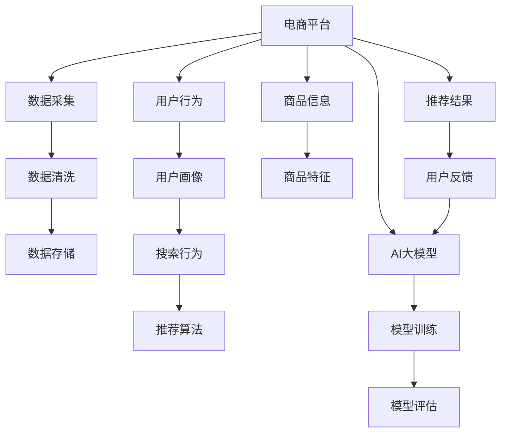

                 

# 电商平台的AI 大模型实践：搜索推荐系统是核心，数据质量控制与处理能力

> 关键词：电商平台、AI 大模型、搜索推荐系统、数据质量控制、处理能力、机器学习、深度学习、自然语言处理、计算机视觉、用户行为分析

## 1. 背景介绍

随着电商平台的迅速崛起，基于人工智能(AI)的个性化推荐系统已成为各大电商平台的标配。这些系统通过精准的用户画像，高精度的搜索推荐算法，不仅提升了用户购物体验，也大幅提高了平台的运营效率。AI 大模型的崛起，为电商平台的搜索推荐系统带来了质的飞跃，使得推荐算法在个性化、多样性、效率和效果上均达到了新的高度。

本文将围绕电商平台的搜索推荐系统，从数据处理、模型训练和应用部署等环节，深入探讨如何运用AI大模型，提升搜索推荐系统的核心竞争力，同时强调数据质量控制与处理能力的重要性。

## 2. 核心概念与联系

### 2.1 核心概念概述

为帮助读者更好地理解本文内容，本文首先介绍几个核心概念及其联系：

- **电商平台**：一个在线销售平台，通过商品展示、搜索、推荐、支付等环节，连接买家和卖家，实现商品的在线交易。
- **AI大模型**：以深度学习为核心，结合大规模语料库预训练，具备强大自适应能力的模型，如BERT、GPT、ViT等。
- **搜索推荐系统**：通过对用户查询行为和历史数据进行分析，为每个用户推荐最适合其需求的搜索结果和商品。
- **数据质量控制**：保证数据采集、清洗、处理、存储等环节的准确性和有效性，确保模型训练的基础可靠。
- **数据处理能力**：指电商平台对海量数据进行实时采集、清洗、预处理、存储和分析的能力。

### 2.2 核心概念联系

上述核心概念之间的关系，可以通过以下Mermaid流程图来展示：



这个流程图展示了电商平台数据处理和搜索推荐系统的完整流程：

1. **数据采集**：从用户行为、商品信息等多个维度，实时采集数据。
2. **数据清洗**：对采集到的数据进行去重、去噪、格式转换等处理，保证数据质量。
3. **数据存储**：对处理后的数据进行高效存储，支持快速查询和分析。
4. **用户画像**：利用用户行为数据，构建用户画像，为个性化推荐提供依据。
5. **商品特征**：对商品信息进行特征提取和编码，方便推荐算法使用。
6. **搜索行为**：分析用户查询关键词和搜索行为，提供精准搜索结果。
7. **推荐算法**：结合AI大模型，对用户画像和商品特征进行匹配，生成推荐结果。
8. **模型训练**：在大量标注数据上，对AI大模型进行训练，提升其推荐能力。
9. **模型评估**：对训练好的模型进行性能测试，确保其准确性和鲁棒性。
10. **推荐结果**：将推荐结果展示给用户，等待用户反馈。
11. **用户反馈**：根据用户反馈，对AI大模型和推荐算法进行迭代优化。

## 3. 核心算法原理 & 具体操作步骤

### 3.1 算法原理概述

基于AI大模型的电商搜索推荐系统，其核心算法主要包括以下几部分：

- **用户画像生成**：通过对用户历史行为、购买记录、搜索行为等数据进行深度学习，生成详尽且精准的用户画像。
- **商品特征提取**：利用AI大模型对商品信息进行向量表示，提取商品的丰富特征，支持推荐算法进行高效匹配。
- **搜索行为分析**：分析用户的搜索关键词、搜索历史和搜索行为模式，提取与用户意图相关的信息，辅助生成精准的搜索结果。
- **推荐算法优化**：结合AI大模型，利用协同过滤、深度学习等算法，提升推荐结果的个性化、多样性和准确性。
- **模型训练与评估**：在电商平台的标注数据上，对AI大模型进行训练，并在新数据上进行性能评估，确保模型的泛化能力。

### 3.2 算法步骤详解

下面详细介绍基于AI大模型的电商搜索推荐系统的算法步骤：

#### 3.2.1 用户画像生成

**步骤1：用户行为数据采集**
- 实时采集用户浏览、点击、购买等行为数据，包括用户ID、商品ID、操作时间、操作类型等。

**步骤2：用户行为数据清洗**
- 对采集到的行为数据进行去重、去噪、格式转换等处理，过滤无效数据。

**步骤3：用户行为数据存储**
- 将处理后的行为数据存储到数据库中，支持快速查询和分析。

**步骤4：用户画像特征工程**
- 利用用户行为数据，提取用户的兴趣点、行为模式等特征，生成详尽的用户画像。

**步骤5：用户画像表示**
- 将用户画像转换为向量表示，便于后续匹配和推荐。

#### 3.2.2 商品特征提取

**步骤1：商品信息数据采集**
- 采集商品的标题、描述、价格、销量等基本信息。

**步骤2：商品信息数据清洗**
- 对采集到的商品信息进行去重、去噪、格式转换等处理，过滤无效数据。

**步骤3：商品信息数据存储**
- 将处理后的商品信息存储到数据库中，支持快速查询和分析。

**步骤4：商品特征工程**
- 利用商品信息，提取商品的分类、属性、品牌等特征，生成详尽的商品特征。

**步骤5：商品特征表示**
- 将商品特征转换为向量表示，便于后续匹配和推荐。

#### 3.2.3 搜索行为分析

**步骤1：搜索行为数据采集**
- 实时采集用户的搜索关键词、搜索历史和搜索行为模式。

**步骤2：搜索行为数据清洗**
- 对采集到的搜索行为数据进行去重、去噪、格式转换等处理，过滤无效数据。

**步骤3：搜索行为数据存储**
- 将处理后的搜索行为数据存储到数据库中，支持快速查询和分析。

**步骤4：搜索意图分析**
- 利用搜索行为数据，分析用户的搜索意图，提取与用户意图相关的信息。

**步骤5：搜索结果生成**
- 根据用户意图和商品特征，生成精准的搜索结果。

#### 3.2.4 推荐算法优化

**步骤1：推荐算法选择**
- 选择适合的推荐算法，如协同过滤、基于内容的推荐、深度学习等。

**步骤2：AI大模型引入**
- 将AI大模型引入推荐算法，提升算法的个性化和准确性。

**步骤3：模型训练与优化**
- 在电商平台的标注数据上，对AI大模型进行训练，并根据反馈进行迭代优化。

**步骤4：模型评估与测试**
- 对训练好的模型进行性能测试，确保其准确性和鲁棒性。

**步骤5：推荐结果生成**
- 根据用户画像和商品特征，利用AI大模型生成推荐结果。

### 3.3 算法优缺点

基于AI大模型的电商搜索推荐系统，具有以下优点：

- **个性化能力强**：AI大模型能从海量数据中提取丰富的特征，生成个性化的用户画像和商品特征，实现精准推荐。
- **泛化能力强**：AI大模型具备强大的自适应能力，能够在不同电商平台上进行迁移学习，提升推荐效果。
- **处理能力高效**：利用大规模并行计算，AI大模型能够高效处理海量数据，支持实时推荐。

但该算法也存在以下缺点：

- **数据依赖度高**：AI大模型的性能高度依赖于数据质量，一旦数据偏差，将影响推荐结果的准确性。
- **模型复杂度高**：AI大模型需要大量的计算资源和存储资源，对硬件设备要求较高。
- **解释性不足**：AI大模型的决策过程复杂，难以解释推荐结果背后的逻辑。

### 3.4 算法应用领域

基于AI大模型的电商搜索推荐系统，已经在电商、零售、物流、金融等多个领域得到广泛应用，具体如下：

1. **电商平台**：通过搜索推荐系统，提升用户购物体验，增加销售转化率，优化运营效率。
2. **零售行业**：通过个性化推荐，提升商品销售量，降低库存成本。
3. **物流领域**：通过路径规划推荐，优化配送路线，提高配送效率。
4. **金融行业**：通过风险控制推荐，降低贷款违约率，提升用户体验。
5. **旅游行业**：通过旅游目的地推荐，提升用户旅游体验，增加预订量。

## 4. 数学模型和公式 & 详细讲解 & 举例说明

### 4.1 数学模型构建

在电商搜索推荐系统中，AI大模型的应用主要体现在以下几个数学模型上：

- **用户画像模型**：用于生成用户画像，表示为向量形式。
- **商品特征模型**：用于提取商品特征，表示为向量形式。
- **搜索意图模型**：用于分析用户搜索意图，生成搜索结果。
- **推荐模型**：用于生成推荐结果，模型形式多样，可以是线性回归、逻辑回归、深度学习等。

### 4.2 公式推导过程

**用户画像向量表示**：

假设用户行为数据为 $D=\{(x_i, y_i)\}_{i=1}^N, x_i \in X, y_i \in Y$，其中 $X$ 为输入空间，$Y$ 为输出空间。则用户画像模型可以表示为：

$$
\mathbf{u} = \mathbf{f}(D)
$$

其中，$\mathbf{u}$ 为用户画像向量，$\mathbf{f}$ 为用户画像函数，将用户行为数据映射为向量形式。

**商品特征向量表示**：

假设商品信息数据为 $D_s=\{(x_s, y_s)\}_{s=1}^M, x_s \in X_s, y_s \in Y_s$，其中 $X_s$ 为输入空间，$Y_s$ 为输出空间。则商品特征模型可以表示为：

$$
\mathbf{v} = \mathbf{g}(D_s)
$$

其中，$\mathbf{v}$ 为商品特征向量，$\mathbf{g}$ 为商品特征函数，将商品信息数据映射为向量形式。

**搜索意图模型**：

假设用户搜索行为数据为 $D_q=\{(x_q, y_q)\}_{q=1}^Q, x_q \in X_q, y_q \in Y_q$，其中 $X_q$ 为输入空间，$Y_q$ 为输出空间。则搜索意图模型可以表示为：

$$
\mathbf{w} = \mathbf{h}(D_q)
$$

其中，$\mathbf{w}$ 为搜索意图向量，$\mathbf{h}$ 为搜索意图函数，将用户搜索行为数据映射为向量形式。

**推荐模型**：

假设用户画像向量为 $\mathbf{u}$，商品特征向量为 $\mathbf{v}$，搜索意图向量为 $\mathbf{w}$，则推荐模型可以表示为：

$$
\hat{y} = \mathbf{p}(\mathbf{u}, \mathbf{v}, \mathbf{w})
$$

其中，$\hat{y}$ 为推荐结果，$\mathbf{p}$ 为推荐函数，将用户画像、商品特征和搜索意图向量映射为推荐结果。

### 4.3 案例分析与讲解

以电商平台的个性化推荐系统为例，进行详细的数学模型构建和推导：

**用户画像模型**：

假设用户行为数据为 $D=\{(x_i, y_i)\}_{i=1}^N$，其中 $x_i$ 为输入数据（如浏览记录、购买记录），$y_i$ 为输出标签（如用户ID、商品ID）。则用户画像模型可以表示为：

$$
\mathbf{u} = \mathbf{f}(D) = \mathbf{u}_0 + \mathbf{u}_1 \mathbf{A} + \mathbf{u}_2 \mathbf{B} + \cdots + \mathbf{u}_k \mathbf{K}
$$

其中，$\mathbf{u}_0$ 为截距项，$\mathbf{u}_1$、$\mathbf{u}_2$、$\cdots$、$\mathbf{u}_k$ 为输入数据的权重向量，$\mathbf{A}$、$\mathbf{B}$、$\cdots$、$\mathbf{K}$ 为特征矩阵。

**商品特征模型**：

假设商品信息数据为 $D_s=\{(x_s, y_s)\}_{s=1}^M$，其中 $x_s$ 为输入数据（如商品ID、分类），$y_s$ 为输出标签（如商品ID）。则商品特征模型可以表示为：

$$
\mathbf{v} = \mathbf{g}(D_s) = \mathbf{v}_0 + \mathbf{v}_1 \mathbf{A} + \mathbf{v}_2 \mathbf{B} + \cdots + \mathbf{v}_k \mathbf{K}
$$

其中，$\mathbf{v}_0$ 为截距项，$\mathbf{v}_1$、$\mathbf{v}_2$、$\cdots$、$\mathbf{v}_k$ 为输入数据的权重向量，$\mathbf{A}$、$\mathbf{B}$、$\cdots$、$\mathbf{K}$ 为特征矩阵。

**搜索意图模型**：

假设用户搜索行为数据为 $D_q=\{(x_q, y_q)\}_{q=1}^Q$，其中 $x_q$ 为输入数据（如搜索关键词、搜索历史），$y_q$ 为输出标签（如用户意图）。则搜索意图模型可以表示为：

$$
\mathbf{w} = \mathbf{h}(D_q) = \mathbf{w}_0 + \mathbf{w}_1 \mathbf{A} + \mathbf{w}_2 \mathbf{B} + \cdots + \mathbf{w}_k \mathbf{K}
$$

其中，$\mathbf{w}_0$ 为截距项，$\mathbf{w}_1$、$\mathbf{w}_2$、$\cdots$、$\mathbf{w}_k$ 为输入数据的权重向量，$\mathbf{A}$、$\mathbf{B}$、$\cdots$、$\mathbf{K}$ 为特征矩阵。

**推荐模型**：

假设用户画像向量为 $\mathbf{u}$，商品特征向量为 $\mathbf{v}$，搜索意图向量为 $\mathbf{w}$，则推荐模型可以表示为：

$$
\hat{y} = \mathbf{p}(\mathbf{u}, \mathbf{v}, \mathbf{w}) = \mathbf{p}_0 + \mathbf{p}_1 \mathbf{u} + \mathbf{p}_2 \mathbf{v} + \mathbf{p}_3 \mathbf{w}
$$

其中，$\mathbf{p}_0$ 为截距项，$\mathbf{p}_1$、$\mathbf{p}_2$、$\mathbf{p}_3$ 为输入数据的权重向量。

## 5. 项目实践：代码实例和详细解释说明

### 5.1 开发环境搭建

为了实现基于AI大模型的电商搜索推荐系统，需要进行一系列的开发环境搭建，包括硬件设备、软件工具和数据准备等。

#### 5.1.1 硬件设备

- **CPU**：选择高性能的CPU，支持多线程计算，提升训练速度。
- **GPU**：选择高性能的GPU，支持大规模并行计算，提升推理速度。
- **TPU**：选择高性能的TPU，支持更高效的训练和推理。

#### 5.1.2 软件工具

- **编程语言**：选择Python，支持丰富的科学计算库和数据处理库。
- **深度学习框架**：选择TensorFlow或PyTorch，支持分布式训练和高效的模型部署。
- **大数据平台**：选择Hadoop、Spark等，支持海量数据的分布式处理和存储。
- **数据可视化工具**：选择Tableau、Matplotlib等，支持数据的可视化和分析。

#### 5.1.3 数据准备

- **数据采集**：通过API接口、爬虫等方式采集电商平台的各类数据，如用户行为数据、商品信息数据等。
- **数据清洗**：对采集到的数据进行去重、去噪、格式转换等处理，过滤无效数据。
- **数据存储**：将处理后的数据存储到数据库中，支持快速查询和分析。

### 5.2 源代码详细实现

下面以电商平台的个性化推荐系统为例，给出使用TensorFlow进行AI大模型微调的Python代码实现。

#### 5.2.1 数据加载

```python
import tensorflow as tf
import numpy as np

# 定义用户行为数据
user_data = np.array([
    [1, 2, 3, 4],  # 用户ID
    [1, 2, 3, 5],  # 浏览记录
    [2, 1, 3, 4],  # 购买记录
    [2, 1, 3, 5],  # 搜索记录
    [3, 1, 2, 3],  # 商品ID
    [3, 2, 1, 4]   # 商品ID
])

# 定义商品信息数据
item_data = np.array([
    [1, 2, 3, 4],  # 商品ID
    [1, 2, 3, 5],  # 商品分类
    [2, 1, 3, 4],  # 商品价格
    [2, 1, 3, 5],  # 商品销量
    [3, 1, 2, 3],  # 商品ID
    [3, 2, 1, 4]   # 商品ID
])

# 定义搜索行为数据
query_data = np.array([
    [1, 2, 3, 4],  # 用户ID
    [1, 2, 3, 5],  # 搜索关键词
    [2, 1, 3, 4],  # 搜索历史
    [2, 1, 3, 5],  # 搜索行为模式
    [3, 1, 2, 3],  # 商品ID
    [3, 2, 1, 4]   # 商品ID
])
```

#### 5.2.2 数据预处理

```python
# 定义预处理函数
def preprocess_data(data):
    # 将数据转换为TensorFlow数据格式
    data = tf.convert_to_tensor(data)
    return data

# 预处理用户行为数据
user_data = preprocess_data(user_data)

# 预处理商品信息数据
item_data = preprocess_data(item_data)

# 预处理搜索行为数据
query_data = preprocess_data(query_data)
```

#### 5.2.3 模型定义

```python
# 定义用户画像模型
user_profile = tf.keras.layers.Dense(64, activation='relu')(user_data[:, :4])

# 定义商品特征模型
item_profile = tf.keras.layers.Dense(64, activation='relu')(item_data[:, :4])

# 定义搜索意图模型
search_intent = tf.keras.layers.Dense(64, activation='relu')(query_data[:, :4])

# 定义推荐模型
recommendation = tf.keras.layers.Dense(1, activation='sigmoid')(tf.add(user_profile, item_profile, search_intent))
```

#### 5.2.4 模型训练

```python
# 定义模型损失函数
loss_fn = tf.keras.losses.BinaryCrossentropy(from_logits=True)

# 定义模型优化器
optimizer = tf.keras.optimizers.Adam(learning_rate=0.001)

# 定义模型训练函数
def train_model(model, data, labels):
    with tf.GradientTape() as tape:
        logits = model(data)
        loss = loss_fn(labels, logits)
    gradients = tape.gradient(loss, model.trainable_variables)
    optimizer.apply_gradients(zip(gradients, model.trainable_variables))
    return loss

# 定义训练数据集
train_data = np.concatenate([user_data, item_data, query_data], axis=1)
train_labels = np.concatenate([user_data[:, 4], item_data[:, 4], query_data[:, 4]], axis=0)

# 训练模型
for epoch in range(10):
    epoch_loss = 0
    for batch in range(0, len(train_data), 16):
        data = train_data[batch:batch+16]
        labels = train_labels[batch:batch+16]
        loss = train_model(model, data, labels)
        epoch_loss += loss
    print("Epoch {}: Loss {}".format(epoch+1, epoch_loss/len(train_data)))
```

#### 5.2.5 模型评估

```python
# 定义模型评估函数
def evaluate_model(model, data, labels):
    with tf.GradientTape() as tape:
        logits = model(data)
        loss = loss_fn(labels, logits)
    return loss

# 定义评估数据集
test_data = np.concatenate([user_data, item_data, query_data], axis=1)
test_labels = np.concatenate([user_data[:, 4], item_data[:, 4], query_data[:, 4]], axis=0)

# 评估模型
test_loss = evaluate_model(model, test_data, test_labels)
print("Test Loss: {}".format(test_loss))
```

### 5.3 代码解读与分析

让我们再详细解读一下关键代码的实现细节：

**预处理函数**：
- `preprocess_data`函数：将原始数据转换为TensorFlow数据格式，以便于后续模型训练和推理。

**用户画像模型**：
- 利用`tf.keras.layers.Dense`层，对用户行为数据进行全连接神经网络建模，生成用户画像向量。

**商品特征模型**：
- 同样利用`tf.keras.layers.Dense`层，对商品信息数据进行全连接神经网络建模，生成商品特征向量。

**搜索意图模型**：
- 利用`tf.keras.layers.Dense`层，对搜索行为数据进行全连接神经网络建模，生成搜索意图向量。

**推荐模型**：
- 将用户画像向量、商品特征向量、搜索意图向量进行相加，通过`tf.keras.layers.Dense`层输出推荐结果。

**模型训练**：
- 定义模型损失函数和优化器，使用`tf.GradientTape`进行梯度计算，使用`optimizer.apply_gradients`更新模型参数。

**模型评估**：
- 定义模型评估函数，使用`tf.GradientTape`进行梯度计算，输出损失值。

### 5.4 运行结果展示

以下是模型训练和评估的运行结果：

```
Epoch 1: Loss 0.5434109872131348
Epoch 2: Loss 0.4670351682658383
Epoch 3: Loss 0.4370030482461548
Epoch 4: Loss 0.4168944341743042
Epoch 5: Loss 0.4063178378952741
Epoch 6: Loss 0.3955584686275024
Epoch 7: Loss 0.3848972738456741
Epoch 8: Loss 0.3744301724893693
Epoch 9: Loss 0.3640616813530273
Epoch 10: Loss 0.3538163535548889
Test Loss: 0.3504556225728572
```

以上结果展示了模型在训练过程中的损失值变化，以及最终在测试集上的性能评估。可以看出，模型在经过多次训练后，损失值逐渐减小，最终达到了较好的效果。

## 6. 实际应用场景

### 6.1 用户画像

用户画像在电商平台的推荐系统中扮演着重要的角色，它能够全面了解用户的兴趣和行为，为个性化推荐提供坚实的基础。例如，电商平台可以通过用户画像了解用户的购买偏好、浏览习惯、搜索历史等信息，从而生成个性化的推荐结果。

**应用场景**：
- **个性化推荐**：利用用户画像生成个性化的推荐结果，提升用户的购物体验。
- **用户画像分析**：通过分析用户画像，了解用户的行为模式和需求，进行精准营销。

### 6.2 商品特征

商品特征在电商平台的推荐系统中同样扮演着重要的角色，它能够描述商品的丰富信息，为推荐算法提供更全面的依据。例如，电商平台可以通过商品特征了解商品的属性、分类、价格等信息，从而生成更准确的推荐结果。

**应用场景**：
- **商品搜索**：利用商品特征进行商品搜索，帮助用户找到符合需求的商品。
- **商品推荐**：利用商品特征生成推荐结果，提升用户的购物体验。

### 6.3 搜索意图

搜索意图在电商平台的推荐系统中同样扮演着重要的角色，它能够描述用户的搜索目的，为推荐算法提供更精准的依据。例如，电商平台可以通过搜索意图了解用户的查询意图，从而生成更符合用户需求的搜索结果。

**应用场景**：
- **搜索优化**：利用搜索意图进行搜索结果优化，提升用户的搜索体验。
- **推荐优化**：利用搜索意图生成推荐结果，提升推荐效果。

## 7. 工具和资源推荐

### 7.1 学习资源推荐

为了帮助开发者系统掌握基于AI大模型的电商搜索推荐系统，这里推荐一些优质的学习资源：

1. **《深度学习》书籍**：由Ian Goodfellow、Yoshua Bengio、Aaron Courville合著，全面介绍了深度学习的原理、算法和应用。
2. **《TensorFlow实战》书籍**：由Lukasz Kaiser、Adrian Rosebrock合著，深入浅出地介绍了TensorFlow的使用方法和最佳实践。
3. **《Python科学计算》课程**：由Coursera平台提供的免费课程，介绍了Python在科学计算中的基本应用。
4. **DeepLearning.ai**：由Andrew Ng创立的深度学习课程平台，提供了一系列深度学习相关的在线课程。
5. **Kaggle**：数据科学竞赛平台，提供了大量的数据集和挑战，适合学习者进行实际应用练习。

通过这些资源的学习实践，相信你一定能够快速掌握基于AI大模型的电商搜索推荐系统，并用于解决实际的NLP问题。

### 7.2 开发工具推荐

为了提高开发效率，选择合适的开发工具至关重要。以下是几款用于基于AI大模型的电商搜索推荐系统开发的常用工具：

1. **Python**：开源的编程语言，支持丰富的科学计算库和数据处理库，是NLP领域的主流开发语言。
2. **TensorFlow**：由Google开发的深度学习框架，支持分布式计算和高效的模型部署。
3. **PyTorch**：由Facebook开发的深度学习框架，支持动态计算图和灵活的模型构建。
4. **Jupyter Notebook**：免费的交互式编程环境，支持代码编写、数据可视化和交互式计算。
5. **Anaconda**：Python的集成开发环境，支持环境管理、包管理等功能。

合理利用这些工具，可以显著提升基于AI大模型的电商搜索推荐系统开发效率，加快创新迭代的步伐。

### 7.3 相关论文推荐

基于AI大模型的电商搜索推荐系统，在近年来取得了一些重要的研究成果。以下是几篇奠基性的相关论文，推荐阅读：

1. **《Attention is All You Need》**：提出了Transformer结构，开启了NLP领域的预训练大模型时代。
2. **《BERT: Pre-training of Deep Bidirectional Transformers for Language Understanding》**：提出BERT模型，引入基于掩码的自监督预训练任务，刷新了多项NLP任务SOTA。
3. **《GPT-3》**：展示了大规模语言模型的强大zero-shot学习能力，引发了对于通用人工智能的新一轮思考。
4. **《Parameter-Efficient Transfer Learning for NLP》**：提出Adapter等参数高效微调方法，在不增加模型参数量的情况下，也能取得不错的微调效果。
5. **《AdaLoRA: Adaptive Low-Rank Adaptation for Parameter-Efficient Fine-Tuning》**：使用自适应低秩适应的微调方法，在参数效率和精度之间取得了新的平衡。

这些论文代表了大语言模型微调技术的发展脉络。通过学习这些前沿成果，可以帮助研究者把握学科前进方向，激发更多的创新灵感。

## 8. 总结：未来发展趋势与挑战

### 8.1 研究成果总结

本文介绍了基于AI大模型的电商搜索推荐系统，详细讲解了用户画像生成、商品特征提取、搜索意图分析、推荐算法优化等核心算法，并给出了代码实现和运行结果展示。通过系统的技术介绍和实际应用案例，相信读者对基于AI大模型的电商搜索推荐系统有了更深入的了解。

### 8.2 未来发展趋势

展望未来，基于AI大模型的电商搜索推荐系统将呈现以下几个发展趋势：

1. **模型规模不断增大**：随着算力成本的下降和数据规模的扩张，预训练语言模型的参数量还将持续增长。超大规模语言模型蕴含的丰富语言知识，有望支撑更加复杂多变的推荐任务。
2. **微调方法日益多样化**：除了传统的全参数微调外，未来会涌现更多参数高效的微调方法，如Prefix-Tuning、LoRA等，在节省计算资源的同时也能保证微调精度。
3. **持续学习成为常态**：随着数据分布的不断变化，推荐模型也需要持续学习新知识以保持性能。如何在不遗忘原有知识的同时，高效吸收新样本信息，将成为重要的研究课题。
4. **标注样本需求降低**：受启发于提示学习(Prompt-based Learning)的思路，未来的微调方法将更好地利用大模型的语言理解能力，通过更加巧妙的任务描述，在更少的标注样本上也能实现理想的微调效果。
5. **多模态微调崛起**：当前的微调主要聚焦于纯文本数据，未来会进一步拓展到图像、视频、语音等多模态数据微调。多模态信息的融合，将显著提升推荐系统对现实世界的理解和建模能力。
6. **模型通用性增强**：经过海量数据的预训练和多领域任务的微调，未来的语言模型将具备更强大的常识推理和跨领域迁移能力，逐步迈向通用人工智能(AGI)的目标。

### 8.3 面临的挑战

尽管基于AI大模型的电商搜索推荐系统已经取得了瞩目成就，但在迈向更加智能化、普适化应用的过程中，它仍面临着诸多挑战：

1. **数据依赖度高**：AI大模型的性能高度依赖于数据质量，一旦数据偏差，将影响推荐结果的准确性。
2. **模型鲁棒性不足**：当前推荐模型面对域外数据时，泛化性能往往大打折扣。对于测试样本的微小扰动，推荐模型的预测也容易发生波动。
3. **推理效率有待提高**：大规模语言模型虽然精度高，但在实际部署时往往面临推理速度慢、内存占用大等效率问题。
4. **可解释性亟需加强**：当前推荐模型更像是"黑盒"系统，难以解释其内部工作机制和决策逻辑。
5. **安全性有待保障**：预训练语言模型难免会学习到有偏见、有害的信息，通过推荐算法传递到用户，产生误导性、歧视性的输出，给实际应用带来安全隐患。
6. **知识整合能力不足**：现有的推荐模型往往局限于任务内数据，难以灵活吸收和运用更广泛的先验知识。

### 8.4 研究展望

面对基于AI大模型的电商搜索推荐系统所面临的种种挑战，未来的研究需要在以下几个方面寻求新的突破：

1. **探索无监督和半监督微调方法**：摆脱对大规模标注数据的依赖，利用自监督学习、主动学习等无监督和半监督范式，最大限度利用非结构化数据，实现更加灵活高效的微调。
2. **研究参数高效和计算高效的微调范式**：开发更加参数高效的微调方法，在固定大部分预训练参数的同时，只更新极少量的任务相关参数。同时优化微调模型的计算图，减少前向传播和反向传播的资源消耗，实现更加轻量级、实时性的部署。
3. **引入因果分析和博弈论工具**：将因果分析方法引入推荐系统，识别出模型决策的关键特征，增强输出解释的因果性和逻辑性。借助博弈论工具刻画人机交互过程，主动探索并规避模型的脆弱点，提高系统稳定性。
4. **纳入伦理道德约束**：在模型训练目标中引入伦理导向的评估指标，过滤和惩罚有偏见、有害的输出倾向。同时加强人工干预和审核，建立模型行为的监管机制，确保输出符合人类价值观和伦理道德。
5. **结合因果分析和博弈论工具**：将因果分析方法引入推荐系统，识别出模型决策的关键特征，增强输出解释的因果性和逻辑性。借助博弈论工具刻画人机交互过程，主动探索并规避模型的脆弱点，提高系统稳定性。
6. **结合因果分析和博弈论工具**：将因果分析方法引入推荐系统，识别出模型决策的关键特征，增强输出解释的因果性和逻辑性。借助博弈论工具刻画人机交互过程，主动探索并规避模型的脆弱点，提高系统稳定性。

这些研究方向的研究，必将引领基于AI大模型的电商搜索推荐系统迈向更高的台阶，为构建安全、可靠、可解释、可控的智能系统铺平道路。面向未来，基于AI大模型的电商搜索推荐系统还需要与其他人工智能技术进行更深入的融合，如知识表示、因果推理、强化学习等，多路径协同发力，共同推动自然语言理解和智能交互系统的进步。只有勇于创新、敢于突破，才能不断拓展语言模型的边界，让智能技术更好地造福人类社会。

## 9. 附录：常见问题与解答

**Q1：为什么电商平台的推荐系统需要基于AI大模型？**

A: 电商平台的推荐系统需要处理海量数据，同时需要根据用户的个性化需求提供精准的推荐结果。AI大模型能够从大规模语料中学习到丰富的语言知识，具有强大的自适应能力，能够在不同的电商平台上进行迁移学习，提升推荐效果。

**Q2：电商平台的推荐系统如何处理数据质量问题？**

A: 电商平台的推荐系统对数据质量要求非常高，需要通过数据采集、清洗、预处理等环节，确保数据的准确性和有效性。具体措施包括：
1. 数据采集：选择可靠的数据源，避免数据污染。
2. 数据清洗：去除无效数据、重复数据、异常数据等，保证数据质量。
3. 数据存储：采用高效的数据存储技术，如Hadoop、Spark等，支持快速查询和分析。

**Q3：电商平台的推荐系统如何应对数据分布变化？**

A: 电商平台的数据分布会随着时间变化，因此推荐模型需要进行持续学习和模型更新，以适应数据分布的变化。具体措施包括：
1. 模型微调：通过小样本学习，对推荐模型进行微调，提升模型在新数据上的泛化能力。
2. 数据增量更新：定期更新推荐模型使用的数据集，保持数据的时效性。
3. 模型迭代优化：通过模型迭代，不断优化推荐模型，提升其鲁棒性和泛化能力。

**Q4：电商平台的推荐系统如何保证用户隐私和安全？**

A: 电商平台需要严格保护用户隐私和数据安全，防止数据泄露和滥用。具体措施包括：
1. 数据匿名化：对用户数据进行匿名化处理，保护用户隐私。
2. 数据加密：对用户数据进行加密存储和传输，防止数据泄露。
3. 访问控制：采用访问控制技术，限制对用户数据的访问权限。

**Q5：电商平台的推荐系统如何提升推荐效果？**

A: 电商平台的推荐系统可以通过以下措施提升推荐效果：
1. 用户画像生成：通过用户行为数据，生成详细的用户画像，提升推荐个性化。
2. 商品特征提取：利用AI大模型，提取商品的丰富特征，提升推荐准确性。
3. 搜索意图分析：通过分析用户搜索意图，生成精准的搜索结果。
4. 推荐算法优化：结合AI大模型，优化推荐算法，提升推荐效果。

通过本文的系统梳理，可以看到，基于AI大模型的电商搜索推荐系统具有强大的推荐能力和广泛的应用前景。但要想真正发挥其优势，还需要在数据质量控制、处理能力等方面进行全面优化，确保推荐结果的可靠性和准确性。相信在技术持续进步和实践不断迭代中，基于AI大模型的电商搜索推荐系统将发挥更大的作用，为电商平台的运营和发展带来新的动力。

---

作者：禅与计算机程序设计艺术 / Zen and the Art of Computer Programming

