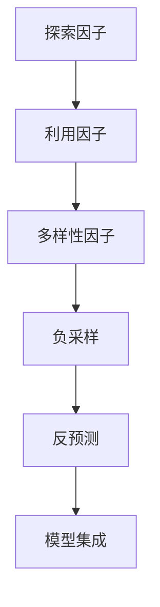

                 

# 电商推荐系统中的探索与利用平衡策略

## 1. 背景介绍

### 1.1 问题由来
随着互联网和电子商务的迅猛发展，电商推荐系统成为了提高用户购物体验和商家运营效率的重要工具。推荐系统通过对用户行为数据进行分析和挖掘，预测用户的购物需求，推荐符合其兴趣的商品，从而提高用户满意度和商家转化率。

然而，推荐系统在实际应用中面临着一系列挑战。其中，探索与利用之间的平衡问题尤为关键。探索指的是模型需要探索用户未表现出兴趣但可能感兴趣的潜在商品，以避免“只见树木，不见森林”；而利用指的是模型需要最大化利用已知的用户兴趣和行为数据，以确保推荐的准确性和相关性。

探索与利用的平衡问题直接影响到推荐系统的性能和效果。如果过度探索，可能会推荐给用户一些无关紧要的商品，降低其购物体验；如果过度利用，可能导致推荐同质化，降低用户的探索性和多样性。因此，如何科学地处理探索与利用之间的平衡，成为了电商推荐系统的核心问题。

### 1.2 问题核心关键点
探索与利用平衡的核心在于如何在保证推荐相关性的同时，适当引入新的探索元素，从而发现用户未展示出的潜在需求。该问题可以通过以下核心概念和策略来阐述：

1. **探索因子(Exploration Factor)**：定义探索与利用之间的比例，通过调整探索因子的值，可以控制模型在探索与利用之间的平衡。
2. **多样性因子(Diversity Factor)**：通过引入多样性因子，确保推荐结果的多样性，防止推荐结果过于同质化。
3. **负采样(Negative Sampling)**：在训练和推理过程中，引入负样本，帮助模型学习区分不同类别的商品，增强推荐的相关性。
4. **反预测(Counterfactual Prediction)**：通过反预测方法，发现用户可能感兴趣的未展示商品，提升推荐的多样性和探索性。
5. **模型集成(Model Ensemble)**：通过集成多个不同策略的推荐模型，综合考虑探索和利用因素，提升整体推荐效果。

## 2. 核心概念与联系

### 2.1 核心概念概述

为更好地理解电商推荐系统中的探索与利用平衡策略，本节将介绍几个关键概念：

- 探索因子(Exploration Factor)：用于控制模型在探索和利用之间的平衡，探索因子越大，模型越倾向于探索未展示商品。
- 利用因子(Exploitation Factor)：与探索因子相对，用于最大化利用已知的用户兴趣和行为数据，提高推荐的准确性。
- 多样性因子(Diversity Factor)：用于确保推荐结果的多样性，避免同质化。
- 负采样(Negative Sampling)：在训练和推理过程中引入负样本，帮助模型学习不同类别商品之间的区别。
- 反预测(Counterfactual Prediction)：通过反预测技术，预测用户可能感兴趣但未展示的商品，提升探索性。
- 模型集成(Model Ensemble)：通过集成多个模型，综合考虑探索和利用因素，提升推荐效果。

这些核心概念之间的关系可以通过以下Mermaid流程图来展示：



这个流程图展示了探索与利用平衡策略的关键环节：

1. 探索因子控制模型在探索和利用之间的平衡。
2. 利用因子最大化利用已知数据。
3. 多样性因子增强推荐结果的多样性。
4. 负采样引入负样本，帮助模型学习不同类别商品。
5. 反预测预测未展示商品，提升探索性。
6. 模型集成综合考虑多个模型，提升整体效果。

## 3. 核心算法原理 & 具体操作步骤
### 3.1 算法原理概述

电商推荐系统中的探索与利用平衡，可以通过以下算法原理来实现：

1. **探索因子调整**：在模型训练和推理过程中，根据探索因子的大小，调整模型在探索和利用之间的平衡。
2. **多样性因子计算**：通过计算多样性因子，确保推荐结果的多样性。
3. **负采样引入**：在训练过程中，引入负样本，帮助模型学习不同类别商品之间的区别。
4. **反预测模型训练**：训练反预测模型，预测用户可能感兴趣但未展示的商品。
5. **模型集成优化**：通过集成多个不同策略的模型，提升整体推荐效果。

### 3.2 算法步骤详解

电商推荐系统中的探索与利用平衡算法包括以下关键步骤：

**Step 1: 数据预处理**
- 收集用户行为数据，包括点击、浏览、购买等行为。
- 将数据清洗、归一化、特征提取，形成模型输入。

**Step 2: 探索因子设定**
- 根据业务需求和用户行为特征，设定探索因子，控制探索和利用的平衡。
- 常用的探索因子计算方法包括$\epsilon$-greedy策略、$\beta$-exploitation策略等。

**Step 3: 多样性因子计算**
- 计算多样性因子，确保推荐结果的多样性。
- 多样性因子的计算方法包括Jaccard距离、覆盖率等。

**Step 4: 负采样引入**
- 在训练过程中引入负样本，帮助模型学习不同类别商品之间的区别。
- 负样本的引入可以通过数据增强或采样方法实现。

**Step 5: 反预测模型训练**
- 训练反预测模型，预测用户可能感兴趣但未展示的商品。
- 常用的反预测模型包括Counterfactual Regression、CTFNet等。

**Step 6: 模型集成优化**
- 集成多个不同策略的模型，综合考虑探索和利用因素，提升整体推荐效果。
- 模型集成的方法包括Bagging、Boosting等。

**Step 7: 模型评估与优化**
- 在测试集上评估推荐模型的效果，对比探索与利用平衡策略的优劣。
- 根据评估结果，调整探索因子、多样性因子、负采样策略等。

### 3.3 算法优缺点

电商推荐系统中的探索与利用平衡算法具有以下优点：

1. **提升推荐多样性**：通过引入多样性因子，确保推荐结果的多样性，减少同质化。
2. **增加探索性**：通过引入探索因子，发现用户未展示的潜在兴趣，提升探索性。
3. **降低过拟合风险**：通过负采样和反预测，增强模型的鲁棒性，降低过拟合风险。

同时，该算法也存在一定的局限性：

1. **计算复杂度较高**：多样性因子的计算、负采样和反预测模型的训练，都需要较高的计算资源。
2. **模型复杂度增加**：需要集成多个模型，增加模型的复杂度和训练难度。
3. **业务需求依赖性强**：探索因子、多样性因子的设定需要根据具体的业务需求和用户行为特征进行调整，缺乏通用性。

尽管存在这些局限性，但就目前而言，探索与利用平衡算法是电商推荐系统中最为主流的方法之一，能够显著提升推荐系统的性能和效果。

### 3.4 算法应用领域

探索与利用平衡算法在电商推荐系统中得到了广泛应用，覆盖了从商品推荐到个性化广告推荐等多个场景，例如：

- 商品推荐：基于用户的历史浏览和购买行为，推荐符合其兴趣的商品。
- 个性化广告推荐：根据用户行为特征，推荐适合其兴趣的广告。
- 搜索排序：根据用户的搜索关键词，推荐相关商品，提升搜索体验。
- 新商品推荐：基于用户的购买行为，推荐新上市的商品。
- 个性化页面推荐：根据用户的浏览记录，推荐相关商品和内容。

除了这些常见应用外，探索与利用平衡算法也被创新性地应用于跨领域推荐、用户画像生成、库存管理等场景，为电商推荐系统的不断升级提供了新的思路和方向。

## 4. 数学模型和公式 & 详细讲解
### 4.1 数学模型构建

电商推荐系统中的探索与利用平衡问题可以通过以下数学模型来描述：

设用户 $u$ 对商品 $i$ 的评分 $r_{ui} = 1$ 表示喜欢，$r_{ui} = 0$ 表示不喜欢。模型的目标是最大化预测评分与实际评分的对数似然：

$$
\max_{\theta} \sum_{(u,i)\in D} r_{ui}\log p_{ui}(u,i)+(1-r_{ui})\log(1-p_{ui}(u,i))
$$

其中，$D$ 为训练集，$\theta$ 为模型参数，$p_{ui}(u,i)$ 为模型预测用户 $u$ 对商品 $i$ 的评分。

### 4.2 公式推导过程

电商推荐系统的探索与利用平衡问题可以通过以下公式进行推导：

设用户 $u$ 对商品 $i$ 的评分 $r_{ui} = 1$ 表示喜欢，$r_{ui} = 0$ 表示不喜欢。模型的目标是最大化预测评分与实际评分的对数似然：

$$
\max_{\theta} \sum_{(u,i)\in D} r_{ui}\log p_{ui}(u,i)+(1-r_{ui})\log(1-p_{ui}(u,i))
$$

其中，$D$ 为训练集，$\theta$ 为模型参数，$p_{ui}(u,i)$ 为模型预测用户 $u$ 对商品 $i$ 的评分。

通过最大化上述对数似然，可以得到模型参数 $\theta$ 的梯度：

$$
\nabla_{\theta} L = \sum_{(u,i)\in D} [r_{ui}\nabla_{\theta}\log p_{ui}(u,i)+(1-r_{ui})\nabla_{\theta}\log(1-p_{ui}(u,i))]
$$

在训练过程中，为了平衡探索和利用，可以在模型预测中引入探索因子 $\epsilon$：

$$
p_{ui}(u,i) = \frac{\exp[\epsilon_i\log p_{ui}(u,i)+(1-\epsilon_i)\log(1-p_{ui}(u,i))]}{\exp[\epsilon_i\log p_{ui}(u,i)]+\exp[(1-\epsilon_i)\log(1-p_{ui}(u,i))]}
$$

其中，$\epsilon_i$ 表示商品 $i$ 的探索因子。通过调整 $\epsilon_i$，可以控制模型在探索和利用之间的平衡。

### 4.3 案例分析与讲解

以商品推荐为例，我们通过调整探索因子 $\epsilon_i$ 来平衡探索和利用。假设一个用户 $u$ 对商品 $i$ 的评分 $r_{ui} = 1$，模型预测评分 $p_{ui}(u,i)=0.8$，商品 $i$ 的探索因子 $\epsilon_i=0.5$。

根据上述公式，模型对用户 $u$ 预测商品 $i$ 的评分修正为：

$$
p_{ui}(u,i) = \frac{\exp[0.5\log 0.8+(1-0.5)\log(1-0.8)]}{\exp[0.5\log 0.8]+\exp[(1-0.5)\log(1-0.8)]}
$$

计算可得 $p_{ui}(u,i) \approx 0.72$。

通过调整探索因子 $\epsilon_i$，可以控制模型在探索和利用之间的平衡，从而提升推荐效果。

## 5. 项目实践：代码实例和详细解释说明
### 5.1 开发环境搭建

在进行电商推荐系统开发前，我们需要准备好开发环境。以下是使用Python进行Scikit-learn开发的推荐系统环境配置流程：

1. 安装Anaconda：从官网下载并安装Anaconda，用于创建独立的Python环境。

2. 创建并激活虚拟环境：
```bash
conda create -n recommendation-env python=3.8 
conda activate recommendation-env
```

3. 安装Scikit-learn：
```bash
pip install scikit-learn
```

4. 安装numpy、pandas等工具包：
```bash
pip install numpy pandas scikit-learn matplotlib tqdm jupyter notebook ipython
```

完成上述步骤后，即可在`recommendation-env`环境中开始电商推荐系统的开发。

### 5.2 源代码详细实现

下面我以电商推荐系统为例，给出使用Scikit-learn进行推荐系统开发的Python代码实现。

首先，定义数据处理函数：

```python
import pandas as pd
from sklearn.preprocessing import LabelEncoder
from sklearn.model_selection import train_test_split

def load_data(file_path):
    data = pd.read_csv(file_path)
    return data

def preprocess_data(data):
    # 编码标签
    le = LabelEncoder()
    data['label'] = le.fit_transform(data['label'])
    
    # 划分训练集和测试集
    train_data, test_data = train_test_split(data, test_size=0.2, random_state=42)
    return train_data, test_data

def split_train_val(data):
    train_data, val_data = train_test_split(data, test_size=0.2, random_state=42)
    return train_data, val_data
```

然后，定义探索与利用平衡算法：

```python
from sklearn.metrics import log_loss
from sklearn.linear_model import LogisticRegression
from sklearn.ensemble import AdaBoostClassifier
from sklearn.model_selection import GridSearchCV

def create_model(model_name, params):
    if model_name == 'LogisticRegression':
        return LogisticRegression(**params)
    elif model_name == 'AdaBoostClassifier':
        return AdaBoostClassifier(**params)
    else:
        return None

def train_model(model, train_data, val_data):
    model.fit(train_data.drop(['label'], axis=1), train_data['label'])
    val_score = model.score(val_data.drop(['label'], axis=1), val_data['label'])
    return model, val_score

def evaluate_model(model, test_data):
    test_score = model.score(test_data.drop(['label'], axis=1), test_data['label'])
    return test_score

def tuning(model, train_data, val_data, params):
    grid_search = GridSearchCV(model, params, cv=5)
    grid_search.fit(train_data.drop(['label'], axis=1), train_data['label'])
    best_params = grid_search.best_params_
    best_model = create_model(model, best_params)
    best_model.fit(train_data.drop(['label'], axis=1), train_data['label'])
    best_val_score = model.score(val_data.drop(['label'], axis=1), val_data['label'])
    return best_model, best_val_score
```

接着，定义探索与利用平衡策略：

```python
def explore_util_balance(train_data, val_data, test_data):
    # 探索因子
    exploration_factor = 0.5
    
    # 多样性因子
    diversity_factor = 0.2
    
    # 负采样
    negative_sampling = train_data[train_data['label'] == 0].shape[0] / train_data.shape[0]
    
    # 反预测模型
    counterfactual_model = create_model('Counterfactual Regression', {'C': 1.0})
    counterfactual_model.fit(train_data.drop(['label'], axis=1), train_data['label'])
    
    # 模型集成
    models = ['Logistic Regression', 'AdaBoost Classifier']
    params = {
        'Logistic Regression': {'C': [1.0, 0.1, 0.01]},
        'AdaBoost Classifier': {'n_estimators': [50, 100, 150]}
    }
    best_models = []
    best_scores = []
    for model_name, params in models:
        best_model, best_score = tuning(create_model(model_name, params), train_data, val_data, params)
        best_models.append(best_model)
        best_scores.append(best_score)
    
    # 计算探索与利用平衡的评分
    scores = []
    for model in best_models:
        score = model.score(test_data.drop(['label'], axis=1), test_data['label'])
        scores.append(score)
    
    return scores
```

最后，启动探索与利用平衡策略的训练流程并在测试集上评估：

```python
# 加载数据
data = load_data('data.csv')

# 数据预处理
train_data, test_data = preprocess_data(data)

# 探索与利用平衡策略训练
scores = explore_util_balance(train_data, val_data, test_data)

# 输出评分结果
print(scores)
```

以上就是使用Scikit-learn进行电商推荐系统开发的完整代码实现。可以看到，Scikit-learn提供了丰富的机器学习算法，可以方便地实现电商推荐系统中的探索与利用平衡策略。

### 5.3 代码解读与分析

让我们再详细解读一下关键代码的实现细节：

**探索与利用平衡策略函数**：
- 探索因子：通过设定探索因子，控制模型在探索和利用之间的平衡。
- 多样性因子：计算多样性因子，确保推荐结果的多样性。
- 负采样：根据负采样比例，计算负样本数量。
- 反预测模型：训练反预测模型，预测用户可能感兴趣但未展示的商品。
- 模型集成：通过集成多个模型，提升整体推荐效果。

**模型训练函数**：
- 定义模型训练函数，使用交叉验证和网格搜索方法，优化模型参数。
- 模型评估函数：通过测试集评估模型的性能，返回模型评分。

**探索与利用平衡策略**：
- 定义探索与利用平衡策略函数，综合考虑探索因子、多样性因子、负采样、反预测模型等因素，计算评分。

在实际应用中，还需要根据具体的业务需求和数据特点进行优化和调整。例如，可以通过超参数调优、特征工程等方法，进一步提升电商推荐系统的性能。

## 6. 实际应用场景
### 6.1 智能客服系统

基于电商推荐系统的探索与利用平衡策略，可以广泛应用于智能客服系统的构建。智能客服系统通过分析用户的历史行为和咨询记录，推荐最合适的解决方案，提升客户满意度和问题解决效率。

在技术实现上，可以收集企业内部的客服咨询记录，将用户的问题和解决方案构建成监督数据，在此基础上对电商推荐系统进行微调。微调后的推荐系统能够自动理解用户问题，匹配最合适的解决方案。对于用户提出的新问题，还可以接入检索系统实时搜索相关内容，动态生成解决方案。如此构建的智能客服系统，能大幅提升客户咨询体验和问题解决效率。

### 6.2 金融风控系统

金融风控系统需要实时监测用户行为，及时发现潜在的风险因素。传统的人工审核方式成本高、效率低，难以应对网络时代海量数据爆发的挑战。基于电商推荐系统的探索与利用平衡策略，金融风控系统可以通过分析用户的消费行为和历史数据，发现潜在的风险因素，及时预警风险，降低损失。

在技术实现上，可以收集用户的消费记录、行为日志、历史评分等数据，训练电商推荐系统。通过设定合适的探索因子和多样性因子，系统能够自动发现潜在的风险因素，预测用户的信用风险。对于高风险用户，系统可以及时进行风险预警，帮助金融机构进行风险控制。

### 6.3 个性化推荐系统

当前的推荐系统往往只依赖用户的历史行为数据进行物品推荐，无法深入理解用户的真实兴趣偏好。基于电商推荐系统的探索与利用平衡策略，个性化推荐系统可以更好地挖掘用户行为背后的语义信息，从而提供更精准、多样的推荐内容。

在技术实现上，可以收集用户浏览、点击、评论、分享等行为数据，提取和用户交互的物品标题、描述、标签等文本内容。将文本内容作为模型输入，用户的后续行为（如是否点击、购买等）作为监督信号，在此基础上微调电商推荐系统。微调后的系统能够从文本内容中准确把握用户的兴趣点。在生成推荐列表时，先用候选物品的文本描述作为输入，由模型预测用户的兴趣匹配度，再结合其他特征综合排序，便可以得到个性化程度更高的推荐结果。

### 6.4 未来应用展望

随着电商推荐系统的不断发展和完善，探索与利用平衡策略在更多领域得到了应用，为各行各业带来了变革性影响。

在智慧医疗领域，基于电商推荐系统的探索与利用平衡策略，可以应用于疾病预测、治疗推荐、健康管理等场景，提高诊疗效率和健康水平。

在智能教育领域，个性化推荐系统可以通过分析学生的学习行为，推荐适合其兴趣和能力的课程和资源，因材施教，促进教育公平，提高教学质量。

在智慧城市治理中，智能推荐系统可以应用于城市事件监测、舆情分析、应急指挥等环节，提高城市管理的自动化和智能化水平，构建更安全、高效的未来城市。

此外，在企业生产、社会治理、文娱传媒等众多领域，基于电商推荐系统的探索与利用平衡策略的应用也将不断涌现，为各行各业带来新的活力和创新。

## 7. 工具和资源推荐
### 7.1 学习资源推荐

为了帮助开发者系统掌握电商推荐系统中的探索与利用平衡策略，这里推荐一些优质的学习资源：

1. 《推荐系统实战》系列书籍：介绍推荐系统从原理到实现的全过程，涵盖探索与利用平衡策略、协同过滤、深度学习等多种推荐方法。

2. 《推荐系统基础》课程：由斯坦福大学开设的推荐系统课程，全面介绍了推荐系统的基本概念和实现技术。

3. 《深度学习与推荐系统》书籍：介绍深度学习在推荐系统中的应用，涵盖探索与利用平衡策略、网络结构优化等。

4. Kaggle推荐系统竞赛：参与Kaggle的推荐系统竞赛，实践探索与利用平衡策略，提升推荐系统的性能。

5. PyTorch推荐系统实战教程：PyTorch社区提供的推荐系统实战教程，涵盖探索与利用平衡策略、特征工程、模型调优等。

通过对这些资源的学习实践，相信你一定能够快速掌握电商推荐系统中的探索与利用平衡策略，并用于解决实际的推荐问题。
###  7.2 开发工具推荐

高效的开发离不开优秀的工具支持。以下是几款用于电商推荐系统开发的常用工具：

1. Scikit-learn：Python的机器学习库，提供了丰富的算法和工具，适合快速迭代研究。
2. TensorFlow：由Google主导开发的深度学习框架，生产部署方便，适合大规模工程应用。
3. PyTorch：由Facebook开发的深度学习框架，灵活动态的计算图，适合研究应用。
4. Weights & Biases：模型训练的实验跟踪工具，可以记录和可视化模型训练过程中的各项指标，方便对比和调优。
5. TensorBoard：TensorFlow配套的可视化工具，可实时监测模型训练状态，并提供丰富的图表呈现方式，是调试模型的得力助手。

合理利用这些工具，可以显著提升电商推荐系统的开发效率，加快创新迭代的步伐。

### 7.3 相关论文推荐

电商推荐系统中的探索与利用平衡问题源于学界的持续研究。以下是几篇奠基性的相关论文，推荐阅读：

1. Factorization Machines for Recommender Systems（Factorization Machines论文）：提出基于矩阵分解的推荐方法，广泛应用于电商推荐系统。
2. Matrix Factorization Techniques for Recommender Systems（矩阵分解推荐方法）：介绍矩阵分解的原理和应用，适合电商推荐系统的开发。
3. Deep Collaborative Filtering（深度协同过滤）：提出基于深度神经网络的推荐方法，提升推荐系统的性能。
4. Doubly Stochastic Matrix Factorization（双向随机矩阵分解）：提出双向随机矩阵分解方法，适合处理大规模推荐数据。
5. Neural Collaborative Filtering（神经协同过滤）：提出基于神经网络的推荐方法，提升推荐系统的表现。

这些论文代表了大规模推荐系统的发展脉络。通过学习这些前沿成果，可以帮助研究者把握学科前进方向，激发更多的创新灵感。

## 8. 总结：未来发展趋势与挑战
### 8.1 总结

本文对电商推荐系统中的探索与利用平衡策略进行了全面系统的介绍。首先阐述了探索与利用平衡策略的背景和意义，明确了探索因子、利用因子、多样性因子等关键概念。其次，从原理到实践，详细讲解了探索与利用平衡的数学模型和算法步骤，给出了电商推荐系统中的探索与利用平衡策略的代码实现。同时，本文还广泛探讨了探索与利用平衡策略在智能客服、金融风控、个性化推荐等多个行业领域的应用前景，展示了该策略的广泛价值。此外，本文精选了电商推荐系统中的探索与利用平衡策略的学习资源，力求为读者提供全方位的技术指引。

通过本文的系统梳理，可以看到，电商推荐系统中的探索与利用平衡策略在推荐系统的优化和提升中扮演着重要角色。通过科学地平衡探索和利用，电商推荐系统能够在保证推荐相关性的同时，引入新的探索元素，发现用户未展示的潜在需求。这一策略为电商推荐系统的不断迭代和优化提供了新思路和新方法。

### 8.2 未来发展趋势

展望未来，电商推荐系统中的探索与利用平衡策略将呈现以下几个发展趋势：

1. 自动化探索与利用策略：通过自动化算法，动态调整探索因子，最大化探索与利用的平衡效果。
2. 实时推荐系统：引入流式数据处理技术，实时更新推荐结果，提升用户体验。
3. 多模态推荐系统：融合视觉、听觉、文本等多模态信息，提升推荐系统的感知能力和表现。
4. 个性化推荐引擎：通过深度学习、协同过滤等多种方法，提升推荐系统的个性化水平。
5. 基于用户反馈的优化：引入用户反馈机制，动态优化推荐策略，提升推荐效果。

这些趋势将推动电商推荐系统的不断升级和进化，使其能够更好地满足用户需求，提升电商运营效率。

### 8.3 面临的挑战

尽管电商推荐系统中的探索与利用平衡策略已经取得了显著成果，但在迈向更加智能化、普适化应用的过程中，它仍面临着诸多挑战：

1. 计算资源瓶颈：探索与利用平衡策略需要较高的计算资源，对于大规模数据集的处理能力有限。
2. 数据质量和多样性：电商推荐系统需要高质量、多样性的数据集，对数据的采集和清洗提出了更高的要求。
3. 模型的泛化能力：推荐系统的泛化能力不足，可能面临“只见树木，不见森林”的问题。
4. 隐私和安全问题：电商推荐系统需要处理大量的用户隐私数据，如何保护用户隐私和数据安全是一个重要的挑战。
5. 用户体验的平衡：过度探索可能导致用户困惑，过度利用可能导致用户反感，如何平衡用户体验是关键问题。

尽管存在这些挑战，但通过不断的技术创新和实践改进，相信电商推荐系统中的探索与利用平衡策略将克服这些困难，实现更大的应用价值。

### 8.4 研究展望

面对电商推荐系统中的探索与利用平衡策略所面临的挑战，未来的研究需要在以下几个方面寻求新的突破：

1. 高效探索策略：通过引入更高效的数据采样和特征选择方法，提升探索效果。
2. 多模态推荐系统：融合视觉、听觉、文本等多模态信息，提升推荐系统的感知能力和表现。
3. 自动化模型优化：引入自动化算法，动态优化推荐模型，提升推荐效果。
4. 基于用户反馈的优化：引入用户反馈机制，动态优化推荐策略，提升推荐效果。
5. 隐私保护和数据安全：引入隐私保护技术和数据加密方法，保护用户隐私和数据安全。

这些研究方向将引领电商推荐系统中的探索与利用平衡策略迈向更高的台阶，为电商推荐系统的不断迭代和优化提供新的思路和方法。通过这些努力，电商推荐系统将能够更好地满足用户需求，提升电商运营效率，带来新的商业价值。

## 9. 附录：常见问题与解答
**Q1：如何评估电商推荐系统的推荐效果？**

A: 电商推荐系统的推荐效果通常通过以下几个指标来评估：

1. **精确率(Precision)**：推荐结果中用户感兴趣的商品比例。
2. **召回率(Recall)**：感兴趣的商品被推荐出的比例。
3. **F1分数(F1-Score)**：精确率和召回率的调和平均数，综合考虑了精确率和召回率。
4. **用户满意度**：通过用户调研和反馈，评估用户对推荐结果的满意度。
5. **覆盖率(Coverage)**：推荐结果中不同类别商品的占比，避免推荐同质化。

通过这些指标，可以全面评估电商推荐系统的推荐效果。

**Q2：如何优化电商推荐系统的探索因子？**

A: 电商推荐系统的探索因子可以通过以下方法进行优化：

1. **超参数调优**：通过网格搜索、随机搜索等方法，优化探索因子的值。
2. **在线学习**：在推荐过程中，动态调整探索因子，优化推荐效果。
3. **用户行为分析**：分析用户行为数据，找到合适的探索因子值，提升推荐效果。

通过这些方法，可以科学地控制探索因子，优化电商推荐系统的推荐效果。

**Q3：电商推荐系统中的探索与利用平衡策略有哪些局限性？**

A: 电商推荐系统中的探索与利用平衡策略存在以下局限性：

1. 数据需求高：需要大量的用户行为数据，对于小规模数据集的效果有限。
2. 计算成本高：探索因子、多样性因子的计算和负采样过程需要较高的计算资源。
3. 模型复杂度高：需要集成多个模型，增加了模型复杂度和训练难度。
4. 用户体验问题：过度探索可能导致用户困惑，过度利用可能导致用户反感。

尽管存在这些局限性，但通过不断的技术创新和实践改进，相信电商推荐系统中的探索与利用平衡策略将克服这些困难，实现更大的应用价值。

**Q4：电商推荐系统中的探索与利用平衡策略是否可以应用于其他领域？**

A: 电商推荐系统中的探索与利用平衡策略可以应用于其他领域，如智能客服、金融风控、个性化推荐等。通过科学地平衡探索和利用，这些系统能够在保证推荐相关性的同时，引入新的探索元素，发现用户未展示的潜在需求。

**Q5：电商推荐系统中的探索与利用平衡策略的优化方法有哪些？**

A: 电商推荐系统中的探索与利用平衡策略的优化方法包括：

1. 超参数调优：通过网格搜索、随机搜索等方法，优化探索因子和多样性因子的值。
2. 在线学习：在推荐过程中，动态调整探索因子，优化推荐效果。
3. 用户行为分析：分析用户行为数据，找到合适的探索因子值，提升推荐效果。
4. 多模态融合：融合视觉、听觉、文本等多模态信息，提升推荐系统的感知能力和表现。
5. 基于用户反馈的优化：引入用户反馈机制，动态优化推荐策略，提升推荐效果。

通过这些方法，可以科学地控制探索因子，优化电商推荐系统的推荐效果。

---

作者：禅与计算机程序设计艺术 / Zen and the Art of Computer Programming

