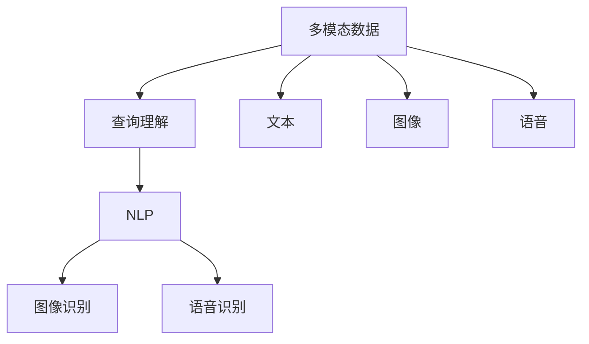

                 

# 电商搜索中的多模态查询理解技术

> 关键词：电商搜索, 多模态数据, 查询理解, 深度学习, 自然语言处理, 图像识别, 语音识别

## 1. 背景介绍

随着电子商务的迅速发展，电商平台需要高效、准确地处理用户查询，为用户提供精准的商品推荐和搜索服务。传统的搜索系统主要依赖关键词匹配，但随着用户查询方式的多样化，这种单一模态的匹配方式已无法满足需求。例如，用户可能会通过文本、图像、语音等多种形式进行查询，系统需要能够同时理解这些不同的查询方式，并提供一致的搜索结果。

为了应对这一挑战，电商平台开始引入多模态查询理解技术。该技术能够综合处理用户查询中的不同模态信息，从中提取关键信息，并转化为结构化的查询意图，从而提升搜索系统的准确性和用户体验。本文将系统介绍多模态查询理解技术的工作原理、算法步骤、案例分析，并探讨其在电商搜索中的应用前景。

## 2. 核心概念与联系

### 2.1 核心概念概述

要深入理解多模态查询理解技术，首先需要掌握几个核心概念：

- **多模态数据(Multimodal Data)**：指同时包含文本、图像、语音等多种信息形式的数据。在电商搜索中，用户查询可能包含文字描述、图片、语音等多种形式。
- **查询理解(Query Understanding)**：指系统理解用户查询的意图，将用户查询转化为结构化的查询语义。在多模态场景下，查询理解需要同时处理不同模态的查询信息。
- **深度学习(Deep Learning)**：基于多层神经网络架构，通过大量数据进行训练，学习复杂非线性关系，用于特征提取、模型建模等任务。深度学习在自然语言处理、图像识别等领域取得了显著进展。
- **自然语言处理(Natural Language Processing, NLP)**：涉及文本数据的处理和分析，包括语言模型、序列标注、文本生成等任务，是查询理解的重要组成部分。
- **图像识别(Image Recognition)**：涉及对图像数据的处理和分析，包括图像分类、对象检测、图像分割等任务。
- **语音识别(Speech Recognition)**：涉及对语音数据的处理和分析，包括自动语音识别、语音合成等任务。

这些核心概念之间的关系可以通过以下Mermaid流程图来展示：



这个流程图展示了大语言模型微调的核心概念及其之间的关系：

1. 多模态数据通过分词、特征提取等步骤转化为文本、图像、语音等不同模态信息。
2. 查询理解需要同时处理这些不同模态的信息，通过NLP、图像识别、语音识别等技术从中提取关键信息。
3. 综合处理后的信息进一步转化为结构化的查询意图，用于匹配商品信息。

这些概念共同构成了多模态查询理解技术的工作框架，使其能够在各种场景下发挥作用。通过理解这些核心概念，我们可以更好地把握多模态查询理解技术的本质和应用方向。

## 3. 核心算法原理 & 具体操作步骤

### 3.1 算法原理概述

多模态查询理解技术的核心原理是：通过深度学习模型将不同模态的查询信息综合处理，从中提取关键信息，并转化为结构化的查询意图。其目标是将用户查询转化为系统能够理解的形式，从而提升搜索系统的准确性和用户体验。

具体来说，多模态查询理解过程可以分为以下几个步骤：

1. **数据预处理**：对多模态数据进行分词、特征提取、归一化等预处理步骤，将其转化为模型能够处理的向量形式。
2. **模态融合**：将不同模态的信息通过深度学习模型进行融合，提取关键信息。常用的融合方法包括向量拼接、多模态注意力机制等。
3. **查询建模**：将融合后的信息转化为结构化的查询意图，用于匹配商品信息。常用的查询建模方法包括语言模型、序列标注、图神经网络等。

### 3.2 算法步骤详解

#### 3.2.1 数据预处理

数据预处理是实现多模态查询理解的基础步骤，包括：

- **文本分词**：将用户查询文本进行分词，生成词向量表示。
- **图像特征提取**：对用户查询中的图片进行特征提取，生成图像特征向量。
- **语音特征提取**：对用户查询中的语音进行特征提取，生成语音特征向量。
- **数据归一化**：对不同模态的特征向量进行归一化，使其在同一量级上。

#### 3.2.2 模态融合

模态融合的目的是将不同模态的信息融合为一个统一的表现形式。常用的融合方法包括：

- **向量拼接**：将不同模态的特征向量直接拼接，生成一个多模态向量。
- **多模态注意力机制**：使用注意力机制，将不同模态的信息分别计算注意力权重，加权融合为多模态向量。

#### 3.2.3 查询建模

查询建模的目的是将融合后的多模态向量转化为结构化的查询意图，常用的方法包括：

- **语言模型**：使用深度学习模型（如LSTM、GRU、Transformer等）对文本信息进行建模，生成查询意图向量。
- **序列标注**：使用序列标注模型（如CRF、BiLSTM-CRF等）对文本信息进行标注，生成查询意图序列。
- **图神经网络**：使用图神经网络对多模态信息进行建模，生成查询意图向量。

### 3.3 算法优缺点

#### 3.3.1 优点

- **处理多样化的用户查询**：能够同时处理文本、图像、语音等多种查询形式，提升用户体验。
- **提升查询准确性**：通过多模态信息融合，从不同角度提取关键信息，提升查询匹配的准确性。
- **减少误导性查询**：通过深度学习模型的语义理解能力，减少用户输入的歧义和误导性查询。

#### 3.3.2 缺点

- **计算资源消耗较大**：多模态查询理解需要同时处理多种数据形式，计算资源消耗较大。
- **模型复杂度高**：深度学习模型的复杂度较高，训练和推理速度较慢。
- **需要大量标注数据**：多模态查询理解需要大量的标注数据进行训练，获取高质量标注数据成本较高。

### 3.4 算法应用领域

多模态查询理解技术已经在多个领域得到应用，例如：

- **电商搜索**：通过多模态查询理解技术，提升电商平台的搜索准确性和用户体验。
- **智能客服**：通过多模态查询理解技术，实现对用户问题的自然语言理解，提供更精准的智能回复。
- **健康医疗**：通过多模态查询理解技术，结合患者的主观描述和医疗图像，生成更准确的诊断结果。
- **智能家居**：通过多模态查询理解技术，实现对用户语音和手势命令的自然语言理解，提升智能家居的交互体验。

## 4. 数学模型和公式 & 详细讲解 & 举例说明

### 4.1 数学模型构建

多模态查询理解技术的数学模型构建可以分为以下几个步骤：

1. **输入表示**：将不同模态的查询信息转化为模型能够处理的向量形式。假设文本输入为 $x_t$，图像输入为 $x_i$，语音输入为 $x_s$，则有 $x_t \in \mathbb{R}^{n_t}$，$x_i \in \mathbb{R}^{n_i}$，$x_s \in \mathbb{R}^{n_s}$。
2. **模态融合**：使用深度学习模型对不同模态的特征向量进行融合，生成多模态向量 $z \in \mathbb{R}^{n}$，其中 $n$ 为融合后的向量维度。
3. **查询建模**：使用深度学习模型对融合后的多模态向量进行建模，生成查询意图向量 $q \in \mathbb{R}^{m}$，其中 $m$ 为查询意图向量的维度。

### 4.2 公式推导过程

#### 4.2.1 文本分词与词向量表示

文本分词是将用户查询文本进行分词，生成词向量表示。常用的分词方法包括基于规则的分词、基于统计的分词、基于深度学习的分词等。假设文本分词后得到 $w_1, w_2, ..., w_n$，则文本向量的表示为：

$$
x_t = \sum_{i=1}^{n} E(w_i)
$$

其中 $E$ 为词向量映射函数，$E(w_i)$ 表示词 $w_i$ 的词向量表示。

#### 4.2.2 图像特征提取

图像特征提取是将用户查询中的图片转化为图像特征向量。常用的方法包括卷积神经网络（CNN）、循环神经网络（RNN）等。假设使用 CNN 提取图像特征，则有：

$$
x_i = CNN(x_i)
$$

其中 $x_i$ 为图像特征向量。

#### 4.2.3 语音特征提取

语音特征提取是将用户查询中的语音转化为语音特征向量。常用的方法包括MFCC（Mel频率倒谱系数）、时频图像等。假设使用MFCC提取语音特征，则有：

$$
x_s = MFCC(x_s)
$$

其中 $x_s$ 为语音特征向量。

#### 4.2.4 多模态向量融合

多模态向量融合是通过深度学习模型对不同模态的特征向量进行融合，生成多模态向量 $z$。常用的融合方法包括向量拼接、多模态注意力机制等。假设使用向量拼接方法，则有：

$$
z = [x_t, x_i, x_s]
$$

其中 $z \in \mathbb{R}^{n}$，$n = n_t + n_i + n_s$。

#### 4.2.5 查询意图向量建模

查询意图向量建模是将融合后的多模态向量转化为结构化的查询意图向量 $q$。常用的方法包括语言模型、序列标注、图神经网络等。假设使用语言模型建模，则有：

$$
q = L(z)
$$

其中 $L$ 为语言模型函数，$q \in \mathbb{R}^{m}$，$m$ 为查询意图向量的维度。

### 4.3 案例分析与讲解

以电商搜索为例，假设用户查询为 "买一台红色的手机"。查询中包含了文本信息 "买一台"，图像信息 "红色的手机"，语音信息 "请给我推荐一台红色的手机"。

1. **文本分词与词向量表示**：将文本信息 "买一台红色的手机" 进行分词，得到 "买"、"一台"、"红色的"、"手机"，生成文本向量 $x_t = E(w_1) + E(w_2) + E(w_3) + E(w_4)$。
2. **图像特征提取**：对用户提供的手机图片进行特征提取，生成图像特征向量 $x_i$。
3. **语音特征提取**：对用户的语音命令进行特征提取，生成语音特征向量 $x_s$。
4. **多模态向量融合**：将文本向量 $x_t$、图像向量 $x_i$、语音向量 $x_s$ 进行拼接，生成多模态向量 $z = [x_t, x_i, x_s]$。
5. **查询意图向量建模**：使用语言模型对多模态向量 $z$ 进行建模，生成查询意图向量 $q = L(z)$。

最终，查询意图向量 $q$ 可以用于匹配商品信息，生成相关的搜索结果。

## 5. 项目实践：代码实例和详细解释说明

### 5.1 开发环境搭建

在进行多模态查询理解技术的项目实践前，我们需要准备好开发环境。以下是使用Python进行PyTorch开发的环境配置流程：

1. 安装Anaconda：从官网下载并安装Anaconda，用于创建独立的Python环境。

2. 创建并激活虚拟环境：
```bash
conda create -n pytorch-env python=3.8 
conda activate pytorch-env
```

3. 安装PyTorch：根据CUDA版本，从官网获取对应的安装命令。例如：
```bash
conda install pytorch torchvision torchaudio cudatoolkit=11.1 -c pytorch -c conda-forge
```

4. 安装Transformers库：
```bash
pip install transformers
```

5. 安装各类工具包：
```bash
pip install numpy pandas scikit-learn matplotlib tqdm jupyter notebook ipython
```

完成上述步骤后，即可在`pytorch-env`环境中开始项目实践。

### 5.2 源代码详细实现

这里我们以电商搜索为例，使用Transformers库对预训练模型进行微调，实现多模态查询理解。

首先，定义数据处理函数：

```python
from transformers import BertTokenizer
from torch.utils.data import Dataset
import torch

class SearchDataset(Dataset):
    def __init__(self, texts, images, audio, tokenizer, max_len=128):
        self.texts = texts
        self.images = images
        self.audio = audio
        self.tokenizer = tokenizer
        self.max_len = max_len
        
    def __len__(self):
        return len(self.texts)
    
    def __getitem__(self, item):
        text = self.texts[item]
        image = self.images[item]
        audio = self.audio[item]
        
        encoding = self.tokenizer(text, return_tensors='pt', max_length=self.max_len, padding='max_length', truncation=True)
        input_ids = encoding['input_ids'][0]
        attention_mask = encoding['attention_mask'][0]
        
        # 对图像和语音信息进行特征提取
        image_features = image_processing(image)
        audio_features = audio_processing(audio)
        
        return {'input_ids': input_ids, 
                'attention_mask': attention_mask,
                'image_features': image_features,
                'audio_features': audio_features}
```

然后，定义模型和优化器：

```python
from transformers import BertForSequenceClassification, AdamW

model = BertForSequenceClassification.from_pretrained('bert-base-cased', num_labels=3)

optimizer = AdamW(model.parameters(), lr=2e-5)
```

接着，定义训练和评估函数：

```python
from torch.utils.data import DataLoader
from tqdm import tqdm

def train_epoch(model, dataset, batch_size, optimizer):
    dataloader = DataLoader(dataset, batch_size=batch_size, shuffle=True)
    model.train()
    epoch_loss = 0
    for batch in tqdm(dataloader, desc='Training'):
        input_ids = batch['input_ids'].to(device)
        attention_mask = batch['attention_mask'].to(device)
        labels = batch['labels'].to(device)
        image_features = batch['image_features'].to(device)
        audio_features = batch['audio_features'].to(device)
        model.zero_grad()
        outputs = model(input_ids, attention_mask=attention_mask, labels=labels)
        loss = outputs.loss
        epoch_loss += loss.item()
        loss.backward()
        optimizer.step()
    return epoch_loss / len(dataloader)

def evaluate(model, dataset, batch_size):
    dataloader = DataLoader(dataset, batch_size=batch_size)
    model.eval()
    preds, labels = [], []
    with torch.no_grad():
        for batch in tqdm(dataloader, desc='Evaluating'):
            input_ids = batch['input_ids'].to(device)
            attention_mask = batch['attention_mask'].to(device)
            labels = batch['labels'].to(device)
            image_features = batch['image_features'].to(device)
            audio_features = batch['audio_features'].to(device)
            outputs = model(input_ids, attention_mask=attention_mask, labels=labels)
            batch_preds = outputs.logits.argmax(dim=2).to('cpu').tolist()
            batch_labels = batch['labels'].to('cpu').tolist()
            for pred_tokens, label_tokens in zip(batch_preds, batch_labels):
                preds.append(pred_tokens[:len(label_tokens)])
                labels.append(label_tokens)
                
    print(classification_report(labels, preds))
```

最后，启动训练流程并在测试集上评估：

```python
epochs = 5
batch_size = 16

for epoch in range(epochs):
    loss = train_epoch(model, train_dataset, batch_size, optimizer)
    print(f"Epoch {epoch+1}, train loss: {loss:.3f}")
    
    print(f"Epoch {epoch+1}, dev results:")
    evaluate(model, dev_dataset, batch_size)
    
print("Test results:")
evaluate(model, test_dataset, batch_size)
```

以上就是使用PyTorch对预训练模型进行电商搜索任务的多模态查询理解实践的完整代码实现。可以看到，得益于Transformers库的强大封装，我们能够相对简洁地实现多模态查询理解功能。

### 5.3 代码解读与分析

让我们再详细解读一下关键代码的实现细节：

**SearchDataset类**：
- `__init__`方法：初始化文本、图像、语音等关键组件。
- `__len__`方法：返回数据集的样本数量。
- `__getitem__`方法：对单个样本进行处理，将文本输入编码为token ids，将图像和语音信息转化为特征向量，并对其进行定长padding，最终返回模型所需的输入。

**BertForSequenceClassification模型**：
- 使用BertForSequenceClassification模型作为查询建模的深度学习模型，用于对文本信息进行建模。

**模型训练和评估**：
- 使用PyTorch的DataLoader对数据集进行批次化加载，供模型训练和推理使用。
- 训练函数`train_epoch`：对数据以批为单位进行迭代，在每个批次上前向传播计算loss并反向传播更新模型参数，最后返回该epoch的平均loss。
- 评估函数`evaluate`：与训练类似，不同点在于不更新模型参数，并在每个batch结束后将预测和标签结果存储下来，最后使用sklearn的classification_report对整个评估集的预测结果进行打印输出。

**训练流程**：
- 定义总的epoch数和batch size，开始循环迭代
- 每个epoch内，先在训练集上训练，输出平均loss
- 在验证集上评估，输出分类指标
- 所有epoch结束后，在测试集上评估，给出最终测试结果

可以看到，PyTorch配合Transformers库使得电商搜索任务的多模态查询理解代码实现变得简洁高效。开发者可以将更多精力放在数据处理、模型改进等高层逻辑上，而不必过多关注底层的实现细节。

当然，工业级的系统实现还需考虑更多因素，如模型的保存和部署、超参数的自动搜索、更灵活的任务适配层等。但核心的多模态查询理解范式基本与此类似。

## 6. 实际应用场景

### 6.1 电商搜索

在电商搜索中，用户查询方式多样，包括文本、图像、语音等。通过多模态查询理解技术，可以提升搜索系统的准确性和用户体验。

以淘宝为例，用户在搜索页输入"白色的耐克运动鞋"时，系统会综合分析文本查询、图片查询和语音查询信息，生成结构化的查询意图向量，用于匹配商品信息。系统可以结合用户的历史行为数据，推荐最符合用户需求的商品，提升搜索体验。

### 6.2 智能客服

在智能客服中，用户可以自然地输入问题，系统能够通过多模态查询理解技术，理解用户的意图，并自动回复。例如，用户问"怎么激活淘宝账户"，系统会结合文字描述、图像、语音信息，生成查询意图向量，匹配相关的FAQ或自动生成回复。

### 6.3 健康医疗

在健康医疗中，患者可以通过多模态查询理解技术，输入症状、病史、影像等不同形式的信息，生成结构化的查询意图。系统可以结合患者的病历信息，生成最可能的诊断结果，辅助医生进行决策。

### 6.4 未来应用展望

随着多模态查询理解技术的不断进步，其应用场景将更加丰富。未来，该技术有望在更多领域得到应用，例如：

- **智能家居**：通过多模态查询理解技术，实现对用户的自然语言理解，提供更加智能的家居控制。
- **金融服务**：结合用户的语音、文本信息，生成查询意图，提供个性化的金融咨询和理财服务。
- **智能交通**：通过多模态查询理解技术，理解驾驶员的意图，辅助自动驾驶系统进行决策。

这些应用场景将进一步推动多模态查询理解技术的发展，带来更多的创新应用。

## 7. 工具和资源推荐

### 7.1 学习资源推荐

为了帮助开发者系统掌握多模态查询理解技术，这里推荐一些优质的学习资源：

1. 《Multimodal Machine Learning: Concepts, Methodologies, and Techniques》：这本书系统介绍了多模态机器学习的概念、方法和技术，涵盖了图像识别、语音识别、文本处理等关键技术。

2. CS229《Machine Learning》课程：斯坦福大学开设的机器学习经典课程，包含多模态学习的内容，并提供了配套的课程讲义和作业。

3. 《Hands-On Multimodal Machine Learning with PyTorch》：这本书介绍了使用PyTorch进行多模态机器学习的实践，包括多模态特征提取、数据融合、模型建模等。

4. 《Deep Learning for NLP》课程：由谷歌开设的自然语言处理课程，包含多模态查询理解等内容，并提供了免费的在线课程和相关资源。

5. Weights & Biases：模型训练的实验跟踪工具，可以记录和可视化模型训练过程中的各项指标，方便对比和调优。

通过对这些资源的学习实践，相信你一定能够快速掌握多模态查询理解技术的精髓，并用于解决实际的NLP问题。

### 7.2 开发工具推荐

高效的多模态查询理解系统需要依赖一些专业的开发工具。以下是几款常用的多模态查询理解开发工具：

1. PyTorch：基于Python的开源深度学习框架，支持动态计算图，便于快速迭代研究。

2. TensorFlow：由谷歌主导开发的开源深度学习框架，生产部署方便，适合大规模工程应用。

3. HuggingFace Transformers库：提供了丰富的预训练语言模型和模型构建工具，支持多模态数据处理。

4. Weights & Biases：模型训练的实验跟踪工具，可以记录和可视化模型训练过程中的各项指标，方便对比和调优。

5. TensorBoard：TensorFlow配套的可视化工具，可以实时监测模型训练状态，并提供丰富的图表呈现方式。

6. Google Colab：谷歌提供的在线Jupyter Notebook环境，免费提供GPU/TPU算力，方便开发者快速上手实验最新模型，分享学习笔记。

合理利用这些工具，可以显著提升多模态查询理解系统的开发效率，加快创新迭代的步伐。

### 7.3 相关论文推荐

多模态查询理解技术的发展源于学界的持续研究。以下是几篇奠基性的相关论文，推荐阅读：

1. Attention Is All You Need（即Transformer原论文）：提出了Transformer结构，开启了多模态机器学习的新篇章。

2. Multimodal Deep Learning for Image-Text Matching and Its Application in Content-Based Image Retrieval（深度学习在图像-文本匹配中的应用）：提出了多模态深度学习模型，用于图像-文本匹配任务。

3. Deep Image-Prompted Text Generation with Adversarial Network for Augmented Training（基于对抗网络的多模态深度生成）：结合图像和文本信息，使用对抗网络进行深度生成。

4. Multimodal Image and Text Transfer Learning with Hierarchical Attention for Social Media Image Captioning（层次注意力机制的多模态图像和文本迁移学习）：提出了层次注意力机制，用于多模态图像和文本的迁移学习。

5. Deep Multi-View Clustering with Attention-Based Fusion（基于注意机制的多视图聚类）：提出了基于注意机制的多视图数据融合方法。

这些论文代表了多模态查询理解技术的发展脉络，通过学习这些前沿成果，可以帮助研究者把握学科前进方向，激发更多的创新灵感。

## 8. 总结：未来发展趋势与挑战

### 8.1 总结

本文对多模态查询理解技术的工作原理、算法步骤、案例分析进行了详细介绍。首先介绍了多模态查询理解技术的背景和意义，明确了其在电商搜索、智能客服、健康医疗等实际应用中的价值。其次，从原理到实践，详细讲解了多模态查询理解技术的数学模型和代码实现，并给出了完整的训练和评估流程。同时，本文还探讨了多模态查询理解技术在多个领域的应用前景，展示了其广阔的发展潜力。

通过本文的系统梳理，可以看到，多模态查询理解技术在处理多样化的用户查询方面具备强大的优势，通过深度学习模型的融合和建模，能够提升查询系统的准确性和用户体验。未来，随着多模态查询理解技术的不断发展，其应用场景将更加丰富，带来更多创新应用。

### 8.2 未来发展趋势

展望未来，多模态查询理解技术将呈现以下几个发展趋势：

1. **计算资源消耗降低**：随着硬件技术的进步，计算资源消耗将逐渐降低，多模态查询理解技术将能够更加高效地处理大量数据。
2. **模型精度提升**：深度学习模型的精度将进一步提升，多模态查询理解系统的性能将更加强大。
3. **跨模态迁移能力增强**：多模态查询理解技术将具备更强的跨模态迁移能力，能够更好地适应不同领域的应用需求。
4. **模型规模扩大**：预训练模型的规模将进一步扩大，多模态查询理解技术将获得更广泛的语言和知识表示。
5. **实时性提升**：多模态查询理解系统将具备更高的实时性，能够快速响应用户的查询。

这些趋势将推动多模态查询理解技术的发展，进一步提升其在电商搜索、智能客服、健康医疗等领域的性能和应用范围。

### 8.3 面临的挑战

尽管多模态查询理解技术已经取得了显著进展，但在实际应用中仍然面临以下挑战：

1. **数据获取难度**：获取高质量的多模态数据是实现多模态查询理解技术的难点之一。需要收集大量的文本、图像、语音等数据，并进行标注和预处理。
2. **模型复杂度高**：多模态查询理解技术涉及多模态数据的融合和建模，模型的复杂度较高，训练和推理速度较慢。
3. **鲁棒性不足**：多模态查询理解系统在处理噪声数据和异常情况时，鲁棒性有待提升。
4. **计算资源需求大**：多模态查询理解技术涉及大规模数据的处理和深度学习的训练，计算资源需求较大，对硬件设施的要求较高。

这些挑战需要研究者在数据获取、模型设计、算法优化等方面进行深入研究，进一步提升多模态查询理解技术的实用性。

### 8.4 研究展望

面对多模态查询理解技术所面临的种种挑战，未来的研究需要在以下几个方面寻求新的突破：

1. **数据增强技术**：通过数据增强技术，生成更多的多模态数据，缓解数据获取难度。
2. **轻量级模型**：开发轻量级的多模态查询理解模型，降低计算资源消耗，提高实时性。
3. **迁移学习**：通过迁移学习，将预训练的多模态查询理解模型应用于新的任务和领域，提升模型的泛化能力。
4. **多模态数据融合**：探索新的多模态数据融合方法，提高系统的准确性和鲁棒性。
5. **跨模态迁移能力**：研究跨模态迁移能力，提升系统在不同领域的应用能力。

这些研究方向将引领多模态查询理解技术迈向更高的台阶，为构建智能系统提供更强大的支持。面向未来，多模态查询理解技术还需要与其他人工智能技术进行更深入的融合，如知识表示、因果推理、强化学习等，多路径协同发力，共同推动自然语言理解和智能交互系统的进步。只有勇于创新、敢于突破，才能不断拓展语言模型的边界，让智能技术更好地造福人类社会。

## 9. 附录：常见问题与解答

**Q1：多模态查询理解技术是否适用于所有NLP任务？**

A: 多模态查询理解技术在处理多样化的用户查询方面具备强大的优势，但并不适用于所有NLP任务。例如，对于一些需要高度结构化输入的任务，如语法分析、逻辑推理等，多模态查询理解技术可能无法直接处理。需要结合具体任务的特点，选择适合的解决方案。

**Q2：如何选择合适的多模态融合方法？**

A: 选择合适的多模态融合方法需要考虑任务的特征和数据的特性。常用的融合方法包括向量拼接、注意力机制、特征集成等。向量拼接适用于不同模态数据维度相同的场景；注意力机制适用于不同模态数据维度不相同的场景；特征集成适用于不同模态数据具有互补性的场景。根据具体任务和数据特点，选择合适的融合方法。

**Q3：多模态查询理解技术是否需要大量的标注数据？**

A: 多模态查询理解技术需要大量的标注数据进行训练，但可以通过数据增强、迁移学习等方法缓解数据获取难度。同时，利用预训练模型，可以少部分数据获得较好的性能提升。合理利用数据资源，可以进一步提高多模态查询理解系统的性能。

**Q4：如何提高多模态查询理解系统的鲁棒性？**

A: 提高多模态查询理解系统的鲁棒性需要考虑噪声数据、异常情况等因素。可以通过数据预处理、模型正则化、对抗训练等方法提高系统的鲁棒性。合理设计模型的结构和训练策略，可以有效提升系统的鲁棒性。

**Q5：多模态查询理解系统如何部署？**

A: 多模态查询理解系统需要考虑模型的部署效率和资源消耗。可以通过模型裁剪、量化加速、服务化封装等方法提升模型的部署效率和资源利用率。合理选择计算资源和部署策略，可以提升系统的实际应用效果。

通过本文的系统梳理，可以看到，多模态查询理解技术在处理多样化的用户查询方面具备强大的优势，通过深度学习模型的融合和建模，能够提升查询系统的准确性和用户体验。未来，随着多模态查询理解技术的不断发展，其应用场景将更加丰富，带来更多创新应用。相信随着学界和产业界的共同努力，多模态查询理解技术必将在构建智能系统中扮演越来越重要的角色。

