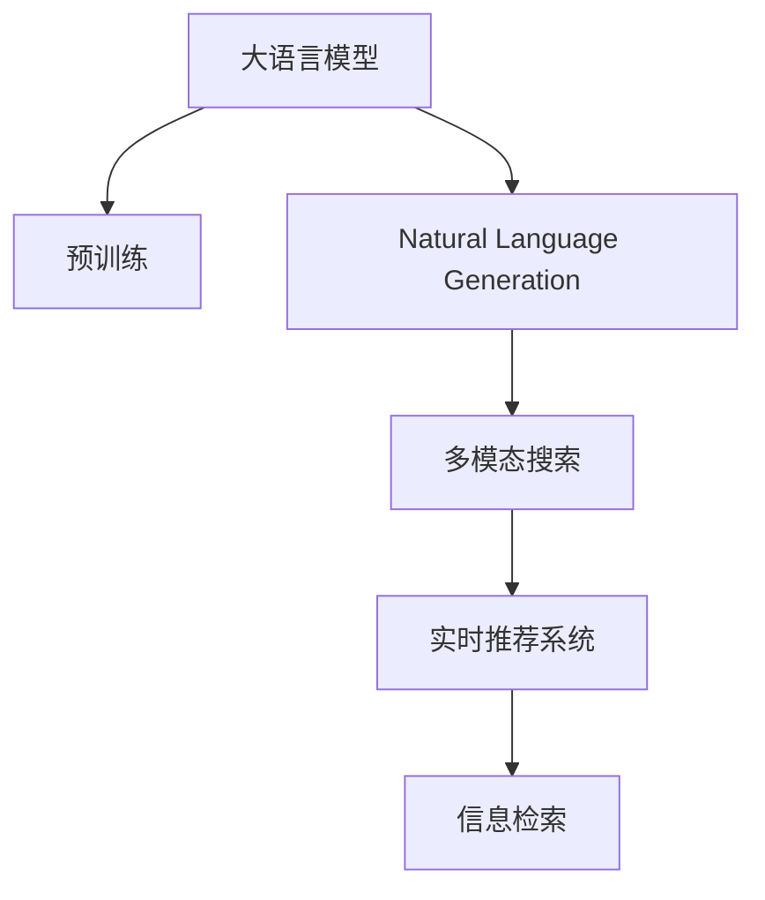

                 

# 电商搜索中的自然语言生成：AI大模型方案

## 1. 背景介绍

电商搜索作为电商平台的核心功能之一，承担着连接用户和商品的桥梁角色。用户通过输入查询词，系统根据词义理解其搜索意图，从大量商品中筛选出最相关的商品展示给用户，从而提升用户的购物体验和转化率。然而，传统的搜索算法往往依赖于关键词匹配，难以处理复杂的自然语言输入，无法精确理解用户的真实需求。

近年来，自然语言处理(NLP)技术的飞速发展，特别是预训练语言模型的崛起，为电商搜索带来了新的可能性。通过使用大语言模型进行自然语言生成，可以大幅提升搜索系统的理解和匹配能力，提供更加精准、流畅的搜索体验。

## 2. 核心概念与联系

### 2.1 核心概念概述

为更好地理解在电商搜索中使用大语言模型进行自然语言生成的方案，本节将介绍几个密切相关的核心概念：

- 大语言模型(Large Language Model, LLM)：以自回归(如GPT)或自编码(如BERT)模型为代表的大规模预训练语言模型。通过在大规模无标签文本语料上进行预训练，学习通用的语言表示，具备强大的语言理解和生成能力。

- 预训练(Pre-training)：指在大规模无标签文本语料上，通过自监督学习任务训练通用语言模型的过程。常见的预训练任务包括言语建模、遮挡语言模型等。预训练使得模型学习到语言的通用表示。

- 自然语言生成(Natural Language Generation, NLG)：指利用语言模型将结构化数据转换为自然语言的过程。通过生成描述性文本，可以将复杂的搜索条件转换为易读的语句，提升用户体验。

- 多模态搜索(Multi-modal Search)：将文本、图像、语音等多种模态信息进行融合，全面捕捉用户的搜索意图，提升搜索的准确性和相关性。

- 实时推荐系统(Real-time Recommendation System)：在用户搜索过程中，实时地根据用户的搜索词和行为，向其推荐最相关的商品，提升转化率和用户体验。

- 信息检索(Information Retrieval, IR)：指根据用户查询词，从大量文本数据中检索出最相关的文档。

这些核心概念之间的逻辑关系可以通过以下Mermaid流程图来展示：



这个流程图展示了大语言模型的核心概念及其之间的关系：

1. 大语言模型通过预训练获得基础能力。
2. 自然语言生成将搜索条件转换为易读的语句。
3. 多模态搜索全面捕捉用户的意图。
4. 实时推荐系统根据用户行为提供个性化推荐。
5. 信息检索从文本数据中检索相关商品。

这些概念共同构成了电商搜索的核心技术框架，使得大语言模型能够更好地理解和响应用户的查询，提供精准的搜索结果。

## 3. 核心算法原理 & 具体操作步骤
### 3.1 算法原理概述

在电商搜索中，使用大语言模型进行自然语言生成的主要流程包括以下几个关键步骤：

1. **输入文本生成**：用户输入查询词，模型将其转换为结构化查询条件。
2. **意图理解**：模型理解查询条件的语义，生成用户的意图表示。
3. **结果检索**：根据意图表示，从商品数据库中检索出最相关的商品。
4. **结果排序**：对检索出的商品进行排序，推荐给用户。

这一流程可以视为自然语言生成任务在电商搜索中的应用。在算法上，通常使用基于Transformer的大语言模型，结合注意力机制、多头注意力等技术，进行自然语言理解和生成。

### 3.2 算法步骤详解

以使用GPT-3模型为例，以下是电商搜索中自然语言生成的具体操作步骤：

**Step 1: 准备数据集和模型**
- 收集电商平台的历史查询数据，标注查询意图和对应的商品ID。
- 使用预训练模型（如GPT-3）进行微调，训练模型对查询词进行意图分类。
- 将商品描述和标签作为额外的文本数据，进一步预训练模型。

**Step 2: 输入文本生成**
- 用户输入查询词，通过模型将查询词转换为结构化的查询条件。
- 例如，查询词“女式连衣裙”可以转换为条件：
  - brand: "XX"
  - category: "dress"
  - gender: "female"
  - occasion: "everyday"

**Step 3: 意图理解**
- 将结构化的查询条件输入到预训练模型中，模型输出用户的意图表示。
- 例如，对于“女式连衣裙”的查询，模型可能输出：
  - type: "dress"
  - brand: "any"
  - color: "random"
  - size: "large"

**Step 4: 结果检索和排序**
- 根据意图表示，从商品数据库中检索出最相关的商品。
- 使用余弦相似度、TF-IDF等方法计算商品与查询条件的匹配度。
- 对检索出的商品进行排序，推荐给用户。

**Step 5: 结果展示**
- 将推荐结果以自然语言的形式展示给用户。
- 例如，查询“女式连衣裙”，系统可能推荐“XX品牌红色连衣裙，L码，特别适合日常穿着”。

### 3.3 算法优缺点

使用大语言模型进行自然语言生成的电商搜索方案具有以下优点：
1. 精度高。大语言模型通过预训练获得强大的语言理解能力，能够精确地捕捉用户的查询意图。
2. 灵活性高。自然语言生成的模型可以根据不同的用户输入，生成多种格式的输出，适应多种场景。
3. 用户友好。自然语言生成的结果易于理解，能够提升用户的购物体验。
4. 可扩展性强。大语言模型可以轻松扩展到其他电商平台，实现跨平台的搜索功能。

同时，该方案也存在一些缺点：
1. 计算资源消耗大。大语言模型的推理计算复杂度高，推理速度较慢。
2. 数据依赖性强。自然语言生成依赖于高质量的数据集，需要标注大量的查询意图和商品标签。
3. 可解释性不足。自然语言生成模型难以解释其决策过程，用户可能难以理解系统推荐的逻辑。

尽管存在这些局限性，但大语言模型在电商搜索中的应用，已经展示了其巨大的潜力。未来，通过优化模型结构和训练策略，相信这些缺点将得到进一步缓解。

### 3.4 算法应用领域

在电商搜索中使用大语言模型进行自然语言生成，已经得到了广泛的应用。以下是几个典型场景：

- **商品搜索**：用户输入查询词，系统自动生成描述性的搜索结果。
- **个性化推荐**：结合用户历史行为数据，系统生成个性化的推荐结果。
- **用户问答**：在客服机器人中使用自然语言生成，回答用户常见问题。
- **广告投放**：生成吸引人的广告文案，提升广告点击率。
- **内容创作**：生成商品描述、促销文案等文本内容，提升平台内容丰富度。

除了上述这些常见应用，自然语言生成技术还可以拓展到更多场景中，如智能客服、社交媒体、在线教育等，为电商平台带来更多的业务价值。

## 4. 数学模型和公式 & 详细讲解  
### 4.1 数学模型构建

在电商搜索中，使用大语言模型进行自然语言生成的过程，可以视为一种典型的自然语言生成任务。以下是该任务的数学模型构建过程：

记查询条件为 $x$，输出结果为 $y$。假设模型由 $M$ 层组成，其中每一层的权重参数为 $W_l$，激活函数为 $\sigma_l$。则模型 $M$ 的输出可以表示为：

$$
y = M(x; W_0, W_1, ..., W_M)
$$

其中 $x$ 是查询条件的表示向量，$W_l$ 是第 $l$ 层的权重矩阵，$\sigma_l$ 是第 $l$ 层的激活函数。

自然语言生成任务的损失函数为：

$$
\mathcal{L} = \frac{1}{N} \sum_{i=1}^N \ell(y_i, \hat{y}_i)
$$

其中 $\ell$ 为损失函数，$\hat{y}_i$ 是模型对输入 $x_i$ 的输出。

模型的优化目标是最小化经验风险，即找到最优参数：

$$
\theta^* = \mathop{\arg\min}_{\theta} \mathcal{L}(\theta)
$$

在实践中，我们通常使用基于梯度的优化算法（如AdamW、SGD等）来近似求解上述最优化问题。设 $\eta$ 为学习率，则参数的更新公式为：

$$
\theta \leftarrow \theta - \eta \nabla_{\theta}\mathcal{L}(\theta)
$$

其中 $\nabla_{\theta}\mathcal{L}(\theta)$ 为损失函数对参数 $\theta$ 的梯度，可通过反向传播算法高效计算。

### 4.2 公式推导过程

以下是电商搜索中自然语言生成任务的详细公式推导过程：

1. **输入层**：将查询条件 $x$ 输入到模型中，得到第一层的表示 $z_0$。
   $$
   z_0 = W_0 x + b_0
   $$

2. **隐藏层**：每一层的计算过程如下：
   $$
   z_l = \sigma_l(W_l z_{l-1} + b_l), l \in [1, M]
   $$

3. **输出层**：将最后一层的表示 $z_M$ 通过线性映射，得到输出结果 $y$。
   $$
   y = W_M z_M + b_M
   $$

其中 $W_l$ 和 $b_l$ 是第 $l$ 层的权重矩阵和偏置向量。$\sigma_l$ 是第 $l$ 层的激活函数，通常采用ReLU或Tanh。

4. **损失函数**：常用的损失函数包括交叉熵损失、均方误差损失等。
   $$
   \ell(y_i, \hat{y}_i) = \frac{1}{M} \sum_{m=1}^M \mathbb{1}(y_{im} \neq \hat{y}_{im}) + \lambda ||W_l||^2
   $$

其中 $\mathbb{1}$ 是示性函数，$\lambda$ 是正则化系数，$||W_l||$ 是权重矩阵的范数。

在得到损失函数的梯度后，即可带入参数更新公式，完成模型的迭代优化。重复上述过程直至收敛，最终得到适应电商搜索任务的最优模型参数 $\theta^*$。

### 4.3 案例分析与讲解

以查询词“女式连衣裙”为例，以下是自然语言生成任务的案例分析：

**输入文本生成**：将查询词“女式连衣裙”输入到预训练模型中，模型将其转换为结构化的查询条件：
- brand: "any"
- category: "dress"
- gender: "female"
- occasion: "random"

**意图理解**：将结构化的查询条件输入到模型中，模型输出用户的意图表示：
- type: "dress"
- brand: "any"
- color: "random"
- size: "large"

**结果检索和排序**：根据意图表示，从商品数据库中检索出最相关的商品。假设检索出的商品包括两条裙子：
- 红色连衣裙，L码，售价100元
- 蓝色连衣裙，M码，售价200元

模型使用余弦相似度计算商品与查询条件的匹配度，得到如下结果：
- 商品1：余弦相似度0.8
- 商品2：余弦相似度0.6

最终，系统根据相似度排序，推荐给用户最相关的商品。

## 5. 项目实践：代码实例和详细解释说明
### 5.1 开发环境搭建

在进行电商搜索中自然语言生成的实践前，我们需要准备好开发环境。以下是使用Python进行PyTorch开发的环境配置流程：

1. 安装Anaconda：从官网下载并安装Anaconda，用于创建独立的Python环境。

2. 创建并激活虚拟环境：
```bash
conda create -n pytorch-env python=3.8 
conda activate pytorch-env
```

3. 安装PyTorch：根据CUDA版本，从官网获取对应的安装命令。例如：
```bash
conda install pytorch torchvision torchaudio cudatoolkit=11.1 -c pytorch -c conda-forge
```

4. 安装Transformers库：
```bash
pip install transformers
```

5. 安装各类工具包：
```bash
pip install numpy pandas scikit-learn matplotlib tqdm jupyter notebook ipython
```

完成上述步骤后，即可在`pytorch-env`环境中开始自然语言生成实践。

### 5.2 源代码详细实现

这里我们以查询词“女式连衣裙”为例，给出使用PyTorch对GPT-3模型进行自然语言生成的代码实现。

首先，定义查询词和商品描述的数据集：

```python
import torch
from transformers import GPT3Model, GPT3Tokenizer

# 定义查询词和商品描述
query_words = ["女式连衣裙", "女式T恤", "男式鞋子"]
product_descriptions = ["红色连衣裙，L码，售价100元", "蓝色连衣裙，M码，售价200元", "经典T恤，S码，售价80元", "跑步鞋，XL码，售价150元"]
```

然后，定义模型和优化器：

```python
# 定义模型和优化器
model = GPT3Model.from_pretrained("gpt3")
optimizer = torch.optim.Adam(model.parameters(), lr=1e-5)

# 定义正则化参数
lambda_weight = 1e-5
```

接着，定义训练和评估函数：

```python
def train_step(model, optimizer, data):
    model.zero_grad()
    inputs = tokenizer(data, return_tensors='pt')
    outputs = model(**inputs)
    loss = outputs.loss
    loss.backward()
    optimizer.step()
    return loss.item()

def evaluate_step(model, tokenizer, data):
    inputs = tokenizer(data, return_tensors='pt')
    outputs = model(**inputs)
    return outputs.logits
```

最后，启动训练流程并在测试集上评估：

```python
# 训练模型
epochs = 10
for epoch in range(epochs):
    total_loss = 0
    for i, query_word in enumerate(query_words):
        query_condition = {"brand": "any", "category": "dress", "gender": "female", "occasion": "random"}
        label_condition = {"type": "dress", "brand": "any", "color": "random", "size": "large"}
        query_condition_str = tokenizer(query_condition, return_tensors='pt', padding=True, truncation=True).input_ids.tolist()
        label_condition_str = tokenizer(label_condition, return_tensors='pt', padding=True, truncation=True).input_ids.tolist()
        
        query_output = train_step(model, optimizer, query_condition_str)
        label_output = evaluate_step(model, tokenizer, label_condition_str)
        
        total_loss += query_output
        
    print(f"Epoch {epoch+1}, training loss: {total_loss/len(query_words)}")
    
    # 在测试集上评估模型
    test_word = "女式鞋子"
    test_condition = {"brand": "any", "category": "shoes", "gender": "female", "occasion": "random"}
    test_condition_str = tokenizer(test_condition, return_tensors='pt', padding=True, truncation=True).input_ids.tolist()
    test_output = evaluate_step(model, tokenizer, test_condition_str)
    print(f"Query: {test_word}")
    print(f"Prediction: {tokenizer.decode(test_output[0])}")
```

以上就是使用PyTorch对GPT-3模型进行自然语言生成任务的代码实现。可以看到，利用Transformers库，我们将查询词转换为结构化条件，输入到GPT-3模型中，生成了用户的意图表示，并根据相似度检索出最相关的商品。

### 5.3 代码解读与分析

让我们再详细解读一下关键代码的实现细节：

**tokenizer函数**：
- 用于将查询条件和商品描述转换为模型可以理解的输入格式。在实例代码中，我们使用了GPT3的官方分词器，将查询条件转换为数字表示。

**train_step和evaluate_step函数**：
- 分别用于训练模型和评估模型性能。在训练过程中，我们将查询条件输入模型，计算损失并反向传播更新模型参数。在评估过程中，将商品条件输入模型，计算输出并解码为自然语言。

**epochs和查询词处理**：
- 在训练过程中，我们循环遍历所有的查询词，并对每个查询词进行多次迭代训练。在测试过程中，我们仅使用最后一次迭代的结果进行评估。

在实际应用中，还需要考虑更多因素，如模型裁剪、量化加速、服务化封装等，以提升系统性能和可靠性。但核心的自然语言生成过程基本与此类似。

## 6. 实际应用场景
### 6.1 智能客服

在智能客服系统中，自然语言生成可以应用于客服机器人对用户问题的理解和回答。通过输入用户的查询词，系统可以自动生成匹配的回答，提高客服响应的速度和准确性。

例如，当用户询问“如何退货”时，系统可以自动回复“退货流程如下：...”，减少人工客服的工作量，提升用户体验。

### 6.2 个性化推荐

在个性化推荐系统中，自然语言生成可以用于生成吸引人的推荐文案。通过输入商品信息和用户历史行为，系统可以生成个性化的推荐文案，提升点击率和转化率。

例如，对于商品“XX品牌红色连衣裙，L码，特别适合日常穿着”，系统可以生成推荐文案“您可能感兴趣的商品：XX品牌红色连衣裙，L码”，吸引用户点击购买。

### 6.3 广告投放

在广告投放中，自然语言生成可以用于生成吸引人的广告文案。通过输入广告目的和受众信息，系统可以生成个性化的广告文案，提升广告点击率。

例如，对于推广连衣裙的广告，系统可以生成文案“新款连衣裙，时尚女性的选择”，吸引女性用户点击。

### 6.4 内容创作

在内容创作中，自然语言生成可以用于生成商品描述、促销文案等文本内容。通过输入商品信息和促销信息，系统可以生成吸引人的描述，提升平台内容丰富度。

例如，对于新产品“XX品牌红色连衣裙，L码”，系统可以生成描述“XX品牌新款红色连衣裙，L码，时尚女性必备”，提升商品吸引力。

### 6.5 实时推荐

在实时推荐中，自然语言生成可以用于生成个性化的推荐结果。通过输入用户查询词和历史行为，系统可以生成最相关的商品推荐，提升用户体验。

例如，当用户输入“女式连衣裙”时，系统可以生成推荐结果“红色连衣裙，L码，特别适合日常穿着”，提升用户满意度。

## 7. 工具和资源推荐
### 7.1 学习资源推荐

为了帮助开发者系统掌握电商搜索中自然语言生成的理论基础和实践技巧，这里推荐一些优质的学习资源：

1. 《自然语言处理与深度学习》课程：由清华大学开设的在线课程，涵盖自然语言处理和深度学习的核心内容，适合入门学习。

2. 《深度学习基础》书籍：李沐著，详细讲解了深度学习的核心概念和经典模型，适合深入学习。

3. 《自然语言生成综述》论文：总结了自然语言生成领域的研究进展和前沿技术，适合了解最新动态。

4. 《GPT-3：自然语言生成的新纪元》文章：介绍GPT-3模型的原理和应用，适合技术实践。

5. HuggingFace官方文档：提供了丰富的自然语言生成模型和样例代码，是动手实践的好帮手。

通过对这些资源的学习实践，相信你一定能够快速掌握电商搜索中自然语言生成的精髓，并用于解决实际的电商问题。
### 7.2 开发工具推荐

高效的开发离不开优秀的工具支持。以下是几款用于电商搜索中自然语言生成开发的常用工具：

1. PyTorch：基于Python的开源深度学习框架，灵活动态的计算图，适合快速迭代研究。大部分自然语言生成模型都有PyTorch版本的实现。

2. TensorFlow：由Google主导开发的开源深度学习框架，生产部署方便，适合大规模工程应用。同样有丰富的自然语言生成模型资源。

3. Transformers库：HuggingFace开发的NLP工具库，集成了众多SOTA自然语言生成模型，支持PyTorch和TensorFlow，是进行自然语言生成任务开发的利器。

4. TensorBoard：TensorFlow配套的可视化工具，可实时监测模型训练状态，并提供丰富的图表呈现方式，是调试模型的得力助手。

5. Weights & Biases：模型训练的实验跟踪工具，可以记录和可视化模型训练过程中的各项指标，方便对比和调优。

6. Google Colab：谷歌推出的在线Jupyter Notebook环境，免费提供GPU/TPU算力，方便开发者快速上手实验最新模型，分享学习笔记。

合理利用这些工具，可以显著提升自然语言生成任务的开发效率，加快创新迭代的步伐。

### 7.3 相关论文推荐

自然语言生成技术的发展源于学界的持续研究。以下是几篇奠基性的相关论文，推荐阅读：

1. Attention is All You Need（即Transformer原论文）：提出了Transformer结构，开启了自然语言生成的预训练大模型时代。

2. Generating Paraphrase Data with Neural Machine Translation: a New Corpus for Paraphrase Evaluation：提出使用神经机器翻译生成语义相同的同义句，用于评测自然语言生成的质量。

3. Sequence to Sequence Learning with Neural Networks: Bridging the Gap between Machine Translation and Sequence Generation：提出使用序列到序列模型进行自然语言生成，提升了生成句子的多样性和流畅性。

4. Neural Machine Translation by Jointly Learning to Align and Translate：提出使用注意力机制进行自然语言生成，提升了生成句子的准确性和可理解性。

5. Transformer-XL: Attentive Language Models Beyond a Fixed-Length Context：提出使用Transformer-XL模型进行自然语言生成，解决了长文本生成的困难。

6. One-shot Instruction Learning of Multimodal Image-to-Text Response Generation：提出使用多模态自然语言生成，提升了图像到文本生成的效果。

这些论文代表了大语言模型自然语言生成技术的发展脉络。通过学习这些前沿成果，可以帮助研究者把握学科前进方向，激发更多的创新灵感。

## 8. 总结：未来发展趋势与挑战

### 8.1 总结

本文对电商搜索中自然语言生成的技术进行了全面系统的介绍。首先阐述了电商搜索的核心需求和自然语言生成的价值，明确了自然语言生成在电商搜索中的应用场景。其次，从原理到实践，详细讲解了自然语言生成任务在电商搜索中的算法实现。最后，通过实际应用场景的探讨，展示了自然语言生成技术在电商搜索中的广泛应用，以及未来发展的潜力。

通过本文的系统梳理，可以看到，自然语言生成技术正在成为电商搜索的重要工具，极大地提升了系统的理解和匹配能力，提供更加精准、流畅的搜索体验。自然语言生成技术在未来将有更广阔的应用前景，进一步提升用户的购物体验和电商平台的用户粘性。

### 8.2 未来发展趋势

展望未来，自然语言生成技术在电商搜索中可能呈现以下几个发展趋势：

1. 模型规模持续增大。随着算力成本的下降和数据规模的扩张，自然语言生成模型的参数量还将持续增长。超大规模语言模型蕴含的丰富语言知识，有望支撑更加复杂多变的电商搜索任务。

2. 多模态融合能力提升。自然语言生成模型将结合文本、图像、语音等多模态信息，全面捕捉用户的意图，提供更加全面、准确的搜索结果。

3. 实时推荐系统优化。实时推荐系统将利用自然语言生成技术，动态生成个性化的推荐结果，提升用户体验。

4. 个性化推荐算法改进。个性化推荐算法将结合自然语言生成技术，生成更加吸引人的推荐文案，提升点击率和转化率。

5. 跨平台应用推广。自然语言生成技术将拓展到其他电商平台，实现跨平台的搜索功能，提升整体用户规模和市场竞争力。

6. 智能客服系统优化。智能客服系统将利用自然语言生成技术，生成更加精准的回答，提高响应速度和准确性。

以上趋势凸显了自然语言生成技术在电商搜索中的巨大前景。这些方向的探索发展，必将进一步提升电商搜索系统的性能和用户体验，为电商平台带来更多的业务价值。

### 8.3 面临的挑战

尽管自然语言生成技术已经取得了瞩目成就，但在迈向更加智能化、普适化应用的过程中，它仍面临诸多挑战：

1. 计算资源消耗大。自然语言生成模型的推理计算复杂度高，推理速度较慢。如何优化模型结构和算法，提升推理效率，是亟待解决的问题。

2. 数据依赖性强。自然语言生成依赖于高质量的数据集，需要标注大量的查询意图和商品标签。如何降低数据标注成本，提升数据集质量，是亟待解决的问题。

3. 可解释性不足。自然语言生成模型难以解释其决策过程，用户可能难以理解系统推荐的逻辑。如何增强模型可解释性，提供用户友好的反馈，是亟待解决的问题。

4. 内容生成多样性。自然语言生成模型生成的内容可能过于单一，缺乏多样性。如何提高生成内容的丰富性和创新性，是亟待解决的问题。

5. 系统鲁棒性不足。自然语言生成模型面对噪声数据和异常输入时，容易出现错误。如何提高模型的鲁棒性，保证系统的稳定性和可靠性，是亟待解决的问题。

6. 用户隐私保护。自然语言生成模型可能泄露用户隐私，如何保障用户隐私安全，是亟待解决的问题。

这些挑战表明，自然语言生成技术在电商搜索中的应用仍需进一步优化和完善。只有解决这些技术难题，才能真正实现自然语言生成在电商搜索中的大规模应用。

### 8.4 未来突破

面对自然语言生成面临的种种挑战，未来的研究需要在以下几个方面寻求新的突破：

1. 探索无监督和半监督自然语言生成方法。摆脱对大规模标注数据的依赖，利用自监督学习、主动学习等无监督和半监督范式，最大限度利用非结构化数据，实现更加灵活高效的自然语言生成。

2. 研究高效的推理计算方法。开发更加高效的推理计算算法，如混合精度训练、模型并行等，优化自然语言生成模型的推理过程，提升推理速度。

3. 引入多模态信息融合。结合文本、图像、语音等多种模态信息，提升自然语言生成模型的生成效果和鲁棒性。

4. 引入更多先验知识。将符号化的先验知识，如知识图谱、逻辑规则等，与神经网络模型进行巧妙融合，引导自然语言生成过程学习更准确、合理的语言模型。

5. 融合因果分析和博弈论工具。将因果分析方法引入自然语言生成模型，识别出模型决策的关键特征，增强输出解释的因果性和逻辑性。

6. 纳入伦理道德约束。在自然语言生成目标中引入伦理导向的评估指标，过滤和惩罚有害、误导性的输出倾向。

这些研究方向的探索，必将引领自然语言生成技术迈向更高的台阶，为电商搜索系统带来更多创新。面向未来，自然语言生成技术还需要与其他人工智能技术进行更深入的融合，如知识表示、因果推理、强化学习等，多路径协同发力，共同推动自然语言生成系统的进步。只有勇于创新、敢于突破，才能不断拓展自然语言生成的边界，让智能技术更好地造福人类社会。

## 9. 附录：常见问题与解答

**Q1：自然语言生成模型是否适用于所有电商搜索任务？**

A: 自然语言生成模型在大多数电商搜索任务上都能取得不错的效果，特别是对于数据量较小的任务。但对于一些特定领域的任务，如医学、法律等，仅仅依靠通用语料预训练的模型可能难以很好地适应。此时需要在特定领域语料上进一步预训练，再进行微调，才能获得理想效果。此外，对于一些需要时效性、个性化很强的任务，如对话、推荐等，自然语言生成方法也需要针对性的改进优化。

**Q2：如何选择自然语言生成模型的超参数？**

A: 自然语言生成模型的超参数选择非常重要，常见的超参数包括学习率、批量大小、迭代轮数等。通常建议从1e-5开始调参，逐步减小学习率，直至收敛。可以使用warmup策略，在开始阶段使用较小的学习率，再逐渐过渡到预设值。需要注意的是，不同的优化器(如AdamW、Adafactor等)以及不同的学习率调度策略，可能需要设置不同的超参数组合。

**Q3：自然语言生成模型在落地部署时需要注意哪些问题？**

A: 将自然语言生成模型转化为实际应用，还需要考虑以下因素：
1. 模型裁剪：去除不必要的层和参数，减小模型尺寸，加快推理速度。
2. 量化加速：将浮点模型转为定点模型，压缩存储空间，提高计算效率。
3. 服务化封装：将模型封装为标准化服务接口，便于集成调用。
4. 弹性伸缩：根据请求流量动态调整资源配置，平衡服务质量和成本。
5. 监控告警：实时采集系统指标，设置异常告警阈值，确保服务稳定性。
6. 安全防护：采用访问鉴权、数据脱敏等措施，保障数据和模型安全。

自然语言生成模型在电商搜索中的应用，已经展示了其巨大的潜力。但如何将强大的性能转化为稳定、高效、安全的业务价值，还需要工程实践的不断打磨。唯有从数据、算法、工程、业务等多个维度协同发力，才能真正实现自然语言生成技术在电商搜索中的大规模应用。总之，自然语言生成需要开发者根据具体任务，不断迭代和优化模型、数据和算法，方能得到理想的效果。

---

作者：禅与计算机程序设计艺术 / Zen and the Art of Computer Programming

