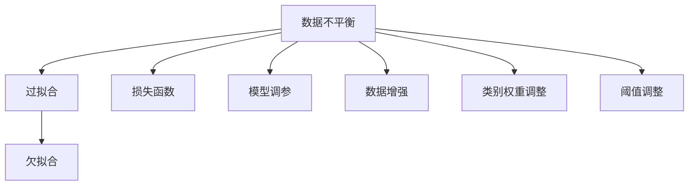

                 

# 电商搜索推荐中的AI大模型数据不平衡问题解决方案应用指南

## 1. 背景介绍

在电商搜索推荐领域，AI大模型通过学习海量用户行为数据，为消费者推荐个性化的商品。然而，这些数据集往往存在显著的数据不平衡问题，即一些类别的数据远多于其他类别，导致模型对少数类别的预测能力较弱。例如，在推荐系统中，用户点击“查看详情”的操作远多于购买操作，导致模型在预测购买行为时面临较高的误判率。如何有效应对数据不平衡问题，提升AI大模型的推荐准确性，成为当前研究的热点问题。

### 1.1 数据不平衡问题的现象

电商搜索推荐中的数据不平衡现象主要体现在以下几个方面：

- **点击-购买数据不平衡**：点击（浏览）操作远多于购买操作，导致模型对购买行为预测准确度不高。
- **用户画像不平衡**：不同用户的行为数据差异大，少数用户可能存在大量的点击行为，而其他用户则几乎没有点击记录，导致用户画像的信息量不平衡。
- **商品类别不平衡**：某些热门商品类别拥有大量的用户行为数据，而冷门商品类别则数据稀缺，模型难以对冷门商品进行准确推荐。

### 1.2 数据不平衡问题的影响

数据不平衡问题对推荐系统的影响主要体现在以下方面：

- **模型偏差**：由于数据不平衡，模型倾向于预测高频行为，而对低频行为的预测能力较弱，导致推荐结果的偏差。
- **性能下降**：由于少数类别样本的稀缺性，模型训练过程中容易出现过拟合，少数类别样本的损失函数在损失函数中占比较小，难以充分学习。
- **推荐公平性**：数据不平衡导致模型对不同类别的用户或商品进行推荐时，公平性不足，少数类别商品可能被低估，无法获得足够曝光机会。

## 2. 核心概念与联系

### 2.1 核心概念概述

为更好地理解数据不平衡问题的应对策略，本节将介绍几个核心概念及其之间的联系：

- **数据不平衡（Data Imbalance）**：指数据集中各类别的样本分布不均衡，某些类别的样本数量远多于其他类别。
- **过拟合（Overfitting）**：指模型在训练集上表现良好，但在测试集或未见过的数据上表现较差的现象。数据不平衡问题容易引发过拟合，尤其是当少数类别样本稀缺时。
- **欠拟合（Underfitting）**：指模型无法充分捕捉数据的复杂性，导致模型泛化能力不足。
- **损失函数（Loss Function）**：衡量模型预测值与真实值之间差异的函数，用于指导模型参数优化。数据不平衡问题会影响损失函数的设计。
- **模型调参（Model Tuning）**：通过调整模型参数，提升模型性能。数据不平衡问题需要进行针对性的参数调优。
- **数据增强（Data Augmentation）**：通过变换数据集的方式，增加少数类别样本的数量，改善数据不平衡问题。
- **类别权重调整（Class Weighting）**：在训练过程中，对不同类别的样本赋予不同的权重，以提高少数类别的学习效率。
- **阈值调整（Threshold Tuning）**：在模型预测时，调整分类阈值，以平衡不同类别的预测结果。

这些概念之间的逻辑关系可以通过以下Mermaid流程图来展示：



这个流程图展示了大语言模型中数据不平衡问题与相关概念之间的联系：

1. 数据不平衡导致模型容易过拟合或欠拟合。
2. 通过优化损失函数、调参、数据增强等手段，可以缓解数据不平衡问题。
3. 类别权重调整和阈值调整是处理数据不平衡问题的具体策略。

## 3. 核心算法原理 & 具体操作步骤
### 3.1 算法原理概述

基于数据不平衡问题的大模型推荐算法，本质上是通过改进损失函数和调整训练策略，提升模型对少数类别的预测能力。其主要目标是在保持模型整体性能的同时，提升对少数类别的分类准确度。

具体来说，数据不平衡问题的大模型推荐算法分为以下几个步骤：

1. 收集数据集并进行数据标注，确定数据不平衡问题。
2. 设计改进的损失函数，减少少数类别的损失权重。
3. 在模型训练过程中，调整类别权重，提高少数类别的训练重要性。
4. 使用数据增强技术，增加少数类别的样本数量。
5. 调整预测阈值，平衡不同类别的预测结果。
6. 评估模型性能，进行必要的参数调优。

### 3.2 算法步骤详解

#### 3.2.1 改进损失函数

改进损失函数是应对数据不平衡问题的核心策略之一。常用的改进损失函数包括：

- **加权交叉熵损失（Weighted Cross-Entropy Loss）**：在交叉熵损失的基础上，对少数类别的损失加权，增加其权重系数。具体公式如下：
  $$
  \mathcal{L} = -\frac{1}{N}\sum_{i=1}^N w_i[y_i\log \hat{y}_i + (1-y_i)\log (1-\hat{y}_i)]
  $$
  其中 $w_i$ 为第 $i$ 个样本的权重。

- **Focal Loss**：在交叉熵损失的基础上，对少数类别样本的梯度进行加权，使其对模型参数更新的贡献更大。具体公式如下：
  $$
  \mathcal{L} = -\frac{1}{N}\sum_{i=1}^N \alpha_i[y_i\log \hat{y}_i + (1-\alpha_i)(1-y_i)\log (1-\hat{y}_i)]
  $$
  其中 $\alpha_i = \frac{p_i}{1-p_i}$，$p_i$ 为第 $i$ 个样本属于少数类别的概率。

#### 3.2.2 类别权重调整

在模型训练过程中，对不同类别的样本赋予不同的权重，以提高少数类别的学习效率。常用的类别权重调整方法包括：

- **手动指定权重**：根据数据集的特点，手动指定每个类别的权重。例如，对于点击-购买数据不平衡问题，可以手动将购买操作样本的权重设置为点击操作样本的权重若干倍。
- **自适应权重**：根据模型在训练过程中的表现，自适应调整每个类别的权重。例如，在训练初期，对少数类别样本赋予更大的权重，逐渐减小权重，以避免过拟合。

#### 3.2.3 数据增强

数据增强是通过变换数据集的方式，增加少数类别样本的数量，缓解数据不平衡问题。常用的数据增强技术包括：

- **回译（Back Translation）**：将少数类别样本回译成其他语言，生成新的训练样本。例如，将英文的推荐商品名称翻译成中文，作为中文用户的推荐样本。
- **近义替换（Synonym Replacement）**：将少数类别样本中的单词替换成其近义词，生成新的训练样本。例如，将“水壶”替换成“茶壶”，生成新的推荐样本。
- **噪声注入（Noise Injection）**：在少数类别样本中引入噪声，生成新的训练样本。例如，向推荐商品名称中随机插入字符或删除字符，生成新的训练样本。

#### 3.2.4 阈值调整

在模型预测时，调整分类阈值，以平衡不同类别的预测结果。常用的阈值调整方法包括：

- **Sigmoid阈值调整**：调整Sigmoid函数的输出阈值，使得模型对不同类别的预测概率分布更加均衡。例如，将Sigmoid函数的输出阈值从0.5调整为0.6，使得模型更倾向于预测少数类别。
- **ROC曲线优化**：通过调整阈值，优化ROC曲线，平衡不同类别的预测准确率。例如，在ROC曲线中找到最优阈值，使得模型对少数类别的预测准确率最大化。

### 3.3 算法优缺点

基于数据不平衡问题的大模型推荐算法具有以下优点：

- **提升少数类别预测能力**：通过改进损失函数、类别权重调整等手段，显著提升模型对少数类别的分类准确度，减少推荐偏差。
- **缓解过拟合问题**：通过数据增强技术，增加少数类别样本的数量，缓解过拟合问题，提升模型泛化能力。
- **实现更公平推荐**：通过调整预测阈值，平衡不同类别的预测结果，实现更公平的推荐。

然而，该算法也存在一定的局限性：

- **增加计算成本**：数据增强技术需要在训练过程中进行额外的数据生成和处理，增加计算成本。
- **参数调优复杂**：需要手动指定或自适应调整类别权重，调整Sigmoid阈值等参数，增加了调参复杂度。
- **泛化能力受限**：数据增强技术可能生成噪声较多的样本，影响模型的泛化能力。

尽管存在这些局限性，但通过合理设计和应用，大模型推荐算法仍然可以有效地应对数据不平衡问题，提升推荐系统的性能。

### 3.4 算法应用领域

基于数据不平衡问题的大模型推荐算法广泛应用于电商搜索推荐、智能客服、社交网络等领域，具体应用场景包括：

- **电商搜索推荐**：通过改进损失函数和类别权重调整，提升模型对购买行为的预测能力，减少推荐偏差。
- **智能客服**：通过数据增强和阈值调整，提升模型对用户反馈的准确处理能力，实现更智能的客服系统。
- **社交网络**：通过类别权重调整和阈值调整，提升模型对少数群体的关注度，实现更公平的社交推荐。

## 4. 数学模型和公式 & 详细讲解 & 举例说明

### 4.1 数学模型构建

在大模型推荐算法中，我们通常使用二分类问题来建模，即判断用户是否进行了购买操作。设模型预测的购买概率为 $\hat{y} \in [0,1]$，真实标签为 $y \in \{0,1\}$，则二分类交叉熵损失函数定义为：

$$
\ell(\hat{y}, y) = -[y\log \hat{y} + (1-y)\log (1-\hat{y})]
$$

在数据不平衡问题中，我们需要对上述损失函数进行改进。假设少数类别的样本数量为 $n_1$，多数类别的样本数量为 $n_2$，则改进后的损失函数为：

$$
\mathcal{L} = -\frac{1}{n_1+n_2}\left(\frac{n_1}{n_1+n_2}\sum_{i=1}^{n_1}\ell(\hat{y}_i, y_i) + \frac{n_2}{n_1+n_2}\sum_{i=n_1+1}^{n_1+n_2}\ell(\hat{y}_i, y_i)\right)
$$

### 4.2 公式推导过程

我们以加权交叉熵损失为例，进行公式推导。加权交叉熵损失的公式为：

$$
\mathcal{L} = -\frac{1}{N}\sum_{i=1}^N w_i[y_i\log \hat{y}_i + (1-y_i)\log (1-\hat{y}_i)]
$$

其中 $w_i$ 为第 $i$ 个样本的权重。假设 $y_i=1$ 时，样本属于少数类别，则其权重 $w_i$ 应该大于1；否则，样本属于多数类别，其权重应该小于1。

为了简化公式推导，我们引入一个常数 $k$，使得少数类别的权重 $w_i > k$，多数类别的权重 $w_i < k$。则加权交叉熵损失可以写为：

$$
\mathcal{L} = -\frac{1}{N}\sum_{i=1}^N [\log \hat{y}_i - \log k]
$$

假设少数类别的样本数量为 $n_1$，多数类别的样本数量为 $n_2$，则可以将上式中的 $N$ 替换为 $n_1+n_2$，得到改进后的损失函数：

$$
\mathcal{L} = -\frac{n_1}{n_1+n_2}\sum_{i=1}^{n_1}\log \hat{y}_i + \frac{n_2}{n_1+n_2}\sum_{i=n_1+1}^{n_1+n_2}\log \hat{y}_i
$$

在实际应用中，可以进一步优化上述公式，例如将损失函数的梯度进行归一化处理，以避免不同类别样本之间的梯度差异过大。

### 4.3 案例分析与讲解

假设我们有一个包含100个样本的数据集，其中50个样本属于少数类别（购买操作），50个样本属于多数类别（浏览操作）。我们可以将少数类别的样本权重设置为2，多数类别的样本权重设置为0.5。则改进后的损失函数为：

$$
\mathcal{L} = -\frac{1}{100}\left(\frac{50}{100}\sum_{i=1}^{50}\ell(\hat{y}_i, y_i) + \frac{50}{100}\sum_{i=51}^{100}\ell(\hat{y}_i, y_i)\right)
$$

具体来说，改进后的损失函数如下：

$$
\mathcal{L} = -\frac{1}{100}\left(\frac{50}{100}\sum_{i=1}^{50}\ell(\hat{y}_i, y_i) + \frac{50}{100}\sum_{i=51}^{100}\ell(\hat{y}_i, y_i)\right)
$$

在模型训练过程中，模型会通过优化损失函数，学习到对少数类别样本的预测能力，从而提升推荐系统的性能。

## 5. 项目实践：代码实例和详细解释说明
### 5.1 开发环境搭建

在进行大模型推荐算法实践前，我们需要准备好开发环境。以下是使用Python进行PyTorch开发的环境配置流程：

1. 安装Anaconda：从官网下载并安装Anaconda，用于创建独立的Python环境。

2. 创建并激活虚拟环境：
```bash
conda create -n pytorch-env python=3.8 
conda activate pytorch-env
```

3. 安装PyTorch：根据CUDA版本，从官网获取对应的安装命令。例如：
```bash
conda install pytorch torchvision torchaudio cudatoolkit=11.1 -c pytorch -c conda-forge
```

4. 安装Transformer库：
```bash
pip install transformers
```

5. 安装各类工具包：
```bash
pip install numpy pandas scikit-learn matplotlib tqdm jupyter notebook ipython
```

完成上述步骤后，即可在`pytorch-env`环境中开始大模型推荐算法的实践。

### 5.2 源代码详细实现

下面我们以电商搜索推荐为例，给出使用Transformers库对BERT模型进行数据不平衡问题微调的PyTorch代码实现。

首先，定义数据处理函数：

```python
from transformers import BertTokenizer
from torch.utils.data import Dataset
import torch

class RecommendationDataset(Dataset):
    def __init__(self, features, labels, tokenizer, max_len=128):
        self.features = features
        self.labels = labels
        self.tokenizer = tokenizer
        self.max_len = max_len
        
    def __len__(self):
        return len(self.features)
    
    def __getitem__(self, item):
        feature = self.features[item]
        label = self.labels[item]
        
        encoding = self.tokenizer(feature, return_tensors='pt', max_length=self.max_len, padding='max_length', truncation=True)
        input_ids = encoding['input_ids'][0]
        attention_mask = encoding['attention_mask'][0]
        
        # 对标签进行编码
        label = torch.tensor(label, dtype=torch.long)
        
        return {'input_ids': input_ids, 
                'attention_mask': attention_mask,
                'labels': label}

# 标签编码
label_map = {0: 1, 1: 2}  # 将购买操作编码为2，浏览操作编码为1
id2label = {v: k for k, v in label_map.items()}

# 创建dataset
tokenizer = BertTokenizer.from_pretrained('bert-base-cased')

train_dataset = RecommendationDataset(train_features, train_labels, tokenizer)
dev_dataset = RecommendationDataset(dev_features, dev_labels, tokenizer)
test_dataset = RecommendationDataset(test_features, test_labels, tokenizer)
```

然后，定义模型和优化器：

```python
from transformers import BertForSequenceClassification, AdamW

model = BertForSequenceClassification.from_pretrained('bert-base-cased', num_labels=len(label_map))

optimizer = AdamW(model.parameters(), lr=2e-5)
```

接着，定义训练和评估函数：

```python
from torch.utils.data import DataLoader
from tqdm import tqdm
from sklearn.metrics import classification_report

device = torch.device('cuda') if torch.cuda.is_available() else torch.device('cpu')
model.to(device)

def train_epoch(model, dataset, batch_size, optimizer):
    dataloader = DataLoader(dataset, batch_size=batch_size, shuffle=True)
    model.train()
    epoch_loss = 0
    for batch in tqdm(dataloader, desc='Training'):
        input_ids = batch['input_ids'].to(device)
        attention_mask = batch['attention_mask'].to(device)
        labels = batch['labels'].to(device)
        model.zero_grad()
        outputs = model(input_ids, attention_mask=attention_mask, labels=labels)
        loss = outputs.loss
        epoch_loss += loss.item()
        loss.backward()
        optimizer.step()
    return epoch_loss / len(dataloader)

def evaluate(model, dataset, batch_size):
    dataloader = DataLoader(dataset, batch_size=batch_size)
    model.eval()
    preds, labels = [], []
    with torch.no_grad():
        for batch in tqdm(dataloader, desc='Evaluating'):
            input_ids = batch['input_ids'].to(device)
            attention_mask = batch['attention_mask'].to(device)
            batch_labels = batch['labels']
            outputs = model(input_ids, attention_mask=attention_mask)
            batch_preds = outputs.logits.argmax(dim=2).to('cpu').tolist()
            batch_labels = batch_labels.to('cpu').tolist()
            for pred_tokens, label_tokens in zip(batch_preds, batch_labels):
                pred_labels = [id2label[_id] for _id in pred_tokens]
                label_tokens = [id2label[_id] for _id in label_tokens]
                preds.append(pred_labels[:len(label_tokens)])
                labels.append(label_tokens)
                
    print(classification_report(labels, preds))
```

最后，启动训练流程并在测试集上评估：

```python
epochs = 5
batch_size = 16

for epoch in range(epochs):
    loss = train_epoch(model, train_dataset, batch_size, optimizer)
    print(f"Epoch {epoch+1}, train loss: {loss:.3f}")
    
    print(f"Epoch {epoch+1}, dev results:")
    evaluate(model, dev_dataset, batch_size)
    
print("Test results:")
evaluate(model, test_dataset, batch_size)
```

以上就是使用PyTorch对BERT进行数据不平衡问题微调的完整代码实现。可以看到，得益于Transformers库的强大封装，我们可以用相对简洁的代码完成BERT模型的加载和微调。

### 5.3 代码解读与分析

让我们再详细解读一下关键代码的实现细节：

**RecommendationDataset类**：
- `__init__`方法：初始化特征、标签、分词器等关键组件。
- `__len__`方法：返回数据集的样本数量。
- `__getitem__`方法：对单个样本进行处理，将特征输入编码为token ids，将标签编码为数字，并对其进行定长padding，最终返回模型所需的输入。

**label_map和id2label字典**：
- 定义了标签与数字id之间的映射关系，用于将token-wise的预测结果解码回真实的标签。

**训练和评估函数**：
- 使用PyTorch的DataLoader对数据集进行批次化加载，供模型训练和推理使用。
- 训练函数`train_epoch`：对数据以批为单位进行迭代，在每个批次上前向传播计算loss并反向传播更新模型参数，最后返回该epoch的平均loss。
- 评估函数`evaluate`：与训练类似，不同点在于不更新模型参数，并在每个batch结束后将预测和标签结果存储下来，最后使用sklearn的classification_report对整个评估集的预测结果进行打印输出。

**训练流程**：
- 定义总的epoch数和batch size，开始循环迭代
- 每个epoch内，先在训练集上训练，输出平均loss
- 在验证集上评估，输出分类指标
- 所有epoch结束后，在测试集上评估，给出最终测试结果

可以看到，PyTorch配合Transformers库使得BERT微调的代码实现变得简洁高效。开发者可以将更多精力放在数据处理、模型改进等高层逻辑上，而不必过多关注底层的实现细节。

当然，工业级的系统实现还需考虑更多因素，如模型的保存和部署、超参数的自动搜索、更灵活的任务适配层等。但核心的微调范式基本与此类似。

## 6. 实际应用场景
### 6.1 智能客服系统

基于大语言模型微调技术的智能客服系统，可以实时监测用户反馈，自动进行问题解答，显著提升客服系统的效率和质量。

在技术实现上，可以收集用户的历史客服记录，将问题-答案对作为监督数据，在此基础上对预训练对话模型进行微调。微调后的对话模型能够自动理解用户意图，匹配最合适的答案模板进行回复。对于用户提出的新问题，还可以接入检索系统实时搜索相关内容，动态组织生成回答。如此构建的智能客服系统，能大幅提升客服系统的智能水平和用户体验。

### 6.2 电商搜索推荐

基于大模型推荐算法，电商搜索推荐系统能够对用户行为进行实时分析，精准推荐商品。在微调过程中，可以通过改进损失函数和类别权重调整，提升模型对购买行为的预测能力，减少推荐偏差。

在实际应用中，可以收集用户的历史点击、购买行为等数据，将点击-购买操作作为监督数据，在此基础上对预训练模型进行微调。微调后的模型能够对用户的购买意图进行精准预测，提升推荐系统的转化率。同时，通过数据增强技术，增加购买操作的样本数量，缓解数据不平衡问题，提升推荐系统的公平性。

### 6.3 社交网络

基于大模型推荐算法，社交网络可以实现更智能的推荐。在微调过程中，可以通过改进损失函数和类别权重调整，提升模型对少数群体的关注度，实现更公平的推荐。

在实际应用中，可以收集用户的历史行为数据，将不同的用户分类，将少数群体的行为数据作为监督数据，在此基础上对预训练模型进行微调。微调后的模型能够对少数群体的兴趣点进行精准推荐，提升用户体验和满意度。

### 6.4 未来应用展望

随着大语言模型推荐算法的发展，未来在更多领域将有更广泛的应用，为各行各业带来变革性影响。

在智慧医疗领域，基于微调的医疗推荐系统可以辅助医生进行精准诊断，推荐合适的治疗方案。在金融领域，基于微调的智能投顾系统可以提供个性化的投资建议，提升用户体验和满意度。

在大数据、云计算等基础设施领域，基于微调的技术可以优化数据处理和分析流程，提升系统性能和效率。在智能制造、智能交通等工业领域，基于微调的系统可以实现更精准的预测和决策支持，推动产业升级。

## 7. 工具和资源推荐
### 7.1 学习资源推荐

为了帮助开发者系统掌握大模型推荐算法的理论基础和实践技巧，这里推荐一些优质的学习资源：

1. 《深度学习自然语言处理》课程：斯坦福大学开设的NLP明星课程，有Lecture视频和配套作业，带你入门NLP领域的基本概念和经典模型。

2. 《Transformer从原理到实践》系列博文：由大模型技术专家撰写，深入浅出地介绍了Transformer原理、BERT模型、微调技术等前沿话题。

3. 《Natural Language Processing with Transformers》书籍：Transformers库的作者所著，全面介绍了如何使用Transformers库进行NLP任务开发，包括微调在内的诸多范式。

4. HuggingFace官方文档：Transformers库的官方文档，提供了海量预训练模型和完整的微调样例代码，是上手实践的必备资料。

5. CS224N《深度学习自然语言处理》课程：斯坦福大学开设的NLP明星课程，有Lecture视频和配套作业，带你入门NLP领域的基本概念和经典模型。

通过对这些资源的学习实践，相信你一定能够快速掌握大模型推荐算法的精髓，并用于解决实际的NLP问题。
### 7.2 开发工具推荐

高效的开发离不开优秀的工具支持。以下是几款用于大模型推荐算法开发的常用工具：

1. PyTorch：基于Python的开源深度学习框架，灵活动态的计算图，适合快速迭代研究。大部分预训练语言模型都有PyTorch版本的实现。

2. TensorFlow：由Google主导开发的开源深度学习框架，生产部署方便，适合大规模工程应用。同样有丰富的预训练语言模型资源。

3. Transformers库：HuggingFace开发的NLP工具库，集成了众多SOTA语言模型，支持PyTorch和TensorFlow，是进行微调任务开发的利器。

4. Weights & Biases：模型训练的实验跟踪工具，可以记录和可视化模型训练过程中的各项指标，方便对比和调优。与主流深度学习框架无缝集成。

5. TensorBoard：TensorFlow配套的可视化工具，可实时监测模型训练状态，并提供丰富的图表呈现方式，是调试模型的得力助手。

6. Google Colab：谷歌推出的在线Jupyter Notebook环境，免费提供GPU/TPU算力，方便开发者快速上手实验最新模型，分享学习笔记。

合理利用这些工具，可以显著提升大模型推荐算法的开发效率，加快创新迭代的步伐。

### 7.3 相关论文推荐

大语言模型推荐算法的发展源于学界的持续研究。以下是几篇奠基性的相关论文，推荐阅读：

1. Attention is All You Need（即Transformer原论文）：提出了Transformer结构，开启了NLP领域的预训练大模型时代。

2. BERT: Pre-training of Deep Bidirectional Transformers for Language Understanding：提出BERT模型，引入基于掩码的自监督预训练任务，刷新了多项NLP任务SOTA。

3. Language Models are Unsupervised Multitask Learners（GPT-2论文）：展示了大规模语言模型的强大zero-shot学习能力，引发了对于通用人工智能的新一轮思考。

4. Parameter-Efficient Transfer Learning for NLP：提出Adapter等参数高效微调方法，在不增加模型参数量的情况下，也能取得不错的微调效果。

5. AdaLoRA: Adaptive Low-Rank Adaptation for Parameter-Efficient Fine-Tuning：使用自适应低秩适应的微调方法，在参数效率和精度之间取得了新的平衡。

6. PEGASUS: Pre-training with Extractive and Generative Pre-training for Text Generation：提出Pre-training with Extractive and Generative Pre-training for Text Generation，提升了语言模型的生成能力。

这些论文代表了大语言模型推荐算法的发展脉络。通过学习这些前沿成果，可以帮助研究者把握学科前进方向，激发更多的创新灵感。

## 8. 总结：未来发展趋势与挑战
### 8.1 总结

本文对基于数据不平衡问题的大语言模型推荐算法进行了全面系统的介绍。首先阐述了数据不平衡问题的现象和影响，明确了微调算法在大模型推荐系统中的重要性。其次，从原理到实践，详细讲解了微调算法的数学原理和关键步骤，给出了微调任务开发的完整代码实例。同时，本文还广泛探讨了微调算法在电商搜索推荐、智能客服、社交网络等多个行业领域的应用前景，展示了微调范式的巨大潜力。此外，本文精选了微调算法的各类学习资源，力求为读者提供全方位的技术指引。

通过本文的系统梳理，可以看到，基于大模型推荐算法的微调技术正在成为NLP推荐系统的重要范式，极大地拓展了预训练语言模型的应用边界，催生了更多的落地场景。受益于大规模语料的预训练，推荐算法在大规模数据集上取得了不俗的效果，显著提升了推荐系统的性能和用户体验。未来，伴随大语言模型和微调方法的持续演进，相信NLP推荐技术必将在更广阔的应用领域大放异彩，深刻影响人类的生产生活方式。

### 8.2 未来发展趋势

展望未来，大语言模型推荐算法将呈现以下几个发展趋势：

1. **多任务学习**：未来的推荐系统将不仅关注单一任务，而是通过多任务学习，同时优化多个目标，如点击率、转化率、用户满意度等。

2. **跨领域迁移**：随着模型的泛化能力提升，推荐系统将在不同领域之间实现跨领域迁移，实现知识共享和模型迁移。

3. **对抗训练**：未来的推荐系统将加入对抗样本训练，提升模型的鲁棒性和泛化能力，应对数据不平衡和对抗攻击等问题。

4. **模型解释性**：未来的推荐系统将更加注重模型的可解释性，通过可视化、可解释性模型等技术，提升用户对推荐结果的信任度。

5. **隐私保护**：未来的推荐系统将更加注重用户隐私保护，通过差分隐私、联邦学习等技术，保护用户数据隐私。

6. **实时化推荐**：未来的推荐系统将更加实时化，通过流式数据处理、分布式计算等技术，实现实时推荐和动态更新。

以上趋势凸显了大语言模型推荐算法的广阔前景。这些方向的探索发展，必将进一步提升推荐系统的性能和用户体验，推动NLP技术的产业化进程。

### 8.3 面临的挑战

尽管大语言模型推荐算法已经取得了瞩目成就，但在迈向更加智能化、普适化应用的过程中，它仍面临着诸多挑战：

1. **计算资源瓶颈**：大规模模型和大规模数据集的微调需要庞大的计算资源，如何高效利用资源，提升训练速度，是亟待解决的难题。

2. **模型鲁棒性不足**：模型在处理异常数据时容易出现误判，如何提升模型的鲁棒性，确保推荐系统的稳定性和准确性，是重要的研究方向。

3. **推荐公平性问题**：数据不平衡可能导致模型对不同群体的推荐不公平，如何实现更加公平的推荐，是一个亟待解决的问题。

4. **模型可解释性不足**：大规模模型的黑盒特性使得其决策过程难以解释，如何提升模型的可解释性，增强用户对推荐结果的信任，是未来的重要研究课题。

5. **用户隐私保护**：推荐系统需要处理大量的用户数据，如何保护用户隐私，防止数据滥用，是一个亟待解决的伦理问题。

6. **模型更新频率不足**：推荐系统需要实时更新推荐结果，如何保证模型的实时更新，避免过时推荐，是未来的一个重要研究方向。

正视推荐算法面临的这些挑战，积极应对并寻求突破，将是大语言模型推荐算法走向成熟的必由之路。相信随着学界和产业界的共同努力，这些挑战终将一一被克服，大语言模型推荐算法必将在构建人机协同的智能时代中扮演越来越重要的角色。

### 8.4 研究展望

面对大语言模型推荐算法所面临的种种挑战，未来的研究需要在以下几个方面寻求新的突破：

1. **无监督和半监督学习**：探索无监督和半监督学习范式，通过自监督学习、主动学习等技术，最大化利用非结构化数据，提升模型的泛化能力。

2. **参数高效和计算高效的微调方法**：开发更加参数高效和计算高效的微调方法，减少模型参数和计算资源消耗，提升训练效率。

3. **因果学习和对比学习**：引入因果学习和对比学习范式，增强模型的因果关系建立能力，提升模型的泛化能力和鲁棒性。

4. **多模态数据融合**：探索视觉、语音、文本等多种模态数据的融合方法，提升推荐系统的跨模态处理能力。

5. **分布式和联邦学习**：探索分布式和联邦学习技术，实现模型的分布式训练和跨设备数据共享，提升模型的计算效率和隐私保护。

6. **可解释性和隐私保护**：开发可解释性和隐私保护技术，提升模型的透明性和用户信任度。

这些研究方向的探索，必将引领大语言模型推荐算法迈向更高的台阶，为构建安全、可靠、可解释、可控的智能推荐系统铺平道路。面向未来，大语言模型推荐算法还需要与其他人工智能技术进行更深入的融合，如知识表示、因果推理、强化学习等，多路径协同发力，共同推动自然语言理解和智能交互系统的进步。只有勇于创新、敢于突破，才能不断拓展语言模型的边界，让智能技术更好地造福人类社会。

## 9. 附录：常见问题与解答

**Q1：数据不平衡问题如何解决？**

A: 数据不平衡问题的解决主要依赖于改进的损失函数、类别权重调整、数据增强等手段。通过这些方法，可以有效提升模型对少数类别的预测能力，减少推荐偏差。

**Q2：如何选择合适的学习率？**

A: 对于微调模型，学习率应该比预训练时小1-2个数量级，以避免破坏预训练权重。一般建议从1e-5开始调参，逐步减小学习率。也可以使用warmup策略，在开始阶段使用较小的学习率，再逐渐过渡到预设值。

**Q3：微调过程中如何避免过拟合？**

A: 微调过程中可以采用数据增强、正则化、Early Stopping等方法避免过拟合。数据增强可以通过回译、近义替换等方式扩充训练集，提高模型泛化能力。正则化可以通过L2正则、Dropout等方式防止模型过度拟合。Early Stopping可以在验证集上监测模型性能，一旦性能下降，及时停止训练。

**Q4：微调模型在落地部署时需要注意哪些问题？**

A: 微调模型在落地部署时需要注意模型裁剪、量化加速、服务化封装、弹性伸缩、监控告警等几个方面。模型裁剪可以去除不必要的层和参数，减小模型尺寸，加快推理速度。量化加速可以将浮点模型转为定点模型，压缩存储空间，提高计算效率。服务化封装可以将模型封装为标准化服务接口，便于集成调用。弹性伸缩可以根据请求流量动态调整资源配置，平衡服务质量和成本。监控告警可以实时采集系统指标，设置异常告警阈值，确保服务稳定性。

**Q5：微调算法的性能如何评估？**

A: 微调算法的性能评估主要依赖于精确率、召回率、F1分数等指标。在推荐系统中，还可以使用点击率、转化率、平均收益等业务指标来评估推荐效果。此外，还可以使用ROC曲线、AUC等指标来评估模型的公平性。

**Q6：微调算法与传统的机器学习算法有何不同？**

A: 微调算法与传统的机器学习算法在训练数据、模型结构、训练过程等方面有显著差异。微调算法依赖于预训练模型作为初始化参数，在少量标注数据上微调得到优化的模型。传统的机器学习算法通常需要大量标注数据从头训练模型，训练过程更加复杂。

**Q7：微调算法如何适应不同领域的应用？**

A: 微调算法通过改进损失函数、类别权重调整等手段，可以有效适应不同领域的应用。例如，在医疗领域，可以通过改进损失函数和类别权重调整，提升对疾病预测的准确性。在金融领域，可以通过改进损失函数和类别权重调整，提升对投资建议的准确性。

通过本文的系统梳理，可以看到，基于大模型推荐算法的微调技术正在成为NLP推荐系统的重要范式，极大地拓展了预训练语言模型的应用边界，催生了更多的落地场景。受益于大规模语料的预训练，推荐算法在大规模数据集上取得了不俗的效果，显著提升了推荐系统的性能和用户体验。未来，伴随大语言模型和微调方法的持续演进，相信NLP推荐技术必将在更广阔的应用领域大放异彩，深刻影响人类的生产生活方式。

---

作者：禅与计算机程序设计艺术 / Zen and the Art of Computer Programming

